# AI Integration Layer

<cite>
**Referenced Files in This Document**
- [session.py](file://core/ai/session.py)
- [router.py](file://core/ai/router.py)
- [hive.py](file://core/ai/hive.py)
- [compression.py](file://core/ai/compression.py)
- [registry.py](file://core/ai/agents/registry.py)
- [integrated.py](file://core/ai/agents/integrated.py)
- [proactive.py](file://core/ai/agents/proactive.py)
- [architect.py](file://core/ai/agents/specialists/architect.py)
- [debugger.py](file://core/ai/agents/specialists/debugger.py)
- [genetic.py](file://core/ai/genetic.py)
- [manager.py](file://core/ai/handover/manager.py)
- [handover_telemetry.py](file://core/ai/handover_telemetry.py)
- [tools_router.py](file://core/tools/router.py)
- [search_tool.py](file://core/tools/search_tool.py)
- [vector_store.py](file://core/tools/vector_store.py)
- [camera_tool.py](file://core/tools/camera_tool.py)
- [vision_tool.py](file://core/tools/vision_tool.py)
- [memory_tool.py](file://core/tools/memory_tool.py)
</cite>

## Update Summary
**Changes Made**
- Enhanced agent coordination patterns with new Architect and Debugger specialized agents
- Improved tool execution system with biometric middleware and semantic recovery
- Expanded multimodal processing capabilities with camera and vision tools
- Added automated improvement agents with genetic optimization and evolutionary patterns
- Strengthened deep handover protocol with multi-agent orchestration and validation checkpoints
- Enhanced compression and optimization techniques for efficient AI processing

## Table of Contents
1. [Introduction](#introduction)
2. [Project Structure](#project-structure)
3. [Core Components](#core-components)
4. [Architecture Overview](#architecture-overview)
5. [Detailed Component Analysis](#detailed-component-analysis)
6. [Enhanced Agent Coordination Patterns](#enhanced-agent-coordination-patterns)
7. [Automated Improvement Agents](#automated-improvement-agents)
8. [Dependency Analysis](#dependency-analysis)
9. [Performance Considerations](#performance-considerations)
10. [Troubleshooting Guide](#troubleshooting-guide)
11. [Conclusion](#conclusion)
12. [Appendices](#appendices)

## Introduction
This document describes the AI Integration Layer of Aether Voice OS, focusing on:
- Gemini Live API integration for real-time audio sessions
- Enhanced agent management and proactive intervention with specialized agents
- Advanced tool execution via the Neural Router with biometric middleware and semantic recovery
- Hive swarm intelligence with multi-agent orchestration and deep handover protocol
- Compression and optimization for efficient AI processing
- Expanded multimodal integration (audio, vision, camera, tools)
- Automated improvement agents with genetic optimization and evolutionary patterns
- Semantic search, memory coordination, and context-aware responses
- Examples of agent specialization, tool creation, and custom AI behavior
- Troubleshooting and performance optimization guidance

## Project Structure
The AI Integration Layer spans several modules with enhanced coordination patterns:
- AI session management and streaming audio processing with multimodal injection
- Enhanced agent registry and routing with specialized agents
- Hive coordinator with multi-agent orchestration and deep handover protocol
- Advanced tool execution pipeline with biometric middleware and semantic search
- Expanded multimodal tools for vision, camera capture, and memory persistence
- Automated improvement agents with genetic optimization and evolutionary capabilities

```mermaid
graph TB
subgraph "AI Session"
GLS["GeminiLiveSession<br/>core/ai/session.py"]
end
subgraph "Enhanced Agent Management"
IR["IntelligenceRouter<br/>core/ai/router.py"]
AR["AgentRegistry<br/>core/ai/agents/registry.py"]
IA["IntegratedAetherAgent<br/>core/ai/agents/integrated.py"]
PA["ProactiveInterventionEngine<br/>core/ai/agents/proactive.py"]
ARCH["ArchitectAgent<br/>core/ai/agents/specialists/architect.py"]
DBG["DebuggerAgent<br/>core/ai/agents/specialists/debugger.py"]
END
subgraph "Hive Coordination"
HC["HiveCoordinator<br/>core/ai/hive.py"]
NS["NeuralSummarizer<br/>core/ai/compression.py"]
MHO["MultiAgentOrchestrator<br/>core/ai/handover/manager.py"]
HT["HandoverTelemetry<br/>core/ai/handover_telemetry.py"]
END
subgraph "Advanced Tools"
TR["ToolRouter<br/>core/tools/router.py"]
VT["Vision Tool<br/>core/tools/vision_tool.py"]
CT["Camera Tool<br/>core/tools/camera_tool.py"]
MT["Memory Tool<br/>core/tools/memory_tool.py"]
ST["Search Tool<br/>core/tools/search_tool.py"]
VS["LocalVectorStore<br/>core/tools/vector_store.py"]
GEN["GeneticOptimizer<br/>core/ai/genetic.py"]
END
GLS --> TR
IR --> AR
IA --> PA
ARCH --> HC
DBG --> HC
HC --> NS
HC --> MHO
HC --> HT
MHO --> ARCH
MHO --> DBG
TR --> VT
TR --> CT
TR --> MT
TR --> ST
TR --> VS
TR --> GEN
```

**Diagram sources**
- [session.py](file://core/ai/session.py#L43-L235)
- [router.py](file://core/ai/router.py#L14-L84)
- [hive.py](file://core/ai/hive.py#L47-L124)
- [compression.py](file://core/ai/compression.py#L24-L115)
- [registry.py](file://core/ai/agents/registry.py#L30-L98)
- [integrated.py](file://core/ai/agents/integrated.py#L15-L66)
- [proactive.py](file://core/ai/agents/proactive.py#L10-L125)
- [architect.py](file://core/ai/agents/specialists/architect.py#L20-L132)
- [debugger.py](file://core/ai/agents/specialists/debugger.py#L20-L138)
- [manager.py](file://core/ai/handover/manager.py#L207-L580)
- [handover_telemetry.py](file://core/ai/handover_telemetry.py#L178-L606)
- [tools_router.py](file://core/tools/router.py#L120-L360)
- [vision_tool.py](file://core/tools/vision_tool.py#L19-L75)
- [camera_tool.py](file://core/tools/camera_tool.py#L16-L65)
- [memory_tool.py](file://core/tools/memory_tool.py#L40-L330)
- [search_tool.py](file://core/tools/search_tool.py#L26-L51)
- [vector_store.py](file://core/tools/vector_store.py#L21-L112)
- [genetic.py](file://core/ai/genetic.py#L82-L170)

**Section sources**
- [session.py](file://core/ai/session.py#L1-L922)
- [router.py](file://core/ai/router.py#L1-L106)
- [hive.py](file://core/ai/hive.py#L1-L729)
- [compression.py](file://core/ai/compression.py#L1-L115)
- [registry.py](file://core/ai/agents/registry.py#L1-L110)
- [integrated.py](file://core/ai/agents/integrated.py#L1-L66)
- [proactive.py](file://core/ai/agents/proactive.py#L1-L125)
- [architect.py](file://core/ai/agents/specialists/architect.py#L1-L189)
- [debugger.py](file://core/ai/agents/specialists/debugger.py#L1-L272)
- [manager.py](file://core/ai/handover/manager.py#L159-L590)
- [handover_telemetry.py](file://core/ai/handover_telemetry.py#L178-L606)
- [tools_router.py](file://core/tools/router.py#L1-L360)
- [vision_tool.py](file://core/tools/vision_tool.py#L1-L75)
- [camera_tool.py](file://core/tools/camera_tool.py#L1-L65)
- [memory_tool.py](file://core/tools/memory_tool.py#L1-L330)
- [search_tool.py](file://core/tools/search_tool.py#L1-L51)
- [vector_store.py](file://core/tools/vector_store.py#L1-L112)
- [genetic.py](file://core/ai/genetic.py#L1-L170)

## Core Components
- **Enhanced GeminiLiveSession**: Manages bidirectional audio streaming, tool call handling, multimodal injection, and session lifecycle with structured concurrency, telemetry, and automated improvement integration.
- **IntelligenceRouter**: Routes intents to the best agent using keyword rules, semantic embeddings, and a fallback orchestrator with enhanced agent discovery.
- **Multi-Agent Hive Coordinator**: Orchestrates expert souls, manages deep handover protocol, context compression, validation checkpoints, rollback, and multi-agent collaboration.
- **NeuralSummarizer**: Compresses rich conversation and working memory into compact "Semantic Seeds" to reduce token overhead and improve handover efficiency.
- **Advanced ToolRouter**: Dispatches function calls to handlers, integrates biometric middleware, semantic recovery, performance profiling, and A2A protocol compliance.
- **Specialized Agents**: ArchitectAgent and DebuggerAgent provide collaborative design and verification workflows with intent confidence scoring and validation checkpoints.
- **Automated Improvement System**: GeneticOptimizer with evolutionary patterns, real-time paralinguistic adaptation, and DNA mutation for continuous agent optimization.
- **Expanded Multimodal Tools**: Vision capture, camera capture, memory persistence, semantic search, and Google Search grounding with enhanced error handling.
- **Enhanced Agent Registry**: Defines agent identities, capabilities, and assembles proactive and orchestration pipelines with semantic fingerprinting.

**Section sources**
- [session.py](file://core/ai/session.py#L43-L235)
- [router.py](file://core/ai/router.py#L14-L84)
- [hive.py](file://core/ai/hive.py#L47-L124)
- [compression.py](file://core/ai/compression.py#L24-L115)
- [tools_router.py](file://core/tools/router.py#L120-L360)
- [architect.py](file://core/ai/agents/specialists/architect.py#L20-L132)
- [debugger.py](file://core/ai/agents/specialists/debugger.py#L20-L138)
- [genetic.py](file://core/ai/genetic.py#L82-L170)
- [vision_tool.py](file://core/tools/vision_tool.py#L19-L75)
- [camera_tool.py](file://core/tools/camera_tool.py#L16-L65)
- [memory_tool.py](file://core/tools/memory_tool.py#L40-L330)
- [search_tool.py](file://core/tools/search_tool.py#L26-L51)
- [registry.py](file://core/ai/agents/registry.py#L30-L98)
- [integrated.py](file://core/ai/agents/integrated.py#L15-L66)
- [proactive.py](file://core/ai/agents/proactive.py#L10-L125)

## Architecture Overview
The AI Integration Layer connects the audio pipeline to Gemini Live, coordinates specialized agents and tools, maintains context across sessions using the Hive, and incorporates automated improvement systems for continuous optimization.

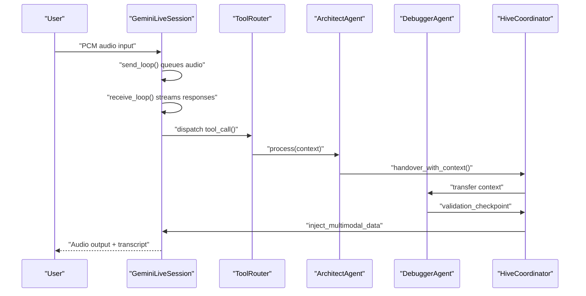

**Diagram sources**
- [session.py](file://core/ai/session.py#L237-L478)
- [tools_router.py](file://core/tools/router.py#L234-L360)
- [architect.py](file://core/ai/agents/specialists/architect.py#L116-L132)
- [debugger.py](file://core/ai/agents/specialists/debugger.py#L87-L101)
- [hive.py](file://core/ai/hive.py#L324-L421)

## Detailed Component Analysis

### Enhanced Gemini Live Session
GeminiLiveSession establishes a WebSocket connection to Gemini's Live API, manages bidirectional audio streaming, tool call dispatch, multimodal injection, and interruption handling. It integrates with automated improvement systems and enhanced multimodal processing.

Key responsibilities:
- Build session configuration with tools, voice preferences, and system instruction
- Structured concurrency for send/receive loops with parallel tool execution
- Proactive vision pulses and backchannel empathy integration
- Enhanced multimodal injection with camera and vision tools
- Automated improvement agent integration and DNA optimization
- Usage telemetry and session lifecycle management with error recovery

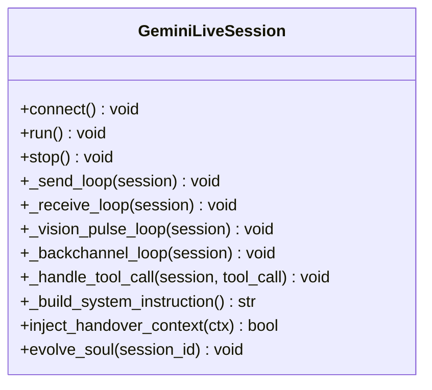

**Diagram sources**
- [session.py](file://core/ai/session.py#L43-L235)
- [session.py](file://core/ai/session.py#L237-L478)
- [session.py](file://core/ai/session.py#L623-L792)

**Section sources**
- [session.py](file://core/ai/session.py#L43-L235)
- [session.py](file://core/ai/session.py#L237-L478)
- [session.py](file://core/ai/session.py#L623-L792)

### Enhanced Agent Management and Routing
The IntelligenceRouter selects the best agent for a user intent using keyword rules, semantic similarity, and a fallback orchestrator. The enhanced AgentRegistry stores agent metadata, capabilities, and semantic fingerprints for advanced routing.


**Diagram sources**
- [router.py](file://core/ai/router.py#L14-L84)
- [registry.py](file://core/ai/agents/registry.py#L30-L98)

**Section sources**
- [router.py](file://core/ai/router.py#L14-L84)
- [registry.py](file://core/ai/agents/registry.py#L30-L98)

### Multi-Agent Hive Swarm Intelligence and Deep Handover
The HiveCoordinator orchestrates expert souls, prepares and completes handovers, maintains context snapshots, applies neural summarization, and manages multi-agent collaboration. It integrates telemetry, rollback mechanisms, and validation checkpoints.

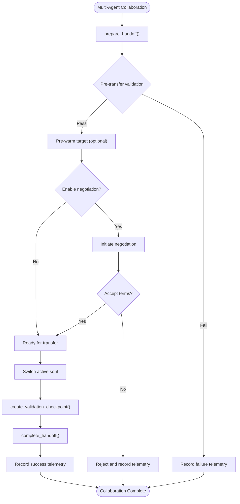

**Diagram sources**
- [hive.py](file://core/ai/hive.py#L181-L420)
- [compression.py](file://core/ai/compression.py#L41-L115)
- [manager.py](file://core/ai/handover/manager.py#L207-L580)

**Section sources**
- [hive.py](file://core/ai/hive.py#L47-L124)
- [hive.py](file://core/ai/hive.py#L181-L420)
- [compression.py](file://core/ai/compression.py#L24-L115)
- [manager.py](file://core/ai/handover/manager.py#L207-L580)

### Advanced Tool Execution System (Neural Router)
The ToolRouter declares functions for Gemini, dispatches calls with biometric middleware, performs semantic recovery, profiles execution latency, and ensures A2A protocol compliance. It integrates LocalVectorStore for semantic search and enhanced error handling.

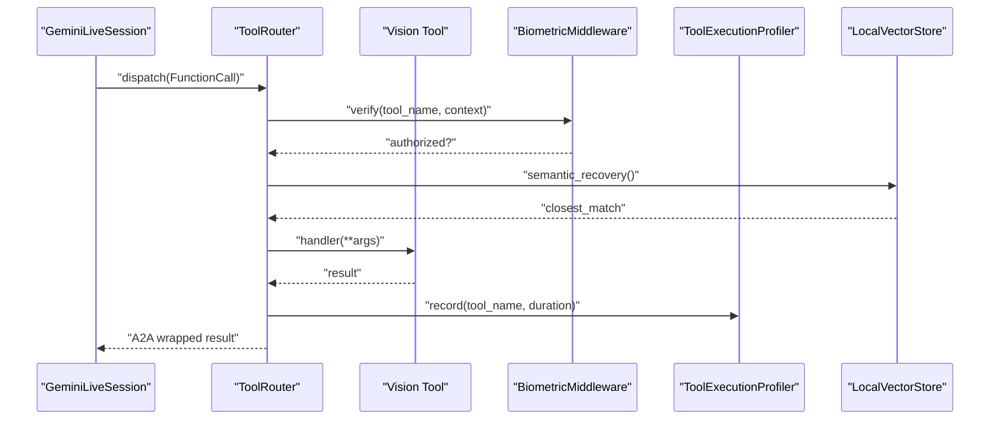

**Diagram sources**
- [tools_router.py](file://core/tools/router.py#L234-L360)
- [vision_tool.py](file://core/tools/vision_tool.py#L19-L75)

**Section sources**
- [tools_router.py](file://core/tools/router.py#L120-L360)
- [vector_store.py](file://core/tools/vector_store.py#L21-L112)

### Enhanced Multimodal Integration
Vision and camera tools provide spatial grounding and user reaction capture. Memory tools persist and recall context with semantic search capabilities. Enhanced multimodal processing supports real-time visual feedback and automated improvement integration.

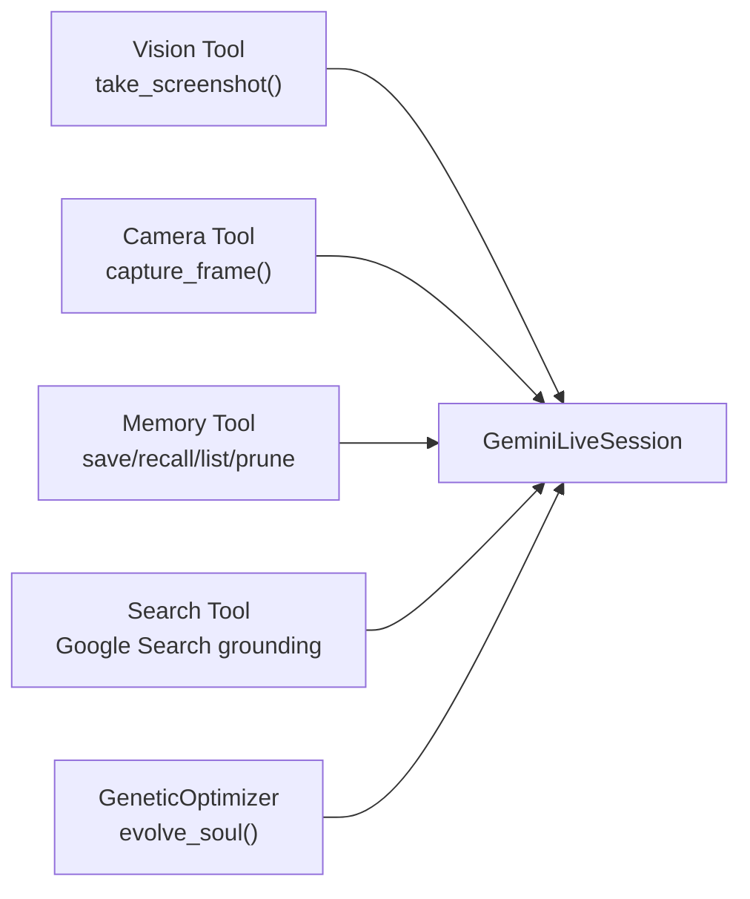

**Diagram sources**
- [vision_tool.py](file://core/tools/vision_tool.py#L19-L75)
- [camera_tool.py](file://core/tools/camera_tool.py#L16-L65)
- [memory_tool.py](file://core/tools/memory_tool.py#L40-L330)
- [search_tool.py](file://core/tools/search_tool.py#L26-L51)
- [session.py](file://core/ai/session.py#L96-L154)
- [genetic.py](file://core/ai/genetic.py#L131-L143)

**Section sources**
- [vision_tool.py](file://core/tools/vision_tool.py#L19-L75)
- [camera_tool.py](file://core/tools/camera_tool.py#L16-L65)
- [memory_tool.py](file://core/tools/memory_tool.py#L40-L330)
- [search_tool.py](file://core/tools/search_tool.py#L26-L51)
- [session.py](file://core/ai/session.py#L96-L154)
- [genetic.py](file://core/ai/genetic.py#L131-L143)

### Proactive Intervention and Enhanced Agent Specialization
The IntegratedAetherAgent orchestrates voice processing, proactive intervention, and code-aware suggestions. The enhanced ProactiveInterventionEngine detects user frustration and triggers empathetic interventions with specialized tool recommendations. Architect and Debugger agents provide collaborative design and verification workflows.

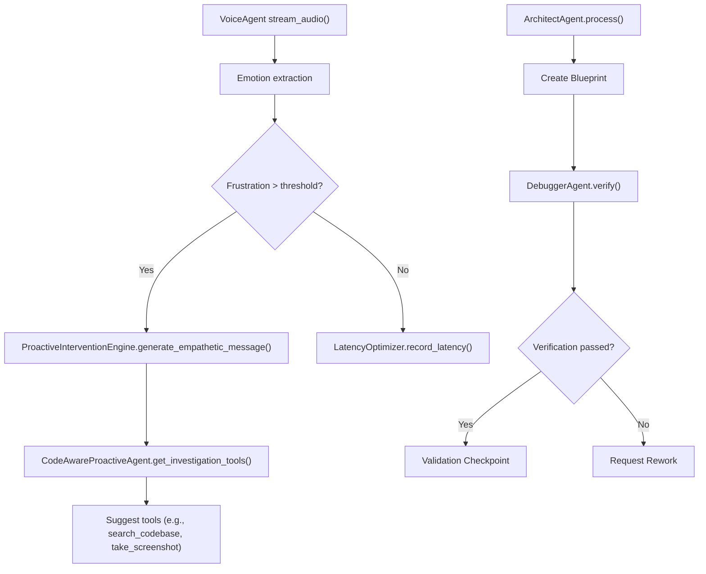

**Diagram sources**
- [integrated.py](file://core/ai/agents/integrated.py#L15-L66)
- [proactive.py](file://core/ai/agents/proactive.py#L10-L125)
- [architect.py](file://core/ai/agents/specialists/architect.py#L35-L132)
- [debugger.py](file://core/ai/agents/specialists/debugger.py#L34-L138)

**Section sources**
- [integrated.py](file://core/ai/agents/integrated.py#L15-L66)
- [proactive.py](file://core/ai/agents/proactive.py#L10-L125)
- [architect.py](file://core/ai/agents/specialists/architect.py#L35-L132)
- [debugger.py](file://core/ai/agents/specialists/debugger.py#L34-L138)

## Enhanced Agent Coordination Patterns

### Architect-Debugger Collaboration Workflow
The ArchitectAgent and DebuggerAgent work together to provide comprehensive system design and verification. The Architect creates architectural blueprints with intent confidence scoring, while the Debugger performs thorough verification and validation.

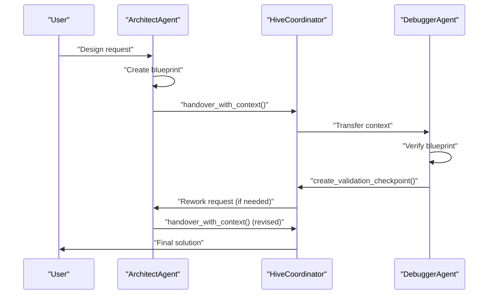

**Diagram sources**
- [architect.py](file://core/ai/agents/specialists/architect.py#L116-L132)
- [debugger.py](file://core/ai/agents/specialists/debugger.py#L195-L234)
- [manager.py](file://core/ai/handover/manager.py#L236-L294)

**Section sources**
- [architect.py](file://core/ai/agents/specialists/architect.py#L35-L132)
- [debugger.py](file://core/ai/agents/specialists/debugger.py#L34-L138)
- [manager.py](file://core/ai/handover/manager.py#L236-L294)

### Multi-Agent Orchestration Capabilities
The MultiAgentOrchestrator coordinates complex tasks across multiple agents with rich context preservation, bidirectional negotiation, validation checkpoints, and rollback capability. It supports collaborative workflows for sophisticated problem-solving.

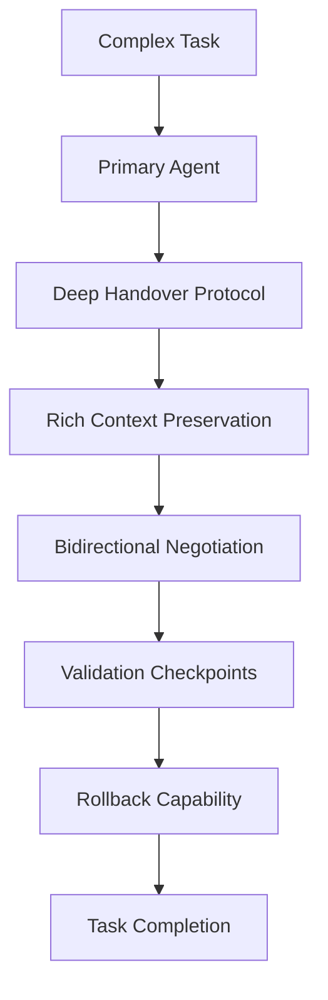

**Diagram sources**
- [manager.py](file://core/ai/handover/manager.py#L207-L580)
- [handover_telemetry.py](file://core/ai/handover_telemetry.py#L586-L606)

**Section sources**
- [manager.py](file://core/ai/handover/manager.py#L207-L580)
- [handover_telemetry.py](file://core/ai/handover_telemetry.py#L586-L606)

## Automated Improvement Agents

### Genetic Optimization and Evolutionary Patterns
The GeneticOptimizer continuously evolves agent personalities and behaviors based on performance telemetry and real-time paralinguistic analysis. It implements adaptive mutation strategies for optimal agent performance.

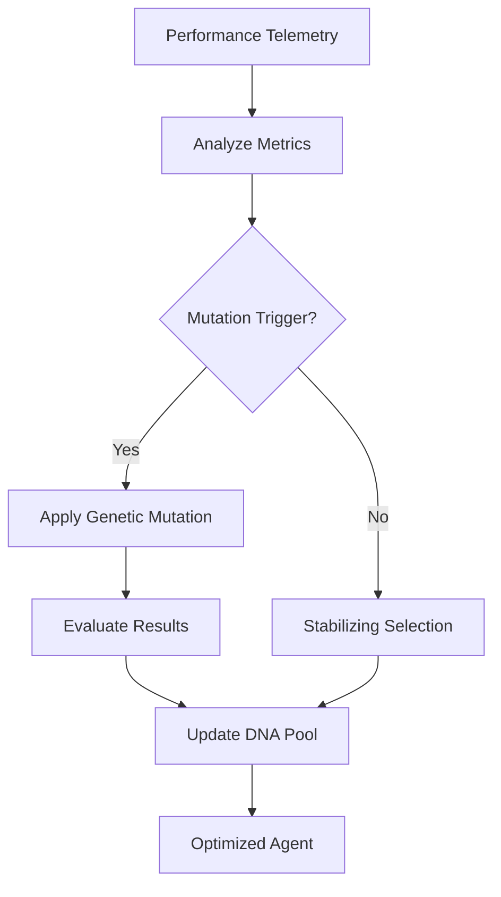

**Diagram sources**
- [genetic.py](file://core/ai/genetic.py#L82-L170)

**Section sources**
- [genetic.py](file://core/ai/genetic.py#L82-L170)

### Real-Time Paralinguistic Adaptation
The system monitors acoustic traits and applies hot mutations to agent DNA in real-time. This enables adaptive responses to user emotional states and communication patterns.

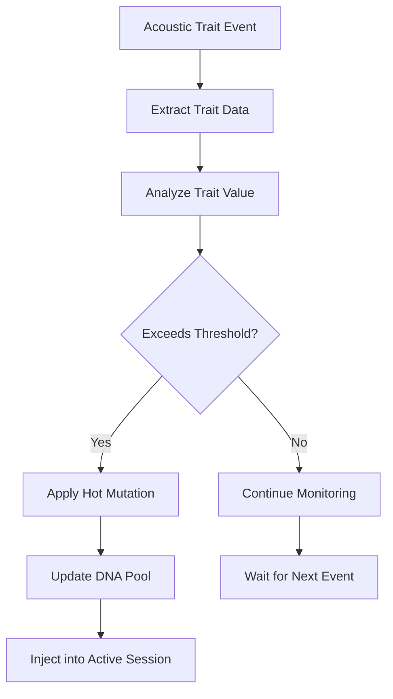

**Diagram sources**
- [genetic.py](file://core/ai/genetic.py#L702-L729)

**Section sources**
- [genetic.py](file://core/ai/genetic.py#L702-L729)

## Dependency Analysis
The enhanced AI Integration Layer exhibits clear separation of concerns with advanced coordination patterns:
- Session depends on ToolRouter, multimodal tools, and automated improvement systems
- HiveCoordinator depends on ToolRouter, NeuralSummarizer, telemetry, and multi-agent orchestration
- ToolRouter depends on LocalVectorStore, biometric middleware, and genetic optimization
- Specialized agents (Architect/Debugger) depend on multi-agent orchestration and validation systems
- Vision/Camera/Memory/Search tools are decoupled and registered dynamically
- Automated improvement agents integrate with genetic optimization and session management

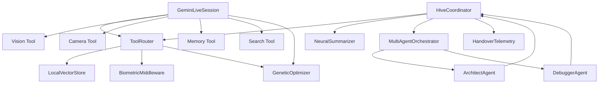

**Diagram sources**
- [session.py](file://core/ai/session.py#L43-L235)
- [hive.py](file://core/ai/hive.py#L47-L124)
- [compression.py](file://core/ai/compression.py#L24-L115)
- [tools_router.py](file://core/tools/router.py#L120-L360)
- [vector_store.py](file://core/tools/vector_store.py#L21-L112)
- [architect.py](file://core/ai/agents/specialists/architect.py#L26-L33)
- [debugger.py](file://core/ai/agents/specialists/debugger.py#L25-L32)
- [manager.py](file://core/ai/handover/manager.py#L229-L234)
- [genetic.py](file://core/ai/genetic.py#L98-L103)

**Section sources**
- [session.py](file://core/ai/session.py#L43-L235)
- [hive.py](file://core/ai/hive.py#L47-L124)
- [compression.py](file://core/ai/compression.py#L24-L115)
- [tools_router.py](file://core/tools/router.py#L120-L360)
- [vector_store.py](file://core/tools/vector_store.py#L21-L112)
- [architect.py](file://core/ai/agents/specialists/architect.py#L26-L33)
- [debugger.py](file://core/ai/agents/specialists/debugger.py#L25-L32)
- [manager.py](file://core/ai/handover/manager.py#L229-L234)
- [genetic.py](file://core/ai/genetic.py#L98-L103)

## Performance Considerations
- **Streaming audio processing**: Use structured concurrency to keep send/receive loops resilient and responsive with enhanced parallel tool execution
- **Tool execution**: Profile latency tiers, enforce idempotence, and implement semantic recovery for improved reliability
- **Context compression**: Apply NeuralSummarizer for large conversations to reduce token usage, latency, and improve handover efficiency
- **Multimodal processing**: Optimize image encoding quality and frequency for vision capture, implement camera frame caching, and balance fidelity with throughput
- **Biometric middleware**: Ensure minimal overhead by verifying only sensitive tools, cache biometric decisions, and implement fallback authorization
- **Automated improvement**: Monitor genetic optimization performance, implement adaptive mutation rates, and track evolutionary progress
- **Multi-agent coordination**: Optimize handover protocols, implement validation checkpoints, and manage agent collaboration efficiently

## Troubleshooting Guide
Common issues and remedies with enhanced system:
- **Session termination or cancellation**: Inspect structured exceptions, ensure proper shutdown of auxiliary systems, and verify automated improvement agent integration
- **Tool call failures**: Verify function declarations, biometric verification, handler signatures, semantic recovery, and A2A protocol compliance; use performance reports and error logs
- **Output queue overflow**: Monitor telemetry counters, adjust playback rate or buffer sizes, and implement enhanced error handling
- **Handover failures**: Review validation checkpoints, negotiation logs, telemetry outcomes, rollback mechanisms, and multi-agent coordination status
- **Memory tool offline**: Confirm Firebase connectivity, expect local fallback behavior, and implement semantic search recovery
- **Automated improvement failures**: Check genetic optimization telemetry, verify DNA pool consistency, and monitor evolutionary progress
- **Specialized agent coordination**: Validate Architect-Debugger collaboration, check intent confidence scoring, and ensure proper validation checkpoints

**Section sources**
- [session.py](file://core/ai/session.py#L220-L235)
- [tools_router.py](file://core/tools/router.py#L234-L360)
- [hive.py](file://core/ai/hive.py#L322-L420)
- [memory_tool.py](file://core/tools/memory_tool.py#L40-L93)
- [architect.py](file://core/ai/agents/specialists/architect.py#L171-L189)
- [debugger.py](file://core/ai/agents/specialists/debugger.py#L195-L234)
- [genetic.py](file://core/ai/genetic.py#L136-L148)

## Conclusion
The enhanced AI Integration Layer of Aether Voice OS integrates Gemini Live for real-time audio with advanced multimodal processing, orchestrates specialized agents with collaborative workflows, and coordinates collective intelligence via the Hive. The system incorporates automated improvement agents with genetic optimization, enhanced compression techniques, and expanded multimodal capabilities for efficient, context-aware AI behavior. The modular design supports extensibility, resilience, performance optimization, and continuous agent evolution.

## Appendices

### Enhanced Examples and Patterns
- **Agent specialization**: Define AgentMetadata with capabilities, semantic fingerprints, and DNA profiles; register via AgentRegistry; route via IntelligenceRouter with enhanced discovery
- **Tool creation**: Use ToolRouter.register with function declarations, biometric middleware for sensitive tools, semantic recovery, and A2A protocol compliance; leverage LocalVectorStore for semantic assistance
- **Custom AI behavior**: Extend GeminiLiveSession system instruction with soul-specific persona, injected handover context, automated improvement integration, and proactive triggers
- **Multi-agent collaboration**: Implement Architect-Debugger workflows, use MultiAgentOrchestrator for complex tasks, and establish validation checkpoints for quality assurance
- **Automated improvement**: Configure GeneticOptimizer with evolutionary parameters, implement real-time paralinguistic adaptation, and monitor DNA pool evolution
- **Enhanced multimodal processing**: Integrate vision and camera tools, implement semantic search capabilities, and utilize memory tools with priority and tag-based organization

**Section sources**
- [registry.py](file://core/ai/agents/registry.py#L11-L98)
- [router.py](file://core/ai/router.py#L14-L84)
- [tools_router.py](file://core/tools/router.py#L146-L200)
- [session.py](file://core/ai/session.py#L623-L736)
- [proactive.py](file://core/ai/agents/proactive.py#L10-L125)
- [architect.py](file://core/ai/agents/specialists/architect.py#L98-L105)
- [debugger.py](file://core/ai/agents/specialists/debugger.py#L208-L215)
- [genetic.py](file://core/ai/genetic.py#L150-L170)
- [vision_tool.py](file://core/tools/vision_tool.py#L58-L75)
- [camera_tool.py](file://core/tools/camera_tool.py#L53-L65)
- [memory_tool.py](file://core/tools/memory_tool.py#L246-L330)