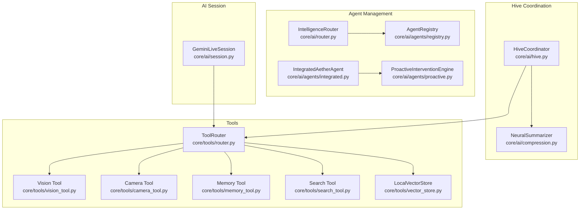
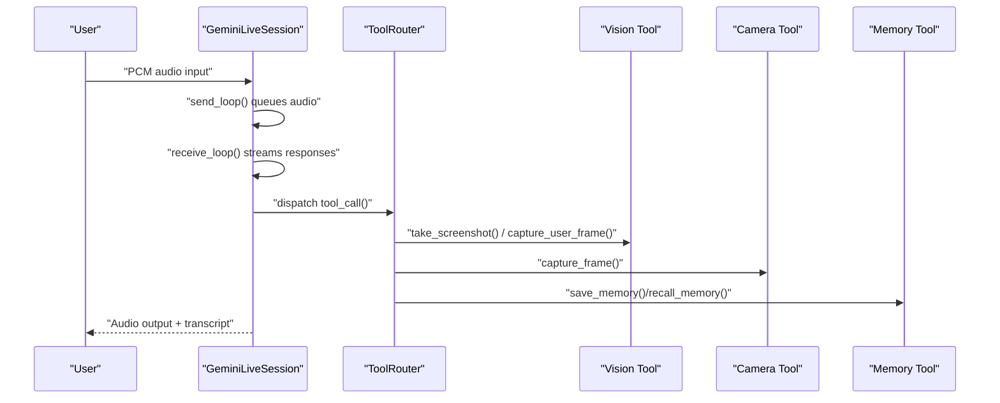
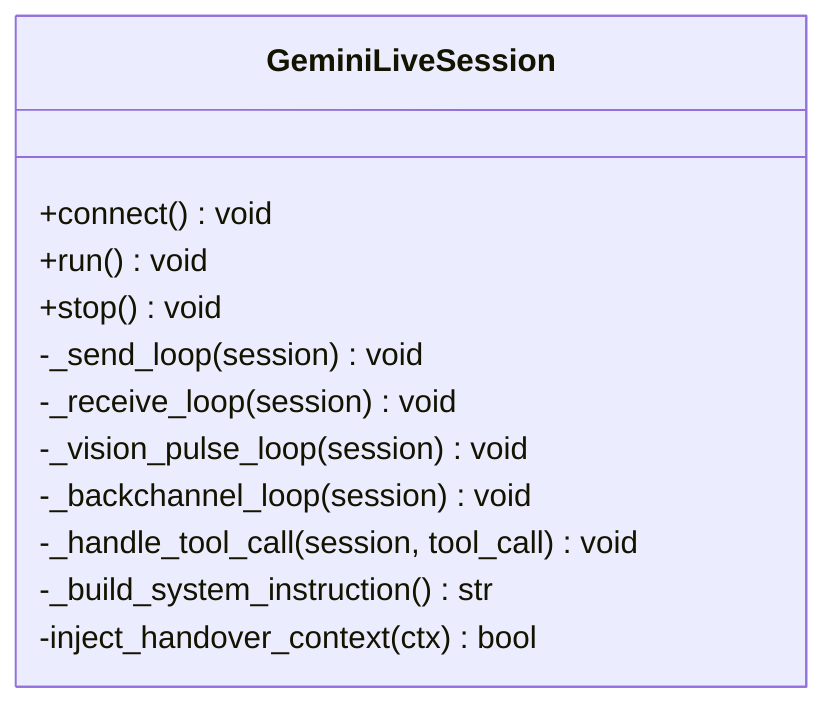
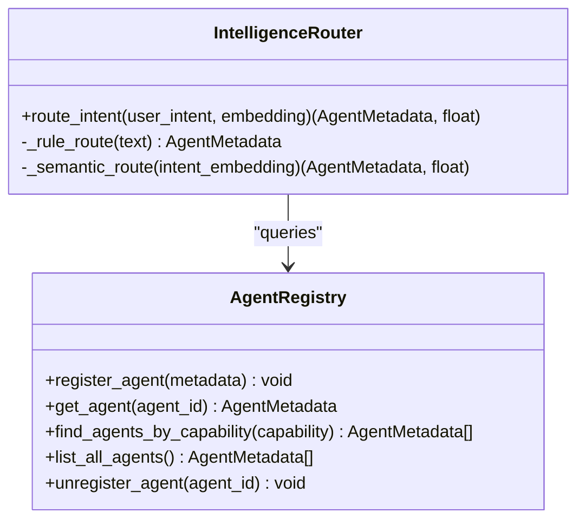
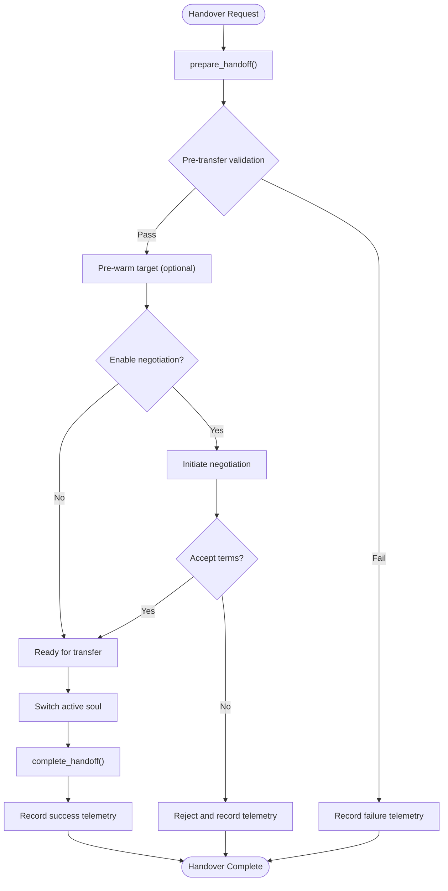
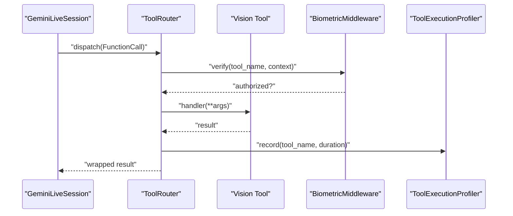
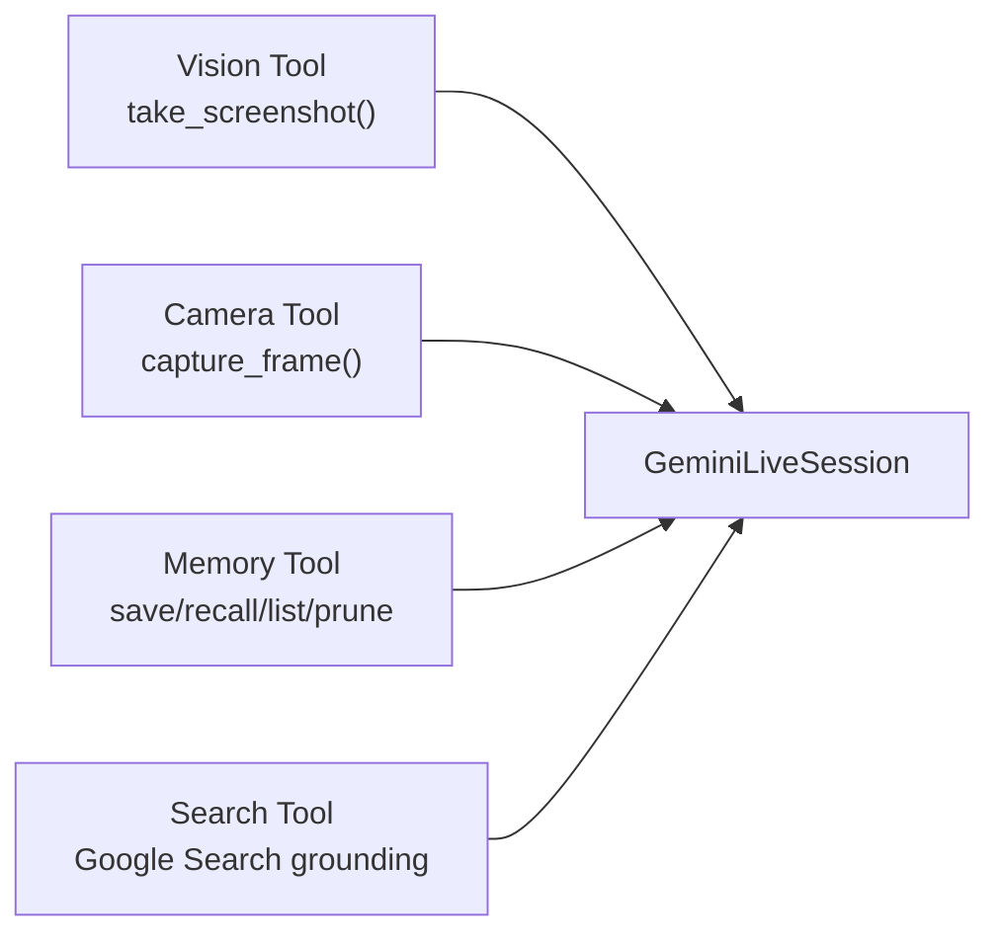
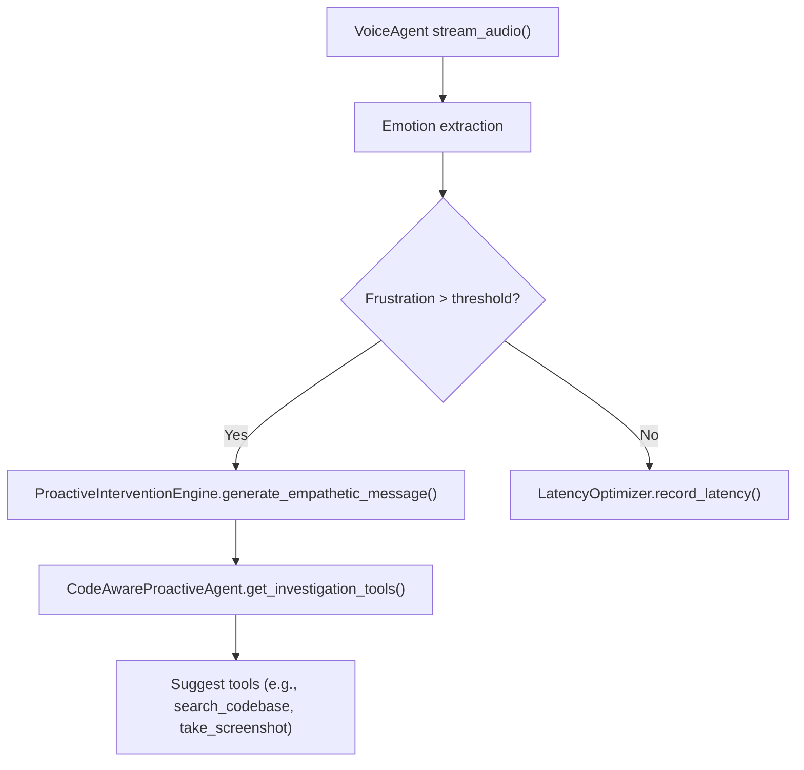
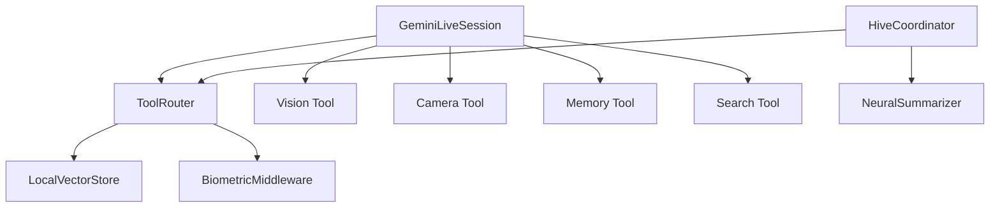

# AI Integration Layer

<cite>
**Referenced Files in This Document**
- [session.py](file://core/ai/session.py)
- [router.py](file://core/ai/router.py)
- [hive.py](file://core/ai/hive.py)
- [compression.py](file://core/ai/compression.py)
- [registry.py](file://core/ai/agents/registry.py)
- [integrated.py](file://core/ai/agents/integrated.py)
- [proactive.py](file://core/ai/agents/proactive.py)
- [tools_router.py](file://core/tools/router.py)
- [search_tool.py](file://core/tools/search_tool.py)
- [vector_store.py](file://core/tools/vector_store.py)
- [camera_tool.py](file://core/tools/camera_tool.py)
- [vision_tool.py](file://core/tools/vision_tool.py)
- [memory_tool.py](file://core/tools/memory_tool.py)
</cite>

## Table of Contents
1. [Introduction](#introduction)
2. [Project Structure](#project-structure)
3. [Core Components](#core-components)
4. [Architecture Overview](#architecture-overview)
5. [Detailed Component Analysis](#detailed-component-analysis)
6. [Dependency Analysis](#dependency-analysis)
7. [Performance Considerations](#performance-considerations)
8. [Troubleshooting Guide](#troubleshooting-guide)
9. [Conclusion](#conclusion)
10. [Appendices](#appendices)

## Introduction
This document describes the AI Integration Layer of Aether Voice OS, focusing on:
- Gemini Live API integration for real-time audio sessions
- Agent management and proactive intervention
- Tool execution via the Neural Router with biometric middleware
- Hive swarm intelligence and deep handover protocol
- Compression and optimization for efficient AI processing
- Multimodal integration (audio, vision, tools)
- Semantic search, memory coordination, and context-aware responses
- Examples of agent specialization, tool creation, and custom AI behavior
- Troubleshooting and performance optimization guidance

## Project Structure
The AI Integration Layer spans several modules:
- AI session management and streaming audio processing
- Agent registry and routing
- Hive coordinator with deep handover protocol and context compression
- Tool execution pipeline with biometric middleware and semantic search
- Multimodal tools for vision and memory persistence

**Diagram sources**
- [session.py](file://core/ai/session.py#L43-L235)
- [router.py](file://core/ai/router.py#L14-L84)
- [hive.py](file://core/ai/hive.py#L47-L124)
- [compression.py](file://core/ai/compression.py#L24-L115)
- [registry.py](file://core/ai/agents/registry.py#L30-L98)
- [integrated.py](file://core/ai/agents/integrated.py#L15-L66)
- [proactive.py](file://core/ai/agents/proactive.py#L10-L125)
- [tools_router.py](file://core/tools/router.py#L120-L360)
- [vision_tool.py](file://core/tools/vision_tool.py#L19-L75)
- [camera_tool.py](file://core/tools/camera_tool.py#L16-L65)
- [memory_tool.py](file://core/tools/memory_tool.py#L40-L330)
- [search_tool.py](file://core/tools/search_tool.py#L26-L51)
- [vector_store.py](file://core/tools/vector_store.py#L21-L112)

**Section sources**
- [session.py](file://core/ai/session.py#L1-L922)
- [router.py](file://core/ai/router.py#L1-L84)
- [hive.py](file://core/ai/hive.py#L1-L723)
- [compression.py](file://core/ai/compression.py#L1-L115)
- [registry.py](file://core/ai/agents/registry.py#L1-L98)
- [integrated.py](file://core/ai/agents/integrated.py#L1-L66)
- [proactive.py](file://core/ai/agents/proactive.py#L1-L125)
- [tools_router.py](file://core/tools/router.py#L1-L360)
- [vision_tool.py](file://core/tools/vision_tool.py#L1-L75)
- [camera_tool.py](file://core/tools/camera_tool.py#L1-L65)
- [memory_tool.py](file://core/tools/memory_tool.py#L1-L330)
- [search_tool.py](file://core/tools/search_tool.py#L1-L51)
- [vector_store.py](file://core/tools/vector_store.py#L1-L112)

## Core Components
- GeminiLiveSession: Manages bidirectional audio streaming, tool call handling, multimodal injection, and session lifecycle with structured concurrency and telemetry.
- IntelligenceRouter: Routes intents to the best agent using keyword rules, semantic embeddings, and a fallback orchestrator.
- HiveCoordinator: Orchestrates expert souls, manages deep handover protocol, context compression, validation checkpoints, and rollback.
- NeuralSummarizer: Compresses rich conversation and working memory into compact “Semantic Seeds” to reduce token overhead.
- ToolRouter: Dispatches function calls to handlers, integrates biometric middleware, and provides semantic recovery and performance profiling.
- Multimodal Tools: Vision capture, camera capture, memory persistence, and Google Search grounding.
- Agent Registry and Integrated Agent: Define agent identities, capabilities, and assemble proactive and orchestration pipelines.

**Section sources**
- [session.py](file://core/ai/session.py#L43-L235)
- [router.py](file://core/ai/router.py#L14-L84)
- [hive.py](file://core/ai/hive.py#L47-L124)
- [compression.py](file://core/ai/compression.py#L24-L115)
- [tools_router.py](file://core/tools/router.py#L120-L360)
- [vision_tool.py](file://core/tools/vision_tool.py#L19-L75)
- [camera_tool.py](file://core/tools/camera_tool.py#L16-L65)
- [memory_tool.py](file://core/tools/memory_tool.py#L40-L330)
- [search_tool.py](file://core/tools/search_tool.py#L26-L51)
- [registry.py](file://core/ai/agents/registry.py#L30-L98)
- [integrated.py](file://core/ai/agents/integrated.py#L15-L66)
- [proactive.py](file://core/ai/agents/proactive.py#L10-L125)

## Architecture Overview
The AI Integration Layer connects the audio pipeline to Gemini Live, coordinates agents and tools, and maintains context across sessions using the Hive and compression.

**Diagram sources**
- [session.py](file://core/ai/session.py#L237-L478)
- [tools_router.py](file://core/tools/router.py#L234-L360)
- [vision_tool.py](file://core/tools/vision_tool.py#L19-L75)
- [camera_tool.py](file://core/tools/camera_tool.py#L16-L65)
- [memory_tool.py](file://core/tools/memory_tool.py#L40-L330)

## Detailed Component Analysis

### Gemini Live Session
GeminiLiveSession establishes a WebSocket connection to Gemini’s Live API, manages bidirectional audio streaming, tool call dispatch, multimodal injection, and interruption handling. It wires in auxiliary systems like the Thalamic Gate and proactive vision pulses.

Key responsibilities:
- Build session configuration with tools, voice preferences, and system instruction
- Structured concurrency for send/receive loops
- Proactive vision pulses and backchannel empathy
- Tool call parallel execution and multimodal injection
- Usage telemetry and session lifecycle management

**Diagram sources**
- [session.py](file://core/ai/session.py#L43-L235)
- [session.py](file://core/ai/session.py#L237-L478)
- [session.py](file://core/ai/session.py#L623-L792)

**Section sources**
- [session.py](file://core/ai/session.py#L43-L235)
- [session.py](file://core/ai/session.py#L237-L478)
- [session.py](file://core/ai/session.py#L623-L792)

### Agent Management and Routing
The IntelligenceRouter selects the best agent for a user intent using keyword rules, semantic similarity, and a fallback orchestrator. The AgentRegistry stores agent metadata and capabilities.

**Diagram sources**
- [router.py](file://core/ai/router.py#L14-L84)
- [registry.py](file://core/ai/agents/registry.py#L30-L98)

**Section sources**
- [router.py](file://core/ai/router.py#L14-L84)
- [registry.py](file://core/ai/agents/registry.py#L30-L98)

### Hive Swarm Intelligence and Deep Handover
The HiveCoordinator orchestrates expert souls, prepares and completes handovers, maintains context snapshots, and applies neural summarization to compress context. It integrates telemetry and rollback mechanisms.

**Diagram sources**
- [hive.py](file://core/ai/hive.py#L181-L420)
- [compression.py](file://core/ai/compression.py#L41-L115)

**Section sources**
- [hive.py](file://core/ai/hive.py#L47-L124)
- [hive.py](file://core/ai/hive.py#L181-L420)
- [compression.py](file://core/ai/compression.py#L24-L115)

### Tool Execution System (Neural Router)
The ToolRouter declares functions for Gemini, dispatches calls with biometric middleware, performs semantic recovery, and profiles execution latency. It integrates a LocalVectorStore for semantic search.

**Diagram sources**
- [tools_router.py](file://core/tools/router.py#L234-L360)
- [vision_tool.py](file://core/tools/vision_tool.py#L19-L75)

**Section sources**
- [tools_router.py](file://core/tools/router.py#L120-L360)
- [vector_store.py](file://core/tools/vector_store.py#L21-L112)

### Multimodal Integration
Vision and camera tools provide spatial grounding and user reaction capture. Memory tools persist and recall context. Search grounding reduces hallucinations.

**Diagram sources**
- [vision_tool.py](file://core/tools/vision_tool.py#L19-L75)
- [camera_tool.py](file://core/tools/camera_tool.py#L16-L65)
- [memory_tool.py](file://core/tools/memory_tool.py#L40-L330)
- [search_tool.py](file://core/tools/search_tool.py#L26-L51)
- [session.py](file://core/ai/session.py#L96-L154)

**Section sources**
- [vision_tool.py](file://core/tools/vision_tool.py#L19-L75)
- [camera_tool.py](file://core/tools/camera_tool.py#L16-L65)
- [memory_tool.py](file://core/tools/memory_tool.py#L40-L330)
- [search_tool.py](file://core/tools/search_tool.py#L26-L51)
- [session.py](file://core/ai/session.py#L96-L154)

### Proactive Intervention and Agent Specialization
The IntegratedAetherAgent orchestrates voice processing, proactive intervention, and code-aware suggestions. The ProactiveInterventionEngine detects user frustration and triggers empathetic interventions.

**Diagram sources**
- [integrated.py](file://core/ai/agents/integrated.py#L15-L66)
- [proactive.py](file://core/ai/agents/proactive.py#L10-L125)

**Section sources**
- [integrated.py](file://core/ai/agents/integrated.py#L15-L66)
- [proactive.py](file://core/ai/agents/proactive.py#L10-L125)

## Dependency Analysis
The AI Integration Layer exhibits clear separation of concerns:
- Session depends on ToolRouter, Thalamic Gate, and multimodal tools
- HiveCoordinator depends on ToolRouter, NeuralSummarizer, and telemetry
- ToolRouter depends on LocalVectorStore and biometric middleware
- Vision/Camera/Memory/Search tools are decoupled and registered dynamically

**Diagram sources**
- [session.py](file://core/ai/session.py#L43-L235)
- [hive.py](file://core/ai/hive.py#L47-L124)
- [compression.py](file://core/ai/compression.py#L24-L115)
- [tools_router.py](file://core/tools/router.py#L120-L360)
- [vector_store.py](file://core/tools/vector_store.py#L21-L112)

**Section sources**
- [session.py](file://core/ai/session.py#L43-L235)
- [hive.py](file://core/ai/hive.py#L47-L124)
- [compression.py](file://core/ai/compression.py#L24-L115)
- [tools_router.py](file://core/tools/router.py#L120-L360)
- [vector_store.py](file://core/tools/vector_store.py#L21-L112)

## Performance Considerations
- Streaming audio processing: Use structured concurrency to keep send/receive loops resilient and responsive.
- Tool execution: Profile latency tiers and enforce idempotence where possible to reduce retries.
- Context compression: Apply NeuralSummarizer for large conversations to reduce token usage and latency.
- Vision capture: Optimize image encoding quality and frequency to balance fidelity and throughput.
- Biometric middleware: Ensure minimal overhead by verifying only sensitive tools and caching decisions where safe.

[No sources needed since this section provides general guidance]

## Troubleshooting Guide
Common issues and remedies:
- Session termination or cancellation: Inspect structured exceptions and ensure proper shutdown of auxiliary systems (e.g., Thalamic Gate).
- Tool call failures: Verify function declarations, biometric verification, and handler signatures; use semantic recovery and performance reports.
- Output queue overflow: Monitor telemetry counters and adjust playback rate or buffer sizes.
- Handover failures: Review validation checkpoints, negotiation logs, and telemetry outcomes; leverage rollback when available.
- Memory tool offline: Confirm Firebase connectivity; expect local fallback behavior.

**Section sources**
- [session.py](file://core/ai/session.py#L220-L235)
- [tools_router.py](file://core/tools/router.py#L234-L360)
- [hive.py](file://core/ai/hive.py#L322-L420)
- [memory_tool.py](file://core/tools/memory_tool.py#L40-L93)

## Conclusion
The AI Integration Layer of Aether Voice OS integrates Gemini Live for real-time audio, orchestrates agents and tools with proactive intervention, and coordinates collective intelligence via the Hive. Compression, multimodal grounding, and semantic search enable efficient, context-aware AI behavior. The modular design supports extensibility, resilience, and performance optimization.

[No sources needed since this section summarizes without analyzing specific files]

## Appendices

### Examples and Patterns
- Agent specialization: Define AgentMetadata with capabilities and semantic fingerprints; register via AgentRegistry; route via IntelligenceRouter.
- Tool creation: Use ToolRouter.register with function declarations; integrate biometric middleware for sensitive tools; leverage LocalVectorStore for semantic recovery.
- Custom AI behavior: Extend GeminiLiveSession system instruction with soul-specific persona and injected handover context; add proactive triggers and empathy cues.

**Section sources**
- [registry.py](file://core/ai/agents/registry.py#L11-L98)
- [router.py](file://core/ai/router.py#L14-L84)
- [tools_router.py](file://core/tools/router.py#L146-L200)
- [session.py](file://core/ai/session.py#L623-L736)
- [proactive.py](file://core/ai/agents/proactive.py#L10-L125)