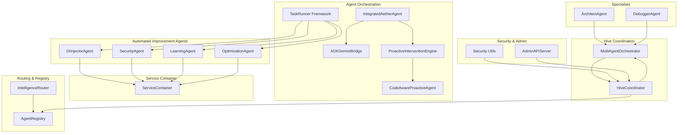
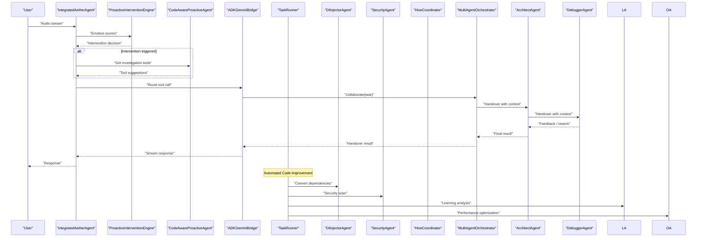
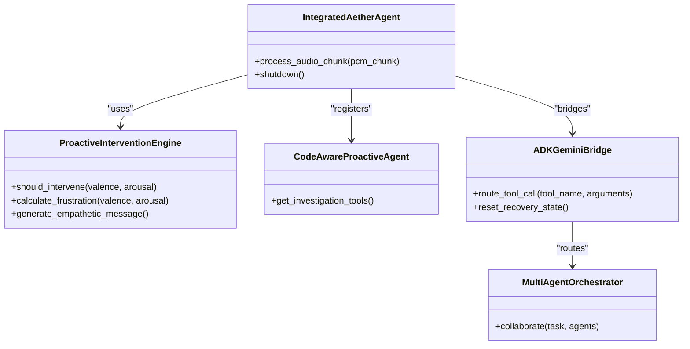
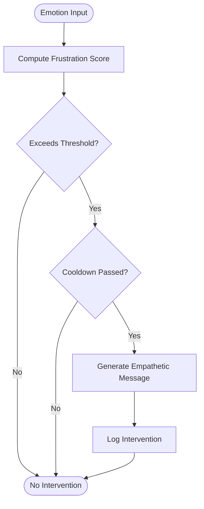
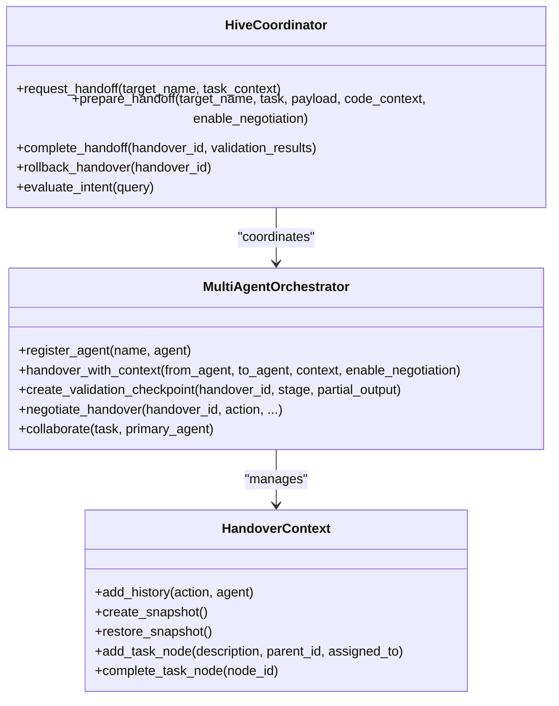
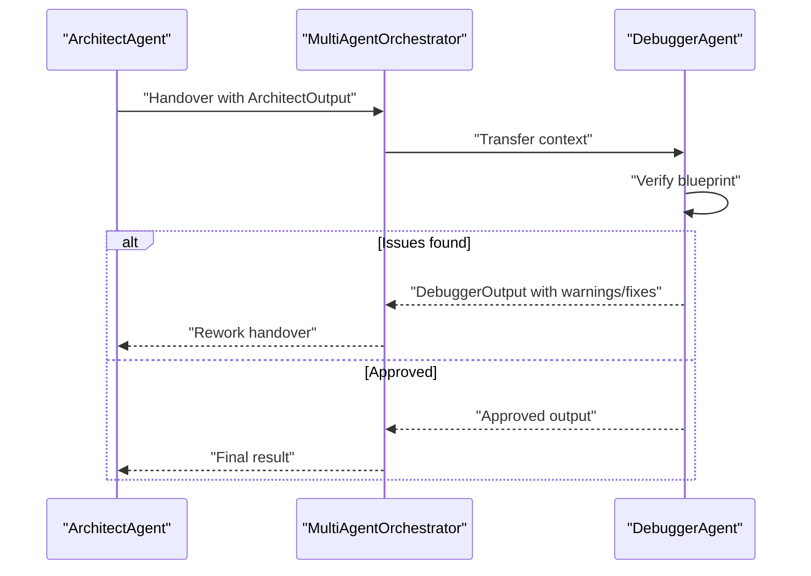
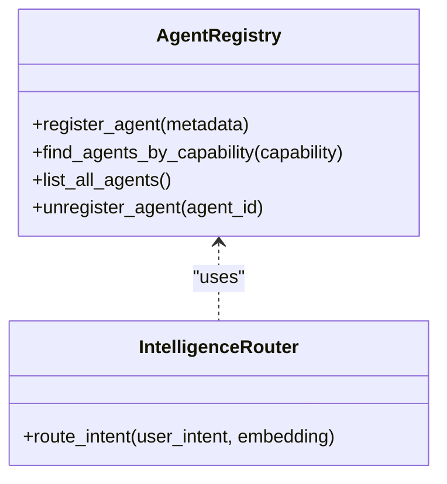
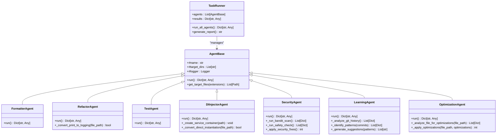
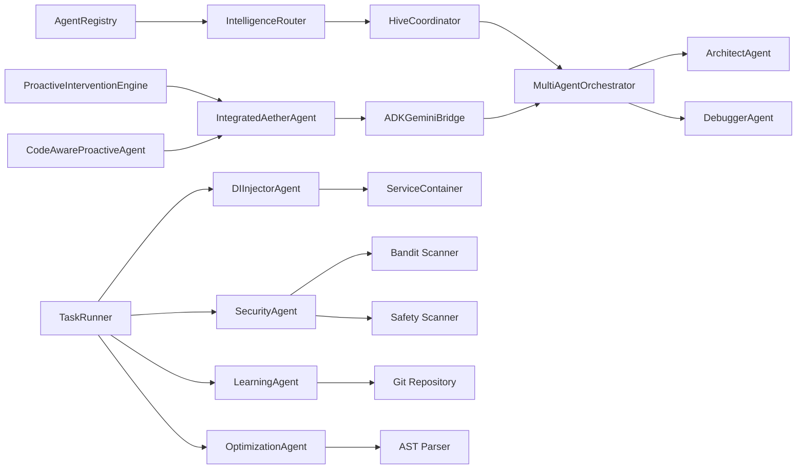

# Agent Management System

<cite>
**Referenced Files in This Document**
- [integrated.py](file://core/ai/agents/integrated.py)
- [proactive.py](file://core/ai/agents/proactive.py)
- [bridge.py](file://core/ai/agents/bridge.py)
- [registry.py](file://core/ai/agents/registry.py)
- [router.py](file://core/ai/router.py)
- [hive.py](file://core/ai/hive.py)
- [manager.py](file://core/ai/handover/manager.py)
- [handover_protocol.py](file://core/ai/handover_protocol.py)
- [architect.py](file://core/ai/agents/specialists/architect.py)
- [debugger.py](file://core/ai/agents/specialists/debugger.py)
- [security.py](file://core/utils/security.py)
- [admin_api.py](file://core/services/admin_api.py)
- [Skills.md](file://brain/personas/Skills.md)
- [di_injector.py](file://agents/di_injector.py)
- [security_agent.py](file://agents/security_agent.py)
- [learning_agent.py](file://agents/learning_agent.py)
- [optimization_agent.py](file://agents/optimization_agent.py)
- [task_runner.py](file://task_runner.py)
- [service_container.py](file://core/infra/service_container.py)
</cite>

## Update Summary
**Changes Made**
- Added comprehensive documentation for new AI agent ecosystem including DI Injector Agent, Security Agent, Learning Agent, and Optimization Agent
- Documented the TaskRunner framework for orchestrating automated code improvement agents
- Enhanced agent coordination patterns with new specialized agents for automated code improvement
- Updated architecture diagrams to reflect the expanded agent ecosystem
- Added new sections covering dependency injection patterns, security scanning, learning from git history, and performance optimization

## Table of Contents
1. [Introduction](#introduction)
2. [Project Structure](#project-structure)
3. [Core Components](#core-components)
4. [Architecture Overview](#architecture-overview)
5. [Detailed Component Analysis](#detailed-component-analysis)
6. [Enhanced Agent Ecosystem](#enhanced-agent-ecosystem)
7. [Dependency Analysis](#dependency-analysis)
8. [Performance Considerations](#performance-considerations)
9. [Troubleshooting Guide](#troubleshooting-guide)
10. [Conclusion](#conclusion)
11. [Appendices](#appendices)

## Introduction
This document describes the Agent Management System that powers the Aether Voice OS. It covers agent registration, task orchestration, proactive intervention, and the integrated agent architecture. The system now includes a comprehensive AI agent ecosystem featuring specialized agents for automated code improvement, including dependency injection conversion, security scanning, learning from git history, and performance optimization. It explains the bridge agent system for cross-agent communication and task delegation, the proactive agent functionality for autonomous task initiation and context-aware interventions, and the hive swarm intelligence system for collective agent coordination and distributed decision-making. It also documents agent specialization patterns, personality configurations, expertise domains, lifecycle management, handover protocols, security, resource management, and fault tolerance. Guidance is included for developing custom agents and extending the agent ecosystem.

## Project Structure
The Agent Management System spans several modules with an expanded agent ecosystem:
- Agent orchestration and integration: Integrated agent pipeline, proactive intervention, and bridge to external tooling.
- Specialized agents: Architect Expert and Debugger, coordinated via the Deep Handover Protocol.
- Automated improvement agents: DI Injector, Security Agent, Learning Agent, and Optimization Agent for continuous code enhancement.
- Hive coordinator: Centralized orchestration with deep handover, negotiation, validation checkpoints, and rollback.
- Routing and registry: Intelligent routing of intents to the best agent and centralized agent registry.
- TaskRunner framework: Orchestrates automated code improvement workflows for solo developer productivity.
- Security and admin: Signature verification utilities and a local admin API for telemetry and system state.

**Diagram sources**
- [integrated.py](file://core/ai/agents/integrated.py#L15-L66)
- [bridge.py](file://core/ai/agents/bridge.py#L7-L35)
- [proactive.py](file://core/ai/agents/proactive.py#L10-L125)
- [architect.py](file://core/ai/agents/specialists/architect.py#L20-L133)
- [debugger.py](file://core/ai/agents/specialists/debugger.py#L20-L139)
- [di_injector.py](file://agents/di_injector.py#L15-L56)
- [security_agent.py](file://agents/security_agent.py#L15-L67)
- [learning_agent.py](file://agents/learning_agent.py#L17-L66)
- [optimization_agent.py](file://agents/optimization_agent.py#L16-L59)
- [task_runner.py](file://task_runner.py#L213-L251)
- [service_container.py](file://core/infra/service_container.py#L9-L50)
- [hive.py](file://core/ai/hive.py#L47-L124)
- [manager.py](file://core/ai/handover/manager.py#L207-L394)
- [router.py](file://core/ai/router.py#L14-L84)
- [registry.py](file://core/ai/agents/registry.py#L30-L98)
- [security.py](file://core/utils/security.py#L18-L71)
- [admin_api.py](file://core/services/admin_api.py#L88-L117)

**Section sources**
- [integrated.py](file://core/ai/agents/integrated.py#L15-L66)
- [hive.py](file://core/ai/hive.py#L47-L124)
- [manager.py](file://core/ai/handover/manager.py#L207-L394)
- [router.py](file://core/ai/router.py#L14-L84)
- [registry.py](file://core/ai/agents/registry.py#L30-L98)
- [security.py](file://core/utils/security.py#L18-L71)
- [admin_api.py](file://core/services/admin_api.py#L88-L117)
- [task_runner.py](file://task_runner.py#L213-L251)
- [di_injector.py](file://agents/di_injector.py#L15-L56)
- [security_agent.py](file://agents/security_agent.py#L15-L67)
- [learning_agent.py](file://agents/learning_agent.py#L17-L66)
- [optimization_agent.py](file://agents/optimization_agent.py#L16-L59)
- [service_container.py](file://core/infra/service_container.py#L9-L50)

## Core Components
- IntegratedAetherAgent: Master wrapper that composes the voice pipeline, proactive intervention, code-aware proactive agent, ADK bridge, and latency optimizer.
- ProactiveInterventionEngine: Emotion-driven intervention engine that detects frustration and triggers empathetic responses.
- CodeAwareProactiveAgent: Context-aware agent that suggests tools for investigation during interventions.
- ADKGeminiBridge: Routes tool calls from Gemini sessions to ADK agents and tracks semantic recovery.
- TaskRunner Framework: Orchestrates automated code improvement agents including formatting, refactoring, testing, dependency injection, security scanning, learning, and optimization.
- DIInjectorAgent: Converts direct dependencies to dependency injection pattern with automatic service container creation.
- SecurityAgent: Performs security scanning using bandit and safety tools, with automated fixes for common vulnerabilities.
- LearningAgent: Analyzes git commit history to identify patterns and generate improvement suggestions.
- OptimizationAgent: Automatically identifies and applies performance optimizations in Python code.
- HiveCoordinator: Orchestrates the hive with deep handover protocol, negotiation, validation checkpoints, and rollback.
- MultiAgentOrchestrator: Manages handovers between specialists, validation checkpoints, and telemetry.
- ArchitectAgent and DebuggerAgent: Specialized agents that collaborate via the deep handover protocol for design and verification.
- IntelligenceRouter and AgentRegistry: Route intents to the best agent and manage agent identities and capabilities.
- ServiceContainer: Singleton service container for dependency injection pattern implementation.
- Security utilities and Admin API: Provide cryptographic verification and expose system telemetry.

**Section sources**
- [integrated.py](file://core/ai/agents/integrated.py#L15-L66)
- [proactive.py](file://core/ai/agents/proactive.py#L10-L125)
- [bridge.py](file://core/ai/agents/bridge.py#L7-L35)
- [task_runner.py](file://task_runner.py#L213-L251)
- [di_injector.py](file://agents/di_injector.py#L15-L56)
- [security_agent.py](file://agents/security_agent.py#L15-L67)
- [learning_agent.py](file://agents/learning_agent.py#L17-L66)
- [optimization_agent.py](file://agents/optimization_agent.py#L16-L59)
- [service_container.py](file://core/infra/service_container.py#L9-L50)
- [hive.py](file://core/ai/hive.py#L47-L124)
- [manager.py](file://core/ai/handover/manager.py#L207-L394)
- [architect.py](file://core/ai/agents/specialists/architect.py#L20-L133)
- [debugger.py](file://core/ai/agents/specialists/debugger.py#L20-L139)
- [router.py](file://core/ai/router.py#L14-L84)
- [registry.py](file://core/ai/agents/registry.py#L30-L98)
- [security.py](file://core/utils/security.py#L18-L71)
- [admin_api.py](file://core/services/admin_api.py#L88-L117)

## Architecture Overview
The system integrates voice processing, proactive intervention, specialized agents, and an expanded ecosystem of automated improvement agents behind a unified orchestration layer. The TaskRunner framework orchestrates automated workflows for code quality, security, and performance optimization. The HiveCoordinator coordinates deep handovers with negotiation, validation checkpoints, and rollback. The MultiAgentOrchestrator delegates tasks to specialists and preserves context across transitions. The IntelligenceRouter selects the best agent based on intent semantics and keyword rules, while the AgentRegistry maintains agent identities and capabilities.

**Diagram sources**
- [integrated.py](file://core/ai/agents/integrated.py#L39-L61)
- [proactive.py](file://core/ai/agents/proactive.py#L60-L83)
- [bridge.py](file://core/ai/agents/bridge.py#L17-L31)
- [manager.py](file://core/ai/handover/manager.py#L581-L631)
- [architect.py](file://core/ai/agents/specialists/architect.py#L116-L132)
- [debugger.py](file://core/ai/agents/specialists/debugger.py#L195-L234)
- [task_runner.py](file://task_runner.py#L213-L251)
- [di_injector.py](file://agents/di_injector.py#L24-L56)
- [security_agent.py](file://agents/security_agent.py#L23-L67)
- [learning_agent.py](file://agents/learning_agent.py#L26-L66)
- [optimization_agent.py](file://agents/optimization_agent.py#L25-L59)

## Detailed Component Analysis

### Integrated Agent Pipeline
The IntegratedAetherAgent initializes and coordinates:
- VoiceAgent streaming and emotion extraction
- ProactiveInterventionEngine for empathy-driven interventions
- CodeAwareProactiveAgent for context-aware tool suggestions
- ADKGeminiBridge for tool routing
- LatencyOptimizer for performance tracking

**Diagram sources**
- [integrated.py](file://core/ai/agents/integrated.py#L25-L38)
- [proactive.py](file://core/ai/agents/proactive.py#L10-L89)
- [bridge.py](file://core/ai/agents/bridge.py#L13-L31)
- [manager.py](file://core/ai/handover/manager.py#L581-L631)

**Section sources**
- [integrated.py](file://core/ai/agents/integrated.py#L15-L66)
- [proactive.py](file://core/ai/agents/proactive.py#L10-L125)
- [bridge.py](file://core/ai/agents/bridge.py#L7-L35)
- [manager.py](file://core/ai/handover/manager.py#L581-L631)

### Proactive Intervention Engine
The ProactiveInterventionEngine:
- Computes frustration from acoustic valence/arousal
- Applies dynamic baselines and thresholds
- Enforces cooldowns
- Generates empathetic messages

**Diagram sources**
- [proactive.py](file://core/ai/agents/proactive.py#L30-L83)

**Section sources**
- [proactive.py](file://core/ai/agents/proactive.py#L10-L125)

### Code-Aware Proactive Agent
The CodeAwareProactiveAgent suggests investigation tools during interventions, including codebase search and screenshot capture.

**Section sources**
- [proactive.py](file://core/ai/agents/proactive.py#L92-L125)

### Bridge Agent System
The ADKGeminiBridge:
- Receives tool calls from Gemini
- Routes them to the orchestrator
- Tracks semantic recovery

**Section sources**
- [bridge.py](file://core/ai/agents/bridge.py#L7-L35)

### Hive Swarm Intelligence
The HiveCoordinator:
- Tracks the active "soul" (expert)
- Finds the best expert for a task
- Manages rich context transfer, pre/post validation, and rollback
- Integrates neural summarization and genetic evolution

**Diagram sources**
- [hive.py](file://core/ai/hive.py#L47-L124)
- [manager.py](file://core/ai/handover/manager.py#L207-L394)
- [handover_protocol.py](file://core/ai/handover_protocol.py#L107-L246)

**Section sources**
- [hive.py](file://core/ai/hive.py#L47-L723)
- [manager.py](file://core/ai/handover/manager.py#L207-L631)
- [handover_protocol.py](file://core/ai/handover_protocol.py#L107-L246)

### Specialized Agents: Architect and Debugger
ArchitectAgent:
- Builds architectural blueprints
- Adds decisions, risks, and task nodes
- Requests Debugger verification via deep handover

DebuggerAgent:
- Verifies designs and identifies issues
- Produces warnings and proposed fixes
- Requests rework when necessary

**Diagram sources**
- [architect.py](file://core/ai/agents/specialists/architect.py#L35-L132)
- [debugger.py](file://core/ai/agents/specialists/debugger.py#L34-L139)
- [manager.py](file://core/ai/handover/manager.py#L53-L165)

**Section sources**
- [architect.py](file://core/ai/agents/specialists/architect.py#L20-L189)
- [debugger.py](file://core/ai/agents/specialists/debugger.py#L20-L272)
- [manager.py](file://core/ai/handover/manager.py#L37-L205)

### Agent Registration and Routing
AgentRegistry:
- Stores agent metadata, capabilities, and semantic fingerprints
- Supports discovery by capability and unregistration

IntelligenceRouter:
- Keyword-based routing for system commands
- Semantic similarity routing using embeddings
- Fallback to the orchestrator

**Diagram sources**
- [registry.py](file://core/ai/agents/registry.py#L30-L98)
- [router.py](file://core/ai/router.py#L14-L84)

**Section sources**
- [registry.py](file://core/ai/agents/registry.py#L30-L98)
- [router.py](file://core/ai/router.py#L14-L84)

### Agent Lifecycle Management
Lifecycle encompasses initialization, task assignment, collaboration, and termination:
- Initialization: IntegratedAetherAgent and HiveCoordinator construct orchestrators and registries.
- Task Assignment: IntelligenceRouter selects the best agent; MultiAgentOrchestrator delegates via deep handover.
- Collaboration: Architect and Debugger exchange validated outputs with checkpoints and rework handovers.
- Termination: Handover completion, telemetry recording, and cleanup.

**Section sources**
- [integrated.py](file://core/ai/agents/integrated.py#L25-L38)
- [hive.py](file://core/ai/hive.py#L111-L124)
- [manager.py](file://core/ai/handover/manager.py#L262-L394)

### Handover Protocol Details
The Deep Handover Protocol defines:
- HandoverContext with rich metadata, task trees, working memory, and snapshots
- ArchitectOutput and DebuggerOutput schemas
- Negotiation, validation checkpoints, and rollback
- Serialization and diff utilities

**Diagram sources**
- [handover_protocol.py](file://core/ai/handover_protocol.py#L107-L246)
- [handover_protocol.py](file://core/ai/handover_protocol.py#L284-L381)
- [handover_protocol.py](file://core/ai/handover_protocol.py#L421-L457)
- [handover_protocol.py](file://core/ai/handover_protocol.py#L583-L728)
- [handover_protocol.py](file://core/ai/handover_protocol.py#L525-L570)

**Section sources**
- [handover_protocol.py](file://core/ai/handover_protocol.py#L107-L800)

### Security and Fault Tolerance
Security:
- Ed25519 signature verification and keypair generation for agent identity and integrity.

Fault Tolerance:
- Snapshot/rollback capability in HandoverContext
- Validation checkpoints for iterative refinement
- Telemetry and analytics reporting
- Admin API for monitoring system state

**Section sources**
- [security.py](file://core/utils/security.py#L18-L71)
- [handover_protocol.py](file://core/ai/handover_protocol.py#L175-L198)
- [manager.py](file://core/ai/handover/manager.py#L395-L464)
- [admin_api.py](file://core/services/admin_api.py#L88-L117)

### Examples and Use Cases
- Agent Creation: Register agents via AgentRegistry and bootstrap defaults.
- Task Routing: Use IntelligenceRouter to select the best agent based on intent.
- Performance Monitoring: Observe telemetry via Admin API endpoints.
- Proactive Intervention: Trigger empathetic responses when frustration thresholds are met.
- Handover: Architect hands off to Debugger with rich context and negotiation support.
- Automated Code Improvement: Use TaskRunner to orchestrate DI conversion, security scanning, learning analysis, and optimization.

**Section sources**
- [registry.py](file://core/ai/agents/registry.py#L78-L98)
- [router.py](file://core/ai/router.py#L22-L48)
- [admin_api.py](file://core/services/admin_api.py#L37-L74)
- [proactive.py](file://core/ai/agents/proactive.py#L60-L83)
- [manager.py](file://core/ai/handover/manager.py#L262-L394)
- [task_runner.py](file://task_runner.py#L213-L251)

## Enhanced Agent Ecosystem

### TaskRunner Framework
The TaskRunner orchestrates automated code improvement workflows for solo developer productivity. It manages a sequence of specialized agents that work together to improve code quality, security, and performance.

**Diagram sources**
- [task_runner.py](file://task_runner.py#L213-L251)
- [task_runner.py](file://task_runner.py#L40-L61)
- [task_runner.py](file://task_runner.py#L63-L113)
- [task_runner.py](file://task_runner.py#L116-L142)
- [task_runner.py](file://task_runner.py#L170-L210)
- [di_injector.py](file://agents/di_injector.py#L15-L56)
- [security_agent.py](file://agents/security_agent.py#L15-L67)
- [learning_agent.py](file://agents/learning_agent.py#L17-L66)
- [optimization_agent.py](file://agents/optimization_agent.py#L16-L59)

**Section sources**
- [task_runner.py](file://task_runner.py#L213-L251)
- [task_runner.py](file://task_runner.py#L40-L61)
- [task_runner.py](file://task_runner.py#L63-L113)
- [task_runner.py](file://task_runner.py#L116-L142)
- [task_runner.py](file://task_runner.py#L170-L210)
- [di_injector.py](file://agents/di_injector.py#L15-L56)
- [security_agent.py](file://agents/security_agent.py#L15-L67)
- [learning_agent.py](file://agents/learning_agent.py#L17-L66)
- [optimization_agent.py](file://agents/optimization_agent.py#L16-L59)

### DI Injector Agent
The DIInjectorAgent automatically converts direct class instantiations to dependency injection pattern, creating a service container and modifying existing code to use the container pattern instead of direct instantiation.

Key Features:
- Creates ServiceContainer implementation if not exists
- Scans Python files for direct class instantiations
- Converts direct instantiation to container.get() pattern
- Maintains thread-safe singleton pattern
- Supports both singleton and factory registrations

**Section sources**
- [di_injector.py](file://agents/di_injector.py#L15-L56)
- [di_injector.py](file://agents/di_injector.py#L67-L123)
- [di_injector.py](file://agents/di_injector.py#L125-L154)
- [service_container.py](file://core/infra/service_container.py#L9-L50)

### Security Agent
The SecurityAgent performs comprehensive security scanning and automated fixes using industry-standard tools and custom security checks.

Security Scanning Capabilities:
- Bandit integration for Python security vulnerability detection
- Safety integration for dependency security checking
- Automated remediation of common security issues
- Input validation enforcement
- Safe alternative replacements for dangerous functions

**Section sources**
- [security_agent.py](file://agents/security_agent.py#L15-L67)
- [security_agent.py](file://agents/security_agent.py#L69-L98)
- [security_agent.py](file://agents/security_agent.py#L100-L133)
- [security_agent.py](file://agents/security_agent.py#L135-L150)
- [security_agent.py](file://agents/security_agent.py#L161-L203)

### Learning Agent
The LearningAgent analyzes git commit history to identify patterns and generate actionable improvement suggestions for continuous code quality enhancement.

Learning Analysis Features:
- Git commit history analysis for recent 20 commits
- Pattern identification in commit messages and file modifications
- Frequency analysis of different commit types (bug fixes, features, refactors)
- File hotspot detection for frequently modified components
- Author contribution analysis and team dynamics insights
- Commit message quality assessment

**Section sources**
- [learning_agent.py](file://agents/learning_agent.py#L17-L66)
- [learning_agent.py](file://agents/learning_agent.py#L68-L113)
- [learning_agent.py](file://agents/learning_agent.py#L115-L157)
- [learning_agent.py](file://agents/learning_agent.py#L159-L196)
- [learning_agent.py](file://agents/learning_agent.py#L198-L242)
- [learning_agent.py](file://agents/learning_agent.py#L244-L281)

### Optimization Agent
The OptimizationAgent automatically identifies and applies performance optimizations in Python code using AST parsing and pattern matching.

Optimization Detection:
- Loop optimization opportunities using range-based loops
- List comprehension optimization for complex nested comprehensions
- Global variable access optimization through dependency injection
- String concatenation optimization using join operations
- List operation optimization patterns

**Section sources**
- [optimization_agent.py](file://agents/optimization_agent.py#L16-L59)
- [optimization_agent.py](file://agents/optimization_agent.py#L70-L134)
- [optimization_agent.py](file://agents/optimization_agent.py#L136-L161)
- [optimization_agent.py](file://agents/optimization_agent.py#L163-L238)
- [optimization_agent.py](file://agents/optimization_agent.py#L241-L287)

## Dependency Analysis
The system exhibits layered dependencies with an expanded agent ecosystem:
- Orchestration depends on routing and registry
- HiveCoordinator depends on the handover protocol and telemetry
- Specialized agents depend on the orchestrator and protocol models
- Bridge connects external tooling to the orchestrator
- TaskRunner orchestrates automated improvement agents
- DIInjectorAgent creates ServiceContainer infrastructure
- SecurityAgent integrates with external security tools
- LearningAgent analyzes git repositories
- OptimizationAgent uses AST parsing for code analysis

**Diagram sources**
- [registry.py](file://core/ai/agents/registry.py#L30-L98)
- [router.py](file://core/ai/router.py#L14-L84)
- [hive.py](file://core/ai/hive.py#L47-L124)
- [manager.py](file://core/ai/handover/manager.py#L207-L394)
- [architect.py](file://core/ai/agents/specialists/architect.py#L20-L133)
- [debugger.py](file://core/ai/agents/specialists/debugger.py#L20-L139)
- [integrated.py](file://core/ai/agents/integrated.py#L25-L38)
- [bridge.py](file://core/ai/agents/bridge.py#L13-L31)
- [proactive.py](file://core/ai/agents/proactive.py#L10-L89)
- [proactive.py](file://core/ai/agents/proactive.py#L92-L125)
- [task_runner.py](file://task_runner.py#L213-L251)
- [di_injector.py](file://agents/di_injector.py#L15-L56)
- [security_agent.py](file://agents/security_agent.py#L15-L67)
- [learning_agent.py](file://agents/learning_agent.py#L17-L66)
- [optimization_agent.py](file://agents/optimization_agent.py#L16-L59)
- [service_container.py](file://core/infra/service_container.py#L9-L50)

**Section sources**
- [registry.py](file://core/ai/agents/registry.py#L30-L98)
- [router.py](file://core/ai/router.py#L14-L84)
- [hive.py](file://core/ai/hive.py#L47-L124)
- [manager.py](file://core/ai/handover/manager.py#L207-L394)
- [architect.py](file://core/ai/agents/specialists/architect.py#L20-L133)
- [debugger.py](file://core/ai/agents/specialists/debugger.py#L20-L139)
- [integrated.py](file://core/ai/agents/integrated.py#L25-L38)
- [bridge.py](file://core/ai/agents/bridge.py#L13-L31)
- [proactive.py](file://core/ai/agents/proactive.py#L10-L125)
- [task_runner.py](file://task_runner.py#L213-L251)
- [di_injector.py](file://agents/di_injector.py#L15-L56)
- [security_agent.py](file://agents/security_agent.py#L15-L67)
- [learning_agent.py](file://agents/learning_agent.py#L17-L66)
- [optimization_agent.py](file://agents/optimization_agent.py#L16-L59)
- [service_container.py](file://core/infra/service_container.py#L9-L50)

## Performance Considerations
- Latency tracking: IntegratedAetherAgent records pipeline latency for optimization.
- Neural summarization: Context compression reduces handover overhead.
- Telemetry: Comprehensive metrics and analytics for performance insights.
- Pre-warming: Speculative warming for zero-friction handovers.
- Parallel processing: TaskRunner executes agents sequentially but each agent can utilize async I/O for better performance.
- AST parsing optimization: OptimizationAgent uses efficient AST traversal for minimal performance impact.
- External tool integration: SecurityAgent and LearningAgent leverage system tools efficiently with proper error handling.

## Troubleshooting Guide
Common issues and resolutions:
- Handover Preparation Failed: Check agent availability and protocol readiness.
- Validation Failures: Review checkpoints and adjust deliverables.
- Rollback Required: Use snapshot/rollback to revert to a stable state.
- Signature Verification Errors: Confirm Ed25519 keys and signatures.
- TaskRunner Execution Failures: Check individual agent status and error logs.
- DI Injection Conversion Errors: Verify Python syntax and AST parsing compatibility.
- Security Scanner Not Found: Install bandit and safety tools or configure PATH correctly.
- Git Analysis Failures: Ensure git is installed and repository has sufficient commit history.
- Optimization Application Issues: Check file permissions and backup creation.

**Section sources**
- [manager.py](file://core/ai/handover/manager.py#L309-L394)
- [manager.py](file://core/ai/handover/manager.py#L434-L464)
- [handover_protocol.py](file://core/ai/handover_protocol.py#L175-L198)
- [security.py](file://core/utils/security.py#L18-L56)
- [task_runner.py](file://task_runner.py#L229-L251)
- [di_injector.py](file://agents/di_injector.py#L51-L56)
- [security_agent.py](file://agents/security_agent.py#L93-L98)
- [learning_agent.py](file://agents/learning_agent.py#L108-L113)
- [optimization_agent.py](file://agents/optimization_agent.py#L131-L134)

## Conclusion
The Agent Management System integrates voice processing, proactive intervention, specialized agents, and a comprehensive ecosystem of automated improvement agents under a robust hive coordination layer. The expanded agent ecosystem now includes DIInjectorAgent for dependency management, SecurityAgent for vulnerability detection, LearningAgent for continuous improvement insights, and OptimizationAgent for performance enhancements. The TaskRunner framework orchestrates these agents for solo developer productivity, while the Deep Handover Protocol enables rich context preservation, negotiation, validation, and rollback. The registry and router ensure intelligent agent selection, while security and admin utilities provide integrity and observability. Together, these components form a scalable, fault-tolerant, context-aware, and continuously improving agent ecosystem.

## Appendices

### Agent Specialization Patterns and Expertise Domains
- ArchitectExpert: High-level system design, blueprint creation, risk assessment.
- Debugger: Structural verification, warnings, and proposed fixes.
- Coder Agent: Code generation, debugging, refactoring.
- Orchestrator: Global task routing and state management.
- DIInjectorAgent: Dependency injection pattern conversion and service container management.
- SecurityAgent: Security vulnerability scanning and automated remediation.
- LearningAgent: Git history analysis and improvement suggestion generation.
- OptimizationAgent: Performance optimization and code quality enhancement.
- TaskRunner: Automated workflow orchestration for code improvement.

**Section sources**
- [registry.py](file://core/ai/agents/registry.py#L78-L98)
- [architect.py](file://core/ai/agents/specialists/architect.py#L20-L133)
- [debugger.py](file://core/ai/agents/specialists/debugger.py#L20-L139)
- [di_injector.py](file://agents/di_injector.py#L15-L56)
- [security_agent.py](file://agents/security_agent.py#L15-L67)
- [learning_agent.py](file://agents/learning_agent.py#L17-L66)
- [optimization_agent.py](file://agents/optimization_agent.py#L16-L59)
- [task_runner.py](file://task_runner.py#L213-L251)

### Personality Configurations and Capabilities
- Personality: System prompts define agent roles and behaviors.
- Capabilities: List of skills for discovery and routing.
- Tools: Agent-defined tool sets for task execution.

**Section sources**
- [registry.py](file://core/ai/agents/registry.py#L11-L24)
- [registry.py](file://core/ai/agents/registry.py#L78-L98)

### Resource Management and Fault Tolerance
- Context Compression: Reduces payload sizes for handovers.
- Validation Checkpoints: Enable iterative refinement and rollback.
- Telemetry Export: Analytics and performance reporting.
- Admin API: Local monitoring and diagnostics.
- Async Processing: Non-blocking operations for improved responsiveness.
- Error Recovery: Graceful degradation and error handling across all agents.

**Section sources**
- [hive.py](file://core/ai/hive.py#L254-L262)
- [manager.py](file://core/ai/handover/manager.py#L395-L433)
- [admin_api.py](file://core/services/admin_api.py#L88-L117)
- [task_runner.py](file://task_runner.py#L229-L251)

### Developing Custom Agents and Extending the Ecosystem
- Define AgentMetadata with capabilities and system prompt.
- Register the agent with the registry.
- Implement process() to handle HandoverContext.
- Integrate with MultiAgentOrchestrator for handovers.
- Use the Admin API for monitoring and telemetry.
- Extend TaskRunner with new automated improvement agents.
- Implement ServiceContainer for dependency injection patterns.
- Leverage AST parsing for code analysis and optimization.
- Integrate external tools for security and quality assurance.

**Section sources**
- [registry.py](file://core/ai/agents/registry.py#L11-L51)
- [manager.py](file://core/ai/handover/manager.py#L231-L261)
- [admin_api.py](file://core/services/admin_api.py#L88-L117)
- [Skills.md](file://brain/personas/Skills.md#L1-L20)
- [task_runner.py](file://task_runner.py#L40-L61)
- [service_container.py](file://core/infra/service_container.py#L9-L50)
- [di_injector.py](file://agents/di_injector.py#L15-L56)
- [optimization_agent.py](file://agents/optimization_agent.py#L241-L287)
- [security_agent.py](file://agents/security_agent.py#L69-L133)