# Bridge Agent System

<cite>
**Referenced Files in This Document**
- [bridge.py](file://core/ai/agents/bridge.py)
- [manager.py](file://core/ai/handover/manager.py)
- [handover_protocol.py](file://core/ai/handover_protocol.py)
- [handover_telemetry.py](file://core/ai/handover_telemetry.py)
- [adk_agents.py](file://core/ai/adk_agents.py)
- [architect.py](file://core/ai/agents/specialists/architect.py)
- [debugger.py](file://core/ai/agents/specialists/debugger.py)
- [voice_agent.py](file://core/ai/agents/voice_agent.py)
- [session.py](file://core/ai/session.py)
- [gateway_protocol.md](file://docs/gateway_protocol.md)
- [aether_v2_architecture.md](file://.idx/aether_v2_architecture.md)
</cite>

## Table of Contents
1. [Introduction](#introduction)
2. [Project Structure](#project-structure)
3. [Core Components](#core-components)
4. [Architecture Overview](#architecture-overview)
5. [Detailed Component Analysis](#detailed-component-analysis)
6. [Dependency Analysis](#dependency-analysis)
7. [Performance Considerations](#performance-considerations)
8. [Troubleshooting Guide](#troubleshooting-guide)
9. [Conclusion](#conclusion)
10. [Appendices](#appendices)

## Introduction
This document describes the Bridge Agent System that enables cross-agent communication and task delegation within the Aether agent ecosystem. It focuses on the ADKGeminiBridge implementation as the coordinator between specialized agents and the Native Audio session with Gemini Live. It explains agent handover mechanisms, context preservation, inter-agent messaging, task delegation patterns, dependency management, monitoring and telemetry, and error handling. Guidance is also provided for implementing custom bridge agents and extending the handover protocol for new agent types.

## Project Structure
The Bridge Agent System spans several modules:
- Bridge agent that translates tool calls from Gemini Live into orchestrated tasks
- Deep Handover Protocol that preserves rich context across agent transitions
- Multi-agent orchestrator that coordinates handovers, validation checkpoints, and rollback
- Specialized agents (Architect and Debugger) that participate in the handover lifecycle
- Telemetry subsystem that tracks outcomes, performance, and failure categories
- Session layer that integrates with Gemini Live and exposes tool declarations

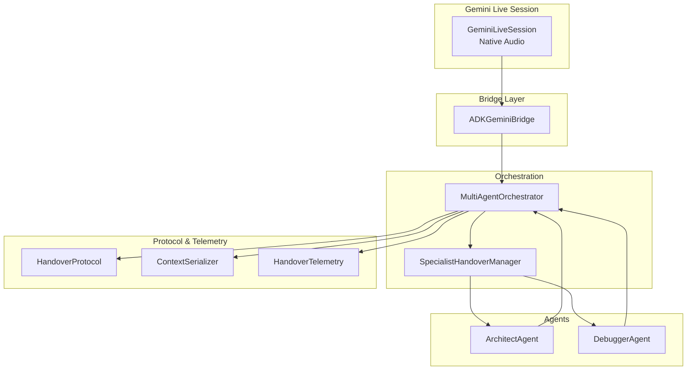

**Diagram sources**
- [session.py](file://core/ai/session.py#L43-L200)
- [bridge.py](file://core/ai/agents/bridge.py#L7-L35)
- [manager.py](file://core/ai/handover/manager.py#L207-L394)
- [handover_protocol.py](file://core/ai/handover_protocol.py#L825-L1032)
- [handover_telemetry.py](file://core/ai/handover_telemetry.py#L295-L652)
- [architect.py](file://core/ai/agents/specialists/architect.py#L20-L133)
- [debugger.py](file://core/ai/agents/specialists/debugger.py#L20-L139)

**Section sources**
- [session.py](file://core/ai/session.py#L43-L200)
- [bridge.py](file://core/ai/agents/bridge.py#L7-L35)
- [manager.py](file://core/ai/handover/manager.py#L207-L394)
- [handover_protocol.py](file://core/ai/handover_protocol.py#L825-L1032)
- [handover_telemetry.py](file://core/ai/handover_telemetry.py#L295-L652)
- [architect.py](file://core/ai/agents/specialists/architect.py#L20-L133)
- [debugger.py](file://core/ai/agents/specialists/debugger.py#L20-L139)

## Core Components
- ADKGeminiBridge: Routes tool calls from Gemini Live to the orchestrator and tracks semantic recovery states.
- MultiAgentOrchestrator: Coordinates deep handovers, validation checkpoints, negotiation, rollback, and telemetry.
- HandoverProtocol: Enforces lifecycle states, snapshots, checkpoints, and rollback semantics.
- SpecialistHandoverManager: Provides high-level handover patterns (Architect→Debugger and feedback loops).
- ArchitectAgent and DebuggerAgent: Specialized agents that produce and consume rich HandoverContext payloads.
- HandoverTelemetry: Records outcomes, performance metrics, and analytics for optimization.
- GeminiLiveSession: Integrates with Native Audio and exposes tool declarations to Gemini.

**Section sources**
- [bridge.py](file://core/ai/agents/bridge.py#L7-L35)
- [manager.py](file://core/ai/handover/manager.py#L207-L394)
- [handover_protocol.py](file://core/ai/handover_protocol.py#L825-L1032)
- [handover_telemetry.py](file://core/ai/handover_telemetry.py#L295-L652)
- [architect.py](file://core/ai/agents/specialists/architect.py#L20-L133)
- [debugger.py](file://core/ai/agents/specialists/debugger.py#L20-L139)
- [session.py](file://core/ai/session.py#L43-L200)

## Architecture Overview
The system integrates Native Audio with the ADK tool orchestration layer. The bridge receives tool calls from Gemini Live, delegates to the orchestrator, and returns results. The orchestrator uses the Deep Handover Protocol to preserve context, optionally negotiate scope, validate checkpoints, and roll back when needed. Telemetry captures outcomes and performance for observability.

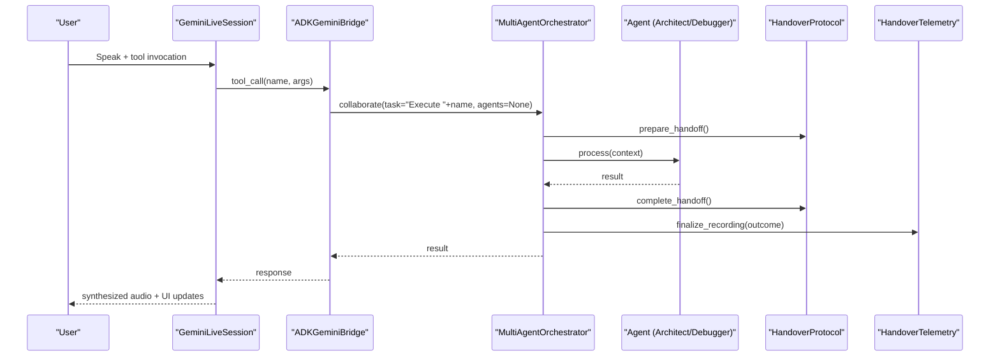

**Diagram sources**
- [session.py](file://core/ai/session.py#L43-L200)
- [bridge.py](file://core/ai/agents/bridge.py#L17-L31)
- [manager.py](file://core/ai/handover/manager.py#L262-L394)
- [handover_protocol.py](file://core/ai/handover_protocol.py#L865-L925)
- [handover_telemetry.py](file://core/ai/handover_telemetry.py#L365-L426)

## Detailed Component Analysis

### ADKGeminiBridge
Responsibilities:
- Receive tool calls from Gemini Live
- Route to the orchestrator for collaborative execution
- Track semantic recovery indicators
- Reset recovery state when needed

Key behaviors:
- Logs tool routing and arguments
- Delegates to orchestrator.collaborate with a generated task
- Updates recovery flag based on tool name keywords or result text
- Returns the orchestrator’s result to Gemini

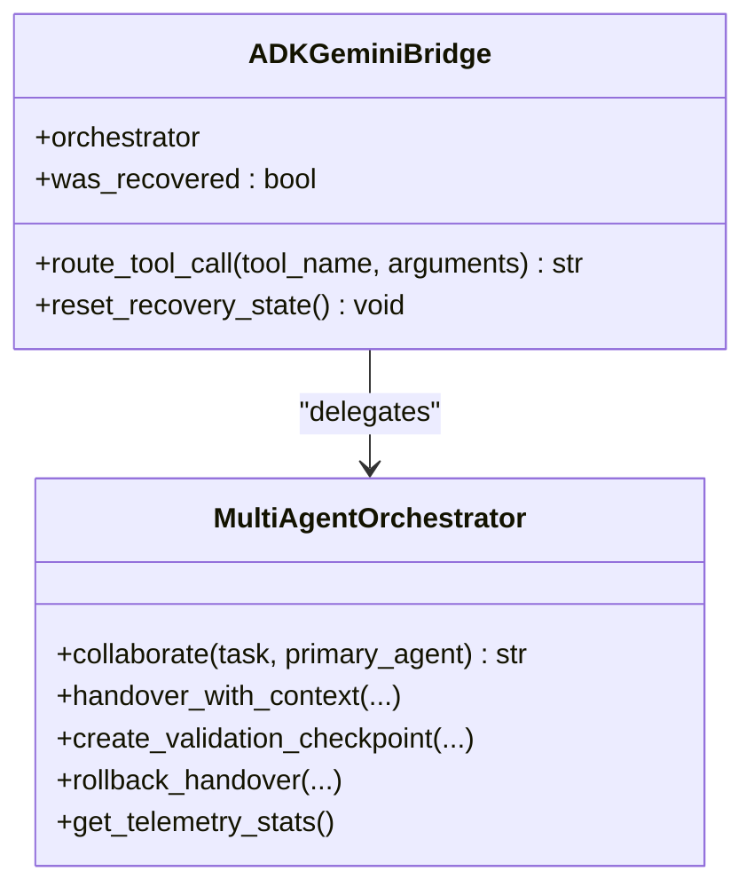

**Diagram sources**
- [bridge.py](file://core/ai/agents/bridge.py#L7-L35)
- [manager.py](file://core/ai/handover/manager.py#L581-L631)

**Section sources**
- [bridge.py](file://core/ai/agents/bridge.py#L7-L35)

### MultiAgentOrchestrator and Deep Handover Protocol
Responsibilities:
- Register agents and manage active handovers
- Prepare, validate, and complete handovers
- Support negotiation, checkpoints, and rollback
- Serialize/deserialize contexts and track telemetry
- Provide collaboration entry points for complex tasks

Key flows:
- handover_with_context validates agents, starts telemetry, prepares handoff, negotiates scope (optional), executes transfer, records result, completes handoff, triggers callbacks, and finalizes telemetry
- create_validation_checkpoint creates staged checkpoints for iterative refinement
- rollback_handover restores pre-transfer state using snapshots
- serialize_context and deserialize_context support compact and full context transfer
- get_telemetry_stats and get_analytics_report expose monitoring insights

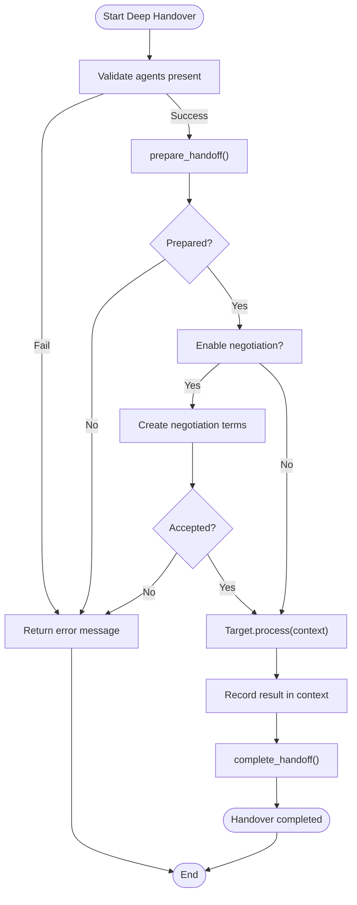

**Diagram sources**
- [manager.py](file://core/ai/handover/manager.py#L262-L394)
- [handover_protocol.py](file://core/ai/handover_protocol.py#L865-L925)

**Section sources**
- [manager.py](file://core/ai/handover/manager.py#L207-L580)
- [handover_protocol.py](file://core/ai/handover_protocol.py#L825-L1032)

### HandoverContext, Negotiation, and Checkpoints
Rich context model:
- HandoverContext stores identity, task decomposition, working memory, intent confidence, code context, conversation history, payload, history, validation checkpoint, negotiation, and rollback snapshot
- TaskNode supports hierarchical decomposition with parent-child relationships
- WorkingMemory captures short-term state, attention focus, scratchpad, and session duration
- IntentConfidence captures confidence score, reasoning, and alternatives
- CodeContext carries files, dependencies, and language/framework metadata
- HandoverNegotiation supports bidirectional offers, counter-offers, acceptance, rejection, and clarifications
- ValidationCheckpoint enables staged verification with evaluation logic

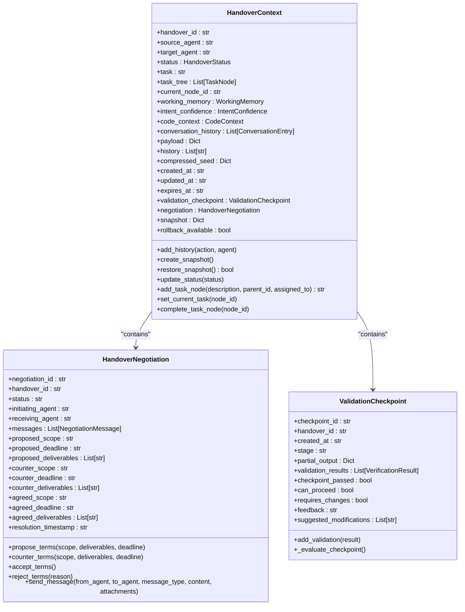

**Diagram sources**
- [handover_protocol.py](file://core/ai/handover_protocol.py#L107-L246)
- [handover_protocol.py](file://core/ai/handover_protocol.py#L583-L728)
- [handover_protocol.py](file://core/ai/handover_protocol.py#L525-L570)

**Section sources**
- [handover_protocol.py](file://core/ai/handover_protocol.py#L107-L246)
- [handover_protocol.py](file://core/ai/handover_protocol.py#L525-L570)
- [handover_protocol.py](file://core/ai/handover_protocol.py#L583-L728)

### Specialized Agents: Architect and Debugger
ArchitectAgent:
- Builds ArchitectOutput with blueprints, decisions, and risk assessments
- Adds task nodes and sets intent confidence for handover to Debugger
- Initiates deep handover with negotiation enabled

DebuggerAgent:
- Verifies ArchitectOutput, adds verification results and warnings
- Creates validation checkpoints and determines if rework is needed
- Requests rework via SpecialistHandoverManager and returns approval or feedback

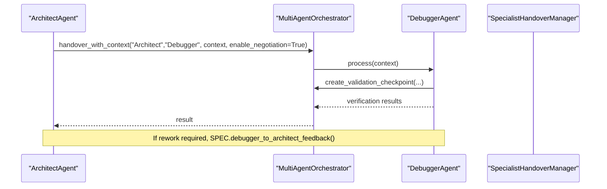

**Diagram sources**
- [architect.py](file://core/ai/agents/specialists/architect.py#L116-L132)
- [debugger.py](file://core/ai/agents/specialists/debugger.py#L86-L139)
- [manager.py](file://core/ai/handover/manager.py#L117-L165)

**Section sources**
- [architect.py](file://core/ai/agents/specialists/architect.py#L20-L133)
- [debugger.py](file://core/ai/agents/specialists/debugger.py#L20-L139)
- [manager.py](file://core/ai/handover/manager.py#L53-L165)

### Telemetry and Monitoring
HandoverTelemetry:
- Tracks outcomes, performance metrics, negotiation, validation, and rollback events
- Provides analytics (success rates, failure categories, agent pair performance)
- Exposes convenience functions to start/end recordings and export/import records
- Integrates with OpenTelemetry tracing

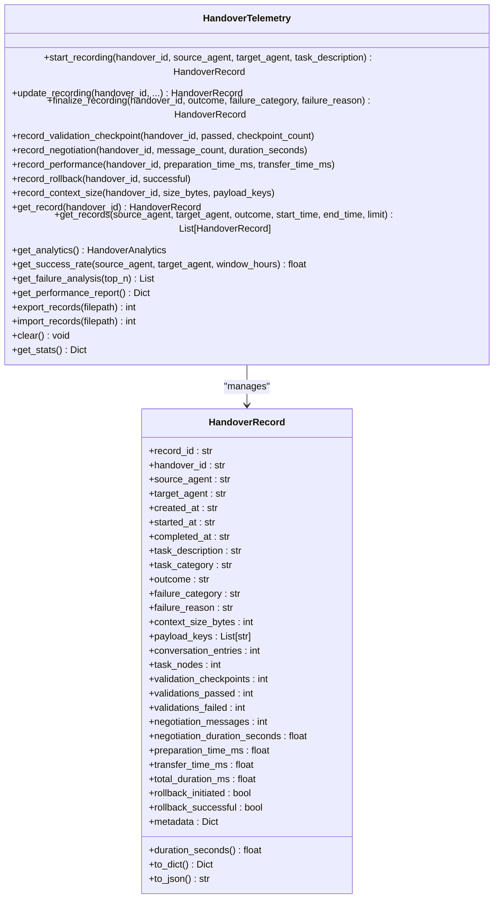

**Diagram sources**
- [handover_telemetry.py](file://core/ai/handover_telemetry.py#L295-L652)

**Section sources**
- [handover_telemetry.py](file://core/ai/handover_telemetry.py#L295-L652)

### Communication Protocols and Inter-Agent Messaging
- Gemini Live Session declares tools and integrates with the bridge
- Tool calls are routed through the bridge to the orchestrator
- HandoverContext serializes rich metadata for agent handoffs
- Negotiation messages flow bidirectionally between agents
- Context diffs enable compact serialization and updates

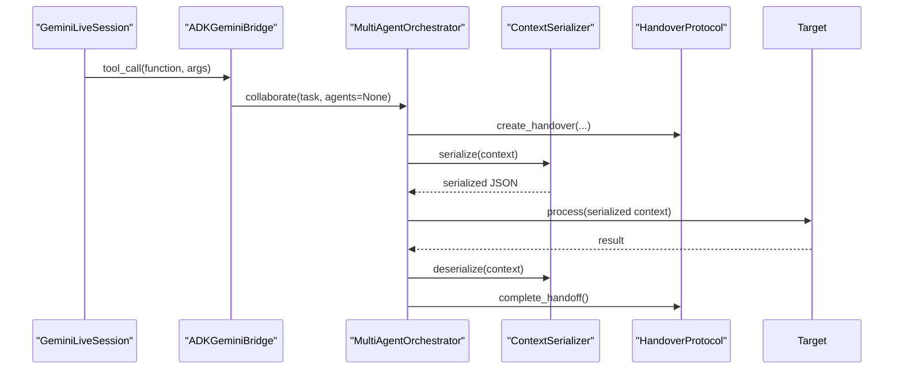

**Diagram sources**
- [session.py](file://core/ai/session.py#L96-L154)
- [bridge.py](file://core/ai/agents/bridge.py#L17-L31)
- [manager.py](file://core/ai/handover/manager.py#L262-L394)
- [handover_protocol.py](file://core/ai/handover_protocol.py#L837-L889)
- [handover_protocol.py](file://core/ai/handover_protocol.py#L743-L823)

**Section sources**
- [session.py](file://core/ai/session.py#L96-L154)
- [handover_protocol.py](file://core/ai/handover_protocol.py#L743-L823)

### Task Delegation Patterns and Context Preservation
- Hierarchical task decomposition via TaskNode supports sub-task assignment and progress tracking
- IntentConfidence guides handover decisions and alternative consideration
- CodeContext enriches developer-oriented handovers with file and dependency metadata
- ConversationEntry preserves dialog history for continuity
- WorkingMemory maintains ephemeral state during active handovers

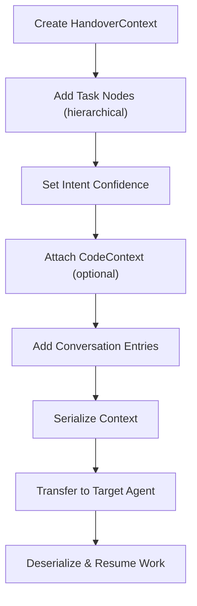

**Diagram sources**
- [handover_protocol.py](file://core/ai/handover_protocol.py#L107-L246)
- [handover_protocol.py](file://core/ai/handover_protocol.py#L60-L105)
- [handover_protocol.py](file://core/ai/handover_protocol.py#L72-L89)

**Section sources**
- [handover_protocol.py](file://core/ai/handover_protocol.py#L107-L246)
- [handover_protocol.py](file://core/ai/handover_protocol.py#L60-L105)

### Agent Dependencies and Resource Allocation
- ADK agents are defined with tools and instructions
- Root agent aggregates sub-agents for native handover
- Orchestrator registers agents and manages nested handovers
- VoiceAgent base class provides audio streaming and emotion extraction for Native Audio integration

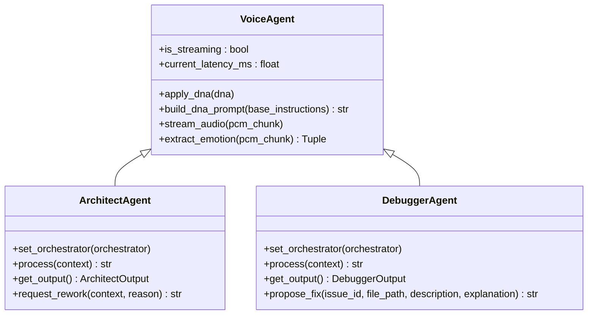

**Diagram sources**
- [voice_agent.py](file://core/ai/agents/voice_agent.py#L8-L65)
- [architect.py](file://core/ai/agents/specialists/architect.py#L20-L133)
- [debugger.py](file://core/ai/agents/specialists/debugger.py#L20-L139)
- [adk_agents.py](file://core/ai/adk_agents.py#L17-L77)

**Section sources**
- [voice_agent.py](file://core/ai/agents/voice_agent.py#L8-L65)
- [architect.py](file://core/ai/agents/specialists/architect.py#L20-L133)
- [debugger.py](file://core/ai/agents/specialists/debugger.py#L20-L139)
- [adk_agents.py](file://core/ai/adk_agents.py#L17-L77)

### Examples of Bridge Usage Scenarios
- Tool call routing: The bridge receives a tool call from Gemini Live, collaborates via the orchestrator, and returns the result to Gemini.
- Semantic recovery tracking: If the tool name or result indicates a fix or recovery, the bridge marks a recovery state.
- Complex task orchestration: The orchestrator collaborates starting from a primary agent, detects ambiguous destructive tasks, and either clarifies or proceeds with rich context handover.

**Section sources**
- [bridge.py](file://core/ai/agents/bridge.py#L17-L31)
- [manager.py](file://core/ai/handover/manager.py#L581-L631)

### Agent Handoff Procedures and Context Preservation
- Architect hands off to Debugger with ArchitectOutput, blueprint sections, decisions, and risks
- Debugger verifies and may request rework; the orchestrator uses SpecialistHandoverManager for feedback loops
- Negotiation terms can be proposed and accepted; checkpoints enable staged validation
- Rollback restores pre-transfer state using snapshots

**Section sources**
- [architect.py](file://core/ai/agents/specialists/architect.py#L116-L132)
- [debugger.py](file://core/ai/agents/specialists/debugger.py#L195-L234)
- [manager.py](file://core/ai/handover/manager.py#L53-L165)
- [handover_protocol.py](file://core/ai/handover_protocol.py#L865-L947)

### Error Handling During Cross-Agent Operations
- Handover preparation failure returns an error message and finalizes telemetry with validation failure
- Negotiation actions handle unknown actions and exceptions
- Rollback attempts restore snapshot and finalize telemetry accordingly
- Session-level tool declaration and search grounding prevent hallucinations and ensure robustness

**Section sources**
- [manager.py](file://core/ai/handover/manager.py#L310-L394)
- [manager.py](file://core/ai/handover/manager.py#L465-L522)
- [session.py](file://core/ai/session.py#L96-L154)

### Monitoring Capabilities and Performance Metrics Collection
- Telemetry captures preparation time, transfer time, validation time, negotiation time, and total duration
- Percentile latencies (p50, p95, p99) are computed from latency samples
- Analytics include success rates, failure categories, and agent pair performance
- Export/import allows persistence and analysis outside the runtime

**Section sources**
- [handover_telemetry.py](file://core/ai/handover_telemetry.py#L52-L95)
- [handover_telemetry.py](file://core/ai/handover_telemetry.py#L586-L652)

### Implementing Custom Bridge Agents and Extending the Handover Protocol
Guidance:
- Define a new agent class inheriting from the appropriate base (e.g., VoiceAgent) and implement process(context)
- Register the agent with the orchestrator via register_agent
- Extend HandoverContext with domain-specific fields if needed
- Add negotiation terms and checkpoints tailored to your agent’s domain
- Integrate tool declarations in the session layer to expose new capabilities to Gemini Live

**Section sources**
- [voice_agent.py](file://core/ai/agents/voice_agent.py#L8-L65)
- [manager.py](file://core/ai/handover/manager.py#L231-L234)
- [handover_protocol.py](file://core/ai/handover_protocol.py#L107-L246)
- [session.py](file://core/ai/session.py#L96-L154)

## Dependency Analysis
The bridge depends on the orchestrator for task routing and collaboration. The orchestrator depends on the HandoverProtocol for lifecycle management and ContextSerializer for serialization. Telemetry is integrated at multiple stages to capture outcomes and performance. The session layer declares tools and integrates with the bridge.

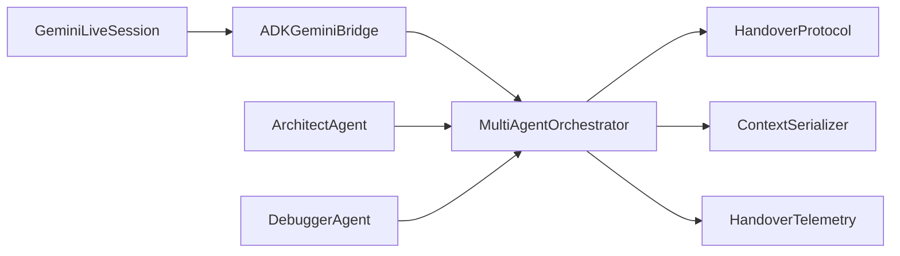

**Diagram sources**
- [bridge.py](file://core/ai/agents/bridge.py#L7-L35)
- [manager.py](file://core/ai/handover/manager.py#L207-L394)
- [handover_protocol.py](file://core/ai/handover_protocol.py#L825-L1032)
- [handover_telemetry.py](file://core/ai/handover_telemetry.py#L295-L652)
- [session.py](file://core/ai/session.py#L96-L154)

**Section sources**
- [bridge.py](file://core/ai/agents/bridge.py#L7-L35)
- [manager.py](file://core/ai/handover/manager.py#L207-L394)
- [handover_protocol.py](file://core/ai/handover_protocol.py#L825-L1032)
- [handover_telemetry.py](file://core/ai/handover_telemetry.py#L295-L652)
- [session.py](file://core/ai/session.py#L96-L154)

## Performance Considerations
- Minimize context size for compact serialization to reduce transfer overhead
- Use validation checkpoints to avoid full re-execution when partial results are sufficient
- Enable negotiation only when scope ambiguity exists to reduce latency
- Monitor telemetry for failure categories and optimize agent pair handovers
- Maintain session-level grounding (e.g., search) to reduce hallucinations and retries

## Troubleshooting Guide
Common issues and resolutions:
- Handover preparation fails: Check required fields in HandoverContext and ensure agents are registered
- Negotiation stuck: Verify negotiation messages and ensure accept/reject actions are handled
- Rollback not available: Confirm snapshot creation and availability before attempting rollback
- Session tool declarations missing: Ensure ToolRouter exposes function declarations and Google Search grounding is configured
- Telemetry not reporting: Confirm telemetry initialization and span finalization

**Section sources**
- [manager.py](file://core/ai/handover/manager.py#L288-L394)
- [manager.py](file://core/ai/handover/manager.py#L465-L522)
- [handover_protocol.py](file://core/ai/handover_protocol.py#L872-L947)
- [session.py](file://core/ai/session.py#L96-L154)
- [handover_telemetry.py](file://core/ai/handover_telemetry.py#L316-L426)

## Conclusion
The Bridge Agent System provides a robust foundation for cross-agent communication and task delegation in the Aether ecosystem. The ADKGeminiBridge acts as a coordinator between Native Audio and the orchestrator, while the Deep Handover Protocol ensures rich context preservation, negotiation, validation, and rollback. Specialized agents (Architect and Debugger) demonstrate practical handover patterns, and comprehensive telemetry enables continuous optimization. The system’s modular design supports extension to new agent types and domains.

## Appendices
- Integration with Native Audio and tool declarations is documented in the session layer and gateway protocol
- Architectural overview of the bridge and gateway is available in the project index

**Section sources**
- [gateway_protocol.md](file://docs/gateway_protocol.md#L1-L74)
- [aether_v2_architecture.md](file://.idx/aether_v2_architecture.md#L21-L46)