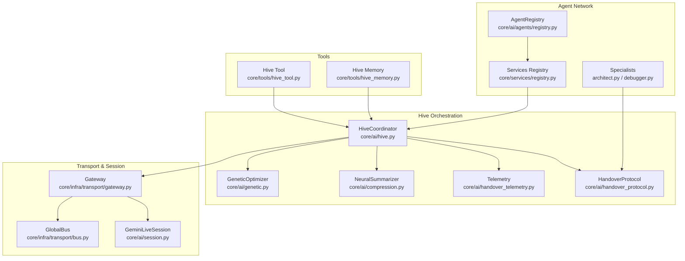
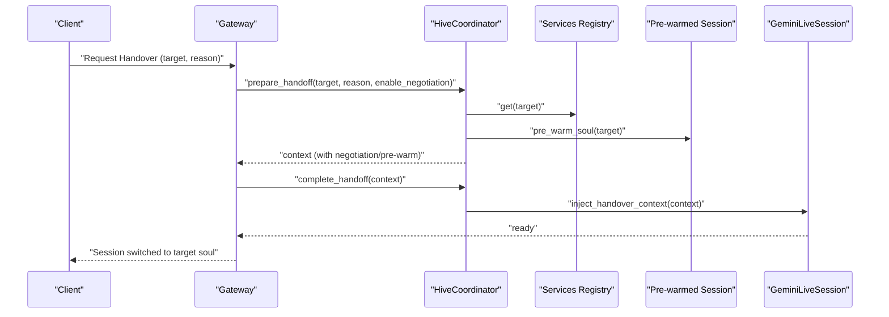
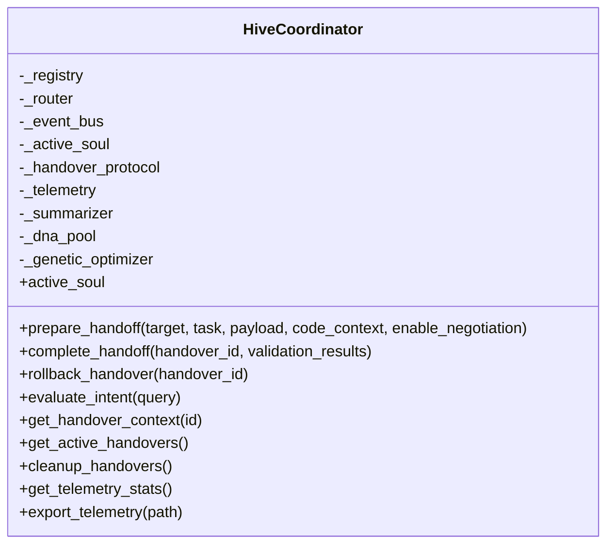
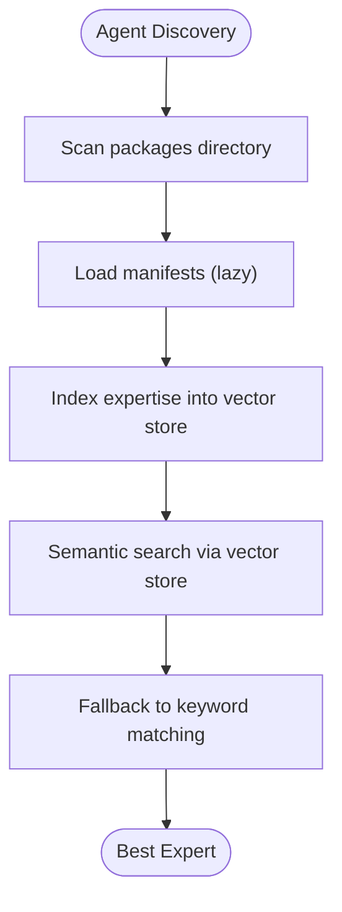
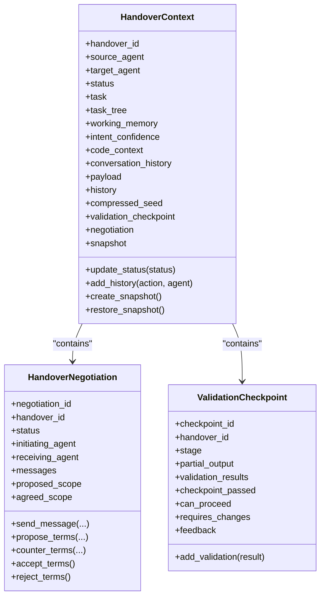
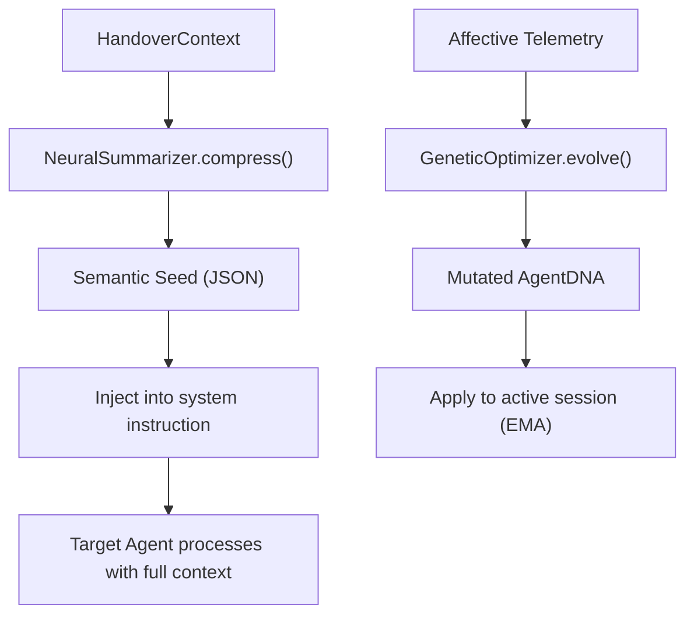
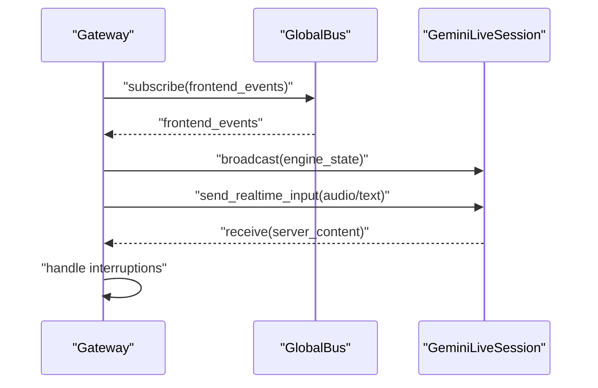
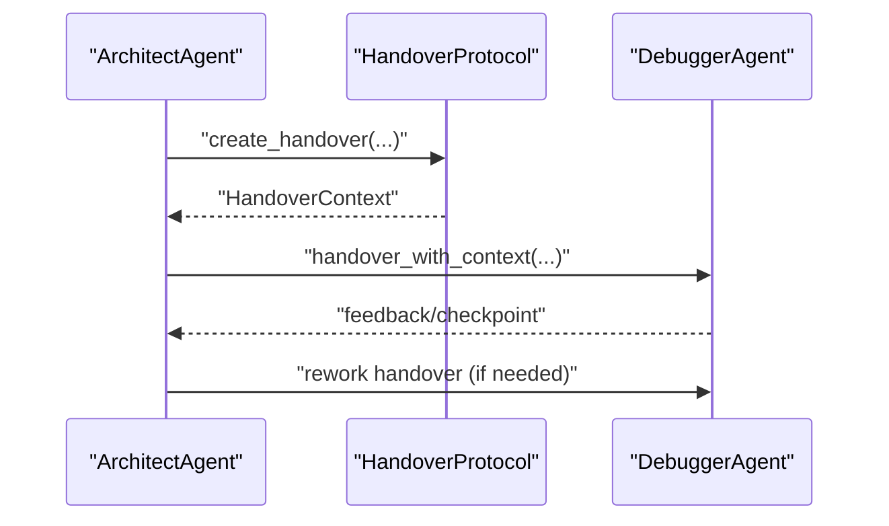
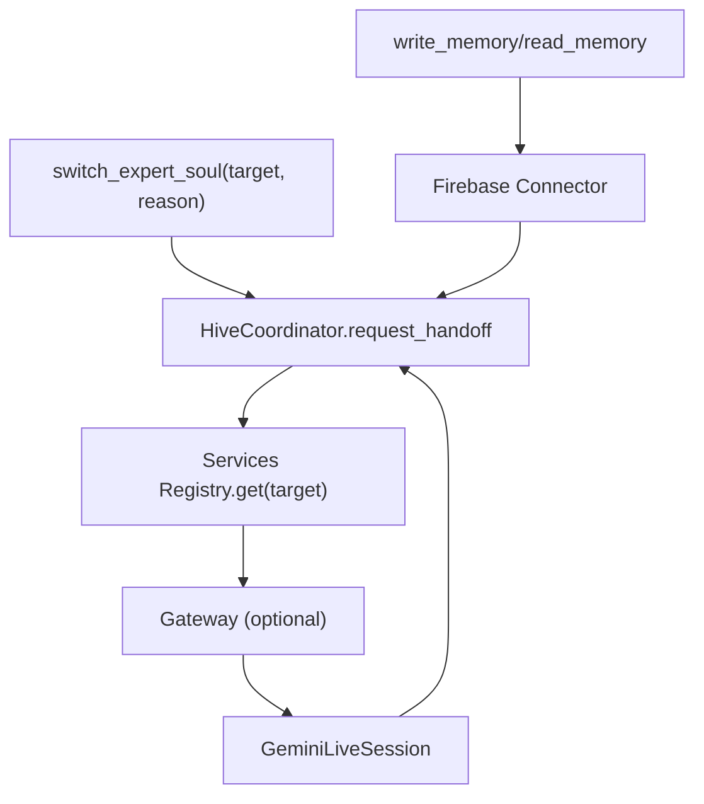
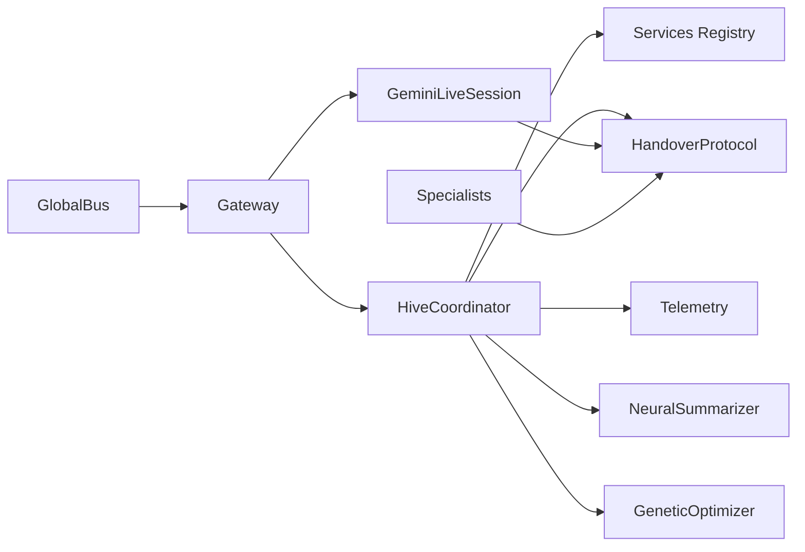

# Hive Swarm Intelligence

<cite>
**Referenced Files in This Document**
- [hive.py](file://core/ai/hive.py)
- [registry.py](file://core/ai/agents/registry.py)
- [registry.py](file://core/services/registry.py)
- [handover_protocol.py](file://core/ai/handover_protocol.py)
- [handover_telemetry.py](file://core/ai/handover_telemetry.py)
- [compression.py](file://core/ai/compression.py)
- [genetic.py](file://core/ai/genetic.py)
- [gateway.py](file://core/infra/transport/gateway.py)
- [session.py](file://core/ai/session.py)
- [manager.py](file://core/ai/handover/manager.py)
- [bus.py](file://core/infra/transport/bus.py)
- [architect.py](file://core/ai/agents/specialists/architect.py)
- [debugger.py](file://core/ai/agents/specialists/debugger.py)
- [hive_tool.py](file://core/tools/hive_tool.py)
- [hive_memory.py](file://core/tools/hive_memory.py)
- [HIVE.md](file://docs/HIVE.md)
</cite>

## Table of Contents
1. [Introduction](#introduction)
2. [Project Structure](#project-structure)
3. [Core Components](#core-components)
4. [Architecture Overview](#architecture-overview)
5. [Detailed Component Analysis](#detailed-component-analysis)
6. [Dependency Analysis](#dependency-analysis)
7. [Performance Considerations](#performance-considerations)
8. [Troubleshooting Guide](#troubleshooting-guide)
9. [Conclusion](#conclusion)
10. [Appendices](#appendices)

## Introduction
This document describes the Hive Swarm Intelligence system that powers collective agent coordination and distributed decision-making across multiple Aether agents. The Hive integrates a Deep Handover Protocol (ADK 2.0) to orchestrate seamless transitions between specialized “Expert Souls,” preserving working memory, attention focus, and task decomposition across handoffs. It leverages semantic context compression, bidirectional negotiation, validation checkpoints, and rollback safety to achieve robust, low-latency, and reliable multi-agent collaboration.

## Project Structure
The Hive spans several subsystems:
- Hive Coordinator: Orchestrates active soul selection, prepares and completes handovers, negotiates terms, and maintains telemetry.
- Agent Registry: Tracks installed .ath packages and provides semantic discovery and hot-reload.
- Handover Protocol: Rich context model, negotiation, checkpoints, and rollback.
- Telemetry: Metrics, analytics, and persistent records for handover outcomes.
- Communication Bus: Redis-backed pub/sub and state storage for distributed synchronization.
- Session Layer: Live audio session with injected handover context and tool-call handling.
- Specialists: Architect and Debugger agents that collaborate via the protocol.
- Tools: Hive tool for voluntary handover and Hive memory for shared state persistence.

**Diagram sources**
- [hive.py](file://core/ai/hive.py#L47-L723)
- [handover_protocol.py](file://core/ai/handover_protocol.py#L107-L246)
- [handover_telemetry.py](file://core/ai/handover_telemetry.py#L295-L652)
- [compression.py](file://core/ai/compression.py#L24-L115)
- [genetic.py](file://core/ai/genetic.py#L81-L195)
- [gateway.py](file://core/infra/transport/gateway.py#L69-L507)
- [session.py](file://core/ai/session.py#L43-L800)
- [bus.py](file://core/infra/transport/bus.py#L25-L200)
- [registry.py](file://core/ai/agents/registry.py#L30-L98)
- [registry.py](file://core/services/registry.py#L44-L251)
- [architect.py](file://core/ai/agents/specialists/architect.py#L20-L189)
- [debugger.py](file://core/ai/agents/specialists/debugger.py#L20-L272)
- [hive_tool.py](file://core/tools/hive_tool.py#L22-L78)
- [hive_memory.py](file://core/tools/hive_memory.py#L25-L115)

**Section sources**
- [HIVE.md](file://docs/HIVE.md#L1-L92)
- [hive.py](file://core/ai/hive.py#L47-L124)
- [registry.py](file://core/services/registry.py#L44-L251)

## Core Components
- HiveCoordinator: Manages active soul, prepares and completes deep handovers, negotiates terms, creates checkpoints, and supports rollback. Integrates NeuralSummarizer for context compression and GeneticOptimizer for evolving agent DNA.
- AgentRegistry (Agents): Defines AgentMetadata and tracks registered agents with capability indexing.
- Services Registry: Scans .ath packages, hot-reloads on filesystem changes, and provides semantic discovery via vector store.
- HandoverProtocol: Rich HandoverContext with task trees, working memory, code context, intent confidence, negotiation, checkpoints, and rollback snapshots.
- HandoverTelemetry: Records outcomes, performance metrics, failure categories, and exports analytics.
- NeuralSummarizer: Compresses conversation and working memory into a Semantic Seed for efficient handover.
- GeneticOptimizer: Evolves AgentDNA based on affective telemetry and real-time acoustic traits.
- Gateway: WebSocket entry-point, pre-warms target souls, injects handover context, and coordinates session lifecycle.
- GeminiLiveSession: Manages bidirectional audio streaming, tool calls, and injects handover context into system instructions.
- GlobalBus: Redis-backed pub/sub and state storage for distributed synchronization.
- Specialist Agents: Architect and Debugger agents collaborate using the protocol, with Architect creating blueprints and Debugger validating them.
- Hive Tools: Voluntary handover tool and shared Hive memory persistence.

**Section sources**
- [hive.py](file://core/ai/hive.py#L47-L723)
- [registry.py](file://core/ai/agents/registry.py#L30-L98)
- [registry.py](file://core/services/registry.py#L44-L251)
- [handover_protocol.py](file://core/ai/handover_protocol.py#L107-L246)
- [handover_telemetry.py](file://core/ai/handover_telemetry.py#L295-L652)
- [compression.py](file://core/ai/compression.py#L24-L115)
- [genetic.py](file://core/ai/genetic.py#L81-L195)
- [gateway.py](file://core/infra/transport/gateway.py#L69-L507)
- [session.py](file://core/ai/session.py#L43-L800)
- [bus.py](file://core/infra/transport/bus.py#L25-L200)
- [architect.py](file://core/ai/agents/specialists/architect.py#L20-L189)
- [debugger.py](file://core/ai/agents/specialists/debugger.py#L20-L272)
- [hive_tool.py](file://core/tools/hive_tool.py#L22-L78)
- [hive_memory.py](file://core/tools/hive_memory.py#L25-L115)

## Architecture Overview
The Hive architecture centers on the HiveCoordinator coordinating transitions between Expert Souls. The Deep Handover Protocol ensures continuity by preserving working memory, attention focus, and task decomposition. Context compression reduces token overhead, while negotiation and checkpoints enable iterative refinement. Rollback guarantees resilience. The Gateway and Session layers manage real-time audio and tool calls, injecting handover context into the model’s system instructions. The GlobalBus synchronizes state across nodes.

**Diagram sources**
- [gateway.py](file://core/infra/transport/gateway.py#L240-L276)
- [hive.py](file://core/ai/hive.py#L181-L296)
- [session.py](file://core/ai/session.py#L738-L792)

**Section sources**
- [HIVE.md](file://docs/HIVE.md#L29-L87)
- [gateway.py](file://core/infra/transport/gateway.py#L240-L276)
- [hive.py](file://core/ai/hive.py#L181-L296)
- [session.py](file://core/ai/session.py#L738-L792)

## Detailed Component Analysis

### HiveCoordinator
Responsibilities:
- Track active soul and resolve better experts via intent evaluation.
- Prepare handovers with negotiation and pre-warming.
- Compress context into a Semantic Seed.
- Manage validation checkpoints and rollback.
- Integrate telemetry and genetic evolution.

Key behaviors:
- prepare_handoff: Creates HandoverContext, optionally negotiates, pre-warms target, and records telemetry.
- complete_handoff: Validates post-transfer, switches active soul, and records outcomes.
- rollback_handover: Restores previous soul and context snapshot.
- evaluate_intent: Suggests better expert based on registry scoring.
- _apply_compression: Background compression of context.
- _on_acoustic_trait: Triggers genetic mutation based on real-time paralinguistic traits.

**Diagram sources**
- [hive.py](file://core/ai/hive.py#L47-L723)

**Section sources**
- [hive.py](file://core/ai/hive.py#L47-L723)

### Agent Registry and Services Registry
- AgentRegistry (agents): Defines AgentMetadata with capabilities and semantic fingerprint; supports registration and capability-based discovery.
- Services Registry: Scans .ath packages, hot-reloads on filesystem changes, builds semantic index, and finds experts by semantic similarity or keyword matching.

**Diagram sources**
- [registry.py](file://core/services/registry.py#L64-L247)
- [registry.py](file://core/ai/agents/registry.py#L30-L98)

**Section sources**
- [registry.py](file://core/services/registry.py#L64-L247)
- [registry.py](file://core/ai/agents/registry.py#L30-L98)

### Handover Protocol and Telemetry
- HandoverContext: Rich model with task tree, working memory, code context, intent confidence, negotiation, checkpoints, and rollback snapshots.
- Negotiation: Bidirectional exchange of offers, counter-offers, acceptance, rejection, and clarifications.
- ValidationCheckpoint: Iterative verification with pass/fail criteria and suggested modifications.
- Telemetry: Records outcomes, performance metrics, failure categories, and exports analytics.

**Diagram sources**
- [handover_protocol.py](file://core/ai/handover_protocol.py#L107-L246)
- [handover_protocol.py](file://core/ai/handover_protocol.py#L583-L728)
- [handover_protocol.py](file://core/ai/handover_protocol.py#L525-L570)

**Section sources**
- [handover_protocol.py](file://core/ai/handover_protocol.py#L107-L246)
- [handover_protocol.py](file://core/ai/handover_protocol.py#L525-L570)
- [handover_telemetry.py](file://core/ai/handover_telemetry.py#L295-L652)

### Neural Summarizer and Genetic Optimization
- NeuralSummarizer: Generates a Semantic Seed from conversation history and working memory, reducing token bloat and accelerating handover.
- GeneticOptimizer: Evolves AgentDNA based on affective telemetry and real-time acoustic traits, enabling adaptive personality adjustments mid-session.

**Diagram sources**
- [compression.py](file://core/ai/compression.py#L41-L115)
- [session.py](file://core/ai/session.py#L623-L737)
- [genetic.py](file://core/ai/genetic.py#L91-L195)

**Section sources**
- [compression.py](file://core/ai/compression.py#L41-L115)
- [genetic.py](file://core/ai/genetic.py#L91-L195)
- [session.py](file://core/ai/session.py#L623-L737)

### Gateway, Session, and Communication Bus
- Gateway: WebSocket entry-point, handshake, capability negotiation, heartbeat, and soul handoff orchestration. Pre-warms target sessions and injects handover context.
- GeminiLiveSession: Manages bidirectional audio, tool calls, and injects handover context into system instructions. Supports proactive vision pulses and backchannel empathy.
- GlobalBus: Redis-backed pub/sub and state storage for distributed synchronization across nodes.

**Diagram sources**
- [gateway.py](file://core/infra/transport/gateway.py#L320-L507)
- [session.py](file://core/ai/session.py#L174-L478)
- [bus.py](file://core/infra/transport/bus.py#L130-L200)

**Section sources**
- [gateway.py](file://core/infra/transport/gateway.py#L320-L507)
- [session.py](file://core/ai/session.py#L174-L478)
- [bus.py](file://core/infra/transport/bus.py#L130-L200)

### Specialist Agents and Collaborative Tasks
- ArchitectAgent: Builds architectural blueprints, identifies risks, and requests verification from Debugger.
- DebuggerAgent: Verifies designs, raises warnings, and requests rework when needed, collaborating via the protocol.

**Diagram sources**
- [architect.py](file://core/ai/agents/specialists/architect.py#L35-L133)
- [debugger.py](file://core/ai/agents/specialists/debugger.py#L34-L139)
- [manager.py](file://core/ai/handover/manager.py#L262-L394)

**Section sources**
- [architect.py](file://core/ai/agents/specialists/architect.py#L35-L133)
- [debugger.py](file://core/ai/agents/specialists/debugger.py#L34-L139)
- [manager.py](file://core/ai/handover/manager.py#L262-L394)

### Hive Tools and Collective Memory
- Hive Tool: Voluntary handover invocation for switching to a specialized soul.
- Hive Memory: Shared Firestore namespace for persisting architectural state and high-level intent across handoffs.

**Diagram sources**
- [hive_tool.py](file://core/tools/hive_tool.py#L27-L78)
- [hive_memory.py](file://core/tools/hive_memory.py#L25-L115)
- [hive.py](file://core/ai/hive.py#L143-L176)

**Section sources**
- [hive_tool.py](file://core/tools/hive_tool.py#L27-L78)
- [hive_memory.py](file://core/tools/hive_memory.py#L25-L115)
- [hive.py](file://core/ai/hive.py#L143-L176)

## Dependency Analysis
- HiveCoordinator depends on Services Registry for soul discovery, HandoverProtocol for lifecycle, HandoverTelemetry for observability, NeuralSummarizer for compression, and GeneticOptimizer for evolution.
- Gateway depends on HiveCoordinator for handover orchestration and on GeminiLiveSession for audio and tool handling.
- Specialist agents depend on the HandoverProtocol and MultiAgentOrchestrator for structured collaboration.
- GlobalBus provides distributed synchronization for state and events.

**Diagram sources**
- [hive.py](file://core/ai/hive.py#L47-L124)
- [gateway.py](file://core/infra/transport/gateway.py#L69-L124)
- [session.py](file://core/ai/session.py#L43-L154)
- [manager.py](file://core/ai/handover/manager.py#L207-L230)
- [bus.py](file://core/infra/transport/bus.py#L25-L95)

**Section sources**
- [hive.py](file://core/ai/hive.py#L47-L124)
- [gateway.py](file://core/infra/transport/gateway.py#L69-L124)
- [session.py](file://core/ai/session.py#L43-L154)
- [manager.py](file://core/ai/handover/manager.py#L207-L230)
- [bus.py](file://core/infra/transport/bus.py#L25-L95)

## Performance Considerations
- Pre-warming: Background initialization of target sessions to reduce transition latency.
- Context Compression: Semantic Seed generation minimizes token overhead and accelerates handover.
- Negotiation and Checkpoints: Enable iterative refinement without full re-execution.
- Telemetry: Measures preparation, transfer, and validation times; tracks success rates and failure categories.
- Rollback: Ensures resilient recovery with minimal user impact.

[No sources needed since this section provides general guidance]

## Troubleshooting Guide
Common issues and resolutions:
- Handover Preparation Failure: Check validation prerequisites and telemetry failure categories.
- Negotiation Rejection: Review negotiation messages and adjust scope/deliverables.
- Context Lost: Verify Semantic Seed injection into system instructions and conversation history.
- Agent Unavailable: Confirm target soul availability and hot-reload status.
- Rollback Triggered: Inspect snapshots and telemetry for rollback outcomes.
- Session Handshake Timeout: Validate JWT or Ed25519 signature and client credentials.

**Section sources**
- [handover_telemetry.py](file://core/ai/handover_telemetry.py#L39-L50)
- [handover_telemetry.py](file://core/ai/handover_telemetry.py#L672-L694)
- [gateway.py](file://core/infra/transport/gateway.py#L424-L446)
- [session.py](file://core/ai/session.py#L623-L737)

## Conclusion
The Hive Swarm Intelligence system enables robust, scalable, and low-latency multi-agent collaboration by preserving context, enabling negotiation, and providing safety nets through validation and rollback. Through semantic compression, genetic evolution, and distributed synchronization, it achieves collective intelligence suited to complex, real-time tasks.

[No sources needed since this section summarizes without analyzing specific files]

## Appendices

### Configuration and Best Practices
- Enable Deep Handover: Use prepare_handoff with enable_negotiation for bidirectional negotiation and pre_warm_soul for zero-latency transitions.
- Optimize Context: Leverage NeuralSummarizer to compress large contexts; monitor token density ratios.
- Monitor Outcomes: Use get_telemetry_stats and export_telemetry to track success rates and performance.
- Evolve Agents: Configure GeneticOptimizer with affective telemetry to adapt agent DNA mid-session.
- Scale with Bus: Use GlobalBus for distributed state and event synchronization across nodes.

**Section sources**
- [HIVE.md](file://docs/HIVE.md#L79-L92)
- [hive.py](file://core/ai/hive.py#L181-L296)
- [compression.py](file://core/ai/compression.py#L108-L115)
- [genetic.py](file://core/ai/genetic.py#L91-L195)
- [bus.py](file://core/infra/transport/bus.py#L161-L200)