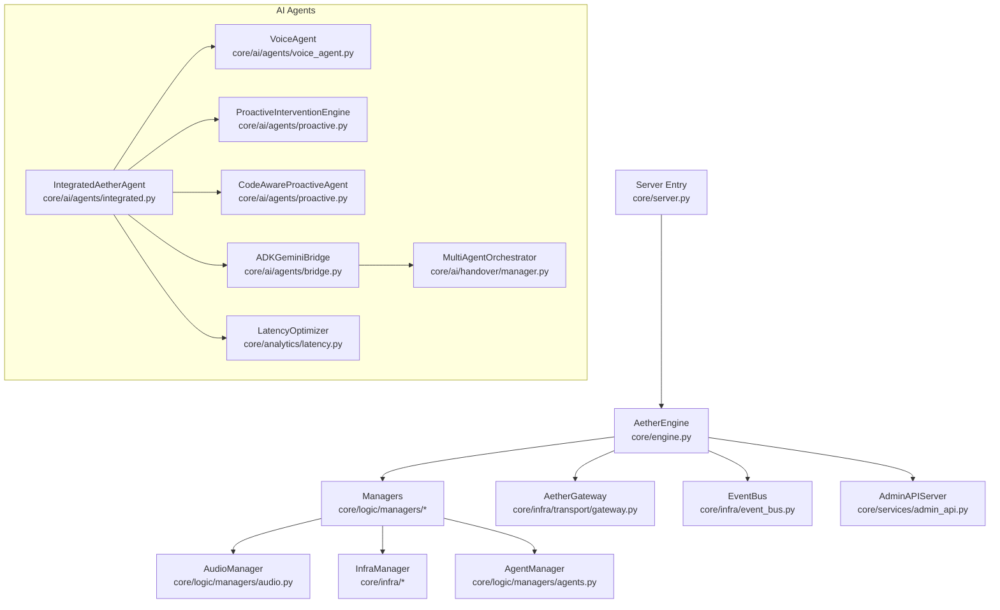
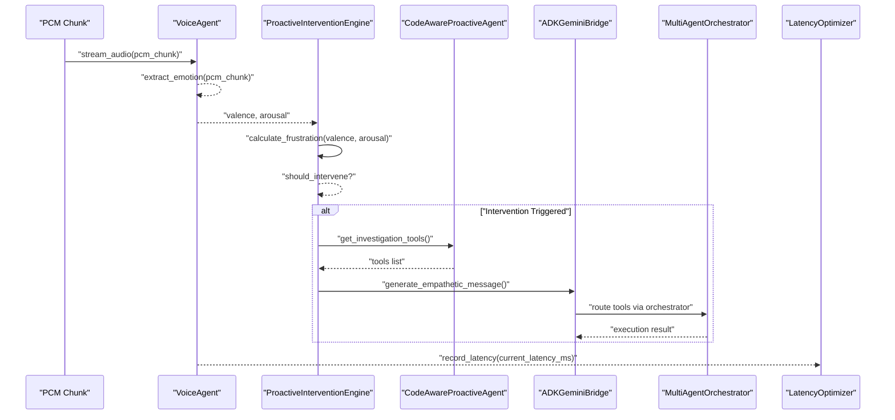
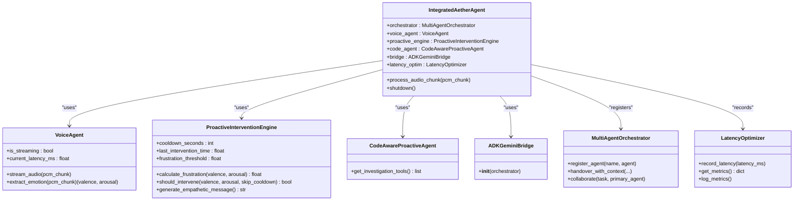
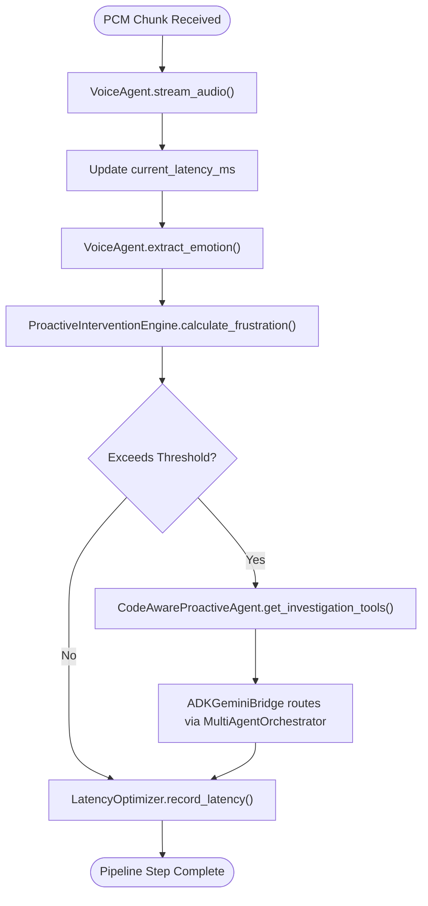
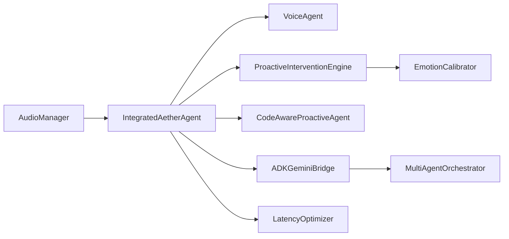

# Integrated Agent Architecture

<cite>
**Referenced Files in This Document**
- [engine.py](file://core/engine.py)
- [server.py](file://core/server.py)
- [integrated.py](file://core/ai/agents/integrated.py)
- [voice_agent.py](file://core/ai/agents/voice_agent.py)
- [proactive.py](file://core/ai/agents/proactive.py)
- [adk_agents.py](file://core/ai/adk_agents.py)
- [manager.py](file://core/ai/handover/manager.py)
- [latency.py](file://core/analytics/latency.py)
- [processing.py](file://core/audio/processing.py)
- [telemetry.py](file://core/audio/telemetry.py)
- [audio.py](file://core/logic/managers/audio.py)
- [calibrator.py](file://core/emotion/calibrator.py)
</cite>

## Table of Contents
1. [Introduction](#introduction)
2. [Project Structure](#project-structure)
3. [Core Components](#core-components)
4. [Architecture Overview](#architecture-overview)
5. [Detailed Component Analysis](#detailed-component-analysis)
6. [Dependency Analysis](#dependency-analysis)
7. [Performance Considerations](#performance-considerations)
8. [Troubleshooting Guide](#troubleshooting-guide)
9. [Conclusion](#conclusion)
10. [Appendices](#appendices)

## Introduction
This document describes the Integrated Agent Architecture that serves as the master coordinator for the Aether Phase 6 pipeline. It focuses on the IntegratedAetherAgent class and its orchestration of specialized agents, including VoiceAgent, ProactiveInterventionEngine, CodeAwareProactiveAgent, and ADKGeminiBridge. It explains the agent assembly pattern, audio processing pipeline flow from PCM chunk ingestion through emotion extraction to proactive intervention triggering, the integration with MultiAgentOrchestrator and tool routing, latency optimization tracking, and performance monitoring. Practical examples cover initialization, audio processing workflow, shutdown procedures, lifecycle management, and extension guidelines.

## Project Structure
The Integrated Agent sits within the broader Aether Voice OS stack. The high-level runtime entry point initializes the AetherEngine, which wires together managers, gateways, audio, infrastructure, and administrative services. The IntegratedAetherAgent composes specialized agents and orchestrates their interactions.

**Diagram sources**
- [server.py](file://core/server.py#L105-L149)
- [engine.py](file://core/engine.py#L26-L71)
- [audio.py](file://core/logic/managers/audio.py#L18-L50)
- [integrated.py](file://core/ai/agents/integrated.py#L15-L38)
- [manager.py](file://core/ai/handover/manager.py#L207-L230)
- [latency.py](file://core/analytics/latency.py#L7-L11)

**Section sources**
- [server.py](file://core/server.py#L105-L149)
- [engine.py](file://core/engine.py#L26-L71)

## Core Components
- IntegratedAetherAgent: Central orchestrator that assembles VoiceAgent, ProactiveInterventionEngine, CodeAwareProactiveAgent, ADKGeminiBridge, and LatencyOptimizer. It defines the audio processing pipeline entry point and proactive intervention logic.
- VoiceAgent: Handles PCM streaming, latency tracking, and baseline emotion extraction.
- ProactiveInterventionEngine: Computes frustration from valence/arousal, applies dynamic thresholds and baselines, and decides when to intervene.
- CodeAwareProactiveAgent: Suggests tools for context-aware help during interventions.
- ADKGeminiBridge: Bridges to the ADK ecosystem and integrates with MultiAgentOrchestrator for tool routing.
- MultiAgentOrchestrator: Manages handovers, context preservation, negotiation, validation checkpoints, and telemetry.
- LatencyOptimizer: Records and computes latency percentiles for performance tracking.

**Section sources**
- [integrated.py](file://core/ai/agents/integrated.py#L15-L38)
- [voice_agent.py](file://core/ai/agents/voice_agent.py#L8-L17)
- [proactive.py](file://core/ai/agents/proactive.py#L10-L21)
- [proactive.py](file://core/ai/agents/proactive.py#L92-L99)
- [manager.py](file://core/ai/handover/manager.py#L207-L230)
- [latency.py](file://core/analytics/latency.py#L7-L11)

## Architecture Overview
The Integrated Agent Architecture follows a layered composition pattern:
- Assembly: IntegratedAetherAgent constructs and registers agents.
- Orchestration: MultiAgentOrchestrator coordinates handovers and tool routing.
- Audio Pipeline: AudioManager captures and routes PCM chunks; VoiceAgent consumes chunks and extracts emotion.
- Intervention: ProactiveInterventionEngine evaluates emotion and triggers empathetic interventions.
- Tooling: CodeAwareProactiveAgent suggests tools; ADKGeminiBridge integrates with the ADK ecosystem.
- Monitoring: LatencyOptimizer records pipeline latency; AudioTelemetry and AudioTelemetryLogger provide performance insights.

**Diagram sources**
- [integrated.py](file://core/ai/agents/integrated.py#L39-L61)
- [voice_agent.py](file://core/ai/agents/voice_agent.py#L47-L64)
- [proactive.py](file://core/ai/agents/proactive.py#L30-L83)
- [manager.py](file://core/ai/handover/manager.py#L262-L370)
- [latency.py](file://core/analytics/latency.py#L16-L18)

## Detailed Component Analysis

### IntegratedAetherAgent
Responsibilities:
- Assemble agents: VoiceAgent, ProactiveInterventionEngine, CodeAwareProactiveAgent, ADKGeminiBridge, LatencyOptimizer.
- Register CodeAwareProactiveAgent with MultiAgentOrchestrator for tool routing.
- Define the audio processing pipeline entry point process_audio_chunk.
- Trigger proactive interventions when frustration thresholds are exceeded.
- Record latency metrics for performance tracking.

Key behaviors:
- PCM ingestion: Delegates streaming to VoiceAgent.
- Emotion extraction: Reads valence and arousal from VoiceAgent.
- Proactive evaluation: Uses ProactiveInterventionEngine to decide intervention.
- Tool suggestion: Uses CodeAwareProactiveAgent to propose investigation tools.
- Latency tracking: Records VoiceAgent’s current latency via LatencyOptimizer.

**Diagram sources**
- [integrated.py](file://core/ai/agents/integrated.py#L15-L38)
- [voice_agent.py](file://core/ai/agents/voice_agent.py#L8-L17)
- [proactive.py](file://core/ai/agents/proactive.py#L10-L21)
- [proactive.py](file://core/ai/agents/proactive.py#L92-L99)
- [manager.py](file://core/ai/handover/manager.py#L207-L230)
- [latency.py](file://core/analytics/latency.py#L7-L11)

**Section sources**
- [integrated.py](file://core/ai/agents/integrated.py#L15-L66)

### VoiceAgent
Responsibilities:
- Accept PCM chunks and simulate streaming processing.
- Track current latency for downstream optimization.
- Extract baseline acoustic features (valence, arousal) for emotion inference.

Behavior highlights:
- stream_audio sets streaming state and simulates latency.
- extract_emotion returns valence and arousal scores.

**Section sources**
- [voice_agent.py](file://core/ai/agents/voice_agent.py#L47-L64)

### ProactiveInterventionEngine
Responsibilities:
- Compute frustration from valence and arousal with weighted scoring.
- Apply dynamic thresholds and acoustic baselines.
- Enforce cooldowns to avoid excessive interventions.
- Cycle through empathetic messages for user-friendly interruptions.

Decision logic:
- If valence is non-negative, frustration is zero.
- For strongly negative valence, override with higher sensitivity.
- Normalize arousal by environmental RMS baseline; reduce impact for noise-floor activity.
- Compare against calibrated threshold; enforce cooldown.

**Section sources**
- [proactive.py](file://core/ai/agents/proactive.py#L30-L83)
- [calibrator.py](file://core/emotion/calibrator.py#L26-L60)

### CodeAwareProactiveAgent
Responsibilities:
- Provide tool suggestions during interventions.
- Return structured tool definitions for immediate actions (e.g., codebase search, screenshot).

**Section sources**
- [proactive.py](file://core/ai/agents/proactive.py#L100-L124)

### MultiAgentOrchestrator and Tool Routing
Responsibilities:
- Register agents and route tasks among them.
- Support deep handover with rich context preservation, negotiation, validation checkpoints, and rollback.
- Enable collaboration workflows and telemetry reporting.

Integration with IntegratedAetherAgent:
- CodeAwareProactiveAgent is registered with the orchestrator for tool routing.
- ADKGeminiBridge uses the orchestrator to execute tools and coordinate handovers.

**Section sources**
- [manager.py](file://core/ai/handover/manager.py#L231-L261)
- [manager.py](file://core/ai/handover/manager.py#L262-L370)
- [integrated.py](file://core/ai/agents/integrated.py#L33-L34)

### ADKGeminiBridge
Responsibilities:
- Bridge to the ADK ecosystem.
- Coordinate tool execution via MultiAgentOrchestrator.
- Provide a unified interface for proactive interventions and tool routing.

Note: The bridge integrates with the orchestrator to execute tools discovered by CodeAwareProactiveAgent.

**Section sources**
- [integrated.py](file://core/ai/agents/integrated.py#L36-L36)
- [adk_agents.py](file://core/ai/adk_agents.py#L59-L77)

### LatencyOptimizer
Responsibilities:
- Record latency measurements from pipeline stages.
- Compute percentile metrics (p50, p95, p99) and average.
- Log summarized metrics upon shutdown.

**Section sources**
- [latency.py](file://core/analytics/latency.py#L16-L39)
- [integrated.py](file://core/ai/agents/integrated.py#L60-L61)

### Audio Processing Pipeline Flow
End-to-end flow:
- PCM chunks arrive via the audio pipeline.
- VoiceAgent streams the chunk and updates latency.
- Emotion features (valence, arousal) are extracted.
- ProactiveInterventionEngine evaluates frustration and decides intervention.
- CodeAwareProactiveAgent suggests tools; ADKGeminiBridge executes via MultiAgentOrchestrator.
- LatencyOptimizer records latency for performance tracking.

**Diagram sources**
- [integrated.py](file://core/ai/agents/integrated.py#L39-L61)
- [voice_agent.py](file://core/ai/agents/voice_agent.py#L47-L64)
- [proactive.py](file://core/ai/agents/proactive.py#L30-L83)
- [latency.py](file://core/analytics/latency.py#L16-L18)

## Dependency Analysis
Key dependencies and relationships:
- IntegratedAetherAgent depends on VoiceAgent, ProactiveInterventionEngine, CodeAwareProactiveAgent, ADKGeminiBridge, and LatencyOptimizer.
- ADKGeminiBridge depends on MultiAgentOrchestrator for tool routing.
- ProactiveInterventionEngine depends on EmotionCalibrator for dynamic thresholds and baselines.
- AudioManager integrates with the broader engine to capture, playback, and analyze audio, bridging affective data to the event bus.

**Diagram sources**
- [integrated.py](file://core/ai/agents/integrated.py#L25-L37)
- [manager.py](file://core/ai/handover/manager.py#L207-L230)
- [calibrator.py](file://core/emotion/calibrator.py#L14-L20)
- [audio.py](file://core/logic/managers/audio.py#L18-L50)

**Section sources**
- [integrated.py](file://core/ai/agents/integrated.py#L25-L37)
- [manager.py](file://core/ai/handover/manager.py#L207-L230)
- [calibrator.py](file://core/emotion/calibrator.py#L14-L20)
- [audio.py](file://core/logic/managers/audio.py#L18-L50)

## Performance Considerations
- Latency tracking: IntegratedAetherAgent records VoiceAgent latency via LatencyOptimizer to monitor pipeline performance.
- Audio telemetry: AudioTelemetry and AudioTelemetryLogger compute frame-level metrics, session summaries, and real-time statistics for jitter, ERLE, and speech ratio.
- VAD and silence classification: AdaptiveVAD and SilentAnalyzer optimize interrupt timing and reduce unnecessary processing.
- Backend selection: The audio processing module dynamically selects a Rust backend when available for improved performance.

Recommendations:
- Monitor latency percentiles (p50, p95, p99) and address outliers promptly.
- Use adaptive thresholds and baselines to minimize false positives/negatives.
- Keep telemetry loops decoupled from critical paths to maintain real-time responsiveness.

**Section sources**
- [latency.py](file://core/analytics/latency.py#L16-L39)
- [telemetry.py](file://core/audio/telemetry.py#L203-L340)
- [processing.py](file://core/audio/processing.py#L256-L323)

## Troubleshooting Guide
Common issues and resolutions:
- No API key configured: The server entry point validates API keys before launching the engine.
- Missing dependencies: The server checks for required packages (e.g., PyAudio, google-genai) and exits with guidance if absent.
- Shutdown procedure: AetherEngine gracefully stops audio, gateway, agents, infrastructure, and admin API, and ends the session.

Operational tips:
- Verify audio capture/playback queues are active and VAD thresholds are appropriate for the environment.
- Inspect telemetry logs for frame drops, convergence rates, and speech ratios to diagnose pipeline bottlenecks.
- Confirm orchestrator registrations and handover contexts are valid when debugging tool routing.

**Section sources**
- [server.py](file://core/server.py#L62-L102)
- [engine.py](file://core/engine.py#L231-L240)

## Conclusion
The Integrated Agent Architecture provides a cohesive, extensible foundation for the Aether Phase 6 pipeline. By composing specialized agents behind a central orchestrator, it enables responsive audio processing, proactive interventions, and seamless tool routing. With built-in latency tracking and comprehensive telemetry, it supports continuous performance monitoring and optimization. The design facilitates straightforward extension with new agents and modifications to the processing pipeline.

## Appendices

### Practical Examples

- Agent initialization
  - Instantiate IntegratedAetherAgent to assemble VoiceAgent, ProactiveInterventionEngine, CodeAwareProactiveAgent, ADKGeminiBridge, and LatencyOptimizer.
  - Register CodeAwareProactiveAgent with MultiAgentOrchestrator for tool routing.

- Audio processing workflow
  - Call IntegratedAetherAgent.process_audio_chunk(pcm_chunk) to stream audio, extract emotion, evaluate frustration, and optionally trigger interventions and tool routing.

- Shutdown procedures
  - Call IntegratedAetherAgent.shutdown() to log latency metrics and finalize agent lifecycle.

- Agent lifecycle management
  - AetherEngine manages lifecycle across managers, audio, gateway, infrastructure, and admin services. Use its run() and shutdown hooks for coordinated startup and teardown.

- Extending the architecture
  - Add a new specialized agent by implementing its interface and registering it with MultiAgentOrchestrator.
  - Integrate new tools by returning them from a proactive agent and routing via ADKGeminiBridge and the orchestrator.
  - Modify the pipeline by adjusting IntegratedAetherAgent.process_audio_chunk() to incorporate additional steps or alternate flows.

**Section sources**
- [integrated.py](file://core/ai/agents/integrated.py#L25-L37)
- [integrated.py](file://core/ai/agents/integrated.py#L39-L66)
- [manager.py](file://core/ai/handover/manager.py#L231-L261)
- [engine.py](file://core/engine.py#L189-L240)