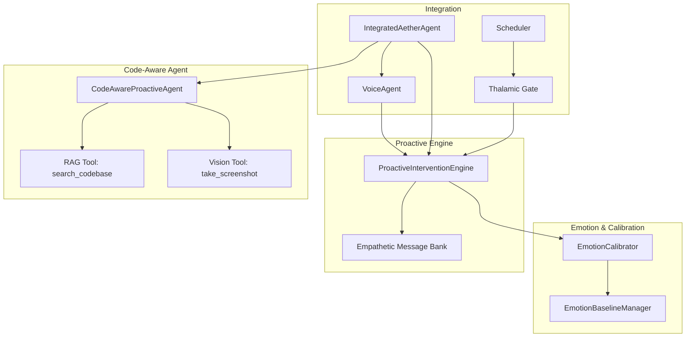
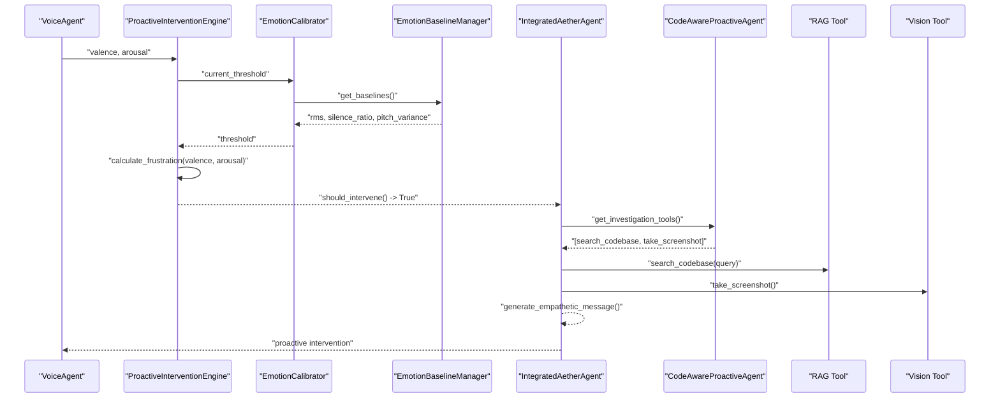
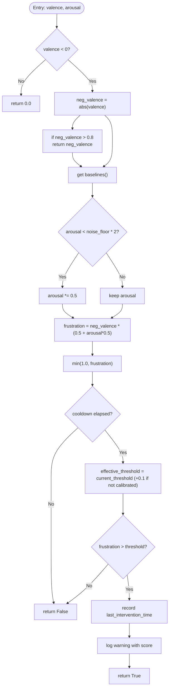
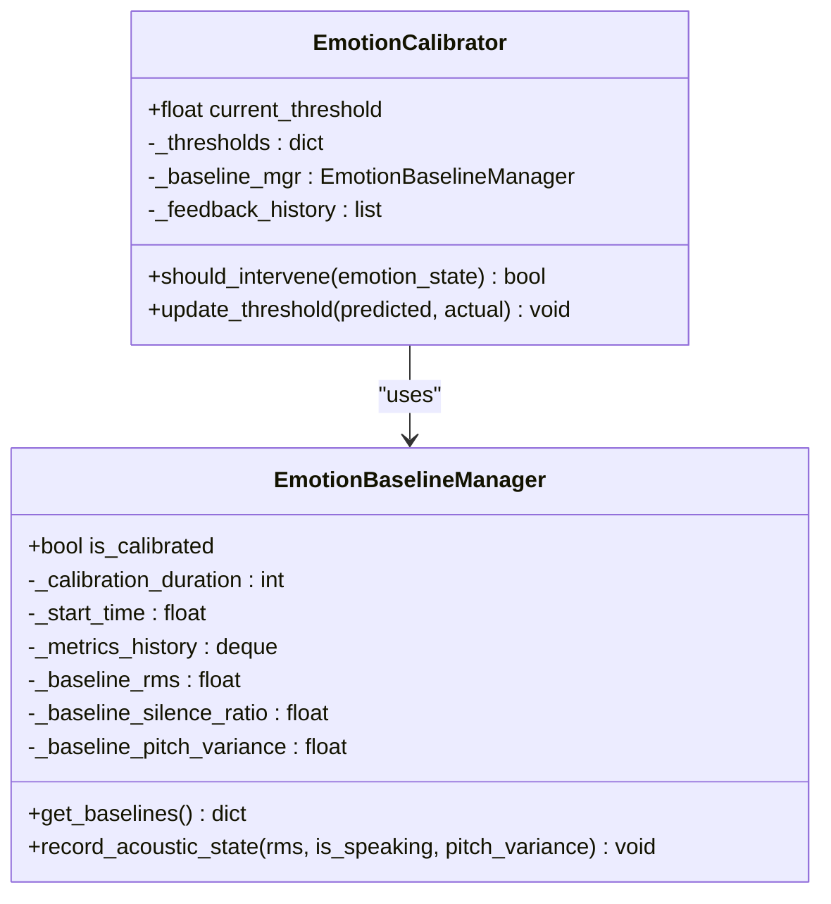
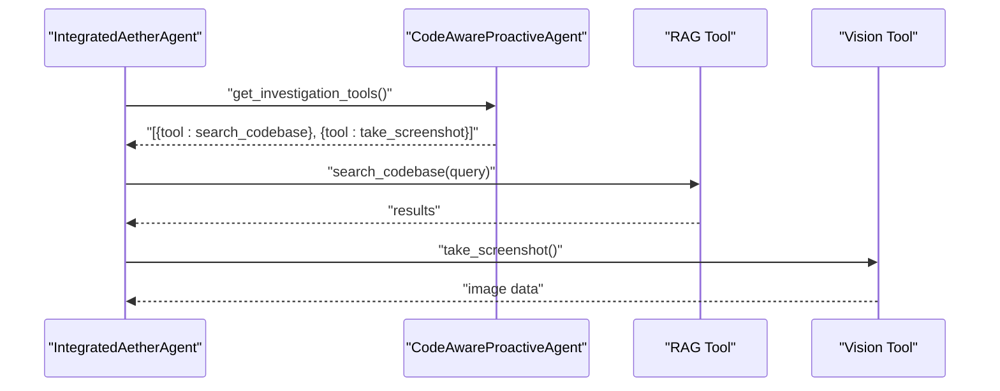
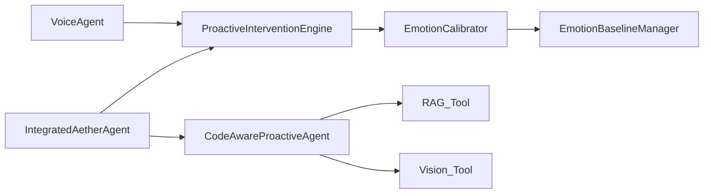

# Proactive Intervention Agents

<cite>
**Referenced Files in This Document**
- [proactive.py](file://core/ai/agents/proactive.py)
- [calibrator.py](file://core/emotion/calibrator.py)
- [baseline.py](file://core/emotion/baseline.py)
- [integrated.py](file://core/ai/agents/integrated.py)
- [rag_tool.py](file://core/tools/rag_tool.py)
- [vision_tool.py](file://core/tools/vision_tool.py)
- [voice_agent.py](file://core/ai/agents/voice_agent.py)
- [thalamic.py](file://core/ai/thalamic.py)
- [scheduler.py](file://core/ai/scheduler.py)
</cite>

## Table of Contents
1. [Introduction](#introduction)
2. [Project Structure](#project-structure)
3. [Core Components](#core-components)
4. [Architecture Overview](#architecture-overview)
5. [Detailed Component Analysis](#detailed-component-analysis)
6. [Dependency Analysis](#dependency-analysis)
7. [Performance Considerations](#performance-considerations)
8. [Troubleshooting Guide](#troubleshooting-guide)
9. [Conclusion](#conclusion)
10. [Appendices](#appendices)

## Introduction
This document describes the Proactive Intervention Agents system that autonomously detects user frustration via acoustic emotion signals and initiates context-aware interventions. It covers the ProactiveInterventionEngine and CodeAwareProactiveAgent implementations, the frustration detection algorithm, empathy-based messaging, code-aware investigation workflows, cooldown and scheduling strategies, integration with emotion detection systems, and trigger condition evaluation. It also provides guidance on configuring intervention parameters, customizing proactive behaviors, and extending the engine with new trigger conditions.

## Project Structure
The proactive intervention system spans several modules:
- Emotion detection and calibration: emotion baseline and calibrator
- Proactive intervention engine: frustration scoring, thresholds, and messaging
- Code-aware agent: tool suggestions for contextual debugging
- Integrated orchestrator: ties voice, proactive engine, and tool orchestration together
- Tools: RAG-based code search and screenshot capture
- Audio pipeline integration: voice agent and thalamic gating

**Diagram sources**
- [proactive.py](file://core/ai/agents/proactive.py#L10-L89)
- [calibrator.py](file://core/emotion/calibrator.py#L8-L64)
- [baseline.py](file://core/emotion/baseline.py#L9-L86)
- [integrated.py](file://core/ai/agents/integrated.py#L15-L66)
- [rag_tool.py](file://core/tools/rag_tool.py#L26-L76)
- [vision_tool.py](file://core/tools/vision_tool.py#L19-L55)
- [voice_agent.py](file://core/ai/agents/voice_agent.py#L8-L64)
- [thalamic.py](file://core/ai/thalamic.py#L46-L79)
- [scheduler.py](file://core/ai/scheduler.py#L33-L50)

**Section sources**
- [proactive.py](file://core/ai/agents/proactive.py#L1-L124)
- [calibrator.py](file://core/emotion/calibrator.py#L1-L65)
- [baseline.py](file://core/emotion/baseline.py#L1-L87)
- [integrated.py](file://core/ai/agents/integrated.py#L1-L66)
- [rag_tool.py](file://core/tools/rag_tool.py#L1-L109)
- [vision_tool.py](file://core/tools/vision_tool.py#L1-L75)
- [voice_agent.py](file://core/ai/agents/voice_agent.py#L1-L65)
- [thalamic.py](file://core/ai/thalamic.py#L46-L79)
- [scheduler.py](file://core/ai/scheduler.py#L33-L50)

## Core Components
- ProactiveInterventionEngine: Computes frustration from valence/arousal, applies dynamic thresholds and baselines, enforces cooldowns, and generates empathetic messages.
- EmotionCalibrator: Learns and adapts intervention thresholds based on feedback and acoustic baselines.
- EmotionBaselineManager: Builds dynamic acoustic baselines during a calibration window to normalize emotion metrics.
- CodeAwareProactiveAgent: Suggests tools (RAG code search and screenshot capture) for context-aware debugging upon intervention.
- IntegratedAetherAgent: Orchestrates voice processing, proactive checks, code context, and tool orchestration.
- VoiceAgent: Provides acoustic emotion extraction and latency tracking for the pipeline.
- Thalamic Gate and Scheduler: Detect sustained frustration and adjust cognitive load/priority based on acoustic traits.

**Section sources**
- [proactive.py](file://core/ai/agents/proactive.py#L10-L89)
- [calibrator.py](file://core/emotion/calibrator.py#L8-L64)
- [baseline.py](file://core/emotion/baseline.py#L9-L86)
- [integrated.py](file://core/ai/agents/integrated.py#L15-L66)
- [rag_tool.py](file://core/tools/rag_tool.py#L26-L76)
- [vision_tool.py](file://core/tools/vision_tool.py#L19-L55)
- [voice_agent.py](file://core/ai/agents/voice_agent.py#L8-L64)
- [thalamic.py](file://core/ai/thalamic.py#L46-L79)
- [scheduler.py](file://core/ai/scheduler.py#L33-L50)

## Architecture Overview
The system integrates real-time audio emotion extraction with adaptive thresholds and baselines. When sustained frustration is detected, the engine triggers an intervention, selects empathetic messaging, and suggests code-aware tools for contextual debugging.

**Diagram sources**
- [proactive.py](file://core/ai/agents/proactive.py#L30-L89)
- [calibrator.py](file://core/emotion/calibrator.py#L51-L64)
- [baseline.py](file://core/emotion/baseline.py#L77-L86)
- [integrated.py](file://core/ai/agents/integrated.py#L39-L61)
- [rag_tool.py](file://core/tools/rag_tool.py#L26-L76)
- [vision_tool.py](file://core/tools/vision_tool.py#L19-L55)
- [voice_agent.py](file://core/ai/agents/voice_agent.py#L55-L64)

## Detailed Component Analysis

### ProactiveInterventionEngine
Responsibilities:
- Compute frustration from valence and arousal with emphasis on negative valence and arousal weighting.
- Normalize scores using dynamic acoustic baselines.
- Enforce a cooldown period between interventions.
- Adaptively compare against a learned threshold from the EmotionCalibrator.
- Cycle through empathetic messages to avoid repetition.

Key behaviors:
- Frustration calculation favors deep negative valence and amplifies with arousal, while damping minor noise floor arousal.
- During calibration, requires a stricter threshold to reduce false positives.
- On intervention, records the last intervention time and logs the event.

**Diagram sources**
- [proactive.py](file://core/ai/agents/proactive.py#L30-L83)
- [calibrator.py](file://core/emotion/calibrator.py#L51-L64)
- [baseline.py](file://core/emotion/baseline.py#L77-L86)

**Section sources**
- [proactive.py](file://core/ai/agents/proactive.py#L10-L89)

### EmotionCalibrator and EmotionBaselineManager
Responsibilities:
- Maintain and adapt the frustration threshold based on feedback.
- Build acoustic baselines during a calibration window to normalize metrics.
- Provide effective thresholds considering calibration state.

Learning mechanism:
- Adjusts threshold multiplicatively depending on whether a predicted intervention matched the actual outcome.
- Clamps thresholds to a safe range to prevent drift.
- During calibration, adds a buffer to the threshold to be stricter.

Baseline computation:
- Records RMS energy, silence ratio, and pitch variance during the calibration window.
- Computes averages and exposes them to the engine for normalization.

**Diagram sources**
- [calibrator.py](file://core/emotion/calibrator.py#L8-L64)
- [baseline.py](file://core/emotion/baseline.py#L9-L86)

**Section sources**
- [calibrator.py](file://core/emotion/calibrator.py#L8-L64)
- [baseline.py](file://core/emotion/baseline.py#L9-L86)

### CodeAwareProactiveAgent
Responsibilities:
- Provide a list of investigation tools when frustration is detected.
- Return tool definitions with reasons and handler functions for immediate action.

Current tools:
- search_codebase: semantic codebase search for structural issues.
- take_screenshot: capture screen for visual diagnosis.

**Diagram sources**
- [proactive.py](file://core/ai/agents/proactive.py#L100-L124)
- [rag_tool.py](file://core/tools/rag_tool.py#L26-L76)
- [vision_tool.py](file://core/tools/vision_tool.py#L19-L55)

**Section sources**
- [proactive.py](file://core/ai/agents/proactive.py#L92-L124)
- [rag_tool.py](file://core/tools/rag_tool.py#L26-L76)
- [vision_tool.py](file://core/tools/vision_tool.py#L19-L55)

### IntegratedAetherAgent
Responsibilities:
- Initialize and coordinate the voice agent, proactive engine, code-aware agent, and tool orchestration.
- Process audio chunks, extract emotion, evaluate proactive triggers, and integrate code context.
- Record latency metrics for performance tracking.

Processing flow:
- Stream audio to VoiceAgent.
- Extract valence and arousal.
- Evaluate proactive intervention.
- Generate empathetic message and gather investigation tools.
- Optionally compute code context insights.

**Section sources**
- [integrated.py](file://core/ai/agents/integrated.py#L15-L66)
- [voice_agent.py](file://core/ai/agents/voice_agent.py#L47-L64)

### Thalamic Gate and Scheduler Integration
- Thalamic Gate: Periodically computes a frustration score from audio state and triggers intervention after a sustained streak, recording latency metrics.
- Scheduler: Adjusts cognitive load and prioritizes specialists based on acoustic traits (e.g., high arousal).

**Section sources**
- [thalamic.py](file://core/ai/thalamic.py#L46-L79)
- [scheduler.py](file://core/ai/scheduler.py#L33-L50)

## Dependency Analysis
The proactive system exhibits clear layering:
- VoiceAgent feeds valence/arousal to ProactiveInterventionEngine.
- ProactiveInterventionEngine depends on EmotionCalibrator, which depends on EmotionBaselineManager.
- IntegratedAetherAgent orchestrates the pipeline and registers the CodeAwareProactiveAgent for tool routing.
- CodeAwareProactiveAgent depends on RAG and Vision tools for contextual debugging.

**Diagram sources**
- [proactive.py](file://core/ai/agents/proactive.py#L10-L89)
- [calibrator.py](file://core/emotion/calibrator.py#L8-L64)
- [baseline.py](file://core/emotion/baseline.py#L9-L86)
- [integrated.py](file://core/ai/agents/integrated.py#L15-L66)
- [rag_tool.py](file://core/tools/rag_tool.py#L26-L76)
- [vision_tool.py](file://core/tools/vision_tool.py#L19-L55)

**Section sources**
- [proactive.py](file://core/ai/agents/proactive.py#L1-L124)
- [calibrator.py](file://core/emotion/calibrator.py#L1-L65)
- [baseline.py](file://core/emotion/baseline.py#L1-L87)
- [integrated.py](file://core/ai/agents/integrated.py#L1-L66)
- [rag_tool.py](file://core/tools/rag_tool.py#L1-L109)
- [vision_tool.py](file://core/tools/vision_tool.py#L1-L75)

## Performance Considerations
- Cooldown enforcement prevents frequent interruptions, balancing responsiveness with user experience.
- Dynamic baselines normalize arousal against ambient noise, reducing false positives in noisy environments.
- Adaptive thresholds learn from user feedback to improve accuracy over time.
- Tool latency tiers and idempotency (e.g., RAG tool) support reliable, low-latency interventions.
- Latency tracking and logging enable continuous optimization of the end-to-end pipeline.

[No sources needed since this section provides general guidance]

## Troubleshooting Guide
Common issues and resolutions:
- No intervention despite high frustration:
  - Verify cooldown window and ensure sufficient frustration score.
  - Confirm thresholds are calibrated and not overly strict during calibration.
- Frequent false positives:
  - Check baseline normalization and noise floor adjustments.
  - Review threshold updates and clamp behavior.
- Tool failures:
  - Validate RAG tool initialization and Firestore vector store availability.
  - Ensure screenshot permissions and monitor configuration.

**Section sources**
- [proactive.py](file://core/ai/agents/proactive.py#L60-L83)
- [calibrator.py](file://core/emotion/calibrator.py#L26-L49)
- [rag_tool.py](file://core/tools/rag_tool.py#L36-L44)
- [vision_tool.py](file://core/tools/vision_tool.py#L26-L55)

## Conclusion
The Proactive Intervention Agents system combines robust emotion detection, adaptive thresholds, and code-aware tooling to deliver timely, empathetic assistance. By normalizing acoustic baselines, enforcing cooldowns, and continuously learning from user feedback, it balances responsiveness with user comfort. The modular design supports easy extension with new trigger conditions, tools, and intervention strategies.

[No sources needed since this section summarizes without analyzing specific files]

## Appendices

### Configuration and Customization Guide
- Intervention parameters:
  - Cooldown duration: adjust in the ProactiveInterventionEngine constructor.
  - Frustration threshold: managed by EmotionCalibrator and influenced by calibration state.
  - Message bank: customize empathetic messages in the ProactiveInterventionEngine.
- Proactive behaviors:
  - Modify VoiceAgent DNA to influence verbosity, empathy, and proactivity.
- Extending trigger conditions:
  - Add new conditions in the ProactiveInterventionEngine’s evaluation logic.
  - Integrate additional baselines or metrics via EmotionBaselineManager.
- New tools:
  - Register new tools in CodeAwareProactiveAgent and ensure handlers are available.

**Section sources**
- [proactive.py](file://core/ai/agents/proactive.py#L16-L28)
- [calibrator.py](file://core/emotion/calibrator.py#L14-L20)
- [voice_agent.py](file://core/ai/agents/voice_agent.py#L19-L45)
- [integrated.py](file://core/ai/agents/integrated.py#L25-L37)

### Example Scenarios and Workflows
- Scenario: User expresses deep frustration
  - VoiceAgent extracts negative valence and elevated arousal.
  - ProactiveInterventionEngine computes a high frustration score, surpassing the adaptive threshold.
  - CodeAwareProactiveAgent suggests RAG search and screenshot capture.
  - Results are presented contextually to assist debugging.
- Workflow: Intervention effectiveness measurement
  - Track intervention latency and user feedback.
  - Observe recalibration of thresholds and baseline updates.
  - Monitor tool usage frequency and relevance to refine suggestions.

[No sources needed since this section provides conceptual examples]