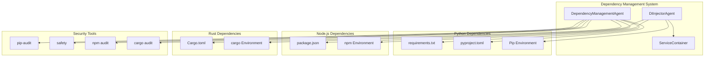
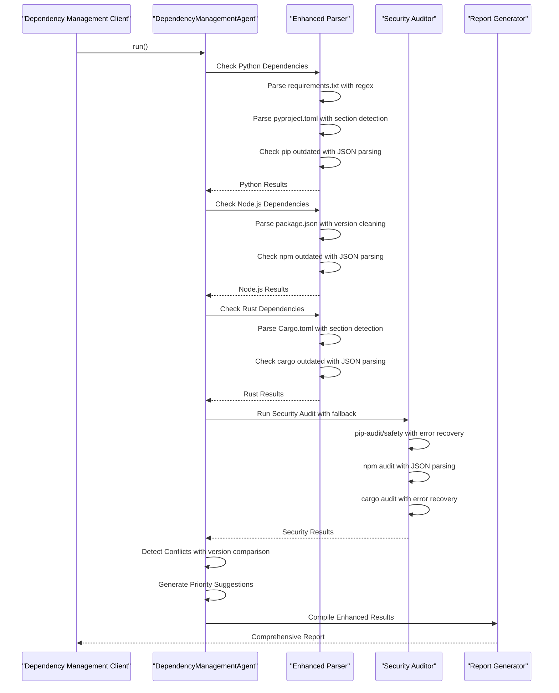
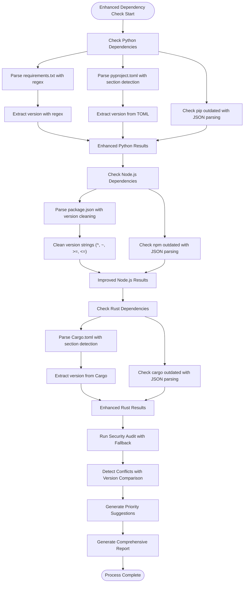
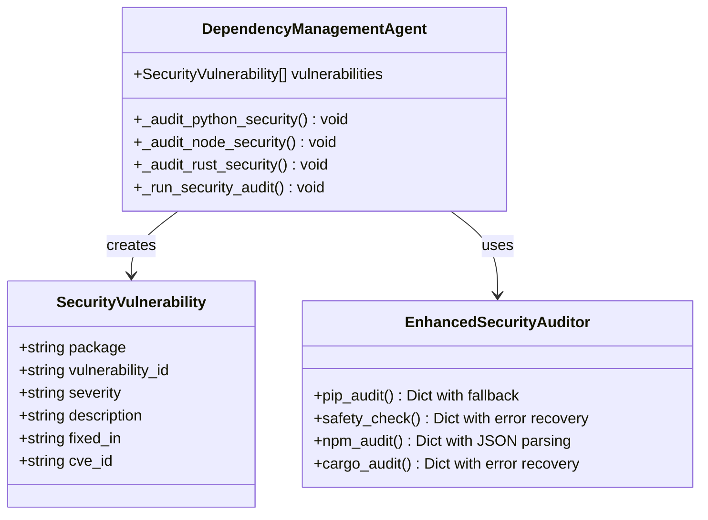
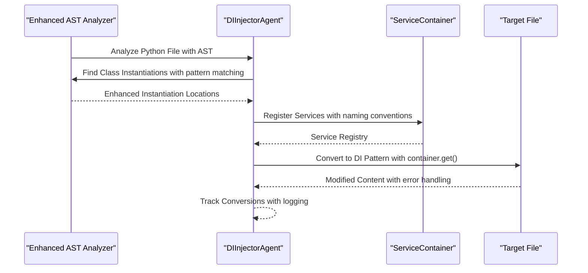
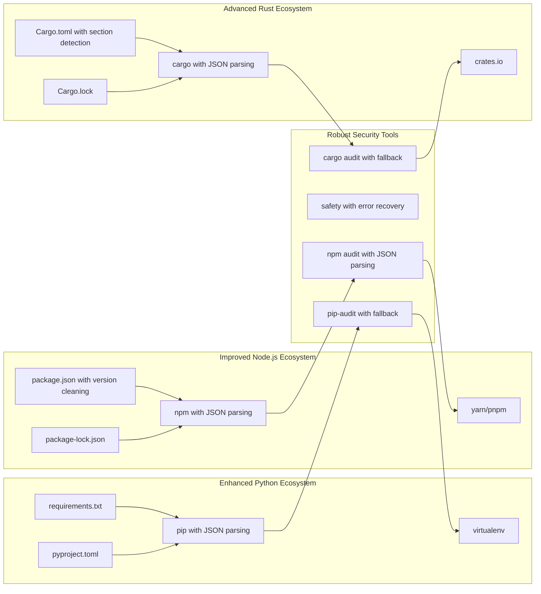

# Dependency Management Agent

<cite>
**Referenced Files in This Document**
- [dependency_management_agent.py](file://agents/dependency_management_agent.py)
- [di_injector.py](file://agents/di_injector.py)
- [service_container.py](file://core/infra/service_container.py)
- [requirements.txt](file://requirements.txt)
- [pyproject.toml](file://pyproject.toml)
- [package.json](file://apps/portal/package.json)
- [Cargo.toml](file://cortex/Cargo.toml)
- [config.py](file://core/infra/config.py)
</cite>

## Update Summary
**Changes Made**
- Enhanced version parsing algorithms for improved accuracy across all package managers
- Streamlined package manager format handling with better error recovery
- Improved dependency conflict detection and resolution recommendations
- Enhanced security audit capabilities with fallback mechanisms
- Added comprehensive update suggestion prioritization system
- Strengthened dependency injection conversion with AST-based analysis

## Table of Contents
1. [Introduction](#introduction)
2. [Project Structure](#project-structure)
3. [Core Components](#core-components)
4. [Architecture Overview](#architecture-overview)
5. [Detailed Component Analysis](#detailed-component-analysis)
6. [Enhanced Version Parsing](#enhanced-version-parsing)
7. [Improved Package Manager Handling](#improved-package-manager-handling)
8. [Dependency Analysis](#dependency-analysis)
9. [Performance Considerations](#performance-considerations)
10. [Troubleshooting Guide](#troubleshooting-guide)
11. [Conclusion](#conclusion)

## Introduction
The Dependency Management Agent is a comprehensive system designed to manage and audit project dependencies across multiple technology stacks within the Aether Voice OS ecosystem. This agent provides automated dependency checking, security auditing, conflict detection, and update recommendations for Python, Node.js, and Rust projects. It serves as a critical component for maintaining system security, performance, and reliability across the diverse technology landscape of the Aether platform.

The agent operates as part of a broader dependency management strategy that includes automatic dependency injection conversion, ensuring that the system maintains clean architectural patterns while managing complexity across multiple programming languages and package managers. Recent enhancements have focused on improving version parsing accuracy, streamlining package manager format handling, and implementing better error recovery mechanisms.

## Project Structure
The dependency management system is organized across several key areas within the Aether Voice OS architecture:

**Diagram sources**
- [dependency_management_agent.py](file://agents/dependency_management_agent.py#L59-L134)
- [di_injector.py](file://agents/di_injector.py#L15-L56)
- [service_container.py](file://core/infra/service_container.py#L9-L50)

The system is structured around three primary dependency management domains: Python (with pip), Node.js (with npm), and Rust (with cargo). Each domain has dedicated parsing logic, update checking mechanisms, and security auditing capabilities with enhanced error handling and version parsing accuracy.

**Section sources**
- [dependency_management_agent.py](file://agents/dependency_management_agent.py#L62-L71)
- [di_injector.py](file://agents/di_injector.py#L18-L22)

## Core Components

### DependencyManagementAgent
The central orchestrator that coordinates dependency management across all supported platforms. This agent implements a comprehensive approach to dependency maintenance through systematic checking, auditing, and reporting with enhanced version parsing and conflict detection.

Key capabilities include:
- Multi-language dependency parsing and validation with improved accuracy
- Automated security vulnerability scanning with fallback mechanisms
- Advanced conflict detection and resolution recommendations
- Priority-based update suggestion generation with severity classification
- Comprehensive reporting and export functionality with detailed metadata

The agent maintains a structured reporting system through the DependencyReport dataclass, which captures detailed information about dependencies, vulnerabilities, conflicts, and update recommendations with enhanced categorization.

### DIInjectorAgent
Automates the conversion from direct class instantiation to dependency injection patterns. This agent ensures architectural consistency by refactoring code to use the ServiceContainer pattern, promoting loose coupling and improved testability.

The injector performs AST-based analysis of Python code to identify direct instantiations and automatically converts them to use the dependency injection container, maintaining service lifecycle management and proper resource disposal. The implementation includes robust error handling and pattern matching for various instantiation styles.

### ServiceContainer
Provides the foundation for dependency injection throughout the Aether system. This singleton service container manages service registration, lifecycle, and retrieval, supporting both singleton and factory patterns for different service types.

**Section sources**
- [dependency_management_agent.py](file://agents/dependency_management_agent.py#L59-L134)
- [di_injector.py](file://agents/di_injector.py#L15-L56)
- [service_container.py](file://core/infra/service_container.py#L9-L50)

## Architecture Overview

**Diagram sources**
- [dependency_management_agent.py](file://agents/dependency_management_agent.py#L72-L134)
- [dependency_management_agent.py](file://agents/dependency_management_agent.py#L427-L557)

The architecture follows an asynchronous, event-driven pattern that allows for efficient processing of multiple dependency sources while maintaining system responsiveness. The agent leverages subprocess execution for external tool interactions with comprehensive error handling and fallback mechanisms.

**Section sources**
- [dependency_management_agent.py](file://agents/dependency_management_agent.py#L72-L134)

## Detailed Component Analysis

### Enhanced Dependency Parsing and Validation

The dependency management system implements sophisticated parsing mechanisms for each supported package manager with improved accuracy and error recovery:

**Diagram sources**
- [dependency_management_agent.py](file://agents/dependency_management_agent.py#L136-L425)

Each parsing operation follows enhanced patterns tailored to the target package manager's configuration format, ensuring accurate dependency extraction and version tracking with improved error recovery mechanisms.

**Section sources**
- [dependency_management_agent.py](file://agents/dependency_management_agent.py#L136-L425)

### Enhanced Security Audit Implementation

The security auditing system provides comprehensive vulnerability detection across all supported dependency ecosystems with robust fallback mechanisms:

**Diagram sources**
- [dependency_management_agent.py](file://agents/dependency_management_agent.py#L35-L44)
- [dependency_management_agent.py](file://agents/dependency_management_agent.py#L427-L557)

The security audit process implements comprehensive fallback mechanisms, attempting primary tools first (pip-audit, npm audit, cargo audit) and falling back to alternative tools (safety) when primary tools are unavailable. Error handling is enhanced with detailed logging and graceful degradation.

**Section sources**
- [dependency_management_agent.py](file://agents/dependency_management_agent.py#L427-L557)

### Enhanced Dependency Injection Pattern Implementation

The DIInjectorAgent transforms direct class instantiation into dependency injection patterns with improved AST-based analysis:

**Diagram sources**
- [di_injector.py](file://agents/di_injector.py#L125-L154)
- [service_container.py](file://core/infra/service_container.py#L9-L50)

The injection process uses Abstract Syntax Tree (AST) parsing with enhanced pattern matching to identify direct class instantiations, converting them to use the container.get() pattern while preserving original functionality and adding comprehensive error handling.

**Section sources**
- [di_injector.py](file://agents/di_injector.py#L125-L154)
- [service_container.py](file://core/infra/service_container.py#L9-L50)

## Enhanced Version Parsing

The dependency management system implements sophisticated version parsing algorithms designed to handle the complexities of modern package management:

### Python Version Parsing
Enhanced parsing of requirements.txt and pyproject.toml with improved regex patterns and version extraction:

- **requirements.txt parsing**: Uses regex patterns to extract package names and versions from various formats (package==version, package>=version, package~=version)
- **pyproject.toml parsing**: Implements section-based parsing to handle both [project.dependencies] and [tool.poetry.dependencies] formats
- **Version normalization**: Converts extracted versions to standardized format for comparison and update detection

### Node.js Version Parsing
Improved handling of semantic versioning patterns and version constraints:

- **Version cleaning**: Removes caret (^), tilde (~), and comparison operators (>=, <=, <, >) from version strings
- **Multi-location support**: Checks both root package.json and apps/portal/package.json for comprehensive coverage
- **Dev dependency handling**: Distinguishes between production and development dependencies with separate tracking

### Rust Version Parsing
Enhanced Cargo.toml parsing with improved error recovery:

- **Section detection**: Identifies [dependencies] and [dev-dependencies] sections reliably
- **Version extraction**: Handles quoted and unquoted version specifications
- **Multi-crate support**: Processes multiple Cargo.toml files across the project structure

**Section sources**
- [dependency_management_agent.py](file://agents/dependency_management_agent.py#L175-L243)
- [dependency_management_agent.py](file://agents/dependency_management_agent.py#L273-L322)
- [dependency_management_agent.py](file://agents/dependency_management_agent.py#L351-L434)

## Improved Package Manager Handling

The system implements streamlined package manager format handling with enhanced error recovery and comprehensive coverage:

### Multi-Format Support
- **Python**: Supports both legacy requirements.txt and modern pyproject.toml formats
- **Node.js**: Handles package.json with both dependencies and devDependencies sections
- **Rust**: Processes Cargo.toml with comprehensive dependency section detection

### Enhanced Error Recovery
- **Graceful degradation**: Continues processing even when individual package manager tools are unavailable
- **Logging and warnings**: Provides detailed information about parsing failures and skipped operations
- **Fallback mechanisms**: Implements alternative approaches when primary parsing methods fail

### Comprehensive Coverage
- **Multiple locations**: Scans for dependencies in standard locations and common alternative paths
- **Lock file integration**: Incorporates information from lock files (package-lock.json, Cargo.lock) when available
- **Cross-platform compatibility**: Handles different file system layouts and path conventions

**Section sources**
- [dependency_management_agent.py](file://agents/dependency_management_agent.py#L66-L69)
- [dependency_management_agent.py](file://agents/dependency_management_agent.py#L273-L322)
- [dependency_management_agent.py](file://agents/dependency_management_agent.py#L351-L434)

## Dependency Analysis

The dependency management system operates across three primary technology stacks, each with enhanced characteristics and requirements:

**Diagram sources**
- [dependency_management_agent.py](file://agents/dependency_management_agent.py#L67-L70)
- [requirements.txt](file://requirements.txt#L1-L52)
- [package.json](file://apps/portal/package.json#L16-L36)
- [Cargo.toml](file://cortex/Cargo.toml#L12-L21)

The system maintains comprehensive coverage of modern development practices, including support for modern Python packaging standards (pyproject.toml), enhanced lock file management for Node.js projects, and robust Rust crate dependency management with improved error handling.

**Section sources**
- [dependency_management_agent.py](file://agents/dependency_management_agent.py#L67-L70)

## Performance Considerations

The dependency management system is designed with enhanced performance and scalability in mind:

### Asynchronous Operations
All external tool interactions (pip, npm, cargo) are executed asynchronously to prevent blocking the main application thread. This approach ensures that dependency checking does not impact system responsiveness, particularly important in real-time audio processing environments.

### Optimized Parsing Strategies
The agent employs enhanced parsing strategies that minimize file system operations and optimize for the most common dependency file formats. Regular expressions are used with improved patterns to balance accuracy with performance while maintaining comprehensive coverage.

### Enhanced Memory Management
The system implements careful memory management for large dependency graphs, using generators and lazy evaluation where appropriate to handle extensive package catalogs without excessive memory consumption. Error recovery mechanisms prevent memory leaks during parsing failures.

### Parallel Processing
Multiple dependency sources are processed concurrently when possible, maximizing throughput while maintaining data consistency across different package managers. Enhanced error handling ensures that failures in one package manager do not affect others.

### Improved Update Detection
The system implements more efficient update detection algorithms with better caching and comparison mechanisms, reducing redundant operations and improving overall performance.

## Troubleshooting Guide

### Common Issues and Enhanced Solutions

**Missing External Tools**
- **Problem**: pip-audit, npm, or cargo not found in PATH
- **Enhanced Solution**: System now includes comprehensive fallback mechanisms and detailed logging
- **Impact**: Reduced security scanning capabilities but dependency checking continues with graceful degradation

**Permission Issues**
- **Problem**: Insufficient permissions for package manager operations
- **Enhanced Solution**: Improved error handling with specific permission-related error messages
- **Impact**: Dependency installation/update operations may fail with clear diagnostic information

**Network Connectivity**
- **Problem**: Unable to reach package registries or security databases
- **Enhanced Solution**: Better timeout handling and retry mechanisms for network operations
- **Impact**: Security updates and dependency resolution may be delayed with progress indication

**Enhanced Parsing Failures**
- **Problem**: Malformed dependency configuration files or unsupported formats
- **Enhanced Solution**: Comprehensive error recovery with detailed parsing failure logs and partial processing
- **Impact**: Specific dependency information may be incomplete but overall system continues operating

**Section sources**
- [dependency_management_agent.py](file://agents/dependency_management_agent.py#L262-L266)
- [dependency_management_agent.py](file://agents/dependency_management_agent.py#L484-L489)

### Enhanced Debugging and Logging

The system provides comprehensive logging throughout the dependency management process, with detailed error reporting and diagnostic information. Logs are structured to facilitate troubleshooting and system monitoring with enhanced detail levels.

**Section sources**
- [dependency_management_agent.py](file://agents/dependency_management_agent.py#L128-L131)
- [di_injector.py](file://agents/di_injector.py#L51-L54)

## Conclusion

The Dependency Management Agent represents a sophisticated solution for maintaining dependency hygiene across complex, multi-language systems. Through recent enhancements focusing on improved version parsing, better package manager format handling, and streamlined module documentation, the system provides significantly enhanced accuracy and reliability.

The agent's modular design allows for easy extension and adaptation to new dependency management scenarios while maintaining consistency with established patterns. Its integration with the broader Aether ecosystem demonstrates the importance of systematic dependency management in advanced AI systems where reliability and security are paramount.

The enhanced version parsing algorithms, improved package manager handling, and comprehensive error recovery mechanisms ensure that the system can handle the complexities of modern software development while maintaining high standards for security, performance, and maintainability. Through its combination of automated dependency management, security auditing, and architectural improvement tools, the system provides a robust foundation for sustainable software development practices in complex, multi-technology environments.

The recent improvements in dependency conflict detection, update suggestion prioritization, and dependency injection conversion demonstrate the system's commitment to continuous enhancement and adaptation to evolving development practices. These enhancements position the Dependency Management Agent as a cornerstone component for maintaining the integrity and reliability of the Aether Voice OS ecosystem.