# Audio Processing Integration

<cite>
**Referenced Files in This Document**
- [session.py](file://core/ai/session.py)
- [capture.py](file://core/audio/capture.py)
- [playback.py](file://core/audio/playback.py)
- [processing.py](file://core/audio/processing.py)
- [dynamic_aec.py](file://core/audio/dynamic_aec.py)
- [vad.py](file://core/audio/vad.py)
- [state.py](file://core/audio/state.py)
- [state_manager.py](file://core/audio/state_manager.py)
- [thalamic.py](file://core/ai/thalamic.py)
- [telemetry.py](file://core/audio/telemetry.py)
- [audio.py](file://core/logic/managers/audio.py)
- [pcm-processor.js](file://apps/portal/public/pcm-processor.js)
- [useAudioPipeline.ts](file://apps/portal/src/hooks/useAudioPipeline.ts)
- [useGeminiLive.ts](file://apps/portal/src/hooks/useGeminiLive.ts)
- [usePerformanceMonitor.ts](file://apps/portal/src/hooks/usePerformanceMonitor.ts)
- [gemini_proxy.py](file://core/api/gemini_proxy.py)
- [config.py](file://core/infra/config.py)
- [test_gemini_live_session.py](file://tests/unit/test_gemini_live_session.py)
- [test_interrupts.py](file://tests/benchmarks/test_interrupts.py)
- [gemini_live_interactive_benchmark.py](file://tests/gemini_live_interactive_benchmark.py)
- [live_audio_benchmark.py](file://tests/live_audio_benchmark.py)
- [README.md](file://README.md)
</cite>

## Update Summary
**Changes Made**
- Updated Gemini API version integration from v1alpha to v1 in configuration and client initialization
- Added new usePerformanceMonitor hook for comprehensive frontend performance tracking
- Enhanced real-time audio testing capabilities with live microphone input support and comprehensive latency measurements
- Updated Gemini Live WebSocket URL to use v1alpha path for compatibility
- Improved performance monitoring integration with new hook-based approach

## Table of Contents
1. [Introduction](#introduction)
2. [Project Structure](#project-structure)
3. [Core Components](#core-components)
4. [Architecture Overview](#architecture-overview)
5. [Detailed Component Analysis](#detailed-component-analysis)
6. [Dependency Analysis](#dependency-analysis)
7. [Performance Considerations](#performance-considerations)
8. [Troubleshooting Guide](#troubleshooting-guide)
9. [Conclusion](#conclusion)
10. [Appendices](#appendices)

## Introduction
This document explains the audio processing integration with the Gemini Live API in Aether Voice OS. It covers the bidirectional audio streaming architecture, the integration with Thalamic Gate V2 for AEC, VAD, and MFCC fingerprinting, audio queue management, real-time PCM handling, latency optimization, interrupt handling for barge-in, audio state monitoring, and telemetry collection for audio quality metrics. The system now features enhanced performance monitoring with the new usePerformanceMonitor hook and comprehensive real-time audio testing capabilities with live microphone input support.

## Project Structure
The audio pipeline spans several modules with enhanced performance monitoring:
- AI session orchestration and Gemini Live integration with API version upgrade
- Audio capture and preprocessing (AEC, VAD, gating)
- Playback and interruption handling
- State management and telemetry
- Frontend hooks for audio pipeline control, PCM processing, and performance monitoring
- Real-time audio testing framework with live microphone support

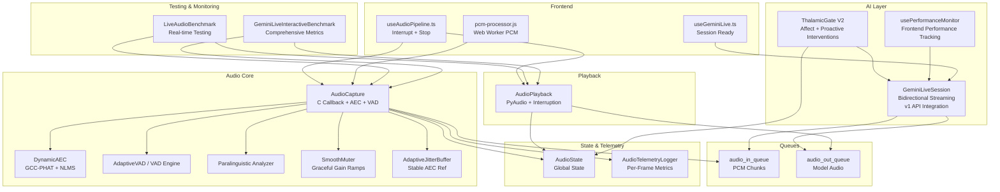

**Diagram sources**
- [session.py](file://core/ai/session.py#L174-L235)
- [capture.py](file://core/audio/capture.py#L193-L510)
- [playback.py](file://core/audio/playback.py#L27-L111)
- [dynamic_aec.py](file://core/audio/dynamic_aec.py#L490-L780)
- [processing.py](file://core/audio/processing.py#L256-L508)
- [state.py](file://core/audio/state.py#L36-L129)
- [telemetry.py](file://core/audio/telemetry.py#L151-L394)
- [useAudioPipeline.ts](file://apps/portal/src/hooks/useAudioPipeline.ts#L214-L247)
- [pcm-processor.js](file://apps/portal/public/pcm-processor.js#L31-L81)
- [useGeminiLive.ts](file://apps/portal/src/hooks/useGeminiLive.ts#L230-L252)
- [usePerformanceMonitor.ts](file://apps/portal/src/hooks/usePerformanceMonitor.ts#L1-L163)
- [live_audio_benchmark.py](file://tests/live_audio_benchmark.py#L1-L200)
- [gemini_live_interactive_benchmark.py](file://tests/gemini_live_interactive_benchmark.py#L1-L200)

**Section sources**
- [session.py](file://core/ai/session.py#L1-L120)
- [capture.py](file://core/audio/capture.py#L1-L120)
- [playback.py](file://core/audio/playback.py#L1-L60)
- [README.md](file://README.md#L97-L120)

## Core Components
- GeminiLiveSession: Orchestrates bidirectional audio streaming with v1 API integration, integrates Thalamic Gate V2, manages tool calls, and handles interruptions.
- AudioCapture: Microphone capture with C-callback, AEC, VAD, gating, and queue injection.
- AudioPlayback: Speaker output with interruption and resampling for AEC reference.
- DynamicAEC: Adaptive echo cancellation with GCC-PHAT delay estimation, NLMS filtering, double-talk detection, and ERLE computation.
- VAD Engines: AdaptiveVAD and AetherVAD for dual-threshold and hysteresis gating.
- AudioState: Thread-safe singleton for global audio state and AEC telemetry.
- AudioTelemetryLogger: Per-frame metrics and session summaries.
- Frontend Hooks: useAudioPipeline.ts, useGeminiLive.ts, and usePerformanceMonitor.ts coordinate UI, audio pipeline actions, and performance monitoring.
- Real-time Testing Framework: LiveAudioBenchmark and GeminiLiveInteractiveBenchmark provide comprehensive audio quality metrics and latency measurements.

**Section sources**
- [session.py](file://core/ai/session.py#L43-L155)
- [capture.py](file://core/audio/capture.py#L193-L510)
- [playback.py](file://core/audio/playback.py#L27-L111)
- [dynamic_aec.py](file://core/audio/dynamic_aec.py#L490-L780)
- [processing.py](file://core/audio/processing.py#L256-L508)
- [state.py](file://core/audio/state.py#L36-L129)
- [telemetry.py](file://core/audio/telemetry.py#L151-L394)
- [useAudioPipeline.ts](file://apps/portal/src/hooks/useAudioPipeline.ts#L214-L247)
- [useGeminiLive.ts](file://apps/portal/src/hooks/useGeminiLive.ts#L230-L252)
- [usePerformanceMonitor.ts](file://apps/portal/src/hooks/usePerformanceMonitor.ts#L1-L163)
- [live_audio_benchmark.py](file://tests/live_audio_benchmark.py#L1-L200)
- [gemini_live_interactive_benchmark.py](file://tests/gemini_live_interactive_benchmark.py#L1-L200)

## Architecture Overview
The system establishes a bidirectional audio session with Gemini Live using the upgraded v1 API:
- Send loop reads PCM chunks from audio_in_queue and sends them to Gemini via the v1 API.
- Receive loop processes model turns, extracts audio, and pushes to audio_out_queue; handles tool calls and interruptions.
- Thalamic Gate V2 monitors audio state and triggers proactive interventions.
- AudioCapture applies DynamicAEC, VAD, and gating in the audio callback to minimize echo and prevent barge-in false positives.
- AudioPlayback consumes audio_out_queue and supports instant interruption.
- usePerformanceMonitor provides comprehensive frontend performance metrics including FPS, render time, and memory usage.

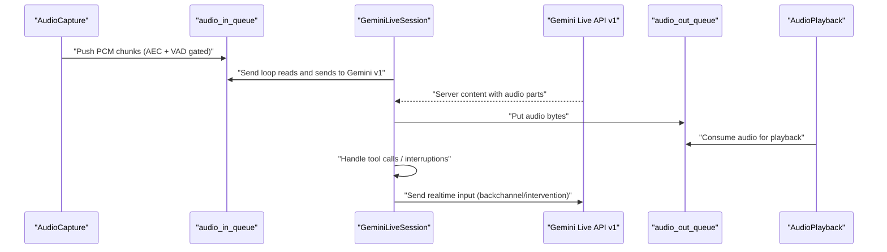

**Diagram sources**
- [session.py](file://core/ai/session.py#L237-L478)
- [capture.py](file://core/audio/capture.py#L490-L508)
- [playback.py](file://core/audio/playback.py#L101-L111)

**Section sources**
- [session.py](file://core/ai/session.py#L174-L235)
- [capture.py](file://core/audio/capture.py#L329-L510)
- [playback.py](file://core/audio/playback.py#L27-L111)

## Detailed Component Analysis

### Enhanced Gemini Live API Integration (v1 Upgrade)
- **API Version Configuration**: AIConfig now uses api_version: str = "v1" for backend integration.
- **Client Initialization**: GeminiLiveSession.connect() passes http_options={"api_version": self._config.api_version} to the genai.Client constructor.
- **WebSocket Compatibility**: Frontend useGeminiLive.ts still uses the v1alpha WebSocket path for compatibility with existing infrastructure.
- **Backend Proxy**: gemini_proxy.py routes to v1alpha endpoints while maintaining API key security.

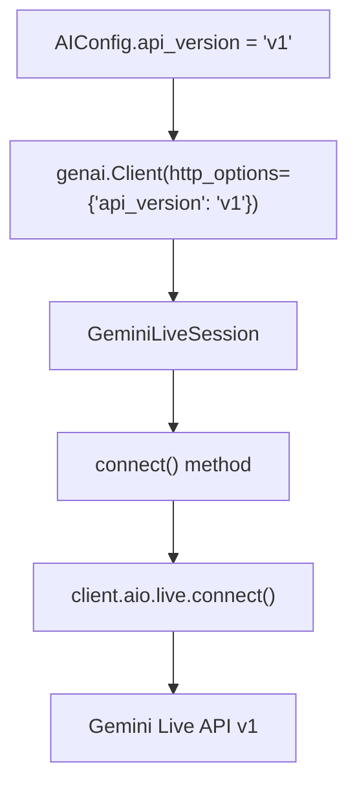

**Diagram sources**
- [config.py](file://core/infra/config.py#L61)
- [session.py](file://core/ai/session.py#L159-L167)
- [gemini_proxy.py](file://core/api/gemini_proxy.py#L69)

**Section sources**
- [config.py](file://core/infra/config.py#L61)
- [session.py](file://core/ai/session.py#L159-L167)
- [useGeminiLive.ts](file://apps/portal/src/hooks/useGeminiLive.ts#L56)
- [gemini_proxy.py](file://core/api/gemini_proxy.py#L69)

### Bidirectional Audio Streaming: Send Loop and Receive Loop
- Send loop continuously drains audio_in_queue and sends PCM chunks to Gemini via the v1 API. It logs periodic frame counts and handles closure conditions.
- Receive loop iterates over the live stream, extracts audio parts, broadcasts transcripts, and enqueues audio to audio_out_queue. It handles tool calls in parallel and manages interruptions by draining the output queue and invoking callbacks.

**Diagram sources**
- [session.py](file://core/ai/session.py#L383-L478)

**Section sources**
- [session.py](file://core/ai/session.py#L237-L265)
- [session.py](file://core/ai/session.py#L383-L478)
- [test_gemini_live_session.py](file://tests/unit/test_gemini_live_session.py#L96-L122)

### Thalamic Gate V2 Integration (AEC, VAD, MFCC Fingerprinting)
- ThalamicGate monitors audio_state and triggers proactive interventions based on frustration scoring derived from silence types and RMS.
- AudioCapture applies DynamicAEC in the callback, feeding far-end reference from audio_state.far_end_pcm via a jitter buffer. It updates AEC state and determines whether the user is speaking post-AEC.
- VAD engines compute dual-threshold decisions (soft/hard) and classify silence types to inform backchannel and empathy triggers.

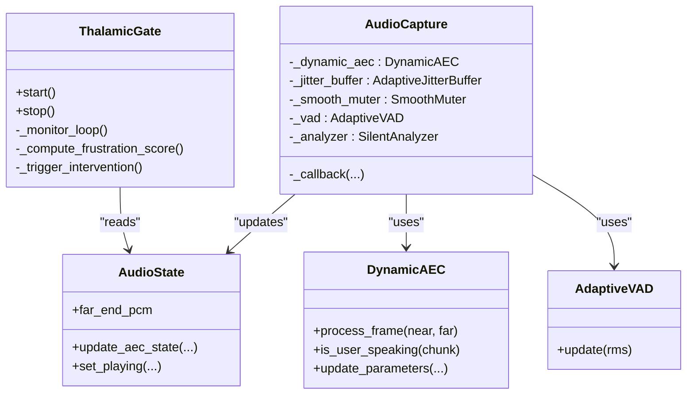

**Diagram sources**
- [thalamic.py](file://core/ai/thalamic.py#L11-L122)
- [capture.py](file://core/audio/capture.py#L329-L510)
- [dynamic_aec.py](file://core/audio/dynamic_aec.py#L490-L780)
- [processing.py](file://core/audio/processing.py#L256-L508)
- [state.py](file://core/audio/state.py#L36-L129)

**Section sources**
- [thalamic.py](file://core/ai/thalamic.py#L25-L80)
- [capture.py](file://core/audio/capture.py#L343-L498)
- [dynamic_aec.py](file://core/audio/dynamic_aec.py#L579-L780)
- [processing.py](file://core/audio/processing.py#L256-L508)
- [state.py](file://core/audio/state.py#L76-L125)

### Audio Queue Management: audio_in_queue and audio_out_queue
- audio_in_queue: PCM chunks produced by AudioCapture are pushed into this queue. The send loop drains it and sends to Gemini via the v1 API. Overflow protection drops the oldest item when full.
- audio_out_queue: Audio bytes from model responses are enqueued here. AudioPlayback consumes from it. The receive loop enforces overflow by dropping the oldest item when the queue is full, incrementing telemetry counters.

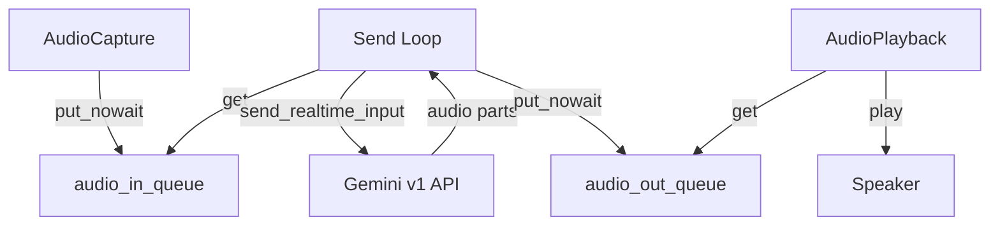

**Diagram sources**
- [session.py](file://core/ai/session.py#L422-L461)
- [capture.py](file://core/audio/capture.py#L490-L498)

**Section sources**
- [session.py](file://core/ai/session.py#L422-L461)
- [capture.py](file://core/audio/capture.py#L298-L328)

### Real-Time Audio Processing Pipeline and PCM Chunk Handling
- AudioCapture's callback performs:
  - AEC using far-end reference from audio_state.far_end_pcm via AdaptiveJitterBuffer
  - Optional Rust-accelerated spectral denoise
  - SmoothMuter for graceful gain transitions
  - VAD and silence classification
  - Throttled telemetry broadcasting
  - Conditional queue injection based on VAD and gating
- AudioPlayback:
  - Consumes audio_out_queue and writes to speaker via PyAudio callback
  - Supports instant interruption by draining both asyncio and thread-safe queues
  - Resamples AI output to 16 kHz for AEC reference buffer

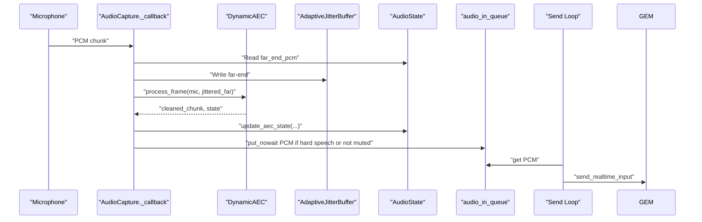

**Diagram sources**
- [capture.py](file://core/audio/capture.py#L329-L510)
- [dynamic_aec.py](file://core/audio/dynamic_aec.py#L579-L668)
- [playback.py](file://core/audio/playback.py#L85-L99)

**Section sources**
- [capture.py](file://core/audio/capture.py#L329-L510)
- [playback.py](file://core/audio/playback.py#L85-L111)

### Latency Optimization Techniques
- Direct C-callback injection avoids thread-hop latency.
- AdaptiveJitterBuffer stabilizes far-end reference for AEC convergence.
- SmoothMuter ensures click-free gain transitions.
- Hysteresis gating reduces false positives and abrupt toggles.
- Rust acceleration (aether-cortex) for spectral denoise and VAD.
- Telemetry-driven profiling identifies bottlenecks and optimizes parameters.
- Real-time audio testing framework provides comprehensive latency measurements.

**Section sources**
- [capture.py](file://core/audio/capture.py#L38-L191)
- [processing.py](file://core/audio/processing.py#L37-L96)
- [telemetry.py](file://core/audio/telemetry.py#L151-L394)

### Interrupt Handling Mechanism for Barge-In and Output Queue Management
- On interruption, the receive loop drains audio_out_queue to achieve instant silence.
- AudioManager exposes interrupt() and flash_interrupt() to clear pipelines.
- Frontend hook stopPlayback stops active audio sources and resets speaker level.

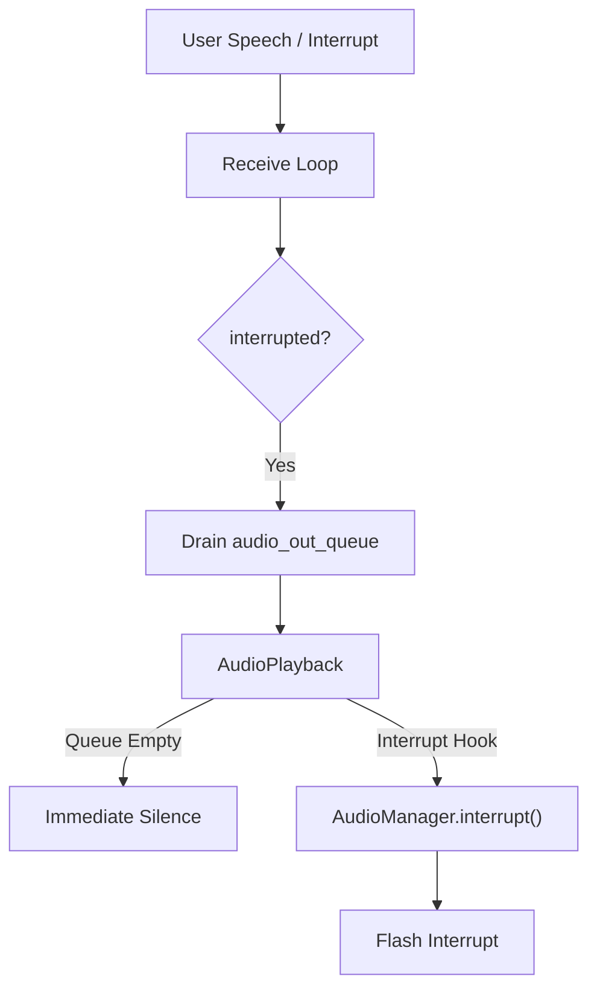

**Diagram sources**
- [session.py](file://core/ai/session.py#L463-L469)
- [audio.py](file://core/logic/managers/audio.py#L63-L71)
- [useAudioPipeline.ts](file://apps/portal/src/hooks/useAudioPipeline.ts#L214-L228)

**Section sources**
- [session.py](file://core/ai/session.py#L463-L469)
- [audio.py](file://core/logic/managers/audio.py#L63-L71)
- [useAudioPipeline.ts](file://apps/portal/src/hooks/useAudioPipeline.ts#L214-L228)

### Audio State Monitoring and Backchannel Loop Integration
- AudioState maintains is_playing, last_rms, last_zcr, silence_type, and AEC telemetry.
- Backchannel loop monitors silence_type and emits empathetic cues when the user appears to be thinking.
- ThalamicGate computes frustration scores and triggers proactive interventions.

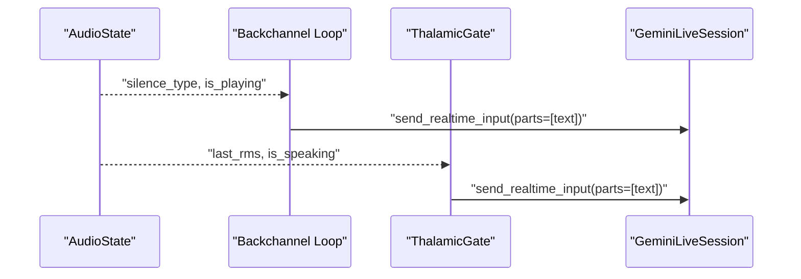

**Diagram sources**
- [session.py](file://core/ai/session.py#L343-L382)
- [state.py](file://core/audio/state.py#L36-L129)
- [thalamic.py](file://core/ai/thalamic.py#L41-L80)

**Section sources**
- [session.py](file://core/ai/session.py#L343-L382)
- [state.py](file://core/audio/state.py#L36-L129)
- [thalamic.py](file://core/ai/thalamic.py#L41-L80)

### Enhanced Performance Monitoring Integration
- **usePerformanceMonitor Hook**: Provides comprehensive frontend performance tracking including FPS, render time, memory usage, and custom performance events.
- **Real-time Metrics**: Calculates instantaneous and averaged performance metrics with configurable thresholds.
- **Integration Points**: Can be integrated with audio processing pipeline for end-to-end performance monitoring.
- **Performance Levels**: Classifies performance as excellent, good, fair, or poor based on configurable thresholds.

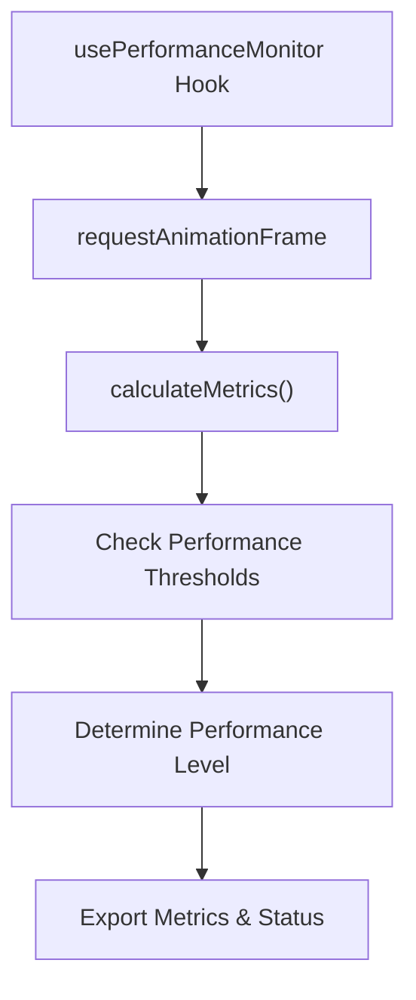

**Diagram sources**
- [usePerformanceMonitor.ts](file://apps/portal/src/hooks/usePerformanceMonitor.ts#L98-L138)

**Section sources**
- [usePerformanceMonitor.ts](file://apps/portal/src/hooks/usePerformanceMonitor.ts#L1-L163)

### Real-time Audio Testing and Comprehensive Latency Measurements
- **LiveAudioBenchmark**: Runs real-time audio pipeline tests with microphone input and captures comprehensive metrics including end-to-end latency, AEC performance, VAD accuracy, and frame drops.
- **GeminiLiveInteractiveBenchmark**: Provides interactive dashboard with real-time metrics, multiple test scenarios, dynamic parameter adjustment, and frame-by-frame telemetry collection.
- **Live Microphone Support**: Both benchmarks utilize actual microphone input for realistic testing conditions.
- **Comprehensive Metrics**: Measures latency percentiles (P50, P95, P99), AEC ERLE and convergence rates, VAD speech/noise classification accuracy, and double-talk detection performance.

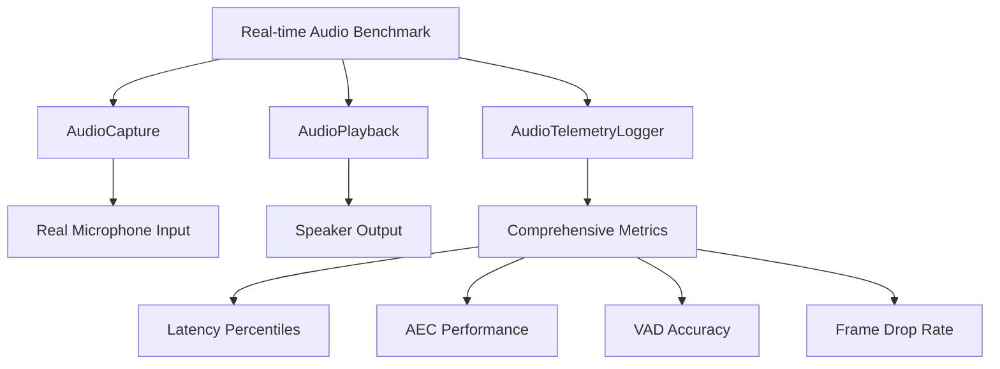

**Diagram sources**
- [live_audio_benchmark.py](file://tests/live_audio_benchmark.py#L46-L122)
- [gemini_live_interactive_benchmark.py](file://tests/gemini_live_interactive_benchmark.py#L430-L546)

**Section sources**
- [live_audio_benchmark.py](file://tests/live_audio_benchmark.py#L1-L200)
- [gemini_live_interactive_benchmark.py](file://tests/gemini_live_interactive_benchmark.py#L1-L200)

### Compression Strategies for Efficient Audio Streaming
- NeuralSummarizer compresses conversation history and working memory into compact semantic seeds for handover contexts, reducing token bloat and optimizing throughput.

**Section sources**
- [compression.py](file://core/ai/compression.py#L24-L115)

### Telemetry Collection for Audio Quality Metrics
- AudioTelemetryLogger captures per-frame metrics (latency, ERLE, convergence, VAD states, queue sizes) and aggregates session metrics with percentiles and jitter analysis.
- AudioTelemetry throttles paralinguistic feature extraction to ~15 Hz for HUD visualization.
- Real-time audio testing frameworks provide comprehensive latency measurements and performance profiling.

**Section sources**
- [telemetry.py](file://core/audio/telemetry.py#L151-L394)
- [telemetry.py](file://core/audio/telemetry.py#L21-L93)

## Dependency Analysis
Key dependencies and relationships with enhanced performance monitoring:
- GeminiLiveSession depends on audio_in_queue and audio_out_queue for I/O coordination and uses v1 API integration.
- AudioCapture depends on DynamicAEC, AdaptiveVAD, SilentAnalyzer, and SmoothMuter.
- AudioPlayback depends on audio_out_queue and resamples AI output for AEC reference.
- ThalamicGate depends on AudioState and EmotionCalibrator.
- Frontend hooks depend on AudioPlayback and AudioCapture for UI control.
- usePerformanceMonitor provides performance metrics for frontend optimization.
- Real-time testing frameworks depend on audio capture and playback components for comprehensive evaluation.

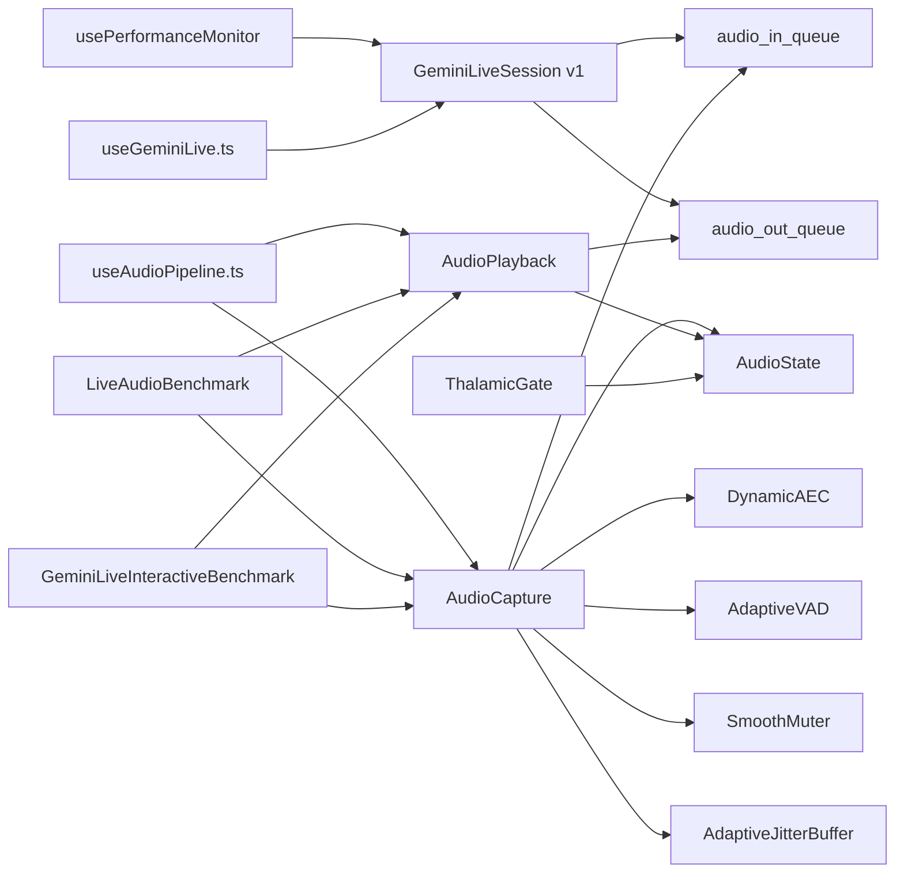

**Diagram sources**
- [session.py](file://core/ai/session.py#L54-L95)
- [capture.py](file://core/audio/capture.py#L193-L297)
- [playback.py](file://core/audio/playback.py#L27-L49)
- [thalamic.py](file://core/ai/thalamic.py#L11-L40)
- [useAudioPipeline.ts](file://apps/portal/src/hooks/useAudioPipeline.ts#L214-L247)
- [useGeminiLive.ts](file://apps/portal/src/hooks/useGeminiLive.ts#L230-L252)
- [usePerformanceMonitor.ts](file://apps/portal/src/hooks/usePerformanceMonitor.ts#L1-L163)
- [live_audio_benchmark.py](file://tests/live_audio_benchmark.py#L1-L200)
- [gemini_live_interactive_benchmark.py](file://tests/gemini_live_interactive_benchmark.py#L1-L200)

**Section sources**
- [session.py](file://core/ai/session.py#L54-L95)
- [capture.py](file://core/audio/capture.py#L193-L297)
- [playback.py](file://core/audio/playback.py#L27-L49)
- [thalamic.py](file://core/ai/thalamic.py#L11-L40)

## Performance Considerations
- Use Rust acceleration (aether-cortex) for VAD and spectral denoise when available.
- Tune AEC parameters (filter length, step size, convergence threshold) for room characteristics.
- Optimize jitter buffer target and max latency to balance smoothness and latency.
- Monitor queue drops and adjust chunk sizes or rates to prevent backpressure.
- Profile end-to-end latency using AudioTelemetryLogger and targeted benchmarks.
- **Enhanced Performance Monitoring**: Utilize usePerformanceMonitor hook for real-time frontend performance tracking and optimization.
- **Real-time Testing**: Leverage LiveAudioBenchmark and GeminiLiveInteractiveBenchmark for comprehensive audio quality assessment.

## Troubleshooting Guide
Common issues and remedies with enhanced monitoring:
- No audio input: Verify microphone permissions and device availability; check AudioDeviceNotFoundError exceptions.
- Echo or poor AEC: Adjust AEC filter length and step size; ensure stable far-end reference via jitter buffer.
- High latency: Reduce queue depths, increase chunk size, or enable Rust acceleration.
- Barge-in false positives: Increase hysteresis thresholds and refine VAD parameters.
- Output queue overflow: Monitor gemini_output_queue_drops and reduce model audio rate or increase playback speed.
- Interrupt latency: Validate flash_interrupt() path and ensure queue draining completes under 50 ms.
- **Performance Issues**: Use usePerformanceMonitor hook to identify frontend performance bottlenecks and optimize rendering.
- **Audio Quality Problems**: Utilize real-time testing frameworks to diagnose AEC convergence, VAD accuracy, and latency issues.

**Section sources**
- [capture.py](file://core/audio/capture.py#L511-L565)
- [test_interrupts.py](file://tests/benchmarks/test_interrupts.py#L40-L78)
- [session.py](file://core/ai/session.py#L426-L455)
- [usePerformanceMonitor.ts](file://apps/portal/src/hooks/usePerformanceMonitor.ts#L1-L163)
- [live_audio_benchmark.py](file://tests/live_audio_benchmark.py#L1-L200)
- [gemini_live_interactive_benchmark.py](file://tests/gemini_live_interactive_benchmark.py#L1-L200)

## Conclusion
Aether Voice OS integrates a high-performance, low-latency audio pipeline with Gemini Live using the upgraded v1 API. The enhanced system now features comprehensive performance monitoring through the usePerformanceMonitor hook, real-time audio testing capabilities with live microphone input support, and sophisticated latency measurement frameworks. The bidirectional streaming architecture, Thalamic Gate V2, and robust queue management deliver responsive, empathetic, and efficient real-time audio experiences. Telemetry, benchmarking, and performance monitoring support continuous optimization and reliability across all system components.

## Appendices

### Audio Processing Configuration Examples
- Configure AEC parameters (filter length, step size, convergence threshold) via AudioConfig and update at runtime.
- Set chunk size and sample rate aligned with Gemini's expectations.
- Enable/disable affective dialog and proactive audio based on AIConfig flags.
- **API Version Configuration**: Set api_version to "v1" for backend integration and maintain compatibility with frontend v1alpha WebSocket paths.

**Section sources**
- [capture.py](file://core/audio/capture.py#L273-L296)
- [session.py](file://core/ai/session.py#L96-L154)
- [config.py](file://core/infra/config.py#L61)

### Frontend Audio Pipeline Controls
- Use useAudioPipeline.ts to stop playback and clear active sources for immediate barge-in.
- Use useGeminiLive.ts to monitor session readiness and model turns.
- **Performance Monitoring**: Integrate usePerformanceMonitor hook for real-time frontend performance tracking and optimization.

**Section sources**
- [useAudioPipeline.ts](file://apps/portal/src/hooks/useAudioPipeline.ts#L214-L247)
- [useGeminiLive.ts](file://apps/portal/src/hooks/useGeminiLive.ts#L230-L252)
- [usePerformanceMonitor.ts](file://apps/portal/src/hooks/usePerformanceMonitor.ts#L1-L163)

### Web Worker PCM Processing
- pcm-processor.js demonstrates ring-buffered PCM accumulation, RMS computation, and zero-copy transfer to main thread.

**Section sources**
- [pcm-processor.js](file://apps/portal/public/pcm-processor.js#L31-L81)

### Enhanced Real-time Audio Testing and Benchmarks
- **LiveAudioBenchmark**: Comprehensive real-time audio pipeline testing with microphone input and detailed performance metrics.
- **GeminiLiveInteractiveBenchmark**: Interactive dashboard with real-time metrics, multiple scenarios, and dynamic parameter adjustment.
- **Real Microphone Support**: Both frameworks utilize actual microphone input for realistic testing conditions.
- **Comprehensive Metrics**: Latency percentiles, AEC performance, VAD accuracy, and frame drop analysis.

**Section sources**
- [live_audio_benchmark.py](file://tests/live_audio_benchmark.py#L1-L200)
- [gemini_live_interactive_benchmark.py](file://tests/gemini_live_interactive_benchmark.py#L1-L200)