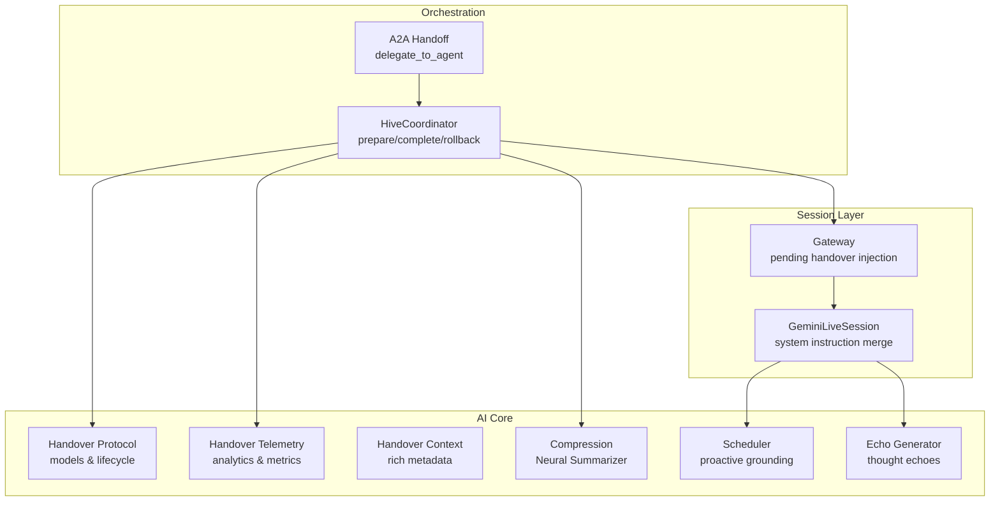
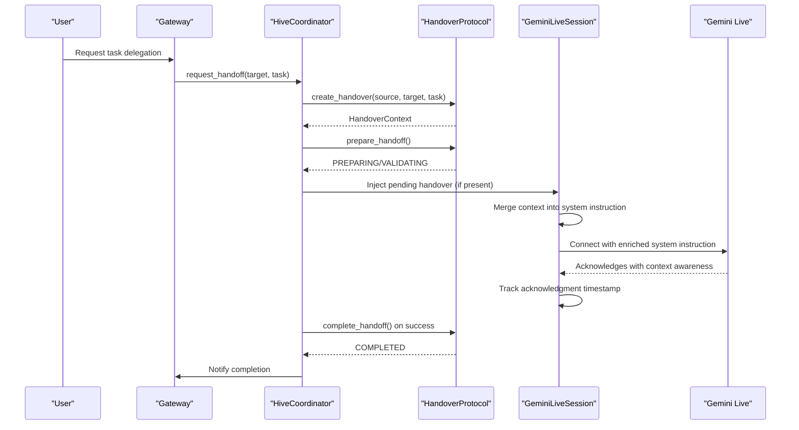
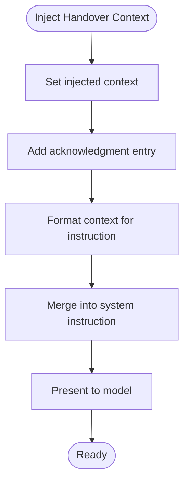
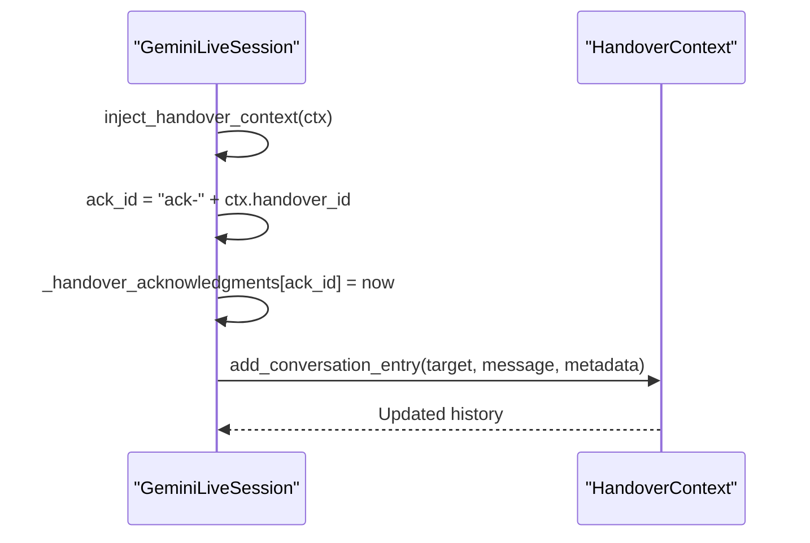
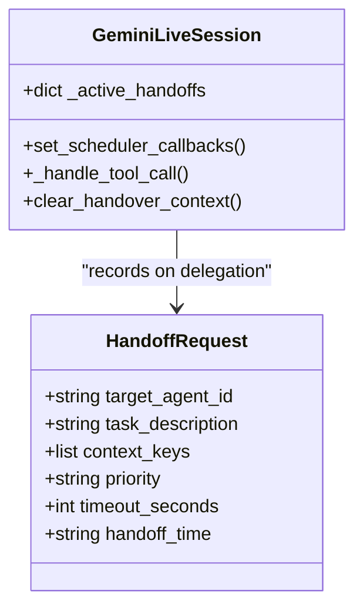
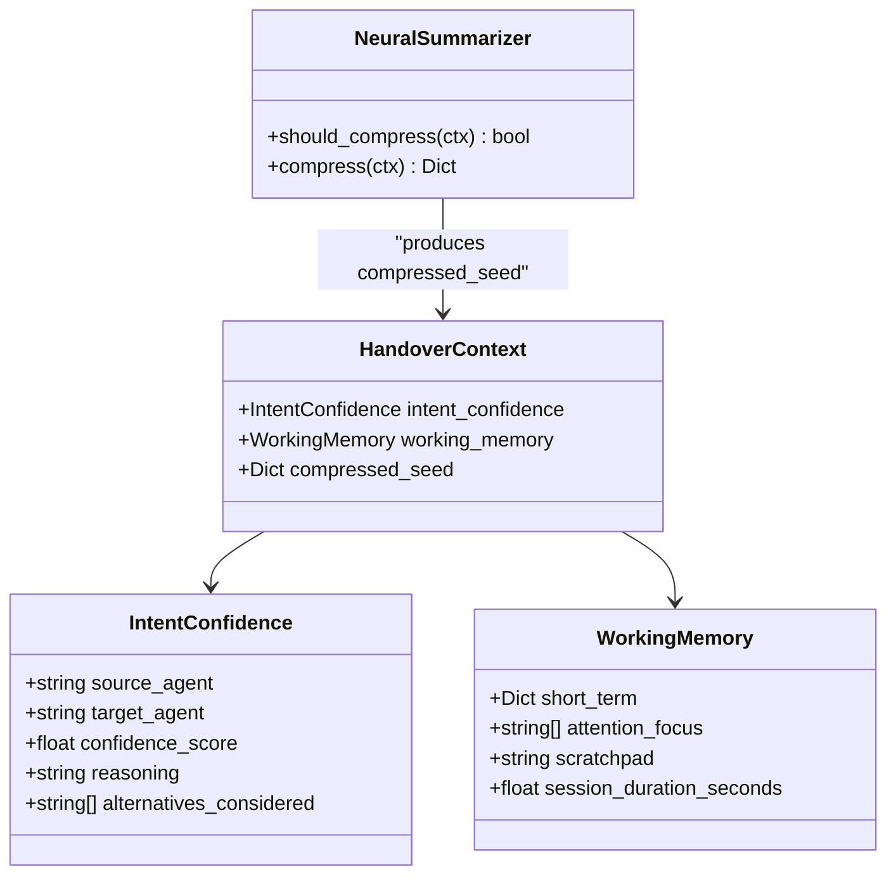
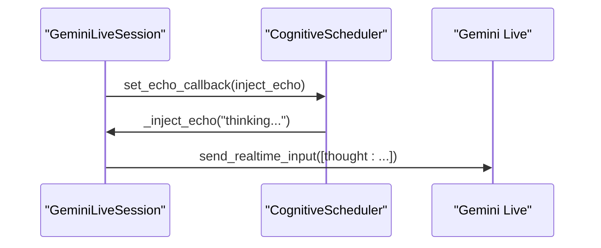
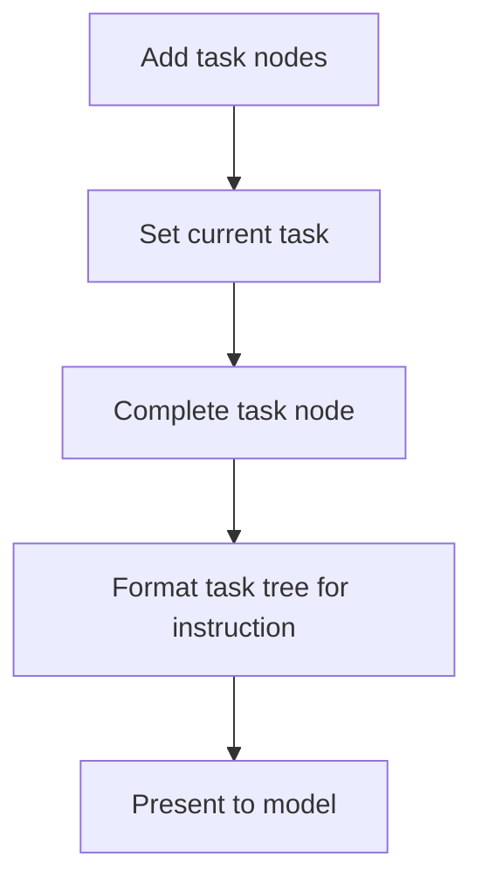
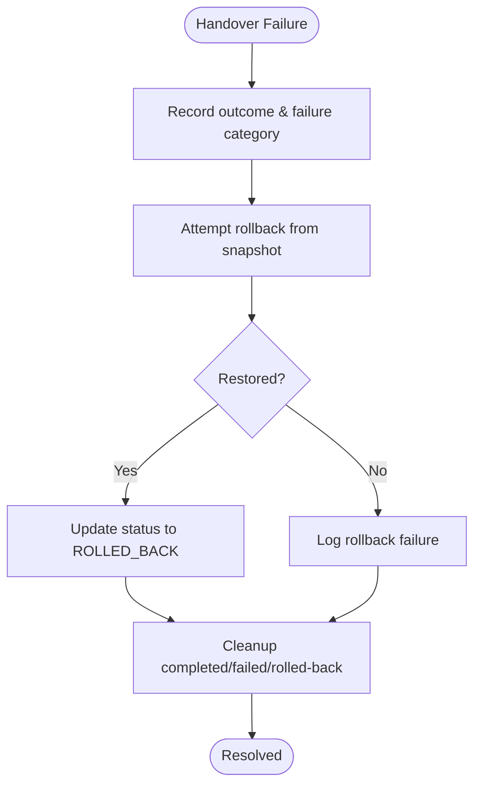
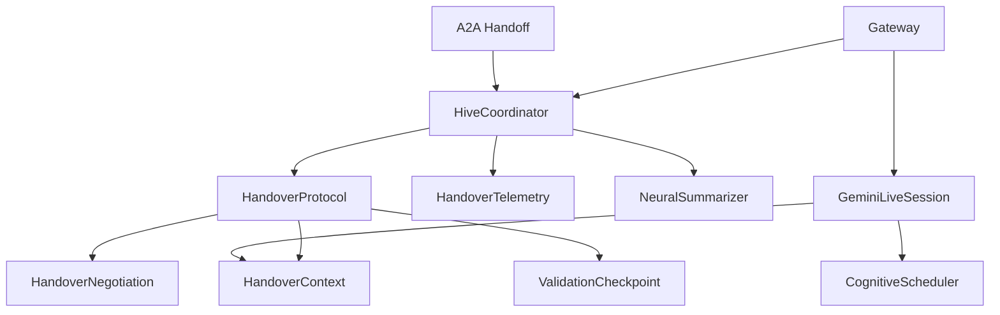

# Deep Handover Protocol Integration

<cite>
**Referenced Files in This Document**
- [handover_protocol.py](file://core/ai/handover_protocol.py)
- [session.py](file://core/ai/session.py)
- [hive.py](file://core/ai/hive.py)
- [handoff.py](file://core/ai/handoff.py)
- [scheduler.py](file://core/ai/scheduler.py)
- [handover_telemetry.py](file://core/ai/handover_telemetry.py)
- [compression.py](file://core/ai/compression.py)
- [echo.py](file://core/ai/echo.py)
- [errors.py](file://core/utils/errors.py)
- [gateway.py](file://core/infra/transport/gateway.py)
</cite>

## Table of Contents
1. [Introduction](#introduction)
2. [Project Structure](#project-structure)
3. [Core Components](#core-components)
4. [Architecture Overview](#architecture-overview)
5. [Detailed Component Analysis](#detailed-component-analysis)
6. [Dependency Analysis](#dependency-analysis)
7. [Performance Considerations](#performance-considerations)
8. [Troubleshooting Guide](#troubleshooting-guide)
9. [Conclusion](#conclusion)

## Introduction
This document explains the Deep Handover Protocol integration for Gemini Live sessions. It covers how handover context is created, merged into system instructions, presented to the model, tracked for acknowledgments, and managed through completion and rollback. It also documents intent confidence integration, working memory preservation, scheduler-driven proactive grounding, task tree visualization, error handling, cleanup procedures, analytics collection, and performance impact of context injection.

## Project Structure
The integration spans several modules:
- Handover protocol and context models
- Session-level injection and system instruction merging
- Hive orchestration and telemetry
- Scheduler-driven proactive grounding
- Context compression and echo generation
- Error handling and cleanup

**Diagram sources**
- [handover_protocol.py](file://core/ai/handover_protocol.py#L107-L156)
- [session.py](file://core/ai/session.py#L623-L736)
- [hive.py](file://core/ai/hive.py#L47-L110)
- [handoff.py](file://core/ai/handoff.py#L45-L91)
- [scheduler.py](file://core/ai/scheduler.py#L10-L32)
- [compression.py](file://core/ai/compression.py#L24-L40)
- [echo.py](file://core/ai/echo.py#L4-L10)
- [gateway.py](file://core/infra/transport/gateway.py#L398-L419)

**Section sources**
- [handover_protocol.py](file://core/ai/handover_protocol.py#L107-L156)
- [session.py](file://core/ai/session.py#L623-L736)
- [hive.py](file://core/ai/hive.py#L47-L110)
- [handoff.py](file://core/ai/handoff.py#L45-L91)
- [scheduler.py](file://core/ai/scheduler.py#L10-L32)
- [compression.py](file://core/ai/compression.py#L24-L40)
- [echo.py](file://core/ai/echo.py#L4-L10)
- [gateway.py](file://core/infra/transport/gateway.py#L398-L419)

## Core Components
- HandoverContext: Rich context model with task tree, working memory, intent confidence, code context, conversation history, validation checkpoints, and negotiation metadata.
- HandoverProtocol: Lifecycle manager for preparing, pre-warming, validating, transferring, completing, and rolling back handovers.
- GeminiLiveSession: Integrates handover context into system instructions, tracks acknowledgments, and supports proactive grounding via scheduler.
- HiveCoordinator: Orchestrates handoff requests, prepares/commits rollbacks, maintains telemetry, and coordinates pre-warming.
- HandoverTelemetry: Records outcomes, performance, and analytics for success rate computation and failure categorization.
- NeuralSummarizer: Compresses large contexts into semantic seeds to reduce token overhead.
- Scheduler: Provides proactive grounding context and thought echoes to keep the user engaged during long operations.
- A2A Handoff: Delegation mechanism for agent-to-agent transfers with handoff_id tracking.

**Section sources**
- [handover_protocol.py](file://core/ai/handover_protocol.py#L107-L156)
- [handover_protocol.py](file://core/ai/handover_protocol.py#L825-L1014)
- [session.py](file://core/ai/session.py#L623-L736)
- [hive.py](file://core/ai/hive.py#L181-L291)
- [handover_telemetry.py](file://core/ai/handover_telemetry.py#L295-L426)
- [compression.py](file://core/ai/compression.py#L41-L106)
- [scheduler.py](file://core/ai/scheduler.py#L10-L32)
- [handoff.py](file://core/ai/handoff.py#L45-L91)

## Architecture Overview
The Deep Handover Protocol integrates across three layers:
- Protocol and Context: Defines HandoverContext and lifecycle transitions.
- Session Integration: Merges context into system instructions and tracks acknowledgments.
- Orchestration and Analytics: Prepares handovers, coordinates pre-warming, completes/rolls back, and records telemetry.

**Diagram sources**
- [hive.py](file://core/ai/hive.py#L143-L176)
- [handover_protocol.py](file://core/ai/handover_protocol.py#L837-L889)
- [session.py](file://core/ai/session.py#L738-L782)
- [session.py](file://core/ai/session.py#L623-L736)
- [gateway.py](file://core/infra/transport/gateway.py#L398-L419)

## Detailed Component Analysis

### Handover Context and System Instruction Injection
- Creation and enrichment: HandoverContext captures task, working memory, intent confidence, code context, conversation history, and validation checkpoints.
- Injection into system instruction: GeminiLiveSession merges injected context into the system instruction alongside soul persona and scheduler grounding.
- Formatted presentation: The session formats the context into a readable section with task tree, working memory, confidence, code context, recent conversation, and history.

**Diagram sources**
- [session.py](file://core/ai/session.py#L738-L782)
- [session.py](file://core/ai/session.py#L675-L736)

**Section sources**
- [handover_protocol.py](file://core/ai/handover_protocol.py#L107-L156)
- [session.py](file://core/ai/session.py#L623-L736)
- [session.py](file://core/ai/session.py#L738-L782)

### Handover Acknowledgment Tracking and Conversation Entry Addition
- Acknowledgment tracking: The session maintains a map of acknowledgment timestamps keyed by a generated acknowledgment ID derived from the handover ID.
- Conversation entry addition: On acknowledgment, a structured entry is appended to the context’s conversation history with metadata for traceability.
- Verification: Helper methods allow retrieving and checking acknowledgment status.

**Diagram sources**
- [session.py](file://core/ai/session.py#L738-L782)

**Section sources**
- [session.py](file://core/ai/session.py#L738-L782)
- [session.py](file://core/ai/session.py#L809-L832)

### Active Handoff State Management and Handoff ID Tracking
- A2A V3 tracking: The session maintains an active handoffs map keyed by handoff_id, capturing target agent, task, and timestamp.
- Tool call handling: When a delegation tool is invoked, the session records the handoff_id and marks the handoff as initiated.
- Scheduler integration: The scheduler is wired to echo callbacks, enabling proactive grounding during long-running tool executions.

**Diagram sources**
- [session.py](file://core/ai/session.py#L88-L94)
- [session.py](file://core/ai/session.py#L578-L593)
- [handoff.py](file://core/ai/handoff.py#L33-L43)

**Section sources**
- [session.py](file://core/ai/session.py#L88-L94)
- [session.py](file://core/ai/session.py#L578-L593)
- [handoff.py](file://core/ai/handoff.py#L45-L91)

### Intent Confidence Integration and Working Memory Preservation
- Intent confidence: HandoverContext includes an IntentConfidence field capturing confidence score, reasoning, and alternatives considered.
- Working memory: HandoverContext preserves ephemeral working memory (short-term, attention focus, scratchpad, session duration) to maintain continuity across handovers.
- Neural summarization: Large contexts are compressed into semantic seeds to reduce token overhead while preserving key entities, intents, and critical knowledge.

**Diagram sources**
- [handover_protocol.py](file://core/ai/handover_protocol.py#L46-L58)
- [handover_protocol.py](file://core/ai/handover_protocol.py#L94-L105)
- [compression.py](file://core/ai/compression.py#L41-L106)

**Section sources**
- [handover_protocol.py](file://core/ai/handover_protocol.py#L46-L58)
- [handover_protocol.py](file://core/ai/handover_protocol.py#L94-L105)
- [compression.py](file://core/ai/compression.py#L41-L106)

### Scheduler Integration for Neural Proactive Grounding
- Proactive grounding: The scheduler contributes a grounding context to the system instruction, ensuring the model remains anchored to temporal and sensory cues.
- Thought echoes: When tools run long, the scheduler triggers echo injections to keep the user engaged and signal ongoing processing.

**Diagram sources**
- [session.py](file://core/ai/session.py#L75-L76)
- [session.py](file://core/ai/session.py#L793-L808)
- [scheduler.py](file://core/ai/scheduler.py#L106-L114)

**Section sources**
- [session.py](file://core/ai/session.py#L75-L76)
- [session.py](file://core/ai/session.py#L793-L808)
- [scheduler.py](file://core/ai/scheduler.py#L106-L114)

### Task Tree Visualization in Handover Contexts
- Task decomposition: HandoverContext stores a task tree with nodes containing id, description, status, parent/children links, assignment, and completion metadata.
- Visualization: The session formats the task tree into a readable list for system instructions, showing completion status and recent activity.

**Diagram sources**
- [handover_protocol.py](file://core/ai/handover_protocol.py#L206-L245)
- [session.py](file://core/ai/session.py#L694-L699)

**Section sources**
- [handover_protocol.py](file://core/ai/handover_protocol.py#L206-L245)
- [session.py](file://core/ai/session.py#L694-L699)

### Error Handling for Handover Failures and Cleanup Procedures
- Failure modes: HandoverTelemetry categorizes failures (validation, negotiation, context loss, agent unavailability, timeout, system error, rollback triggered).
- Rollback capability: HandoverContext snapshots enable restoration to pre-transfer state; HiveCoordinator coordinates rollback and telemetry recording.
- Cleanup: Completed, failed, or rolled-back handovers are cleaned up from active tracking and protocol storage.

**Diagram sources**
- [handover_telemetry.py](file://core/ai/handover_telemetry.py#L365-L426)
- [handover_protocol.py](file://core/ai/handover_protocol.py#L926-L947)
- [hive.py](file://core/ai/hive.py#L421-L472)
- [handover_protocol.py](file://core/ai/handover_protocol.py#L996-L1014)

**Section sources**
- [handover_telemetry.py](file://core/ai/handover_telemetry.py#L27-L50)
- [handover_telemetry.py](file://core/ai/handover_telemetry.py#L365-L426)
- [handover_protocol.py](file://core/ai/handover_protocol.py#L926-L947)
- [hive.py](file://core/ai/hive.py#L421-L472)
- [handover_protocol.py](file://core/ai/handover_protocol.py#L996-L1014)

### Examples and Verification Patterns
- Creating and injecting handover context:
  - Create HandoverContext via HandoverProtocol.
  - Inject into session; acknowledgment timestamp is recorded and conversation entry is added.
- Acknowledgment verification:
  - Use helpers to retrieve acknowledgment timestamp and check acknowledgment status.
- A2A handoff initiation:
  - Invoke delegation tool; session records handoff_id and marks handoff initiated.

**Section sources**
- [handover_protocol.py](file://core/ai/handover_protocol.py#L837-L889)
- [session.py](file://core/ai/session.py#L738-L782)
- [session.py](file://core/ai/session.py#L809-L832)
- [session.py](file://core/ai/session.py#L578-L593)
- [handoff.py](file://core/ai/handoff.py#L45-L91)

## Dependency Analysis
The following diagram shows key dependencies among components:

**Diagram sources**
- [handover_protocol.py](file://core/ai/handover_protocol.py#L825-L1014)
- [hive.py](file://core/ai/hive.py#L47-L110)
- [session.py](file://core/ai/session.py#L623-L736)
- [gateway.py](file://core/infra/transport/gateway.py#L398-L419)
- [handoff.py](file://core/ai/handoff.py#L45-L91)

**Section sources**
- [handover_protocol.py](file://core/ai/handover_protocol.py#L825-L1014)
- [hive.py](file://core/ai/hive.py#L47-L110)
- [session.py](file://core/ai/session.py#L623-L736)
- [gateway.py](file://core/infra/transport/gateway.py#L398-L419)
- [handoff.py](file://core/ai/handoff.py#L45-L91)

## Performance Considerations
- Context size and token overhead: Large conversation histories and working memory increase token usage. NeuralSummarizer compresses contexts into semantic seeds to reduce overhead while preserving key information.
- Proactive grounding: Scheduler adds grounding context to system instructions; ensure grounding content is concise to avoid excessive token consumption.
- Acknowledgment tracking: Minimal in-memory footprint; acknowledgment timestamps are lightweight.
- Cleanup: Regular cleanup of completed/failed/rolled-back handovers reduces memory retention and improves performance.

[No sources needed since this section provides general guidance]

## Troubleshooting Guide
- Injection failures: If context injection fails, the session logs an error and returns False. Verify that the context is valid and the session is running.
- Acknowledgment mismatches: If acknowledgment completion fails due to context mismatch, verify the handover_id matches the active context.
- Handover preparation/validation failures: Check telemetry for failure categories and adjust negotiation or validation checkpoints accordingly.
- Rollback issues: Confirm snapshot availability and review rollback logs; ensure the previous soul can be restored.
- A2A handoff not initiated: Verify tool invocation and that the HiveCoordinator is configured; confirm the restart event is set when applicable.

**Section sources**
- [session.py](file://core/ai/session.py#L780-L782)
- [session.py](file://core/ai/session.py#L852-L857)
- [handover_telemetry.py](file://core/ai/handover_telemetry.py#L365-L426)
- [handover_protocol.py](file://core/ai/handover_protocol.py#L926-L947)
- [hive.py](file://core/ai/hive.py#L421-L472)
- [handoff.py](file://core/ai/handoff.py#L57-L90)

## Conclusion
The Deep Handover Protocol integrates robust context preservation, bidirectional negotiation, validation checkpoints, and rollback capabilities into Gemini Live sessions. Through system instruction merging, acknowledgment tracking, scheduler-driven grounding, and comprehensive telemetry, the system ensures reliable agent handoffs with strong observability and performance controls. Neural summarization and proactive grounding further optimize context delivery and user experience.