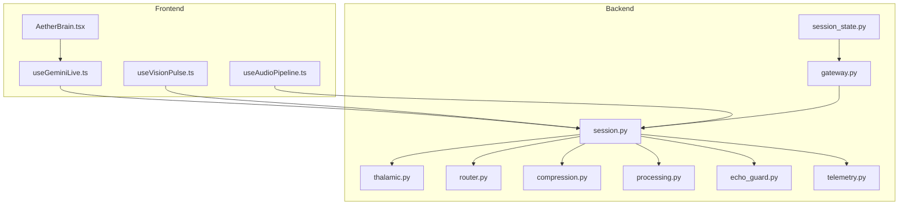
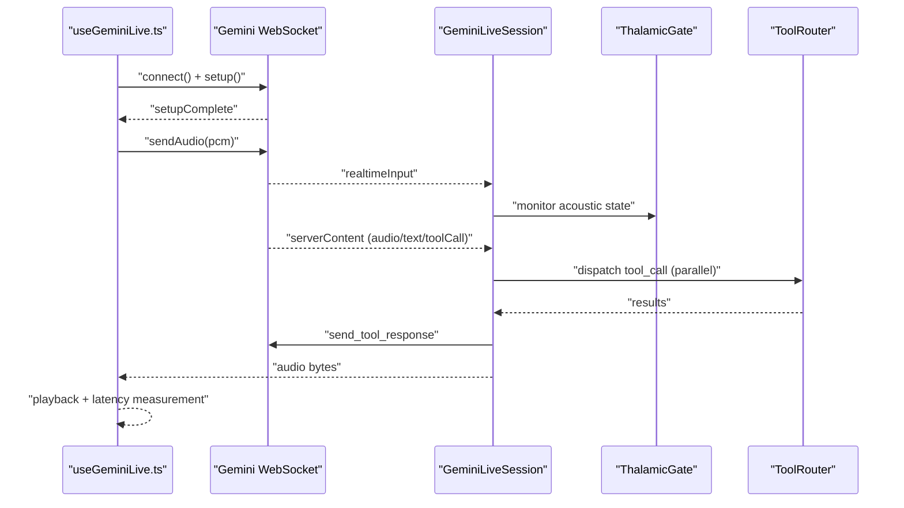
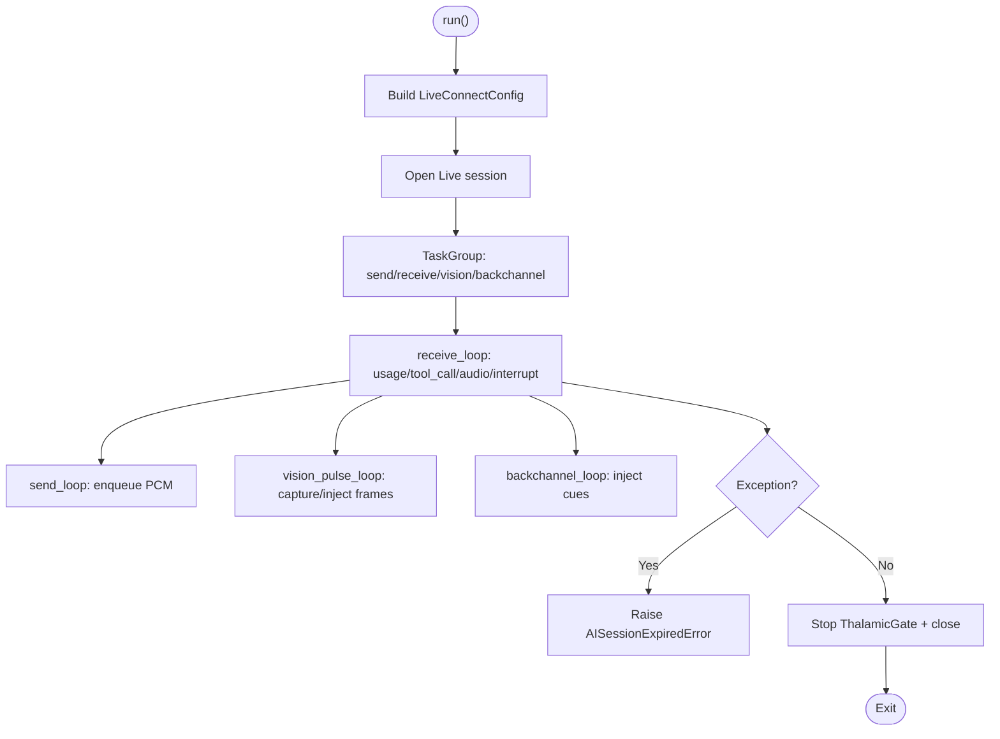
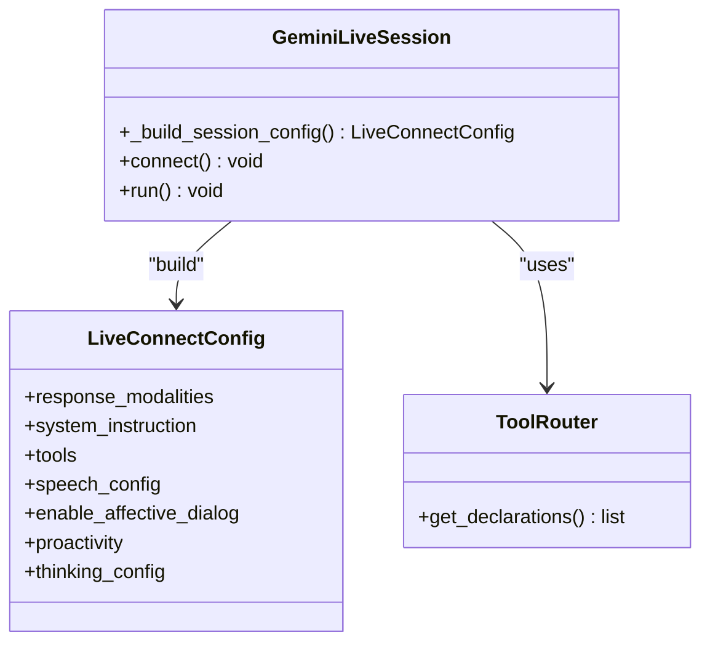
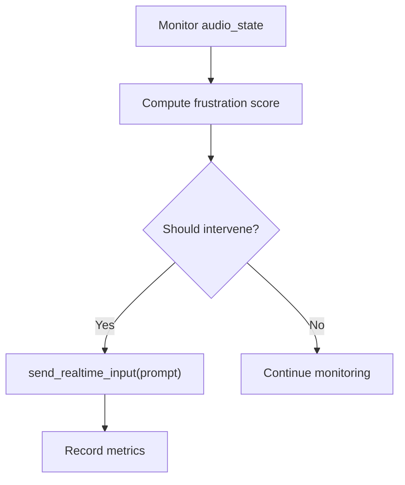
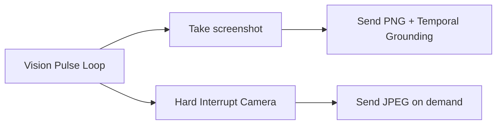
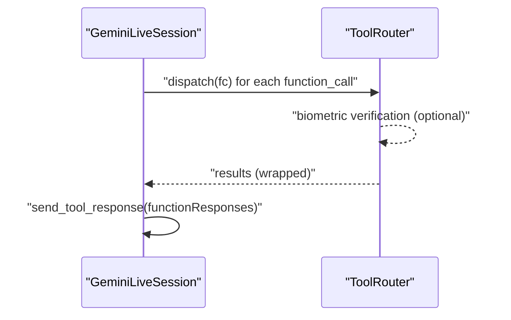
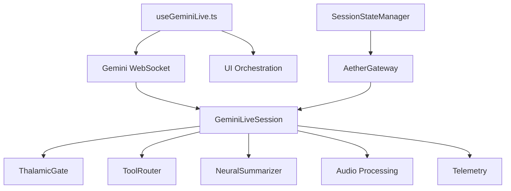

# Gemini Live API Integration

<cite>
**Referenced Files in This Document**
- [session.py](file://core/ai/session.py)
- [useGeminiLive.ts](file://apps/portal/src/hooks/useGeminiLive.ts)
- [AetherBrain.tsx](file://apps/portal/src/components/AetherBrain.tsx)
- [useVisionPulse.ts](file://apps/portal/src/hooks/useVisionPulse.ts)
- [useAudioPipeline.ts](file://apps/portal/src/hooks/useAudioPipeline.ts)
- [thalamic.py](file://core/ai/thalamic.py)
- [router.py](file://core/tools/router.py)
- [compression.py](file://core/ai/compression.py)
- [processing.py](file://core/audio/processing.py)
- [echo_guard.py](file://core/audio/echo_guard.py)
- [telemetry.py](file://core/infra/telemetry.py)
- [GEMINI.md](file://docs/GEMINI.md)
- [test_gemini_live_session.py](file://tests/unit/test_gemini_live_session.py)
- [geminiLive.integration.test.ts](file://apps/portal/src/__tests__/geminiLive.integration.test.ts)
- [test_interrupts.py](file://tests/benchmarks/test_interrupts.py)
- [voice_quality_benchmark.py](file://tests/benchmarks/voice_quality_benchmark.py)
- [session_state.py](file://core/infra/transport/session_state.py)
- [gateway.py](file://core/infra/transport/gateway.py)
</cite>

## Update Summary
**Changes Made**
- Enhanced documentation for GeminiLiveSession class and centralized AudioManager architecture
- Added comprehensive coverage of parallel tool execution capabilities
- Expanded proactive vision integration documentation
- Updated intelligent backchanneling system details
- Added centralized session state management documentation
- Enhanced audio processing pipeline integration with Thalamic Gate V2
- Updated front-end audio pipeline and gapless playback capabilities

## Table of Contents
1. [Introduction](#introduction)
2. [Project Structure](#project-structure)
3. [Core Components](#core-components)
4. [Architecture Overview](#architecture-overview)
5. [Detailed Component Analysis](#detailed-component-analysis)
6. [Dependency Analysis](#dependency-analysis)
7. [Performance Considerations](#performance-considerations)
8. [Troubleshooting Guide](#troubleshooting-guide)
9. [Conclusion](#conclusion)
10. [Appendices](#appendices)

## Introduction
This document explains the Gemini Live API integration in Aether Voice OS, focusing on bidirectional audio sessions, session configuration, real-time streaming, structured concurrency, multimodal processing, tool call handling, proactive vision pulses, backchannel loops, interrupt handling, output queue management, compression strategies, and telemetry. The integration now features a centralized GeminiLiveSession class with enhanced audio processing capabilities, parallel tool execution, proactive vision integration, and intelligent backchanneling systems.

## Project Structure
The integration spans:
- Backend AI session and audio processing (core/ai/*, core/audio/*, core/tools/*, core/infra/*)
- Frontend React hooks and UI orchestration (apps/portal/src/hooks/*, apps/portal/src/components/*)
- Documentation and tests (docs/*, tests/*)



**Diagram sources**
- [session.py](file://core/ai/session.py#L1-L922)
- [useGeminiLive.ts](file://apps/portal/src/hooks/useGeminiLive.ts#L1-L485)
- [AetherBrain.tsx](file://apps/portal/src/components/AetherBrain.tsx#L1-L132)
- [useVisionPulse.ts](file://apps/portal/src/hooks/useVisionPulse.ts#L1-L226)
- [useAudioPipeline.ts](file://apps/portal/src/hooks/useAudioPipeline.ts#L1-L247)
- [thalamic.py](file://core/ai/thalamic.py#L1-L122)
- [router.py](file://core/tools/router.py#L1-L360)
- [compression.py](file://core/ai/compression.py#L1-L115)
- [processing.py](file://core/audio/processing.py#L1-L508)
- [echo_guard.py](file://core/audio/echo_guard.py#L1-L67)
- [telemetry.py](file://core/infra/telemetry.py#L1-L130)
- [session_state.py](file://core/infra/transport/session_state.py#L44-L77)
- [gateway.py](file://core/infra/transport/gateway.py#L140-L183)

**Section sources**
- [session.py](file://core/ai/session.py#L1-L922)
- [useGeminiLive.ts](file://apps/portal/src/hooks/useGeminiLive.ts#L1-L485)
- [AetherBrain.tsx](file://apps/portal/src/components/AetherBrain.tsx#L1-L132)
- [useVisionPulse.ts](file://apps/portal/src/hooks/useVisionPulse.ts#L1-L226)
- [useAudioPipeline.ts](file://apps/portal/src/hooks/useAudioPipeline.ts#L1-L247)
- [GEMINI.md](file://docs/GEMINI.md#L1-L75)

## Core Components
- **GeminiLiveSession**: Centralized session manager with bidirectional Live session, structured concurrency, send/receive loops, tool calls, interrupts, proactive vision pulses, and backchannel loop.
- **ThalamicGate**: Proactive intervention engine that monitors acoustic states and triggers interventions with intelligent backchanneling.
- **ToolRouter**: Registers tools, validates biometrics, dispatches function calls in parallel, and returns standardized results.
- **NeuralSummarizer**: Compresses long-handover contexts into compact "Semantic Seeds."
- **Audio Processing Utilities**: RingBuffer, VAD engines, and zero-crossing detection for barge-in with gapless playback.
- **Telemetry**: Usage tracking and OTLP export for cost and performance.
- **Frontend Hooks**: WebSocket management, audio streaming, vision pulses, tool response, latency measurement, and gapless audio playback.
- **Centralized Session State**: Atomic state transitions with validation and broadcast to connected clients.
- **AetherGateway**: Controlled access point for session management and text/audio input sending.

**Section sources**
- [session.py](file://core/ai/session.py#L43-L235)
- [thalamic.py](file://core/ai/thalamic.py#L11-L122)
- [router.py](file://core/tools/router.py#L120-L360)
- [compression.py](file://core/ai/compression.py#L24-L115)
- [processing.py](file://core/audio/processing.py#L107-L508)
- [telemetry.py](file://core/infra/telemetry.py#L14-L130)
- [useGeminiLive.ts](file://apps/portal/src/hooks/useGeminiLive.ts#L65-L485)
- [session_state.py](file://core/infra/transport/session_state.py#L71-L77)
- [gateway.py](file://core/infra/transport/gateway.py#L140-L183)

## Architecture Overview
The system uses structured concurrency to run send/receive loops, vision pulses, and backchannel loops concurrently. The backend wires a Thalamic Gate for AEC-like echo gating and proactive interventions. The frontend streams PCM audio and vision frames, handles tool calls, manages gapless playback, and measures latency.



**Diagram sources**
- [useGeminiLive.ts](file://apps/portal/src/hooks/useGeminiLive.ts#L90-L361)
- [session.py](file://core/ai/session.py#L174-L235)
- [thalamic.py](file://core/ai/thalamic.py#L25-L122)
- [router.py](file://core/tools/router.py#L234-L355)

## Detailed Component Analysis

### Session Lifecycle and Structured Concurrency
- Establishes the Live session with a LiveConnectConfig built from tools, system instructions, and voice preferences.
- Runs send_loop, receive_loop, vision_pulse_loop, and backchannel_loop concurrently using TaskGroup.
- Handles exceptions via structured concurrency and cleans up ThalamicGate on exit.
- **Updated** Enhanced with centralized session state management and AetherGateway control.



**Diagram sources**
- [session.py](file://core/ai/session.py#L174-L235)
- [session.py](file://core/ai/session.py#L237-L265)
- [session.py](file://core/ai/session.py#L383-L477)
- [session.py](file://core/ai/session.py#L266-L341)
- [session.py](file://core/ai/session.py#L343-L382)

**Section sources**
- [session.py](file://core/ai/session.py#L96-L154)
- [session.py](file://core/ai/session.py#L174-L235)
- [session.py](file://core/ai/session.py#L237-L265)
- [session.py](file://core/ai/session.py#L383-L477)
- [session.py](file://core/ai/session.py#L266-L341)
- [session.py](file://core/ai/session.py#L343-L382)

### Session Configuration with LiveConnectConfig
- Tools: Declared via ToolRouter.get_declarations() and optionally Google Search grounding.
- SpeechConfig: Maps a voice_id from the soul manifest to a prebuilt voice.
- Advanced features: affective dialog, proactive audio, thinking budget.
- **Updated** Enhanced with centralized session state management and A2A handoff tracking.



**Diagram sources**
- [session.py](file://core/ai/session.py#L96-L154)
- [router.py](file://core/tools/router.py#L211-L232)

**Section sources**
- [session.py](file://core/ai/session.py#L96-L154)
- [router.py](file://core/tools/router.py#L211-L232)

### Real-Time Audio Streaming (Frontend and Backend)
- Frontend: Encodes PCM chunks to base64 and sends realtimeInput; decodes audio responses; measures RTT; manages gapless playback.
- Backend: Reads from audio_in_queue and sends via session.send_realtime_input; writes audio responses to audio_out_queue.
- **Updated** Enhanced with gapless PCM playback and instant barge-in capability.

```mermaid
sequenceDiagram
participant FE as "useGeminiLive.ts"
participant WS as "WebSocket"
participant BE as "GeminiLiveSession"
FE->>FE : "encode PCM to base64"
FE->>WS : "realtimeInput {mimeType : 'audio/pcm;rate=16000', data : base64}"
WS-->>BE : "receive() stream"
BE-->>BE : "enqueue audio to out_queue"
BE-->>WS : "send_realtime_input(audio)"
WS-->>FE : "binary audio bytes"
FE-->>FE : "decode + play + measure latency"
```

**Diagram sources**
- [useGeminiLive.ts](file://apps/portal/src/hooks/useGeminiLive.ts#L327-L361)
- [useGeminiLive.ts](file://apps/portal/src/hooks/useGeminiLive.ts#L193-L204)
- [session.py](file://core/ai/session.py#L237-L265)
- [session.py](file://core/ai/session.py#L422-L461)

**Section sources**
- [useGeminiLive.ts](file://apps/portal/src/hooks/useGeminiLive.ts#L327-L361)
- [session.py](file://core/ai/session.py#L237-L265)
- [session.py](file://core/ai/session.py#L422-L461)

### Audio Processing Pipeline Integration (Thalamic Gate V2)
- ThalamicGate monitors audio_state, computes frustration, and proactively injects prompts to Gemini when needed.
- EchoGuard implements acoustic identity gating (MFCC-like fingerprint cache) to distinguish self vs user audio.
- **Updated** Enhanced with intelligent backchanneling system and adaptive VAD for barge-in detection.



**Diagram sources**
- [thalamic.py](file://core/ai/thalamic.py#L41-L122)
- [echo_guard.py](file://core/audio/echo_guard.py#L14-L67)

**Section sources**
- [thalamic.py](file://core/ai/thalamic.py#L11-L122)
- [echo_guard.py](file://core/audio/echo_guard.py#L14-L67)

### Multimodal Capabilities (Audio, Text, Visual)
- Audio: PCM streaming, VAD, barge-in handling, backchannel cues, gapless playback.
- Text: Transcript extraction from model text parts; UI broadcast.
- Visual: Proactive vision pulses every 10s with temporal grounding; hard-interrupt camera capture; optional tool-triggered screenshots injected into the next turn.
- **Updated** Enhanced with centralized vision pulse management and change-detection filtering.



**Diagram sources**
- [session.py](file://core/ai/session.py#L266-L341)

**Section sources**
- [session.py](file://core/ai/session.py#L266-L341)
- [useVisionPulse.ts](file://apps/portal/src/hooks/useVisionPulse.ts#L45-L226)

### Tool Call Handling System (Parallel Execution)
- Gemini emits functionCalls; session dispatches via ToolRouter.
- Parallel execution with asyncio.gather; biometric middleware for sensitive tools; standardized result wrapping; optional vision injection from tool results.
- **Updated** Enhanced with A2A handoff state tracking and parallel execution with comprehensive error handling.



**Diagram sources**
- [session.py](file://core/ai/session.py#L493-L602)
- [router.py](file://core/tools/router.py#L234-L355)

**Section sources**
- [session.py](file://core/ai/session.py#L493-L602)
- [router.py](file://core/tools/router.py#L120-L360)

### Proactive Vision Pulse and Temporal Grounding
- Maintains a rolling buffer of frames; pulses every 10s with a text grounding marker; broadcasts UI events; captures camera on hard interrupts.
- **Updated** Enhanced with centralized session state management and A2A handoff integration.

**Section sources**
- [session.py](file://core/ai/session.py#L266-L341)
- [useVisionPulse.ts](file://apps/portal/src/hooks/useVisionPulse.ts#L45-L226)

### Backchannel Loop (Empathetic Responses)
- Monitors silence types; when user is "thinking" or "breathing," injects a soft text cue to trigger a subtle vocal backchannel without full takeover.
- **Updated** Enhanced with adaptive VAD thresholds and intelligent intervention timing.

**Section sources**
- [session.py](file://core/ai/session.py#L343-L382)

### Interrupt Handling and Output Queue Management
- On interrupted flag, drains audio output queue instantly; measures drain latency; maintains telemetry counters for queue drops.
- **Updated** Enhanced with gapless playback and instant barge-in capability.

**Section sources**
- [session.py](file://core/ai/session.py#L463-L477)
- [session.py](file://core/ai/session.py#L604-L614)
- [test_interrupts.py](file://tests/benchmarks/test_interrupts.py#L40-L78)

### Compression Strategies
- NeuralSummarizer compresses long conversations into compact "Semantic Seeds" using a lightweight model to reduce token usage during handovers.

**Section sources**
- [compression.py](file://core/ai/compression.py#L24-L115)

### Telemetry Collection
- Usage metadata recorded per response; cost estimation; OTLP export via TelemetryManager; spans enriched with usage attributes.

**Section sources**
- [session.py](file://core/ai/session.py#L479-L492)
- [telemetry.py](file://core/infra/telemetry.py#L77-L130)

### Centralized Session State Management
- SessionStateManager provides atomic state transitions with validation and broadcasts state changes to all connected clients.
- **New** Centralized session state management for improved reliability and consistency.

**Section sources**
- [session_state.py](file://core/infra/transport/session_state.py#L44-L77)

### AetherGateway Control Interface
- Controlled access point for session management with text and audio input sending capabilities.
- **New** Centralized gateway interface for session control and input management.

**Section sources**
- [gateway.py](file://core/infra/transport/gateway.py#L140-L183)

## Dependency Analysis
- Frontend depends on Gemini WebSocket protocol and React hooks for streaming and UI orchestration.
- Backend depends on google-genai aio SDK, asyncio queues, and internal tooling.
- ThalamicGate integrates with audio_state and emotion calibration; EchoGuard provides acoustic identity cache.
- **Updated** Enhanced with centralized session state management and gateway control.



**Diagram sources**
- [useGeminiLive.ts](file://apps/portal/src/hooks/useGeminiLive.ts#L65-L485)
- [session.py](file://core/ai/session.py#L1-L922)
- [thalamic.py](file://core/ai/thalamic.py#L1-L122)
- [router.py](file://core/tools/router.py#L1-L360)
- [compression.py](file://core/ai/compression.py#L1-L115)
- [processing.py](file://core/audio/processing.py#L1-L508)
- [telemetry.py](file://core/infra/telemetry.py#L1-L130)
- [session_state.py](file://core/infra/transport/session_state.py#L1-L77)
- [gateway.py](file://core/infra/transport/gateway.py#L1-L183)

**Section sources**
- [session.py](file://core/ai/session.py#L1-L922)
- [useGeminiLive.ts](file://apps/portal/src/hooks/useGeminiLive.ts#L1-L485)

## Performance Considerations
- Latency targets: ~300–500ms glass-to-ear; RTT measured via rolling average.
- Barge-in: Instant queue drain to minimize interruption latency; gapless playback prevents audio artifacts.
- DSP backends: Prefer Rust-accelerated aether-cortex when available; otherwise NumPy fallbacks.
- Thalamic Gate: Target < 2ms per frame for latency-sensitive gating.
- Queue sizing: Output queue overflow drops tracked for downstream pressure.
- **Updated** Enhanced with gapless PCM playback and instant barge-in capabilities.

**Section sources**
- [GEMINI.md](file://docs/GEMINI.md#L13-L17)
- [test_interrupts.py](file://tests/benchmarks/test_interrupts.py#L40-L78)
- [voice_quality_benchmark.py](file://tests/benchmarks/voice_quality_benchmark.py#L717-L766)
- [processing.py](file://core/audio/processing.py#L85-L95)
- [useAudioPipeline.ts](file://apps/portal/src/hooks/useAudioPipeline.ts#L168-L247)

## Troubleshooting Guide
- Connection failures: Frontend attempts exponential backoff reconnects; logs error and sets status to error.
- Session termination: Structured concurrency raises AISessionExpiredError; backend cleans up ThalamicGate.
- Tool call mismatches: Semantic recovery via vector store; returns available tools and status codes.
- Vision pulse errors: Logged and retried; continues loop on exceptions.
- **Updated** Enhanced with centralized session state management and gateway control for improved reliability.

**Section sources**
- [useGeminiLive.ts](file://apps/portal/src/hooks/useGeminiLive.ts#L426-L448)
- [session.py](file://core/ai/session.py#L220-L235)
- [router.py](file://core/tools/router.py#L249-L283)
- [session.py](file://core/ai/session.py#L338-L341)

## Conclusion
Aether Voice OS integrates Gemini's Live API as a native multimodal engine, orchestrating bidirectional audio, vision, and tool-based actions with structured concurrency, proactive perception, empathetic backchannels, and robust telemetry. The backend's Thalamic Gate and EchoGuard enable near-real-time acoustic decisions, while the frontend's hooks manage seamless streaming, gapless playback, and UI responsiveness. The centralized session state management and gateway control provide improved reliability and consistency across the system.

## Appendices

### Example: Session Configuration
- Build LiveConnectConfig with tools, system instruction, speech_config, and advanced flags.
- Configure voice mapping from soul manifest; enable proactive audio and affective dialog as needed.
- **Updated** Enhanced with centralized session state management and A2A handoff integration.

**Section sources**
- [session.py](file://core/ai/session.py#L96-L154)

### Example: Error Handling Patterns
- Frontend: exponential backoff reconnects; status transitions; latency measurement resets.
- Backend: structured concurrency exception handling; cleanup on shutdown; usage recording on errors.
- **Updated** Enhanced with centralized session state management and gateway control.

**Section sources**
- [useGeminiLive.ts](file://apps/portal/src/hooks/useGeminiLive.ts#L426-L448)
- [session.py](file://core/ai/session.py#L220-L235)

### Example: Performance Optimization Techniques
- Use Rust DSP backend when available for zero-crossing and VAD.
- Apply NeuralSummarizer for long sessions to reduce token usage.
- Monitor output queue drops and adjust playback scheduling.
- **Updated** Enhanced with gapless PCM playback and instant barge-in capabilities.

**Section sources**
- [processing.py](file://core/audio/processing.py#L85-L95)
- [compression.py](file://core/ai/compression.py#L108-L115)
- [session.py](file://core/ai/session.py#L426-L455)
- [useAudioPipeline.ts](file://apps/portal/src/hooks/useAudioPipeline.ts#L168-L247)

### Integration Tests and Benchmarks
- Frontend integration tests validate setup and audio/vision acceptance.
- Backend unit tests verify session config composition and send loop behavior.
- Interrupt latency benchmark ensures queue drain performance.
- **Updated** Enhanced with centralized session state management and gateway control.

**Section sources**
- [geminiLive.integration.test.ts](file://apps/portal/src/__tests__/geminiLive.integration.test.ts#L79-L109)
- [geminiLive.integration.test.ts](file://apps/portal/src/__tests__/geminiLive.integration.test.ts#L135-L168)
- [test_gemini_live_session.py](file://tests/unit/test_gemini_live_session.py#L61-L110)
- [test_interrupts.py](file://tests/benchmarks/test_interrupts.py#L40-L78)

### Centralized Session State Management
- SessionStateManager ensures atomic state transitions with validation and broadcasts state changes to all connected clients.
- **New** Provides improved reliability and consistency across the system.

**Section sources**
- [session_state.py](file://core/infra/transport/session_state.py#L71-L77)

### AetherGateway Control Interface
- Controlled access point for session management with text and audio input sending capabilities.
- **New** Centralized gateway interface for improved session control and reliability.

**Section sources**
- [gateway.py](file://core/infra/transport/gateway.py#L140-L183)