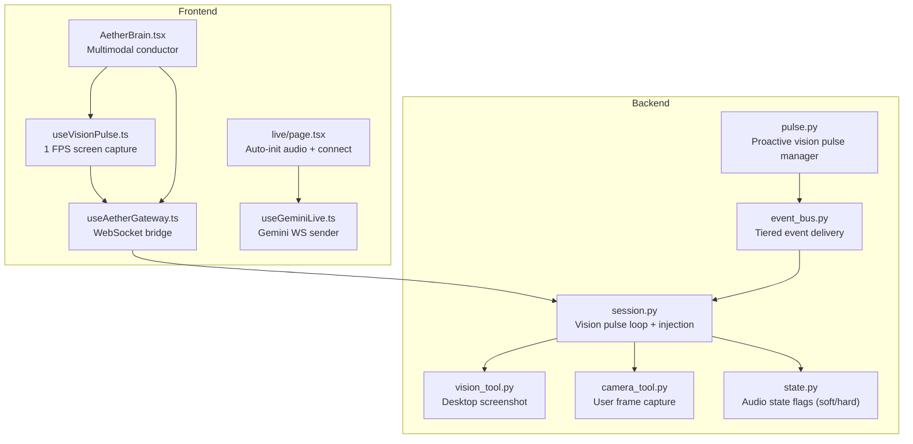
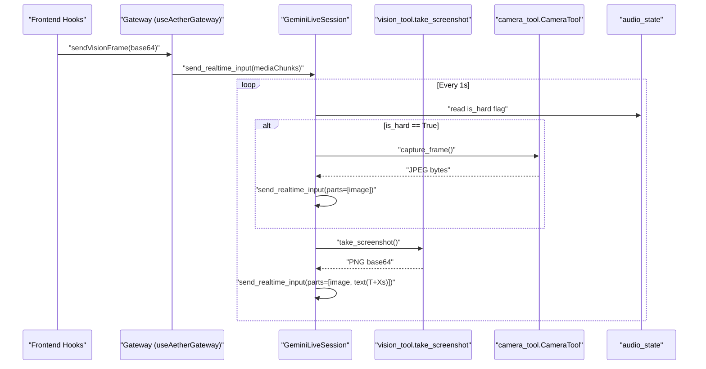
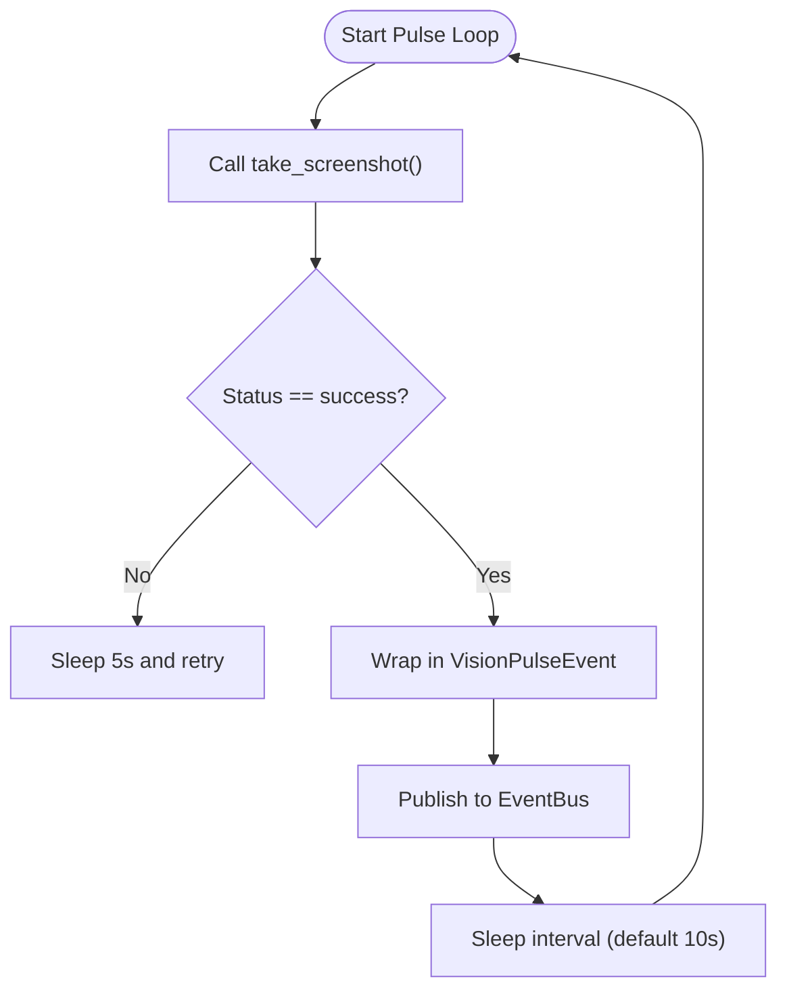
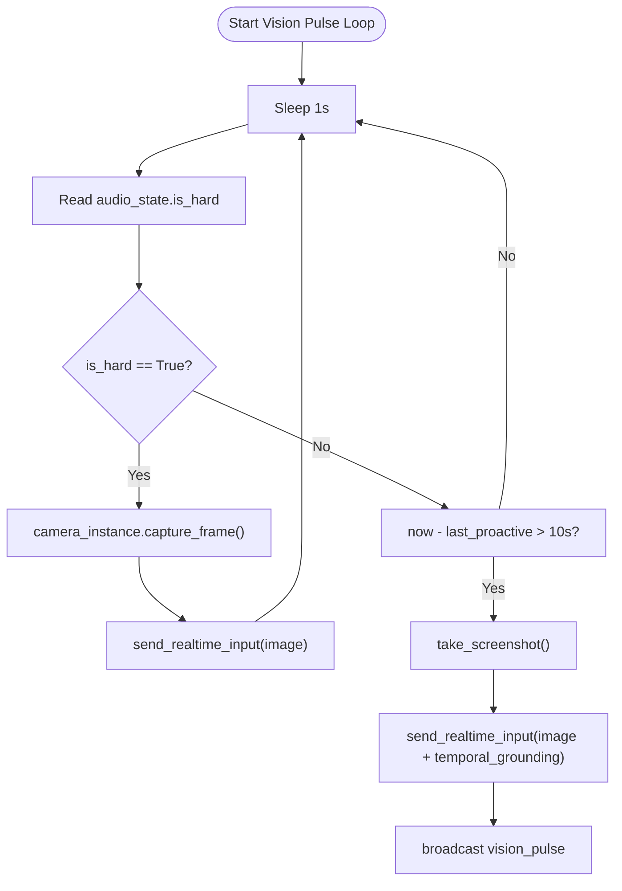
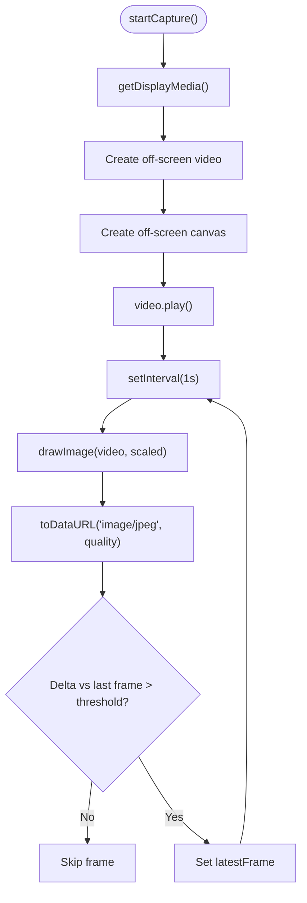
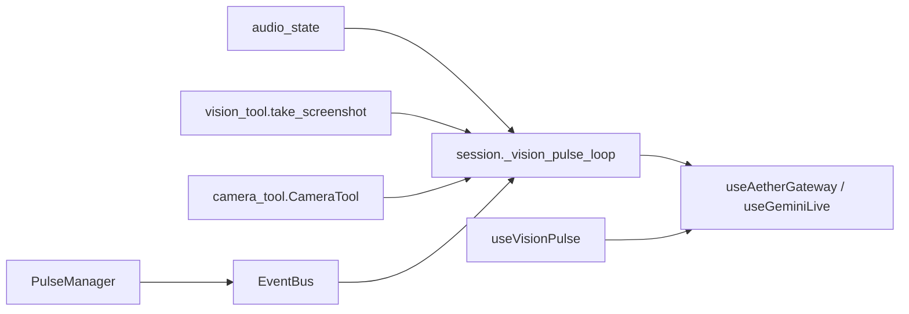

# Multimodal Context Processing

<cite>
**Referenced Files in This Document**
- [pulse.py](file://core/logic/managers/pulse.py)
- [useVisionPulse.ts](file://apps/portal/src/hooks/useVisionPulse.ts)
- [session.py](file://core/ai/session.py)
- [vision_tool.py](file://core/tools/vision_tool.py)
- [camera_tool.py](file://core/tools/camera_tool.py)
- [state.py](file://core/audio/state.py)
- [event_bus.py](file://core/infra/event_bus.py)
- [useAetherGateway.ts](file://apps/portal/src/hooks/useAetherGateway.ts)
- [AetherBrain.tsx](file://apps/portal/src/components/AetherBrain.tsx)
- [useGeminiLive.ts](file://apps/portal/src/hooks/useGeminiLive.ts)
- [page.tsx](file://apps/portal/src/app/live/page.tsx)
</cite>

## Table of Contents
1. [Introduction](#introduction)
2. [Project Structure](#project-structure)
3. [Core Components](#core-components)
4. [Architecture Overview](#architecture-overview)
5. [Detailed Component Analysis](#detailed-component-analysis)
6. [Dependency Analysis](#dependency-analysis)
7. [Performance Considerations](#performance-considerations)
8. [Troubleshooting Guide](#troubleshooting-guide)
9. [Conclusion](#conclusion)

## Introduction
This document explains the multimodal context processing pipeline for Gemini Live integration, focusing on proactive vision pulses, rolling buffer management, temporal grounding for indexical synchronization, and hard interrupt camera pulses for capturing user reactions during barge-in. It documents the integration with camera_tool and vision_tool for screen capture and visual context processing, the handling of audio, text, and visual data streams, and the scheduling logic that ties vision pulses to audio state monitoring. Practical guidance is included for configuration, temporal grounding implementation, visual context injection, and performance/memory considerations for continuous screen capture.

## Project Structure
The multimodal context pipeline spans three layers:
- Frontend (React hooks and UI wiring)
- Backend Python (AI session, tools, audio state, event bus)
- Integration points (WebSocket transport, tool routers, telemetry)

**Diagram sources**
- [useVisionPulse.ts](file://apps/portal/src/hooks/useVisionPulse.ts#L1-L226)
- [useAetherGateway.ts](file://apps/portal/src/hooks/useAetherGateway.ts#L1-L200)
- [AetherBrain.tsx](file://apps/portal/src/components/AetherBrain.tsx#L1-L198)
- [useGeminiLive.ts](file://apps/portal/src/hooks/useGeminiLive.ts#L332-L381)
- [page.tsx](file://apps/portal/src/app/live/page.tsx#L43-L87)
- [session.py](file://core/ai/session.py#L266-L342)
- [vision_tool.py](file://core/tools/vision_tool.py#L1-L75)
- [camera_tool.py](file://core/tools/camera_tool.py#L1-L65)
- [state.py](file://core/audio/state.py#L36-L129)
- [event_bus.py](file://core/infra/event_bus.py#L69-L152)
- [pulse.py](file://core/logic/managers/pulse.py#L15-L70)

**Section sources**
- [useVisionPulse.ts](file://apps/portal/src/hooks/useVisionPulse.ts#L1-L226)
- [useAetherGateway.ts](file://apps/portal/src/hooks/useAetherGateway.ts#L1-L200)
- [AetherBrain.tsx](file://apps/portal/src/components/AetherBrain.tsx#L1-L198)
- [useGeminiLive.ts](file://apps/portal/src/hooks/useGeminiLive.ts#L332-L381)
- [page.tsx](file://apps/portal/src/app/live/page.tsx#L43-L87)
- [session.py](file://core/ai/session.py#L266-L342)
- [vision_tool.py](file://core/tools/vision_tool.py#L1-L75)
- [camera_tool.py](file://core/tools/camera_tool.py#L1-L65)
- [state.py](file://core/audio/state.py#L36-L129)
- [event_bus.py](file://core/infra/event_bus.py#L69-L152)
- [pulse.py](file://core/logic/managers/pulse.py#L15-L70)

## Core Components
- Proactive Vision Pulse Manager: Periodically captures screenshots and publishes them as system events for downstream consumption.
- Vision Pulse Loop: Maintains a rolling buffer of visual frames and sends proactive pulses with temporal grounding; also triggers hard-interrupt camera pulses.
- Vision Tool: Captures desktop screenshots using a fast library and returns base64-encoded images.
- Camera Tool: Captures a single user frame from the webcam for reaction capture during hard interrupts.
- Audio State: Provides flags indicating soft/hard interrupt conditions used to drive camera pulses.
- Event Bus: Tiered delivery of events with latency budgets; routes proactive vision pulses to consumers.
- Frontend Hooks: Manage screen capture, change detection, and forward frames to the backend gateway and Gemini.

**Section sources**
- [pulse.py](file://core/logic/managers/pulse.py#L15-L70)
- [session.py](file://core/ai/session.py#L266-L342)
- [vision_tool.py](file://core/tools/vision_tool.py#L1-L75)
- [camera_tool.py](file://core/tools/camera_tool.py#L1-L65)
- [state.py](file://core/audio/state.py#L36-L129)
- [event_bus.py](file://core/infra/event_bus.py#L69-L152)
- [useVisionPulse.ts](file://apps/portal/src/hooks/useVisionPulse.ts#L1-L226)

## Architecture Overview
The system integrates audio, visual, and tool-call contexts into a single multimodal stream with precise timing:

**Diagram sources**
- [useAetherGateway.ts](file://apps/portal/src/hooks/useAetherGateway.ts#L191-L200)
- [session.py](file://core/ai/session.py#L266-L342)
- [vision_tool.py](file://core/tools/vision_tool.py#L19-L55)
- [camera_tool.py](file://core/tools/camera_tool.py#L20-L47)
- [state.py](file://core/audio/state.py#L62-L62)

## Detailed Component Analysis

### Proactive Vision Pulse Manager
Responsibilities:
- Periodically capture screenshots using the vision tool.
- Publish a system event with a latency budget for downstream handling.
- Back off gracefully on errors.

**Diagram sources**
- [pulse.py](file://core/logic/managers/pulse.py#L46-L70)
- [vision_tool.py](file://core/tools/vision_tool.py#L19-L55)

**Section sources**
- [pulse.py](file://core/logic/managers/pulse.py#L15-L70)
- [vision_tool.py](file://core/tools/vision_tool.py#L1-L75)

### Vision Pulse Loop (Rolling Buffer, Proactive Pulses, Hard Interrupt Camera Pulse)
Responsibilities:
- Maintain a rolling buffer of recent screenshots for indexical synchronization.
- Send proactive pulses every N seconds with temporal grounding text.
- On hard interrupts, capture a user frame and inject it immediately.

**Diagram sources**
- [session.py](file://core/ai/session.py#L266-L342)
- [camera_tool.py](file://core/tools/camera_tool.py#L20-L47)
- [vision_tool.py](file://core/tools/vision_tool.py#L19-L55)

**Section sources**
- [session.py](file://core/ai/session.py#L266-L342)
- [camera_tool.py](file://core/tools/camera_tool.py#L1-L65)
- [vision_tool.py](file://core/tools/vision_tool.py#L1-L75)
- [state.py](file://core/audio/state.py#L62-L62)

### Frontend Screen Capture and Change Detection
Responsibilities:
- Capture display media at 1 FPS using getDisplayMedia.
- Render frames to an off-screen canvas and encode to JPEG.
- Apply change detection to skip near-identical frames.
- Forward frames to the gateway and Gemini.

**Diagram sources**
- [useVisionPulse.ts](file://apps/portal/src/hooks/useVisionPulse.ts#L122-L174)
- [useVisionPulse.ts](file://apps/portal/src/hooks/useVisionPulse.ts#L65-L117)

**Section sources**
- [useVisionPulse.ts](file://apps/portal/src/hooks/useVisionPulse.ts#L1-L226)
- [AetherBrain.tsx](file://apps/portal/src/components/AetherBrain.tsx#L160-L165)
- [useAetherGateway.ts](file://apps/portal/src/hooks/useAetherGateway.ts#L191-L200)
- [useGeminiLive.ts](file://apps/portal/src/hooks/useGeminiLive.ts#L363-L381)

### Temporal Grounding Implementation
The vision pulse loop injects a text part alongside the image to ground the visual context in time, enabling indexical synchronization.

Implementation highlights:
- Compute elapsed time since session start.
- Construct a text part containing a temporal tag.
- Send the image and text part together in a single multimodal input.

**Section sources**
- [session.py](file://core/ai/session.py#L297-L321)

### Integration with Tools and Session
- Tool registration: vision_tool and camera_tool are made available to the session’s tool router.
- Session configuration: the session builds a LiveConnectConfig that includes tool declarations and optional search grounding.
- Tool invocation: the session routes tool calls and injects tool results into the multimodal stream.

**Section sources**
- [session.py](file://core/ai/session.py#L96-L154)
- [vision_tool.py](file://core/tools/vision_tool.py#L58-L75)
- [camera_tool.py](file://core/tools/camera_tool.py#L53-L65)

### Audio State Monitoring and Hard Interrupt Camera Pulse
- Audio state flags indicate soft/hard interrupt conditions.
- The vision pulse loop checks the hard interrupt flag and triggers a camera pulse to capture the user’s reaction.

**Section sources**
- [state.py](file://core/audio/state.py#L62-L62)
- [session.py](file://core/ai/session.py#L323-L336)

### Event Bus and Proactive Pulse Delivery
- VisionPulseEvent is published with a latency budget.
- The event bus routes events to subscribers based on tiers, ensuring timely delivery.

**Section sources**
- [pulse.py](file://core/logic/managers/pulse.py#L10-L14)
- [event_bus.py](file://core/infra/event_bus.py#L69-L152)

## Dependency Analysis
The vision context pipeline depends on:
- Audio state for interrupt-driven camera pulses.
- Tools for screenshot and camera capture.
- Session for multimodal injection and scheduling.
- Frontend hooks for capture and transport.

**Diagram sources**
- [session.py](file://core/ai/session.py#L266-L342)
- [vision_tool.py](file://core/tools/vision_tool.py#L1-L75)
- [camera_tool.py](file://core/tools/camera_tool.py#L1-L65)
- [state.py](file://core/audio/state.py#L36-L129)
- [useAetherGateway.ts](file://apps/portal/src/hooks/useAetherGateway.ts#L1-L200)
- [useGeminiLive.ts](file://apps/portal/src/hooks/useGeminiLive.ts#L332-L381)
- [useVisionPulse.ts](file://apps/portal/src/hooks/useVisionPulse.ts#L1-L226)
- [pulse.py](file://core/logic/managers/pulse.py#L15-L70)
- [event_bus.py](file://core/infra/event_bus.py#L69-L152)

**Section sources**
- [session.py](file://core/ai/session.py#L266-L342)
- [state.py](file://core/audio/state.py#L36-L129)
- [vision_tool.py](file://core/tools/vision_tool.py#L1-L75)
- [camera_tool.py](file://core/tools/camera_tool.py#L1-L65)
- [useAetherGateway.ts](file://apps/portal/src/hooks/useAetherGateway.ts#L1-L200)
- [useGeminiLive.ts](file://apps/portal/src/hooks/useGeminiLive.ts#L332-L381)
- [useVisionPulse.ts](file://apps/portal/src/hooks/useVisionPulse.ts#L1-L226)
- [pulse.py](file://core/logic/managers/pulse.py#L15-L70)
- [event_bus.py](file://core/infra/event_bus.py#L69-L152)

## Performance Considerations
- Continuous screen capture:
  - Frontend: 1 FPS capture with JPEG encoding at a tuned quality and scale factor reduces CPU and bandwidth.
  - Backend: In-process screenshot capture avoids disk I/O and minimizes latency.
- Change detection:
  - Skips frames with small size deltas, reducing redundant transmissions.
- Rolling buffer:
  - Maintains a bounded number of recent frames for indexical sync; tune capacity based on memory and latency targets.
- Latency budgets:
  - Events carry deadlines; proactive pulses use a tiered budget suitable for non-critical context.
- Memory management:
  - Off-screen canvas and video elements are cleaned up on stop; ensure intervals and tracks are cleared to prevent leaks.
  - Camera capture opens/closes the device per frame; consider keeping it open in standby if supported by the platform to reduce startup overhead.

[No sources needed since this section provides general guidance]

## Troubleshooting Guide
- Screen capture permissions denied:
  - The frontend hook logs and cleans up on failure; ensure the browser grants display media permissions.
- Camera capture failures:
  - CameraTool logs errors and returns None; verify camera availability and permissions.
- Proactive pulse not received:
  - Confirm the backend PulseManager is running and publishing VisionPulseEvent; check EventBus routing and subscriber registration.
- Hard interrupt camera pulse not triggered:
  - Verify audio_state.is_hard transitions correctly; ensure the vision pulse loop polls the flag and invokes camera capture.
- Visual context injection delays:
  - Check temporal grounding text construction and multimodal input batching; ensure the Gemini session is connected and not overloaded.

**Section sources**
- [useVisionPulse.ts](file://apps/portal/src/hooks/useVisionPulse.ts#L169-L173)
- [camera_tool.py](file://core/tools/camera_tool.py#L45-L47)
- [pulse.py](file://core/logic/managers/pulse.py#L67-L69)
- [session.py](file://core/ai/session.py#L323-L336)

## Conclusion
The multimodal context pipeline integrates proactive and interrupt-driven visual awareness with audio and text streams. The vision pulse loop maintains a rolling buffer, periodically injects grounded visual context, and captures user reactions during hard interrupts. The frontend provides efficient screen capture with change detection, while the backend ensures timely delivery and injection via a structured event bus and session orchestration. Tuning capture rates, compression, and buffer sizes enables balanced performance and responsiveness.