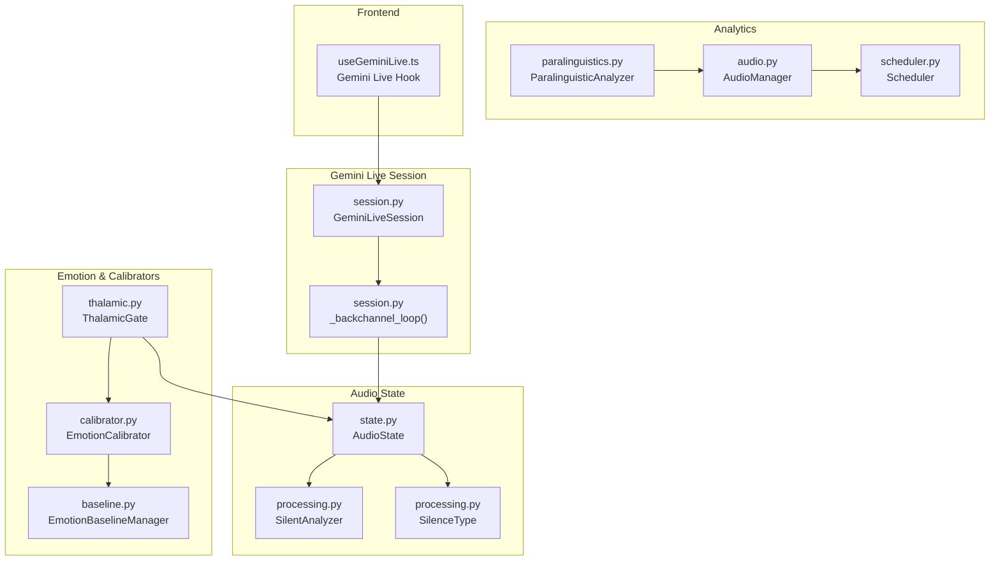
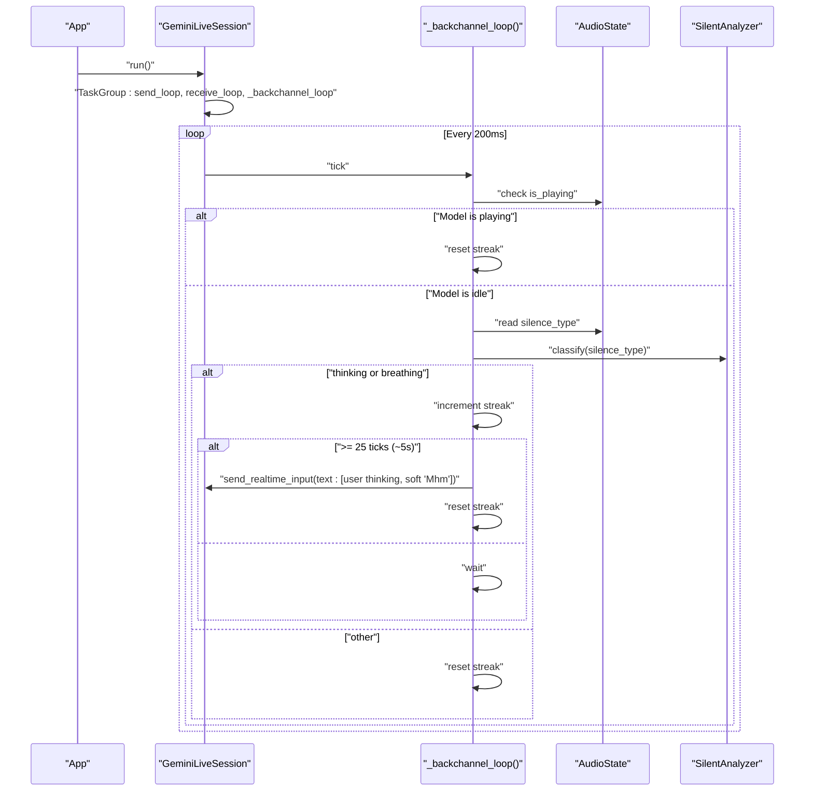
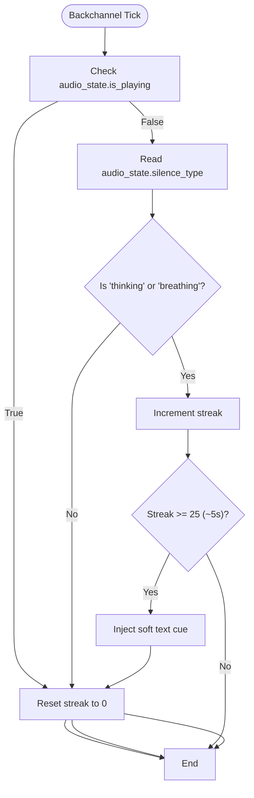
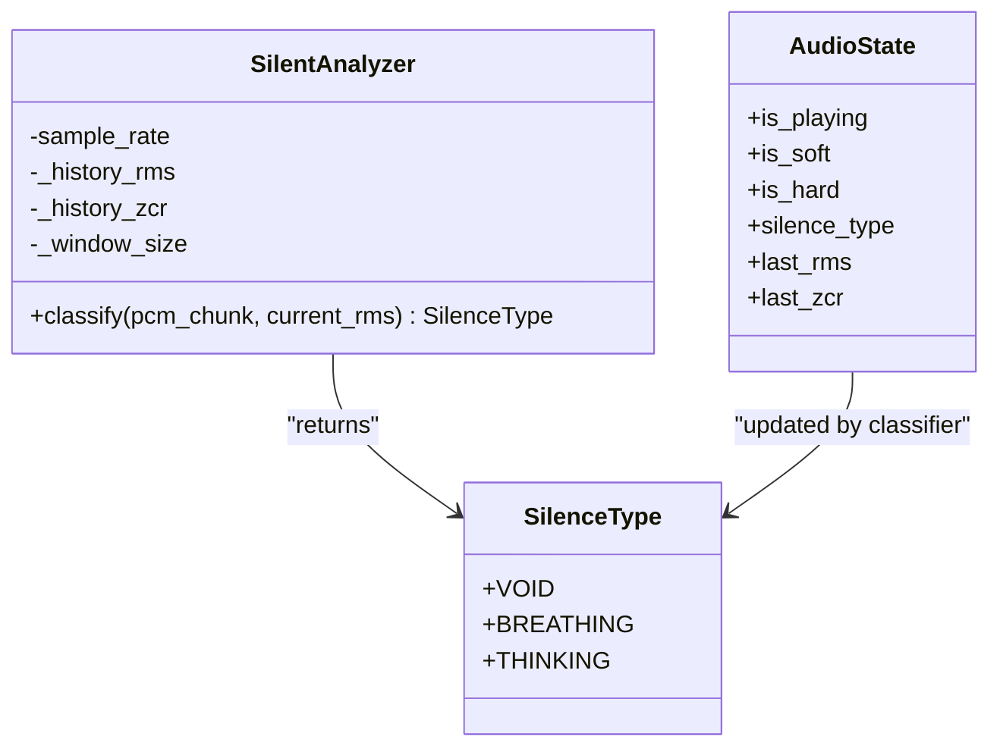
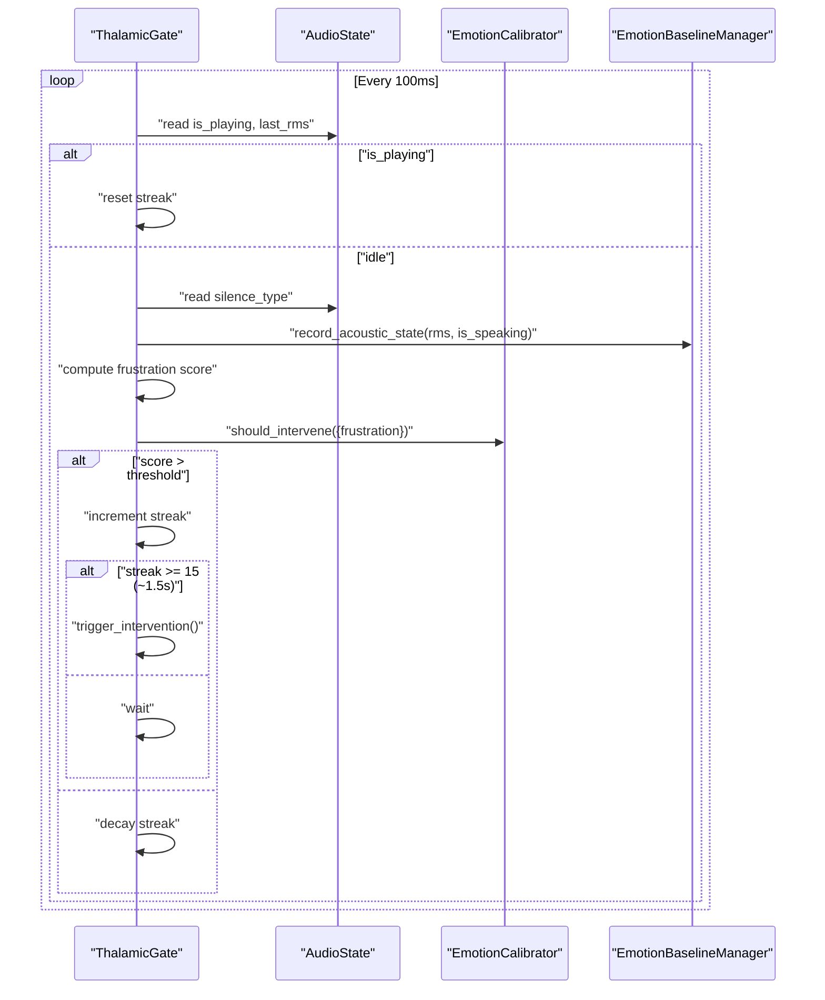
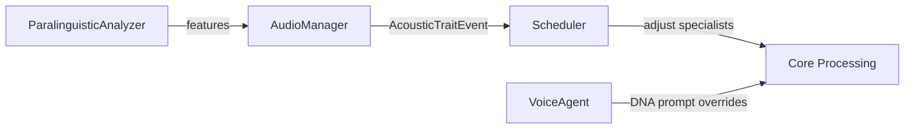
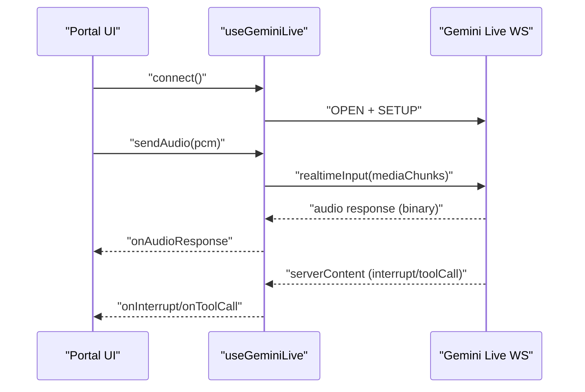
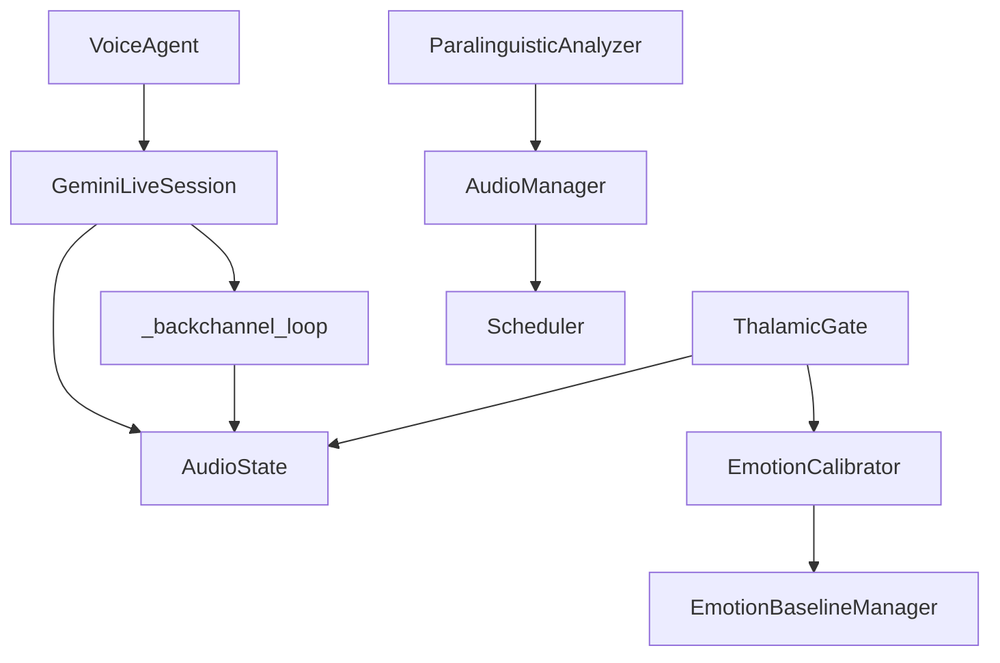

# Proactive Backchannel and Empathetic Responses

<cite>
**Referenced Files in This Document**
- [session.py](file://core/ai/session.py)
- [state.py](file://core/audio/state.py)
- [processing.py](file://core/audio/processing.py)
- [thalamic.py](file://core/ai/thalamic.py)
- [calibrator.py](file://core/emotion/calibrator.py)
- [baseline.py](file://core/emotion/baseline.py)
- [paralinguistics.py](file://core/audio/paralinguistics.py)
- [audio.py](file://core/logic/managers/audio.py)
- [scheduler.py](file://core/ai/scheduler.py)
- [voice_agent.py](file://core/ai/agents/voice_agent.py)
- [SKILL.md](file://docs/SKILL.md)
- [useGeminiLive.ts](file://apps/portal/src/hooks/useGeminiLive.ts)
</cite>

## Table of Contents
1. [Introduction](#introduction)
2. [Project Structure](#project-structure)
3. [Core Components](#core-components)
4. [Architecture Overview](#architecture-overview)
5. [Detailed Component Analysis](#detailed-component-analysis)
6. [Dependency Analysis](#dependency-analysis)
7. [Performance Considerations](#performance-considerations)
8. [Troubleshooting Guide](#troubleshooting-guide)
9. [Conclusion](#conclusion)
10. [Appendices](#appendices)

## Introduction
This document explains the proactive backchannel system and empathetic responses integrated with Gemini Live. It details the silence architecture monitoring system, the backchannel loop that detects user thinking and breathing states, the empathetic response triggering mechanism with a 5-second cognitive load threshold, and the soft vocal affirmation injection strategy. It also covers integration with audio_state for monitoring silence types, the structured concurrency approach for managing the backchannel loop, and reset mechanisms to prevent spamming empathetic responses. Examples of configuration, state monitoring setup, and response triggering patterns are included, along with acoustic empathy features that improve user experience during cognitive load.

## Project Structure
The proactive backchannel and empathetic responses span several modules:
- Gemini Live session orchestration and structured concurrency
- Audio state and silence classification
- Emotion and frustration modeling with baselining
- Paralinguistic analytics and acoustic trait events
- Frontend integration via a Gemini Live hook

**Diagram sources**
- [session.py](file://core/ai/session.py#L343-L382)
- [state.py](file://core/audio/state.py#L36-L129)
- [processing.py](file://core/audio/processing.py#L325-L387)
- [thalamic.py](file://core/ai/thalamic.py#L11-L79)
- [calibrator.py](file://core/emotion/calibrator.py#L8-L65)
- [baseline.py](file://core/emotion/baseline.py#L9-L46)
- [paralinguistics.py](file://core/audio/paralinguistics.py#L19-L213)
- [audio.py](file://core/logic/managers/audio.py#L83-L97)
- [scheduler.py](file://core/ai/scheduler.py#L33-L50)
- [useGeminiLive.ts](file://apps/portal/src/hooks/useGeminiLive.ts#L65-L485)

**Section sources**
- [session.py](file://core/ai/session.py#L174-L236)
- [state.py](file://core/audio/state.py#L36-L129)
- [processing.py](file://core/audio/processing.py#L325-L387)
- [thalamic.py](file://core/ai/thalamic.py#L11-L79)
- [calibrator.py](file://core/emotion/calibrator.py#L8-L65)
- [baseline.py](file://core/emotion/baseline.py#L9-L46)
- [paralinguistics.py](file://core/audio/paralinguistics.py#L19-L213)
- [audio.py](file://core/logic/managers/audio.py#L83-L97)
- [scheduler.py](file://core/ai/scheduler.py#L33-L50)
- [useGeminiLive.ts](file://apps/portal/src/hooks/useGeminiLive.ts#L65-L485)

## Core Components
- GeminiLiveSession: Orchestrates the Gemini Live connection, manages structured concurrency, and runs the backchannel loop alongside send/receive loops.
- AudioState: Thread-safe singleton that exposes playback state and silence classification for downstream components.
- SilentAnalyzer and SilenceType: Classify silence into void, breathing, and thinking to drive backchannel triggers.
- ThalamicGate: Monitors acoustic state and emotion baselines to trigger proactive interventions when frustration thresholds are exceeded.
- EmotionCalibrator and EmotionBaselineManager: Dynamically calibrate intervention thresholds using acoustic baselines.
- ParalinguisticAnalyzer and AudioManager: Extract acoustic traits and publish them as events for the scheduler.
- Scheduler: Adjusts cognitive load handling based on acoustic traits.
- Frontend Hook: Provides a direct WebSocket connection to Gemini Live for audio streaming and response handling.

**Section sources**
- [session.py](file://core/ai/session.py#L43-L95)
- [state.py](file://core/audio/state.py#L36-L129)
- [processing.py](file://core/audio/processing.py#L325-L387)
- [thalamic.py](file://core/ai/thalamic.py#L11-L79)
- [calibrator.py](file://core/emotion/calibrator.py#L8-L65)
- [baseline.py](file://core/emotion/baseline.py#L9-L46)
- [paralinguistics.py](file://core/audio/paralinguistics.py#L19-L213)
- [audio.py](file://core/logic/managers/audio.py#L83-L97)
- [scheduler.py](file://core/ai/scheduler.py#L33-L50)
- [useGeminiLive.ts](file://apps/portal/src/hooks/useGeminiLive.ts#L65-L485)

## Architecture Overview
The backchannel system integrates tightly with the Gemini Live session and audio state:
- The backchannel loop periodically checks audio_state.silence_type and audio_state.is_playing.
- When the user is in “thinking” or “breathing” and the model is not speaking, the loop injects a soft textual cue to encourage a model vocal backchannel without fully taking the conversational turn.
- The silence classification is derived from SilentAnalyzer and SilenceType, which rely on RMS energy and ZCR characteristics.
- Structured concurrency ensures the backchannel loop runs alongside send/receive loops and other proactive loops.

**Diagram sources**
- [session.py](file://core/ai/session.py#L174-L236)
- [session.py](file://core/ai/session.py#L343-L382)
- [state.py](file://core/audio/state.py#L36-L129)
- [processing.py](file://core/audio/processing.py#L325-L387)

**Section sources**
- [session.py](file://core/ai/session.py#L174-L236)
- [session.py](file://core/ai/session.py#L343-L382)
- [state.py](file://core/audio/state.py#L36-L129)
- [processing.py](file://core/audio/processing.py#L325-L387)

## Detailed Component Analysis

### Backchannel Loop and Empathetic Response Triggering
- The backchannel loop runs concurrently with the session and checks audio_state.is_playing to avoid interfering with model audio output.
- It reads audio_state.silence_type and increments a streak counter when the type is “thinking” or “breathing.”
- After approximately five seconds (25 iterations at 200 ms intervals), the loop injects a lightweight text cue intended to elicit a soft vocal affirmation from the model without fully taking the conversational turn.
- The streak resets upon sending the cue or when the model begins playing audio, preventing spam.

**Diagram sources**
- [session.py](file://core/ai/session.py#L343-L382)
- [state.py](file://core/audio/state.py#L36-L129)
- [processing.py](file://core/audio/processing.py#L325-L387)

**Section sources**
- [session.py](file://core/ai/session.py#L343-L382)
- [state.py](file://core/audio/state.py#L36-L129)
- [processing.py](file://core/audio/processing.py#L325-L387)

### Silence Architecture Monitoring and Classification
- SilenceType enumerates three states: void, breathing, and thinking.
- SilentAnalyzer classifies silence using RMS energy and ZCR over a sliding window, distinguishing oscillatory micro-RMS (breathing) from sustained low-RMS (thinking).
- These classifications feed into the backchannel loop and ThalamicGate to decide when to trigger empathetic or proactive interventions.

**Diagram sources**
- [processing.py](file://core/audio/processing.py#L325-L387)
- [state.py](file://core/audio/state.py#L36-L129)

**Section sources**
- [processing.py](file://core/audio/processing.py#L325-L387)
- [state.py](file://core/audio/state.py#L36-L129)

### ThalamicGate and Proactive Intervention
- ThalamicGate monitors audio_state.is_playing and records acoustic states for baseline generation.
- It computes a frustration score synthesized from silence type and acoustic features, and triggers proactive interventions when thresholds are exceeded.
- The loop resets on playback and uses a streak counter to ensure sustained states before intervention.

**Diagram sources**
- [thalamic.py](file://core/ai/thalamic.py#L41-L79)
- [state.py](file://core/audio/state.py#L36-L129)
- [calibrator.py](file://core/emotion/calibrator.py#L51-L65)
- [baseline.py](file://core/emotion/baseline.py#L41-L46)

**Section sources**
- [thalamic.py](file://core/ai/thalamic.py#L41-L79)
- [state.py](file://core/audio/state.py#L36-L129)
- [calibrator.py](file://core/emotion/calibrator.py#L51-L65)
- [baseline.py](file://core/emotion/baseline.py#L41-L46)

### Acoustic Empathy and Trait-Based Scheduling
- ParalinguisticAnalyzer extracts acoustic features (pitch, speech rate, RMS variance, spectral centroid) and computes engagement and zen-mode indicators.
- AudioManager publishes acoustic trait events to the event bus, which the Scheduler consumes to adjust cognitive load handling.
- VoiceAgent builds behavioral DNA prompts that include empathy and proactivity, influencing model behavior.

**Diagram sources**
- [paralinguistics.py](file://core/audio/paralinguistics.py#L19-L213)
- [audio.py](file://core/logic/managers/audio.py#L83-L97)
- [scheduler.py](file://core/ai/scheduler.py#L33-L50)
- [voice_agent.py](file://core/ai/agents/voice_agent.py#L24-L45)

**Section sources**
- [paralinguistics.py](file://core/audio/paralinguistics.py#L19-L213)
- [audio.py](file://core/logic/managers/audio.py#L83-L97)
- [scheduler.py](file://core/ai/scheduler.py#L33-L50)
- [voice_agent.py](file://core/ai/agents/voice_agent.py#L24-L45)

### Frontend Integration and Real-Time Behavior
- The frontend hook establishes a WebSocket connection to Gemini Live, streams PCM audio, and handles audio responses and tool calls.
- It measures latency and supports reconnection with exponential backoff, ensuring a responsive user experience aligned with the backchannel system.

**Diagram sources**
- [useGeminiLive.ts](file://apps/portal/src/hooks/useGeminiLive.ts#L90-L228)
- [useGeminiLive.ts](file://apps/portal/src/hooks/useGeminiLive.ts#L230-L325)
- [useGeminiLive.ts](file://apps/portal/src/hooks/useGeminiLive.ts#L327-L404)

**Section sources**
- [useGeminiLive.ts](file://apps/portal/src/hooks/useGeminiLive.ts#L65-L485)

## Dependency Analysis
- GeminiLiveSession depends on AudioState for silence classification and structured concurrency to run the backchannel loop alongside send/receive loops.
- ThalamicGate depends on EmotionCalibrator and EmotionBaselineManager to compute and calibrate frustration thresholds.
- ParalinguisticAnalyzer feeds acoustic traits to AudioManager, which publishes events consumed by the Scheduler.
- VoiceAgent influences model behavior via DNA-driven prompt overrides.

**Diagram sources**
- [session.py](file://core/ai/session.py#L174-L236)
- [session.py](file://core/ai/session.py#L343-L382)
- [state.py](file://core/audio/state.py#L36-L129)
- [thalamic.py](file://core/ai/thalamic.py#L11-L79)
- [calibrator.py](file://core/emotion/calibrator.py#L8-L65)
- [baseline.py](file://core/emotion/baseline.py#L9-L46)
- [paralinguistics.py](file://core/audio/paralinguistics.py#L19-L213)
- [audio.py](file://core/logic/managers/audio.py#L83-L97)
- [scheduler.py](file://core/ai/scheduler.py#L33-L50)
- [voice_agent.py](file://core/ai/agents/voice_agent.py#L24-L45)

**Section sources**
- [session.py](file://core/ai/session.py#L174-L236)
- [state.py](file://core/audio/state.py#L36-L129)
- [thalamic.py](file://core/ai/thalamic.py#L11-L79)
- [calibrator.py](file://core/emotion/calibrator.py#L8-L65)
- [baseline.py](file://core/emotion/baseline.py#L9-L46)
- [paralinguistics.py](file://core/audio/paralinguistics.py#L19-L213)
- [audio.py](file://core/logic/managers/audio.py#L83-L97)
- [scheduler.py](file://core/ai/scheduler.py#L33-L50)
- [voice_agent.py](file://core/ai/agents/voice_agent.py#L24-L45)

## Performance Considerations
- Structured concurrency ensures that failures in one loop cancel others, maintaining system stability.
- The backchannel loop sleeps for short intervals to minimize overhead while preserving responsiveness.
- Adaptive VAD thresholds and silence classification reduce false positives and improve latency-sensitive decisions.
- Frontend latency measurement and exponential backoff improve resilience under network variability.

[No sources needed since this section provides general guidance]

## Troubleshooting Guide
- If empathetic cues are not triggering:
  - Verify audio_state.is_playing is accurate and that the backchannel loop resets on playback.
  - Confirm audio_state.silence_type transitions to “thinking” or “breathing” during cognitive load.
- If spamming occurs:
  - Ensure the streak resets after sending a cue or when the model begins playing audio.
- If proactive interventions are too aggressive:
  - Review EmotionCalibrator thresholds and baseline calibration behavior.
- If latency increases:
  - Monitor event bus throughput and ensure audio processing remains within sub-100ms requirements.

**Section sources**
- [session.py](file://core/ai/session.py#L343-L382)
- [state.py](file://core/audio/state.py#L36-L129)
- [thalamic.py](file://core/ai/thalamic.py#L41-L79)
- [calibrator.py](file://core/emotion/calibrator.py#L51-L65)
- [audio.py](file://core/logic/managers/audio.py#L83-L97)

## Conclusion
The proactive backchannel and empathetic response system leverages precise silence classification, structured concurrency, and dynamic emotion baselines to deliver timely, non-intrusive assistance during cognitive load. By injecting subtle cues and coordinating with the Gemini Live session, the system improves user experience without disrupting natural conversation flow.

[No sources needed since this section summarizes without analyzing specific files]

## Appendices

### Backchannel Configuration and State Monitoring Setup
- Enable affective dialog and proactive audio in AI configuration to activate empathetic and proactive features.
- Ensure the backchannel loop is included in the session’s TaskGroup and respects audio_state.is_playing.
- Configure silence classification thresholds and adaptive VAD parameters to match the environment.

**Section sources**
- [session.py](file://core/ai/session.py#L135-L154)
- [SKILL.md](file://docs/SKILL.md#L65-L77)
- [processing.py](file://core/audio/processing.py#L256-L323)

### Example Response Triggering Patterns
- Cognitive load detection: sustained low-RMS with minimal ZCR over ~5 seconds triggers a soft vocal affirmation injection.
- Proactive intervention: sustained frustration score exceeding calibrated thresholds triggers a barge-in with contextual empathy.

**Section sources**
- [session.py](file://core/ai/session.py#L362-L381)
- [thalamic.py](file://core/ai/thalamic.py#L61-L79)
- [calibrator.py](file://core/emotion/calibrator.py#L51-L65)