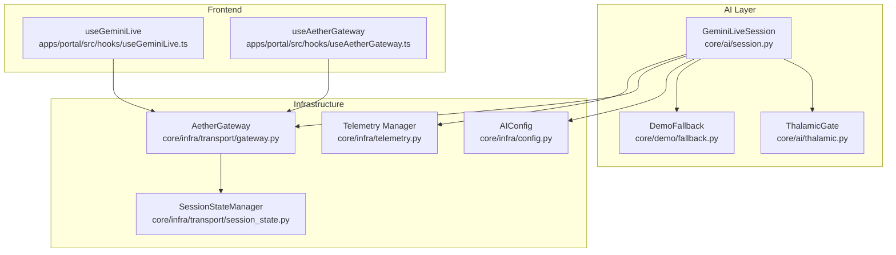
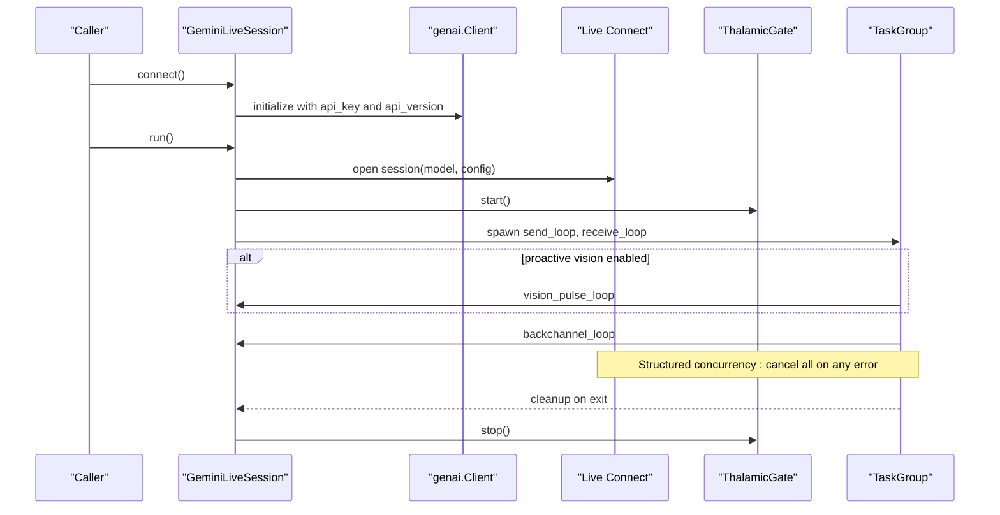
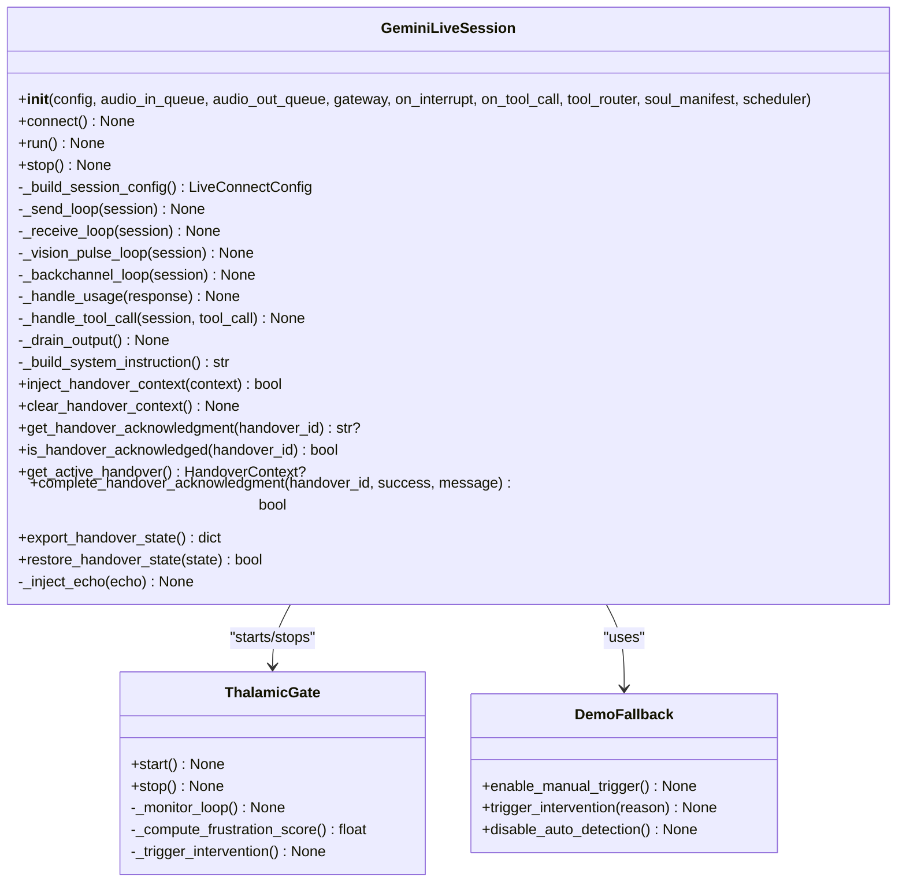
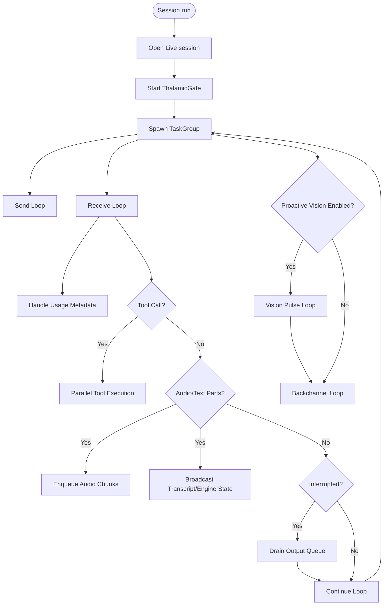
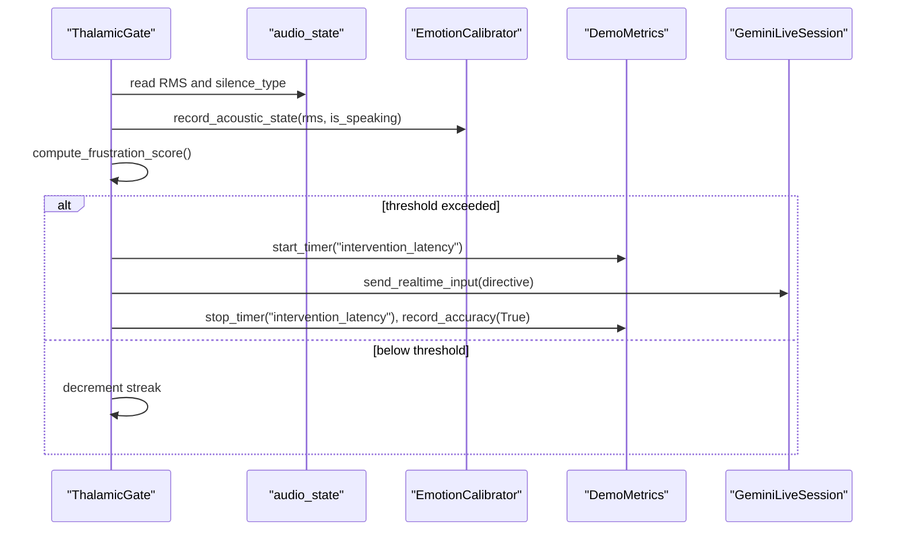

# Session Management and Lifecycle

<cite>
**Referenced Files in This Document**
- [session.py](file://core/ai/session.py)
- [thalamic.py](file://core/ai/thalamic.py)
- [fallback.py](file://core/demo/fallback.py)
- [config.py](file://core/infra/config.py)
- [telemetry.py](file://core/infra/telemetry.py)
- [test_gemini_live_session.py](file://tests/unit/test_gemini_live_session.py)
- [useGeminiLive.ts](file://apps/portal/src/hooks/useGeminiLive.ts)
- [useAetherGateway.ts](file://apps/portal/src/hooks/useAetherGateway.ts)
- [gateway.py](file://core/infra/transport/gateway.py)
- [session_state.py](file://core/infra/transport/session_state.py)
</cite>

## Table of Contents
1. [Introduction](#introduction)
2. [Project Structure](#project-structure)
3. [Core Components](#core-components)
4. [Architecture Overview](#architecture-overview)
5. [Detailed Component Analysis](#detailed-component-analysis)
6. [Dependency Analysis](#dependency-analysis)
7. [Performance Considerations](#performance-considerations)
8. [Troubleshooting Guide](#troubleshooting-guide)
9. [Conclusion](#conclusion)
10. [Appendices](#appendices)

## Introduction
This document explains the Gemini Live session management and lifecycle in Aether Voice OS. It focuses on the GeminiLiveSession class, its initialization parameters, configuration building with LiveConnectConfig, and the connection establishment process. It documents the structured concurrency approach using TaskGroup for managing send/receive loops, vision pulse, and backchannel loops. It also covers the session lifecycle from connect() to run(), including error handling and cleanup, session configuration options (response modalities, system instructions, tool declarations, speech configuration), integration with Thalamic Gate V2 for audio processing, and the demo fallback system. Examples of configuration, connection troubleshooting, and performance monitoring are included, along with telemetry collection for usage tracking and session metrics.

## Project Structure
The session management spans several modules:
- AI session controller and loops
- Audio processing and gating
- Configuration and environment settings
- Telemetry and usage tracking
- Frontend integration hooks

**Diagram sources**
- [session.py](file://core/ai/session.py#L43-L922)
- [thalamic.py](file://core/ai/thalamic.py#L11-L122)
- [fallback.py](file://core/demo/fallback.py#L6-L35)
- [config.py](file://core/infra/config.py#L52-L127)
- [gateway.py](file://core/infra/transport/gateway.py#L140-L183)
- [session_state.py](file://core/infra/transport/session_state.py#L71-L385)
- [telemetry.py](file://core/infra/telemetry.py#L77-L129)
- [useGeminiLive.ts](file://apps/portal/src/hooks/useGeminiLive.ts#L1-L252)
- [useAetherGateway.ts](file://apps/portal/src/hooks/useAetherGateway.ts#L262-L297)

**Section sources**
- [session.py](file://core/ai/session.py#L1-L155)
- [config.py](file://core/infra/config.py#L52-L127)

## Core Components
- GeminiLiveSession: Orchestrates the bidirectional audio connection to Gemini Live, manages queues, loops, tool calls, interruptions, and telemetry.
- ThalamicGate: Proactive audio intervention and emotional triggering monitor.
- DemoFallback: Manual override safety net for demos.
- AIConfig: Runtime configuration for model selection, grounding, affective dialog, proactive audio, vision, thinking budget, and system instructions.
- Telemetry Manager: Records usage metadata and cost estimates.
- Frontend Hooks: Manage UI state and WebSocket transport to the gateway.

Key responsibilities:
- Initialization parameters: audio queues, gateway, optional callbacks, tool router, soul manifest, scheduler.
- Configuration building: tools, grounding, system instruction assembly, speech config mapping.
- Connection: client creation and session establishment via Live API.
- Structured concurrency: TaskGroup for send/receive loops, vision pulse, backchannel.
- Lifecycle: connect(), run(), stop(), cleanup.
- Telemetry: usage metadata extraction and cost tracking.

**Section sources**
- [session.py](file://core/ai/session.py#L43-L155)
- [thalamic.py](file://core/ai/thalamic.py#L11-L122)
- [fallback.py](file://core/demo/fallback.py#L6-L35)
- [config.py](file://core/infra/config.py#L52-L86)
- [telemetry.py](file://core/infra/telemetry.py#L77-L129)

## Architecture Overview
The session establishes a Live connection, wires in audio processing and demo safety, and runs concurrent loops for audio I/O, vision pulses, and backchannels. Structured concurrency ensures coordinated shutdown on exceptions.

**Diagram sources**
- [session.py](file://core/ai/session.py#L156-L235)
- [thalamic.py](file://core/ai/thalamic.py#L25-L32)

**Section sources**
- [session.py](file://core/ai/session.py#L156-L235)

## Detailed Component Analysis

### GeminiLiveSession Class
GeminiLiveSession encapsulates the entire session lifecycle and processing logic.

**Diagram sources**
- [session.py](file://core/ai/session.py#L43-L922)
- [thalamic.py](file://core/ai/thalamic.py#L11-L122)
- [fallback.py](file://core/demo/fallback.py#L6-L35)

#### Initialization and Configuration Building
- Initializes queues, gateway, optional callbacks, tool router, scheduler, and telemetry counters.
- Builds LiveConnectConfig with:
  - Tools: function declarations from ToolRouter and optional Google Search grounding.
  - System instruction: assembled from soul manifest, injected handover context, base system instruction, and scheduler grounding.
  - Speech config: maps voice_id from soul manifest to a prebuilt voice.
  - Advanced features: affective dialog, proactive audio, thinking budget.

**Section sources**
- [session.py](file://core/ai/session.py#L54-L154)
- [config.py](file://core/infra/config.py#L52-L86)

#### Connection Establishment
- Creates genai.Client with API key and API version.
- Establishes Live session with model and config.
- Wires ThalamicGate and DemoFallback after session creation.

**Section sources**
- [session.py](file://core/ai/session.py#L156-L206)

#### Structured Concurrency and Loops
- Uses TaskGroup to run:
  - Send loop: reads from audio_in_queue and sends audio to Gemini.
  - Receive loop: extracts audio/text/tool calls/interruptions and routes accordingly.
  - Vision pulse loop: periodically captures screenshots and injects them with temporal grounding.
  - Backchannel loop: monitors silence types and injects empathetic cues.

**Diagram sources**
- [session.py](file://core/ai/session.py#L174-L235)
- [session.py](file://core/ai/session.py#L237-L478)

**Section sources**
- [session.py](file://core/ai/session.py#L174-L235)
- [session.py](file://core/ai/session.py#L237-L478)

#### Tool Call Handling
- Executes tool calls in parallel using asyncio.gather.
- Broadcasts tool results and supports multimodal injection of screenshots.
- Integrates with scheduler callbacks and handover state tracking.

**Section sources**
- [session.py](file://core/ai/session.py#L493-L603)

#### Interruption and Backchannel
- Detects barge-in/interruption and drains output queue instantly.
- Backchannel loop injects empathetic cues when user is thinking/breathing.

**Section sources**
- [session.py](file://core/ai/session.py#L463-L478)
- [session.py](file://core/ai/session.py#L343-L382)

#### Vision Pulse
- Maintains a rolling buffer of screenshots and proactively injects them with temporal grounding.
- Triggers camera capture on hard interrupts.

**Section sources**
- [session.py](file://core/ai/session.py#L266-L342)

#### System Instruction Assembly
- Merges soul persona/expertise, injected handover context, base system instruction, and scheduler grounding into a single system instruction.

**Section sources**
- [session.py](file://core/ai/session.py#L623-L674)
- [session.py](file://core/ai/session.py#L675-L736)

#### Handover Protocol Integration
- Injects, tracks, acknowledges, and completes handover contexts with timestamps and conversation entries.

**Section sources**
- [session.py](file://core/ai/session.py#L738-L883)

### Thalamic Gate V2 Integration
- Proactive monitoring of acoustic state to compute a frustration score.
- Triggers intervention by injecting a directive into the Live session when thresholds are met.
- Provides demo metrics and calibration for emotional indices.

**Diagram sources**
- [thalamic.py](file://core/ai/thalamic.py#L41-L122)
- [session.py](file://core/ai/session.py#L196-L205)

**Section sources**
- [thalamic.py](file://core/ai/thalamic.py#L11-L122)

### Demo Fallback System
- Provides manual override mode to force intervention when auto-detection is unreliable.
- Disables auto-detection to prevent double-speaking during manual demos.

**Section sources**
- [fallback.py](file://core/demo/fallback.py#L6-L35)

### Frontend Integration
- useGeminiLive: Manages WebSocket connection to Gemini Live API, handles audio/text parts, tool calls, and status transitions.
- useAetherGateway: Bridges UI to backend gateway for sending text/audio and managing connection state.

**Section sources**
- [useGeminiLive.ts](file://apps/portal/src/hooks/useGeminiLive.ts#L1-L252)
- [useAetherGateway.ts](file://apps/portal/src/hooks/useAetherGateway.ts#L262-L297)
- [gateway.py](file://core/infra/transport/gateway.py#L140-L183)

## Dependency Analysis
- GeminiLiveSession depends on:
  - AIConfig for model selection, grounding, and system instruction.
  - ToolRouter for function declarations and tool execution.
  - ThalamicGate and DemoFallback for proactive audio intervention and demo safety.
  - AetherGateway for broadcasting UI updates and metrics exposure.
  - Telemetry Manager for usage tracking.

```mermaid
graph LR
Config["AIConfig<br/>core/infra/config.py"] --> Session["GeminiLiveSession<br/>core/ai/session.py"]
ToolRouter["ToolRouter"] --> Session
Thalamic["ThalamicGate<br/>core/ai/thalamic.py"] --> Session
Demo["DemoFallback<br/>core/demo/fallback.py"] --> Session
Gateway["AetherGateway<br/>core/infra/transport/gateway.py"] --> Session
Telemetry["Telemetry Manager<br/>core/infra/telemetry.py"] --> Session
```

**Diagram sources**
- [session.py](file://core/ai/session.py#L54-L154)
- [config.py](file://core/infra/config.py#L52-L86)
- [thalamic.py](file://core/ai/thalamic.py#L11-L122)
- [fallback.py](file://core/demo/fallback.py#L6-L35)
- [gateway.py](file://core/infra/transport/gateway.py#L140-L183)
- [telemetry.py](file://core/infra/telemetry.py#L77-L129)

**Section sources**
- [session.py](file://core/ai/session.py#L54-L154)

## Performance Considerations
- Latency-sensitive design:
  - Small queue sizes and chunk sizes to bound latency.
  - Structured concurrency to ensure coordinated shutdown and minimal resource contention.
- Audio queue overflow protection:
  - Output queue overflow drops are tracked and exposed via gateway metrics.
- Vision pulse cadence:
  - 1 Hz rolling buffer and periodic proactive pulses reduce overhead while maintaining context.
- Backchannel empathy:
  - Low-frequency checks avoid excessive network traffic.

[No sources needed since this section provides general guidance]

## Troubleshooting Guide
Common issues and resolutions:
- Connection failures:
  - Verify API key and API version in AIConfig.
  - Ensure connect() is called before run().
- Session termination:
  - Structured concurrency raises AISessionExpiredError on non-cancelled exceptions; inspect logs for root causes.
- Audio queue overflow:
  - Monitor gemini_output_queue_drops in gateway metrics; adjust playback pipeline or queue sizes.
- Tool call failures:
  - Inspect tool results broadcast and scheduler callbacks; ensure ToolRouter is configured.
- Interruption handling:
  - Output queue is drained on interrupt; confirm drain logic and on_interrupt callback wiring.
- Frontend connection:
  - useAetherGateway and useGeminiLive manage WebSocket state; confirm status transitions and reconnection logic.

**Section sources**
- [session.py](file://core/ai/session.py#L156-L235)
- [session.py](file://core/ai/session.py#L426-L455)
- [session.py](file://core/ai/session.py#L463-L478)
- [useAetherGateway.ts](file://apps/portal/src/hooks/useAetherGateway.ts#L262-L297)
- [useGeminiLive.ts](file://apps/portal/src/hooks/useGeminiLive.ts#L1-L252)

## Conclusion
GeminiLiveSession orchestrates a robust, low-latency audio session with Gemini Live, integrating proactive audio intervention, multimodal vision context, and structured concurrency. Its configuration model supports flexible grounding, affective dialog, and tool execution, while telemetry and metrics provide operational visibility. The Thalamic Gate and Demo Fallback layers ensure resilience and reliability in varied acoustic conditions.

[No sources needed since this section summarizes without analyzing specific files]

## Appendices

### Session Configuration Options
- Model selection and API version
- Grounding: Google Search
- Affective dialog and proactive audio
- Proactive vision toggle
- Thinking budget
- System instruction assembly (soul, handover context, scheduler grounding)
- Speech configuration (voice mapping)

**Section sources**
- [config.py](file://core/infra/config.py#L52-L86)
- [session.py](file://core/ai/session.py#L96-L154)

### Example: Building a Session Configuration
- Initialize AIConfig with environment variables.
- Provide ToolRouter declarations and optional Google Search grounding.
- Map voice_id from soul manifest to speech_config.
- Enable proactive vision and backchannel as needed.

**Section sources**
- [test_gemini_live_session.py](file://tests/unit/test_gemini_live_session.py#L61-L94)
- [config.py](file://core/infra/config.py#L52-L86)

### Telemetry and Usage Tracking
- Usage metadata is extracted from responses and recorded with token counts and estimated cost.
- Metrics are logged and can be exposed via gateway metrics for UI dashboards.

**Section sources**
- [session.py](file://core/ai/session.py#L479-L492)
- [telemetry.py](file://core/infra/telemetry.py#L77-L129)