# Tool Execution and Function Calling

<cite>
**Referenced Files in This Document**
- [engine.py](file://core/engine.py)
- [session.py](file://core/ai/session.py)
- [router.py](file://core/tools/router.py)
- [gateway.py](file://core/infra/transport/gateway.py)
- [system_tool.py](file://core/tools/system_tool.py)
- [tasks_tool.py](file://core/tools/tasks_tool.py)
- [memory_tool.py](file://core/tools/memory_tool.py)
- [vision_tool.py](file://core/tools/vision_tool.py)
- [voice_tool.py](file://core/tools/voice_tool.py)
- [manager.py](file://core/ai/handover/manager.py)
- [telemetry.py](file://core/infra/telemetry.py)
</cite>

## Table of Contents
1. [Introduction](#introduction)
2. [Project Structure](#project-structure)
3. [Core Components](#core-components)
4. [Architecture Overview](#architecture-overview)
5. [Detailed Component Analysis](#detailed-component-analysis)
6. [Dependency Analysis](#dependency-analysis)
7. [Performance Considerations](#performance-considerations)
8. [Troubleshooting Guide](#troubleshooting-guide)
9. [Conclusion](#conclusion)
10. [Appendices](#appendices)

## Introduction
This document explains the tool execution system and function calling pipeline in the Gemini Live integration. It covers how multiple tool calls are dispatched and executed in parallel, how function declarations are generated and validated, and how results are processed and broadcast to the UI. It also details the integration with the ToolRouter for dispatch and execution monitoring, the multimodal vision injection system for tools that return screenshots, the handoff state tracking for agent-to-agent transfers, and the tool result broadcasting system and gateway integration for UI updates. Error handling and fallback strategies are documented, along with examples of tool registration, function call patterns, and result processing workflows. Finally, it addresses analytics collection for tool usage and performance monitoring.

## Project Structure
The tool execution system spans several modules:
- Engine orchestration initializes managers, the gateway, and registers tools with the ToolRouter.
- GeminiLiveSession manages the bidirectional audio connection and function calling pipeline.
- ToolRouter handles function declaration generation, parameter validation, dispatch, and result wrapping.
- Gateway integrates with the UI via WebSocket broadcasts and session lifecycle management.
- Tools are implemented as modules with standardized get_tools() registration and handlers.
- Handover manager coordinates agent handoffs and context preservation.
- Telemetry records usage and performance metrics.

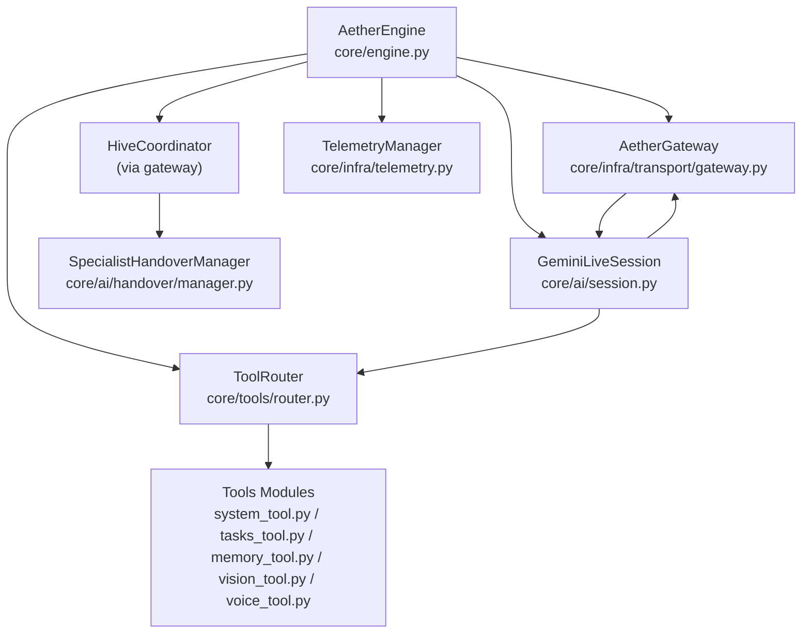

**Diagram sources**
- [engine.py](file://core/engine.py#L26-L70)
- [gateway.py](file://core/infra/transport/gateway.py#L69-L124)
- [session.py](file://core/ai/session.py#L43-L95)
- [router.py](file://core/tools/router.py#L120-L144)
- [system_tool.py](file://core/tools/system_tool.py#L198-L310)
- [tasks_tool.py](file://core/tools/tasks_tool.py#L216-L325)
- [memory_tool.py](file://core/tools/memory_tool.py#L246-L330)
- [vision_tool.py](file://core/tools/vision_tool.py#L58-L75)
- [voice_tool.py](file://core/tools/voice_tool.py#L288-L336)
- [manager.py](file://core/ai/handover/manager.py#L37-L52)
- [telemetry.py](file://core/infra/telemetry.py#L14-L35)

**Section sources**
- [engine.py](file://core/engine.py#L26-L123)
- [gateway.py](file://core/infra/transport/gateway.py#L69-L124)
- [session.py](file://core/ai/session.py#L43-L95)
- [router.py](file://core/tools/router.py#L120-L144)

## Core Components
- AetherEngine: Initializes managers, registers tools, and orchestrates core tasks with structured concurrency.
- AetherGateway: Owns the session lifecycle, manages audio queues, and broadcasts UI updates.
- GeminiLiveSession: Manages the Live session, builds session configuration with tool declarations, and executes function calls in parallel.
- ToolRouter: Central dispatcher that generates function declarations, validates parameters, enforces biometric middleware, and wraps results for multi-agent interoperability.
- Tools Modules: Provide handlers and declarations for system, task, memory, vision, and voice functions.
- SpecialistHandoverManager: Coordinates agent handovers with rich context preservation and telemetry.
- TelemetryManager: Records usage and performance metrics for analytics.

**Section sources**
- [engine.py](file://core/engine.py#L26-L123)
- [gateway.py](file://core/infra/transport/gateway.py#L69-L124)
- [session.py](file://core/ai/session.py#L43-L95)
- [router.py](file://core/tools/router.py#L120-L144)
- [system_tool.py](file://core/tools/system_tool.py#L198-L310)
- [tasks_tool.py](file://core/tools/tasks_tool.py#L216-L325)
- [memory_tool.py](file://core/tools/memory_tool.py#L246-L330)
- [vision_tool.py](file://core/tools/vision_tool.py#L58-L75)
- [voice_tool.py](file://core/tools/voice_tool.py#L288-L336)
- [manager.py](file://core/ai/handover/manager.py#L37-L52)
- [telemetry.py](file://core/infra/telemetry.py#L14-L35)

## Architecture Overview
The system uses structured concurrency to run independent subsystems (event bus, pulse, gateway, audio) concurrently. The GeminiLiveSession establishes a Live connection and runs send/receive loops in parallel. Function calls from Gemini are dispatched via ToolRouter and executed in parallel using asyncio.gather. Results are wrapped, broadcast to the UI, and optionally injected back into the multimodal stream.

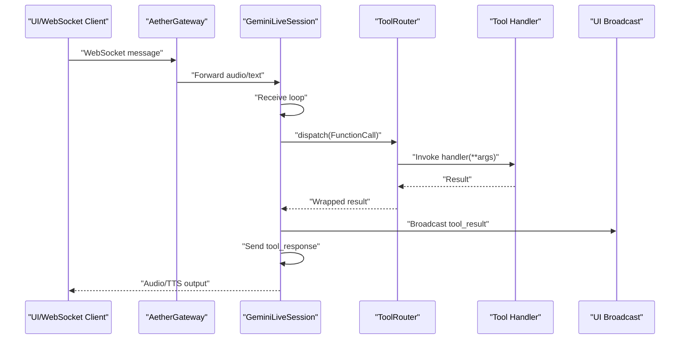

**Diagram sources**
- [session.py](file://core/ai/session.py#L493-L602)
- [router.py](file://core/tools/router.py#L234-L360)
- [gateway.py](file://core/infra/transport/gateway.py#L744-L776)

**Section sources**
- [session.py](file://core/ai/session.py#L174-L236)
- [router.py](file://core/tools/router.py#L234-L360)
- [gateway.py](file://core/infra/transport/gateway.py#L744-L776)

## Detailed Component Analysis

### Parallel Tool Call Execution with TaskGroup
GeminiLiveSession executes multiple function calls in parallel using asyncio.gather within a single turn. It:
- Broadcasts a “thinking” state to the UI.
- Creates dispatch tasks for each function call.
- Gathers results and wraps them into FunctionResponse objects.
- Broadcasts tool results to the UI.
- Optionally injects screenshots returned by tools into the multimodal stream.
- Tracks active agent handoffs and notifies the scheduler.

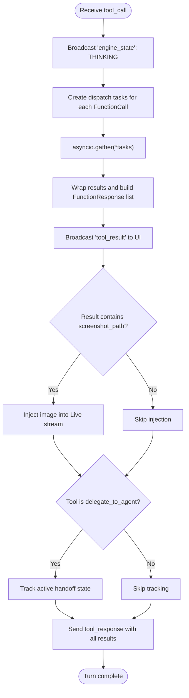

**Diagram sources**
- [session.py](file://core/ai/session.py#L493-L602)

**Section sources**
- [session.py](file://core/ai/session.py#L493-L602)

### Tool Declaration Parsing and Parameter Validation
ToolRouter generates FunctionDeclaration objects from tool definitions and supports:
- Declaring function names, descriptions, and JSON Schema parameters.
- Indexing tool metadata for semantic recovery.
- Enforcing biometric middleware for sensitive tools.
- Recording execution durations and calculating latency percentiles.

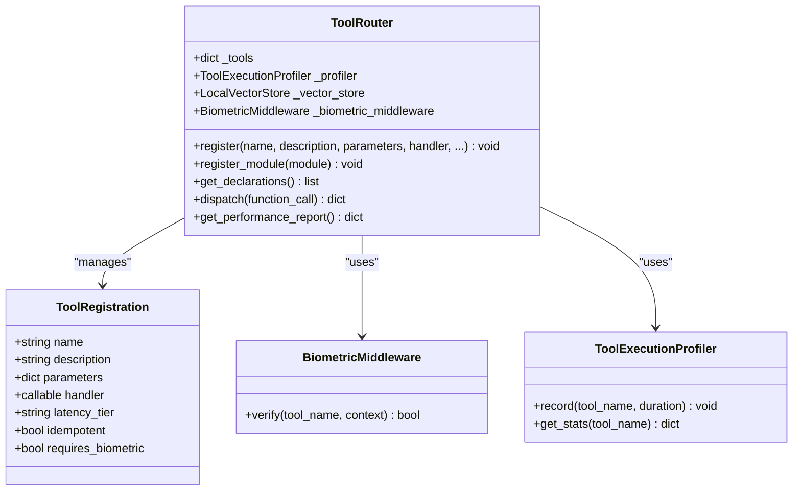

**Diagram sources**
- [router.py](file://core/tools/router.py#L33-L118)
- [router.py](file://core/tools/router.py#L120-L360)

**Section sources**
- [router.py](file://core/tools/router.py#L211-L232)
- [router.py](file://core/tools/router.py#L234-L360)

### Function Call Handling Pipeline
The pipeline includes:
- Function declaration generation for Gemini.
- Parameter validation and invocation of handlers (sync or async).
- Error handling for invalid arguments and runtime exceptions.
- Result wrapping with A2A metadata (status, latency tier, idempotency).
- Profiling and performance reporting.

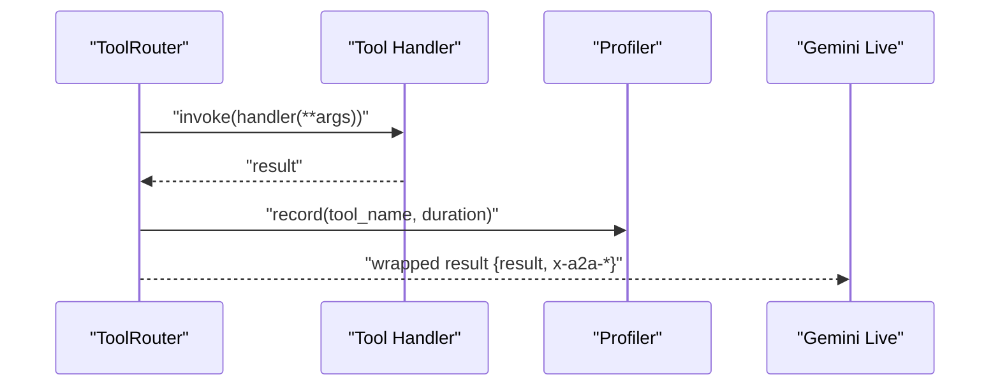

**Diagram sources**
- [router.py](file://core/tools/router.py#L310-L356)

**Section sources**
- [router.py](file://core/tools/router.py#L310-L356)

### Integration with ToolRouter for Dispatch and Monitoring
ToolRouter integrates with:
- Vector store for semantic recovery when a tool name does not match exactly.
- Biometric middleware for sensitive tools.
- Profiler for latency metrics.
- A2A metadata wrapping for interoperability.

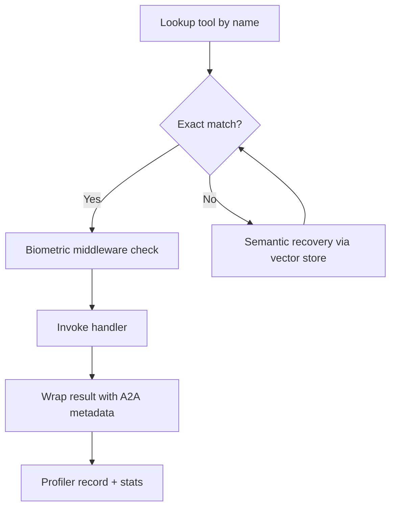

**Diagram sources**
- [router.py](file://core/tools/router.py#L244-L356)

**Section sources**
- [router.py](file://core/tools/router.py#L244-L356)

### Multimodal Vision Injection System
When a tool returns a screenshot path, the session injects the image into the multimodal stream:
- Validates the file exists and reads bytes.
- Sends the image as inline data to Gemini.
- Removes the temporary file after injection.

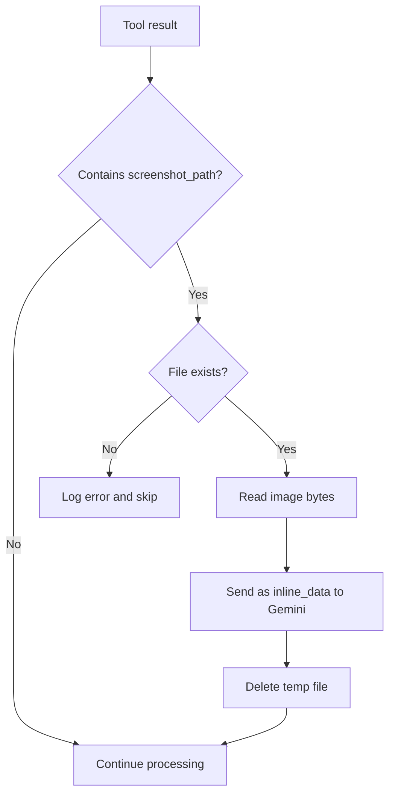

**Diagram sources**
- [session.py](file://core/ai/session.py#L554-L573)

**Section sources**
- [session.py](file://core/ai/session.py#L554-L573)

### Handoff State Tracking for Agent-to-Agent Transfers
The session tracks active handoffs initiated by tools named “delegate_to_agent.” It stores target agent, task description, and timestamps, enabling stateful coordination during agent handovers.

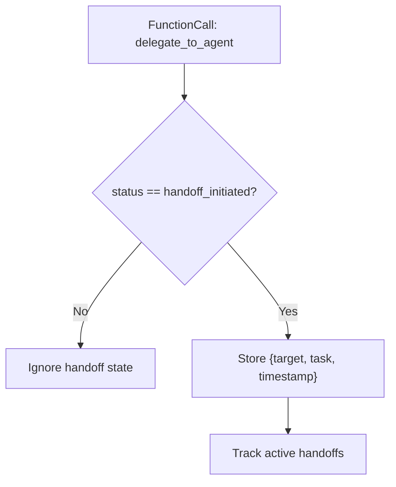

**Diagram sources**
- [session.py](file://core/ai/session.py#L578-L589)

**Section sources**
- [session.py](file://core/ai/session.py#L578-L589)

### Tool Result Broadcasting and Gateway Integration
After processing tool results, the session broadcasts “tool_result” events to the UI with:
- Tool name, result, status, and optional A2A status code.
The gateway broadcasts messages to all connected clients and manages session state transitions.

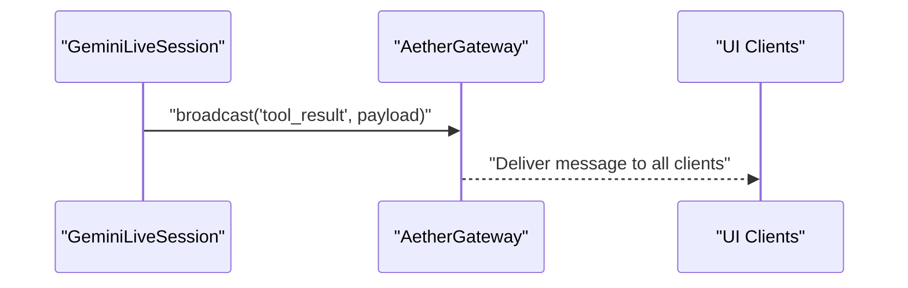

**Diagram sources**
- [session.py](file://core/ai/session.py#L535-L552)
- [gateway.py](file://core/infra/transport/gateway.py#L744-L776)

**Section sources**
- [session.py](file://core/ai/session.py#L535-L552)
- [gateway.py](file://core/infra/transport/gateway.py#L744-L776)

### Error Handling Mechanisms and Fallback Strategies
- Type errors during dispatch are caught and reported with a 400 status.
- General exceptions are caught and reported with a 500 status.
- Semantic recovery attempts to match unknown tool names to registered tools using vector embeddings.
- Biometric middleware blocks sensitive tool execution if verification fails.
- Output queue overflow is tracked and logged for downstream playback pressure.

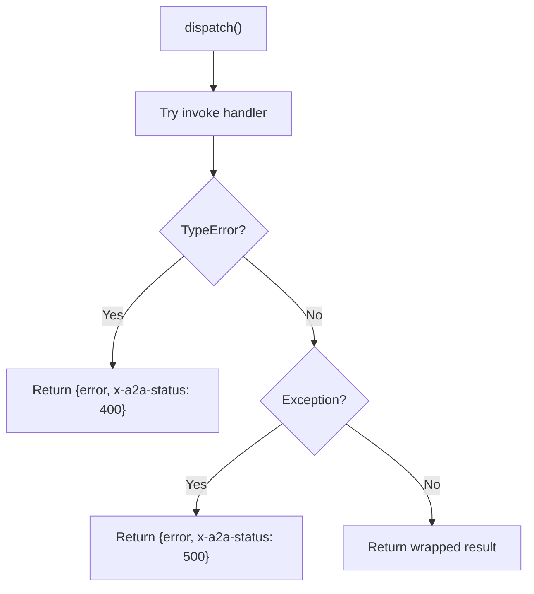

**Diagram sources**
- [router.py](file://core/tools/router.py#L344-L356)

**Section sources**
- [router.py](file://core/tools/router.py#L250-L282)
- [router.py](file://core/tools/router.py#L287-L302)
- [router.py](file://core/tools/router.py#L344-L356)

### Examples of Tool Registration, Function Call Patterns, and Result Processing
- Tool registration: Modules expose get_tools() returning a list of dictionaries with name, description, parameters, and handler. The engine registers these via ToolRouter.register_module.
- Function call pattern: Gemini emits FunctionCall objects; the session dispatches them in parallel and returns FunctionResponse objects in a single turn.
- Result processing: Results are broadcast to the UI and optionally injected as images; sensitive tools enforce biometric verification.

**Section sources**
- [system_tool.py](file://core/tools/system_tool.py#L198-L310)
- [tasks_tool.py](file://core/tools/tasks_tool.py#L216-L325)
- [memory_tool.py](file://core/tools/memory_tool.py#L246-L330)
- [vision_tool.py](file://core/tools/vision_tool.py#L58-L75)
- [voice_tool.py](file://core/tools/voice_tool.py#L288-L336)
- [session.py](file://core/ai/session.py#L493-L602)

### Analytics Collection for Tool Usage and Performance Monitoring
- Token usage is extracted from Live responses and recorded with cost estimation.
- Tool execution durations are profiled and aggregated for latency percentiles.
- Telemetry exports traces to Arize/Phoenix via OTLP.

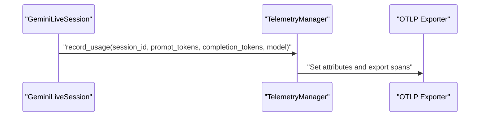

**Diagram sources**
- [session.py](file://core/ai/session.py#L479-L492)
- [telemetry.py](file://core/infra/telemetry.py#L77-L130)

**Section sources**
- [session.py](file://core/ai/session.py#L479-L492)
- [telemetry.py](file://core/infra/telemetry.py#L77-L130)

## Dependency Analysis
Key dependencies and relationships:
- AetherEngine depends on ToolRouter, AetherGateway, EventBus, AudioManager, InfraManager, PulseManager, and CognitiveScheduler.
- GeminiLiveSession depends on ToolRouter and AetherGateway; it constructs LiveConnectConfig with function declarations.
- ToolRouter depends on LocalVectorStore for semantic recovery and BiometricMiddleware for security.
- Gateway owns audio queues and manages session lifecycle and UI broadcasts.
- Tools modules depend on FirebaseConnector for persistence (when available) and return structured results.

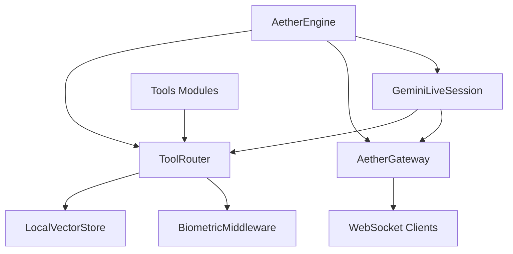

**Diagram sources**
- [engine.py](file://core/engine.py#L26-L70)
- [session.py](file://core/ai/session.py#L96-L154)
- [router.py](file://core/tools/router.py#L135-L144)

**Section sources**
- [engine.py](file://core/engine.py#L26-L123)
- [session.py](file://core/ai/session.py#L96-L154)
- [router.py](file://core/tools/router.py#L135-L144)

## Performance Considerations
- Parallel execution: Multiple function calls are executed concurrently using asyncio.gather, reducing total latency for multi-tool turns.
- Profiling: ToolExecutionProfiler records durations and computes percentiles to guide latency-aware routing.
- Queue management: Output queue overflow is monitored to detect downstream playback pressure.
- Pre-warming: Gateway speculatively pre-warms sessions to reduce handoff latency.

[No sources needed since this section provides general guidance]

## Troubleshooting Guide
Common issues and resolutions:
- Tool not found: The router attempts semantic recovery; if no close match is found, it returns available tools and a 404-like status.
- Biometric verification failure: Sensitive tools are blocked; ensure biometric verification passes or adjust middleware configuration.
- Argument errors: Invalid arguments lead to a 400 response; validate parameter schemas in tool definitions.
- Exceptions in handlers: Uncaught exceptions yield a 500 response; wrap handlers with proper error handling.
- Output queue drops: Frequent drops indicate playback pressure; tune audio queue sizes or reduce output rate.
- Handoff failures: Review handover context and telemetry; ensure target agent availability and negotiation acceptance.

**Section sources**
- [router.py](file://core/tools/router.py#L244-L282)
- [router.py](file://core/tools/router.py#L287-L302)
- [router.py](file://core/tools/router.py#L344-L356)
- [session.py](file://core/ai/session.py#L430-L455)
- [gateway.py](file://core/infra/transport/gateway.py#L251-L275)

## Conclusion
The tool execution system integrates Gemini Live’s function calling with a robust dispatcher, parallel execution, and comprehensive monitoring. ToolRouter centralizes declaration, validation, and dispatch, while GeminiLiveSession orchestrates multimodal interactions and UI integration. The system supports agent handoffs, vision injection, and detailed analytics, ensuring reliable and observable tool usage in real-time voice interactions.

[No sources needed since this section summarizes without analyzing specific files]

## Appendices
- Example tool definitions and handlers are provided in the tools modules, demonstrating standardized registration and parameter schemas.
- Agent handover manager enables deep handoff protocols with rich context preservation and telemetry.

**Section sources**
- [system_tool.py](file://core/tools/system_tool.py#L198-L310)
- [tasks_tool.py](file://core/tools/tasks_tool.py#L216-L325)
- [memory_tool.py](file://core/tools/memory_tool.py#L246-L330)
- [vision_tool.py](file://core/tools/vision_tool.py#L58-L75)
- [voice_tool.py](file://core/tools/voice_tool.py#L288-L336)
- [manager.py](file://core/ai/handover/manager.py#L207-L394)