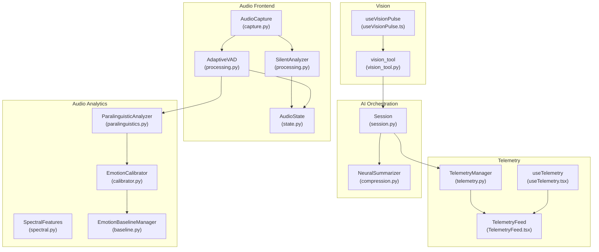
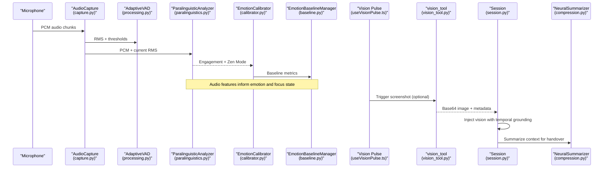
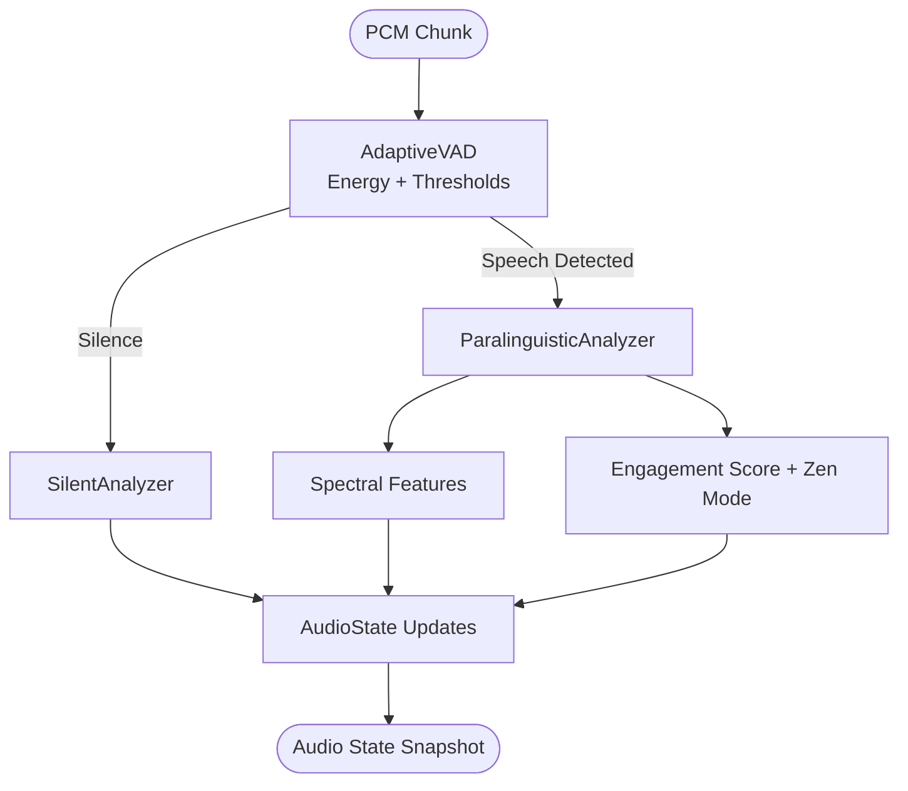
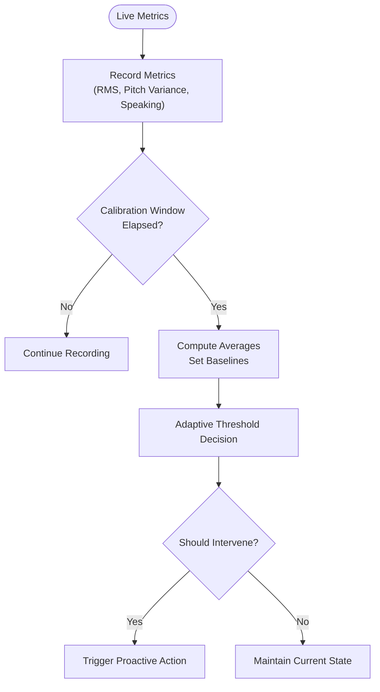
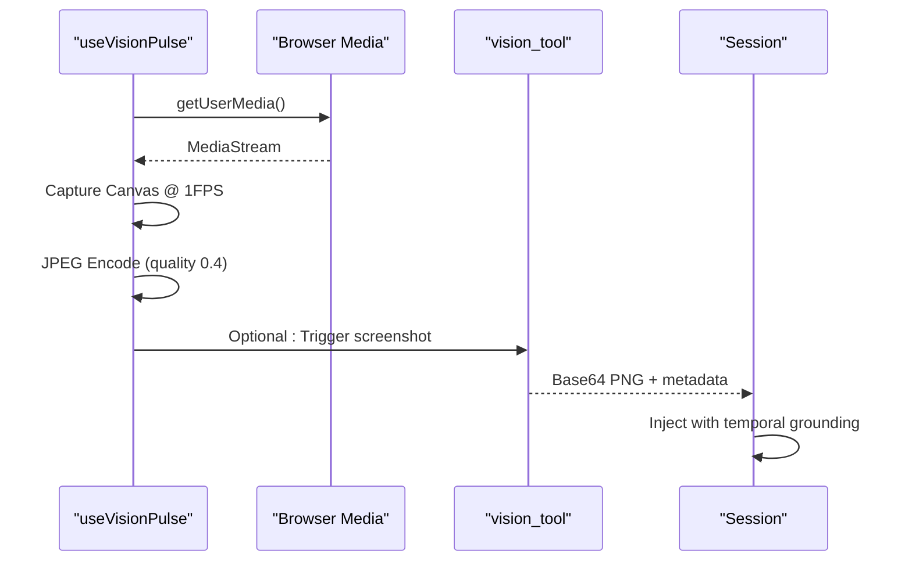
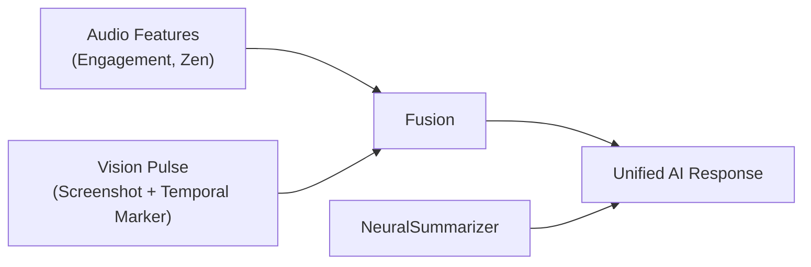
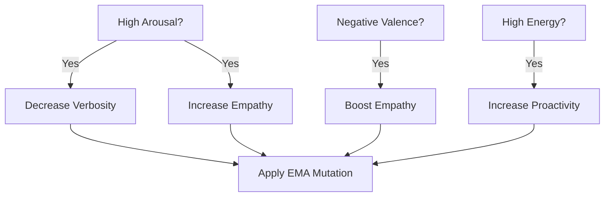
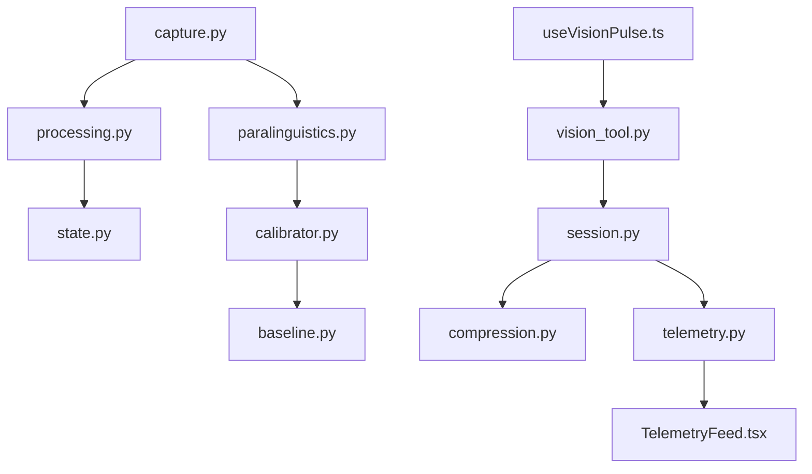

# Multimodal Processing Integration

<cite>
**Referenced Files in This Document**
- [paralinguistics.py](file://core/audio/paralinguistics.py)
- [processing.py](file://core/audio/processing.py)
- [capture.py](file://core/audio/capture.py)
- [state.py](file://core/audio/state.py)
- [spectral.py](file://core/audio/spectral.py)
- [baseline.py](file://core/emotion/baseline.py)
- [calibrator.py](file://core/emotion/calibrator.py)
- [compression.py](file://core/ai/compression.py)
- [session.py](file://core/ai/session.py)
- [vision_tool.py](file://core/tools/vision_tool.py)
- [useVisionPulse.ts](file://apps/portal/src/hooks/useVisionPulse.ts)
- [telemetry.py](file://core/infra/telemetry.py)
- [useTelemetry.tsx](file://apps/portal/src/hooks/useTelemetry.tsx)
- [TelemetryFeed.tsx](file://apps/portal/src/components/TelemetryFeed.tsx)
- [README.md](file://README.md)
</cite>

## Table of Contents
1. [Introduction](#introduction)
2. [Project Structure](#project-structure)
3. [Core Components](#core-components)
4. [Architecture Overview](#architecture-overview)
5. [Detailed Component Analysis](#detailed-component-analysis)
6. [Dependency Analysis](#dependency-analysis)
7. [Performance Considerations](#performance-considerations)
8. [Troubleshooting Guide](#troubleshooting-guide)
9. [Conclusion](#conclusion)
10. [Appendices](#appendices)

## Introduction
This document describes the Multimodal Processing Integration that combines audio, vision, and contextual data streams into unified AI responses. It covers:
- Compression and optimization for efficient processing
- Paralinguistic analysis for emotional and engagement cues
- Emotion detection and calibration with baselines and thresholds
- Visual processing pipeline integrating screen capture and context
- Fusion strategies and temporal grounding
- Affective dialog processing and empathy-aware responses
- Real-time performance optimization and telemetry

## Project Structure
The multimodal stack spans core audio processing, emotion management, vision capture, AI session orchestration, and telemetry. The diagram maps major modules participating in multimodal fusion.

**Diagram sources**
- [capture.py](file://core/audio/capture.py#L202-L214)
- [processing.py](file://core/audio/processing.py#L256-L323)
- [state.py](file://core/audio/state.py#L36-L129)
- [paralinguistics.py](file://core/audio/paralinguistics.py#L31-L214)
- [spectral.py](file://core/audio/spectral.py#L250-L334)
- [baseline.py](file://core/emotion/baseline.py#L9-L87)
- [calibrator.py](file://core/emotion/calibrator.py#L8-L65)
- [useVisionPulse.ts](file://apps/portal/src/hooks/useVisionPulse.ts#L1-L225)
- [vision_tool.py](file://core/tools/vision_tool.py#L19-L75)
- [session.py](file://core/ai/session.py#L297-L321)
- [compression.py](file://core/ai/compression.py#L24-L115)
- [telemetry.py](file://core/infra/telemetry.py#L14-L130)
- [useTelemetry.tsx](file://apps/portal/src/hooks/useTelemetry.tsx#L1-L53)
- [TelemetryFeed.tsx](file://apps/portal/src/components/TelemetryFeed.tsx#L1-L40)

**Section sources**
- [paralinguistics.py](file://core/audio/paralinguistics.py#L1-L214)
- [processing.py](file://core/audio/processing.py#L1-L508)
- [capture.py](file://core/audio/capture.py#L197-L214)
- [state.py](file://core/audio/state.py#L1-L129)
- [spectral.py](file://core/audio/spectral.py#L1-L501)
- [baseline.py](file://core/emotion/baseline.py#L1-L87)
- [calibrator.py](file://core/emotion/calibrator.py#L1-L65)
- [compression.py](file://core/ai/compression.py#L1-L115)
- [session.py](file://core/ai/session.py#L297-L321)
- [vision_tool.py](file://core/tools/vision_tool.py#L1-L75)
- [useVisionPulse.ts](file://apps/portal/src/hooks/useVisionPulse.ts#L1-L225)
- [telemetry.py](file://core/infra/telemetry.py#L1-L130)
- [useTelemetry.tsx](file://apps/portal/src/hooks/useTelemetry.tsx#L1-L53)
- [TelemetryFeed.tsx](file://apps/portal/src/components/TelemetryFeed.tsx#L1-L40)

## Core Components
- Audio capture and gating: Microphone capture with adaptive VAD, silence classification, and ring buffers for efficient windowed analysis.
- Paralinguistic analysis: Pitch, speech rate, RMS variance, spectral centroid, and engagement scoring; plus Zen Mode detection for deep focus.
- Emotion baseline and calibration: Dynamic acoustic baselines and adaptive thresholds for intervention decisions.
- Vision pipeline: Browser-based screen capture with JPEG compression and change detection; also native macOS capture for tools.
- AI session fusion: Periodic proactive vision pulses with temporal grounding; context summarization for efficient handovers.
- Telemetry: OpenTelemetry-backed tracing and usage recording; UI telemetry feed.

**Section sources**
- [processing.py](file://core/audio/processing.py#L107-L202)
- [processing.py](file://core/audio/processing.py#L256-L323)
- [processing.py](file://core/audio/processing.py#L331-L387)
- [paralinguistics.py](file://core/audio/paralinguistics.py#L31-L214)
- [baseline.py](file://core/emotion/baseline.py#L9-L87)
- [calibrator.py](file://core/emotion/calibrator.py#L8-L65)
- [useVisionPulse.ts](file://apps/portal/src/hooks/useVisionPulse.ts#L1-L225)
- [vision_tool.py](file://core/tools/vision_tool.py#L19-L75)
- [session.py](file://core/ai/session.py#L297-L321)
- [compression.py](file://core/ai/compression.py#L24-L115)
- [telemetry.py](file://core/infra/telemetry.py#L14-L130)

## Architecture Overview
The multimodal pipeline integrates real-time audio analytics with periodic visual context and AI orchestration. Audio features drive affective responses and proactive interventions, while vision pulses provide grounded, temporally annotated visual context.

**Diagram sources**
- [capture.py](file://core/audio/capture.py#L202-L214)
- [processing.py](file://core/audio/processing.py#L256-L323)
- [paralinguistics.py](file://core/audio/paralinguistics.py#L132-L214)
- [calibrator.py](file://core/emotion/calibrator.py#L51-L65)
- [baseline.py](file://core/emotion/baseline.py#L41-L87)
- [useVisionPulse.ts](file://apps/portal/src/hooks/useVisionPulse.ts#L1-L225)
- [vision_tool.py](file://core/tools/vision_tool.py#L19-L75)
- [session.py](file://core/ai/session.py#L297-L321)
- [compression.py](file://core/ai/compression.py#L41-L115)

## Detailed Component Analysis

### Audio Processing and Paralinguistic Analytics
- RingBuffer: Fixed-capacity circular buffer enabling O(1) writes and safe windowed reads for streaming analysis.
- AdaptiveVAD: Online noise statistics with dual thresholds (soft/hard) for robust voice activity detection.
- SilentAnalyzer: Classifies silence types (void, breathing, thinking) using RMS variance and zero-crossing rate.
- ParalinguisticAnalyzer: Computes pitch, speech rate, RMS variance, spectral centroid, engagement score, and Zen Mode flag from PCM windows.
- Spectral features: STFT, Bark bands, spectral centroid, flatness, rolloff, flux, and coherence for advanced audio insights.

**Diagram sources**
- [processing.py](file://core/audio/processing.py#L107-L202)
- [processing.py](file://core/audio/processing.py#L256-L323)
- [processing.py](file://core/audio/processing.py#L331-L387)
- [paralinguistics.py](file://core/audio/paralinguistics.py#L132-L214)
- [spectral.py](file://core/audio/spectral.py#L250-L334)
- [state.py](file://core/audio/state.py#L36-L129)

**Section sources**
- [processing.py](file://core/audio/processing.py#L107-L202)
- [processing.py](file://core/audio/processing.py#L256-L323)
- [processing.py](file://core/audio/processing.py#L331-L387)
- [paralinguistics.py](file://core/audio/paralinguistics.py#L31-L214)
- [spectral.py](file://core/audio/spectral.py#L250-L334)
- [state.py](file://core/audio/state.py#L36-L129)

### Emotion Detection and Calibration
- EmotionBaselineManager: Builds acoustic baselines during a calibration window (e.g., first 30s) to normalize metrics like RMS, pitch variance, and silence ratio.
- EmotionCalibrator: Dynamically adjusts intervention thresholds based on user feedback and acoustic baselines; applies stricter thresholds during calibration.

**Diagram sources**
- [baseline.py](file://core/emotion/baseline.py#L41-L87)
- [calibrator.py](file://core/emotion/calibrator.py#L26-L65)

**Section sources**
- [baseline.py](file://core/emotion/baseline.py#L9-L87)
- [calibrator.py](file://core/emotion/calibrator.py#L8-L65)

### Visual Processing Pipeline
- Browser-based screen capture: 1 FPS capture, JPEG compression (quality 0.4), scaling (0.5), and change-detection filtering to reduce payload.
- Native macOS capture: In-memory PNG capture via MSS, Base64 encoding for immediate injection into multimodal sessions.
- Proactive vision pulses: Periodic injection of screenshots with temporal grounding markers to align visual context with audio events.

**Diagram sources**
- [useVisionPulse.ts](file://apps/portal/src/hooks/useVisionPulse.ts#L1-L225)
- [vision_tool.py](file://core/tools/vision_tool.py#L19-L75)
- [session.py](file://core/ai/session.py#L297-L321)

**Section sources**
- [useVisionPulse.ts](file://apps/portal/src/hooks/useVisionPulse.ts#L1-L225)
- [vision_tool.py](file://core/tools/vision_tool.py#L19-L75)
- [session.py](file://core/ai/session.py#L297-L321)

### Multimodal Fusion and Temporal Grounding
- Fusion strategy: Audio features (engagement, Zen Mode) and visual context (screenshots) are combined in AI sessions. Vision pulses include temporal markers to ground visual events relative to audio.
- Neural summarization: Context compression reduces token usage for handovers and proactive grounding.

**Diagram sources**
- [session.py](file://core/ai/session.py#L297-L321)
- [compression.py](file://core/ai/compression.py#L41-L115)

**Section sources**
- [session.py](file://core/ai/session.py#L297-L321)
- [compression.py](file://core/ai/compression.py#L24-L115)

### Affective Dialog Processing
- Emotion-driven adaptation: Genetic optimizer mutates agent DNA traits (verbosity, empathy, proactivity) based on real-time paralinguistic arousal, valence, and energy.
- Proactive intervention: When thresholds are exceeded, the system proposes empathetic responses and integrates codebase context.

**Diagram sources**
- [core/ai/genetic.py](file://core/ai/genetic.py#L150-L182)
- [core/ai/agents/integrated.py](file://core/ai/agents/integrated.py#L39-L65)

**Section sources**
- [core/ai/genetic.py](file://core/ai/genetic.py#L150-L182)
- [core/ai/agents/integrated.py](file://core/ai/agents/integrated.py#L39-L65)

### Compression Techniques
- Audio: RingBuffer minimizes allocations; VAD and silence classification reduce unnecessary processing.
- Vision: JPEG compression (quality 0.4), scaling, and change detection reduce bandwidth and payload.
- Context: NeuralSummarizer compresses conversation history and working memory into compact semantic seeds.

**Section sources**
- [processing.py](file://core/audio/processing.py#L107-L202)
- [useVisionPulse.ts](file://apps/portal/src/hooks/useVisionPulse.ts#L1-L225)
- [compression.py](file://core/ai/compression.py#L24-L115)

### Telemetry and Monitoring
- Core telemetry: OpenTelemetry-backed tracing with batch processors; records token usage and cost estimates.
- UI telemetry: In-app log feed with timestamps and severity; supports debugging and monitoring system effectiveness.

**Section sources**
- [telemetry.py](file://core/infra/telemetry.py#L14-L130)
- [useTelemetry.tsx](file://apps/portal/src/hooks/useTelemetry.tsx#L1-L53)
- [TelemetryFeed.tsx](file://apps/portal/src/components/TelemetryFeed.tsx#L1-L40)

## Dependency Analysis
Key dependencies and coupling:
- Audio capture depends on VAD and paralinguistic analyzers; state aggregates metrics for downstream systems.
- Emotion calibrator depends on baseline manager; both feed proactive decision logic.
- Vision pipeline feeds into session orchestration; session coordinates with summarization.
- Telemetry integrates across components to monitor performance and cost.

**Diagram sources**
- [capture.py](file://core/audio/capture.py#L202-L214)
- [processing.py](file://core/audio/processing.py#L256-L323)
- [state.py](file://core/audio/state.py#L36-L129)
- [paralinguistics.py](file://core/audio/paralinguistics.py#L31-L214)
- [calibrator.py](file://core/emotion/calibrator.py#L8-L65)
- [baseline.py](file://core/emotion/baseline.py#L9-L87)
- [useVisionPulse.ts](file://apps/portal/src/hooks/useVisionPulse.ts#L1-L225)
- [vision_tool.py](file://core/tools/vision_tool.py#L19-L75)
- [session.py](file://core/ai/session.py#L297-L321)
- [compression.py](file://core/ai/compression.py#L24-L115)
- [telemetry.py](file://core/infra/telemetry.py#L14-L130)
- [TelemetryFeed.tsx](file://apps/portal/src/components/TelemetryFeed.tsx#L1-L40)

**Section sources**
- [capture.py](file://core/audio/capture.py#L202-L214)
- [processing.py](file://core/audio/processing.py#L256-L323)
- [state.py](file://core/audio/state.py#L36-L129)
- [paralinguistics.py](file://core/audio/paralinguistics.py#L31-L214)
- [calibrator.py](file://core/emotion/calibrator.py#L8-L65)
- [baseline.py](file://core/emotion/baseline.py#L9-L87)
- [useVisionPulse.ts](file://apps/portal/src/hooks/useVisionPulse.ts#L1-L225)
- [vision_tool.py](file://core/tools/vision_tool.py#L19-L75)
- [session.py](file://core/ai/session.py#L297-L321)
- [compression.py](file://core/ai/compression.py#L24-L115)
- [telemetry.py](file://core/infra/telemetry.py#L14-L130)
- [TelemetryFeed.tsx](file://apps/portal/src/components/TelemetryFeed.tsx#L1-L40)

## Performance Considerations
- Sub-5ms audio analysis: ParalinguisticAnalyzer targets minimal latency for zero-friction responsiveness.
- Rust-first DSP: When available, aether-cortex accelerates zero-crossing, VAD, and denoise operations; NumPy fallbacks ensure portability.
- Efficient buffering: RingBuffer avoids reallocation and supports fast windowed reads.
- Vision optimization: 1 FPS capture, JPEG compression (quality 0.4), scaling, and change detection reduce payload and CPU.
- Adaptive thresholds: Soft/hard thresholds adapt to ambient noise, reducing false triggers and unnecessary processing.
- Context compression: NeuralSummarizer reduces tokens for long sessions and handovers.

[No sources needed since this section provides general guidance]

## Troubleshooting Guide
- Noisy VAD triggers: Verify AdaptiveVAD thresholds and ensure sufficient history; confirm window size and sample rate alignment.
- Zen Mode misclassification: Adjust transient threshold and RMS ranges; validate frame durations and history sizes.
- Vision pulse not sent: Confirm proactive timer and temporal grounding injection; check Base64 encoding and MIME type.
- Telemetry not exported: Ensure environment variables for Arize/Phoenix; verify batch processor initialization.
- Emotion thresholds too strict/lenient: Review baseline calibration and calibrator multipliers; validate user feedback loops.

**Section sources**
- [processing.py](file://core/audio/processing.py#L256-L323)
- [paralinguistics.py](file://core/audio/paralinguistics.py#L31-L214)
- [session.py](file://core/ai/session.py#L297-L321)
- [telemetry.py](file://core/infra/telemetry.py#L35-L76)
- [calibrator.py](file://core/emotion/calibrator.py#L26-L65)

## Conclusion
The Multimodal Processing Integration achieves real-time responsiveness by combining efficient audio analytics (paralinguistics, VAD, silence classification) with periodic, temporally grounded visual context and adaptive emotion calibration. Compression and telemetry ensure scalability and observability, while affective dialog processing enables empathetic, context-aware responses.

[No sources needed since this section summarizes without analyzing specific files]

## Appendices

### Example Workflows

- Multimodal data processing
  - Capture PCM chunks, apply VAD, compute paralinguistic features, and update AudioState.
  - Periodically inject vision pulses with temporal markers for grounding.
  - Summarize context for efficient handovers.

  **Section sources**
  - [capture.py](file://core/audio/capture.py#L202-L214)
  - [processing.py](file://core/audio/processing.py#L256-L323)
  - [paralinguistics.py](file://core/audio/paralinguistics.py#L132-L214)
  - [session.py](file://core/ai/session.py#L297-L321)
  - [compression.py](file://core/ai/compression.py#L41-L115)

- Emotion detection workflow
  - Record acoustic metrics during calibration window; finalize baselines.
  - Compute engagement and Zen Mode; derive thresholds; decide intervention.

  **Section sources**
  - [baseline.py](file://core/emotion/baseline.py#L41-L87)
  - [paralinguistics.py](file://core/audio/paralinguistics.py#L132-L214)
  - [calibrator.py](file://core/emotion/calibrator.py#L51-L65)

- Visual context integration
  - Browser capture at 1 FPS with JPEG compression and change detection.
  - Native macOS capture for instant tool use; inject Base64 image into session with temporal grounding.

  **Section sources**
  - [useVisionPulse.ts](file://apps/portal/src/hooks/useVisionPulse.ts#L1-L225)
  - [vision_tool.py](file://core/tools/vision_tool.py#L19-L75)
  - [session.py](file://core/ai/session.py#L297-L321)

- Affective dialog processing
  - Mutate agent DNA traits (verbosity, empathy, proactivity) based on arousal, valence, and energy.
  - Generate empathetic messages and integrate codebase context proactively.

  **Section sources**
  - [core/ai/genetic.py](file://core/ai/genetic.py#L150-L182)
  - [core/ai/agents/integrated.py](file://core/ai/agents/integrated.py#L39-L65)

- Performance optimization checklist
  - Prefer Rust backend when available; validate aether-cortex resolution.
  - Tune VAD window size and thresholds; validate history lengths.
  - Optimize vision capture parameters (FPS, quality, scale).
  - Use NeuralSummarizer for long sessions and frequent handovers.

  **Section sources**
  - [processing.py](file://core/audio/processing.py#L40-L95)
  - [useVisionPulse.ts](file://apps/portal/src/hooks/useVisionPulse.ts#L18-L29)
  - [compression.py](file://core/ai/compression.py#L108-L115)

- Telemetry collection
  - Initialize TelemetryManager; export spans via OTLP; record usage and cost.
  - Monitor logs via UI telemetry feed for debugging.

  **Section sources**
  - [telemetry.py](file://core/infra/telemetry.py#L35-L112)
  - [useTelemetry.tsx](file://apps/portal/src/hooks/useTelemetry.tsx#L24-L45)
  - [TelemetryFeed.tsx](file://apps/portal/src/components/TelemetryFeed.tsx#L13-L40)