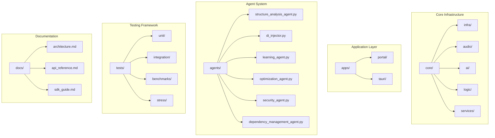
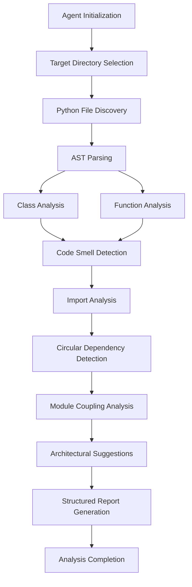
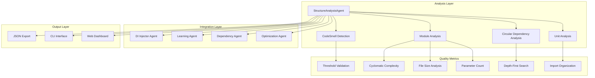
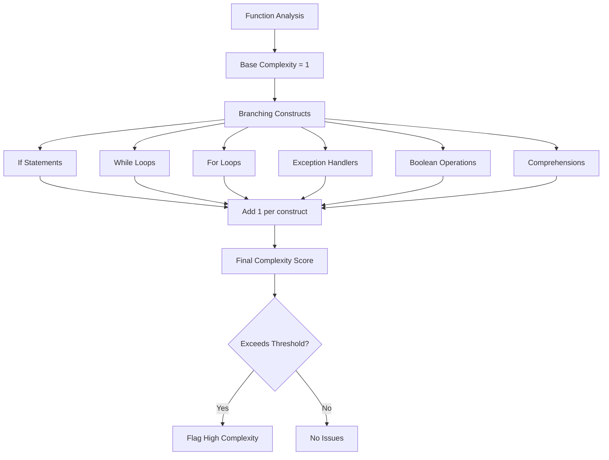
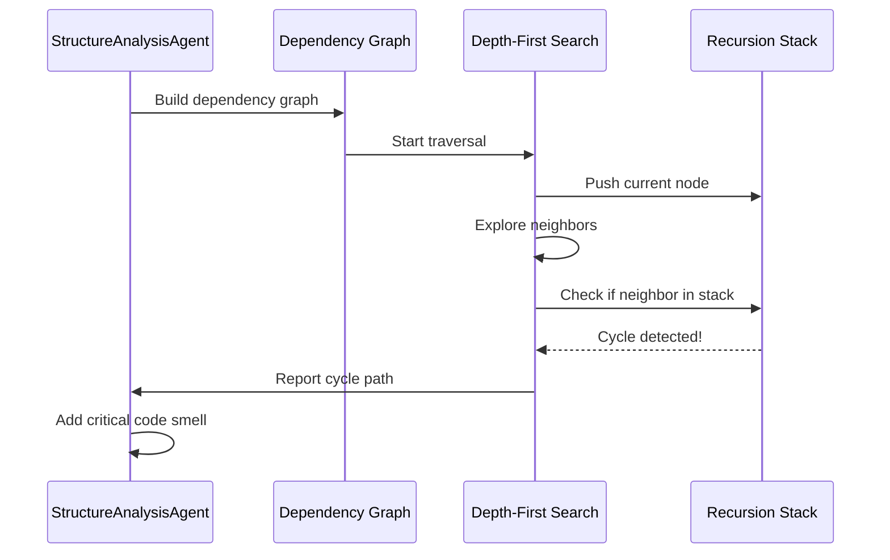
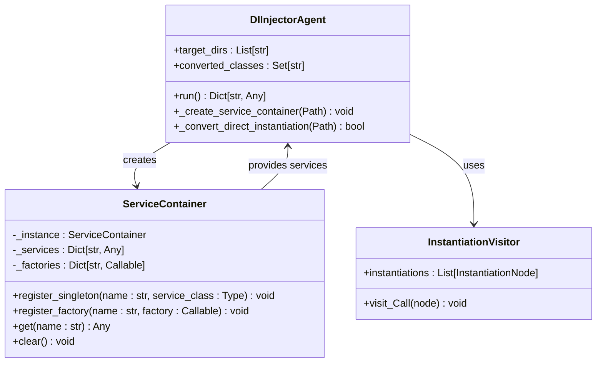
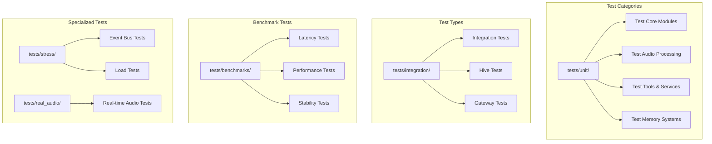

# Structure Analysis Agent

<cite>
**Referenced Files in This Document**
- [structure_analysis_agent.py](file://agents/structure_analysis_agent.py)
- [di_injector.py](file://agents/di_injector.py)
- [service_container.py](file://core/infra/service_container.py)
- [README.md](file://README.md)
- [test_core.py](file://tests/unit/test_core.py)
- [conftest.py](file://conftest.py)
</cite>

## Table of Contents
1. [Introduction](#introduction)
2. [Project Structure](#project-structure)
3. [Core Components](#core-components)
4. [Architecture Overview](#architecture-overview)
5. [Detailed Component Analysis](#detailed-component-analysis)
6. [Dependency Analysis](#dependency-analysis)
7. [Performance Considerations](#performance-considerations)
8. [Troubleshooting Guide](#troubleshooting-guide)
9. [Conclusion](#conclusion)

## Introduction

The Structure Analysis Agent is a sophisticated code analysis tool designed specifically for the Aether Voice OS monorepo. This agent performs comprehensive structural analysis of Python codebases, identifying architectural issues, code smells, and proposing targeted improvements for better maintainability and performance.

Aether Voice OS represents a revolutionary voice-first AI operating system that transforms speech into real-time actions using advanced audio processing and Gemini Live technology. The Structure Analysis Agent plays a crucial role in maintaining code quality and architectural integrity across this complex distributed system.

## Project Structure

The Aether Voice OS project follows a well-organized monorepo structure with clear separation of concerns:



**Diagram sources**
- [README.md](file://README.md#L244-L322)
- [structure_analysis_agent.py](file://agents/structure_analysis_agent.py#L56-L63)

**Section sources**
- [README.md](file://README.md#L244-L322)

## Core Components

The Structure Analysis Agent consists of several interconnected components that work together to provide comprehensive code analysis:

### Primary Analysis Engine

The main analysis engine operates through a systematic approach that examines Python files using Abstract Syntax Tree (AST) parsing and applies various quality metrics:



**Diagram sources**
- [structure_analysis_agent.py](file://agents/structure_analysis_agent.py#L73-L123)

### Data Structures and Models

The agent employs several specialized data structures to organize and present analysis results:

**CodeSmell Class**: Represents detected architectural issues with severity levels and remediation suggestions
**ModuleInfo Class**: Contains metadata about individual Python modules including imports, classes, and functions
**StructureReport Class**: Aggregates all analysis results into a comprehensive report structure

**Section sources**
- [structure_analysis_agent.py](file://agents/structure_analysis_agent.py#L18-L54)

## Architecture Overview

The Structure Analysis Agent integrates seamlessly with the broader Aether Voice OS ecosystem through a well-defined architecture:



**Diagram sources**
- [structure_analysis_agent.py](file://agents/structure_analysis_agent.py#L56-L123)
- [di_injector.py](file://agents/di_injector.py#L15-L56)

The agent operates asynchronously to maximize performance while analyzing large codebases efficiently. It targets specific directories within the monorepo structure, focusing on core functionality, applications, and testing infrastructure.

**Section sources**
- [structure_analysis_agent.py](file://agents/structure_analysis_agent.py#L56-L123)

## Detailed Component Analysis

### StructureAnalysisAgent Implementation

The primary analysis engine implements a comprehensive code quality assessment system:

#### Code Smell Detection System

The agent identifies multiple categories of code smells with appropriate severity levels:

| Smell Category | Severity Level | Detection Method | Typical Indicators |
|---------------|----------------|------------------|-------------------|
| God Class | Warning | Method count analysis | More than 15 methods in a single class |
| Long Function | Warning | Line count analysis | Functions exceeding 50 lines |
| Too Many Parameters | Warning | Parameter count analysis | More than 5 parameters |
| High Complexity | Warning | Cyclomatic complexity | Complexity score > 10 |
| Large File | Warning | File size analysis | More than 500 lines |
| Star Import | Warning | Import analysis | Use of wildcard imports |
| Deep Inheritance | Warning | Class hierarchy analysis | More than 3 base classes |
| Circular Dependency | Critical | Graph traversal | Cycle detection in module graph |

#### Cyclomatic Complexity Calculation

The agent calculates cyclomatic complexity using a comprehensive approach that considers multiple branching constructs:



**Diagram sources**
- [structure_analysis_agent.py](file://agents/structure_analysis_agent.py#L272-L286)

#### Circular Dependency Detection

The agent implements a robust circular dependency detection system using depth-first search with recursion stack tracking:



**Diagram sources**
- [structure_analysis_agent.py](file://agents/structure_analysis_agent.py#L315-L359)

**Section sources**
- [structure_analysis_agent.py](file://agents/structure_analysis_agent.py#L197-L270)
- [structure_analysis_agent.py](file://agents/structure_analysis_agent.py#L272-L286)
- [structure_analysis_agent.py](file://agents/structure_analysis_agent.py#L315-L359)

### DI Injector Agent Integration

The Structure Analysis Agent works in conjunction with the DI Injector Agent to provide comprehensive dependency management solutions:



**Diagram sources**
- [di_injector.py](file://agents/di_injector.py#L15-L56)
- [service_container.py](file://core/infra/service_container.py#L9-L46)

**Section sources**
- [di_injector.py](file://agents/di_injector.py#L15-L56)
- [service_container.py](file://core/infra/service_container.py#L9-L46)

### Testing Framework Integration

The Structure Analysis Agent integrates with the comprehensive testing framework used throughout the Aether Voice OS project:



**Diagram sources**
- [test_core.py](file://tests/unit/test_core.py#L1-L503)
- [conftest.py](file://conftest.py#L1-L9)

**Section sources**
- [test_core.py](file://tests/unit/test_core.py#L1-L503)
- [conftest.py](file://conftest.py#L1-L9)

## Dependency Analysis

The Structure Analysis Agent maintains minimal external dependencies while providing comprehensive analysis capabilities:

```mermaid
graph TD
subgraph "Internal Dependencies"
SA[StructureAnalysisAgent] --> AST[ast module]
SA --> PATH[Pathlib]
SA --> COLLECTIONS[Collections]
SA --> DATACLASS[dataclasses]
SA --> DEFAULTDICT[defaultdict]
end
subgraph "External Dependencies"
SA --> LOGGING[logging]
SA --> TYPEHINTING[typing]
SA --> DATETIME[datetime]
SA --> JSON[json]
end
subgraph "Optional Dependencies"
SA --> GIT[git (for learning agent)]
SA --> SUBPROCESS[subprocess]
SA --> NUMPY[numpy (for audio tests)]
SA --> PYTEST[pytest (for testing)]
end
```

**Diagram sources**
- [structure_analysis_agent.py](file://agents/structure_analysis_agent.py#L7-L13)
- [di_injector.py](file://agents/di_injector.py#L6-L10)

### Dependency Management Strategies

The agent implements several strategies for managing and analyzing dependencies:

1. **Target Directory Scanning**: Focuses analysis on specific project areas (core, apps, tests, skills)
2. **AST-based Import Analysis**: Parses Python files to identify actual dependencies
3. **Circular Dependency Detection**: Uses graph theory algorithms to identify problematic cycles
4. **Coupling Analysis**: Measures module relationships using afferent and efferent coupling metrics

**Section sources**
- [structure_analysis_agent.py](file://agents/structure_analysis_agent.py#L125-L132)
- [structure_analysis_agent.py](file://agents/structure_analysis_agent.py#L315-L359)

## Performance Considerations

The Structure Analysis Agent is designed with performance optimization in mind:

### Asynchronous Processing

The agent utilizes asynchronous programming patterns to maximize efficiency when analyzing large codebases:

- **Parallel File Processing**: Multiple Python files can be analyzed concurrently
- **Non-blocking Operations**: File I/O and AST parsing are handled asynchronously
- **Memory Efficiency**: Results are processed incrementally to minimize memory footprint

### Algorithmic Optimizations

Several algorithmic improvements enhance performance:

- **Early Termination**: Analysis stops when critical thresholds are exceeded
- **Lazy Evaluation**: Complex calculations are deferred until necessary
- **Efficient Data Structures**: Uses sets and dictionaries for fast lookups

### Scalability Features

The agent scales effectively with project size:

- **Incremental Analysis**: Can analyze subsets of files for faster iteration
- **Caching Mechanisms**: Results can be cached for repeated analysis
- **Configurable Thresholds**: Allows tuning for different project sizes

## Troubleshooting Guide

Common issues and their solutions when working with the Structure Analysis Agent:

### Analysis Failures

**Issue**: Syntax errors in target files cause analysis crashes
**Solution**: The agent handles syntax errors gracefully and continues analysis of remaining files

**Issue**: Missing Python dependencies
**Solution**: Ensure all standard library modules are available; optional dependencies are handled gracefully

### Performance Issues

**Issue**: Slow analysis on large projects
**Solution**: Use target directory filtering to limit scope; consider incremental analysis runs

**Issue**: Memory usage spikes during analysis
**Solution**: Monitor memory usage; consider breaking analysis into smaller batches

### Integration Problems

**Issue**: Circular dependency detection false positives
**Solution**: Review module structure; consider refactoring to reduce tight coupling

**Issue**: Import analysis misses dependencies
**Solution**: Check for dynamic imports; ensure all imports are static where possible

**Section sources**
- [structure_analysis_agent.py](file://agents/structure_analysis_agent.py#L118-L122)
- [structure_analysis_agent.py](file://agents/structure_analysis_agent.py#L173-L183)

## Conclusion

The Structure Analysis Agent represents a sophisticated solution for maintaining code quality and architectural integrity in the Aether Voice OS project. Through comprehensive analysis of code structure, detection of architectural issues, and provision of targeted improvement suggestions, the agent serves as a crucial tool for the continued evolution of this innovative voice-first AI operating system.

The agent's integration with the broader Aether ecosystem, including dependency management, learning systems, and testing frameworks, demonstrates its role as a central component in the project's quality assurance strategy. Its asynchronous design and performance optimizations ensure that code analysis remains practical even as the project continues to grow and evolve.

The comprehensive reporting capabilities and structured output format make the agent valuable not just for automated analysis, but also for human review and decision-making in the development process. This makes it an essential tool for maintaining the high standards required for a production-grade AI operating system.