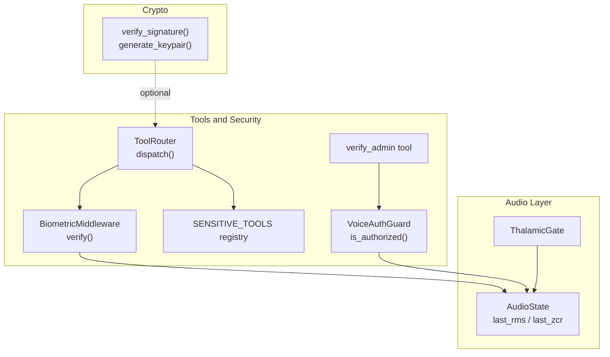
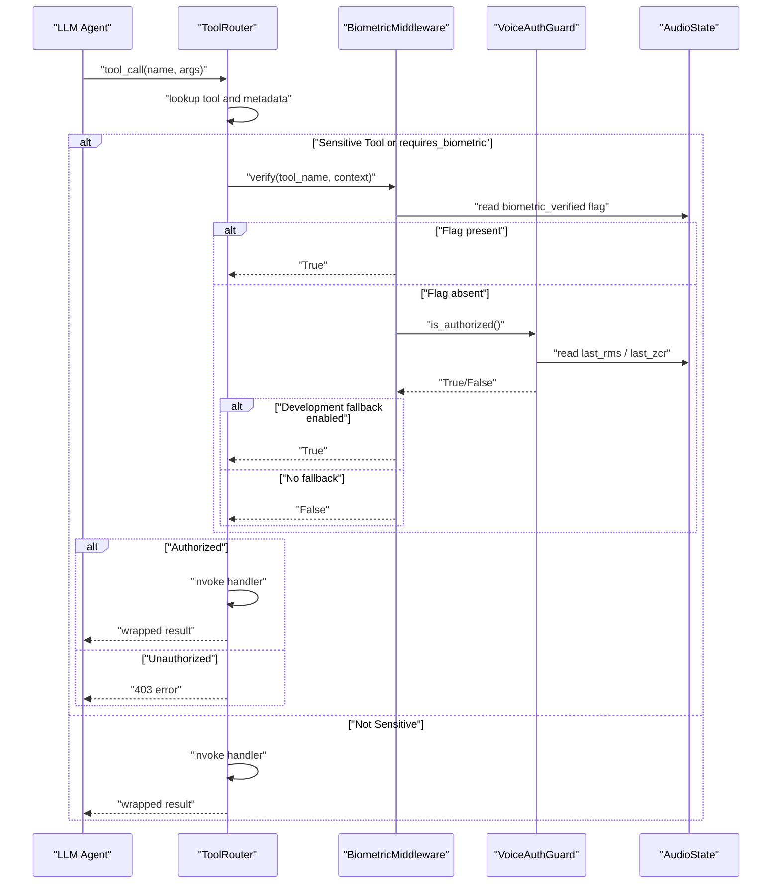
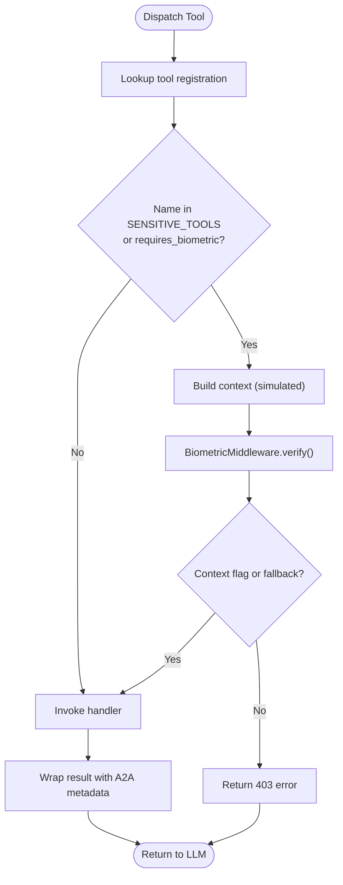
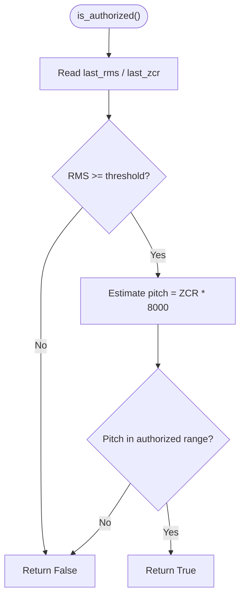
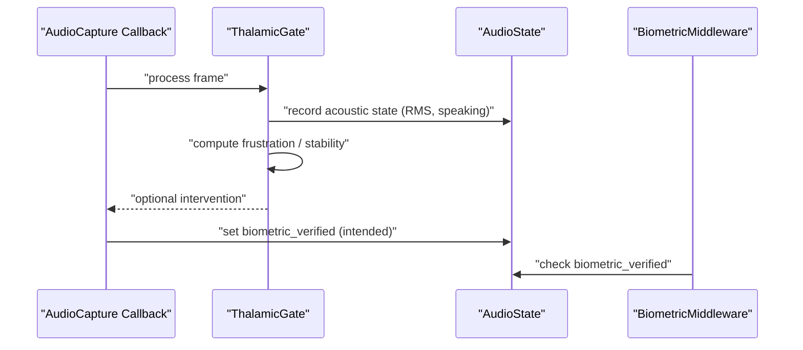
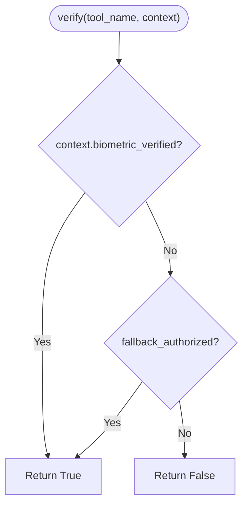
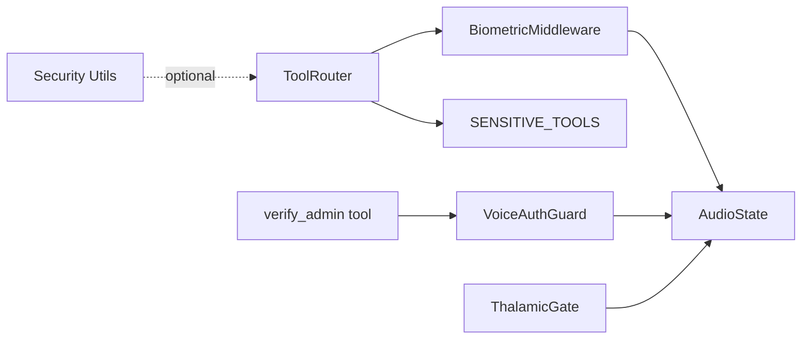

# Biometric Middleware and Security

<cite>
**Referenced Files in This Document**
- [router.py](file://core/tools/router.py)
- [voice_auth.py](file://core/tools/voice_auth.py)
- [thalamic.py](file://core/ai/thalamic.py)
- [state.py](file://core/audio/state.py)
- [security.py](file://core/utils/security.py)
- [test_cybernetic_core.py](file://tests/unit/test_cybernetic_core.py)
</cite>

## Table of Contents
1. [Introduction](#introduction)
2. [Project Structure](#project-structure)
3. [Core Components](#core-components)
4. [Architecture Overview](#architecture-overview)
5. [Detailed Component Analysis](#detailed-component-analysis)
6. [Dependency Analysis](#dependency-analysis)
7. [Performance Considerations](#performance-considerations)
8. [Troubleshooting Guide](#troubleshooting-guide)
9. [Conclusion](#conclusion)
10. [Appendices](#appendices)

## Introduction
This document describes the biometric middleware and security framework used to protect sensitive operations in the system. It focuses on:
- The BiometricMiddleware class and its Soul-Lock verification workflow
- The SENSITIVE_TOOLS registry and enforcement for critical operations
- Voice-print stability analysis and integration with the Thalamic Gate audio capture layer
- Authorization flow, fallback handling in development mode, and error handling
- Secure tool registration patterns and examples of biometric-protected operations
- Security best practices and threat mitigation strategies

## Project Structure
The security and biometric middleware spans several modules:
- Tool router and middleware for enforcing biometric locks
- Voice authentication guard and verification tool
- Thalamic Gate audio capture and state propagation
- Shared audio state used by guards and middleware
- Cryptographic utilities for signature verification

**Diagram sources**
- [router.py](file://core/tools/router.py#L46-L84)
- [router.py](file://core/tools/router.py#L120-L360)
- [voice_auth.py](file://core/tools/voice_auth.py#L19-L81)
- [thalamic.py](file://core/ai/thalamic.py#L11-L122)
- [state.py](file://core/audio/state.py#L36-L129)
- [security.py](file://core/utils/security.py#L18-L71)

**Section sources**
- [router.py](file://core/tools/router.py#L1-L360)
- [voice_auth.py](file://core/tools/voice_auth.py#L1-L82)
- [thalamic.py](file://core/ai/thalamic.py#L1-L122)
- [state.py](file://core/audio/state.py#L1-L129)
- [security.py](file://core/utils/security.py#L1-L71)

## Core Components
- BiometricMiddleware: Enforces biometric verification for sensitive tools and supports a development-mode fallback.
- ToolRouter: Central dispatcher that integrates BiometricMiddleware and routes tool calls to handlers.
- SENSITIVE_TOOLS: A registry of tool names requiring biometric verification.
- VoiceAuthGuard: Provides voice-print-based authorization using audio_state features.
- ThalamicGate: Integrates with audio capture to maintain acoustic state and influence biometric context.
- AudioState: Thread-safe singleton exposing last_rms and last_zcr used by guards and middleware.
- Security utilities: Ed25519 signature verification and keypair generation for cryptographic operations.

**Section sources**
- [router.py](file://core/tools/router.py#L46-L139)
- [router.py](file://core/tools/router.py#L120-L360)
- [voice_auth.py](file://core/tools/voice_auth.py#L19-L81)
- [thalamic.py](file://core/ai/thalamic.py#L11-L122)
- [state.py](file://core/audio/state.py#L36-L129)
- [security.py](file://core/utils/security.py#L18-L71)

## Architecture Overview
The system enforces biometric protection around sensitive tools by checking a biometric context flag set by the audio capture layer. The Thalamic Gate monitors audio state and can influence whether a biometric lock is considered satisfied. The ToolRouter delegates sensitive tool calls through BiometricMiddleware, which validates the context and falls back to an authorized state in development mode.

**Diagram sources**
- [router.py](file://core/tools/router.py#L234-L301)
- [router.py](file://core/tools/router.py#L55-L84)
- [voice_auth.py](file://core/tools/voice_auth.py#L25-L51)
- [state.py](file://core/audio/state.py#L36-L74)

## Detailed Component Analysis

### BiometricMiddleware and ToolRouter Integration
- BiometricMiddleware.verify(tool_name, context) checks:
  - Presence of a biometric context flag (e.g., biometric_verified)
  - Development-mode fallback when enabled
  - Returns False if neither condition is met
- ToolRouter.dispatch() applies middleware for tools in SENSITIVE_TOOLS or marked requires_biometric. It simulates context injection for demonstration but expects a real biometric flag to be set by the audio layer in production.

**Diagram sources**
- [router.py](file://core/tools/router.py#L234-L301)
- [router.py](file://core/tools/router.py#L46-L84)

**Section sources**
- [router.py](file://core/tools/router.py#L46-L84)
- [router.py](file://core/tools/router.py#L120-L360)

### SENSITIVE_TOOLS Registry and Enforcement
- SENSITIVE_TOOLS enumerates critical operations protected by biometric verification:
  - deploy_package
  - write_memory
  - execute_system_command
  - delete_task
  - update_firebase_config
- Enforcement occurs in ToolRouter.dispatch() when either the tool’s name is in SENSITIVE_TOOLS or the registration marks requires_biometric=True.

**Section sources**
- [router.py](file://core/tools/router.py#L126-L133)
- [router.py](file://core/tools/router.py#L287-L301)

### VoiceAuthGuard and Voice-Print Stability Analysis
- VoiceAuthGuard.is_authorized() evaluates:
  - Presence threshold using last_rms
  - Fundamental frequency estimation via last_zcr and a simple heuristic
  - Comparison against an authorized pitch range
- This provides a lightweight voice-print stability check used by middleware and tools.

**Diagram sources**
- [voice_auth.py](file://core/tools/voice_auth.py#L25-L51)
- [state.py](file://core/audio/state.py#L36-L74)

**Section sources**
- [voice_auth.py](file://core/tools/voice_auth.py#L19-L51)
- [test_cybernetic_core.py](file://tests/unit/test_cybernetic_core.py#L41-L52)

### Thalamic Gate Integration and Biometric Flag Setting
- ThalamicGate monitors audio state and emotional indices, influencing proactive interventions.
- While the current ToolRouter simulation injects a biometric context flag, the intended integration pattern is that the audio capture layer sets a biometric_verified flag in the session context after validating voice-print stability. This flag is then checked by BiometricMiddleware.verify().

**Diagram sources**
- [thalamic.py](file://core/ai/thalamic.py#L41-L98)
- [state.py](file://core/audio/state.py#L36-L129)
- [router.py](file://core/tools/router.py#L287-L292)

**Section sources**
- [thalamic.py](file://core/ai/thalamic.py#L11-L122)
- [state.py](file://core/audio/state.py#L36-L129)
- [router.py](file://core/tools/router.py#L287-L292)

### Security Utilities: Signature Verification and Key Generation
- verify_signature(): Validates Ed25519 signatures using PyNaCl, returning True on success and False on failure.
- generate_keypair(): Produces a new Ed25519 keypair for a new Soul.

These utilities support cryptographic operations that can complement biometric verification for higher-security contexts.

**Section sources**
- [security.py](file://core/utils/security.py#L18-L71)

### Authorization Flow and Fallback Handling
- If the biometric context flag is present, authorization succeeds immediately.
- If absent, VoiceAuthGuard.is_authorized() is consulted.
- In development mode (fallback_authorized=True), the middleware authorizes requests to ease testing.
- Without the flag and without fallback, verification fails and the tool call is rejected with a 403 error.

**Diagram sources**
- [router.py](file://core/tools/router.py#L55-L84)

**Section sources**
- [router.py](file://core/tools/router.py#L52-L84)

### Examples: Secure Tool Registration and Biometric-Protected Operations
- Register a tool with requires_biometric=True to force biometric verification regardless of SENSITIVE_TOOLS membership.
- Example registration pattern:
  - name: "secure_operation"
  - description: "Performs sensitive action"
  - parameters: {}
  - handler: handler_function
  - requires_biometric: True
- Example biometric-protected operation:
  - deploy_package: Requires biometric verification before execution
  - update_firebase_config: Requires biometric verification before execution

These examples illustrate how to apply the middleware to both sensitive tool names and custom tools.

**Section sources**
- [router.py](file://core/tools/router.py#L146-L175)
- [router.py](file://core/tools/router.py#L126-L133)

## Dependency Analysis
The following diagram shows key dependencies among components involved in biometric verification and tool dispatch.

**Diagram sources**
- [router.py](file://core/tools/router.py#L46-L139)
- [voice_auth.py](file://core/tools/voice_auth.py#L19-L81)
- [thalamic.py](file://core/ai/thalamic.py#L11-L122)
- [state.py](file://core/audio/state.py#L36-L129)
- [security.py](file://core/utils/security.py#L18-L71)

**Section sources**
- [router.py](file://core/tools/router.py#L46-L139)
- [voice_auth.py](file://core/tools/voice_auth.py#L19-L81)
- [thalamic.py](file://core/ai/thalamic.py#L11-L122)
- [state.py](file://core/audio/state.py#L36-L129)
- [security.py](file://core/utils/security.py#L18-L71)

## Performance Considerations
- Middleware verification is lightweight and synchronous in nature; keep context checks minimal and avoid heavy computations inside the hot path.
- Profiling: ToolRouter includes a profiler to track latency percentiles; monitor sensitive tools to ensure biometric checks do not introduce unacceptable delays.
- Audio processing: ThalamicGate and related audio components operate in callbacks; ensure they remain efficient to avoid introducing latency or blocking.

[No sources needed since this section provides general guidance]

## Troubleshooting Guide
Common issues and resolutions:
- Biometric verification failing:
  - Ensure audio_state exposes last_rms and last_zcr populated by the audio pipeline.
  - Confirm the intended integration sets a biometric context flag (e.g., biometric_verified) in the session context.
  - In development, enable fallback authorization to bypass biometric checks temporarily.
- Tool returns 403:
  - Verify the tool name is in SENSITIVE_TOOLS or the registration sets requires_biometric=True.
  - Check that VoiceAuthGuard.is_authorized() returns True under normal conditions.
- Signature verification failures:
  - Validate inputs to verify_signature() and ensure correct encoding of keys and signatures.

**Section sources**
- [router.py](file://core/tools/router.py#L55-L84)
- [router.py](file://core/tools/router.py#L287-L301)
- [voice_auth.py](file://core/tools/voice_auth.py#L25-L51)
- [security.py](file://core/utils/security.py#L18-L56)

## Conclusion
The biometric middleware and security framework enforce strong protections around sensitive operations by integrating voice-print stability analysis with a centralized middleware layer. The Thalamic Gate and AudioState provide the foundation for biometric context, while ToolRouter orchestrates enforcement and fallback behavior. By combining these elements, the system achieves robust authorization for critical actions with clear development-mode allowances and comprehensive error handling.

[No sources needed since this section summarizes without analyzing specific files]

## Appendices

### Best Practices and Threat Mitigation Strategies
- Prefer explicit requires_biometric flags for tools that must be protected even if not listed in SENSITIVE_TOOLS.
- Keep biometric thresholds conservative; validate voice-print ranges in controlled environments.
- Avoid relying solely on heuristic pitch estimation; augment with additional audio features if feasible.
- Use cryptographic utilities for higher-sensitivity operations alongside biometric checks.
- Monitor tool execution latency and adjust middleware logic to balance security and responsiveness.
- Log security events (e.g., biometric verification attempts) for auditing and incident response.

[No sources needed since this section provides general guidance]