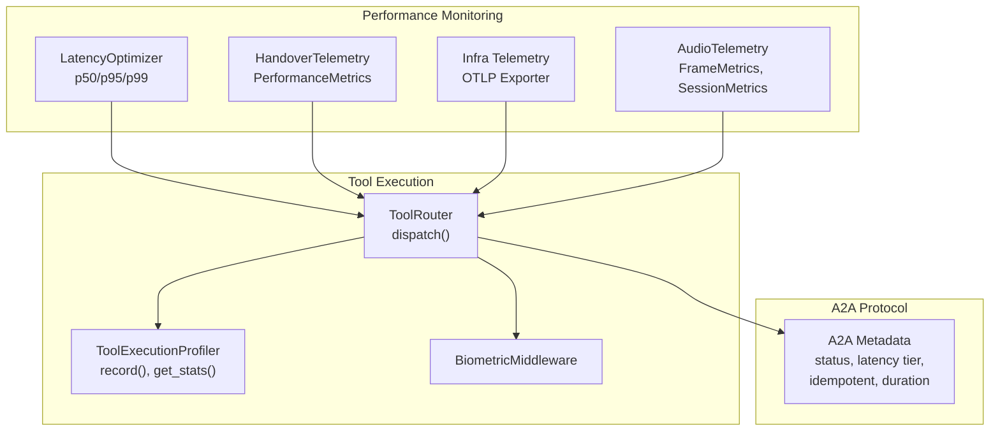
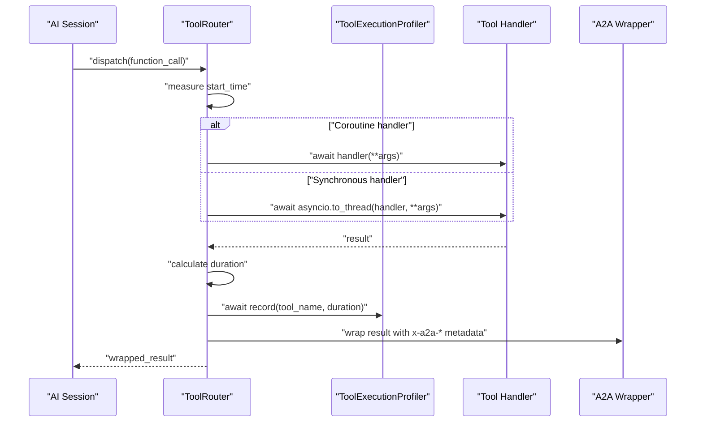
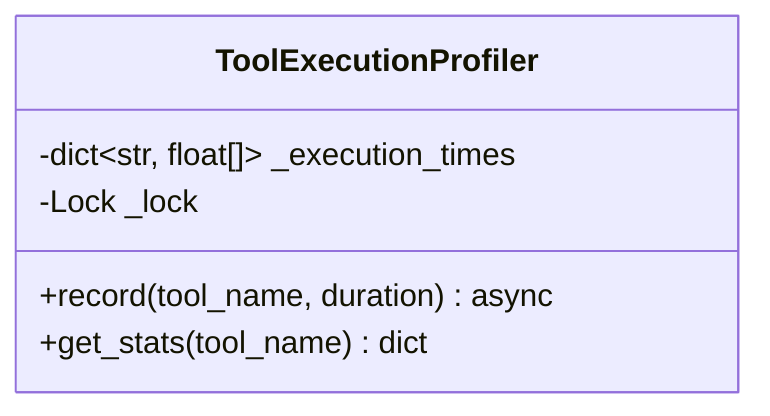
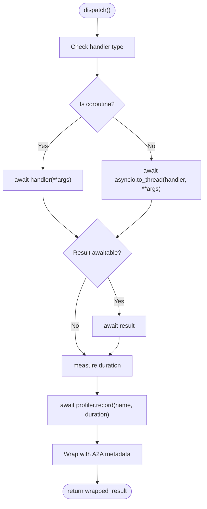
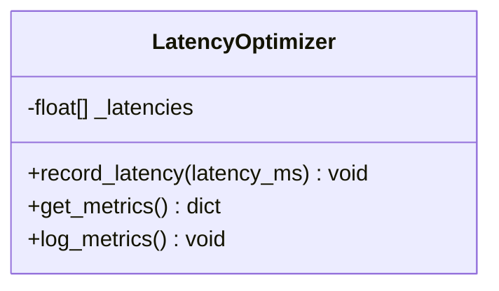
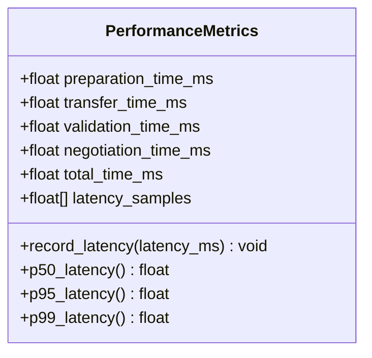
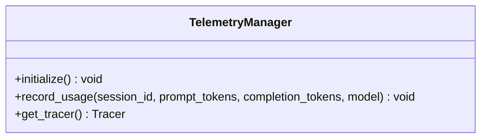
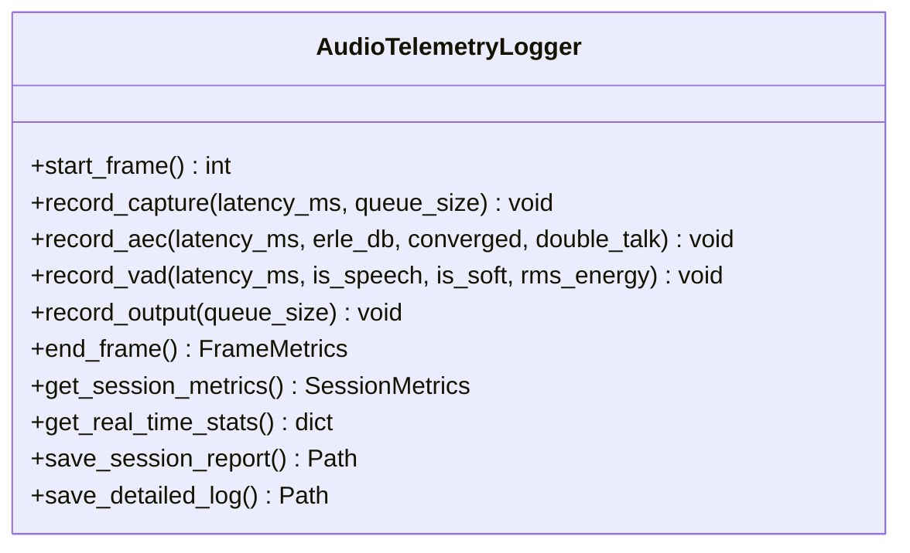
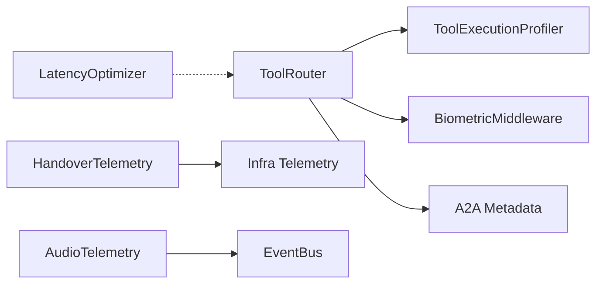

# Execution Framework and Profiling

<cite>
**Referenced Files in This Document**
- [router.py](file://core/tools/router.py)
- [latency.py](file://core/analytics/latency.py)
- [handover_telemetry.py](file://core/ai/handover_telemetry.py)
- [telemetry.py](file://core/infra/telemetry.py)
- [telemetry.py](file://core/audio/telemetry.py)
- [test_latency.py](file://tests/unit/test_latency.py)
- [session.py](file://core/ai/session.py)
</cite>

## Table of Contents
1. [Introduction](#introduction)
2. [Project Structure](#project-structure)
3. [Core Components](#core-components)
4. [Architecture Overview](#architecture-overview)
5. [Detailed Component Analysis](#detailed-component-analysis)
6. [Dependency Analysis](#dependency-analysis)
7. [Performance Considerations](#performance-considerations)
8. [Troubleshooting Guide](#troubleshooting-guide)
9. [Conclusion](#conclusion)
10. [Appendices](#appendices)

## Introduction
This document describes the tool execution framework and performance profiling system in the Aether Voice OS. It focuses on the ToolExecutionProfiler class for execution time tracking and latency statistics, the async execution model supporting both coroutine and synchronous handlers, and the A2A protocol response formatting with standardized metadata. It also covers performance monitoring, error handling strategies, and practical integration patterns for profiling and result wrapping.

## Project Structure
The execution and profiling system spans several modules:
- Tool routing and execution with profiling and A2A response wrapping
- Latency statistics utilities
- Handover telemetry and performance analytics
- Infrastructure telemetry sink for OTLP export
- Audio telemetry for real-time audio pipeline metrics
- AI session orchestration that dispatches tools in parallel

**Diagram sources**
- [router.py](file://core/tools/router.py#L87-L117)
- [latency.py](file://core/analytics/latency.py#L7-L39)
- [handover_telemetry.py](file://core/ai/handover_telemetry.py#L52-L94)
- [telemetry.py](file://core/infra/telemetry.py#L14-L129)
- [telemetry.py](file://core/audio/telemetry.py#L21-L441)

**Section sources**
- [router.py](file://core/tools/router.py#L1-L360)

## Core Components
- ToolExecutionProfiler: Asynchronous, lock-protected profiler that records execution durations per tool and computes p50, p95, p99, average, and count. It caps historical samples to prevent memory growth.
- ToolRouter: Central dispatcher that routes function calls to handlers, supports both coroutine and synchronous handlers via asyncio.to_thread, measures execution duration, and wraps results with A2A metadata.
- LatencyOptimizer: Utility for computing latency percentiles and logging metrics.
- HandoverTelemetry: Telemetry system for deep handover operations with performance metrics and analytics.
- Infra Telemetry: OpenTelemetry tracer provider and exporter for OTLP tracing.
- AudioTelemetry: Real-time audio pipeline telemetry with frame-level metrics and session summaries.

**Section sources**
- [router.py](file://core/tools/router.py#L87-L117)
- [router.py](file://core/tools/router.py#L234-L360)
- [latency.py](file://core/analytics/latency.py#L7-L39)
- [handover_telemetry.py](file://core/ai/handover_telemetry.py#L52-L94)
- [telemetry.py](file://core/infra/telemetry.py#L14-L129)
- [telemetry.py](file://core/audio/telemetry.py#L21-L441)

## Architecture Overview
The execution flow integrates async dispatch, handler execution, profiling, and A2A response wrapping. The session orchestrator can dispatch multiple tools concurrently and aggregates results.

**Diagram sources**
- [router.py](file://core/tools/router.py#L310-L342)
- [session.py](file://core/ai/session.py#L512-L556)

## Detailed Component Analysis

### ToolExecutionProfiler
- Purpose: Track execution times per tool and compute latency percentiles and averages.
- Thread-safety: Uses an asyncio.Lock to guard shared mutable state.
- Sampling strategy: Maintains up to 1000 samples per tool to bound memory usage.
- Statistics: Computes p50, p95, p99, average, and count. P95 and P99 are guarded by minimum sample thresholds to ensure meaningful quantiles.

**Diagram sources**
- [router.py](file://core/tools/router.py#L87-L117)

**Section sources**
- [router.py](file://core/tools/router.py#L87-L117)

### ToolRouter and A2A Response Wrapping
- Async execution model:
  - Detects coroutine handlers and awaits them directly.
  - Converts synchronous handlers to async using asyncio.to_thread for CPU-bound work.
  - Ensures nested awaitables are resolved before profiling.
- Execution duration measurement: Captures loop time before and after handler invocation.
- A2A metadata:
  - Standardized keys include status, latency tier, idempotency flag, and execution duration in milliseconds.
  - Supports overriding status via a2a_code in the handler result.
  - Recovery-aware status adjustment when semantic recovery occurs.

**Diagram sources**
- [router.py](file://core/tools/router.py#L310-L342)

**Section sources**
- [router.py](file://core/tools/router.py#L310-L342)

### LatencyOptimizer
- Purpose: Compute latency percentiles (p50, p95, p99), average, and count for small-scale latency tracking.
- Logging: Provides a convenience method to log computed metrics.

**Diagram sources**
- [latency.py](file://core/analytics/latency.py#L7-L39)

**Section sources**
- [latency.py](file://core/analytics/latency.py#L7-L39)
- [test_latency.py](file://tests/unit/test_latency.py#L1-L68)

### HandoverTelemetry and PerformanceMetrics
- PerformanceMetrics: Records latency samples and computes p50, p95, p99 percentiles.
- HandoverTelemetry: Full lifecycle telemetry for handover operations with analytics, persistence, and OTLP tracing.

**Diagram sources**
- [handover_telemetry.py](file://core/ai/handover_telemetry.py#L52-L94)

**Section sources**
- [handover_telemetry.py](file://core/ai/handover_telemetry.py#L52-L94)

### Infra Telemetry (OTLP)
- Provides OpenTelemetry tracer initialization and exporter configuration for Arize/Phoenix.
- Includes usage recording and cost estimation integration.

**Diagram sources**
- [telemetry.py](file://core/infra/telemetry.py#L14-L129)

**Section sources**
- [telemetry.py](file://core/infra/telemetry.py#L14-L129)

### Audio Telemetry
- Real-time audio pipeline telemetry with frame-level metrics and session summaries.
- Computes latency percentiles, ERLE, convergence, and speech activity.

**Diagram sources**
- [telemetry.py](file://core/audio/telemetry.py#L151-L441)

**Section sources**
- [telemetry.py](file://core/audio/telemetry.py#L151-L441)

## Dependency Analysis
- ToolRouter depends on ToolExecutionProfiler for statistics and on BiometricMiddleware for security gating.
- A2A response wrapping is embedded in ToolRouter’s dispatch flow.
- LatencyOptimizer complements ToolExecutionProfiler for lightweight latency analysis.
- HandoverTelemetry relies on Infra Telemetry for OTLP tracing.
- AudioTelemetry integrates with the EventBus for real-time metrics.

**Diagram sources**
- [router.py](file://core/tools/router.py#L87-L117)
- [handover_telemetry.py](file://core/ai/handover_telemetry.py#L295-L314)
- [telemetry.py](file://core/infra/telemetry.py#L14-L129)
- [telemetry.py](file://core/audio/telemetry.py#L151-L441)

**Section sources**
- [router.py](file://core/tools/router.py#L1-L360)
- [handover_telemetry.py](file://core/ai/handover_telemetry.py#L295-L314)
- [telemetry.py](file://core/infra/telemetry.py#L14-L129)
- [telemetry.py](file://core/audio/telemetry.py#L151-L441)

## Performance Considerations
- Sampling bounds: ToolExecutionProfiler caps samples per tool to prevent memory growth.
- Lock-based thread safety: Profiler uses an asyncio.Lock to protect shared state during concurrent recordings.
- Mixed handler support: Synchronous handlers are executed in threads to avoid blocking the event loop.
- Percentile thresholds: P95/P99 calculations in ToolExecutionProfiler and PerformanceMetrics are guarded by minimum sample sizes to ensure reliability.
- Real-time audio telemetry: AudioTelemetryLogger maintains bounded buffers and computes rolling percentiles and jitter for latency analysis.

[No sources needed since this section provides general guidance]

## Troubleshooting Guide
- Argument validation failures: The router catches type errors and returns an A2A-formatted error response with a 400 status.
- Execution failures: General exceptions are caught, logged with stack traces, and returned as A2A error responses with 500 status.
- A2A status override: Handlers can set a2a_code in their result to customize the status code.
- Recovery-aware status: When semantic recovery occurs, the status reflects a recovery path.

**Section sources**
- [router.py](file://core/tools/router.py#L344-L355)

## Conclusion
The execution framework provides robust, asynchronous tool dispatch with comprehensive profiling and standardized A2A response formatting. The ToolExecutionProfiler ensures memory-efficient sampling and accurate latency statistics, while the async execution model supports both coroutine and synchronous handlers. Integrated telemetry systems enable real-time monitoring and performance analytics across audio and handover operations.

[No sources needed since this section summarizes without analyzing specific files]

## Appendices

### A2A Protocol Response Fields
- result: Wrapped result payload (dict or {"data": ...})
- x-a2a-status: HTTP-like status code (200/202/400/403/404/500)
- x-a2a-latency: Latency tier string
- x-a2a-idempotent: Boolean indicating idempotency
- x-a2a-duration_ms: Integer execution duration in milliseconds

**Section sources**
- [router.py](file://core/tools/router.py#L325-L337)

### Integration Patterns
- Performance monitoring: Use ToolRouter.get_performance_report() to fetch p50/p95/p99 per tool.
- Latency analysis: Combine ToolExecutionProfiler with LatencyOptimizer for lightweight percentile tracking.
- Handover analytics: Utilize HandoverTelemetry for end-to-end handover performance and failure analysis.
- OTLP tracing: Initialize TelemetryManager to export traces to Arize/Phoenix.

**Section sources**
- [router.py](file://core/tools/router.py#L357-L359)
- [latency.py](file://core/analytics/latency.py#L19-L31)
- [handover_telemetry.py](file://core/ai/handover_telemetry.py#L586-L606)
- [telemetry.py](file://core/infra/telemetry.py#L35-L76)