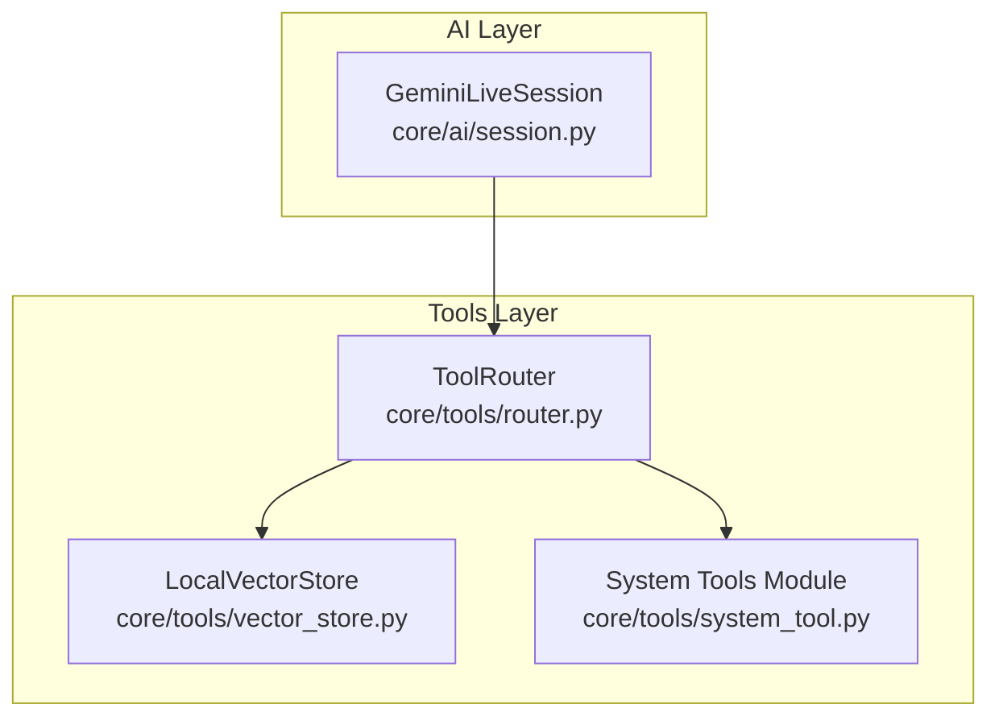
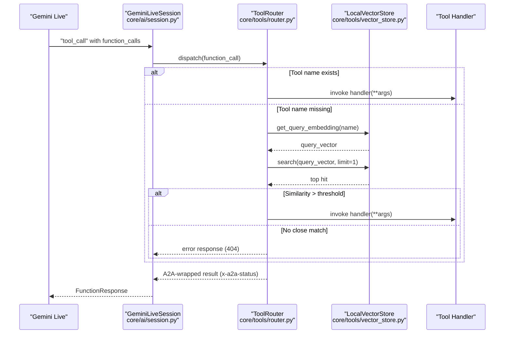
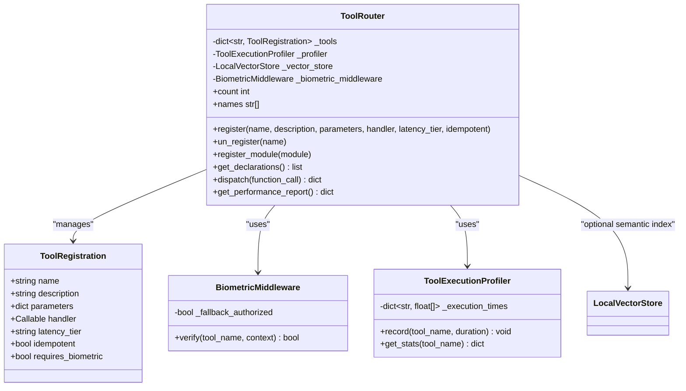
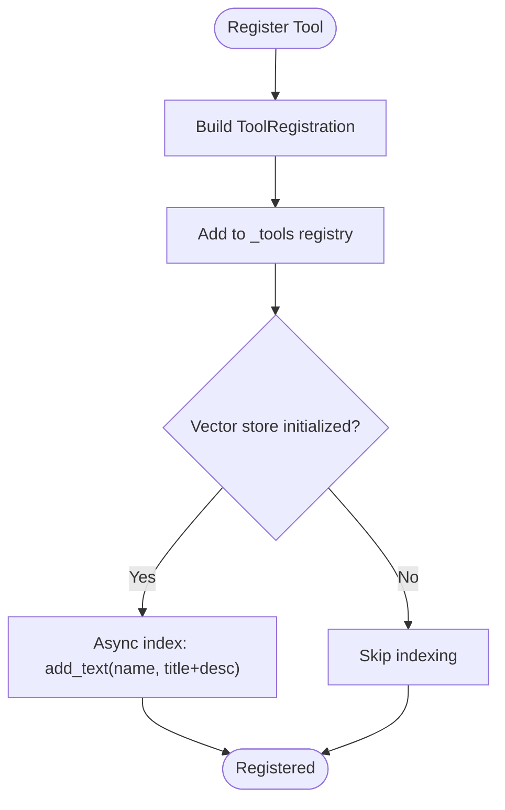
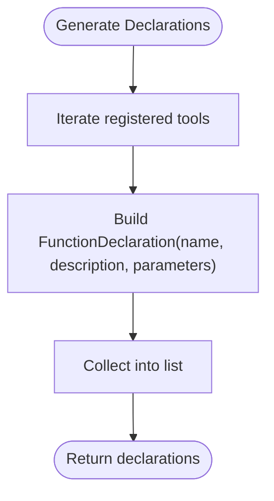
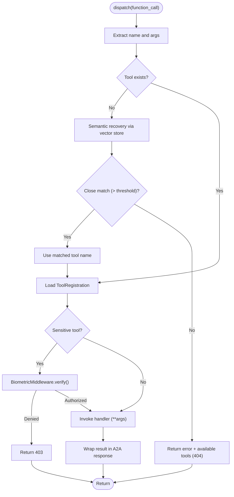
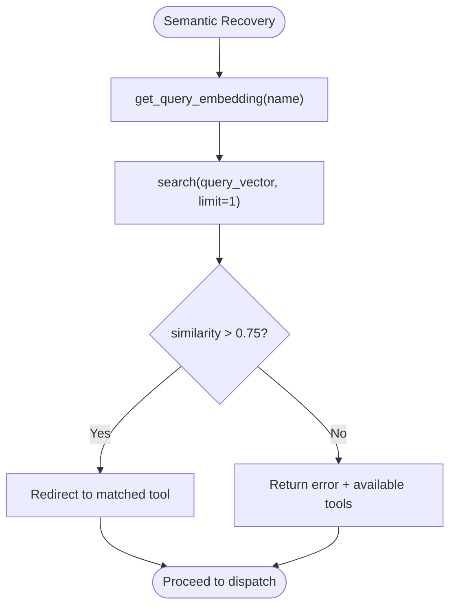
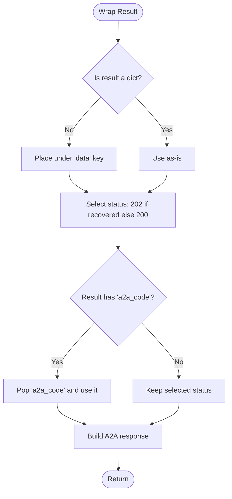
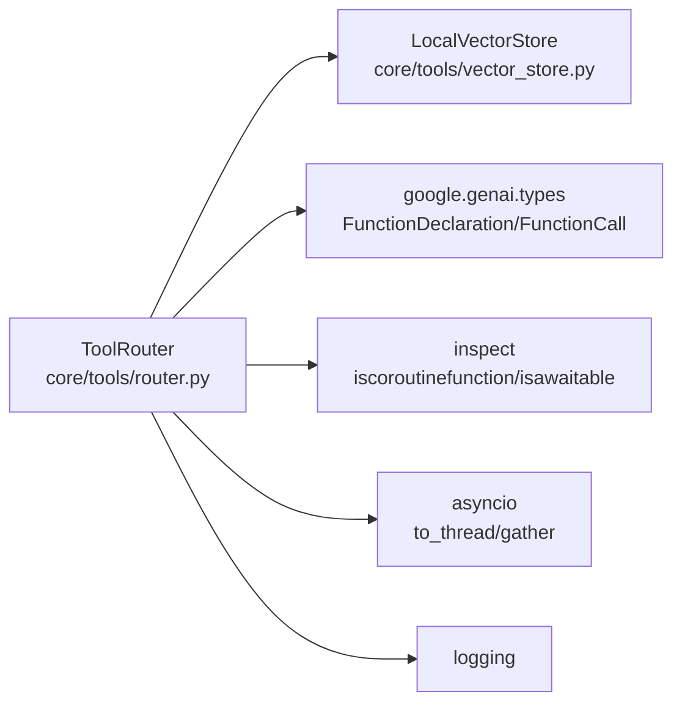

# Neural Router Architecture

<cite>
**Referenced Files in This Document**
- [core/tools/router.py](file://core/tools/router.py)
- [core/tools/vector_store.py](file://core/tools/vector_store.py)
- [core/tools/system_tool.py](file://core/tools/system_tool.py)
- [core/ai/session.py](file://core/ai/session.py)
- [tests/unit/test_core.py](file://tests/unit/test_core.py)
- [tests/integration/test_adk_stress.py](file://tests/integration/test_adk_stress.py)
- [docs/gateway_protocol.md](file://docs/gateway_protocol.md)
</cite>

## Table of Contents
1. [Introduction](#introduction)
2. [Project Structure](#project-structure)
3. [Core Components](#core-components)
4. [Architecture Overview](#architecture-overview)
5. [Detailed Component Analysis](#detailed-component-analysis)
6. [Dependency Analysis](#dependency-analysis)
7. [Performance Considerations](#performance-considerations)
8. [Troubleshooting Guide](#troubleshooting-guide)
9. [Conclusion](#conclusion)
10. [Appendices](#appendices)

## Introduction
This document explains the Neural Router architecture component responsible for dispatching Gemini Live function calls to registered tool handlers. It covers the ToolRouter class design, the ToolRegistration dataclass, the tool registration process, semantic recovery via vector similarity, function declaration generation for Gemini, and the A2A protocol response wrapping with status code management. It also includes examples of tool registration, parameter schemas, and handler patterns.

## Project Structure
The Neural Router lives in the tools subsystem and integrates with the AI session layer to orchestrate function execution. The vector store provides semantic indexing for tool name recovery. System tools demonstrate typical handler patterns and parameter schemas.

**Diagram sources**
- [core/ai/session.py](file://core/ai/session.py#L493-L589)
- [core/tools/router.py](file://core/tools/router.py#L120-L360)
- [core/tools/vector_store.py](file://core/tools/vector_store.py#L21-L112)
- [core/tools/system_tool.py](file://core/tools/system_tool.py#L198-L310)

**Section sources**
- [core/ai/session.py](file://core/ai/session.py#L390-L589)
- [core/tools/router.py](file://core/tools/router.py#L1-L360)
- [core/tools/vector_store.py](file://core/tools/vector_store.py#L1-L112)
- [core/tools/system_tool.py](file://core/tools/system_tool.py#L1-L310)

## Core Components
- ToolRouter: Central dispatcher for Gemini Live function calls. Handles registration, discovery, dispatch, biometric middleware, semantic recovery, and A2A response wrapping.
- ToolRegistration: Dataclass capturing tool metadata: name, description, parameters, handler, latency tier, idempotency, and biometric requirement.
- LocalVectorStore: Lightweight semantic index for tool name recovery using cosine similarity.
- System Tools Module: Example tool definitions with handlers and parameter schemas.

**Section sources**
- [core/tools/router.py](file://core/tools/router.py#L33-L44)
- [core/tools/router.py](file://core/tools/router.py#L120-L360)
- [core/tools/vector_store.py](file://core/tools/vector_store.py#L21-L112)
- [core/tools/system_tool.py](file://core/tools/system_tool.py#L198-L310)

## Architecture Overview
The Neural Router sits between the AI session and tool modules. When Gemini emits a function call, the session forwards it to ToolRouter.dispatch(), which resolves the handler, optionally performs semantic recovery, enforces biometric middleware for sensitive tools, executes the handler (sync or async), and wraps the result in an A2A-compliant response.

**Diagram sources**
- [core/ai/session.py](file://core/ai/session.py#L493-L589)
- [core/tools/router.py](file://core/tools/router.py#L234-L360)
- [core/tools/vector_store.py](file://core/tools/vector_store.py#L106-L112)

## Detailed Component Analysis

### ToolRouter
ToolRouter is the central dispatcher. It maintains a registry of tools, generates Gemini-compatible function declarations, supports module-based registration, performs semantic recovery, enforces biometric middleware for sensitive tools, and wraps results in A2A responses with standardized status codes.

Key responsibilities:
- Registration: register(), register_module(), un_register()
- Discovery: get_declarations() for Gemini
- Dispatch: dispatch() with neural routing logic
- Semantics: semantic recovery via LocalVectorStore
- Security: BiometricMiddleware for sensitive tools
- Observability: ToolExecutionProfiler and performance reporting

**Diagram sources**
- [core/tools/router.py](file://core/tools/router.py#L33-L44)
- [core/tools/router.py](file://core/tools/router.py#L120-L360)

**Section sources**
- [core/tools/router.py](file://core/tools/router.py#L120-L360)

### ToolRegistration Dataclass
ToolRegistration encapsulates the tool’s identity, schema, and runtime metadata:
- name: Unique tool identifier
- description: Human-readable description for Gemini
- parameters: JSON Schema defining the tool’s arguments
- handler: Callable implementing the tool logic
- latency_tier: Performance classification (e.g., low latency)
- idempotent: Whether the tool can be retried safely
- requires_biometric: Enables biometric middleware enforcement

**Section sources**
- [core/tools/router.py](file://core/tools/router.py#L33-L44)

### Tool Registration Process
- Manual registration: register() adds a single tool definition and asynchronously indexes its name/description in the semantic store if present.
- Module registration: register_module() discovers tools via a module’s get_tools() and registers each definition.
- Unregistration: un_register() removes a tool from the registry.

**Diagram sources**
- [core/tools/router.py](file://core/tools/router.py#L146-L176)

**Section sources**
- [core/tools/router.py](file://core/tools/router.py#L146-L200)
- [core/tools/system_tool.py](file://core/tools/system_tool.py#L198-L310)

### Function Declaration Generation for Gemini
get_declarations() produces a list of FunctionDeclaration objects compatible with Gemini Live. Each declaration includes name, description, and optional parameters schema.

**Diagram sources**
- [core/tools/router.py](file://core/tools/router.py#L211-L232)

**Section sources**
- [core/tools/router.py](file://core/tools/router.py#L211-L232)
- [tests/unit/test_core.py](file://tests/unit/test_core.py#L487-L502)

### Tool Discovery Mechanism
- During session setup, ToolRouter.get_declarations() is used to inform Gemini of available tools.
- During runtime, ToolRouter.dispatch() resolves the handler by name lookup. If missing, it attempts semantic recovery.

**Section sources**
- [core/tools/router.py](file://core/tools/router.py#L211-L232)
- [core/tools/router.py](file://core/tools/router.py#L234-L284)

### Dispatch Method: Neural Routing Logic
dispatch() orchestrates:
- Parameter extraction from function_call.args
- Name resolution: exact match or semantic recovery
- Biometric middleware enforcement for sensitive tools
- Handler invocation supporting both sync and async handlers
- A2A response wrapping with standardized headers and status codes

**Diagram sources**
- [core/tools/router.py](file://core/tools/router.py#L234-L360)

**Section sources**
- [core/tools/router.py](file://core/tools/router.py#L234-L360)

### Semantic Recovery Sequence
When a tool name is not found, ToolRouter attempts semantic recovery:
- Generate query embedding for the tool name
- Search the vector store for the nearest neighbor
- If similarity exceeds a threshold, redirect execution to the matched tool; otherwise return an error with available tools.

**Diagram sources**
- [core/tools/router.py](file://core/tools/router.py#L244-L284)
- [core/tools/vector_store.py](file://core/tools/vector_store.py#L106-L112)

**Section sources**
- [core/tools/router.py](file://core/tools/router.py#L244-L284)
- [core/tools/vector_store.py](file://core/tools/vector_store.py#L83-L112)

### A2A Protocol Response Wrapping and Status Codes
ToolRouter wraps results with:
- result: Ensures a dict-shaped payload; scalar results are placed under a data key
- x-a2a-status: 200 for normal, 202 if recovered, 400/403/500 for errors
- x-a2a-latency: latency tier from ToolRegistration
- x-a2a-idempotent: idempotency flag
- x-a2a-duration_ms: execution duration in milliseconds

**Diagram sources**
- [core/tools/router.py](file://core/tools/router.py#L325-L342)

**Section sources**
- [core/tools/router.py](file://core/tools/router.py#L325-L342)

### Examples: Tool Registration, Parameter Schemas, and Handler Patterns
- System tools module demonstrates:
  - get_tools() returning a list of tool definitions with name, description, parameters JSON Schema, and handler
  - Handlers as async functions returning structured dicts
  - Parameter schemas with required fields and descriptions

**Section sources**
- [core/tools/system_tool.py](file://core/tools/system_tool.py#L198-L310)
- [tests/unit/test_core.py](file://tests/unit/test_core.py#L251-L302)

## Dependency Analysis
ToolRouter depends on:
- LocalVectorStore for semantic recovery
- Gemini types for function declarations and calls
- Python asyncio and inspect for async execution and introspection
- Logging for observability

**Diagram sources**
- [core/tools/router.py](file://core/tools/router.py#L17-L30)
- [core/tools/router.py](file://core/tools/router.py#L120-L360)
- [core/tools/vector_store.py](file://core/tools/vector_store.py#L15-L16)

**Section sources**
- [core/tools/router.py](file://core/tools/router.py#L17-L30)
- [core/tools/router.py](file://core/tools/router.py#L120-L360)
- [core/tools/vector_store.py](file://core/tools/vector_store.py#L15-L16)

## Performance Considerations
- Parallel dispatch: The AI session executes multiple function calls concurrently, reducing total latency.
- Profiling: ToolExecutionProfiler records execution times and computes percentiles for latency reporting.
- Async handlers: Dispatch supports both sync and async handlers, with sync handlers executed in threads to avoid blocking the event loop.
- Semantic indexing: Vector store indexing is asynchronous to avoid blocking registration.

**Section sources**
- [core/ai/session.py](file://core/ai/session.py#L512-L520)
- [core/tools/router.py](file://core/tools/router.py#L87-L118)
- [core/tools/router.py](file://core/tools/router.py#L312-L323)
- [core/tools/router.py](file://core/tools/router.py#L165-L173)

## Troubleshooting Guide
Common issues and diagnostics:
- Unknown tool: Returned when the tool name is not registered and semantic recovery fails. The response includes available tools and a 404 status.
- Argument errors: Raised when handler signature mismatch occurs; response carries a 400 status.
- Execution failures: Exceptions during handler execution yield a 500 status and an error message.
- Biometric verification failure: Sensitive tools require biometric verification; denial yields a 403 status.
- Stress scenarios: Tests validate high concurrency and crash isolation.

**Section sources**
- [core/tools/router.py](file://core/tools/router.py#L277-L355)
- [tests/integration/test_adk_stress.py](file://tests/integration/test_adk_stress.py#L10-L79)

## Conclusion
The Neural Router provides a robust, secure, and observable dispatch layer for Gemini Live function calls. It combines explicit tool registration with semantic recovery, enforces biometric middleware for sensitive operations, and standardizes responses for multi-agent interoperability. Its design supports both synchronous and asynchronous handlers, integrates with a lightweight vector store for resilience, and scales via parallel execution.

## Appendices

### A2A Protocol Notes
- A2A response fields: result, x-a2a-status, x-a2a-latency, x-a2a-idempotent, x-a2a-duration_ms
- Status code semantics:
  - 200: Normal success
  - 202: Success after semantic recovery
  - 400: Bad request (argument error)
  - 403: Forbidden (biometric verification failed)
  - 404: Not found (unknown tool and no semantic match)
  - 500: Internal error

**Section sources**
- [core/tools/router.py](file://core/tools/router.py#L325-L355)
- [docs/gateway_protocol.md](file://docs/gateway_protocol.md#L108-L124)