# Discovery Tools

<cite>
**Referenced Files in This Document**
- [discovery_tool.py](file://core/tools/discovery_tool.py)
- [code_indexer.py](file://core/tools/code_indexer.py)
- [context_scraper.py](file://core/tools/context_scraper.py)
- [search_tool.py](file://core/tools/search_tool.py)
- [vector_store.py](file://core/tools/vector_store.py)
- [firestore_vector_store.py](file://core/tools/firestore_vector_store.py)
- [rag_tool.py](file://core/tools/rag_tool.py)
- [system_tool.py](file://core/tools/system_tool.py)
- [memory_tool.py](file://core/tools/memory_tool.py)
- [tasks_tool.py](file://core/tools/tasks_tool.py)
- [hive_tool.py](file://core/tools/hive_tool.py)
- [healing_tool.py](file://core/tools/healing_tool.py)
- [scheduler.py](file://core/ai/scheduler.py)
- [echo.py](file://core/ai/echo.py)
</cite>

## Table of Contents
1. [Introduction](#introduction)
2. [Project Structure](#project-structure)
3. [Core Components](#core-components)
4. [Architecture Overview](#architecture-overview)
5. [Detailed Component Analysis](#detailed-component-analysis)
6. [Dependency Analysis](#dependency-analysis)
7. [Performance Considerations](#performance-considerations)
8. [Troubleshooting Guide](#troubleshooting-guide)
9. [Conclusion](#conclusion)
10. [Appendices](#appendices)

## Introduction
This document covers the Discovery Tools category in the Aether Live Agent system. It explains how the agent discovers, analyzes, and intelligently explores the codebase and environment. It documents discovery algorithms, pattern recognition, automated content mapping, and the interfaces for codebase exploration, dependency analysis, and contextual mapping. It also outlines discovery workflows, integration with development environments, and performance considerations for large codebases, including incremental discovery and optimization strategies. Finally, it describes the relationships between discovery tools and other system components such as memory management and task automation.

## Project Structure
The Discovery Tools ecosystem spans several modules:
- Code indexing and semantic search: vector stores, RAG tool, and code indexer
- System and environment discovery: system tool, memory tool, tasks tool
- Contextual discovery: web search grounding and external context scraping
- Specialized discovery: hive handover tool and healing tool for grounded diagnostics
- Proactive discovery: scheduler speculation and echo-based categorization

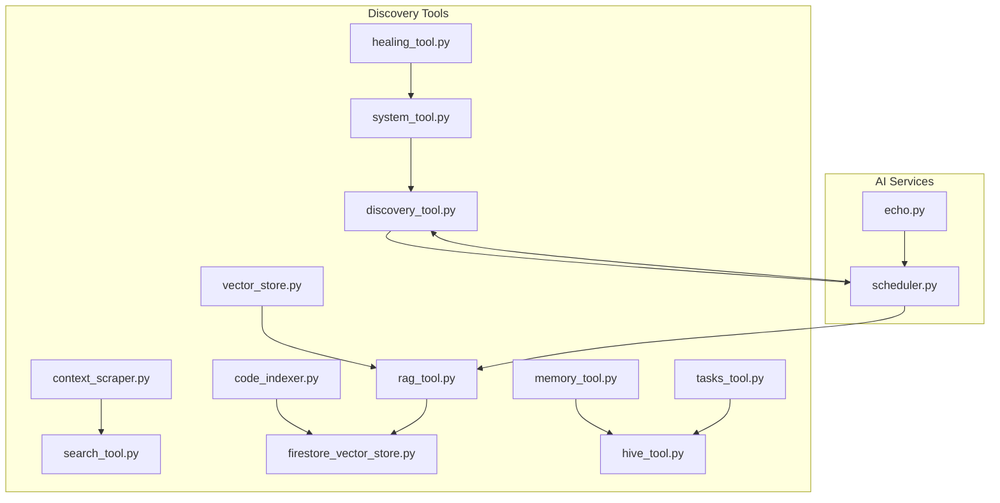

**Diagram sources**
- [discovery_tool.py](file://core/tools/discovery_tool.py#L27-L65)
- [context_scraper.py](file://core/tools/context_scraper.py#L19-L61)
- [search_tool.py](file://core/tools/search_tool.py#L26-L38)
- [vector_store.py](file://core/tools/vector_store.py#L21-L112)
- [firestore_vector_store.py](file://core/tools/firestore_vector_store.py#L22-L129)
- [rag_tool.py](file://core/tools/rag_tool.py#L26-L77)
- [code_indexer.py](file://core/tools/code_indexer.py#L56-L127)
- [system_tool.py](file://core/tools/system_tool.py#L137-L171)
- [memory_tool.py](file://core/tools/memory_tool.py#L40-L93)
- [tasks_tool.py](file://core/tools/tasks_tool.py#L43-L87)
- [hive_tool.py](file://core/tools/hive_tool.py#L27-L49)
- [healing_tool.py](file://core/tools/healing_tool.py#L18-L65)
- [scheduler.py](file://core/ai/scheduler.py#L52-L72)
- [echo.py](file://core/ai/echo.py#L42-L64)

**Section sources**
- [discovery_tool.py](file://core/tools/discovery_tool.py#L1-L84)
- [code_indexer.py](file://core/tools/code_indexer.py#L1-L131)
- [context_scraper.py](file://core/tools/context_scraper.py#L1-L146)
- [search_tool.py](file://core/tools/search_tool.py#L1-L51)
- [vector_store.py](file://core/tools/vector_store.py#L1-L112)
- [firestore_vector_store.py](file://core/tools/firestore_vector_store.py#L1-L129)
- [rag_tool.py](file://core/tools/rag_tool.py#L1-L109)
- [system_tool.py](file://core/tools/system_tool.py#L1-L310)
- [memory_tool.py](file://core/tools/memory_tool.py#L1-L330)
- [tasks_tool.py](file://core/tools/tasks_tool.py#L1-L325)
- [hive_tool.py](file://core/tools/hive_tool.py#L1-L78)
- [healing_tool.py](file://core/tools/healing_tool.py#L1-L148)
- [scheduler.py](file://core/ai/scheduler.py#L33-L75)
- [echo.py](file://core/ai/echo.py#L42-L68)

## Core Components
- Discovery Audit Tool: Provides a self-audit of internal systems, metrics, and codebase statistics.
- Code Indexer: Walks the codebase, chunks text, generates embeddings, and persists them to a vector store.
- RAG Tool: Performs semantic search over the indexed codebase and returns relevant chunks with metadata.
- Vector Stores: Local and cloud-native vector stores for embeddings and similarity search.
- System Tool: Lists codebase files, reads file content, executes safe commands, and exposes time/system info.
- Context Scraper: Real-time web scraping for StackOverflow, GitHub, and Hacker News to enrich context.
- Search Tool: Google Search grounding for factual queries.
- Memory and Tasks Tools: Persistent storage and CRUD operations for memories and tasks.
- Hive Tool: Switches to specialized expert souls for targeted discovery.
- Healing Tool: Grounded diagnosis combining visual and terminal context for error repair.

**Section sources**
- [discovery_tool.py](file://core/tools/discovery_tool.py#L27-L65)
- [code_indexer.py](file://core/tools/code_indexer.py#L56-L127)
- [rag_tool.py](file://core/tools/rag_tool.py#L26-L77)
- [vector_store.py](file://core/tools/vector_store.py#L21-L112)
- [firestore_vector_store.py](file://core/tools/firestore_vector_store.py#L22-L129)
- [system_tool.py](file://core/tools/system_tool.py#L137-L196)
- [context_scraper.py](file://core/tools/context_scraper.py#L19-L96)
- [search_tool.py](file://core/tools/search_tool.py#L26-L50)
- [memory_tool.py](file://core/tools/memory_tool.py#L40-L244)
- [tasks_tool.py](file://core/tools/tasks_tool.py#L43-L214)
- [hive_tool.py](file://core/tools/hive_tool.py#L27-L49)
- [healing_tool.py](file://core/tools/healing_tool.py#L18-L99)

## Architecture Overview
The Discovery Tools architecture integrates local and cloud vector stores, semantic search, and proactive orchestration. The system performs:
- Codebase discovery via indexing and embedding
- Semantic retrieval via RAG
- System/environment awareness via system tool
- External context via web scraping and Google Search grounding
- Proactive pre-warming of tools based on user intent
- Specialized expert handoffs for deep analysis

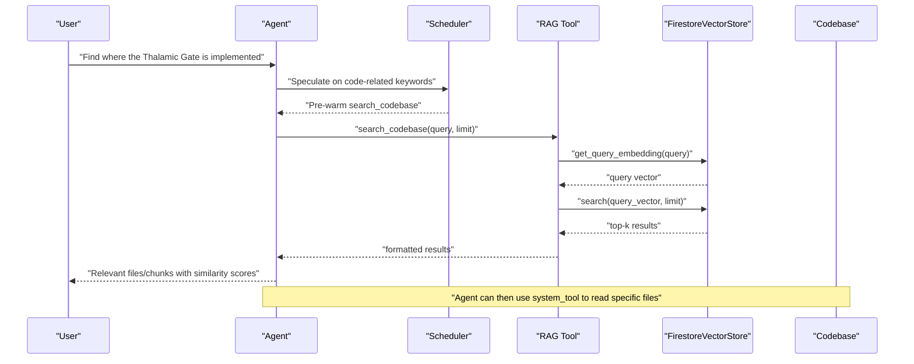

**Diagram sources**
- [rag_tool.py](file://core/tools/rag_tool.py#L26-L77)
- [firestore_vector_store.py](file://core/tools/firestore_vector_store.py#L74-L121)
- [scheduler.py](file://core/ai/scheduler.py#L52-L72)

## Detailed Component Analysis

### Discovery Audit Tool
- Purpose: Self-diagnostic audit of internal systems, metrics, and codebase statistics.
- Key behaviors:
  - Reports component status (affective engine, hive coordinator, vision system, memory vault)
  - Exposes metrics such as current soul and handover counts
  - Counts files in the codebase excluding common ignored directories
- Interfaces:
  - Handler: generate_system_audit
  - Registration: get_tools returns a single tool descriptor

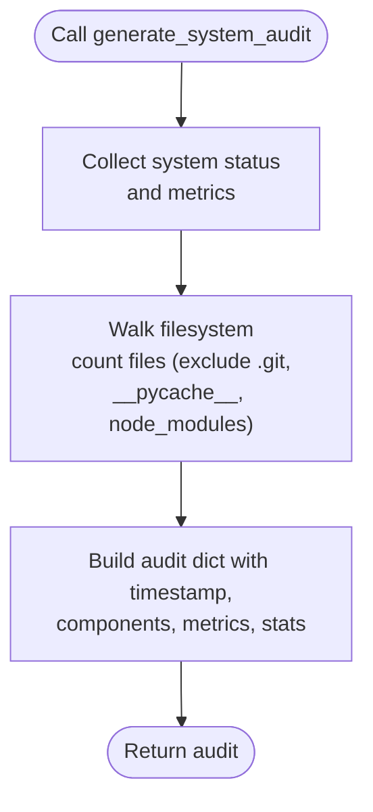

**Diagram sources**
- [discovery_tool.py](file://core/tools/discovery_tool.py#L27-L65)

**Section sources**
- [discovery_tool.py](file://core/tools/discovery_tool.py#L27-L84)

### Code Indexer
- Purpose: Index the codebase into a vector store for semantic search.
- Key behaviors:
  - Walks the repository, filters by extensions and ignores directories
  - Chunks text with overlap
  - Embeds chunks and writes to FirestoreVectorStore
  - Logs progress and handles errors
- Algorithms:
  - Chunking: sliding window with configurable size and overlap
  - Rate limiting: small delays between requests to avoid throttling
- Integration:
  - Uses FirestoreVectorStore for persistence
  - Loads API key from environment

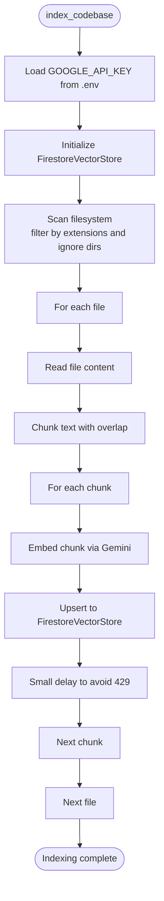

**Diagram sources**
- [code_indexer.py](file://core/tools/code_indexer.py#L56-L127)
- [firestore_vector_store.py](file://core/tools/firestore_vector_store.py#L37-L73)

**Section sources**
- [code_indexer.py](file://core/tools/code_indexer.py#L1-L131)
- [firestore_vector_store.py](file://core/tools/firestore_vector_store.py#L1-L129)

### RAG Tool
- Purpose: Semantic search over the indexed codebase.
- Key behaviors:
  - Embeds the query
  - Searches the shared vector store
  - Formats results with file path, chunk index, and similarity score
- Integration:
  - Uses FirestoreVectorStore (cloud-native)
  - Can auto-initialize if not injected globally

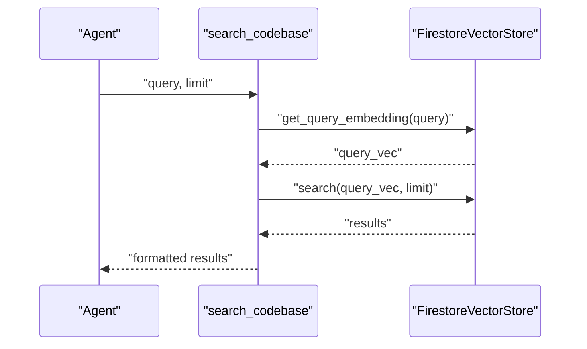

**Diagram sources**
- [rag_tool.py](file://core/tools/rag_tool.py#L26-L77)
- [firestore_vector_store.py](file://core/tools/firestore_vector_store.py#L123-L129)

**Section sources**
- [rag_tool.py](file://core/tools/rag_tool.py#L1-L109)
- [firestore_vector_store.py](file://core/tools/firestore_vector_store.py#L74-L129)

### Vector Stores
- Local Vector Store:
  - Embeddings persisted locally via pickle
  - Cosine similarity search over stored vectors
  - Query embedding generation via Gemini
- Firestore Vector Store:
  - Cloud-native persistence with Firestore
  - Embedding generation via Gemini
  - Prototype similarity scan-and-compute (to be replaced by vector search extension in production)

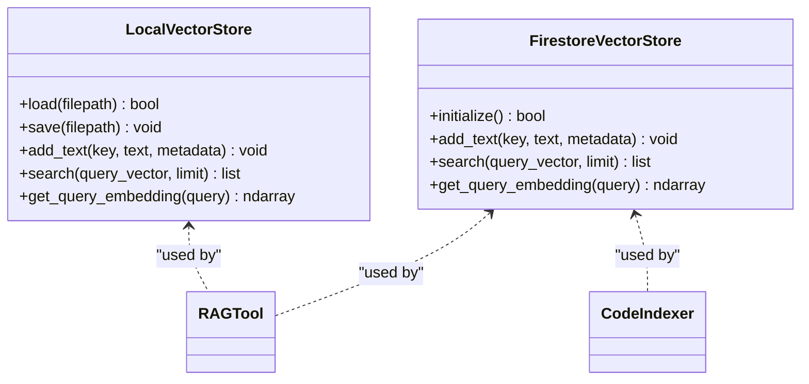

**Diagram sources**
- [vector_store.py](file://core/tools/vector_store.py#L21-L112)
- [firestore_vector_store.py](file://core/tools/firestore_vector_store.py#L22-L129)
- [rag_tool.py](file://core/tools/rag_tool.py#L20-L24)
- [code_indexer.py](file://core/tools/code_indexer.py#L65-L66)

**Section sources**
- [vector_store.py](file://core/tools/vector_store.py#L1-L112)
- [firestore_vector_store.py](file://core/tools/firestore_vector_store.py#L1-L129)

### System Tool
- Purpose: Provide system-level discovery and environment awareness.
- Capabilities:
  - List codebase files (with ignore lists)
  - Read file content with truncation safeguards
  - Run safe terminal commands with timeouts and blacklists
  - Get current time/date/timezone and system info
- Integration:
  - Used to read specific files returned by RAG or discovery tools

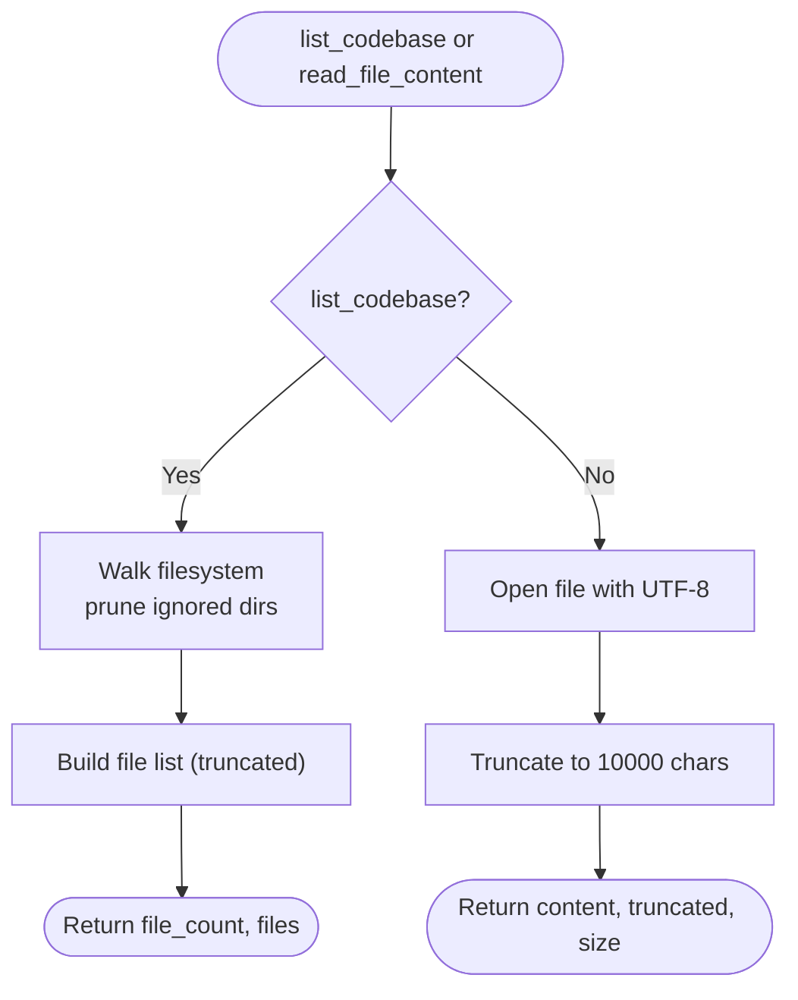

**Diagram sources**
- [system_tool.py](file://core/tools/system_tool.py#L137-L196)

**Section sources**
- [system_tool.py](file://core/tools/system_tool.py#L1-L310)

### Context Scraper and Search Tool
- Context Scraper:
  - Scrapes StackOverflow, GitHub Issues, and Hacker News
  - Returns structured results for use as context
- Search Tool:
  - Provides Google Search grounding as a built-in Gemini tool
  - Registered separately from function-calling tools

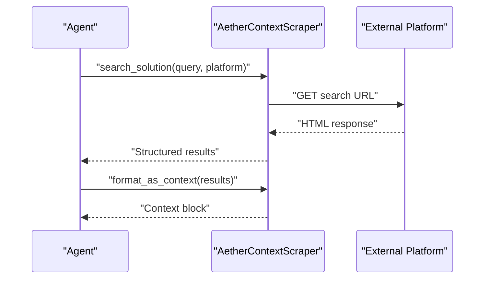

**Diagram sources**
- [context_scraper.py](file://core/tools/context_scraper.py#L19-L96)
- [search_tool.py](file://core/tools/search_tool.py#L26-L38)

**Section sources**
- [context_scraper.py](file://core/tools/context_scraper.py#L1-L146)
- [search_tool.py](file://core/tools/search_tool.py#L1-L51)

### Memory and Tasks Tools
- Memory Tool:
  - Save, recall, list, semantic search, and prune persistent memories
  - Integrates with Firestore via a connector
- Tasks Tool:
  - Create, list, complete tasks, and add notes
  - CRUD operations backed by Firestore collections

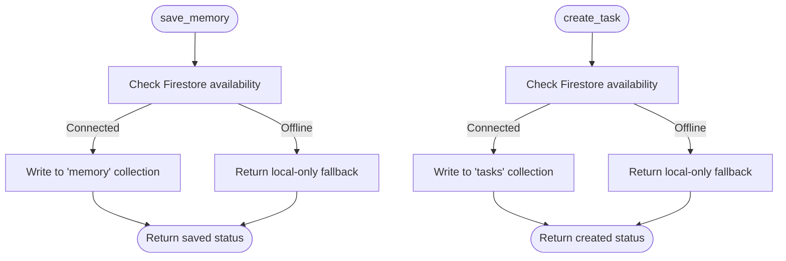

**Diagram sources**
- [memory_tool.py](file://core/tools/memory_tool.py#L40-L93)
- [tasks_tool.py](file://core/tools/tasks_tool.py#L43-L87)

**Section sources**
- [memory_tool.py](file://core/tools/memory_tool.py#L1-L330)
- [tasks_tool.py](file://core/tools/tasks_tool.py#L1-L325)

### Hive Tool and Healing Tool
- Hive Tool:
  - Switches to a specialized expert soul for targeted discovery
- Healing Tool:
  - Gathers visual and terminal context for error diagnosis
  - Returns structured payload for repair proposals

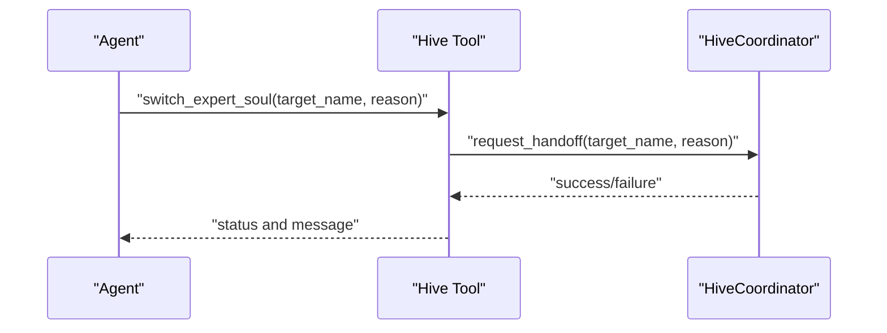

**Diagram sources**
- [hive_tool.py](file://core/tools/hive_tool.py#L27-L49)

**Section sources**
- [hive_tool.py](file://core/tools/hive_tool.py#L1-L78)
- [healing_tool.py](file://core/tools/healing_tool.py#L18-L99)

### Proactive Discovery and Echo Categorization
- Scheduler:
  - Speculates on tool pre-warming based on prompt fragments
  - Keywords trigger discovery-related tools (e.g., error -> system_tool.read_logs, discovery_tool.scan_project)
- Echo:
  - Maps tool names to categories for contextual responses

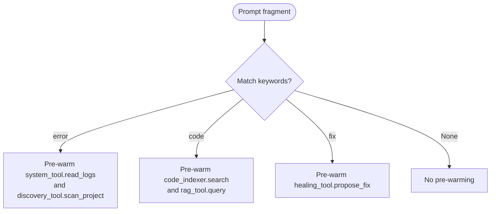

**Diagram sources**
- [scheduler.py](file://core/ai/scheduler.py#L52-L72)
- [echo.py](file://core/ai/echo.py#L42-L64)

**Section sources**
- [scheduler.py](file://core/ai/scheduler.py#L33-L75)
- [echo.py](file://core/ai/echo.py#L42-L68)

## Dependency Analysis
- Internal dependencies:
  - RAG Tool depends on FirestoreVectorStore
  - Code Indexer depends on FirestoreVectorStore
  - System Tool is standalone but used by other tools
  - Discovery Audit Tool references affective engine and hive coordinator
- External dependencies:
  - Gemini for embeddings
  - Firebase Admin for Firestore persistence
  - Scrapling for web scraping
  - Google Search grounding tool

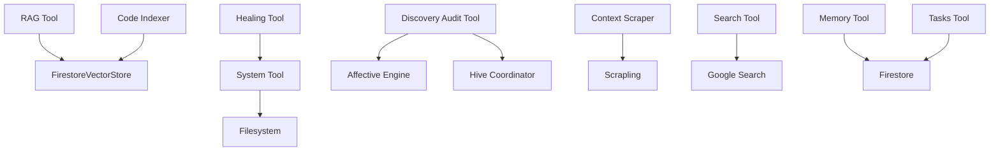

**Diagram sources**
- [rag_tool.py](file://core/tools/rag_tool.py#L12-L24)
- [code_indexer.py](file://core/tools/code_indexer.py#L13-L66)
- [discovery_tool.py](file://core/tools/discovery_tool.py#L17-L24)
- [context_scraper.py](file://core/tools/context_scraper.py#L5-L17)
- [search_tool.py](file://core/tools/search_tool.py#L21-L38)
- [memory_tool.py](file://core/tools/memory_tool.py#L23-L37)
- [tasks_tool.py](file://core/tools/tasks_tool.py#L24-L40)
- [healing_tool.py](file://core/tools/healing_tool.py#L13-L28)

**Section sources**
- [rag_tool.py](file://core/tools/rag_tool.py#L1-L109)
- [code_indexer.py](file://core/tools/code_indexer.py#L1-L131)
- [discovery_tool.py](file://core/tools/discovery_tool.py#L1-L84)
- [context_scraper.py](file://core/tools/context_scraper.py#L1-L146)
- [search_tool.py](file://core/tools/search_tool.py#L1-L51)
- [memory_tool.py](file://core/tools/memory_tool.py#L1-L330)
- [tasks_tool.py](file://core/tools/tasks_tool.py#L1-L325)
- [healing_tool.py](file://core/tools/healing_tool.py#L1-L148)

## Performance Considerations
- Large codebases:
  - Use chunking with overlap to balance granularity and context retention
  - Apply rate limiting and backoff to avoid API throttling
  - Persist embeddings locally for fast iteration; migrate to cloud vector store for scale
- Incremental discovery:
  - Index only changed files during development cycles
  - Maintain a manifest of indexed keys to avoid reprocessing
- Optimization strategies:
  - Pre-warm tools based on user intent to reduce latency
  - Truncate file reads and result lists to manage context window
  - Use approximate nearest neighbor libraries for large-scale similarity search
- Latency tiers:
  - Tools expose latency tier metadata to guide orchestration (e.g., p95_sub_2s, p95_sub_5s, low_latency)

[No sources needed since this section provides general guidance]

## Troubleshooting Guide
- Missing embeddings or empty search results:
  - Verify GOOGLE_API_KEY is present and Firestore credentials are configured
  - Re-run the code indexer to rebuild the vector store
- Rate limiting and 429 errors:
  - Introduce delays between embedding requests
  - Use a semaphore to cap concurrent requests
- Web scraping failures:
  - Check network connectivity and platform availability
  - Validate selectors and pagination assumptions
- Memory and tasks offline:
  - Confirm Firestore connection and permissions
  - Fall back to local-only behavior gracefully
- Safety and timeouts:
  - Terminal commands are sandboxed with timeouts and blacklists
  - File reads are truncated to prevent memory issues

**Section sources**
- [code_indexer.py](file://core/tools/code_indexer.py#L61-L63)
- [code_indexer.py](file://core/tools/code_indexer.py#L107-L108)
- [context_scraper.py](file://core/tools/context_scraper.py#L59-L60)
- [memory_tool.py](file://core/tools/memory_tool.py#L57-L63)
- [tasks_tool.py](file://core/tools/tasks_tool.py#L76-L78)
- [system_tool.py](file://core/tools/system_tool.py#L127-L130)
- [system_tool.py](file://core/tools/system_tool.py#L178-L195)

## Conclusion
The Discovery Tools category enables the Aether Live Agent to comprehensively explore and understand its environment. Through code indexing, semantic search, system awareness, and proactive orchestration, the agent can discover relevant information, map dependencies, and act intelligently. The modular design allows seamless integration with memory, tasks, and expert handoffs, while performance strategies ensure scalability and responsiveness in large codebases.

[No sources needed since this section summarizes without analyzing specific files]

## Appendices
- Discovery Workflows:
  - Codebase exploration: code_indexer -> FirestoreVectorStore -> rag_tool -> system_tool
  - Contextual mapping: context_scraper -> search_tool -> agent
  - System auditing: discovery_tool -> scheduler speculation
  - Proactive discovery: scheduler speculate -> hive_tool handoff -> healing_tool grounded diagnosis
- Integration with development environments:
  - IDE plugins can trigger code_indexer for on-demand indexing
  - CI/CD can schedule periodic indexing jobs
  - Debugging workflows can leverage healing_tool for automated diagnostics

[No sources needed since this section provides general guidance]