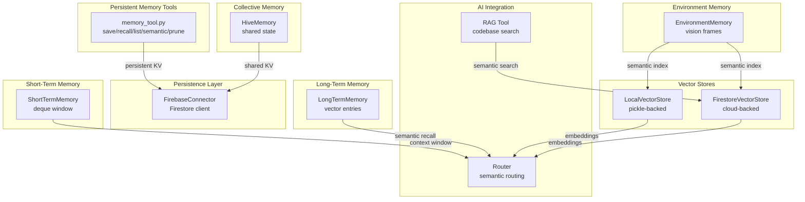
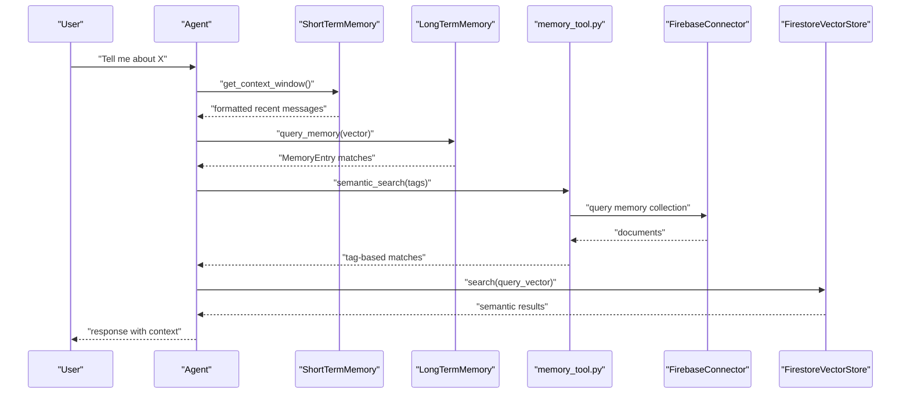
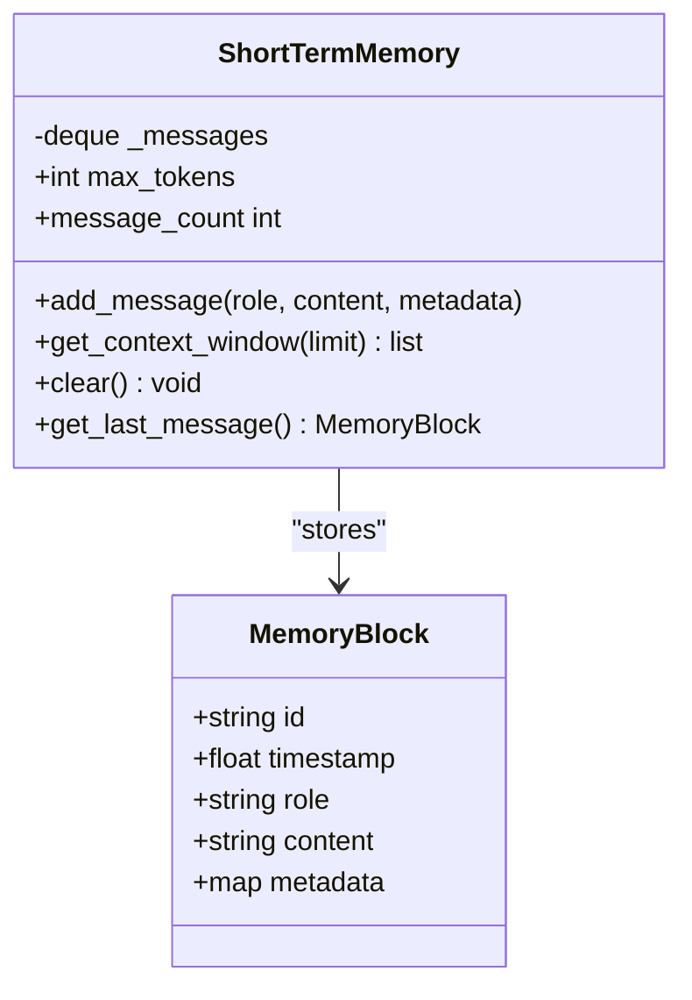
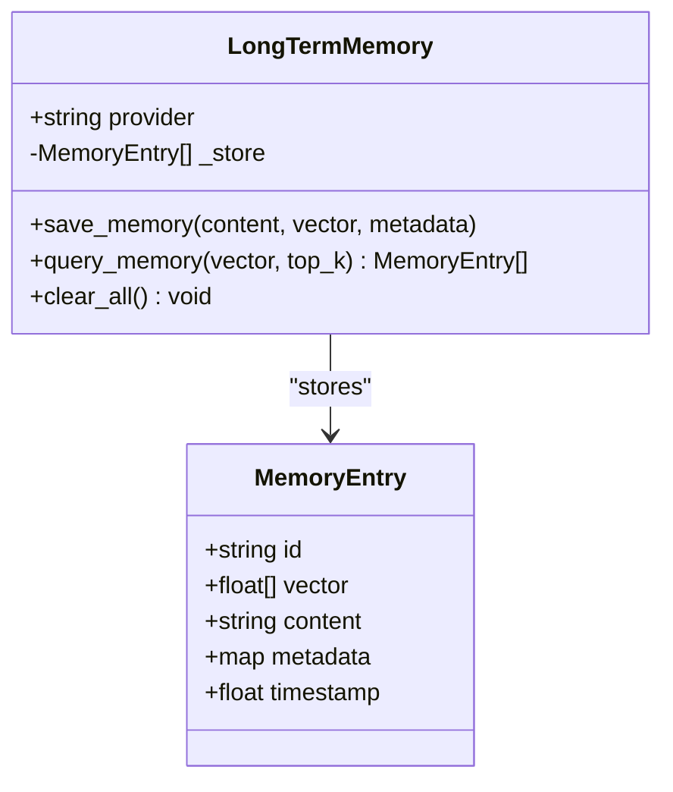
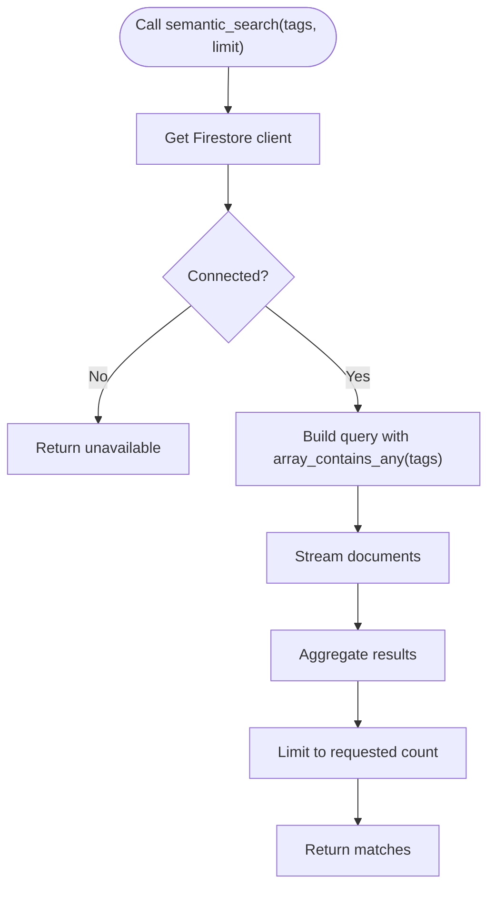
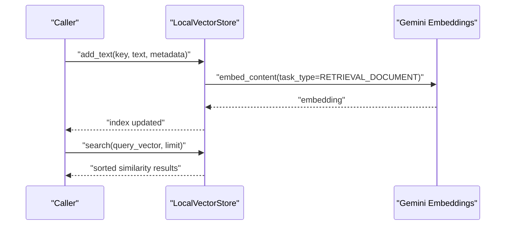
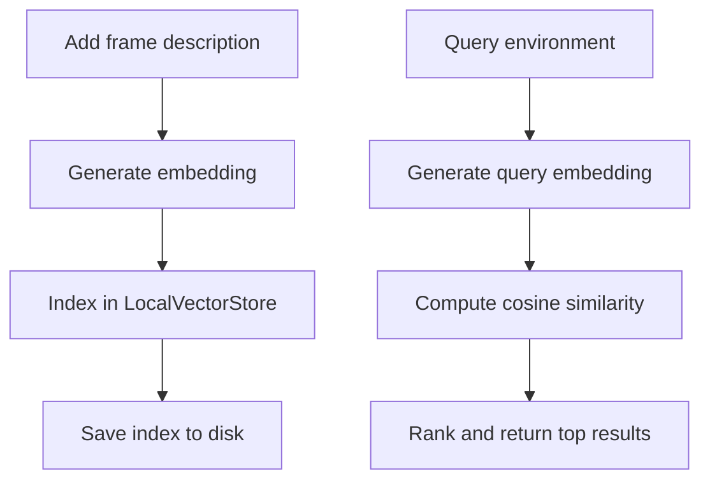
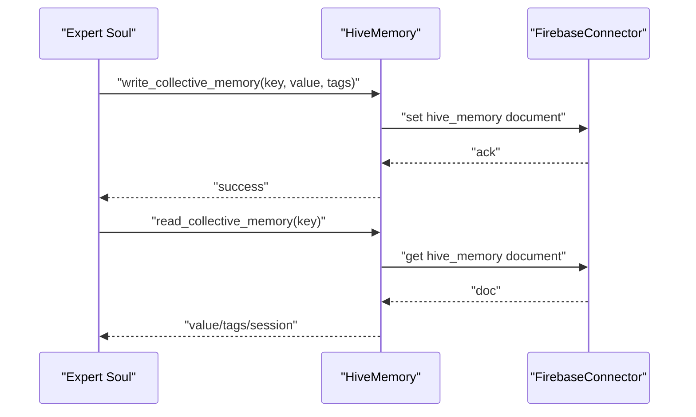
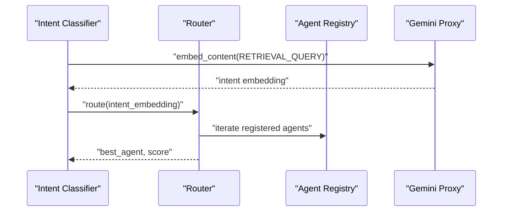
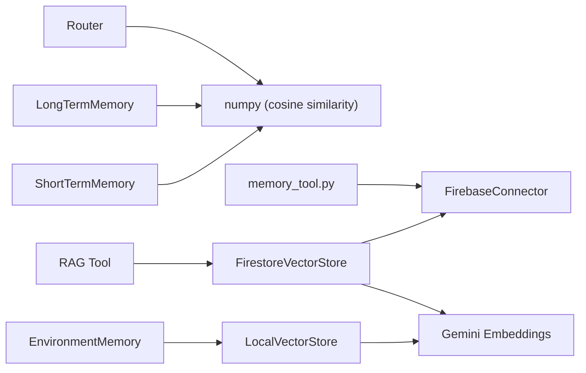

# Memory Tools

<cite>
**Referenced Files in This Document**
- [long_term.py](file://core/memory/long_term.py)
- [short_term.py](file://core/memory/short_term.py)
- [memory_tool.py](file://core/tools/memory_tool.py)
- [firestore_vector_store.py](file://core/tools/firestore_vector_store.py)
- [vector_store.py](file://core/tools/vector_store.py)
- [environment_memory.py](file://core/tools/environment_memory.py)
- [hive_memory.py](file://core/tools/hive_memory.py)
- [interface.py](file://core/infra/cloud/firebase/interface.py)
- [rag_tool.py](file://core/tools/rag_tool.py)
- [router.py](file://core/ai/router.py)
- [gemini_proxy.py](file://core/api/gemini_proxy.py)
</cite>

## Table of Contents
1. [Introduction](#introduction)
2. [Project Structure](#project-structure)
3. [Core Components](#core-components)
4. [Architecture Overview](#architecture-overview)
5. [Detailed Component Analysis](#detailed-component-analysis)
6. [Dependency Analysis](#dependency-analysis)
7. [Performance Considerations](#performance-considerations)
8. [Troubleshooting Guide](#troubleshooting-guide)
9. [Conclusion](#conclusion)
10. [Appendices](#appendices)

## Introduction
This document describes the memory tools category in the system, covering both short-term and long-term memory operations, vector storage integration, semantic search, and persistence mechanisms. It explains the interfaces for storing, retrieving, and managing contextual information, details integrations with vector databases and embedding models, and outlines query patterns, context management, optimization strategies, and lifecycle/cleanup procedures for working memory and persistent memory.

## Project Structure
The memory tooling spans Python modules under core/memory and core/tools, with persistence and vector operations backed by Firebase and Gemini embeddings. The structure supports:
- Short-term memory as a sliding window of recent interactions
- Long-term memory as a vectorized semantic store
- Persistent memory tools backed by Firestore
- Environment memory for visual history indexing
- Collective Hive memory for cross-session expert state
- Vector stores (local and cloud) for semantic similarity search

**Diagram sources**
- [short_term.py](file://core/memory/short_term.py#L28-L72)
- [long_term.py](file://core/memory/long_term.py#L24-L74)
- [memory_tool.py](file://core/tools/memory_tool.py#L40-L330)
- [vector_store.py](file://core/tools/vector_store.py#L21-L112)
- [firestore_vector_store.py](file://core/tools/firestore_vector_store.py#L22-L129)
- [environment_memory.py](file://core/tools/environment_memory.py#L21-L94)
- [hive_memory.py](file://core/tools/hive_memory.py#L25-L115)
- [interface.py](file://core/infra/cloud/firebase/interface.py#L15-L259)
- [router.py](file://core/ai/router.py#L66-L83)
- [rag_tool.py](file://core/tools/rag_tool.py#L26-L109)

**Section sources**
- [short_term.py](file://core/memory/short_term.py#L1-L72)
- [long_term.py](file://core/memory/long_term.py#L1-L74)
- [memory_tool.py](file://core/tools/memory_tool.py#L1-L330)
- [vector_store.py](file://core/tools/vector_store.py#L1-L112)
- [firestore_vector_store.py](file://core/tools/firestore_vector_store.py#L1-L129)
- [environment_memory.py](file://core/tools/environment_memory.py#L1-L94)
- [hive_memory.py](file://core/tools/hive_memory.py#L1-L115)
- [interface.py](file://core/infra/cloud/firebase/interface.py#L1-L259)
- [router.py](file://core/ai/router.py#L66-L83)
- [rag_tool.py](file://core/tools/rag_tool.py#L1-L109)

## Core Components
- ShortTermMemory: Rolling deque window of recent interactions with configurable token/message limits and context formatting for LLM prompts.
- LongTermMemory: Vector-based semantic memory with cosine similarity search and clear-all capability.
- Persistent Memory Tools: Save, recall, list, tag-based semantic search, and prune by priority using Firestore.
- LocalVectorStore: Lightweight local semantic index with embedding generation and cosine similarity search.
- FirestoreVectorStore: Cloud-native vector store using Gemini embeddings and Firestore persistence.
- EnvironmentMemory: Semantic indexing and retrieval of visual environment frames using LocalVectorStore.
- HiveMemory: Collective shared memory for expert souls across sessions.
- FirebaseConnector: Unified Firestore client initialization and session-scoped logging utilities.

**Section sources**
- [short_term.py](file://core/memory/short_term.py#L28-L72)
- [long_term.py](file://core/memory/long_term.py#L24-L74)
- [memory_tool.py](file://core/tools/memory_tool.py#L40-L330)
- [vector_store.py](file://core/tools/vector_store.py#L21-L112)
- [firestore_vector_store.py](file://core/tools/firestore_vector_store.py#L22-L129)
- [environment_memory.py](file://core/tools/environment_memory.py#L21-L94)
- [hive_memory.py](file://core/tools/hive_memory.py#L25-L115)
- [interface.py](file://core/infra/cloud/firebase/interface.py#L15-L259)

## Architecture Overview
The memory architecture integrates three layers:
- Working memory (short-term): fast deque window for current context.
- Episodic/semantic memory (long-term): vectorized recall for prior experiences.
- Persistent memory: Firestore-backed key-value memory with priority and tags, plus collective Hive memory.

**Diagram sources**
- [short_term.py](file://core/memory/short_term.py#L50-L64)
- [long_term.py](file://core/memory/long_term.py#L48-L68)
- [memory_tool.py](file://core/tools/memory_tool.py#L172-L211)
- [firestore_vector_store.py](file://core/tools/firestore_vector_store.py#L74-L121)
- [interface.py](file://core/infra/cloud/firebase/interface.py#L15-L259)

## Detailed Component Analysis

### Short-Term Memory
- Purpose: Maintain a high-frequency, bounded window of recent interactions to constrain prompt size and keep context fresh.
- Key behaviors:
  - Append new blocks with role, content, and metadata.
  - Return formatted context window for LLM consumption.
  - Clear working memory and expose last message accessor.
- Complexity:
  - Append and pop are O(1); formatting is O(n) with n being the window size.
- Tuning:
  - Adjust max_messages and max_tokens to balance relevance and cost.

**Diagram sources**
- [short_term.py](file://core/memory/short_term.py#L13-L72)

**Section sources**
- [short_term.py](file://core/memory/short_term.py#L28-L72)

### Long-Term Memory
- Purpose: Persistent semantic memory enabling recall of past experiences via vector similarity.
- Key behaviors:
  - Save memory entries with vector, content, metadata, and timestamp.
  - Query with cosine similarity and return top-k matches.
  - Clear all entries.
- Complexity:
  - Query scans all stored entries; O(n) per query with n being stored entries.
- Notes:
  - Provider abstraction allows plugging Pinecone, Firestore, or FAISS in future.

**Diagram sources**
- [long_term.py](file://core/memory/long_term.py#L12-L74)

**Section sources**
- [long_term.py](file://core/memory/long_term.py#L24-L74)

### Persistent Memory Tools (Firestore-backed)
- Purpose: Provide durable, taggable, priority-aware key-value memory with semantic search.
- Functions:
  - save_memory(key, value, priority, tags)
  - recall_memory(key)
  - list_memories(limit, priority)
  - semantic_search(tags, limit)
  - prune_memories(priority)
- Persistence:
  - Uses FirebaseConnector; falls back to local behavior when offline.
- Query patterns:
  - Priority filter via equality.
  - Tag-based search using array_contains_any.
- Cleanup:
  - Pruning removes low-importance memories.

**Diagram sources**
- [memory_tool.py](file://core/tools/memory_tool.py#L172-L211)
- [interface.py](file://core/infra/cloud/firebase/interface.py#L15-L259)

**Section sources**
- [memory_tool.py](file://core/tools/memory_tool.py#L40-L330)
- [interface.py](file://core/infra/cloud/firebase/interface.py#L31-L61)

### Vector Stores and Embedding Integration
- LocalVectorStore:
  - Embeds text using Gemini and stores vectors/metadata in-memory with optional pickle persistence.
  - Performs cosine similarity search across all indexed vectors.
- FirestoreVectorStore:
  - Embeds and persists vectors to Firestore; performs cosine similarity scan-and-compute for semantic search.
  - Provides query embedding generation.
- Integration points:
  - Used by EnvironmentMemory for visual history.
  - Used by RAG Tool for codebase search.

**Diagram sources**
- [vector_store.py](file://core/tools/vector_store.py#L66-L112)

**Section sources**
- [vector_store.py](file://core/tools/vector_store.py#L21-L112)
- [firestore_vector_store.py](file://core/tools/firestore_vector_store.py#L22-L129)
- [environment_memory.py](file://core/tools/environment_memory.py#L21-L94)
- [rag_tool.py](file://core/tools/rag_tool.py#L26-L109)

### Environment Memory
- Purpose: Index and retrieve semantic descriptions of visual frames to ground spatial/temporal context.
- Behavior:
  - Adds frame descriptions with metadata and incremental persistence.
  - Queries environment using vector similarity and returns matches with timestamps and offsets.
- Storage:
  - Uses LocalVectorStore with a dedicated index file.

**Diagram sources**
- [environment_memory.py](file://core/tools/environment_memory.py#L30-L82)
- [vector_store.py](file://core/tools/vector_store.py#L30-L82)

**Section sources**
- [environment_memory.py](file://core/tools/environment_memory.py#L21-L94)
- [vector_store.py](file://core/tools/vector_store.py#L21-L112)

### Hive Memory (Collective)
- Purpose: Shared, cross-session memory for expert souls to coordinate state and high-level intent.
- Operations:
  - write_collective_memory(key, value, tags)
  - read_collective_memory(key)
- Persistence:
  - Firestore-backed collection hive_memory with session scoping.

**Diagram sources**
- [hive_memory.py](file://core/tools/hive_memory.py#L25-L115)
- [interface.py](file://core/infra/cloud/firebase/interface.py#L15-L259)

**Section sources**
- [hive_memory.py](file://core/tools/hive_memory.py#L25-L115)
- [interface.py](file://core/infra/cloud/firebase/interface.py#L15-L259)

### Semantic Routing and Retrieval
- Router:
  - Performs semantic routing by comparing intent embedding against agent fingerprints using cosine similarity.
- Gemini Proxy:
  - Provides HTTP proxy to Gemini API for embedding generation and model inference.

**Diagram sources**
- [router.py](file://core/ai/router.py#L66-L83)
- [gemini_proxy.py](file://core/api/gemini_proxy.py#L30-L57)

**Section sources**
- [router.py](file://core/ai/router.py#L66-L83)
- [gemini_proxy.py](file://core/api/gemini_proxy.py#L30-L57)

## Dependency Analysis
- Short-term memory depends on Python stdlib collections and time for message blocks.
- Long-term memory depends on numpy for cosine similarity.
- Persistent memory tools depend on FirebaseConnector for Firestore access.
- Vector stores depend on Gemini genai client and numpy for embeddings and similarity.
- Environment memory composes LocalVectorStore and persists via pickle.
- Hive memory composes FirebaseConnector for shared state.
- Router depends on numpy for cosine similarity and agent registry for fingerprint comparison.

**Diagram sources**
- [short_term.py](file://core/memory/short_term.py#L1-L72)
- [long_term.py](file://core/memory/long_term.py#L1-L74)
- [memory_tool.py](file://core/tools/memory_tool.py#L1-L330)
- [vector_store.py](file://core/tools/vector_store.py#L1-L112)
- [firestore_vector_store.py](file://core/tools/firestore_vector_store.py#L1-L129)
- [environment_memory.py](file://core/tools/environment_memory.py#L1-L94)
- [hive_memory.py](file://core/tools/hive_memory.py#L1-L115)
- [interface.py](file://core/infra/cloud/firebase/interface.py#L1-L259)
- [router.py](file://core/ai/router.py#L66-L83)
- [rag_tool.py](file://core/tools/rag_tool.py#L1-L109)

**Section sources**
- [short_term.py](file://core/memory/short_term.py#L1-L72)
- [long_term.py](file://core/memory/long_term.py#L1-L74)
- [memory_tool.py](file://core/tools/memory_tool.py#L1-L330)
- [vector_store.py](file://core/tools/vector_store.py#L1-L112)
- [firestore_vector_store.py](file://core/tools/firestore_vector_store.py#L1-L129)
- [environment_memory.py](file://core/tools/environment_memory.py#L1-L94)
- [hive_memory.py](file://core/tools/hive_memory.py#L1-L115)
- [interface.py](file://core/infra/cloud/firebase/interface.py#L1-L259)
- [router.py](file://core/ai/router.py#L66-L83)
- [rag_tool.py](file://core/tools/rag_tool.py#L1-L109)

## Performance Considerations
- Short-term memory
  - Keep max_messages and max_tokens tuned to target model context windows to reduce cost and latency.
  - Use get_context_window with explicit limits to cap payload size.
- Long-term memory
  - Expect O(n) query cost; consider indexing strategies or provider-specific vector DBs for large corpora.
- Vector stores
  - LocalVectorStore: Embedding generation is synchronous; batch operations where possible.
  - FirestoreVectorStore: Current implementation scans all vectors; production should leverage native vector search extensions or Vertex AI Search.
- Semantic search
  - Cosine similarity is O(d) per vector; pre-normalize vectors if feasible and cache embeddings for repeated queries.
- Persistence
  - Firestore writes incur network latency; batch writes and use incremental saves for environment memory index.
- Memory hygiene
  - Use prune_memories to remove low-importance items periodically.
  - Clear working memory when switching topics or sessions.

[No sources needed since this section provides general guidance]

## Troubleshooting Guide
- Firebase offline
  - Symptom: Persistent memory tools return offline/unavailable.
  - Action: Initialize FirebaseConnector; verify credentials and connectivity.
- Memory tool failures
  - Symptom: Save/recall/list/semantic/prune return error.
  - Action: Check Firestore permissions, collection names, and network.
- Vector store failures
  - Symptom: Embedding generation or search fails.
  - Action: Verify Google API key, Gemini model availability, and network.
- Environment memory not saving
  - Symptom: Index not persisted across runs.
  - Action: Confirm pickle path and permissions; ensure incremental save after add.
- Hive memory offline
  - Symptom: Collective memory write/read fails.
  - Action: Ensure FirebaseConnector is initialized and hive_memory collection exists.

**Section sources**
- [memory_tool.py](file://core/tools/memory_tool.py#L56-L93)
- [firestore_vector_store.py](file://core/tools/firestore_vector_store.py#L44-L73)
- [environment_memory.py](file://core/tools/environment_memory.py#L54-L56)
- [hive_memory.py](file://core/tools/hive_memory.py#L37-L58)
- [interface.py](file://core/infra/cloud/firebase/interface.py#L31-L61)

## Conclusion
The memory tools category provides a layered memory system: fast short-term context, vectorized long-term recall, durable persistent memory with semantic tagging, and collective shared state. Integrations with Firebase and Gemini enable scalable semantic search and embedding generation. Proper tuning of window sizes, pruning policies, and vector search strategies ensures efficient retrieval and storage while maintaining system responsiveness.

[No sources needed since this section summarizes without analyzing specific files]

## Appendices

### Example Memory Operations and Query Patterns
- Store a user preference with priority and tags; recall by key; list with priority filter; prune low-importance items.
- Semantic search by tags to retrieve related memories.
- Environment memory: add frame description; query environment with a spatial/temporal query.
- RAG search across the codebase using semantic similarity.
- Collective memory: write/read expert state for cross-session continuity.

**Section sources**
- [memory_tool.py](file://core/tools/memory_tool.py#L40-L330)
- [environment_memory.py](file://core/tools/environment_memory.py#L30-L82)
- [rag_tool.py](file://core/tools/rag_tool.py#L26-L109)
- [hive_memory.py](file://core/tools/hive_memory.py#L25-L115)