# Search Tools

<cite>
**Referenced Files in This Document**
- [search_tool.py](file://core/tools/search_tool.py)
- [vector_store.py](file://core/tools/vector_store.py)
- [firestore_vector_store.py](file://core/tools/firestore_vector_store.py)
- [code_indexer.py](file://core/tools/code_indexer.py)
- [rag_tool.py](file://core/tools/rag_tool.py)
- [environment_memory.py](file://core/tools/environment_memory.py)
- [context_scraper.py](file://core/tools/context_scraper.py)
- [memory_tool.py](file://core/tools/memory_tool.py)
- [hive_memory.py](file://core/tools/hive_memory.py)
- [interface.py](file://core/infra/cloud/firebase/interface.py)
- [queries.py](file://core/infra/cloud/firebase/queries.py)
- [schemas.py](file://core/infra/cloud/firebase/schemas.py)
- [requirements.txt](file://requirements.txt)
</cite>

## Table of Contents
1. [Introduction](#introduction)
2. [Project Structure](#project-structure)
3. [Core Components](#core-components)
4. [Architecture Overview](#architecture-overview)
5. [Detailed Component Analysis](#detailed-component-analysis)
6. [Dependency Analysis](#dependency-analysis)
7. [Performance Considerations](#performance-considerations)
8. [Troubleshooting Guide](#troubleshooting-guide)
9. [Conclusion](#conclusion)
10. [Appendices](#appendices)

## Introduction
This document describes the search tools category within the Aether Voice OS. It covers content retrieval, indexing, and intelligent search capabilities across local and cloud environments. It explains search algorithms, indexing strategies, query processing mechanisms, and the interfaces for content discovery, relevance ranking, and result filtering. It also addresses performance considerations for large-scale content indexing, caching strategies, and search result ranking, and documents the relationship between search tools and memory systems, including semantic search and context-aware retrieval.

## Project Structure
The search tools ecosystem spans several modules:
- Local and cloud vector stores for semantic search
- Codebase indexing and retrieval via RAG
- Environment memory for spatial grounding
- Context scraping for real-time external knowledge
- Persistent memory tools for recall and semantic search
- Firebase infrastructure for cloud persistence and caching

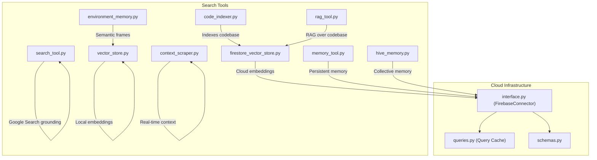

**Diagram sources**
- [search_tool.py](file://core/tools/search_tool.py#L26-L50)
- [vector_store.py](file://core/tools/vector_store.py#L21-L112)
- [firestore_vector_store.py](file://core/tools/firestore_vector_store.py#L22-L129)
- [code_indexer.py](file://core/tools/code_indexer.py#L56-L131)
- [rag_tool.py](file://core/tools/rag_tool.py#L26-L109)
- [environment_memory.py](file://core/tools/environment_memory.py#L21-L94)
- [context_scraper.py](file://core/tools/context_scraper.py#L8-L146)
- [memory_tool.py](file://core/tools/memory_tool.py#L40-L330)
- [hive_memory.py](file://core/tools/hive_memory.py#L25-L115)
- [interface.py](file://core/infra/cloud/firebase/interface.py#L15-L259)
- [queries.py](file://core/infra/cloud/firebase/queries.py#L20-L74)
- [schemas.py](file://core/infra/cloud/firebase/schemas.py#L30-L38)

**Section sources**
- [search_tool.py](file://core/tools/search_tool.py#L1-L51)
- [vector_store.py](file://core/tools/vector_store.py#L1-L112)
- [firestore_vector_store.py](file://core/tools/firestore_vector_store.py#L1-L129)
- [code_indexer.py](file://core/tools/code_indexer.py#L1-L131)
- [rag_tool.py](file://core/tools/rag_tool.py#L1-L109)
- [environment_memory.py](file://core/tools/environment_memory.py#L1-L94)
- [context_scraper.py](file://core/tools/context_scraper.py#L1-L146)
- [memory_tool.py](file://core/tools/memory_tool.py#L1-L330)
- [hive_memory.py](file://core/tools/hive_memory.py#L1-L115)
- [interface.py](file://core/infra/cloud/firebase/interface.py#L1-L259)
- [queries.py](file://core/infra/cloud/firebase/queries.py#L1-L74)
- [schemas.py](file://core/infra/cloud/firebase/schemas.py#L1-L38)

## Core Components
- Local Vector Store: Lightweight semantic index using embeddings and cosine similarity for local search.
- Cloud Vector Store: Firestore-backed vector store for enterprise-scale retrieval with embedding generation.
- Codebase Indexer: Script to chunk and embed codebase content and upload to the cloud vector store.
- RAG Tool: Semantic search over the codebase for discovery and debugging.
- Environment Memory: Semantic indexing of visual frames for spatial grounding.
- Context Scraper: Real-time web scraping for StackOverflow, GitHub, and Hacker News to augment context.
- Memory Tools: Persistent memory with recall, listing, semantic tag search, and pruning.
- Hive Memory: Collective memory for cross-session and cross-agent state sharing.
- Firebase Connector: Cloud persistence layer with session logging, telemetry, and repair events.

**Section sources**
- [vector_store.py](file://core/tools/vector_store.py#L21-L112)
- [firestore_vector_store.py](file://core/tools/firestore_vector_store.py#L22-L129)
- [code_indexer.py](file://core/tools/code_indexer.py#L56-L131)
- [rag_tool.py](file://core/tools/rag_tool.py#L26-L109)
- [environment_memory.py](file://core/tools/environment_memory.py#L21-L94)
- [context_scraper.py](file://core/tools/context_scraper.py#L8-L146)
- [memory_tool.py](file://core/tools/memory_tool.py#L40-L330)
- [hive_memory.py](file://core/tools/hive_memory.py#L25-L115)
- [interface.py](file://core/infra/cloud/firebase/interface.py#L15-L259)

## Architecture Overview
The search architecture integrates local and cloud components:
- Embedding generation via Gemini
- Local and cloud vector stores for semantic similarity search
- Codebase indexing pipeline and RAG retrieval
- Environment memory for vision-grounded search
- Real-time context scraping for external knowledge
- Persistent memory and collective memory for recall and cross-agent collaboration

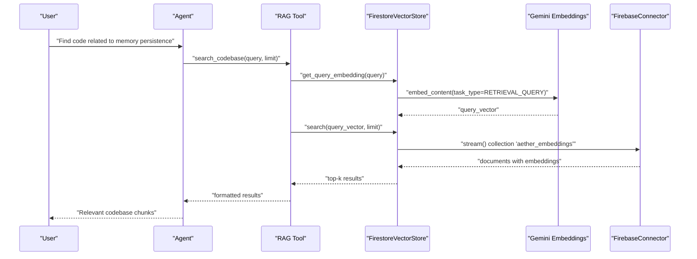

**Diagram sources**
- [rag_tool.py](file://core/tools/rag_tool.py#L26-L77)
- [firestore_vector_store.py](file://core/tools/firestore_vector_store.py#L74-L129)
- [interface.py](file://core/infra/cloud/firebase/interface.py#L15-L259)

## Detailed Component Analysis

### Local Vector Store
The Local Vector Store provides a lightweight, local-first semantic index:
- Embedding generation using Gemini
- Cosine similarity scoring
- Pickle-based persistence for quick reloads

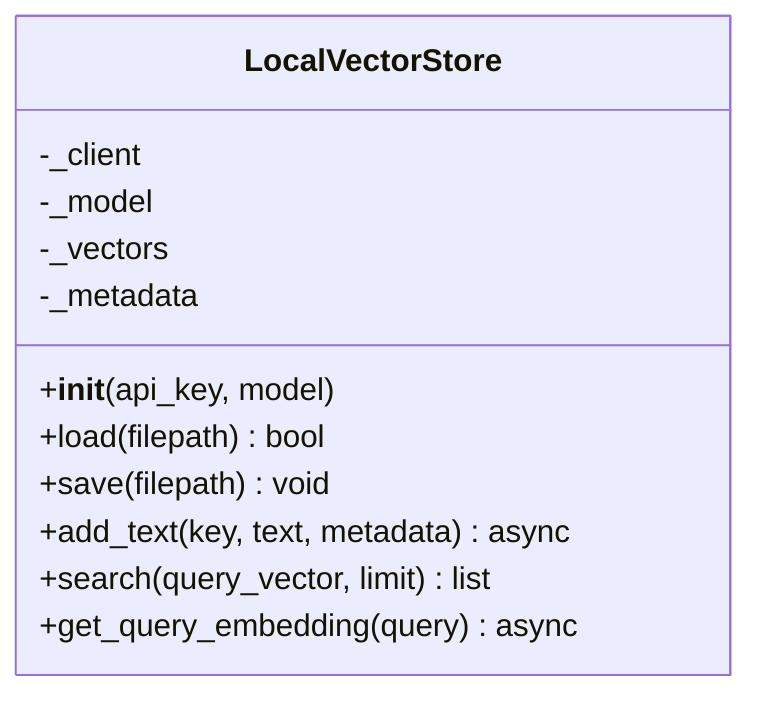

**Diagram sources**
- [vector_store.py](file://core/tools/vector_store.py#L21-L112)

**Section sources**
- [vector_store.py](file://core/tools/vector_store.py#L21-L112)

### Cloud Vector Store (Firestore RAG)
The Cloud Vector Store scales semantic search to enterprise-grade workloads:
- Embedding generation via Gemini
- Firestore persistence with sanitized keys
- Prototype similarity scan-and-compute approach
- Local caching for reduced cloud calls

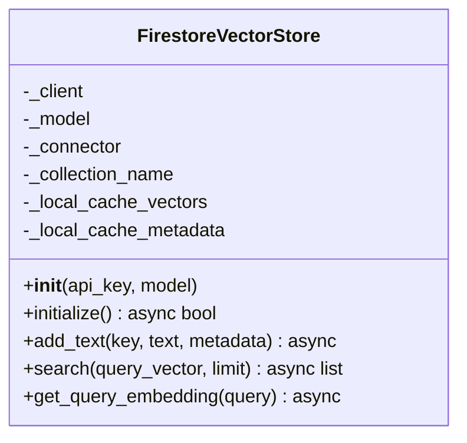

**Diagram sources**
- [firestore_vector_store.py](file://core/tools/firestore_vector_store.py#L22-L129)

**Section sources**
- [firestore_vector_store.py](file://core/tools/firestore_vector_store.py#L22-L129)

### Codebase Indexer and RAG Tool
The codebase indexer chunks and embeds files, uploading to the cloud vector store. The RAG tool performs semantic search over the indexed codebase.

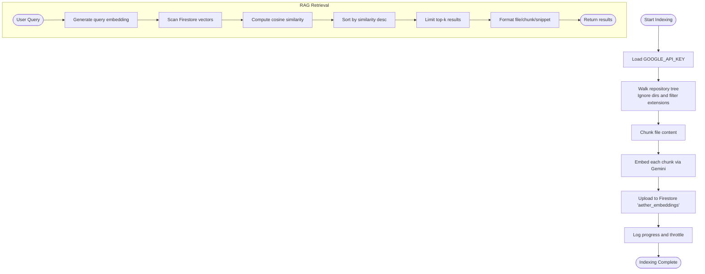

**Diagram sources**
- [code_indexer.py](file://core/tools/code_indexer.py#L56-L131)
- [firestore_vector_store.py](file://core/tools/firestore_vector_store.py#L74-L129)
- [rag_tool.py](file://core/tools/rag_tool.py#L26-L77)

**Section sources**
- [code_indexer.py](file://core/tools/code_indexer.py#L1-L131)
- [rag_tool.py](file://core/tools/rag_tool.py#L1-L109)

### Environment Memory
Environment Memory indexes visual frame descriptions using the Local Vector Store and supports semantic queries over past visual states.

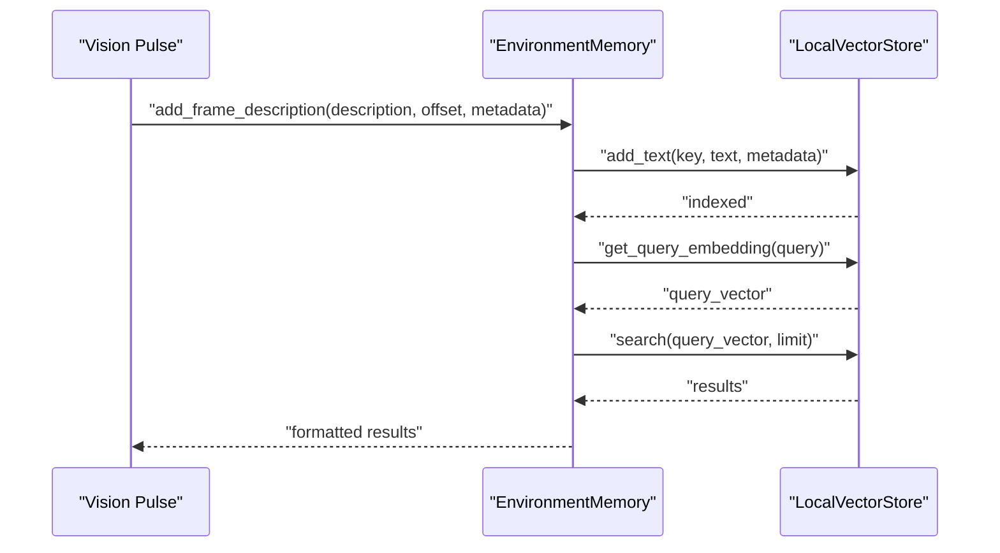

**Diagram sources**
- [environment_memory.py](file://core/tools/environment_memory.py#L30-L82)
- [vector_store.py](file://core/tools/vector_store.py#L66-L112)

**Section sources**
- [environment_memory.py](file://core/tools/environment_memory.py#L1-L94)
- [vector_store.py](file://core/tools/vector_store.py#L1-L112)

### Context Scraper
The Context Scraper pulls real-time solutions from StackOverflow, GitHub Issues, and Hacker News, formatting results for the agent.

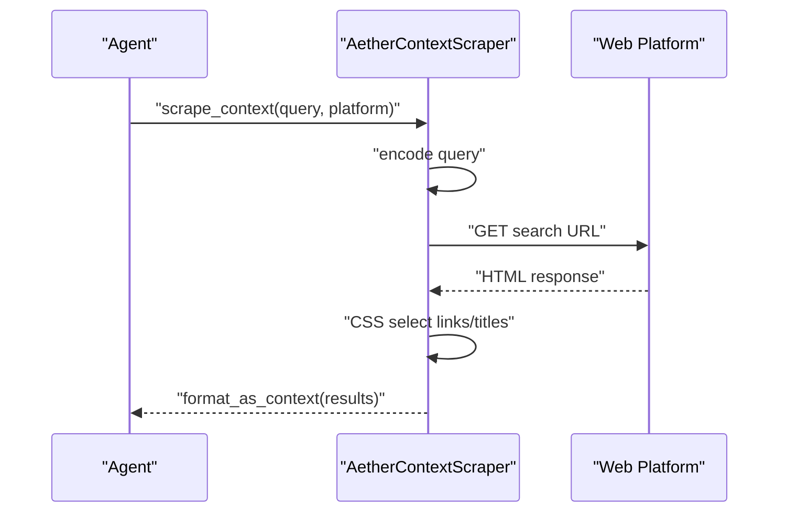

**Diagram sources**
- [context_scraper.py](file://core/tools/context_scraper.py#L19-L97)

**Section sources**
- [context_scraper.py](file://core/tools/context_scraper.py#L1-L146)

### Persistent Memory Tools
Memory tools provide saving, recalling, listing, semantic tag search, and pruning of memories backed by Firestore.

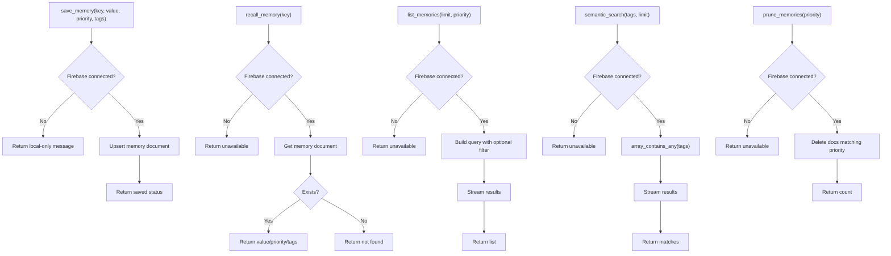

**Diagram sources**
- [memory_tool.py](file://core/tools/memory_tool.py#L40-L330)

**Section sources**
- [memory_tool.py](file://core/tools/memory_tool.py#L1-L330)

### Hive Collective Memory
Hive Memory enables cross-session and cross-agent state sharing via Firestore.

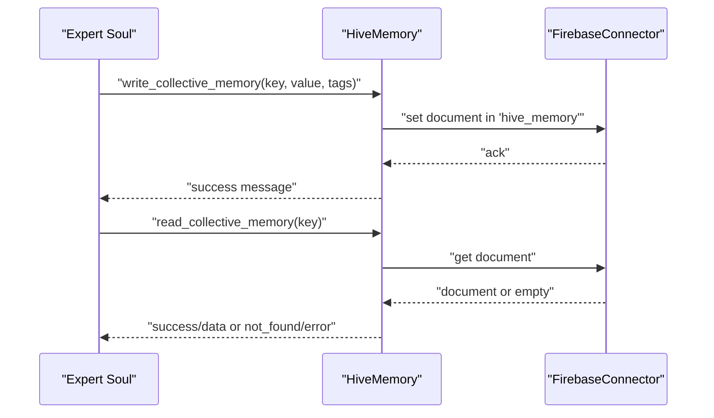

**Diagram sources**
- [hive_memory.py](file://core/tools/hive_memory.py#L25-L115)
- [interface.py](file://core/infra/cloud/firebase/interface.py#L15-L259)

**Section sources**
- [hive_memory.py](file://core/tools/hive_memory.py#L1-L115)
- [interface.py](file://core/infra/cloud/firebase/interface.py#L1-L259)

### Google Search Grounding Tool
The Google Search grounding tool integrates with Gemini Live to provide factual, grounded answers with citations.

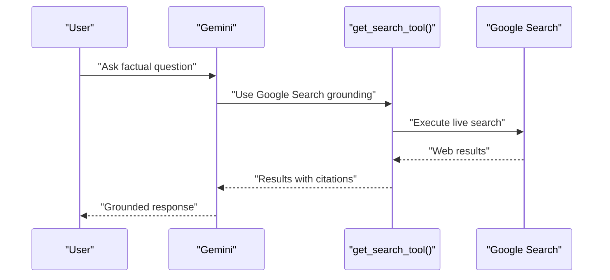

**Diagram sources**
- [search_tool.py](file://core/tools/search_tool.py#L26-L38)

**Section sources**
- [search_tool.py](file://core/tools/search_tool.py#L1-L51)

## Dependency Analysis
External dependencies relevant to search tools include:
- google-genai for embeddings and grounding
- firebase-admin and google-cloud-firestore for cloud persistence
- numpy for vector math
- scrapling for web scraping

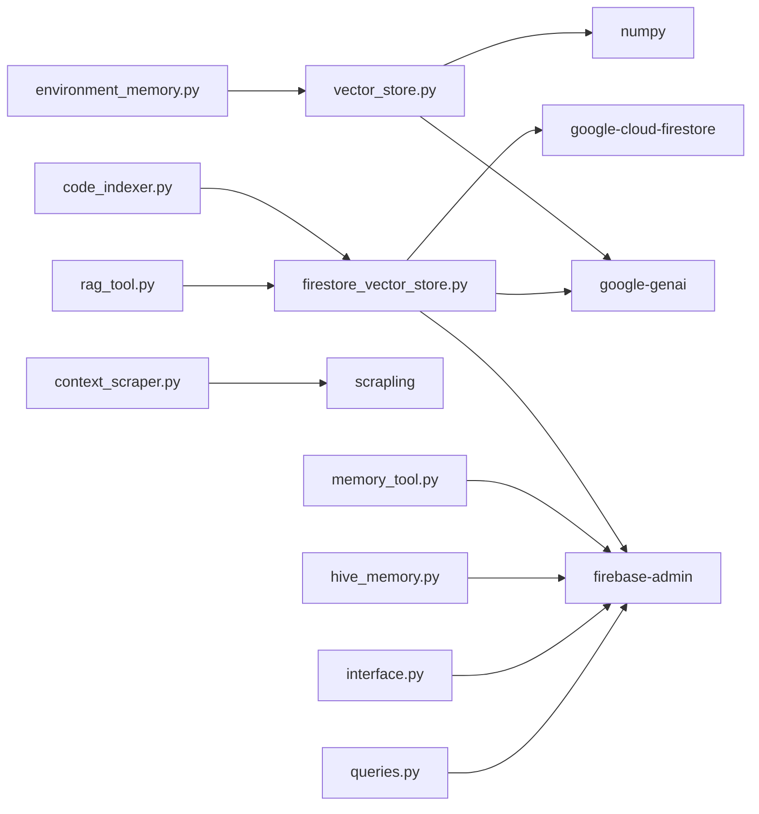

**Diagram sources**
- [requirements.txt](file://requirements.txt#L2-L11)
- [vector_store.py](file://core/tools/vector_store.py#L15-L16)
- [firestore_vector_store.py](file://core/tools/firestore_vector_store.py#L14-L15)
- [code_indexer.py](file://core/tools/code_indexer.py#L13)
- [rag_tool.py](file://core/tools/rag_tool.py#L12)
- [environment_memory.py](file://core/tools/environment_memory.py#L13)
- [context_scraper.py](file://core/tools/context_scraper.py#L5)
- [memory_tool.py](file://core/tools/memory_tool.py#L23-L30)
- [hive_memory.py](file://core/tools/hive_memory.py#L16-L22)
- [interface.py](file://core/infra/cloud/firebase/interface.py#L7-L8)
- [queries.py](file://core/infra/cloud/firebase/queries.py#L6-L9)

**Section sources**
- [requirements.txt](file://requirements.txt#L1-L52)
- [vector_store.py](file://core/tools/vector_store.py#L1-L112)
- [firestore_vector_store.py](file://core/tools/firestore_vector_store.py#L1-L129)
- [code_indexer.py](file://core/tools/code_indexer.py#L1-L131)
- [rag_tool.py](file://core/tools/rag_tool.py#L1-L109)
- [environment_memory.py](file://core/tools/environment_memory.py#L1-L94)
- [context_scraper.py](file://core/tools/context_scraper.py#L1-L146)
- [memory_tool.py](file://core/tools/memory_tool.py#L1-L330)
- [hive_memory.py](file://core/tools/hive_memory.py#L1-L115)
- [interface.py](file://core/infra/cloud/firebase/interface.py#L1-L259)
- [queries.py](file://core/infra/cloud/firebase/queries.py#L1-L74)

## Performance Considerations
- Embedding generation cost: Batch and throttle requests to Gemini to avoid rate limits.
- Vector search scaling: The Firestore prototype performs a scan-and-compute approach; in production, use native vector search extensions or Vertex AI Search to reduce latency and cost.
- Local caching: Use local caches for embeddings and frequent queries to minimize cloud calls.
- Query latency tiers: Tools expose latency tier hints to guide orchestration prioritization.
- Rate limiting: Introduce semaphores and backoff for embedding and upload operations.
- Index maintenance: Periodically rebuild indices after major codebase changes to keep embeddings fresh.

[No sources needed since this section provides general guidance]

## Troubleshooting Guide
Common issues and resolutions:
- Missing Google API key: Ensure the environment variable is present for embedding operations.
- Firebase connectivity: Verify initialization and credentials; offline mode falls back gracefully for some tools.
- Empty or stale indices: Re-run the codebase indexer to refresh embeddings.
- Slow retrieval: Enable local caching and consider upgrading to native vector search in Firestore.
- Web scraping failures: Confirm network access and platform URLs; handle exceptions and return structured error messages.

**Section sources**
- [code_indexer.py](file://core/tools/code_indexer.py#L56-L131)
- [firestore_vector_store.py](file://core/tools/firestore_vector_store.py#L33-L73)
- [context_scraper.py](file://core/tools/context_scraper.py#L59-L60)
- [memory_tool.py](file://core/tools/memory_tool.py#L56-L92)
- [hive_memory.py](file://core/tools/hive_memory.py#L37-L58)

## Conclusion
The search tools category integrates local and cloud semantic search, codebase RAG, environment memory, real-time context scraping, and persistent/collaborative memory systems. By leveraging embeddings, cosine similarity, and Firestore-backed persistence, the system supports intelligent content discovery, relevance ranking, and result filtering. Performance is optimized through local caching, batching, and production-ready vector search extensions, while resilience is ensured via offline fallbacks and graceful degradation.

[No sources needed since this section summarizes without analyzing specific files]

## Appendices

### Search Patterns and Query Optimization
- Chunking strategies: Use overlapping chunks to preserve context boundaries.
- Query decomposition: Break complex queries into focused sub-queries for multi-stage retrieval.
- Metadata enrichment: Attach file paths, line numbers, and timestamps to improve result interpretability.
- Hybrid ranking: Combine semantic similarity with lexical match scores and recency signals.

[No sources needed since this section provides general guidance]

### Integration with External Search Services
- Google Search grounding: Use the dedicated tool to provide grounded responses with citations.
- Web scraping: Pull real-time context from StackOverflow, GitHub, and Hacker News to address outdated knowledge.
- Production vector search: Replace prototype scan-and-compute with native Firestore vector search or Vertex AI Search.

**Section sources**
- [search_tool.py](file://core/tools/search_tool.py#L26-L38)
- [context_scraper.py](file://core/tools/context_scraper.py#L19-L97)
- [firestore_vector_store.py](file://core/tools/firestore_vector_store.py#L74-L82)