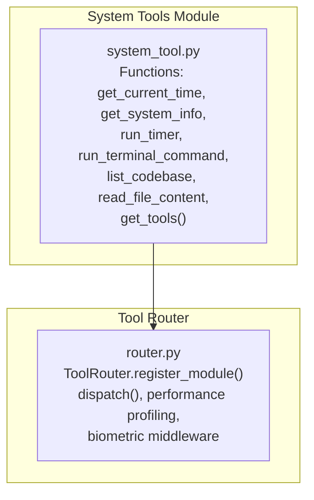
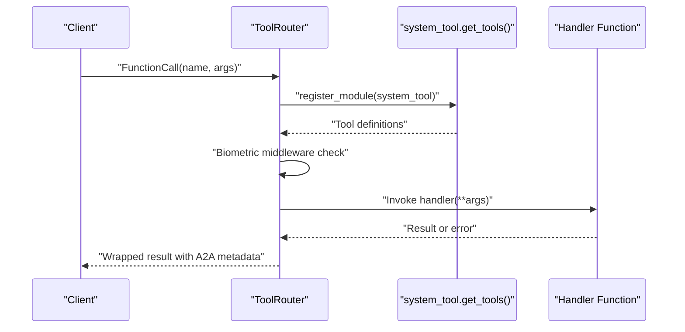
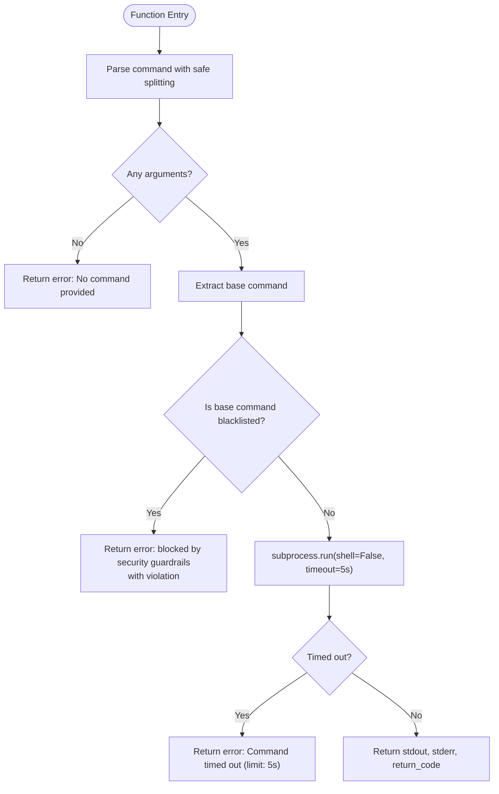
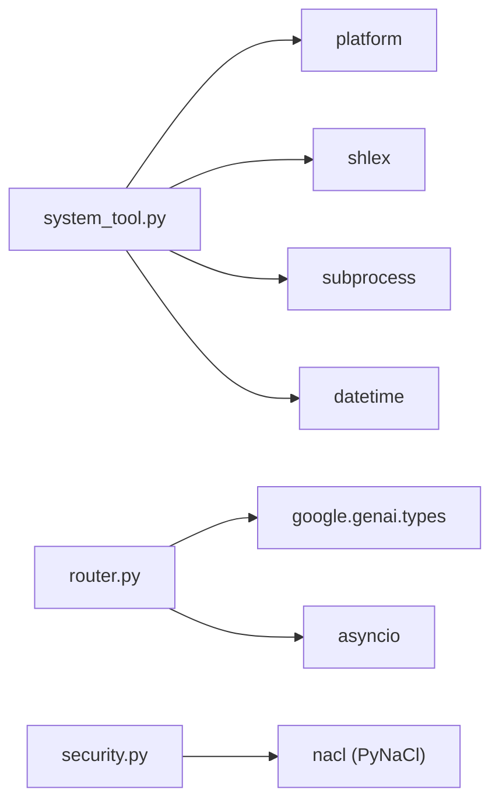

# System Tools

<cite>
**Referenced Files in This Document**
- [system_tool.py](file://core/tools/system_tool.py)
- [router.py](file://core/tools/router.py)
- [test_system_tool.py](file://tests/test_system_tool.py)
- [test_neural_dispatcher.py](file://tests/integration/test_neural_dispatcher.py)
- [security.py](file://core/utils/security.py)
</cite>

## Table of Contents
1. [Introduction](#introduction)
2. [Project Structure](#project-structure)
3. [Core Components](#core-components)
4. [Architecture Overview](#architecture-overview)
5. [Detailed Component Analysis](#detailed-component-analysis)
6. [Dependency Analysis](#dependency-analysis)
7. [Performance Considerations](#performance-considerations)
8. [Troubleshooting Guide](#troubleshooting-guide)
9. [Conclusion](#conclusion)
10. [Appendices](#appendices)

## Introduction
This document describes the System Tools category, focusing on local system command execution capabilities, time and date retrieval, system information gathering, timer functionality, and safe terminal command execution. It explains the security measures including command blacklisting, timeout restrictions, and sandbox isolation, and details the parameter schemas for each system tool function. It also provides examples of secure command execution patterns, file system operations, and system diagnostics, along with security considerations, command validation, and resource limitations. Finally, it outlines usage scenarios for common system administration tasks and developer workflow support.

## Project Structure
The System Tools are implemented as a module with a set of pure functions that return structured data. They are registered with the ToolRouter, which manages tool discovery, dispatch, and response wrapping. Security is enforced at the command execution level with a blacklist, strict timeouts, and shell-safe invocation.

**Diagram sources**
- [system_tool.py](file://core/tools/system_tool.py#L198-L310)
- [router.py](file://core/tools/router.py#L183-L200)

**Section sources**
- [system_tool.py](file://core/tools/system_tool.py#L1-L310)
- [router.py](file://core/tools/router.py#L1-L360)

## Core Components
- Time and Date Retrieval: Provides local time, date, UTC time, timezone, and Unix timestamp.
- System Information Gathering: Returns OS, OS version, machine, hostname, and Python version.
- Timer Functionality: Acknowledges timer requests with a label and duration.
- Safe Terminal Command Execution: Executes read-only or safe commands with strict safety controls.
- Codebase Listing: Produces a flat list of files in the project while ignoring common artifacts.
- File Content Reading: Reads text content of a file with a character limit to prevent memory issues.

**Section sources**
- [system_tool.py](file://core/tools/system_tool.py#L36-L196)

## Architecture Overview
The System Tools are auto-discovered by the ToolRouter via the module’s get_tools() function. Each tool definition includes a name, description, JSON Schema parameters, and a handler. The ToolRouter dispatches incoming tool calls, applies biometric middleware for sensitive tools, and wraps results with A2A metadata.

**Diagram sources**
- [router.py](file://core/tools/router.py#L183-L200)
- [router.py](file://core/tools/router.py#L234-L360)
- [system_tool.py](file://core/tools/system_tool.py#L198-L310)

## Detailed Component Analysis

### Time and Date Retrieval: get_current_time
- Purpose: Returns the current local time, date, UTC time, timezone, and Unix timestamp.
- Parameters: None.
- Output keys: local_time, local_date, utc_time, timezone, unix_timestamp.
- Notes: Pure function with no side effects; suitable for frequent queries.

**Section sources**
- [system_tool.py](file://core/tools/system_tool.py#L36-L53)

### System Information Gathering: get_system_info
- Purpose: Returns host system information including OS, OS version, machine, hostname, and Python version.
- Parameters: None.
- Output keys: os, os_version, machine, hostname, python_version.

**Section sources**
- [system_tool.py](file://core/tools/system_tool.py#L56-L64)

### Timer Functionality: run_timer
- Purpose: Acknowledges a timer request with a label and duration; returns a future fire time.
- Parameters:
  - minutes (integer, required): Number of minutes for the timer.
  - label (string, optional): A label for the timer.
- Output keys: status, label, duration_minutes, will_fire_at, message.

**Section sources**
- [system_tool.py](file://core/tools/system_tool.py#L67-L84)

### Safe Terminal Command Execution: run_terminal_command
- Purpose: Executes a read-only or safe terminal command with strong security controls.
- Parameters:
  - command (string, required): The terminal command to run.
- Security controls:
  - Shell-safe parsing: Uses safe splitting to avoid shell injection.
  - Blacklist enforcement: Blocks dangerous commands (e.g., rm, sudo, kill, shutdown, reboot, dd, mv, mkfs, and a known shellshock variant).
  - Timeout: Enforced at 5 seconds.
  - Isolation: shell=False prevents shell interpretation.
- Output keys: stdout, stderr, return_code; on error: error and violation (when blocked).

**Diagram sources**
- [system_tool.py](file://core/tools/system_tool.py#L87-L131)

**Section sources**
- [system_tool.py](file://core/tools/system_tool.py#L87-L131)
- [test_system_tool.py](file://tests/test_system_tool.py#L6-L68)

### Codebase Listing: list_codebase
- Purpose: Returns a flat list of files in the project directory, ignoring common artifacts.
- Parameters:
  - path (string, optional): Directory to list (default: current directory).
- Output keys: status, file_count, files (limited to 500 entries), truncated.
- Notes: Ignores directories like .git, __pycache__, node_modules, .next, .venv, out, build.

**Section sources**
- [system_tool.py](file://core/tools/system_tool.py#L137-L171)

### File Content Reading: read_file_content
- Purpose: Reads the text content of a file with a character limit to prevent memory issues.
- Parameters:
  - filepath (string, required): Path to the file to read.
- Output keys: status, content (up to 10,000 characters), truncated, size_bytes.
- Notes: Returns an error if the file does not exist.

**Section sources**
- [system_tool.py](file://core/tools/system_tool.py#L173-L196)

### Tool Registration and Discovery: get_tools()
- Purpose: Auto-discovers and registers all system tools with the ToolRouter.
- Tool definitions include:
  - get_current_time: no parameters.
  - get_system_info: no parameters.
  - run_timer: minutes (required), label (optional).
  - run_terminal_command: command (required).
  - list_codebase: path (optional).
  - read_file_content: filepath (required).
- Latency tiers and idempotency are annotated for performance routing.

**Section sources**
- [system_tool.py](file://core/tools/system_tool.py#L198-L310)

## Dependency Analysis
- Module-level dependency: system_tool.py depends on Python standard library modules for time, platform, subprocess, and shlex.
- Router dependency: router.py depends on google.genai types for function declarations and asyncio for performance profiling and dispatch.
- Security utilities: security.py provides cryptographic primitives unrelated to system_tool.py but part of the broader security toolkit.

**Diagram sources**
- [system_tool.py](file://core/tools/system_tool.py#L14-L18)
- [router.py](file://core/tools/router.py#L26-L28)
- [security.py](file://core/utils/security.py#L10-L14)

**Section sources**
- [system_tool.py](file://core/tools/system_tool.py#L14-L18)
- [router.py](file://core/tools/router.py#L26-L28)
- [security.py](file://core/utils/security.py#L10-L14)

## Performance Considerations
- Latency tiers: Tools are annotated with latency tiers (e.g., low_latency) to guide routing and prioritization.
- Profiling: ToolRouter records execution durations and computes p50, p95, and p99 latency percentiles for performance insights.
- Resource limits:
  - Command timeout: 5 seconds for terminal commands.
  - File read limit: 10,000 characters to prevent memory pressure.
  - Codebase listing truncation: 500 files maximum to avoid context overflow.

**Section sources**
- [system_tool.py](file://core/tools/system_tool.py#L214-L216)
- [router.py](file://core/tools/router.py#L87-L118)
- [router.py](file://core/tools/router.py#L357-L360)

## Troubleshooting Guide
Common issues and resolutions:
- Command blocked by security guardrails:
  - Symptom: Error response indicating the command was blocked.
  - Cause: Base command is in the blacklist.
  - Resolution: Use allowed commands (e.g., echo, ls, cat, grep) or restructure the task to avoid blacklisted operations.
- Command timed out:
  - Symptom: Error response stating the command timed out.
  - Cause: Execution exceeded the 5-second limit.
  - Resolution: Simplify the command or split it into smaller steps.
- Shell injection attempts:
  - Symptom: Unexpected behavior or literal arguments containing shell operators.
  - Cause: shell=False prevents shell interpretation; operators are treated as literal arguments.
  - Resolution: Ensure commands are properly quoted and avoid relying on shell features.
- File not found:
  - Symptom: Error response indicating the file does not exist.
  - Cause: Invalid filepath or missing file.
  - Resolution: Verify the path and permissions.

Validation and tests:
- Allowed command execution passes with zero return code and expected output.
- Blacklisted commands are rejected with a violation indicator.
- Case-insensitive blocking ensures uppercase variants are caught.
- Timeout enforcement kills long-running commands.
- Shell operator arguments are treated as literals, preventing injection.

**Section sources**
- [test_system_tool.py](file://tests/test_system_tool.py#L6-L68)
- [system_tool.py](file://core/tools/system_tool.py#L87-L131)

## Conclusion
The System Tools provide a secure, efficient, and discoverable set of capabilities for time/date retrieval, system diagnostics, timers, safe terminal command execution, and file system operations. Strong security measures—blacklists, timeouts, and shell-safe invocation—ensure safe operation. The ToolRouter integrates these tools with performance profiling and biometric middleware, enabling robust orchestration for system administration and developer workflows.

## Appendices

### Parameter Schemas Summary
- get_current_time
  - No parameters.
- get_system_info
  - No parameters.
- run_timer
  - minutes (integer, required)
  - label (string, optional)
- run_terminal_command
  - command (string, required)
- list_codebase
  - path (string, optional)
- read_file_content
  - filepath (string, required)

**Section sources**
- [system_tool.py](file://core/tools/system_tool.py#L234-L305)

### Security Measures and Best Practices
- Command blacklisting: Maintains a curated set of dangerous commands.
- Timeout enforcement: Prevents runaway processes.
- Shell-safe execution: shell=False and safe argument parsing.
- File size limits: Prevents memory exhaustion.
- Idempotency: Many tools are idempotent to enable safe retries.
- Biometric middleware: Optional protection for sensitive tools.

**Section sources**
- [system_tool.py](file://core/tools/system_tool.py#L22-L33)
- [system_tool.py](file://core/tools/system_tool.py#L113-L119)
- [system_tool.py](file://core/tools/system_tool.py#L176-L187)
- [router.py](file://core/tools/router.py#L126-L133)
- [router.py](file://core/tools/router.py#L287-L302)

### Usage Scenarios
- System diagnostics:
  - Retrieve system info to confirm environment details.
  - List codebase to explore project structure.
  - Read file content to examine configuration or logs.
- Developer workflow support:
  - Set timers for focused work sessions.
  - Execute safe diagnostic commands (e.g., echo, ls, cat, grep) to gather information.
- System administration tasks:
  - Use allowed commands for read-only diagnostics.
  - Avoid blacklisted commands to prevent destructive outcomes.

[No sources needed since this section provides general guidance]