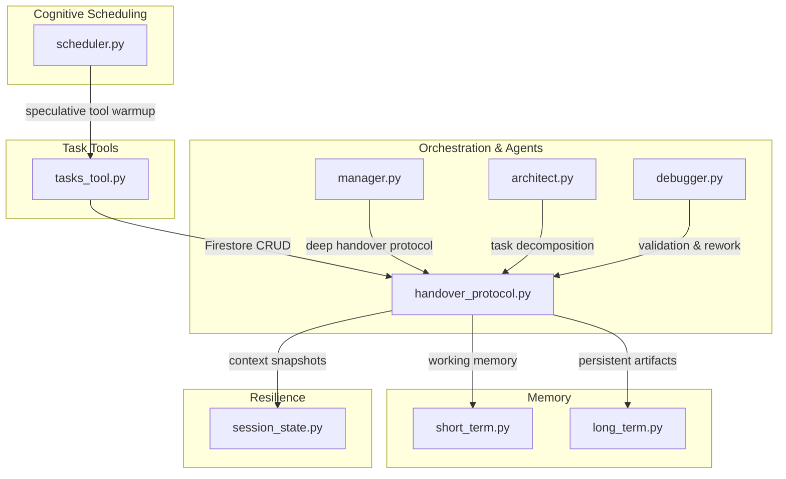
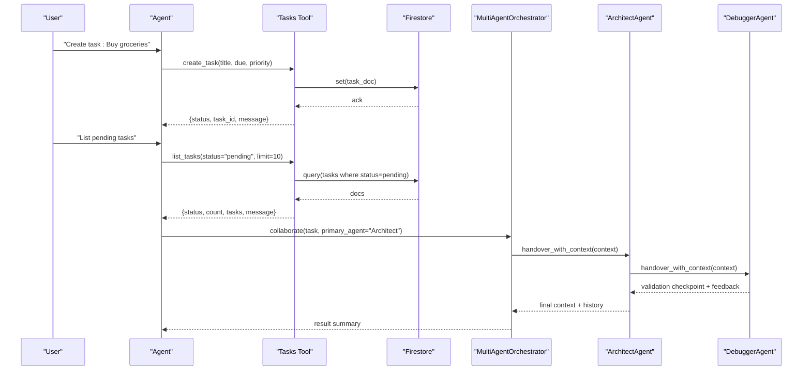
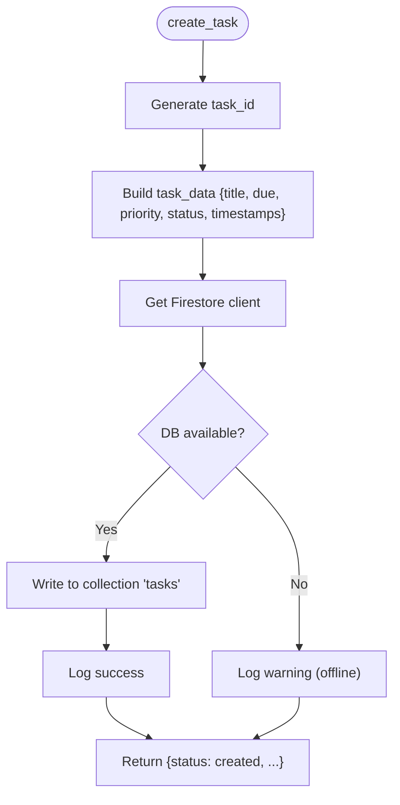
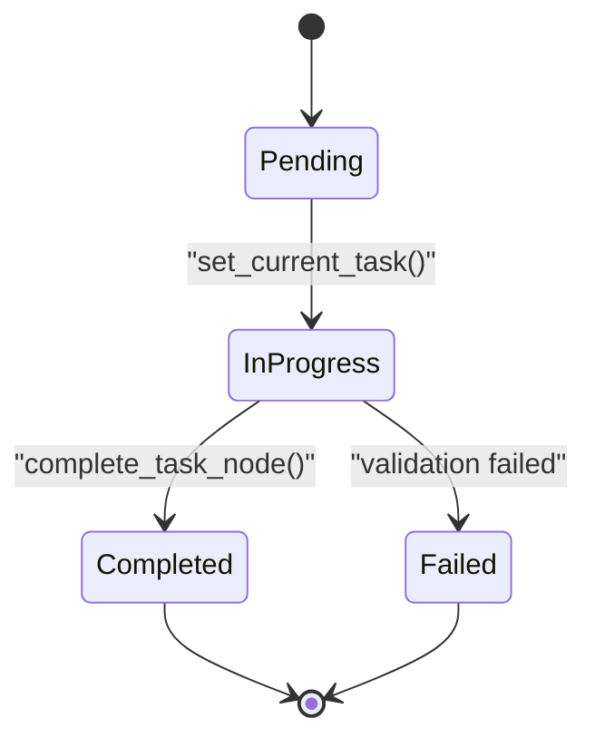
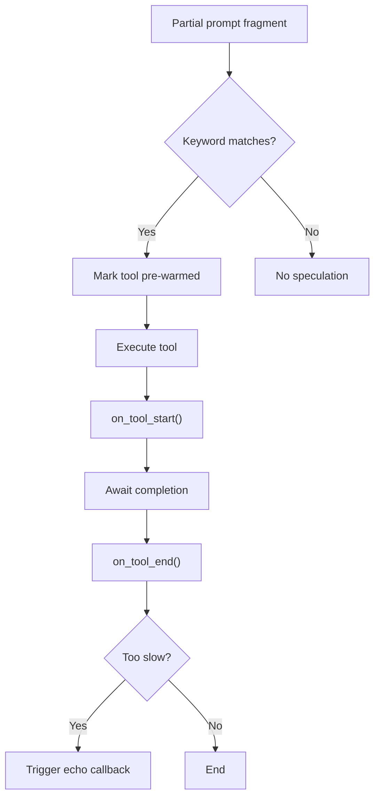
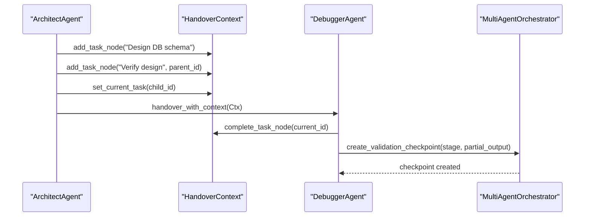
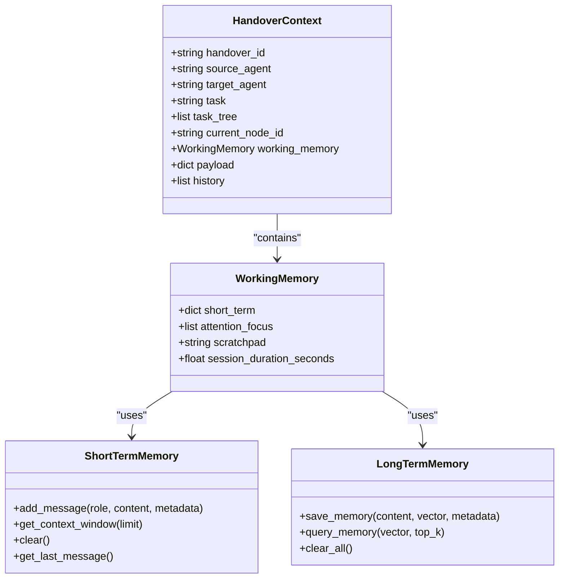
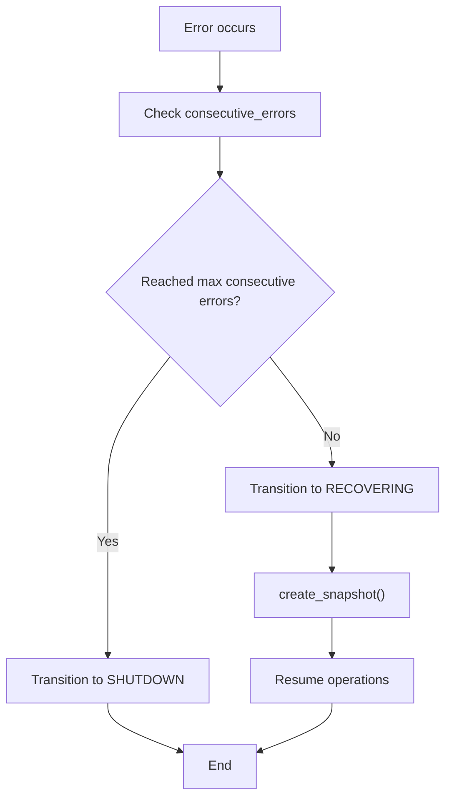
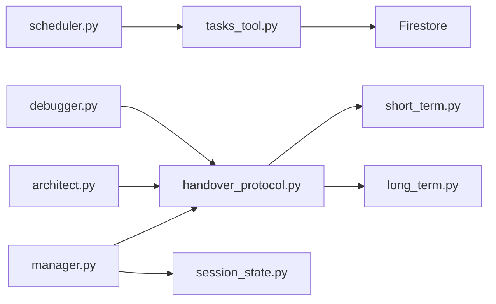

# Task Tools

<cite>
**Referenced Files in This Document**
- [tasks_tool.py](file://core/tools/tasks_tool.py)
- [scheduler.py](file://core/ai/scheduler.py)
- [handover_protocol.py](file://core/ai/handover_protocol.py)
- [manager.py](file://core/ai/handover/manager.py)
- [architect.py](file://core/ai/agents/specialists/architect.py)
- [debugger.py](file://core/ai/agents/specialists/debugger.py)
- [long_term.py](file://core/memory/long_term.py)
- [short_term.py](file://core/memory/short_term.py)
- [session_state.py](file://core/infra/transport/session_state.py)
</cite>

## Table of Contents
1. [Introduction](#introduction)
2. [Project Structure](#project-structure)
3. [Core Components](#core-components)
4. [Architecture Overview](#architecture-overview)
5. [Detailed Component Analysis](#detailed-component-analysis)
6. [Dependency Analysis](#dependency-analysis)
7. [Performance Considerations](#performance-considerations)
8. [Troubleshooting Guide](#troubleshooting-guide)
9. [Conclusion](#conclusion)

## Introduction
This document describes the Task Tools category in the system, focusing on task automation capabilities grounded in the repository’s task tool interface, Firestore-backed persistence, and the broader orchestration and memory architecture. It explains how tasks are created, managed, scheduled, and executed, and how the task lifecycle integrates with agent coordination and memory management. It also covers interfaces for task definition, execution control, progress monitoring, and recovery strategies.

## Project Structure
The Task Tools category spans:
- Task tool interface for task creation, listing, completion, and note-taking backed by Firestore
- Cognitive scheduling for speculative tool execution and overlap buffering
- Deep handover protocol and orchestrator for agent-based task orchestration and validation
- Architect and Debugger agents that decompose tasks, validate designs, and manage rework
- Memory subsystems for long-term and short-term context retention
- Session state management for crash recovery and resilience

**Diagram sources**
- [tasks_tool.py](file://core/tools/tasks_tool.py#L1-L325)
- [scheduler.py](file://core/ai/scheduler.py#L1-L114)
- [handover_protocol.py](file://core/ai/handover_protocol.py#L1-L1032)
- [manager.py](file://core/ai/handover/manager.py#L1-L631)
- [architect.py](file://core/ai/agents/specialists/architect.py#L1-L189)
- [debugger.py](file://core/ai/agents/specialists/debugger.py#L1-L272)
- [short_term.py](file://core/memory/short_term.py#L1-L72)
- [long_term.py](file://core/memory/long_term.py#L1-L74)
- [session_state.py](file://core/infra/transport/session_state.py#L413-L442)

**Section sources**
- [tasks_tool.py](file://core/tools/tasks_tool.py#L1-L325)
- [scheduler.py](file://core/ai/scheduler.py#L1-L114)
- [handover_protocol.py](file://core/ai/handover_protocol.py#L1-L1032)
- [manager.py](file://core/ai/handover/manager.py#L1-L631)
- [architect.py](file://core/ai/agents/specialists/architect.py#L1-L189)
- [debugger.py](file://core/ai/agents/specialists/debugger.py#L1-L272)
- [short_term.py](file://core/memory/short_term.py#L1-L72)
- [long_term.py](file://core/memory/long_term.py#L1-L74)
- [session_state.py](file://core/infra/transport/session_state.py#L413-L442)

## Core Components
- Task Tool Interface: Exposes CRUD operations for tasks and notes via Firestore, with graceful fallbacks when the backend is unavailable. It registers tool descriptors with parameter schemas and handler functions for agent invocation.
- Cognitive Scheduler: Manages speculative tool execution, temporal memory grounding, and overlap buffering to improve responsiveness and continuity.
- Deep Handover Protocol and Orchestrator: Provides rich context preservation, bidirectional negotiation, validation checkpoints, rollback capability, and structured task decomposition across agents.
- Architect and Debugger Agents: Decompose tasks, produce architectural blueprints, validate designs, and manage rework cycles with explicit checkpoints and feedback.
- Memory Management: Short-term memory maintains a sliding window of recent interactions; long-term memory persists vectorized knowledge for semantic recall.
- Session State and Recovery: Captures snapshots of session state to support crash recovery and resilience.

**Section sources**
- [tasks_tool.py](file://core/tools/tasks_tool.py#L216-L325)
- [scheduler.py](file://core/ai/scheduler.py#L10-L114)
- [handover_protocol.py](file://core/ai/handover_protocol.py#L107-L245)
- [manager.py](file://core/ai/handover/manager.py#L207-L631)
- [architect.py](file://core/ai/agents/specialists/architect.py#L20-L133)
- [debugger.py](file://core/ai/agents/specialists/debugger.py#L20-L139)
- [short_term.py](file://core/memory/short_term.py#L28-L72)
- [long_term.py](file://core/memory/long_term.py#L24-L74)
- [session_state.py](file://core/infra/transport/session_state.py#L435-L442)

## Architecture Overview
The Task Tools architecture integrates a task tool interface with orchestration and memory:
- Task tool handlers persist and retrieve tasks and notes to/from Firestore, returning structured results for agent consumption.
- The Cognitive Scheduler speculatively pre-warms tools and buffers overlapping speech to maintain conversational continuity.
- The Orchestrator coordinates agents using the Deep Handover Protocol, maintaining a task tree, working memory, and validation checkpoints.
- Architect and Debugger agents collaborate to decompose tasks, validate designs, and manage rework.
- Memory systems retain recent context and long-term knowledge to inform task execution and retrieval.
- Session state captures snapshots to support recovery and resilience.

**Diagram sources**
- [tasks_tool.py](file://core/tools/tasks_tool.py#L43-L86)
- [tasks_tool.py](file://core/tools/tasks_tool.py#L89-L137)
- [manager.py](file://core/ai/handover/manager.py#L581-L631)
- [architect.py](file://core/ai/agents/specialists/architect.py#L116-L132)
- [debugger.py](file://core/ai/agents/specialists/debugger.py#L34-L139)

## Detailed Component Analysis

### Task Tool Interface
The task tool interface defines four primary operations:
- Create task: Generates a task document with a unique ID, title, due date, priority, status, and timestamps. Writes to Firestore if available; otherwise logs a warning and proceeds locally.
- List tasks: Filters tasks by status and limits results. Returns structured results with counts and messages.
- Complete task: Marks a task as completed and records completion timestamps.
- Add note: Persists freeform notes with tags and timestamps.

Tool registration exposes parameter schemas and handler functions for agent invocation, including latency tier and idempotency metadata.

**Diagram sources**
- [tasks_tool.py](file://core/tools/tasks_tool.py#L43-L86)

**Section sources**
- [tasks_tool.py](file://core/tools/tasks_tool.py#L43-L86)
- [tasks_tool.py](file://core/tools/tasks_tool.py#L89-L137)
- [tasks_tool.py](file://core/tools/tasks_tool.py#L140-L181)
- [tasks_tool.py](file://core/tools/tasks_tool.py#L183-L213)
- [tasks_tool.py](file://core/tools/tasks_tool.py#L216-L325)

### Task Lifecycle and Orchestration
The lifecycle spans creation, orchestration, validation, and completion:
- Creation: Tasks are persisted with initial status “pending.”
- Orchestration: The Orchestrator creates a rich HandoverContext, optionally negotiates scope, and transfers control to agents.
- Validation: The Debugger validates designs and proposes checkpoints; Architect handles rework based on feedback.
- Completion: Task nodes are marked complete, and the final context is returned with history and outcomes.

**Diagram sources**
- [handover_protocol.py](file://core/ai/handover_protocol.py#L230-L244)
- [debugger.py](file://core/ai/agents/specialists/debugger.py#L82-L116)
- [architect.py](file://core/ai/agents/specialists/architect.py#L84-L96)

**Section sources**
- [handover_protocol.py](file://core/ai/handover_protocol.py#L81-L245)
- [manager.py](file://core/ai/handover/manager.py#L262-L394)
- [architect.py](file://core/ai/agents/specialists/architect.py#L35-L133)
- [debugger.py](file://core/ai/agents/specialists/debugger.py#L34-L139)

### Cognitive Scheduling and Execution Control
The Cognitive Scheduler:
- Pre-speculates tool execution based on partial prompts to reduce latency
- Maintains temporal memory and overlap buffer to preserve conversational context
- Tracks tool start/end times and triggers echo callbacks for long-running operations

**Diagram sources**
- [scheduler.py](file://core/ai/scheduler.py#L52-L114)

**Section sources**
- [scheduler.py](file://core/ai/scheduler.py#L10-L114)

### Progress Monitoring and Validation
Agents use checkpoints and validation results to monitor progress:
- Architect adds task nodes and sets current task
- Debugger completes task nodes and creates validation checkpoints
- Orchestrator tracks telemetry and maintains handover history

**Diagram sources**
- [architect.py](file://core/ai/agents/specialists/architect.py#L84-L96)
- [debugger.py](file://core/ai/agents/specialists/debugger.py#L82-L101)
- [manager.py](file://core/ai/handover/manager.py#L395-L432)

**Section sources**
- [architect.py](file://core/ai/agents/specialists/architect.py#L35-L133)
- [debugger.py](file://core/ai/agents/specialists/debugger.py#L34-L139)
- [manager.py](file://core/ai/handover/manager.py#L395-L432)

### Memory Integration
- Short-term memory maintains a rolling window of recent interactions to keep context relevant for task execution.
- Long-term memory stores vectorized knowledge for semantic recall, supporting task-related knowledge retrieval.
- HandoverContext includes working memory fields to preserve active context across agent transitions.

**Diagram sources**
- [handover_protocol.py](file://core/ai/handover_protocol.py#L94-L155)
- [short_term.py](file://core/memory/short_term.py#L28-L72)
- [long_term.py](file://core/memory/long_term.py#L24-L74)

**Section sources**
- [handover_protocol.py](file://core/ai/handover_protocol.py#L94-L155)
- [short_term.py](file://core/memory/short_term.py#L28-L72)
- [long_term.py](file://core/memory/long_term.py#L24-L74)

### Recovery and Resilience
- Session state captures snapshots of state, metadata, and error counters to support crash recovery.
- Handover protocol supports snapshots and rollback to recover from failures.

**Diagram sources**
- [session_state.py](file://core/infra/transport/session_state.py#L413-L442)
- [handover_protocol.py](file://core/ai/handover_protocol.py#L175-L197)

**Section sources**
- [session_state.py](file://core/infra/transport/session_state.py#L413-L442)
- [handover_protocol.py](file://core/ai/handover_protocol.py#L175-L197)

## Dependency Analysis
- Task Tool depends on a Firebase connector for persistence and logs structured results for agent consumption.
- Cognitive Scheduler subscribes to event bus pulses and interacts with tools via tracking hooks.
- Orchestrator coordinates agents using the Deep Handover Protocol, managing negotiation, checkpoints, and rollback.
- Architect and Debugger agents use HandoverContext to decompose tasks, validate designs, and request rework.
- Memory systems integrate with HandoverContext working memory to preserve active context.

**Diagram sources**
- [tasks_tool.py](file://core/tools/tasks_tool.py#L24-L40)
- [scheduler.py](file://core/ai/scheduler.py#L16-L31)
- [manager.py](file://core/ai/handover/manager.py#L207-L230)
- [handover_protocol.py](file://core/ai/handover_protocol.py#L107-L155)
- [architect.py](file://core/ai/agents/specialists/architect.py#L20-L33)
- [debugger.py](file://core/ai/agents/specialists/debugger.py#L20-L32)
- [short_term.py](file://core/memory/short_term.py#L28-L36)
- [long_term.py](file://core/memory/long_term.py#L24-L34)
- [session_state.py](file://core/infra/transport/session_state.py#L435-L442)

**Section sources**
- [tasks_tool.py](file://core/tools/tasks_tool.py#L24-L40)
- [scheduler.py](file://core/ai/scheduler.py#L16-L31)
- [manager.py](file://core/ai/handover/manager.py#L207-L230)
- [handover_protocol.py](file://core/ai/handover_protocol.py#L107-L155)
- [architect.py](file://core/ai/agents/specialists/architect.py#L20-L33)
- [debugger.py](file://core/ai/agents/specialists/debugger.py#L20-L32)
- [short_term.py](file://core/memory/short_term.py#L28-L36)
- [long_term.py](file://core/memory/long_term.py#L24-L34)
- [session_state.py](file://core/infra/transport/session_state.py#L435-L442)

## Performance Considerations
- Latency-aware tool execution: The task tool descriptors specify latency tiers suitable for p95 sub-500ms operations, guiding agent scheduling.
- Speculative execution: The Cognitive Scheduler pre-warms tools based on prompt fragments to reduce perceived latency.
- Streaming queries: Task listing uses asynchronous streaming to efficiently retrieve documents.
- Echo mechanism: Long-running tools trigger echo callbacks to maintain user engagement.

[No sources needed since this section provides general guidance]

## Troubleshooting Guide
Common scenarios and strategies:
- Firestore unavailability: Task tool handlers return structured error messages and log warnings; tasks can still be tracked locally until connectivity resumes.
- Handover failures: Orchestrator records telemetry outcomes and failure categories; rollback capability restores snapshots when available.
- Validation checkpoints: Use checkpoints to stage verification and iterate on partial outputs before final commitment.
- Session recovery: Session state snapshots capture state and error counts to support automatic recovery and shutdown policies.

**Section sources**
- [tasks_tool.py](file://core/tools/tasks_tool.py#L67-L76)
- [tasks_tool.py](file://core/tools/tasks_tool.py#L135-L137)
- [manager.py](file://core/ai/handover/manager.py#L307-L394)
- [manager.py](file://core/ai/handover/manager.py#L434-L463)
- [session_state.py](file://core/infra/transport/session_state.py#L413-L442)

## Conclusion
The Task Tools category integrates a robust task tool interface with Firestore-backed persistence, cognitive scheduling for responsive execution, and a deep orchestration protocol enabling agent collaboration, validation, and recovery. Together with memory and session state management, it provides a comprehensive foundation for task automation, lifecycle management, and resilient execution across agents.