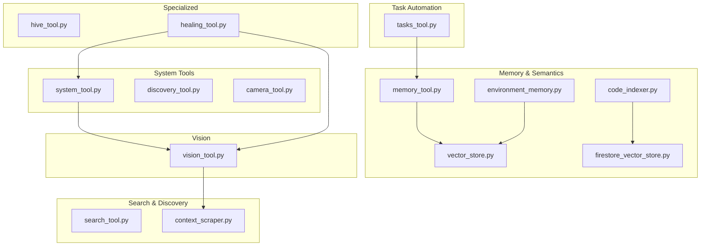
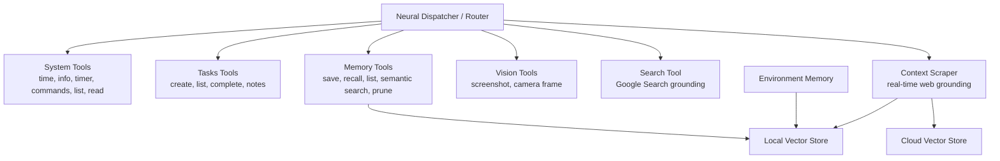
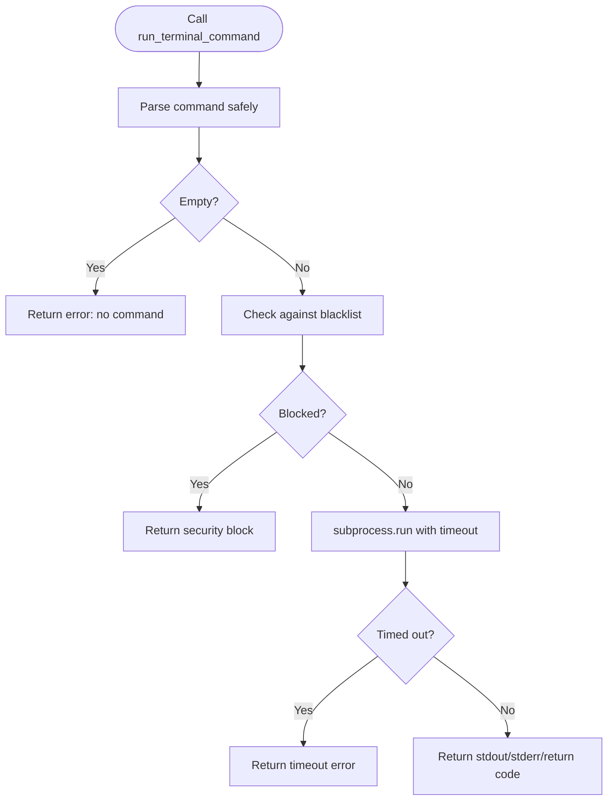
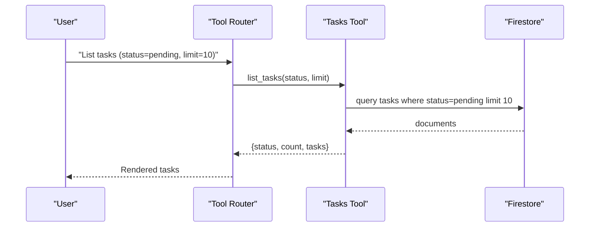
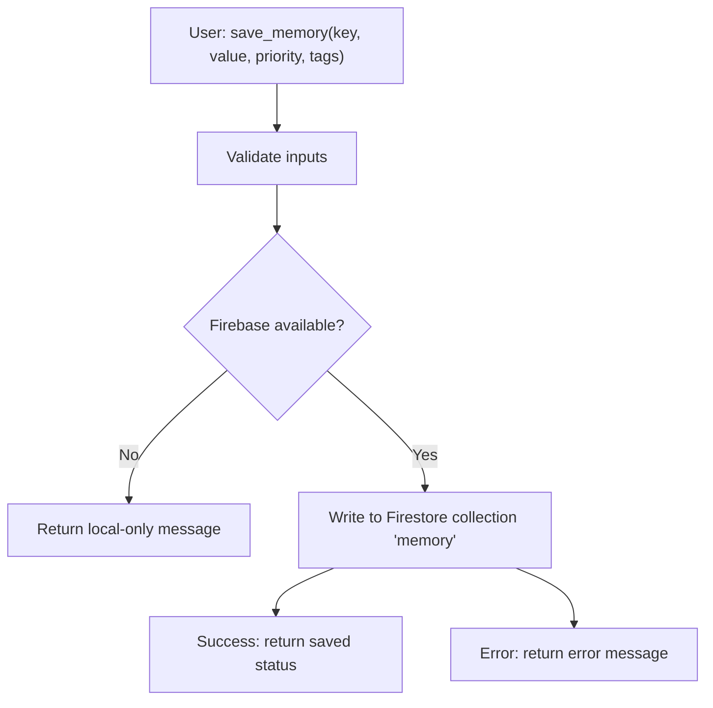
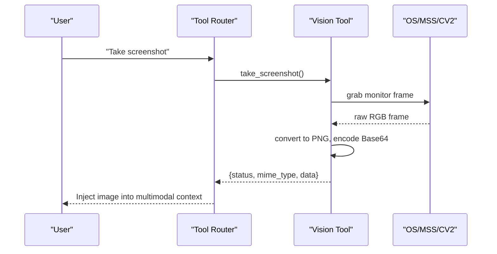
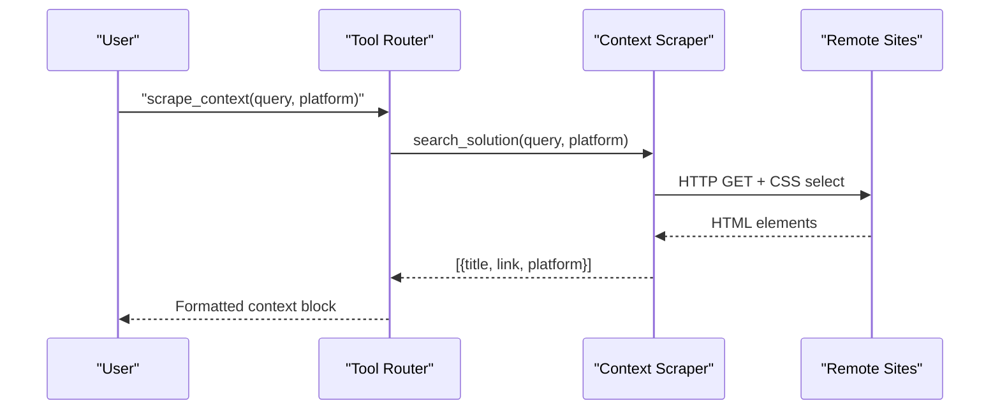
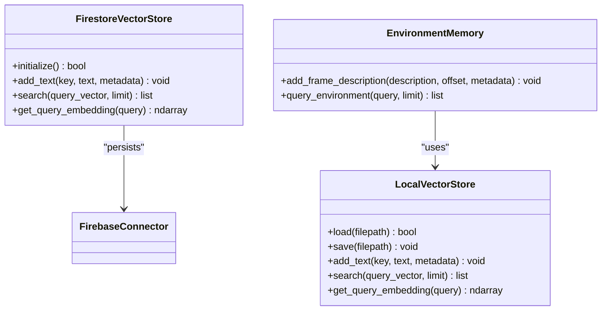
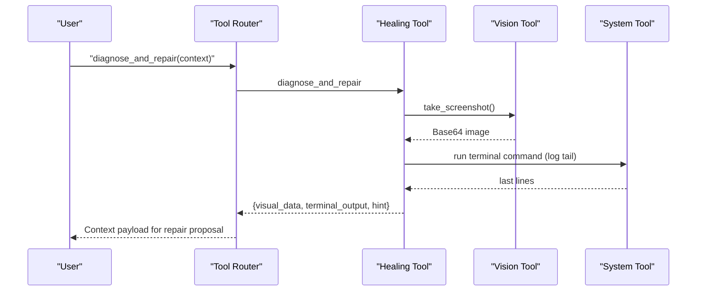
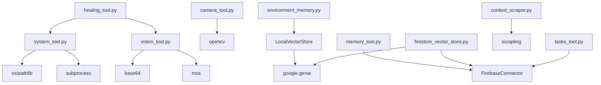

# Tool Categories and Implementations

<cite>
**Referenced Files in This Document**
- [system_tool.py](file://core/tools/system_tool.py)
- [tasks_tool.py](file://core/tools/tasks_tool.py)
- [memory_tool.py](file://core/tools/memory_tool.py)
- [vision_tool.py](file://core/tools/vision_tool.py)
- [search_tool.py](file://core/tools/search_tool.py)
- [discovery_tool.py](file://core/tools/discovery_tool.py)
- [vector_store.py](file://core/tools/vector_store.py)
- [firestore_vector_store.py](file://core/tools/firestore_vector_store.py)
- [code_indexer.py](file://core/tools/code_indexer.py)
- [context_scraper.py](file://core/tools/context_scraper.py)
- [hive_tool.py](file://core/tools/hive_tool.py)
- [environment_memory.py](file://core/tools/environment_memory.py)
- [healing_tool.py](file://core/tools/healing_tool.py)
- [camera_tool.py](file://core/tools/camera_tool.py)
</cite>

## Table of Contents
1. [Introduction](#introduction)
2. [Project Structure](#project-structure)
3. [Core Components](#core-components)
4. [Architecture Overview](#architecture-overview)
5. [Detailed Component Analysis](#detailed-component-analysis)
6. [Dependency Analysis](#dependency-analysis)
7. [Performance Considerations](#performance-considerations)
8. [Troubleshooting Guide](#troubleshooting-guide)
9. [Conclusion](#conclusion)

## Introduction
This document explains the tool categories and implementations powering the Aether Voice OS system. It covers:
- System tools for time/date, system info, timers, safe terminal commands, codebase listing, and file reading
- Task automation tools for task creation, listing, completion, and note-taking
- Memory tools for persistent memory, semantic search, and pruning
- Vision tools for screen capture and camera capture
- Search and discovery tools for grounding, contextual scraping, and system auditing
- Vector storage integration for local and cloud semantic search
- Specialized tools for Hive handovers, environment memory, and healing workflows

Each tool category includes parameter schemas, validation rules, integration patterns, and performance considerations.

## Project Structure
The tools are organized under core/tools and grouped by domain:
- System and environment: system_tool.py, discovery_tool.py, camera_tool.py
- Task automation: tasks_tool.py
- Memory and semantics: memory_tool.py, environment_memory.py, vector_store.py, firestore_vector_store.py, code_indexer.py
- Vision: vision_tool.py
- Search and discovery: search_tool.py, context_scraper.py
- Specialized orchestration: hive_tool.py, healing_tool.py

**Diagram sources**
- [system_tool.py](file://core/tools/system_tool.py#L1-L310)
- [discovery_tool.py](file://core/tools/discovery_tool.py#L1-L84)
- [camera_tool.py](file://core/tools/camera_tool.py#L1-L65)
- [tasks_tool.py](file://core/tools/tasks_tool.py#L1-L325)
- [memory_tool.py](file://core/tools/memory_tool.py#L1-L330)
- [environment_memory.py](file://core/tools/environment_memory.py#L1-L94)
- [vector_store.py](file://core/tools/vector_store.py#L1-L112)
- [firestore_vector_store.py](file://core/tools/firestore_vector_store.py#L1-L129)
- [code_indexer.py](file://core/tools/code_indexer.py#L1-L131)
- [vision_tool.py](file://core/tools/vision_tool.py#L1-L75)
- [search_tool.py](file://core/tools/search_tool.py#L1-L51)
- [context_scraper.py](file://core/tools/context_scraper.py#L1-L146)
- [hive_tool.py](file://core/tools/hive_tool.py#L1-L78)
- [healing_tool.py](file://core/tools/healing_tool.py#L1-L148)

**Section sources**
- [system_tool.py](file://core/tools/system_tool.py#L1-L310)
- [tasks_tool.py](file://core/tools/tasks_tool.py#L1-L325)
- [memory_tool.py](file://core/tools/memory_tool.py#L1-L330)
- [vision_tool.py](file://core/tools/vision_tool.py#L1-L75)
- [search_tool.py](file://core/tools/search_tool.py#L1-L51)
- [discovery_tool.py](file://core/tools/discovery_tool.py#L1-L84)
- [vector_store.py](file://core/tools/vector_store.py#L1-L112)
- [firestore_vector_store.py](file://core/tools/firestore_vector_store.py#L1-L129)
- [code_indexer.py](file://core/tools/code_indexer.py#L1-L131)
- [context_scraper.py](file://core/tools/context_scraper.py#L1-L146)
- [hive_tool.py](file://core/tools/hive_tool.py#L1-L78)
- [environment_memory.py](file://core/tools/environment_memory.py#L1-L94)
- [healing_tool.py](file://core/tools/healing_tool.py#L1-L148)
- [camera_tool.py](file://core/tools/camera_tool.py#L1-L65)

## Core Components
- System tools: time/date retrieval, system info, timers, safe terminal commands, codebase listing, file reading
- Task automation: create/list/complete tasks and add notes with Firestore persistence
- Memory tools: save/recall/list memories, semantic search by tags, prune by priority
- Vision tools: screenshot capture and camera frame capture
- Search and discovery: Google Search grounding and contextual scraping
- Vector storage: local and cloud vector stores for semantic search
- Specialized tools: Hive handover switching and healing workflows

**Section sources**
- [system_tool.py](file://core/tools/system_tool.py#L36-L310)
- [tasks_tool.py](file://core/tools/tasks_tool.py#L43-L325)
- [memory_tool.py](file://core/tools/memory_tool.py#L40-L330)
- [vision_tool.py](file://core/tools/vision_tool.py#L19-L75)
- [search_tool.py](file://core/tools/search_tool.py#L26-L51)
- [context_scraper.py](file://core/tools/context_scraper.py#L19-L146)
- [vector_store.py](file://core/tools/vector_store.py#L21-L112)
- [firestore_vector_store.py](file://core/tools/firestore_vector_store.py#L22-L129)
- [hive_tool.py](file://core/tools/hive_tool.py#L27-L78)
- [environment_memory.py](file://core/tools/environment_memory.py#L21-L94)
- [healing_tool.py](file://core/tools/healing_tool.py#L18-L148)
- [camera_tool.py](file://core/tools/camera_tool.py#L16-L65)

## Architecture Overview
The tools integrate with the engine via a common registration pattern returning tool descriptors with parameter schemas and handlers. Some tools depend on external services (Firebase, Google APIs, system processes), while others are local-first.

**Diagram sources**
- [system_tool.py](file://core/tools/system_tool.py#L198-L310)
- [tasks_tool.py](file://core/tools/tasks_tool.py#L216-L325)
- [memory_tool.py](file://core/tools/memory_tool.py#L246-L330)
- [vision_tool.py](file://core/tools/vision_tool.py#L58-L75)
- [search_tool.py](file://core/tools/search_tool.py#L26-L51)
- [context_scraper.py](file://core/tools/context_scraper.py#L99-L146)
- [vector_store.py](file://core/tools/vector_store.py#L21-L112)
- [firestore_vector_store.py](file://core/tools/firestore_vector_store.py#L22-L129)
- [environment_memory.py](file://core/tools/environment_memory.py#L21-L94)

## Detailed Component Analysis

### System Tools
Purpose: Provide local system awareness and safe diagnostics.
Key functions:
- get_current_time: returns local time, date, UTC time, timezone, and Unix timestamp
- get_system_info: returns OS, OS version, machine, hostname, Python version
- run_timer: acknowledges timer requests with label and duration
- run_terminal_command: executes safe commands with blacklist, timeout, and shell isolation
- list_codebase: walks project tree excluding common artifacts
- read_file_content: reads file content with truncation protection

Parameter schemas and validation:
- run_timer: minutes (integer, required), label (string)
- run_terminal_command: command (string, required)
- list_codebase: path (string, default current directory)
- read_file_content: filepath (string, required)

Integration pattern:
- get_tools returns a list of tool descriptors with handler functions and JSON Schema parameters.

Security and safety:
- Command blacklist prevents destructive operations
- Subprocess runs with shell=False and strict timeout
- File read capped at a safe length

**Diagram sources**
- [system_tool.py](file://core/tools/system_tool.py#L87-L134)

**Section sources**
- [system_tool.py](file://core/tools/system_tool.py#L36-L310)

### Task Automation Tools
Purpose: Persist and manage tasks and notes using Firestore.
Key functions:
- create_task: creates a task with title, due date, priority, status, timestamps
- list_tasks: filters by status and limits results
- complete_task: marks a task as completed with completion timestamp
- add_note: saves a note with content, tag, and timestamp

Parameter schemas and validation:
- create_task: title (string, required), due (string), priority (enum: low, medium, high)
- list_tasks: status (enum: pending, completed, all), limit (integer)
- complete_task: task_id (string, required)
- add_note: content (string, required), tag (string)

Persistence and fallback:
- Uses FirebaseConnector; graceful fallbacks when offline

**Diagram sources**
- [tasks_tool.py](file://core/tools/tasks_tool.py#L89-L138)

**Section sources**
- [tasks_tool.py](file://core/tools/tasks_tool.py#L43-L325)

### Memory Tools
Purpose: Persistent memory with semantic search and pruning.
Key functions:
- save_memory: stores key/value with priority and tags; integrates session context
- recall_memory: retrieves a memory by key
- list_memories: lists with optional priority filter
- semantic_search: tags-based lookup using Firestore array_contains_any
- prune_memories: deletes memories by priority

Parameter schemas and validation:
- save_memory: key (string, required), value (string, required), priority (enum), tags (array of strings)
- recall_memory: key (string, required)
- list_memories: limit (integer), priority (enum)
- semantic_search: tags (array, required), limit (integer)
- prune_memories: priority (enum)

Persistence and fallback:
- Uses FirebaseConnector; offline returns local-only messages

**Diagram sources**
- [memory_tool.py](file://core/tools/memory_tool.py#L40-L93)

**Section sources**
- [memory_tool.py](file://core/tools/memory_tool.py#L40-L330)

### Vision Tools
Purpose: Provide visual context to the agent.
Key functions:
- take_screenshot: captures primary monitor, encodes as Base64 PNG
- capture_user_frame: captures a single camera frame as JPEG

Parameter schemas and validation:
- take_screenshot: no parameters
- capture_user_frame: no parameters

Performance characteristics:
- Screen capture uses in-memory conversion and Base64 encoding
- Camera capture opens/closes device per frame to avoid locks

**Diagram sources**
- [vision_tool.py](file://core/tools/vision_tool.py#L19-L56)
- [camera_tool.py](file://core/tools/camera_tool.py#L20-L47)

**Section sources**
- [vision_tool.py](file://core/tools/vision_tool.py#L19-L75)
- [camera_tool.py](file://core/tools/camera_tool.py#L16-L65)

### Search and Discovery Tools
Purpose: Ground responses with real-time information and audit internals.
Key functions:
- Google Search grounding: provided as a special tool via get_search_tool()
- scrape_context: searches StackOverflow/GitHub/HackerNews and formats results
- generate_system_audit: reports internal component status and metrics

Parameter schemas and validation:
- scrape_context: query (string, required), platform (enum: stackoverflow, github, hackernews)
- generate_system_audit: no parameters

Integration patterns:
- Google Search is registered separately in session configuration
- Context scraper returns structured context for multimodal injection

**Diagram sources**
- [context_scraper.py](file://core/tools/context_scraper.py#L19-L97)
- [search_tool.py](file://core/tools/search_tool.py#L26-L38)

**Section sources**
- [search_tool.py](file://core/tools/search_tool.py#L26-L51)
- [context_scraper.py](file://core/tools/context_scraper.py#L19-L146)
- [discovery_tool.py](file://core/tools/discovery_tool.py#L27-L84)

### Vector Storage Integration
Purpose: Enable semantic search for tool routing and memory retrieval.
Components:
- LocalVectorStore: in-memory embeddings with cosine similarity search, pickle persistence
- FirestoreVectorStore: cloud-native embeddings with Firestore persistence and embedding generation
- EnvironmentMemory: semantic indexing of visual frames using LocalVectorStore

Key operations:
- Embedding generation via Gemini embeddings
- Indexing and search with cosine similarity
- Query embedding generation and similarity ranking

**Diagram sources**
- [vector_store.py](file://core/tools/vector_store.py#L21-L112)
- [firestore_vector_store.py](file://core/tools/firestore_vector_store.py#L22-L129)
- [environment_memory.py](file://core/tools/environment_memory.py#L21-L94)

**Section sources**
- [vector_store.py](file://core/tools/vector_store.py#L21-L112)
- [firestore_vector_store.py](file://core/tools/firestore_vector_store.py#L22-L129)
- [environment_memory.py](file://core/tools/environment_memory.py#L21-L94)
- [code_indexer.py](file://core/tools/code_indexer.py#L56-L127)

### Specialized Tools
Purpose: Orchestrate expert handovers and autonomous healing.
Key functions:
- switch_expert_soul: requests a Hive handoff to a target soul
- diagnose_and_repair: gathers visual and terminal context for error diagnosis
- apply_repair: applies a fix to a file with backup creation

Parameter schemas and validation:
- switch_expert_soul: target_name (string, required), reason (string, required)
- diagnose_and_repair: context (string)
- apply_repair: filepath (string, required), diff (string, required)

Integration patterns:
- Uses vision_tool for screenshots and system_tool for terminal context
- Heals by creating backups and delegating content updates to higher-level workflows

**Diagram sources**
- [healing_tool.py](file://core/tools/healing_tool.py#L18-L66)
- [vision_tool.py](file://core/tools/vision_tool.py#L19-L56)
- [system_tool.py](file://core/tools/system_tool.py#L87-L134)

**Section sources**
- [hive_tool.py](file://core/tools/hive_tool.py#L27-L78)
- [healing_tool.py](file://core/tools/healing_tool.py#L18-L148)

## Dependency Analysis
- Tools register via get_tools returning descriptors with handler functions and JSON Schema parameters
- Memory and environment memory depend on FirebaseConnector for persistence
- Vector stores depend on Gemini embeddings and optional Firestore for cloud persistence
- Vision tools depend on OS-level libraries (mss, opencv)
- Context scraper depends on remote HTTP fetching and CSS selectors
- System tools depend on subprocess and filesystem operations

**Diagram sources**
- [system_tool.py](file://core/tools/system_tool.py#L12-L18)
- [vision_tool.py](file://core/tools/vision_tool.py#L10-L16)
- [camera_tool.py](file://core/tools/camera_tool.py#L11-L13)
- [memory_tool.py](file://core/tools/memory_tool.py#L23-L37)
- [environment_memory.py](file://core/tools/environment_memory.py#L13-L28)
- [vector_store.py](file://core/tools/vector_store.py#L16-L18)
- [firestore_vector_store.py](file://core/tools/firestore_vector_store.py#L14-L17)
- [context_scraper.py](file://core/tools/context_scraper.py#L5-L13)
- [tasks_tool.py](file://core/tools/tasks_tool.py#L24-L40)
- [healing_tool.py](file://core/tools/healing_tool.py#L13-L15)

**Section sources**
- [system_tool.py](file://core/tools/system_tool.py#L12-L18)
- [vision_tool.py](file://core/tools/vision_tool.py#L10-L16)
- [camera_tool.py](file://core/tools/camera_tool.py#L11-L13)
- [memory_tool.py](file://core/tools/memory_tool.py#L23-L37)
- [environment_memory.py](file://core/tools/environment_memory.py#L13-L28)
- [vector_store.py](file://core/tools/vector_store.py#L16-L18)
- [firestore_vector_store.py](file://core/tools/firestore_vector_store.py#L14-L17)
- [context_scraper.py](file://core/tools/context_scraper.py#L5-L13)
- [tasks_tool.py](file://core/tools/tasks_tool.py#L24-L40)
- [healing_tool.py](file://core/tools/healing_tool.py#L13-L15)

## Performance Considerations
- System tools
  - run_terminal_command enforces a strict timeout to prevent hangs
  - list_codebase truncates file lists to avoid context overflow
  - read_file_content caps content length to prevent memory pressure
- Memory tools
  - Firestore queries use limits and filters to constrain result sizes
  - Offline fallback avoids blocking the pipeline
- Vision tools
  - Screen capture uses in-memory conversion and Base64 encoding; minimize frequency
  - Camera capture opens/closes device per frame to avoid resource contention
- Vector stores
  - LocalVectorStore persists via pickle; consider periodic checkpointing for large indices
  - FirestoreVectorStore performs full scans in prototype; prefer vector extensions in production
- Context scraper
  - Uses async executor for blocking HTTP calls; rate-limit embeddings and HTTP requests
- Search grounding
  - Google Search is configured at the session level; ensure network availability and quotas

[No sources needed since this section provides general guidance]

## Troubleshooting Guide
- System tools
  - Command blocked: verify base command is not in the blacklist
  - Timeout: reduce command complexity or split into smaller steps
  - File not found: confirm filepath exists and is readable
- Task tools
  - Firestore unavailable: expect local-only messages; retry when connectivity resumes
  - Task not found: confirm task_id exists before completing
- Memory tools
  - Memory offline: expect local-only behavior; check Firebase connectivity
  - Semantic search returns empty: ensure tags match indexed values
- Vision tools
  - Screen capture fails: verify monitor index and permissions
  - Camera capture fails: ensure device is available and not locked by another process
- Vector stores
  - Embedding failures: verify GOOGLE_API_KEY and model availability
  - Cloud search slow: implement pagination or vector extension
- Context scraper
  - Network errors: retry or switch platform; inspect returned error payload
- Specialized tools
  - Hive handover fails: confirm target soul name and reason are valid
  - Healing repair fails: verify file path and permissions

**Section sources**
- [system_tool.py](file://core/tools/system_tool.py#L87-L134)
- [tasks_tool.py](file://core/tools/tasks_tool.py#L140-L181)
- [memory_tool.py](file://core/tools/memory_tool.py#L40-L93)
- [vision_tool.py](file://core/tools/vision_tool.py#L19-L56)
- [camera_tool.py](file://core/tools/camera_tool.py#L20-L47)
- [vector_store.py](file://core/tools/vector_store.py#L30-L48)
- [firestore_vector_store.py](file://core/tools/firestore_vector_store.py#L74-L121)
- [context_scraper.py](file://core/tools/context_scraper.py#L39-L60)
- [hive_tool.py](file://core/tools/hive_tool.py#L34-L48)
- [healing_tool.py](file://core/tools/healing_tool.py#L76-L99)

## Conclusion
The Aether Voice OS tool ecosystem combines local-first primitives with cloud-backed persistence and embeddings to enable robust, grounded interactions. Each tool category adheres to a consistent registration pattern, parameter schema, and safety practices. By leveraging vector stores, vision, and contextual grounding, the system achieves reliable task automation, memory management, and autonomous healing workflows.

[No sources needed since this section summarizes without analyzing specific files]