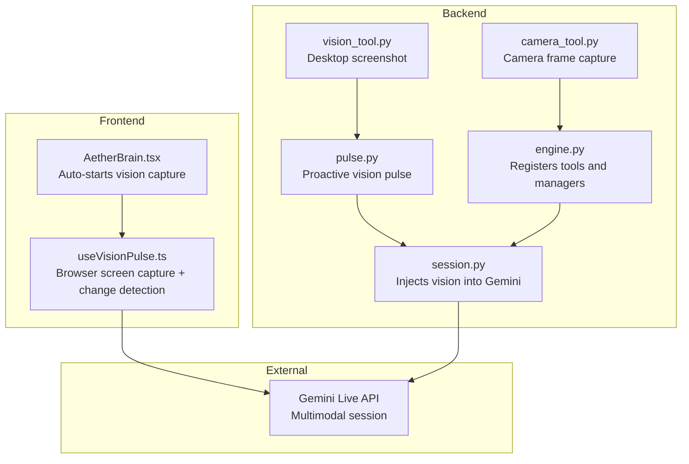
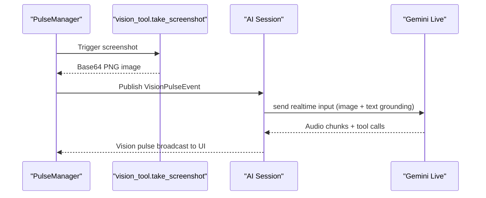
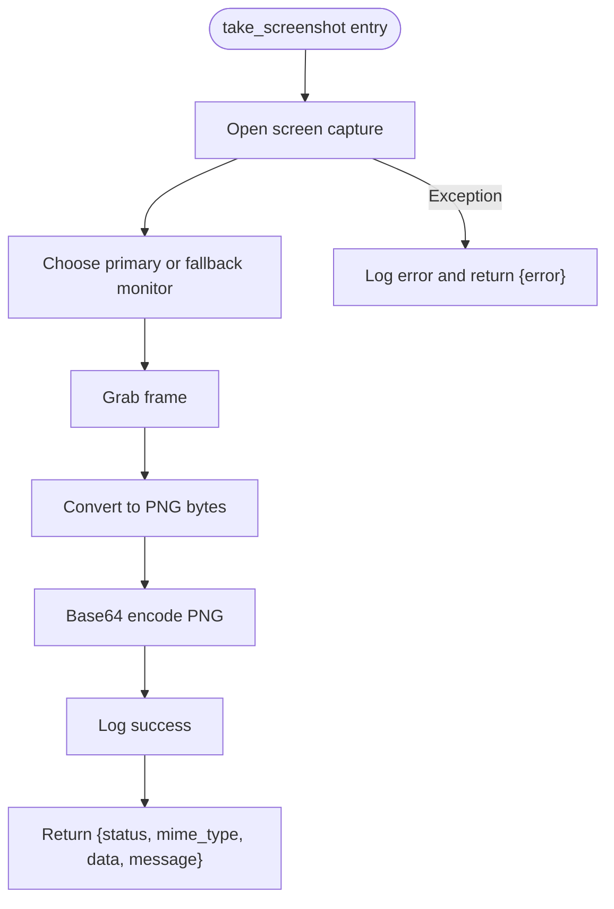
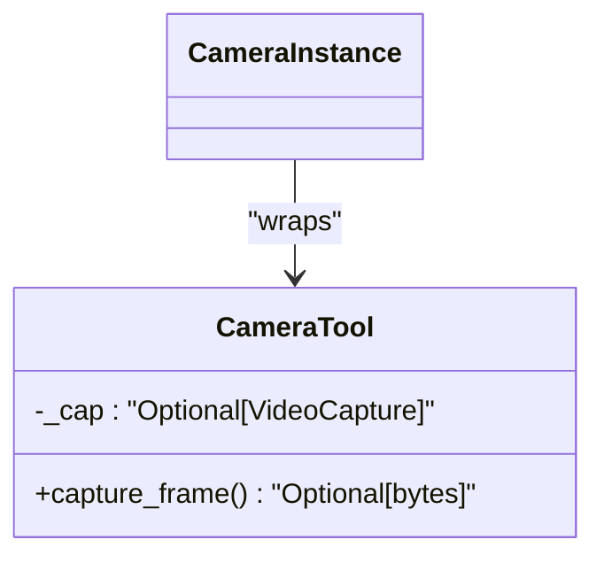
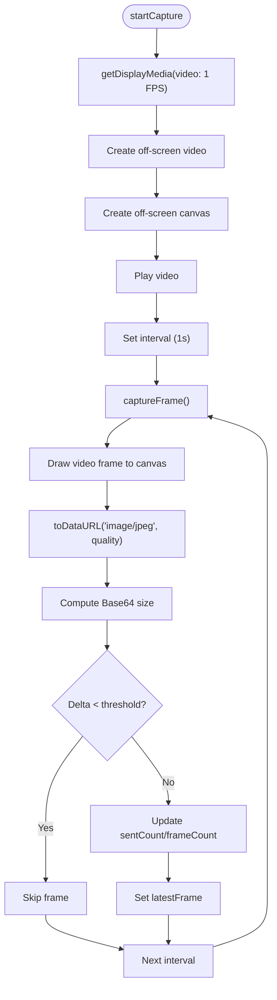
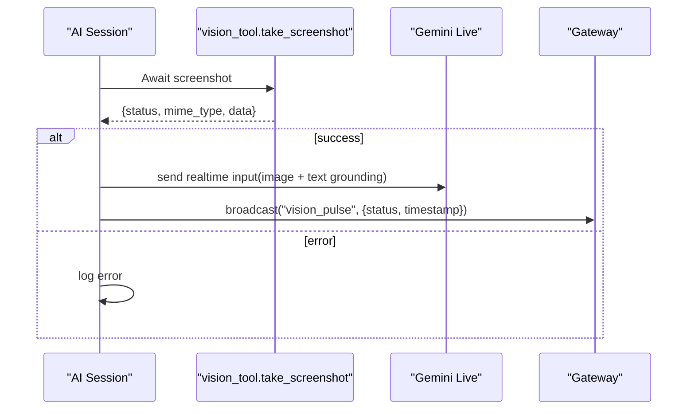
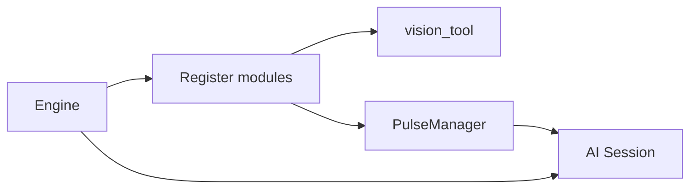
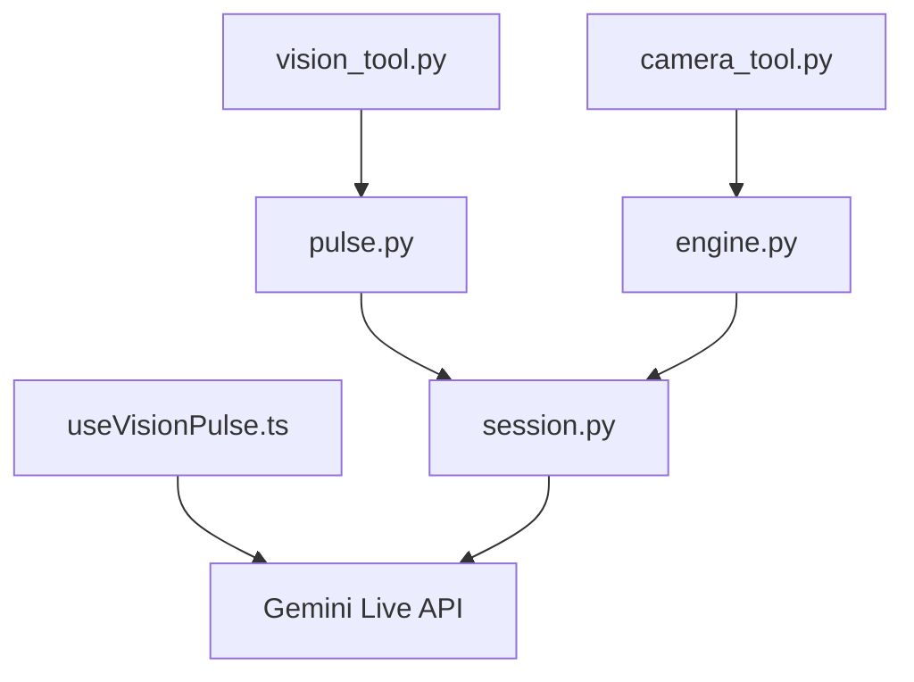

# Vision Tools

<cite>
**Referenced Files in This Document**
- [vision_tool.py](file://core/tools/vision_tool.py)
- [camera_tool.py](file://core/tools/camera_tool.py)
- [useVisionPulse.ts](file://apps/portal/src/hooks/useVisionPulse.ts)
- [pulse.py](file://core/logic/managers/pulse.py)
- [session.py](file://core/ai/session.py)
- [engine.py](file://core/engine.py)
- [PERCEPTION.md](file://docs/PERCEPTION.md)
- [architecture.md](file://docs/architecture.md)
- [AetherBrain.tsx](file://apps/portal/src/components/AetherBrain.tsx)
- [geminiLive.integration.test.ts](file://apps/portal/src/__tests__/geminiLive.integration.test.ts)
</cite>

## Table of Contents
1. [Introduction](#introduction)
2. [Project Structure](#project-structure)
3. [Core Components](#core-components)
4. [Architecture Overview](#architecture-overview)
5. [Detailed Component Analysis](#detailed-component-analysis)
6. [Dependency Analysis](#dependency-analysis)
7. [Performance Considerations](#performance-considerations)
8. [Troubleshooting Guide](#troubleshooting-guide)
9. [Conclusion](#conclusion)
10. [Appendices](#appendices)

## Introduction
This document describes the vision tools category in AetherOS, focusing on image processing capabilities, computer vision tasks, and visual data analysis functions. It explains camera integration, image capture, and visual perception workflows, and documents the vision tool interfaces for object detection, scene analysis, and visual context extraction. It also covers image processing pipelines, visual query handling, integration with external vision services, performance considerations for real-time image processing, memory management for large images, optimization techniques, and the relationship between vision tools and other system components including audio processing and agent decision-making.

## Project Structure
Vision tools span three layers:
- Backend Python tools for desktop capture and camera frames
- Frontend React hook for continuous screen capture and change detection
- Orchestrators that inject visual context into the multimodal session



**Diagram sources**
- [vision_tool.py](file://core/tools/vision_tool.py#L1-L75)
- [camera_tool.py](file://core/tools/camera_tool.py#L1-L65)
- [pulse.py](file://core/logic/managers/pulse.py#L1-L70)
- [session.py](file://core/ai/session.py#L297-L321)
- [engine.py](file://core/engine.py#L124-L151)
- [useVisionPulse.ts](file://apps/portal/src/hooks/useVisionPulse.ts#L1-L226)
- [AetherBrain.tsx](file://apps/portal/src/components/AetherBrain.tsx#L63-L80)

**Section sources**
- [vision_tool.py](file://core/tools/vision_tool.py#L1-L75)
- [camera_tool.py](file://core/tools/camera_tool.py#L1-L65)
- [useVisionPulse.ts](file://apps/portal/src/hooks/useVisionPulse.ts#L1-L226)
- [pulse.py](file://core/logic/managers/pulse.py#L1-L70)
- [session.py](file://core/ai/session.py#L297-L321)
- [engine.py](file://core/engine.py#L124-L151)
- [PERCEPTION.md](file://docs/PERCEPTION.md#L52-L56)
- [architecture.md](file://docs/architecture.md#L19-L35)

## Core Components
- Desktop screenshot tool: captures the current desktop screen and returns Base64-encoded PNG for immediate injection into the multimodal context.
- Camera frame tool: captures a single camera frame and returns JPEG bytes for spatio-temporal grounding.
- Vision pulse manager: periodically triggers desktop screenshots and publishes them as system events for proactive context.
- Vision pulse hook: continuously captures screen frames at 1 FPS in the browser, applies change detection, and produces compact JPEG payloads.
- Session integration: injects visual context into the Gemini Live session with temporal grounding and broadcasts UI updates.

**Section sources**
- [vision_tool.py](file://core/tools/vision_tool.py#L19-L56)
- [camera_tool.py](file://core/tools/camera_tool.py#L16-L48)
- [pulse.py](file://core/logic/managers/pulse.py#L15-L70)
- [useVisionPulse.ts](file://apps/portal/src/hooks/useVisionPulse.ts#L45-L225)
- [session.py](file://core/ai/session.py#L297-L321)

## Architecture Overview
The vision pipeline integrates seamlessly with the multimodal cognitive session:
- Proactive vision pulses (desktop screenshots) are captured at intervals and injected into the Gemini Live session with a textual temporal marker.
- Continuous browser-based vision pulses (screen share) are captured at 1 FPS, compressed to JPEG, and filtered by change detection before being emitted to the UI and potentially to the backend.
- Camera frames are captured on demand for user reaction grounding.



**Diagram sources**
- [pulse.py](file://core/logic/managers/pulse.py#L46-L69)
- [vision_tool.py](file://core/tools/vision_tool.py#L19-L56)
- [session.py](file://core/ai/session.py#L297-L321)

## Detailed Component Analysis

### Desktop Screenshot Tool
- Purpose: Provide instant visual context by capturing the entire desktop screen and returning a Base64-encoded PNG payload.
- Implementation highlights:
  - Uses a low-level screen capture library to grab the primary monitor and convert to PNG in-memory.
  - Encodes the PNG to Base64 for transport and returns metadata including MIME type and a success message.
  - Includes robust error handling and logging.



**Diagram sources**
- [vision_tool.py](file://core/tools/vision_tool.py#L19-L56)

**Section sources**
- [vision_tool.py](file://core/tools/vision_tool.py#L19-L56)

### Camera Frame Tool
- Purpose: Capture a single camera frame for spatio-temporal grounding, especially useful during hard interrupts to observe user reactions.
- Implementation highlights:
  - Opens and closes the camera per capture to avoid resource locking.
  - Encodes the frame as JPEG with a tuned quality setting to balance latency and payload size.
  - Returns raw JPEG bytes or None on failure.



**Diagram sources**
- [camera_tool.py](file://core/tools/camera_tool.py#L16-L48)

**Section sources**
- [camera_tool.py](file://core/tools/camera_tool.py#L16-L48)

### Vision Pulse Manager
- Purpose: Proactively capture desktop screenshots at a fixed interval and publish them as system events for downstream consumers.
- Implementation highlights:
  - Runs an asynchronous loop that invokes the screenshot tool and publishes a typed event containing Base64 image data.
  - Applies a backoff on exceptions and logs heartbeats.
  - Integrates with the event bus to decouple producers from consumers.

```mermaid
sequenceDiagram
participant Loop as "PulseManager._pulse_loop"
participant VT as "vision_tool.take_screenshot"
participant Bus as "EventBus"
loop Every interval
Loop->>VT : Await screenshot
VT-->>Loop : {status, data}
alt success
Loop->>Bus : publish(VisionPulseEvent)
else error
Loop->>Loop : log and backoff
end
end
```

**Diagram sources**
- [pulse.py](file://core/logic/managers/pulse.py#L46-L69)
- [vision_tool.py](file://core/tools/vision_tool.py#L19-L56)

**Section sources**
- [pulse.py](file://core/logic/managers/pulse.py#L15-L70)

### Browser Vision Pulse Hook
- Purpose: Continuously capture the user’s screen share at 1 FPS, compress to JPEG, apply change detection to skip near-identical frames, and expose state for UI telemetry.
- Implementation highlights:
  - Uses MediaDevices.getDisplayMedia to capture a screen stream.
  - Renders frames to an off-screen canvas and encodes to JPEG with a configurable quality.
  - Tracks frame counts and sent counts, and cleans up all media tracks and resources on stop.
  - Skips frames when the Base64 payload size change is below a threshold to reduce bandwidth.



**Diagram sources**
- [useVisionPulse.ts](file://apps/portal/src/hooks/useVisionPulse.ts#L122-L174)
- [useVisionPulse.ts](file://apps/portal/src/hooks/useVisionPulse.ts#L65-L117)
- [useVisionPulse.ts](file://apps/portal/src/hooks/useVisionPulse.ts#L179-L208)

**Section sources**
- [useVisionPulse.ts](file://apps/portal/src/hooks/useVisionPulse.ts#L1-L226)

### Session Integration and Temporal Grounding
- Purpose: Inject visual context into the Gemini Live session with a textual temporal marker and broadcast UI updates.
- Implementation highlights:
  - When proactive vision is enabled, the session periodically sends image parts and a text grounding indicating elapsed time.
  - Broadcasts a vision pulse event to the UI for explicit feedback.
  - Supports injecting tool-provided images (e.g., screenshots) into the multimodal stream.



**Diagram sources**
- [session.py](file://core/ai/session.py#L297-L321)

**Section sources**
- [session.py](file://core/ai/session.py#L297-L321)

### Tool Registration and Engine Integration
- Purpose: Register vision tools and managers so they are available to the tool router and session.
- Implementation highlights:
  - Registers vision_tool module with the ToolRouter.
  - Initializes PulseManager and wires it into the engine orchestration.
  - Ensures tools have access to infrastructure connectors (e.g., Firebase) when applicable.



**Diagram sources**
- [engine.py](file://core/engine.py#L124-L151)
- [engine.py](file://core/engine.py#L61-L62)

**Section sources**
- [engine.py](file://core/engine.py#L124-L151)
- [engine.py](file://core/engine.py#L61-L62)

## Dependency Analysis
- Vision tools depend on:
  - Backend screenshot tool for desktop capture
  - Camera tool for user frame capture
  - Pulse manager for proactive context
  - Session for multimodal injection
  - Frontend hook for continuous browser capture
- External dependencies:
  - Gemini Live API for multimodal processing
  - MediaDevices APIs for browser capture
  - Event bus for decoupled communication



**Diagram sources**
- [vision_tool.py](file://core/tools/vision_tool.py#L1-L75)
- [camera_tool.py](file://core/tools/camera_tool.py#L1-L65)
- [pulse.py](file://core/logic/managers/pulse.py#L1-L70)
- [session.py](file://core/ai/session.py#L297-L321)
- [engine.py](file://core/engine.py#L124-L151)
- [useVisionPulse.ts](file://apps/portal/src/hooks/useVisionPulse.ts#L1-L226)

**Section sources**
- [vision_tool.py](file://core/tools/vision_tool.py#L1-L75)
- [camera_tool.py](file://core/tools/camera_tool.py#L1-L65)
- [pulse.py](file://core/logic/managers/pulse.py#L1-L70)
- [session.py](file://core/ai/session.py#L297-L321)
- [engine.py](file://core/engine.py#L124-L151)
- [useVisionPulse.ts](file://apps/portal/src/hooks/useVisionPulse.ts#L1-L226)

## Performance Considerations
- Latency and throughput
  - Desktop capture uses in-memory conversion and Base64 encoding; keep payloads small by targeting primary monitor and avoiding unnecessary copies.
  - Browser capture uses JPEG compression at a tuned quality and scales down resolution to accelerate encoding.
  - Change detection filters out near-identical frames to reduce bandwidth and processing load.
- Memory management
  - Prefer streaming or off-screen canvases to avoid DOM thrash and excessive memory retention.
  - Release media streams and stop all tracks when vision capture is disabled.
- Real-time constraints
  - 1 FPS capture frequency balances responsiveness with resource usage.
  - Use lightweight encoders and avoid synchronous I/O in the hot path.
- Integration with audio processing
  - Vision pulses are coordinated with audio sessions to avoid contention for CPU and memory.
  - UI telemetry reflects capture activity and frame statistics for observability.

[No sources needed since this section provides general guidance]

## Troubleshooting Guide
- Desktop capture failures
  - Verify permissions and monitor availability; fallback logic selects the primary monitor when a specific index is unavailable.
  - Inspect logs for detailed error messages returned by the capture routine.
- Browser capture issues
  - Screen sharing requires user permission; if denied, the hook gracefully stops and cleans up resources.
  - Ensure the display media constraints match the environment (frame rate, resolution).
- Camera capture problems
  - Opening and closing the camera per frame avoids resource locking; if the camera is busy or unavailable, the tool returns None.
- Session injection errors
  - If image injection fails, the session logs the error and continues; verify MIME types and payload sizes.

**Section sources**
- [vision_tool.py](file://core/tools/vision_tool.py#L26-L55)
- [useVisionPulse.ts](file://apps/portal/src/hooks/useVisionPulse.ts#L169-L174)
- [camera_tool.py](file://core/tools/camera_tool.py#L25-L47)
- [session.py](file://core/ai/session.py#L571-L572)

## Conclusion
Vision tools in AetherOS provide a cohesive pipeline for visual perception: proactive desktop screenshots, continuous browser-based screen capture with change detection, and on-demand camera frames. These capabilities integrate tightly with the multimodal Gemini Live session, enabling temporal grounding and UI feedback. The system emphasizes performance, memory efficiency, and resilience, while maintaining clear separation of concerns across backend tools, frontend hooks, and orchestration layers.

[No sources needed since this section summarizes without analyzing specific files]

## Appendices

### Relationship to Audio Processing and Agent Decision-Making
- Vision pulses complement audio intelligence by providing visual context for grounding and situational awareness.
- The session coordinates both modalities, ensuring that visual inputs are timestamped and broadcast to the UI for transparency.
- Agent decision-making benefits from fused audio-visual context, enabling richer situational understanding and more informed tool selection.

**Section sources**
- [PERCEPTION.md](file://docs/PERCEPTION.md#L52-L56)
- [session.py](file://core/ai/session.py#L297-L321)
- [AetherBrain.tsx](file://apps/portal/src/components/AetherBrain.tsx#L63-L80)

### Integration with External Vision Services
- The current implementation focuses on local capture and multimodal fusion with Gemini Live.
- Future extensions could incorporate external vision services by adding new tool handlers and adapting the session injection logic to support additional modalities or providers.

**Section sources**
- [geminiLive.integration.test.ts](file://apps/portal/src/__tests__/geminiLive.integration.test.ts#L1-L40)
- [session.py](file://core/ai/session.py#L297-L321)