# Tool Execution System

<cite>
**Referenced Files in This Document**
- [engine.py](file://core/engine.py)
- [server.py](file://core/server.py)
- [router.py](file://core/tools/router.py)
- [system_tool.py](file://core/tools/system_tool.py)
- [memory_tool.py](file://core/tools/memory_tool.py)
- [vision_tool.py](file://core/tools/vision_tool.py)
- [tasks_tool.py](file://core/tools/tasks_tool.py)
- [hive_tool.py](file://core/tools/hive_tool.py)
- [scheduler.py](file://core/ai/scheduler.py)
- [vector_store.py](file://core/tools/vector_store.py)
- [security.py](file://core/utils/security.py)
- [router.py](file://core/ai/router.py)
</cite>

## Table of Contents
1. [Introduction](#introduction)
2. [Project Structure](#project-structure)
3. [Core Components](#core-components)
4. [Architecture Overview](#architecture-overview)
5. [Detailed Component Analysis](#detailed-component-analysis)
6. [Dependency Analysis](#dependency-analysis)
7. [Performance Considerations](#performance-considerations)
8. [Troubleshooting Guide](#troubleshooting-guide)
9. [Conclusion](#conclusion)
10. [Appendices](#appendices)

## Introduction
This document describes the Tool Execution System powering the Aether Voice OS neural dispatcher. It explains the Neural Router architecture, function declaration patterns, and the execution pipeline with biometric middleware. It covers tool registration, parameter validation, parallel execution via asyncio TaskGroup, tool categories (system, memory, vision, task automation), scheduling and priority management, result processing, multimodal injection, and security considerations including Soul-Lock verification. Guidance is included for building custom tools and optimizing performance.

## Project Structure
The Tool Execution System spans several modules:
- Engine orchestration initializes managers, registers tools, and runs the system with parallel tasks.
- Tool router handles function declarations, dispatching, biometric middleware, and performance profiling.
- Individual tool modules define handlers and schemas for system, memory, vision, tasks, and hive coordination.
- Vector store enables semantic recovery and indexing.
- Scheduler coordinates proactive speculation and temporal memory.
- Security utilities support cryptographic primitives.

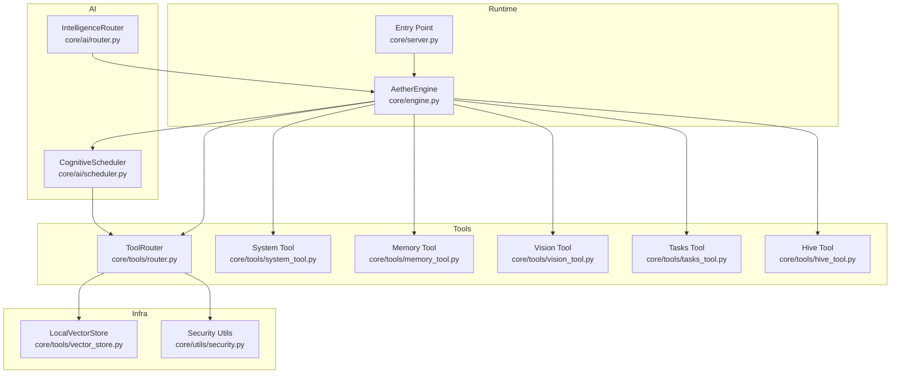

**Diagram sources**
- [engine.py](file://core/engine.py#L26-L240)
- [server.py](file://core/server.py#L105-L149)
- [router.py](file://core/tools/router.py#L120-L360)
- [system_tool.py](file://core/tools/system_tool.py#L198-L310)
- [memory_tool.py](file://core/tools/memory_tool.py#L246-L330)
- [vision_tool.py](file://core/tools/vision_tool.py#L58-L75)
- [tasks_tool.py](file://core/tools/tasks_tool.py#L216-L325)
- [hive_tool.py](file://core/tools/hive_tool.py#L51-L78)
- [scheduler.py](file://core/ai/scheduler.py#L10-L114)
- [vector_store.py](file://core/tools/vector_store.py#L21-L112)
- [security.py](file://core/utils/security.py#L18-L71)

**Section sources**
- [engine.py](file://core/engine.py#L26-L240)
- [server.py](file://core/server.py#L105-L149)

## Core Components
- AetherEngine: Initializes managers, registers tools, and runs the system with parallel tasks using asyncio TaskGroup.
- ToolRouter: Central dispatcher that generates function declarations, routes tool calls, applies biometric middleware, and records performance metrics.
- Tool Modules: Provide handlers and JSON Schema parameter definitions for system, memory, vision, tasks, and hive coordination.
- LocalVectorStore: Lightweight semantic index for tool name recovery and metadata storage.
- CognitiveScheduler: Proactive speculation, overlap buffering, and echo generation to manage cognitive load and responsiveness.
- Security Utilities: Ed25519 signature verification and keypair generation for cryptographic operations.

**Section sources**
- [engine.py](file://core/engine.py#L26-L240)
- [router.py](file://core/tools/router.py#L120-L360)
- [system_tool.py](file://core/tools/system_tool.py#L198-L310)
- [memory_tool.py](file://core/tools/memory_tool.py#L246-L330)
- [vision_tool.py](file://core/tools/vision_tool.py#L58-L75)
- [tasks_tool.py](file://core/tools/tasks_tool.py#L216-L325)
- [hive_tool.py](file://core/tools/hive_tool.py#L51-L78)
- [vector_store.py](file://core/tools/vector_store.py#L21-L112)
- [scheduler.py](file://core/ai/scheduler.py#L10-L114)
- [security.py](file://core/utils/security.py#L18-L71)

## Architecture Overview
The system integrates a neural dispatcher with biometric middleware and a scheduler to coordinate tool execution. The engine registers tool modules, initializes a vector store for semantic indexing, and runs parallel subsystems. Tool calls are dispatched to handlers with standardized response wrapping and A2A metadata.

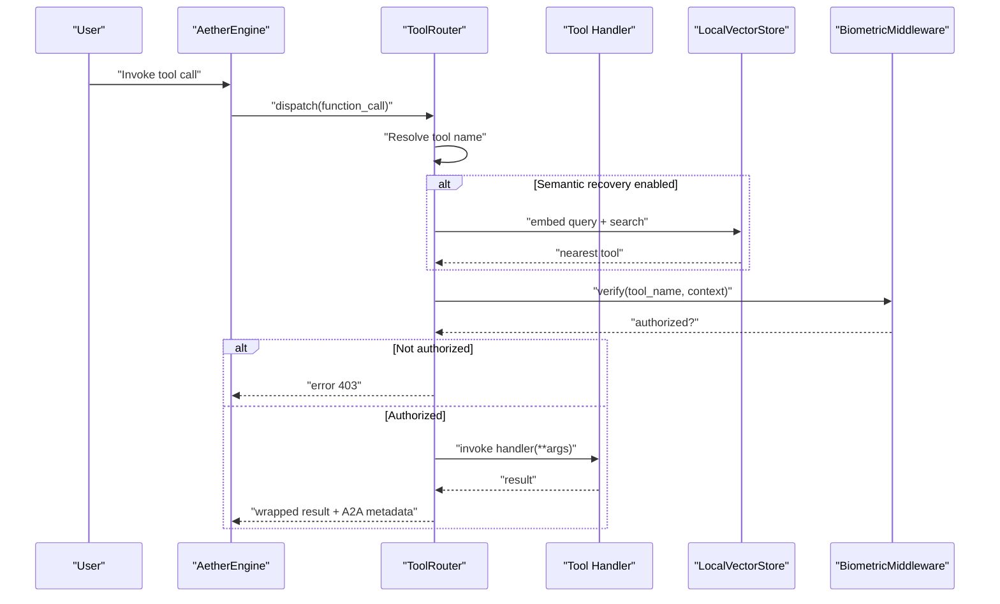

**Diagram sources**
- [engine.py](file://core/engine.py#L189-L240)
- [router.py](file://core/tools/router.py#L234-L360)
- [vector_store.py](file://core/tools/vector_store.py#L66-L112)

## Detailed Component Analysis

### Neural Router and Biometric Middleware
The ToolRouter centralizes tool registration, function declaration generation, dispatching, and performance tracking. It supports:
- Registration via decorator-like definitions or module discovery.
- Biometric middleware enforcement for sensitive tools.
- Semantic recovery using a local vector store.
- A2A response wrapping with latency tier, idempotency, and status codes.

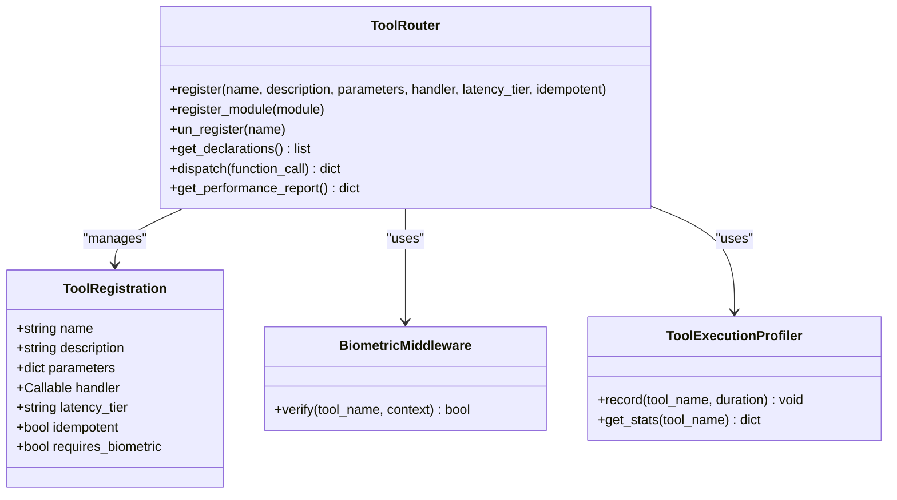

**Diagram sources**
- [router.py](file://core/tools/router.py#L120-L360)

**Section sources**
- [router.py](file://core/tools/router.py#L120-L360)

### Tool Categories and Parameter Schemas

#### System Tools
- Purpose: Host-local actions for time, system info, timers, safe terminal commands, codebase listing, and file reading.
- Validation: Required fields enforced via JSON Schema; safety measures include command blacklists and timeouts.
- Examples: get_current_time, get_system_info, run_timer, run_terminal_command, list_codebase, read_file_content.

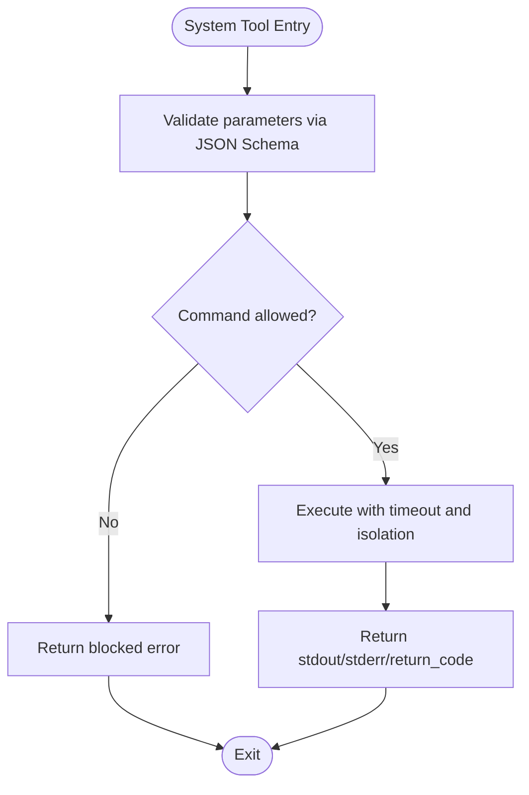

**Diagram sources**
- [system_tool.py](file://core/tools/system_tool.py#L87-L135)

**Section sources**
- [system_tool.py](file://core/tools/system_tool.py#L198-L310)

#### Memory Tools
- Purpose: Persistent memory persistence and recall using Firestore; graceful offline fallback.
- Validation: Enumerated priorities; required keys enforced.
- Operations: save_memory, recall_memory, list_memories, semantic_search, prune_memories.

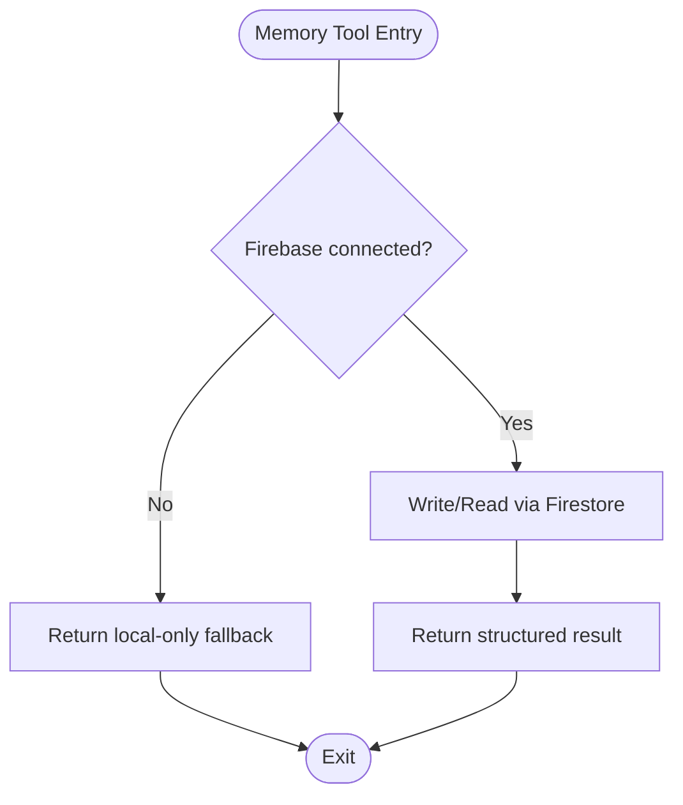

**Diagram sources**
- [memory_tool.py](file://core/tools/memory_tool.py#L40-L93)
- [memory_tool.py](file://core/tools/memory_tool.py#L131-L170)

**Section sources**
- [memory_tool.py](file://core/tools/memory_tool.py#L246-L330)

#### Vision Tools
- Purpose: Desktop screenshot capture and multimodal injection.
- Validation: No parameters required; returns MIME type and Base64-encoded image.
- Integration: Result can be injected into the multimodal session context.

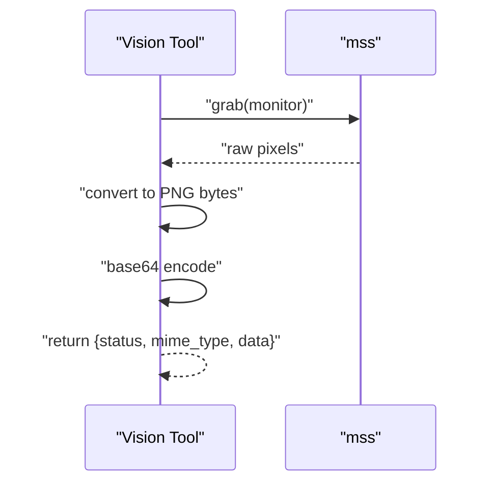

**Diagram sources**
- [vision_tool.py](file://core/tools/vision_tool.py#L19-L55)

**Section sources**
- [vision_tool.py](file://core/tools/vision_tool.py#L58-L75)

#### Task Automation Tools
- Purpose: Task and note persistence via Firestore with graceful fallback.
- Validation: Required fields enforced; enums for priority/status.
- Operations: create_task, list_tasks, complete_task, add_note.

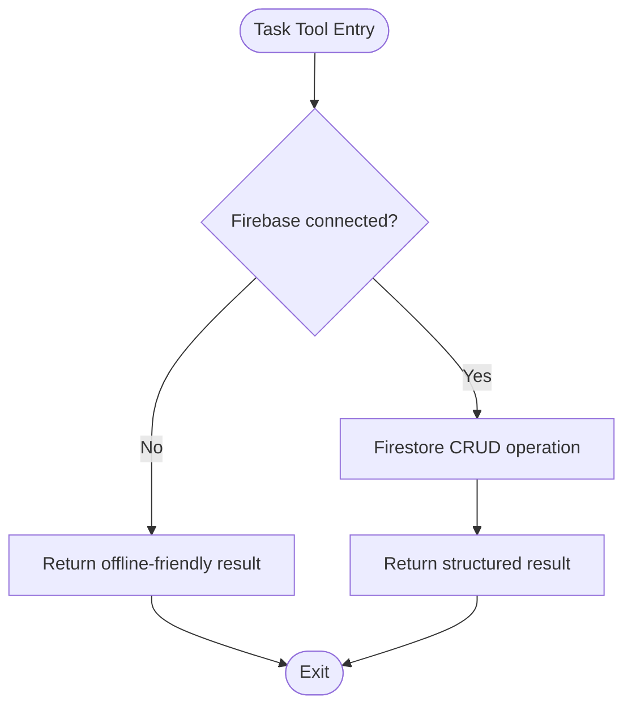

**Diagram sources**
- [tasks_tool.py](file://core/tools/tasks_tool.py#L43-L87)
- [tasks_tool.py](file://core/tools/tasks_tool.py#L140-L181)

**Section sources**
- [tasks_tool.py](file://core/tools/tasks_tool.py#L216-L325)

#### Hive Coordination Tools
- Purpose: Trigger Hive handovers and expert switching.
- Validation: Required target and reason fields.
- Operation: switch_expert_soul.

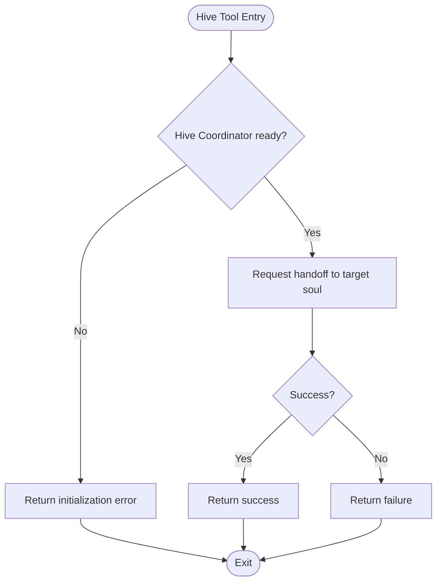

**Diagram sources**
- [hive_tool.py](file://core/tools/hive_tool.py#L27-L49)

**Section sources**
- [hive_tool.py](file://core/tools/hive_tool.py#L51-L78)

### Tool Registration and Discovery
- Module-level get_tools(): Returns a list of tool definitions with name, description, parameters (JSON Schema), and handler.
- ToolRouter.register_module(): Iterates module definitions and registers each tool.
- ToolRouter.register(): Registers a single tool with A2A metadata (latency tier, idempotency).

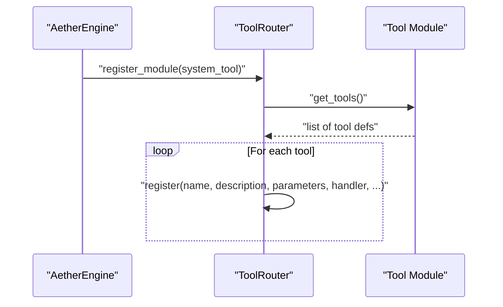

**Diagram sources**
- [engine.py](file://core/engine.py#L124-L151)
- [router.py](file://core/tools/router.py#L183-L200)
- [system_tool.py](file://core/tools/system_tool.py#L198-L310)
- [memory_tool.py](file://core/tools/memory_tool.py#L246-L330)
- [vision_tool.py](file://core/tools/vision_tool.py#L58-L75)
- [tasks_tool.py](file://core/tools/tasks_tool.py#L216-L325)
- [hive_tool.py](file://core/tools/hive_tool.py#L51-L78)

**Section sources**
- [engine.py](file://core/engine.py#L124-L151)
- [router.py](file://core/tools/router.py#L183-L200)

### Execution Pipeline and Parallelism
- Engine.run(): Starts the event bus, gateway, audio, and admin loops concurrently using asyncio TaskGroup.
- ToolRouter.dispatch(): Supports both sync and async handlers; wraps results with A2A metadata and records latency.

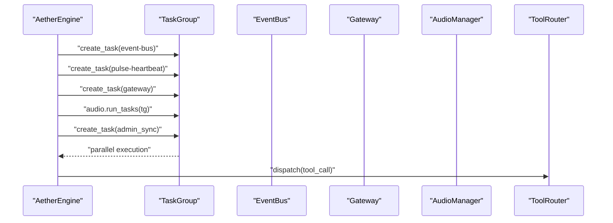

**Diagram sources**
- [engine.py](file://core/engine.py#L189-L225)
- [router.py](file://core/tools/router.py#L234-L360)

**Section sources**
- [engine.py](file://core/engine.py#L189-L225)
- [router.py](file://core/tools/router.py#L234-L360)

### Biometric Middleware and Soul-Lock Verification
- BiometricMiddleware.verify(): Enforces biometric “Soul-Lock” verification using a context flag; supports a development fallback.
- SENSITIVE_TOOLS: A curated set of tools requiring biometric verification.
- Integration: ToolRouter.dispatch() checks if a tool is sensitive and invokes middleware before execution.

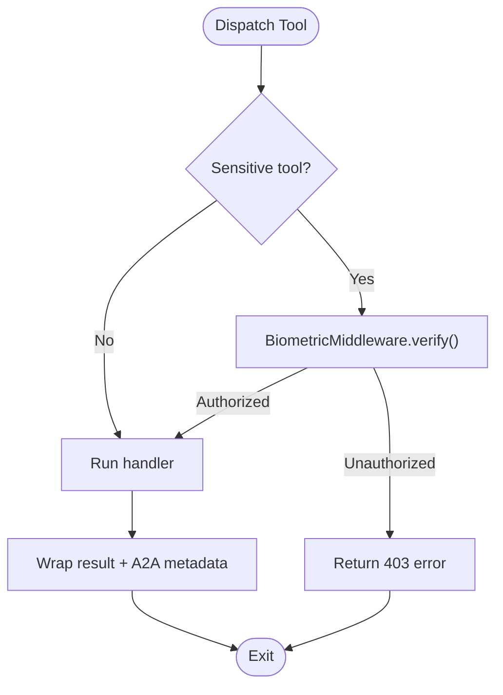

**Diagram sources**
- [router.py](file://core/tools/router.py#L287-L302)
- [router.py](file://core/tools/router.py#L46-L85)

**Section sources**
- [router.py](file://core/tools/router.py#L46-L85)
- [router.py](file://core/tools/router.py#L126-L134)
- [router.py](file://core/tools/router.py#L287-L302)

### Tool Result Processing and Multimodal Injection
- A2A Response Wrapping: Results are normalized into a standard shape with x-a2a-* metadata.
- Vision Injection: Vision tool returns Base64 image data suitable for multimodal injection into the session context.

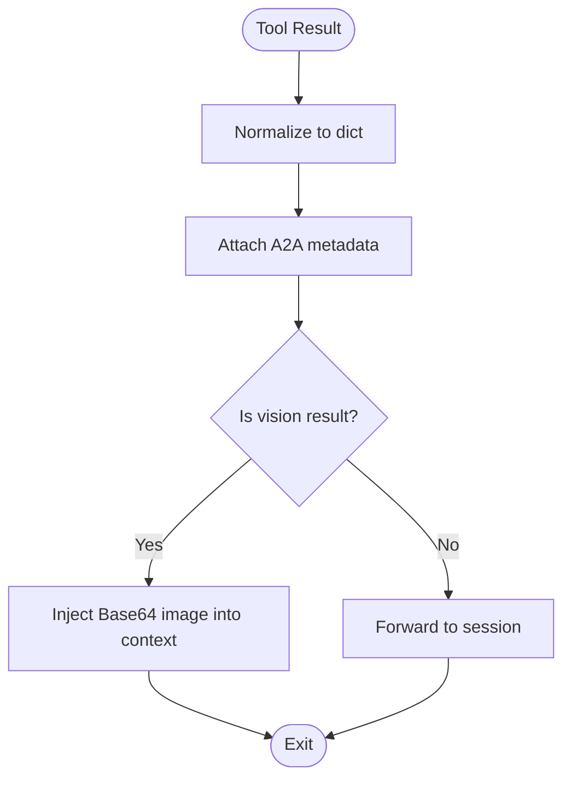

**Diagram sources**
- [router.py](file://core/tools/router.py#L325-L342)
- [vision_tool.py](file://core/tools/vision_tool.py#L45-L52)

**Section sources**
- [router.py](file://core/tools/router.py#L325-L342)
- [vision_tool.py](file://core/tools/vision_tool.py#L45-L52)

### Tool Scheduling and Priority Management
- CognitiveScheduler: Proactive speculation based on keywords, temporal memory retention, interrupt overlap buffer, and echo generation for long-running tools.
- Priority Signals: Adjusts focus based on acoustic traits (e.g., arousal).

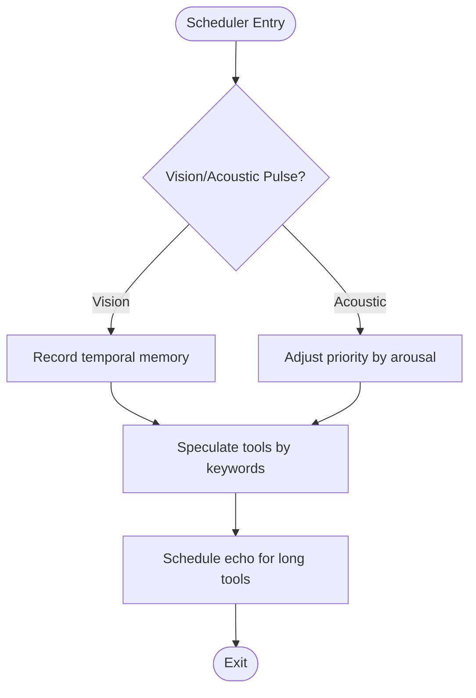

**Diagram sources**
- [scheduler.py](file://core/ai/scheduler.py#L33-L114)

**Section sources**
- [scheduler.py](file://core/ai/scheduler.py#L10-L114)

### Security Utilities
- Ed25519 Signature Verification: Validates signatures using PyNaCl.
- Keypair Generation: Generates public/private key pairs for cryptographic identities.

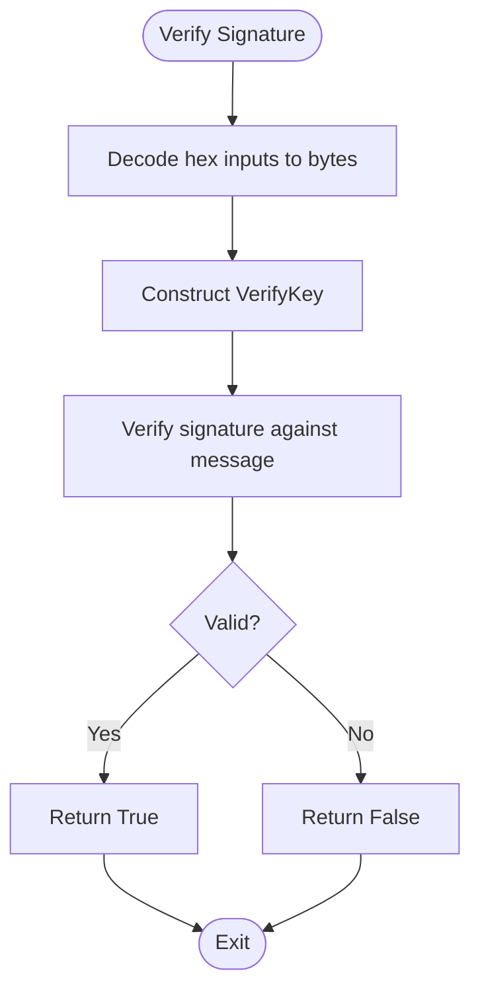

**Diagram sources**
- [security.py](file://core/utils/security.py#L18-L56)

**Section sources**
- [security.py](file://core/utils/security.py#L18-L71)

## Dependency Analysis
- ToolRouter depends on LocalVectorStore for semantic recovery and on BiometricMiddleware for security gating.
- AetherEngine composes managers and registers tools via ToolRouter.
- CognitiveScheduler subscribes to events and interacts with ToolRouter for speculative execution.
- Tool modules depend on their respective connectors (Firebase) for persistence.

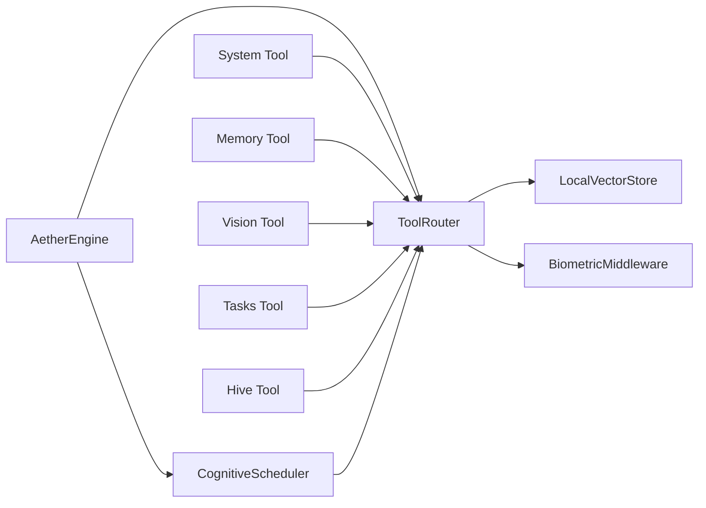

**Diagram sources**
- [engine.py](file://core/engine.py#L26-L100)
- [router.py](file://core/tools/router.py#L120-L200)
- [vector_store.py](file://core/tools/vector_store.py#L21-L82)
- [scheduler.py](file://core/ai/scheduler.py#L16-L32)

**Section sources**
- [engine.py](file://core/engine.py#L26-L100)
- [router.py](file://core/tools/router.py#L120-L200)

## Performance Considerations
- Latency Tiering: Tools declare latency tiers to guide prioritization and expectations.
- Idempotency: Tools can mark themselves idempotent to enable safe retries.
- Profiling: ToolExecutionProfiler tracks durations and computes percentiles for observability.
- Semantic Recovery: Vector store embeddings reduce misrouting and improve resilience.
- Concurrency: Engine uses asyncio TaskGroup to run subsystems in parallel.

Recommendations:
- Prefer idempotent tools for operations that may be retried.
- Use latency tiers to guide scheduling and resource allocation.
- Monitor p95/p99 metrics to identify bottlenecks.
- Limit context sizes (e.g., truncated file reads) to control overhead.

**Section sources**
- [router.py](file://core/tools/router.py#L154-L176)
- [router.py](file://core/tools/router.py#L87-L118)
- [router.py](file://core/tools/router.py#L357-L360)
- [engine.py](file://core/engine.py#L212-L225)

## Troubleshooting Guide
Common issues and resolutions:
- Unknown Tool: ToolRouter attempts semantic recovery; if no close match, returns available tools and error details.
- Argument Errors: Dispatch catches TypeError and returns a 400 with details.
- Execution Failures: Exceptions are caught and returned as 500 errors with logs.
- Biometric Failure: Middleware denies execution with 403; verify context flags or development fallback mode.
- Offline Persistence: Memory and Tasks tools fall back gracefully when Firebase is unavailable.

Operational tips:
- Inspect A2A status codes and latency metadata in responses.
- Review performance reports from ToolRouter to identify slow tools.
- Confirm tool registration via ToolRouter.names and get_declarations.

**Section sources**
- [router.py](file://core/tools/router.py#L244-L282)
- [router.py](file://core/tools/router.py#L344-L356)
- [router.py](file://core/tools/router.py#L55-L84)
- [memory_tool.py](file://core/tools/memory_tool.py#L56-L93)
- [tasks_tool.py](file://core/tools/tasks_tool.py#L67-L87)

## Conclusion
The Tool Execution System provides a robust, secure, and extensible framework for neural-driven tool invocation. Its architecture balances concurrency, resilience, and security through biometric middleware, semantic recovery, and standardized result wrapping. Developers can extend the system by adding new tool modules with JSON Schema parameter definitions and integrating with the existing router and scheduler.

## Appendices

### Developing Custom Tools
Steps to add a new tool:
1. Define handler function(s) with validated parameters.
2. Provide a JSON Schema for parameters in get_tools().
3. Register the tool via ToolRouter.register(...) or module.get_tools().
4. If sensitive, mark requires_biometric or rely on SENSITIVE_TOOLS.
5. Test with Engine.run() and observe A2A metadata and performance metrics.

Integration patterns:
- Use async handlers for I/O-bound workloads.
- Wrap results consistently for downstream consumers.
- Leverage CognitiveScheduler for speculative pre-warming of related tools.

Security considerations:
- Enforce parameter validation using JSON Schema.
- Apply biometric middleware for sensitive operations.
- Avoid exposing unsafe commands or privileged actions.
- Use cryptographic utilities for identity and integrity where applicable.

**Section sources**
- [router.py](file://core/tools/router.py#L146-L176)
- [router.py](file://core/tools/router.py#L183-L200)
- [system_tool.py](file://core/tools/system_tool.py#L87-L135)
- [memory_tool.py](file://core/tools/memory_tool.py#L246-L330)
- [vision_tool.py](file://core/tools/vision_tool.py#L58-L75)
- [tasks_tool.py](file://core/tools/tasks_tool.py#L216-L325)
- [hive_tool.py](file://core/tools/hive_tool.py#L51-L78)
- [security.py](file://core/utils/security.py#L18-L71)