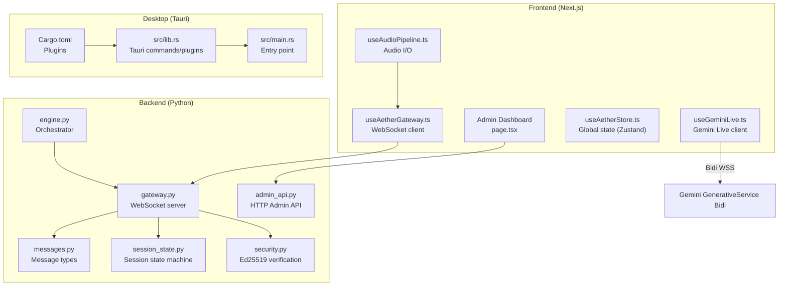
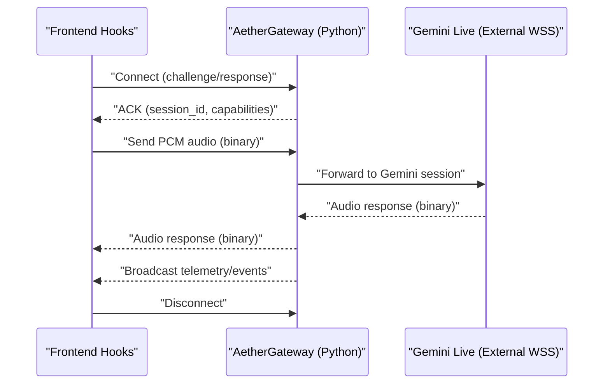
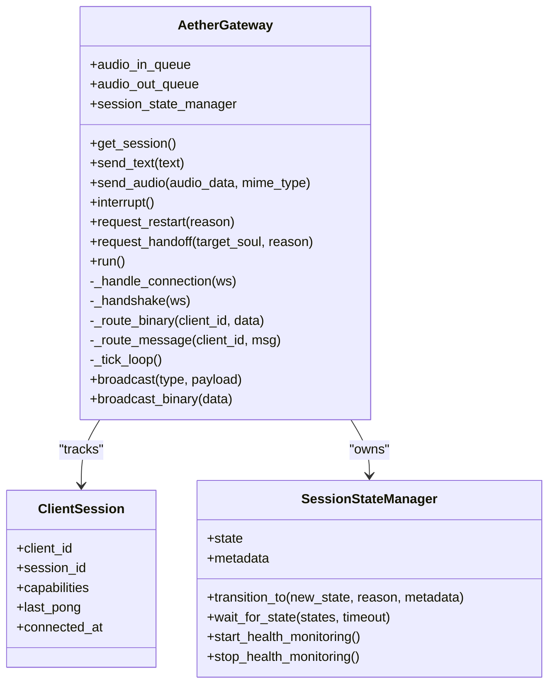
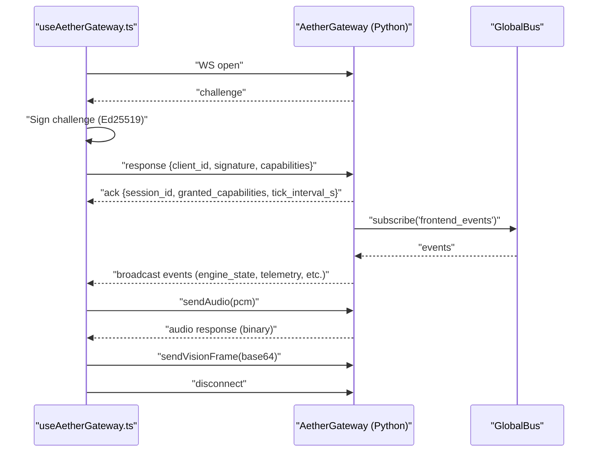
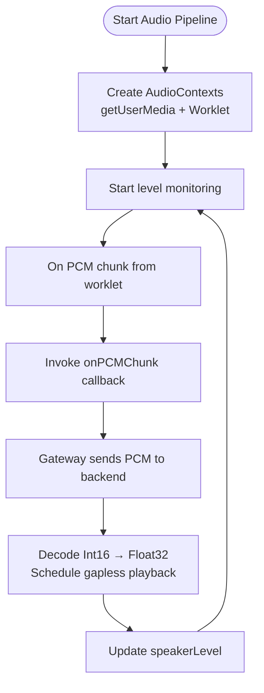
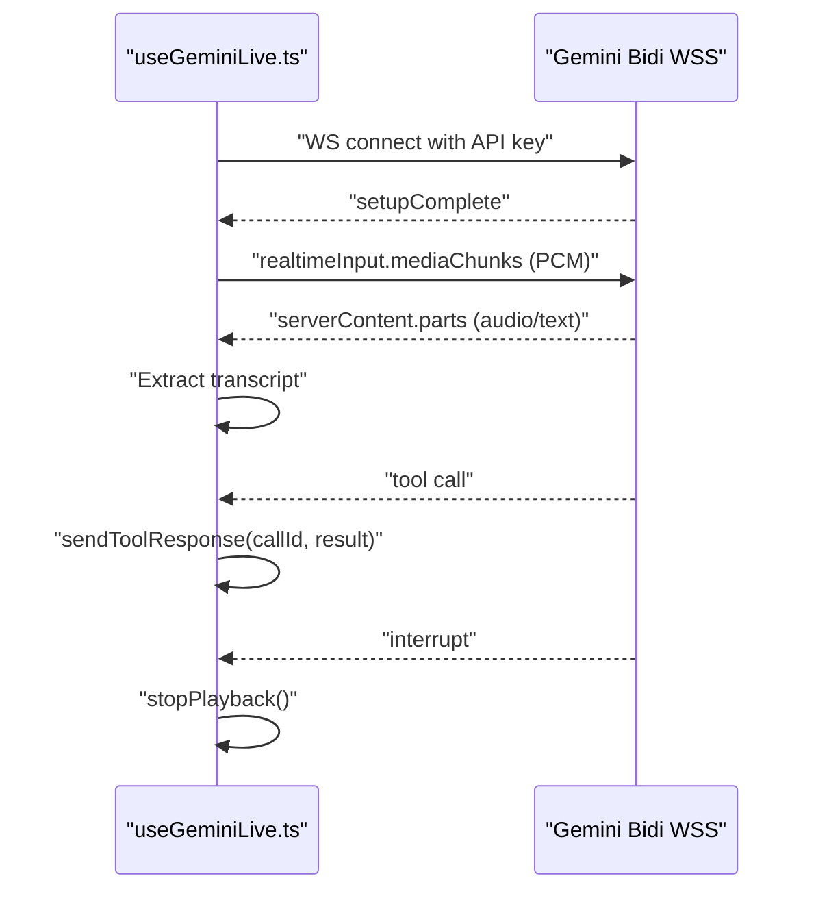
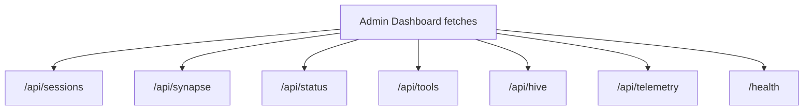
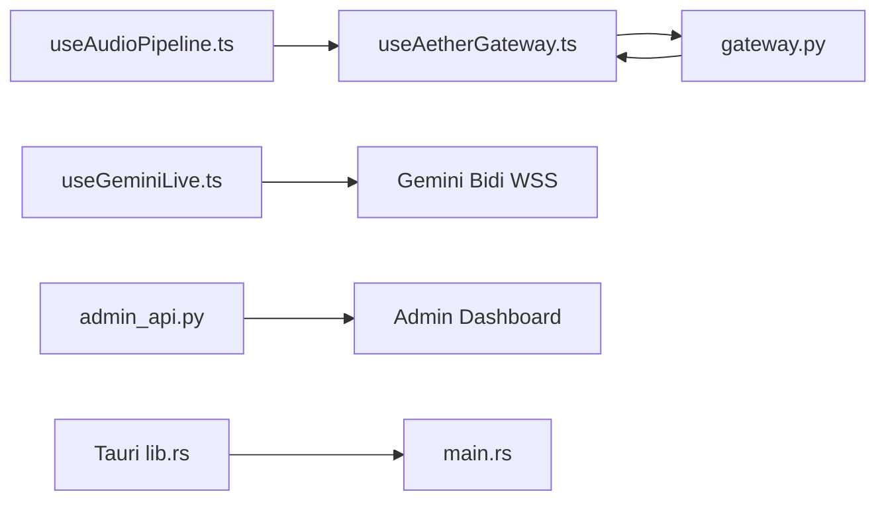

# API Reference

<cite>
**Referenced Files in This Document**
- [useAetherGateway.ts](file://apps/portal/src/hooks/useAetherGateway.ts)
- [gateway.py](file://core/infra/transport/gateway.py)
- [messages.py](file://core/infra/transport/messages.py)
- [session_state.py](file://core/infra/transport/session_state.py)
- [useAudioPipeline.ts](file://apps/portal/src/hooks/useAudioPipeline.ts)
- [useGeminiLive.ts](file://apps/portal/src/hooks/useGeminiLive.ts)
- [admin_api.py](file://core/services/admin_api.py)
- [page.tsx](file://apps/portal/src/app/admin/page.tsx)
- [engine.py](file://core/engine.py)
- [security.py](file://core/utils/security.py)
- [useAetherStore.ts](file://apps/portal/src/store/useAetherStore.ts)
- [lib.rs](file://apps/portal/src-tauri/src/lib.rs)
- [main.rs](file://apps/portal/src-tauri/src/main.rs)
- [Cargo.toml](file://apps/portal/src-tauri/Cargo.toml)
- [geminiLive.integration.test.ts](file://apps/portal/src/__tests__/geminiLive.integration.test.ts)
- [errors.py](file://core/utils/errors.py)
</cite>

## Table of Contents
1. [Introduction](#introduction)
2. [Project Structure](#project-structure)
3. [Core Components](#core-components)
4. [Architecture Overview](#architecture-overview)
5. [Detailed Component Analysis](#detailed-component-analysis)
6. [Dependency Analysis](#dependency-analysis)
7. [Performance Considerations](#performance-considerations)
8. [Troubleshooting Guide](#troubleshooting-guide)
9. [Conclusion](#conclusion)
10. [Appendices](#appendices)

## Introduction
This document provides a comprehensive API reference for Aether Voice OS. It covers:
- WebSocket protocol for audio streaming and control between the frontend and the local gateway
- HTTP endpoints for administrative functions and monitoring
- Frontend APIs including hooks, stores, and state management
- Gemini Live API integration specifics for multimodal audio/video streaming, tool calls, and response handling
- Authentication, security, rate limiting, and versioning
- Protocol-specific examples, error handling, client implementation guidelines, performance optimization, debugging, migration notes, and Tauri plugin APIs for desktop integration

## Project Structure
Aether Voice OS is organized around a Python backend (engine, gateway, tools, services) and a Next.js/Tauri frontend. The frontend exposes:
- A WebSocket gateway for audio streaming and control
- A Gemini Live session hook for multimodal streaming
- An Admin API HTTP server for local monitoring
- A Zustand store for global state and UI state
- Tauri plugins for desktop integration

**Diagram sources**
- [useAetherGateway.ts](file://apps/portal/src/hooks/useAetherGateway.ts#L1-L299)
- [gateway.py](file://core/infra/transport/gateway.py#L1-L828)
- [messages.py](file://core/infra/transport/messages.py#L1-L80)
- [session_state.py](file://core/infra/transport/session_state.py#L1-L463)
- [useAudioPipeline.ts](file://apps/portal/src/hooks/useAudioPipeline.ts#L1-L248)
- [useGeminiLive.ts](file://apps/portal/src/hooks/useGeminiLive.ts#L1-L252)
- [admin_api.py](file://core/services/admin_api.py#L1-L116)
- [page.tsx](file://apps/portal/src/app/admin/page.tsx#L1-L37)
- [engine.py](file://core/engine.py#L1-L240)
- [security.py](file://core/utils/security.py#L1-L71)
- [useAetherStore.ts](file://apps/portal/src/store/useAetherStore.ts#L1-L440)
- [lib.rs](file://apps/portal/src-tauri/src/lib.rs#L1-L68)
- [main.rs](file://apps/portal/src-tauri/src/main.rs#L1-L7)
- [Cargo.toml](file://apps/portal/src-tauri/Cargo.toml#L1-L27)

**Section sources**
- [engine.py](file://core/engine.py#L1-L240)
- [admin_api.py](file://core/services/admin_api.py#L1-L116)
- [useAetherGateway.ts](file://apps/portal/src/hooks/useAetherGateway.ts#L1-L299)
- [useGeminiLive.ts](file://apps/portal/src/hooks/useGeminiLive.ts#L1-L252)
- [useAudioPipeline.ts](file://apps/portal/src/hooks/useAudioPipeline.ts#L1-L248)
- [useAetherStore.ts](file://apps/portal/src/store/useAetherStore.ts#L1-L440)
- [lib.rs](file://apps/portal/src-tauri/src/lib.rs#L1-L68)

## Core Components
- Local WebSocket Gateway: Provides authenticated audio streaming, telemetry, and control to the frontend. Implements a challenge-response handshake and heartbeat.
- Gemini Live Session Hook: Manages a bidirectional WebSocket to Gemini’s GenerativeService Bidi endpoint for multimodal audio/video streaming, tool calls, and transcripts.
- Admin HTTP API: Serves local monitoring data for the Next.js Admin Dashboard.
- Audio Pipeline Hook: Captures microphone audio, streams PCM chunks, and plays audio responses with gapless scheduling.
- Global State Store: Centralized reactive state for UI and system telemetry.
- Tauri Desktop Plugin: Exposes commands and global shortcuts for desktop integration.

**Section sources**
- [gateway.py](file://core/infra/transport/gateway.py#L1-L828)
- [messages.py](file://core/infra/transport/messages.py#L1-L80)
- [session_state.py](file://core/infra/transport/session_state.py#L1-L463)
- [useAetherGateway.ts](file://apps/portal/src/hooks/useAetherGateway.ts#L1-L299)
- [useGeminiLive.ts](file://apps/portal/src/hooks/useGeminiLive.ts#L1-L252)
- [admin_api.py](file://core/services/admin_api.py#L1-L116)
- [useAudioPipeline.ts](file://apps/portal/src/hooks/useAudioPipeline.ts#L1-L248)
- [useAetherStore.ts](file://apps/portal/src/store/useAetherStore.ts#L1-L440)
- [lib.rs](file://apps/portal/src-tauri/src/lib.rs#L1-L68)

## Architecture Overview
The system connects the frontend to the backend via a local WebSocket gateway and to Gemini via a separate bidirectional WebSocket. The engine orchestrates managers, the gateway, and the Admin API. The frontend uses hooks and a store to manage audio, state, and UI.

**Diagram sources**
- [gateway.py](file://core/infra/transport/gateway.py#L529-L617)
- [useAetherGateway.ts](file://apps/portal/src/hooks/useAetherGateway.ts#L77-L126)

**Section sources**
- [engine.py](file://core/engine.py#L189-L240)
- [gateway.py](file://core/infra/transport/gateway.py#L320-L352)

## Detailed Component Analysis

### Local WebSocket Gateway (Aether Gateway)
- Purpose: Authenticate clients, route audio, and broadcast system telemetry and events to the frontend.
- Authentication:
  - Challenge-response using Ed25519 signatures or JWT (HS256) depending on environment.
  - Client capability negotiation during handshake.
- Message Types:
  - Handshake: challenge, response, ack
  - Lifecycle: tick (heartbeat), pong, disconnect
  - Data: audio.chunk, tool.call, tool.result
  - UI: ui.update, vad.event
  - Error: error
- Binary Routing:
  - Incoming PCM audio is enqueued for the Gemini session.
- Broadcast:
  - Engine state, telemetry, neural events, tool results, and other system events are broadcast to connected clients.

**Diagram sources**
- [gateway.py](file://core/infra/transport/gateway.py#L52-L153)
- [gateway.py](file://core/infra/transport/gateway.py#L704-L800)
- [session_state.py](file://core/infra/transport/session_state.py#L71-L120)

**Section sources**
- [gateway.py](file://core/infra/transport/gateway.py#L529-L617)
- [messages.py](file://core/infra/transport/messages.py#L16-L80)
- [session_state.py](file://core/infra/transport/session_state.py#L25-L101)

### Frontend Gateway Hook (useAetherGateway)
- Responsibilities:
  - Manage WebSocket lifecycle and Zero-Trust handshake using Ed25519.
  - Route binary PCM audio to the gateway and receive audio responses.
  - Handle server ticks for latency measurement and heartbeat.
  - Subscribe to broadcast events (engine_state, transcript, telemetry, neural events, tool results, etc.).
- Events and Payloads:
  - engine_state: state string
  - transcript: role, text/content
  - affective_score: frustration, valence, arousal, engagement, pitch, rate
  - audio_telemetry: rms, gain
  - telemetry: paralinguistics metadata, noise_floor
  - neural_event: from_agent, to_agent, task/description, status
  - vision_pulse: timestamp
  - mutation_event: description/mutation
  - tool_result: tool_name, code, result/message, priority
  - repair_state: status, message, log
  - soul_handoff/handover: target_soul/source_agent_id/task_goal

**Diagram sources**
- [useAetherGateway.ts](file://apps/portal/src/hooks/useAetherGateway.ts#L77-L299)
- [gateway.py](file://core/infra/transport/gateway.py#L529-L617)
- [gateway.py](file://core/infra/transport/gateway.py#L519-L528)

**Section sources**
- [useAetherGateway.ts](file://apps/portal/src/hooks/useAetherGateway.ts#L1-L299)
- [gateway.py](file://core/infra/transport/gateway.py#L529-L617)

### Audio Pipeline Hook (useAudioPipeline)
- Responsibilities:
  - Capture microphone at 16 kHz via Web Audio API and AudioWorklet.
  - Encode PCM and emit chunks to the gateway.
  - Play audio responses with gapless scheduling to avoid interruptions.
  - Provide real-time RMS levels for visualization.
- Barge-in:
  - Stops all queued playback sources immediately to prevent overlapping audio.

**Diagram sources**
- [useAudioPipeline.ts](file://apps/portal/src/hooks/useAudioPipeline.ts#L48-L212)

**Section sources**
- [useAudioPipeline.ts](file://apps/portal/src/hooks/useAudioPipeline.ts#L1-L248)

### Gemini Live Session Hook (useGeminiLive)
- Responsibilities:
  - Connect to Gemini GenerativeService Bidi WebSocket with API key and model.
  - Stream PCM audio chunks and optional vision frames.
  - Handle serverContent with audio/text parts, extract transcripts, and manage session status.
  - Support tool calls, tool responses, barge-in, and auto-reconnection with exponential backoff.
- Message Flow:
  - Connect → Receive setupComplete → Stream audio → Receive serverContent with audio/text → Extract transcript → Handle tool calls → Respond to tool calls → Handle interrupts.

**Diagram sources**
- [useGeminiLive.ts](file://apps/portal/src/hooks/useGeminiLive.ts#L65-L252)
- [geminiLive.integration.test.ts](file://apps/portal/src/__tests__/geminiLive.integration.test.ts#L1-L109)

**Section sources**
- [useGeminiLive.ts](file://apps/portal/src/hooks/useGeminiLive.ts#L1-L252)
- [geminiLive.integration.test.ts](file://apps/portal/src/__tests__/geminiLive.integration.test.ts#L1-L109)

### Admin HTTP API
- Purpose: Provide local monitoring data to the Next.js Admin Dashboard.
- Endpoints:
  - GET /api/sessions
  - GET /api/synapse
  - GET /api/status
  - GET /api/tools
  - GET /api/hive
  - GET /api/telemetry
  - GET /health
- CORS: Access-Control-Allow-Origin: *
- Port: 18790 (fallback to dynamic if occupied)

**Diagram sources**
- [admin_api.py](file://core/services/admin_api.py#L26-L82)
- [page.tsx](file://apps/portal/src/app/admin/page.tsx#L12-L37)

**Section sources**
- [admin_api.py](file://core/services/admin_api.py#L1-L116)
- [page.tsx](file://apps/portal/src/app/admin/page.tsx#L1-L37)

### Frontend State Management (useAetherStore)
- Stores:
  - Connection status, engine state, latency, audio levels
  - Telemetry: valence, arousal, engagement, frustration, pitch, rate, spectral centroid, noise floor
  - Transcript messages, neural events, system logs, silent hints
  - Vision activity and pulses, repair state, active soul, tool call history
  - Persona and user preferences
- Actions:
  - Setters for connection, engine state, audio levels, telemetry, vision, repair state
  - Add/remove transcript messages, neural events, system logs, silent hints
  - Manage active soul and tool call history
  - Toggle superpowers and skill focus

**Section sources**
- [useAetherStore.ts](file://apps/portal/src/store/useAetherStore.ts#L202-L440)

### Tauri Plugin APIs
- Commands:
  - check_engine_status: Pings local Admin API health endpoint
- Plugins:
  - Global shortcut: Cmd+Shift+Space toggles window visibility and focus
  - Logging plugin enabled in debug mode
- Build:
  - Uses tauri-build and Rust crate types configured

**Section sources**
- [lib.rs](file://apps/portal/src-tauri/src/lib.rs#L1-L68)
- [main.rs](file://apps/portal/src-tauri/src/main.rs#L1-L7)
- [Cargo.toml](file://apps/portal/src-tauri/Cargo.toml#L1-L27)

## Dependency Analysis
- Frontend-to-Backend:
  - useAetherGateway ↔ AetherGateway (WebSocket)
  - useAudioPipeline ↔ useAetherGateway ↔ AetherGateway
- Frontend-to-Gemini:
  - useGeminiLive ↔ Gemini Bidi WSS
- Backend-to-Frontend:
  - AetherGateway.broadcast → useAetherGateway.onmessage handlers
- Backend-to-Admin:
  - AdminAPIServer serves local endpoints for Admin Dashboard
- Backend-to-Desktop:
  - Tauri commands and plugins integrate with desktop window and shortcuts

**Diagram sources**
- [useAetherGateway.ts](file://apps/portal/src/hooks/useAetherGateway.ts#L1-L299)
- [gateway.py](file://core/infra/transport/gateway.py#L1-L828)
- [useAudioPipeline.ts](file://apps/portal/src/hooks/useAudioPipeline.ts#L1-L248)
- [useGeminiLive.ts](file://apps/portal/src/hooks/useGeminiLive.ts#L1-L252)
- [admin_api.py](file://core/services/admin_api.py#L1-L116)
- [lib.rs](file://apps/portal/src-tauri/src/lib.rs#L1-L68)
- [main.rs](file://apps/portal/src-tauri/src/main.rs#L1-L7)

**Section sources**
- [engine.py](file://core/engine.py#L189-L240)
- [gateway.py](file://core/infra/transport/gateway.py#L320-L352)

## Performance Considerations
- Audio Streaming:
  - Use 16 kHz mono PCM for microphone capture and 24 kHz native playback for audio responses.
  - Gapless playback scheduling prevents audio gaps and improves perceived quality.
- Latency Measurement:
  - Server tick timestamps enable client-side latency calculation.
- Queue Management:
  - Audio input/output queues limit buffering and reduce latency.
- Session State Machine:
  - Atomic transitions and health monitoring reduce downtime and improve resilience.
- Tool Dispatch:
  - Biometric middleware and tiered tool dispatch optimize responsiveness for sensitive operations.

[No sources needed since this section provides general guidance]

## Troubleshooting Guide
- Authentication Failures:
  - Verify Ed25519 challenge-response and JWT configuration. Check environment secrets for JWT verification.
- Connection Issues:
  - Confirm gateway is reachable on the configured port and that the Admin API is running.
  - Inspect handshake timeouts and error messages from the gateway.
- Audio Problems:
  - Ensure microphone permissions and device availability. Validate PCM chunk sizes and rates.
- Gemini Live:
  - Confirm API key and model configuration. Check setupComplete and serverContent parsing.
- Exceptions:
  - Catch AetherError subclasses for structured error handling across layers.

**Section sources**
- [security.py](file://core/utils/security.py#L18-L56)
- [gateway.py](file://core/infra/transport/gateway.py#L569-L617)
- [errors.py](file://core/utils/errors.py#L13-L62)

## Conclusion
Aether Voice OS integrates a secure, low-latency local WebSocket gateway with a robust Gemini Live multimodal session, complemented by a comprehensive Admin HTTP API and a reactive frontend state store. The architecture supports real-time audio streaming, telemetry broadcasting, tool orchestration, and desktop integration via Tauri.

[No sources needed since this section summarizes without analyzing specific files]

## Appendices

### Authentication Methods and Security
- Ed25519 Challenge-Response:
  - Client generates keypair (persisted per tab) and signs server challenge.
- JWT (HS256):
  - Optional token verification using AETHER_JWT_SECRET or GOOGLE_API_KEY.
- Signature Verification:
  - Supports registry-based public keys, ephemeral hex public keys, and global fallback.

**Section sources**
- [useAetherGateway.ts](file://apps/portal/src/hooks/useAetherGateway.ts#L37-L61)
- [gateway.py](file://core/infra/transport/gateway.py#L619-L670)
- [security.py](file://core/utils/security.py#L18-L56)

### Rate Limiting and Versioning
- Rate Limiting:
  - Not explicitly implemented in the referenced code; consider client-side throttling for audio chunk emission and server-side queue limits.
- Versioning:
  - Challenge message includes server_version for compatibility awareness.

**Section sources**
- [messages.py](file://core/infra/transport/messages.py#L47-L53)

### Protocol-Specific Examples
- Local Gateway Handshake:
  - Challenge → Response (Ed25519 signature) → Ack
- Audio Streaming:
  - Binary PCM chunks forwarded to Gemini session
- Gemini Live:
  - setupComplete → realtimeInput.mediaChunks → serverContent.parts → tool calls → tool responses

**Section sources**
- [useAetherGateway.ts](file://apps/portal/src/hooks/useAetherGateway.ts#L97-L126)
- [gateway.py](file://core/infra/transport/gateway.py#L672-L685)
- [useGeminiLive.ts](file://apps/portal/src/hooks/useGeminiLive.ts#L230-L252)
- [geminiLive.integration.test.ts](file://apps/portal/src/__tests__/geminiLive.integration.test.ts#L100-L168)

### Client Implementation Guidelines
- Frontend:
  - Use useAetherGateway for gateway connectivity and audio streaming.
  - Use useAudioPipeline for capturing and playing audio.
  - Use useGeminiLive for multimodal Gemini sessions.
  - Manage state via useAetherStore.
- Backend:
  - Ensure gateway and Admin API are started by the engine.
  - Implement tool dispatch with biometric middleware for sensitive tools.

**Section sources**
- [useAetherGateway.ts](file://apps/portal/src/hooks/useAetherGateway.ts#L69-L299)
- [useAudioPipeline.ts](file://apps/portal/src/hooks/useAudioPipeline.ts#L27-L248)
- [useGeminiLive.ts](file://apps/portal/src/hooks/useGeminiLive.ts#L65-L252)
- [engine.py](file://core/engine.py#L189-L240)

### Migration and Backwards Compatibility Notes
- Message Types:
  - Maintain MessageType discriminators and backward-compatible payload additions.
- Session State:
  - Validate state transitions and preserve metadata for crash recovery snapshots.
- Tool Calls:
  - Ensure tool call signatures and responses remain stable; add optional fields for new capabilities.

**Section sources**
- [messages.py](file://core/infra/transport/messages.py#L16-L80)
- [session_state.py](file://core/infra/transport/session_state.py#L79-L120)