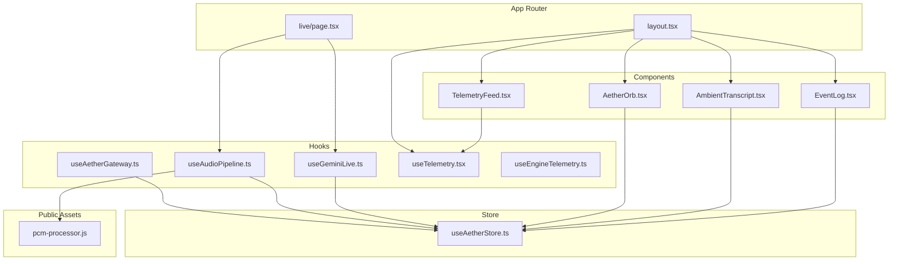
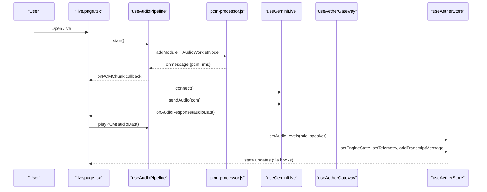
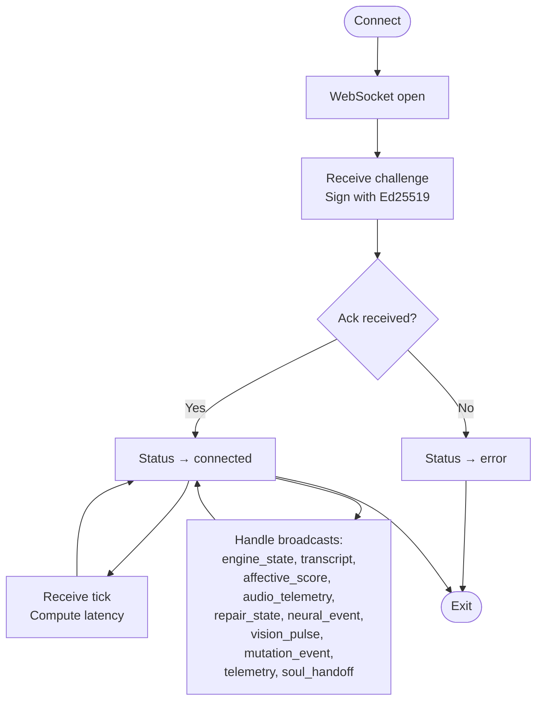
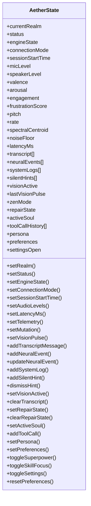
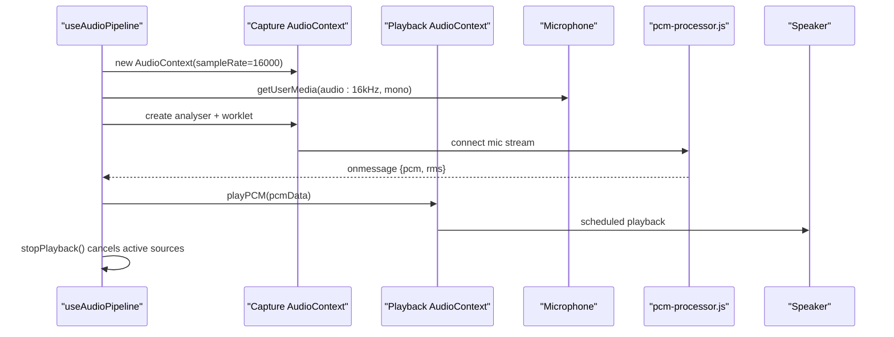
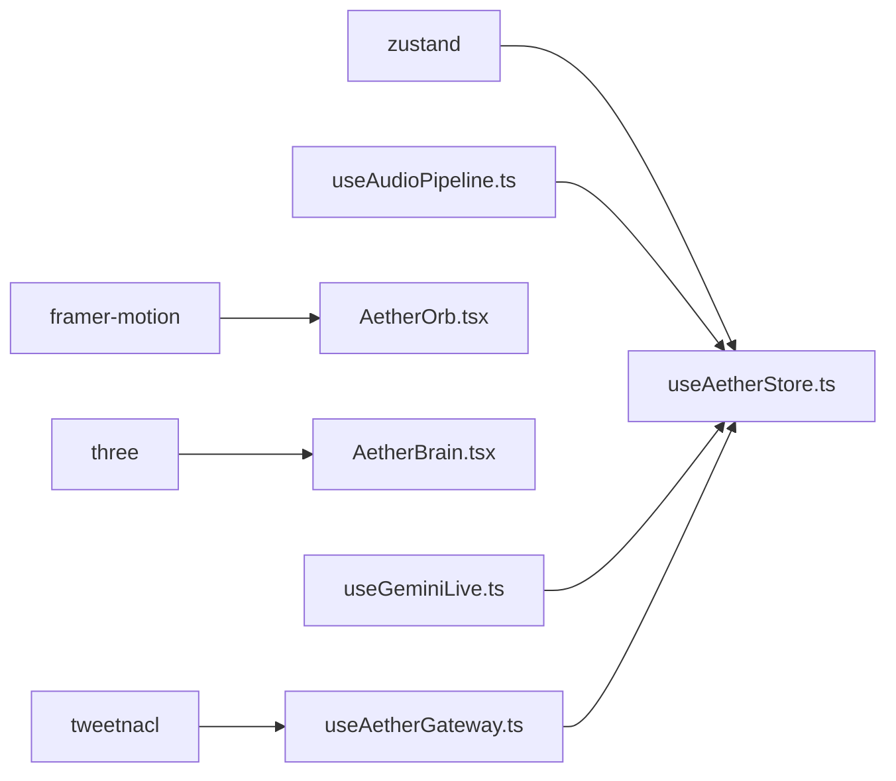

# Frontend API

<cite>
**Referenced Files in This Document**
- [useAetherGateway.ts](file://apps/portal/src/hooks/useAetherGateway.ts)
- [useAetherStore.ts](file://apps/portal/src/store/useAetherStore.ts)
- [useAudioPipeline.ts](file://apps/portal/src/hooks/useAudioPipeline.ts)
- [useTelemetry.tsx](file://apps/portal/src/hooks/useTelemetry.tsx)
- [useEngineTelemetry.ts](file://apps/portal/src/hooks/useEngineTelemetry.ts)
- [useGeminiLive.ts](file://apps/portal/src/hooks/useGeminiLive.ts)
- [pcm-processor.js](file://apps/portal/public/pcm-processor.js)
- [AetherOrb.tsx](file://apps/portal/src/components/AetherOrb.tsx)
- [AmbientTranscript.tsx](file://apps/portal/src/components/AmbientTranscript.tsx)
- [EventLog.tsx](file://apps/portal/src/components/EventLog.tsx)
- [TelemetryFeed.tsx](file://apps/portal/src/components/TelemetryFeed.tsx)
- [live/page.tsx](file://apps/portal/src/app/live/page.tsx)
- [layout.tsx](file://apps/portal/src/app/layout.tsx)
- [package.json](file://apps/portal/package.json)
</cite>

## Table of Contents
1. [Introduction](#introduction)
2. [Project Structure](#project-structure)
3. [Core Components](#core-components)
4. [Architecture Overview](#architecture-overview)
5. [Detailed Component Analysis](#detailed-component-analysis)
6. [Dependency Analysis](#dependency-analysis)
7. [Performance Considerations](#performance-considerations)
8. [Troubleshooting Guide](#troubleshooting-guide)
9. [Conclusion](#conclusion)
10. [Appendices](#appendices)

## Introduction
This document provides comprehensive frontend API documentation for the Aether Voice OS React application. It focuses on the primary hooks and stores that power voice interaction, audio streaming, telemetry, and UI state synchronization. Specifically, it documents:
- useAetherGateway: WebSocket connection management, Ed25519 challenge-response authentication, and real-time audio streaming integration with the local Python backend gateway.
- useAetherStore: Centralized state management for session, audio processing, and UI state synchronization.
- useAudioPipeline: Browser audio capture, processing, and playback coordination with gapless scheduling and instant barge-in.
- useTelemetry: A lightweight telemetry logging context for UI telemetry streams.

It also covers component interfaces, prop definitions, event handlers, state update patterns, integration strategies, error handling, and performance optimizations.

## Project Structure
The frontend is a Next.js application under apps/portal. Key areas:
- Hooks: apps/portal/src/hooks (audio, gateway, telemetry, session)
- Store: apps/portal/src/store (Zustand state)
- Public assets: apps/portal/public (AudioWorklet script)
- Components: apps/portal/src/components (UI and HUD)
- Pages: apps/portal/src/app (Next.js app router pages)
- Dependencies: apps/portal/package.json

**Diagram sources**
- [layout.tsx](file://apps/portal/src/app/layout.tsx#L42-L56)
- [live/page.tsx](file://apps/portal/src/app/live/page.tsx#L37-L89)
- [useAetherGateway.ts](file://apps/portal/src/hooks/useAetherGateway.ts#L69-L296)
- [useAetherStore.ts](file://apps/portal/src/store/useAetherStore.ts#L289-L440)
- [useAudioPipeline.ts](file://apps/portal/src/hooks/useAudioPipeline.ts#L27-L246)
- [useGeminiLive.ts](file://apps/portal/src/hooks/useGeminiLive.ts#L65-L483)
- [pcm-processor.js](file://apps/portal/public/pcm-processor.js#L18-L81)
- [AetherOrb.tsx](file://apps/portal/src/components/AetherOrb.tsx#L32-L240)
- [AmbientTranscript.tsx](file://apps/portal/src/components/AmbientTranscript.tsx#L16-L87)
- [EventLog.tsx](file://apps/portal/src/components/EventLog.tsx#L31-L68)
- [TelemetryFeed.tsx](file://apps/portal/src/components/TelemetryFeed.tsx#L13-L57)

**Section sources**
- [layout.tsx](file://apps/portal/src/app/layout.tsx#L42-L56)
- [package.json](file://apps/portal/package.json#L1-L53)

## Core Components
This section summarizes the primary APIs and their responsibilities.

- useAetherGateway
  - Purpose: Manage WebSocket connection to the local Aether Gateway, perform Ed25519 challenge-response authentication, route binary audio, and synchronize engine state, transcripts, telemetry, and system events.
  - Key exports: status, latencyMs, connect(), disconnect(), sendAudio(pcm), sendVisionFrame(base64), onAudioResponse ref.
  - Authentication: Generates or retrieves a persistent Ed25519 keypair and signs gateway challenges.
  - Events: Handles ack, tick, engine_state, transcript, affective_score, audio_telemetry, repair_state, neural_event, vision_pulse, mutation_event, telemetry (paralinguistics/noise_floor), soul_handoff/handover.

- useAetherStore
  - Purpose: Centralized state for session, engine state, audio levels, telemetry metrics, transcripts, system logs, silent hints, vision pulses, multi-agent soul switching, and user preferences/persona.
  - Persistence: Uses Zustand with persistence middleware to localStorage for preferences.
  - Actions: setStatus, setEngineState, setAudioLevels, setTelemetry, addTranscriptMessage, addSystemLog, addSilentHint, setVisionActive, setActiveSoul, setPersona, setPreferences, and more.

- useAudioPipeline
  - Purpose: Capture microphone audio at 16 kHz, encode PCM via AudioWorklet, schedule gapless playback, and support instant barge-in.
  - Key exports: state, micLevel, speakerLevel, start(), stop(), playPCM(pcmData, sampleRate?), stopPlayback(), onPCMChunk ref.
  - Worklet: Uses /pcm-processor.js to convert Float32 to Int16 PCM and emit chunks with RMS energy.

- useTelemetry
  - Purpose: Lightweight telemetry logging context for UI telemetry streams.
  - Key exports: logs array, addLog(message, type?, source?), clearLogs(), provider wrapper TelemetryProvider.
  - Deprecated counterpart: useEngineTelemetry is deprecated; telemetry now flows through useAetherGateway.

**Section sources**
- [useAetherGateway.ts](file://apps/portal/src/hooks/useAetherGateway.ts#L20-L35)
- [useAetherStore.ts](file://apps/portal/src/store/useAetherStore.ts#L202-L286)
- [useAudioPipeline.ts](file://apps/portal/src/hooks/useAudioPipeline.ts#L14-L25)
- [useTelemetry.tsx](file://apps/portal/src/hooks/useTelemetry.tsx#L8-L20)
- [useEngineTelemetry.ts](file://apps/portal/src/hooks/useEngineTelemetry.ts#L21-L32)

## Architecture Overview
End-to-end voice interaction pipeline integrating browser audio, Gemini Live, and the local gateway.

**Diagram sources**
- [live/page.tsx](file://apps/portal/src/app/live/page.tsx#L37-L89)
- [useAudioPipeline.ts](file://apps/portal/src/hooks/useAudioPipeline.ts#L48-L134)
- [pcm-processor.js](file://apps/portal/public/pcm-processor.js#L18-L81)
- [useGeminiLive.ts](file://apps/portal/src/hooks/useGeminiLive.ts#L90-L228)
- [useAetherGateway.ts](file://apps/portal/src/hooks/useAetherGateway.ts#L97-L248)
- [useAetherStore.ts](file://apps/portal/src/store/useAetherStore.ts#L333-L344)

## Detailed Component Analysis

### useAetherGateway Hook
- Responsibilities
  - Establish and manage a WebSocket connection to the local gateway URL.
  - Perform Ed25519 challenge-response authentication using a persisted keypair.
  - Route binary PCM audio to the gateway and forward vision frames.
  - Synchronize engine state, transcripts, telemetry, and system events to the store.
  - Compute and propagate latency from gateway ticks.

- Key Types and Returns
  - GatewayStatus union: disconnected, connecting, handshaking, connected, error.
  - AetherGatewayReturn: status, latencyMs, connect(), disconnect(), sendAudio(pcm), sendVisionFrame(base64), onAudioResponse ref.

- Authentication Flow
  - Retrieves or creates an Ed25519 keypair from sessionStorage.
  - On receiving a challenge message, signs the challenge and sends a response with capabilities.

- Event Handling
  - ack: sets status to connected and records session start.
  - tick: computes latency and updates store.
  - engine_state: updates engine state and logs.
  - transcript: adds transcript messages.
  - affective_score and audio_telemetry: updates telemetry and audio levels.
  - repair_state, neural_event, vision_pulse, mutation_event, telemetry (paralinguistics/noise_floor), soul_handoff/handover: update store accordingly.

- Integration Notes
  - Uses the store to update UI and system state.
  - Provides onAudioResponse ref for consuming raw audio from the gateway.

**Diagram sources**
- [useAetherGateway.ts](file://apps/portal/src/hooks/useAetherGateway.ts#L77-L135)
- [useAetherGateway.ts](file://apps/portal/src/hooks/useAetherGateway.ts#L137-L241)

**Section sources**
- [useAetherGateway.ts](file://apps/portal/src/hooks/useAetherGateway.ts#L20-L35)
- [useAetherGateway.ts](file://apps/portal/src/hooks/useAetherGateway.ts#L69-L296)

### useAetherStore Hook
- State Model
  - Realm, Connection (status, engineState, connectionMode, sessionStartTime), Audio (micLevel, speakerLevel), Telemetry (valence, arousal, engagement, frustrationScore, pitch, rate, spectralCentroid, noiseFloor, latencyMs), Data (transcript, neuralEvents, systemLogs, silentHints, visionActive, lastVisionPulse, zenMode, repairState), Multi-Agent (activeSoul, toolCallHistory), Persona & Preferences (persona, preferences, settingsOpen).

- Actions
  - Connection: setStatus, setEngineState, setConnectionMode, setSessionStartTime.
  - Audio: setAudioLevels, setLatencyMs, setTelemetry, setMutation, setVisionPulse.
  - Data: addTranscriptMessage, addNeuralEvent, updateNeuralEvent, addSystemLog, addSilentHint, dismissHint, setVisionActive, clearTranscript, setRepairState, clearRepairState.
  - Multi-Agent: setActiveSoul, addToolCall.
  - Persona & Preferences: setPersona, setPreferences, toggleSuperpower, toggleSkillFocus, toggleSettings, resetPreferences.

- Persistence
  - Partial persistence to localStorage for preferences only.

**Diagram sources**
- [useAetherStore.ts](file://apps/portal/src/store/useAetherStore.ts#L202-L286)

**Section sources**
- [useAetherStore.ts](file://apps/portal/src/store/useAetherStore.ts#L202-L286)
- [useAetherStore.ts](file://apps/portal/src/store/useAetherStore.ts#L289-L440)

### useAudioPipeline Hook
- Responsibilities
  - Initialize two AudioContexts: one for capture at 16 kHz and another for playback at native rate.
  - Capture microphone via getUserMedia with echo cancellation, noise suppression, and auto gain control.
  - Use AudioWorklet to encode Float32 PCM to Int16 and periodically emit chunks with RMS energy.
  - Play audio back via gapless scheduling of AudioBufferSourceNodes to avoid gaps.
  - Support instant barge-in by stopping all active sources.

- Key Types and Returns
  - PipelineState: idle, starting, active, error.
  - AudioPipelineReturn: state, micLevel, speakerLevel, start(), stop(), playPCM(pcmData, sampleRate?), stopPlayback(), onPCMChunk ref.

- AudioWorklet Integration
  - Loads /pcm-processor.js and listens for messages containing pcm buffers and RMS energy.
  - Emits PCM chunks to the main thread with zero-copy transfer.

- Playback Coordination
  - Decodes Int16 PCM to Float32, constructs AudioBuffer, and schedules playback to minimize gaps.
  - Tracks active sources and clears them on barge-in.

**Diagram sources**
- [useAudioPipeline.ts](file://apps/portal/src/hooks/useAudioPipeline.ts#L48-L134)
- [pcm-processor.js](file://apps/portal/public/pcm-processor.js#L18-L81)

**Section sources**
- [useAudioPipeline.ts](file://apps/portal/src/hooks/useAudioPipeline.ts#L14-L25)
- [useAudioPipeline.ts](file://apps/portal/src/hooks/useAudioPipeline.ts#L27-L246)
- [pcm-processor.js](file://apps/portal/public/pcm-processor.js#L18-L81)

### useTelemetry Hook
- Purpose
  - Provide a lightweight telemetry logging context for UI telemetry streams.
  - Expose logs array and methods to add/clear logs.

- Deprecated Counterpart
  - useEngineTelemetry is deprecated; all telemetry now flows through useAetherGateway.

**Section sources**
- [useTelemetry.tsx](file://apps/portal/src/hooks/useTelemetry.tsx#L8-L20)
- [useEngineTelemetry.ts](file://apps/portal/src/hooks/useEngineTelemetry.ts#L21-L32)

### Integration Examples and Patterns
- Live Page Integration
  - Initializes audio pipeline and connects to Gemini Live on mount.
  - Wires audio.onPCMChunk to send PCM to Gemini and Gemini.onAudioResponse to playPCM via the pipeline.
  - Derives line status from session and pipeline states.

- Component Composition
  - AetherOrb reads engineState and audio levels from the store to drive animations.
  - AmbientTranscript renders recent transcript entries based on store state.
  - EventLog displays system logs from the store.
  - TelemetryFeed consumes UI telemetry via useTelemetry.

**Section sources**
- [live/page.tsx](file://apps/portal/src/app/live/page.tsx#L37-L89)
- [AetherOrb.tsx](file://apps/portal/src/components/AetherOrb.tsx#L32-L240)
- [AmbientTranscript.tsx](file://apps/portal/src/components/AmbientTranscript.tsx#L16-L87)
- [EventLog.tsx](file://apps/portal/src/components/EventLog.tsx#L31-L68)
- [TelemetryFeed.tsx](file://apps/portal/src/components/TelemetryFeed.tsx#L13-L57)

## Dependency Analysis
- Runtime dependencies include tweetnacl for Ed25519, zustand for state, framer-motion for animations, and three.js for 3D components.
- AudioWorklet script is loaded from public assets and registered in the AudioWorklet context.
- The gateway hook depends on the store for state updates; the audio pipeline and Gemini hook depend on the store for telemetry and UI state.

**Diagram sources**
- [package.json](file://apps/portal/package.json#L16-L33)
- [useAetherGateway.ts](file://apps/portal/src/hooks/useAetherGateway.ts#L3-L5)
- [useAetherStore.ts](file://apps/portal/src/store/useAetherStore.ts#L1-L2)
- [AetherOrb.tsx](file://apps/portal/src/components/AetherOrb.tsx#L16-L17)

**Section sources**
- [package.json](file://apps/portal/package.json#L16-L33)

## Performance Considerations
- AudioWorklet Efficiency
  - Pre-allocated ring buffer and zero-copy transfers reduce GC pressure and improve throughput.
  - Larger PCM chunks (256 ms) decrease WebSocket message overhead.

- Gapless Playback
  - Scheduling playback relative to nextPlayTime prevents gaps between audio chunks.
  - Active source tracking and immediate stop on barge-in prevent residual audio.

- Store Updates
  - Using getState() inside render loops (as done in gateway) avoids unnecessary re-renders for direct subscribers while still updating Zustand-backed components.

- Latency Measurement
  - Gateway tick timestamps and rolling averages in Gemini Live provide accurate latency metrics.

[No sources needed since this section provides general guidance]

## Troubleshooting Guide
- Connection Failures
  - Verify NEXT_PUBLIC_AETHER_GATEWAY_URL and NEXT_PUBLIC_GEMINI_KEY environment variables.
  - Check gateway logs and ensure the backend is reachable.

- Authentication Errors
  - Confirm Ed25519 keypair persistence and that the gateway receives a valid signature response.

- Audio Issues
  - Ensure microphone permissions are granted and getUserMedia succeeds.
  - Verify AudioWorklet loads /pcm-processor.js and emits PCM chunks.

- Telemetry Visibility
  - Use TelemetryFeed to inspect UI telemetry logs.
  - Note that useEngineTelemetry is deprecated; rely on useAetherGateway for telemetry.

**Section sources**
- [useAetherGateway.ts](file://apps/portal/src/hooks/useAetherGateway.ts#L67-L67)
- [useGeminiLive.ts](file://apps/portal/src/hooks/useGeminiLive.ts#L55-L59)
- [useTelemetry.tsx](file://apps/portal/src/hooks/useTelemetry.tsx#L24-L44)
- [useEngineTelemetry.ts](file://apps/portal/src/hooks/useEngineTelemetry.ts#L21-L32)

## Conclusion
The Aether Voice OS frontend integrates a robust audio pipeline, secure gateway communication, and centralized state management to deliver a seamless voice experience. The documented hooks and store provide clear extension points for UI components, telemetry, and advanced audio features while maintaining performance and reliability.

[No sources needed since this section summarizes without analyzing specific files]

## Appendices

### API Reference Tables

- useAetherGateway Return
  - status: GatewayStatus
  - latencyMs: number
  - connect(): Promise<void>
  - disconnect(): void
  - sendAudio(pcm: ArrayBuffer): void
  - sendVisionFrame(base64: string): void
  - onAudioResponse: MutableRefObject<((audio: ArrayBuffer) => void) | null>

- useAudioPipeline Return
  - state: PipelineState
  - micLevel: number
  - speakerLevel: number
  - start(): Promise<void>
  - stop(): void
  - playPCM(pcmData: ArrayBuffer, sampleRate?: number): void
  - stopPlayback(): void
  - onPCMChunk: MutableRefObject<((pcm: ArrayBuffer) => void) | null>

- useTelemetry Context
  - logs: TelemetryItem[]
  - addLog(message: string, type?: "info" | "action" | "error" | "success", source?: string): void
  - clearLogs(): void

- useAetherStore State and Actions
  - State keys include realm, connection, audio, telemetry, data, multi-agent, persona, preferences.
  - Actions include setStatus, setEngineState, setAudioLevels, setTelemetry, addTranscriptMessage, addSystemLog, addSilentHint, setVisionActive, setActiveSoul, setPersona, setPreferences, and toggles.

**Section sources**
- [useAetherGateway.ts](file://apps/portal/src/hooks/useAetherGateway.ts#L27-L35)
- [useAudioPipeline.ts](file://apps/portal/src/hooks/useAudioPipeline.ts#L16-L25)
- [useTelemetry.tsx](file://apps/portal/src/hooks/useTelemetry.tsx#L16-L20)
- [useAetherStore.ts](file://apps/portal/src/store/useAetherStore.ts#L202-L286)