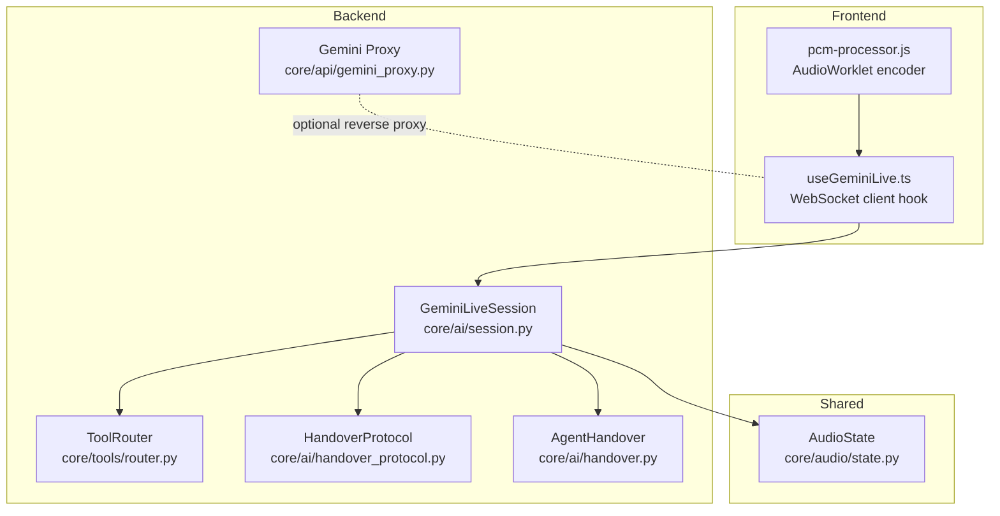
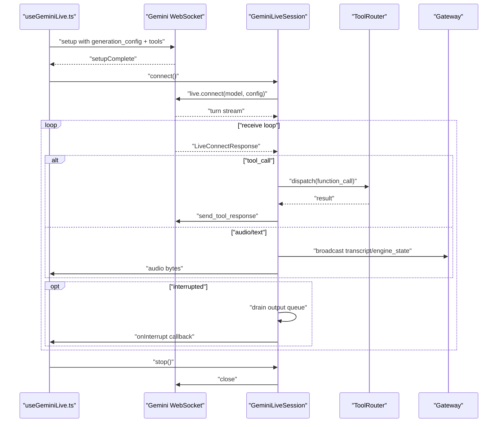
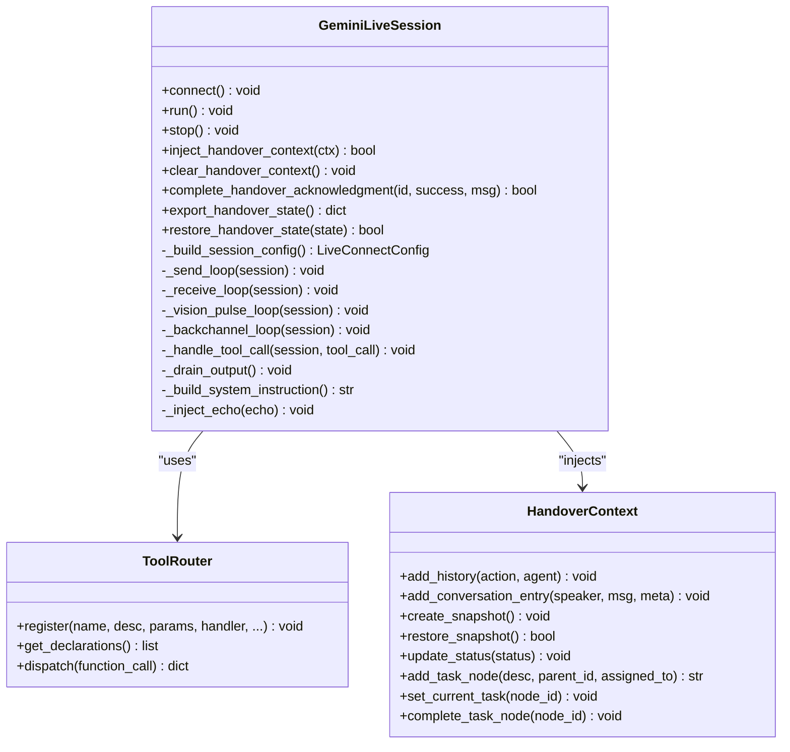
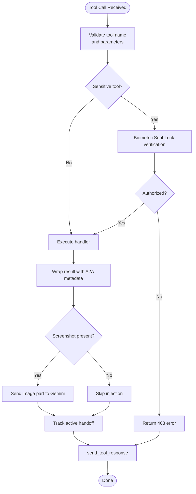
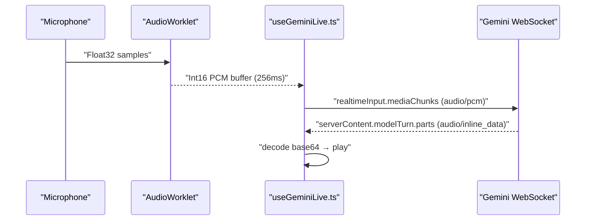
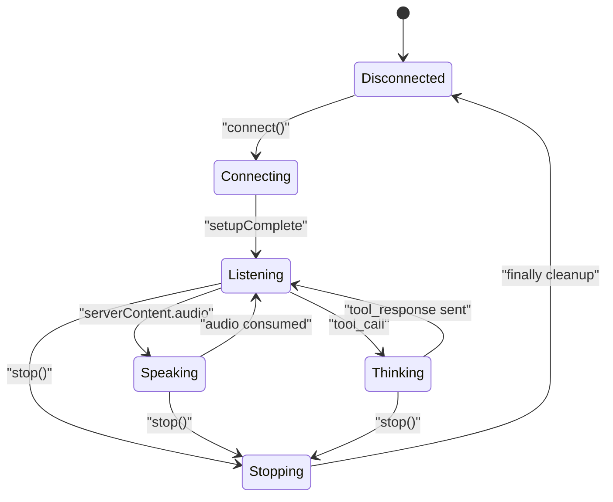
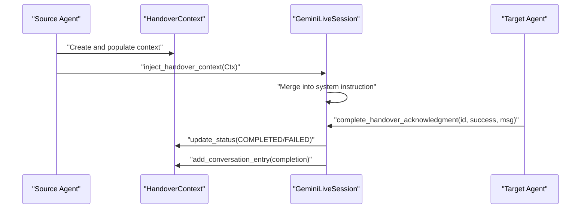
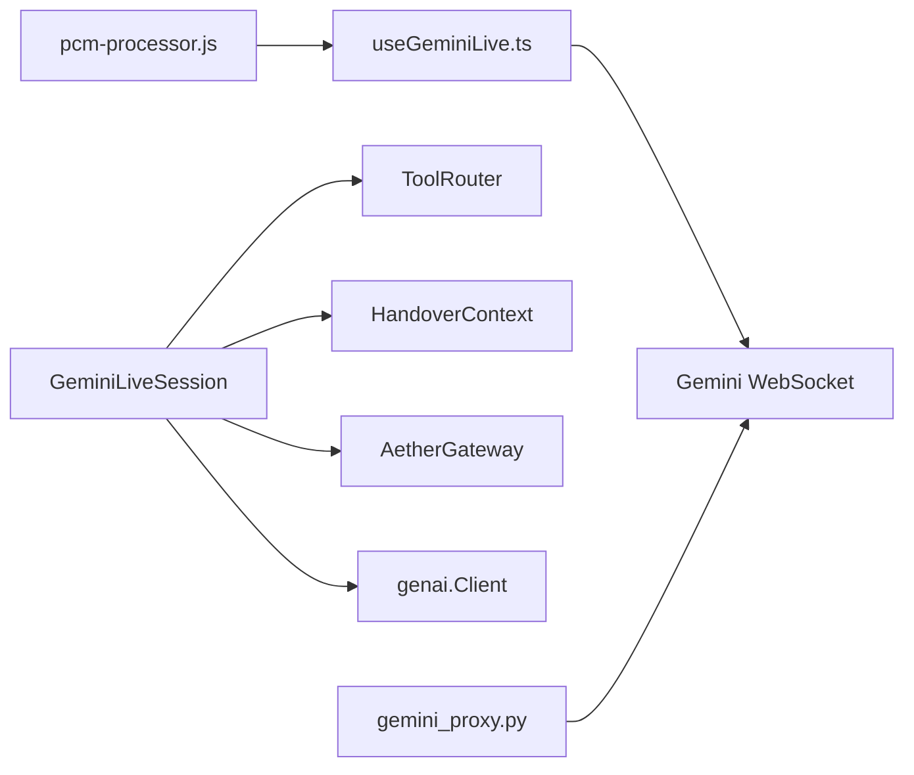

# Gemini Live Integration

<cite>
**Referenced Files in This Document**
- [session.py](file://core/ai/session.py)
- [handover_protocol.py](file://core/ai/handover_protocol.py)
- [handover.py](file://core/ai/handover.py)
- [router.py](file://core/tools/router.py)
- [gemini_proxy.py](file://core/api/gemini_proxy.py)
- [geminiLive.integration.test.ts](file://apps/portal/src/__tests__/geminiLive.integration.test.ts)
- [useGeminiLive.ts](file://apps/portal/src/hooks/useGeminiLive.ts)
- [pcm-processor.js](file://apps/portal/public/pcm-processor.js)
- [state.py](file://core/audio/state.py)
- [test_gemini_live_session.py](file://tests/unit/test_gemini_live_session.py)
</cite>

## Table of Contents
1. [Introduction](#introduction)
2. [Project Structure](#project-structure)
3. [Core Components](#core-components)
4. [Architecture Overview](#architecture-overview)
5. [Detailed Component Analysis](#detailed-component-analysis)
6. [Dependency Analysis](#dependency-analysis)
7. [Performance Considerations](#performance-considerations)
8. [Troubleshooting Guide](#troubleshooting-guide)
9. [Conclusion](#conclusion)
10. [Appendices](#appendices)

## Introduction
This document provides comprehensive API documentation for integrating Gemini Live within Aether Voice OS. It focuses on the GeminiLiveSession class, initialization parameters, connection management, real-time audio streaming protocols, tool calling mechanisms, session lifecycle, agent specialization and handover, proactive intervention workflows, and error handling strategies. It also documents the handover protocol for seamless expert switching with context preservation.

## Project Structure
The Gemini Live integration spans backend Python services, frontend hooks, and audio processing utilities:
- Backend session and tool orchestration: core/ai/session.py, core/tools/router.py, core/ai/handover_protocol.py, core/ai/handover.py
- Frontend integration: apps/portal/src/hooks/useGeminiLive.ts, apps/portal/public/pcm-processor.js
- Proxy and tests: core/api/gemini_proxy.py, apps/portal/src/__tests__/geminiLive.integration.test.ts, tests/unit/test_gemini_live_session.py
- Audio state and telemetry: core/audio/state.py

**Diagram sources**
- [session.py](file://core/ai/session.py#L43-L236)
- [router.py](file://core/tools/router.py#L120-L360)
- [handover_protocol.py](file://core/ai/handover_protocol.py#L107-L245)
- [handover.py](file://core/ai/handover.py#L34-L71)
- [gemini_proxy.py](file://core/api/gemini_proxy.py#L60-L105)
- [useGeminiLive.ts](file://apps/portal/src/hooks/useGeminiLive.ts#L65-L252)
- [pcm-processor.js](file://apps/portal/public/pcm-processor.js#L18-L81)
- [state.py](file://core/audio/state.py#L36-L129)

**Section sources**
- [session.py](file://core/ai/session.py#L1-L922)
- [router.py](file://core/tools/router.py#L1-L360)
- [handover_protocol.py](file://core/ai/handover_protocol.py#L1-L1032)
- [handover.py](file://core/ai/handover.py#L1-L71)
- [gemini_proxy.py](file://core/api/gemini_proxy.py#L1-L126)
- [useGeminiLive.ts](file://apps/portal/src/hooks/useGeminiLive.ts#L1-L252)
- [pcm-processor.js](file://apps/portal/public/pcm-processor.js#L1-L81)
- [state.py](file://core/audio/state.py#L1-L129)

## Core Components
- GeminiLiveSession: Manages bidirectional audio streaming, tool calls, interruptions, proactive vision pulses, and backchanneling. It builds LiveConnectConfig with tools, voice preferences, and optional proactive features.
- ToolRouter: Generates function declarations for Gemini, dispatches tool_calls, applies biometric middleware for sensitive tools, and records performance metrics.
- HandoverProtocol: Rich context model for agent-to-agent transitions with status tracking, validation checkpoints, negotiation, and rollback support.
- AgentHandoverManager: Lightweight packet-based handover coordination between agents.
- Gemini Proxy: Optional backend proxy for secure WebSocket and HTTP forwarding to Gemini.
- Frontend Hook: useGeminiLive manages connection lifecycle, audio streaming, tool responses, and UI events.
- AudioWorklet: Encodes microphone PCM chunks efficiently for real-time transmission.
- AudioState: Thread-safe audio state for playback/capture and AEC telemetry.

**Section sources**
- [session.py](file://core/ai/session.py#L43-L236)
- [router.py](file://core/tools/router.py#L120-L360)
- [handover_protocol.py](file://core/ai/handover_protocol.py#L107-L245)
- [handover.py](file://core/ai/handover.py#L34-L71)
- [gemini_proxy.py](file://core/api/gemini_proxy.py#L60-L105)
- [useGeminiLive.ts](file://apps/portal/src/hooks/useGeminiLive.ts#L65-L252)
- [pcm-processor.js](file://apps/portal/public/pcm-processor.js#L18-L81)
- [state.py](file://core/audio/state.py#L36-L129)

## Architecture Overview
The system establishes a bidirectional WebSocket connection to Gemini Live, streams PCM audio and optional vision frames, and orchestrates tool calls. The backend session coordinates:
- Audio input queue consumption and output queue production
- Tool call dispatch and responses
- Interruption handling and barge-in
- Proactive vision pulses and backchanneling
- Deep handover context injection and acknowledgment

**Diagram sources**
- [session.py](file://core/ai/session.py#L156-L236)
- [session.py](file://core/ai/session.py#L383-L478)
- [session.py](file://core/ai/session.py#L493-L603)
- [useGeminiLive.ts](file://apps/portal/src/hooks/useGeminiLive.ts#L65-L252)

## Detailed Component Analysis

### GeminiLiveSession
- Initialization parameters:
  - config: AIConfig with model, API key/version, system instruction, and feature flags
  - audio_in_queue: asyncio.Queue for incoming PCM chunks
  - audio_out_queue: asyncio.Queue for outgoing audio bytes
  - gateway: AetherGateway for broadcasting telemetry and UI events
  - on_interrupt/on_tool_call callbacks
  - tool_router: ToolRouter for function declarations and dispatch
  - soul_manifest: Soul persona and voice mapping
  - scheduler: Optional scheduler for grounding and echo injection
- Connection management:
  - connect(): Creates genai.Client with API key and version
  - run(): Establishes live session, starts send/receive loops, optional vision/backchannel loops, and wires Thalamic Gate and Demo Fallback
- Real-time audio streaming:
  - _send_loop(): Reads from audio_in_queue and sends realtime input
  - _receive_loop(): Processes responses, extracts audio/text, handles tool calls, and interruption
  - Proactive vision: _vision_pulse_loop() captures screenshots and sends periodic or triggered pulses
  - Backchanneling: _backchannel_loop() injects empathetic cues based on silence type
- Tool calling:
  - _handle_tool_call(): Parallel execution via TaskGroup, result wrapping, UI broadcasts, optional screenshot injection, and A2A handoff tracking
- Session lifecycle:
  - stop(): Signals shutdown
  - Graceful shutdown: Tasks cancelled under structured concurrency; gate stops and session cleared
- Handover integration:
  - _build_system_instruction(): Merges soul persona, injected handover context, base instruction, and scheduler grounding
  - inject_handover_context()/clear_handover_context(): Injects and clears handover context; tracks acknowledgments
  - complete_handover_acknowledgment(): Updates status and logs completion
  - export_handover_state()/restore_handover_state(): Persists and restores handover acknowledgments

**Diagram sources**
- [session.py](file://core/ai/session.py#L43-L236)
- [session.py](file://core/ai/session.py#L623-L792)
- [router.py](file://core/tools/router.py#L120-L360)
- [handover_protocol.py](file://core/ai/handover_protocol.py#L107-L245)

**Section sources**
- [session.py](file://core/ai/session.py#L54-L154)
- [session.py](file://core/ai/session.py#L156-L236)
- [session.py](file://core/ai/session.py#L237-L478)
- [session.py](file://core/ai/session.py#L493-L603)
- [session.py](file://core/ai/session.py#L623-L792)
- [session.py](file://core/ai/session.py#L809-L922)

### Tool Calling Mechanisms
- Function declaration schema:
  - ToolRouter.get_declarations() produces FunctionDeclaration objects with name, description, and parameters for Gemini
- Parameter validation and execution:
  - ToolRouter.dispatch() validates tool existence, applies biometric middleware for sensitive tools, executes handlers (sync/async), records latency, and wraps results with A2A metadata
- Execution callbacks:
  - GeminiLiveSession._handle_tool_call() broadcasts tool results, optionally injects screenshots, tracks active handoffs, and sends FunctionResponse back to Gemini

**Diagram sources**
- [router.py](file://core/tools/router.py#L234-L356)
- [session.py](file://core/ai/session.py#L493-L603)

**Section sources**
- [router.py](file://core/tools/router.py#L211-L232)
- [router.py](file://core/tools/router.py#L234-L356)
- [session.py](file://core/ai/session.py#L493-L603)

### Audio Streaming Protocols
- Frontend PCM encoding:
  - AudioWorklet node encodes Float32 mic samples to Int16 PCM, posts ~256 ms chunks, and transfers buffers zero-copy
- Frontend WebSocket integration:
  - useGeminiLive connects to Gemini WebSocket, sends setup with generation_config and tools, streams PCM chunks, and handles serverContent audio/text
- Backend session loops:
  - _send_loop reads from audio_in_queue and sends realtime input
  - _receive_loop extracts inline_data audio, broadcasts transcripts, and drains output on interruption
- Latency optimization and quality:
  - Larger PCM chunks reduce WS overhead
  - Output queue overflow drops tracked for downstream telemetry
  - Optional proactive vision pulses and backchanneling improve responsiveness

**Diagram sources**
- [pcm-processor.js](file://apps/portal/public/pcm-processor.js#L18-L81)
- [useGeminiLive.ts](file://apps/portal/src/hooks/useGeminiLive.ts#L65-L252)
- [session.py](file://core/ai/session.py#L237-L478)

**Section sources**
- [pcm-processor.js](file://apps/portal/public/pcm-processor.js#L18-L81)
- [useGeminiLive.ts](file://apps/portal/src/hooks/useGeminiLive.ts#L65-L252)
- [session.py](file://core/ai/session.py#L237-L478)

### Session Lifecycle Management
- Establishment:
  - connect(): Initialize genai.Client
  - run(): Open live connection, start concurrent loops, wire optional subsystems
- Maintenance:
  - Structured concurrency with TaskGroup ensures coordinated shutdown
  - Receive loop includes usage metadata recording and telemetry
- Graceful shutdown:
  - stop(): Set running flag false
  - Finally block stops Thalamic Gate, clears session, sets running false

**Diagram sources**
- [session.py](file://core/ai/session.py#L156-L236)
- [useGeminiLive.ts](file://apps/portal/src/hooks/useGeminiLive.ts#L65-L252)

**Section sources**
- [session.py](file://core/ai/session.py#L156-L236)
- [session.py](file://core/ai/session.py#L616-L620)

### Tool Orchestration Patterns and Agent Specialization
- Tool registration and discovery:
  - ToolRouter.register() and register_module() populate function declarations
- Agent specialization:
  - ToolRouter marks sensitive tools requiring biometric verification
  - HandoverContext carries rich metadata for task decomposition, working memory, and validation checkpoints
- Proactive intervention:
  - Vision pulses and backchannel loops enhance responsiveness and empathy
- Handover protocol:
  - Deep context injection into system instruction
  - Acknowledgment tracking and completion status updates

**Section sources**
- [router.py](file://core/tools/router.py#L120-L176)
- [handover_protocol.py](file://core/ai/handover_protocol.py#L107-L245)
- [session.py](file://core/ai/session.py#L623-L792)

### Proactive Intervention Workflows
- Vision pulse:
  - Periodic screenshot injection with temporal grounding
  - Hard interrupt grounding via camera capture
- Backchanneling:
  - Empathetic cues when user is thinking or breathing
- Scheduler grounding:
  - Optional scheduler provides neural proactive grounding text

**Section sources**
- [session.py](file://core/ai/session.py#L266-L342)
- [session.py](file://core/ai/session.py#L343-L382)
- [session.py](file://core/ai/session.py#L669-L670)

### Examples and Integration Patterns
- Frontend integration example:
  - useGeminiLive manages connection, audio streaming, tool responses, and UI callbacks
- Backend session example:
  - Unit tests demonstrate tool declaration inclusion, queue consumption, and output draining
- Real WebSocket integration:
  - Integration tests verify setup, PCM chunks, and vision frames acceptance

**Section sources**
- [useGeminiLive.ts](file://apps/portal/src/hooks/useGeminiLive.ts#L65-L252)
- [test_gemini_live_session.py](file://tests/unit/test_gemini_live_session.py#L61-L94)
- [test_gemini_live_session.py](file://tests/unit/test_gemini_live_session.py#L96-L122)
- [test_gemini_live_session.py](file://tests/unit/test_gemini_live_session.py#L124-L139)
- [geminiLive.integration.test.ts](file://apps/portal/src/__tests__/geminiLive.integration.test.ts#L33-L98)
- [geminiLive.integration.test.ts](file://apps/portal/src/__tests__/geminiLive.integration.test.ts#L100-L178)
- [geminiLive.integration.test.ts](file://apps/portal/src/__tests__/geminiLive.integration.test.ts#L180-L261)

### Error Handling, Retries, and Fallbacks
- Connection errors:
  - AIConnectionError raised on client creation failure
  - AISessionExpiredError raised on session termination
- Receive loop resilience:
  - Exceptions logged, brief backoff before retry
  - Closed sessions detected and handled
- Demo fallback:
  - Optional DemoFallback wired during session startup
- Proxy health:
  - Health check endpoint for Gemini connectivity

**Section sources**
- [session.py](file://core/ai/session.py#L156-L173)
- [session.py](file://core/ai/session.py#L220-L230)
- [session.py](file://core/ai/session.py#L472-L478)
- [gemini_proxy.py](file://core/api/gemini_proxy.py#L107-L123)

### Handover Protocol for Seamless Expert Switching
- Deep handover context:
  - HandoverContext includes task tree, working memory, intent confidence, code context, conversation history, and validation checkpoints
  - System instruction augmentation with injected handover context
- Acknowledgment and completion:
  - Track acknowledgments and update status upon completion
  - Add conversation entries for auditability
- Packet-based handover:
  - AgentHandoverManager coordinates state transfer between agents

**Diagram sources**
- [handover_protocol.py](file://core/ai/handover_protocol.py#L107-L245)
- [session.py](file://core/ai/session.py#L738-L792)
- [session.py](file://core/ai/session.py#L838-L883)

**Section sources**
- [handover_protocol.py](file://core/ai/handover_protocol.py#L107-L245)
- [session.py](file://core/ai/session.py#L623-L792)
- [session.py](file://core/ai/session.py#L838-L883)

## Dependency Analysis
- GeminiLiveSession depends on:
  - ToolRouter for function declarations and dispatch
  - HandoverContext for context injection and system instruction augmentation
  - AetherGateway for UI telemetry and broadcasts
  - genai.Client for WebSocket connection
  - Optional scheduler for echo injection and grounding
- Frontend depends on:
  - AudioWorklet for PCM encoding
  - useGeminiLive hook for connection and streaming
- Proxy depends on:
  - httpx for forwarding WebSocket and HTTP requests

**Diagram sources**
- [session.py](file://core/ai/session.py#L43-L236)
- [router.py](file://core/tools/router.py#L120-L360)
- [handover_protocol.py](file://core/ai/handover_protocol.py#L107-L245)
- [gemini_proxy.py](file://core/api/gemini_proxy.py#L60-L105)
- [useGeminiLive.ts](file://apps/portal/src/hooks/useGeminiLive.ts#L65-L252)
- [pcm-processor.js](file://apps/portal/public/pcm-processor.js#L18-L81)

**Section sources**
- [session.py](file://core/ai/session.py#L43-L236)
- [router.py](file://core/tools/router.py#L120-L360)
- [handover_protocol.py](file://core/ai/handover_protocol.py#L107-L245)
- [gemini_proxy.py](file://core/api/gemini_proxy.py#L60-L105)
- [useGeminiLive.ts](file://apps/portal/src/hooks/useGeminiLive.ts#L65-L252)
- [pcm-processor.js](file://apps/portal/public/pcm-processor.js#L18-L81)

## Performance Considerations
- Audio chunk sizing:
  - 256 ms PCM chunks balance latency and overhead
- Queue management:
  - Output queue overflow drops tracked for downstream pressure
- Parallel tool execution:
  - Tool calls executed in parallel via TaskGroup for throughput
- Proactive features:
  - Vision pulses and backchanneling add minimal overhead while improving UX
- Latency measurement:
  - Frontend measures round-trip latency and rolling averages

[No sources needed since this section provides general guidance]

## Troubleshooting Guide
- Connection fails:
  - Verify API key and model configuration; check AIConnectionError and AISessionExpiredError
- Audio stalls:
  - Inspect audio_in_queue and audio_out_queue sizes; monitor output queue drops
- Tool call errors:
  - Review ToolRouter dispatch logs; confirm biometric middleware authorization for sensitive tools
- Handover issues:
  - Confirm acknowledgment timestamps and context status updates; validate HandoverContext serialization

**Section sources**
- [session.py](file://core/ai/session.py#L156-L173)
- [session.py](file://core/ai/session.py#L220-L230)
- [session.py](file://core/ai/session.py#L472-L478)
- [router.py](file://core/tools/router.py#L287-L302)
- [session.py](file://core/ai/session.py#L809-L832)

## Conclusion
Aether Voice OS integrates Gemini Live through a robust, bidirectional audio session with advanced tool orchestration, proactive interventions, and deep handover context preservation. The design emphasizes structured concurrency, responsive audio streaming, and seamless expert transitions with comprehensive telemetry and error handling.

## Appendices
- Example WebSocket message formats validated by integration tests:
  - Setup with generation_config and tools
  - realtimeInput.mediaChunks for PCM and image/jpeg
- Proxy endpoints:
  - /api/gemini/generate (HTTP)
  - /api/gemini/live (WebSocket)
  - /api/gemini/health (probe)

**Section sources**
- [geminiLive.integration.test.ts](file://apps/portal/src/__tests__/geminiLive.integration.test.ts#L33-L98)
- [geminiLive.integration.test.ts](file://apps/portal/src/__tests__/geminiLive.integration.test.ts#L100-L178)
- [geminiLive.integration.test.ts](file://apps/portal/src/__tests__/geminiLive.integration.test.ts#L180-L261)
- [gemini_proxy.py](file://core/api/gemini_proxy.py#L30-L123)