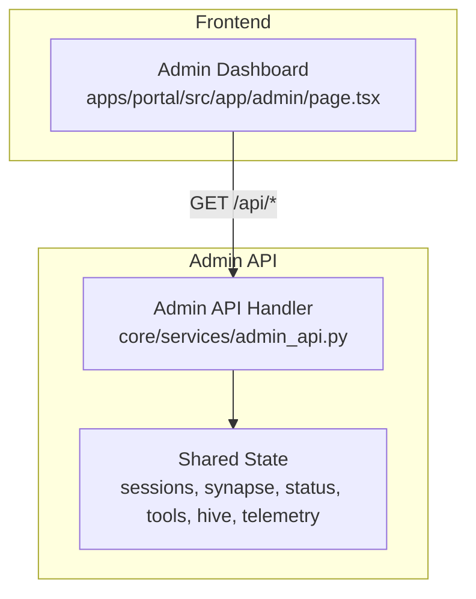
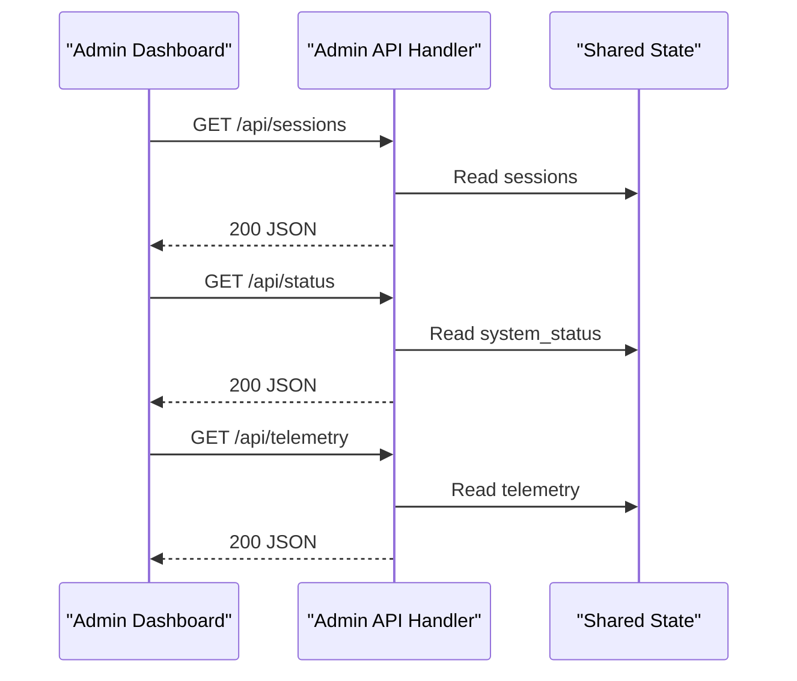
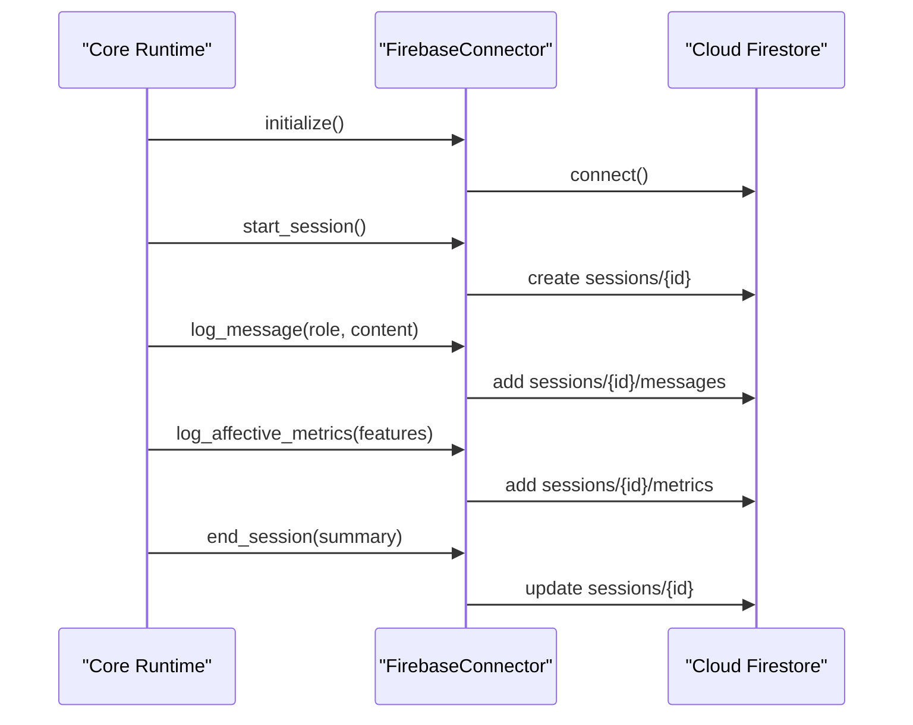
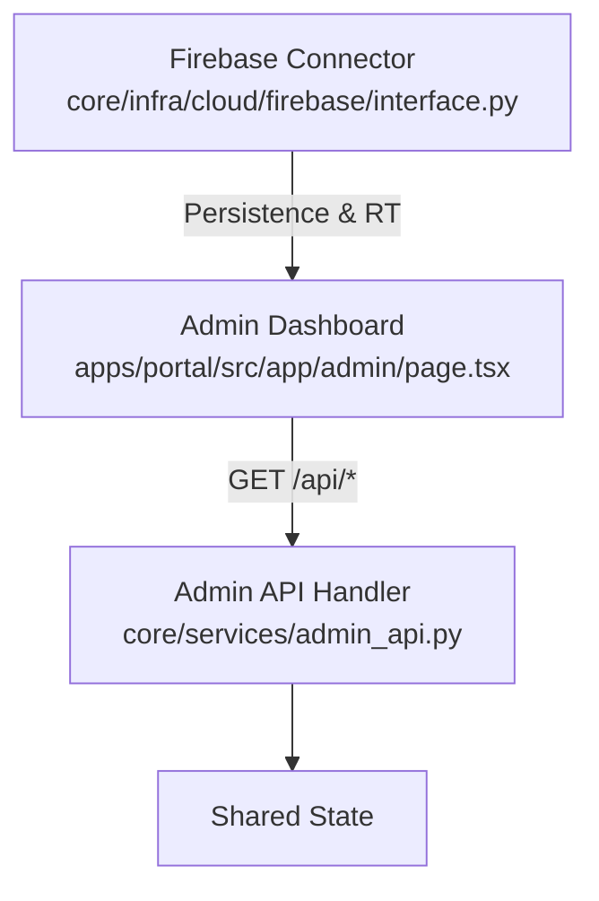

# HTTP Admin API

<cite>
**Referenced Files in This Document**
- [admin_api.py](file://core/services/admin_api.py)
- [page.tsx](file://apps/portal/src/app/admin/page.tsx)
- [interface.py](file://core/infra/cloud/firebase/interface.py)
- [queries.py](file://core/infra/cloud/firebase/queries.py)
- [firestore.rules](file://firestore.rules)
- [security.py](file://core/utils/security.py)
- [router.py](file://core/tools/router.py)
- [state_manager.py](file://core/infra/state_manager.py)
- [session.py](file://core/ai/session.py)
- [hive.py](file://core/ai/hive.py)
- [manager.py](file://core/ai/handover/manager.py)
- [gateway.py](file://core/infra/transport/gateway.py)
- [telemetry.py](file://core/infra/telemetry.py)
- [README.md](file://README.md)
</cite>

## Table of Contents
1. [Introduction](#introduction)
2. [Project Structure](#project-structure)
3. [Core Components](#core-components)
4. [Architecture Overview](#architecture-overview)
5. [Detailed Component Analysis](#detailed-component-analysis)
6. [Dependency Analysis](#dependency-analysis)
7. [Performance Considerations](#performance-considerations)
8. [Troubleshooting Guide](#troubleshooting-guide)
9. [Conclusion](#conclusion)
10. [Appendices](#appendices)

## Introduction
This document specifies the HTTP Admin API for Aether Voice OS administrative functions. It covers REST endpoints for system control, monitoring, and administrative operations, including session management, expert soul switching, and system diagnostics. It also documents authentication and access control mechanisms, operational procedures, endpoint specifications, Firebase integration, and security considerations.

## Project Structure
The Admin API is a lightweight HTTP server embedded in the core runtime and exposes read-only endpoints for the Next.js Admin Dashboard. The dashboard polls the Admin API endpoints to render system status, sessions, and telemetry.

**Diagram sources**
- [admin_api.py](file://core/services/admin_api.py#L26-L82)
- [page.tsx](file://apps/portal/src/app/admin/page.tsx#L12-L37)

**Section sources**
- [admin_api.py](file://core/services/admin_api.py#L1-L117)
- [page.tsx](file://apps/portal/src/app/admin/page.tsx#L1-L201)

## Core Components
- Admin API server: A threaded HTTP server exposing read-only endpoints for monitoring and diagnostics.
- Shared state: A global dictionary updated asynchronously by the main loop and consumed by the Admin API.
- Admin Dashboard: A Next.js client that polls Admin API endpoints and renders system analytics.

Key responsibilities:
- Serve system status, sessions, synapse, tools, hive, and telemetry.
- Provide health checks for infrastructure monitoring.
- Support future extension for administrative controls (currently read-only).

**Section sources**
- [admin_api.py](file://core/services/admin_api.py#L15-L23)
- [page.tsx](file://apps/portal/src/app/admin/page.tsx#L12-L37)

## Architecture Overview
The Admin API is a thin layer over the core runtime state. The Admin Dashboard fetches data periodically and displays it. Firebase integration is separate and used for cloud persistence and real-time updates.

**Diagram sources**
- [admin_api.py](file://core/services/admin_api.py#L37-L73)
- [page.tsx](file://apps/portal/src/app/admin/page.tsx#L15-L28)

## Detailed Component Analysis

### Admin API Endpoints
All endpoints are GET requests served from localhost. Responses are JSON with CORS headers.

- Base URL: http://127.0.0.1:18790
- CORS: Access-Control-Allow-Origin: *
- Content-Type: application/json

Endpoints:
- GET /api/sessions
  - Purpose: Retrieve recent sessions metadata.
  - Response: Array of session objects.
  - Status Codes: 200, 500 (on server error).
- GET /api/synapse
  - Purpose: Retrieve L2 Synapse node status and metrics.
  - Response: Object containing status, counts, and last heartbeat.
  - Status Codes: 200, 500.
- GET /api/status
  - Purpose: Retrieve system status indicator.
  - Response: Object with status field.
  - Status Codes: 200, 500.
- GET /api/tools
  - Purpose: Retrieve registered tools metadata.
  - Response: Array of tool descriptors.
  - Status Codes: 200, 500.
- GET /api/hive
  - Purpose: Retrieve Hive swarm state and configuration.
  - Response: Object with hive metrics and state.
  - Status Codes: 200, 500.
- GET /api/telemetry
  - Purpose: Retrieve telemetry data for analytics.
  - Response: Object with telemetry counters and stats.
  - Status Codes: 200, 500.
- GET /health
  - Purpose: Infrastructure health check.
  - Response: Object with status field.
  - Status Codes: 200, 500.

Notes:
- Path /api/synapse, /api/tools, /api/hive, and /api/telemetry return empty or placeholder data until populated by the main loop.
- The server responds with 404 for unknown paths.

**Section sources**
- [admin_api.py](file://core/services/admin_api.py#L37-L73)

### Authentication and Access Control
- Endpoint protection: None. All endpoints are unauthenticated and intended for localhost-only use.
- Security posture: Admin API binds to 127.0.0.1 and does not enforce authentication or authorization.
- Role-based access control: Not implemented.
- Recommendation: Restrict exposure to localhost only; do not expose publicly.

**Section sources**
- [admin_api.py](file://core/services/admin_api.py#L26-L31)
- [admin_api.py](file://core/services/admin_api.py#L96-L109)

### Administrative Operations
Current capabilities:
- Manual session restarts: Not exposed as a dedicated endpoint. The gateway supports initiating a session restart during deep handover transitions.
- Expert handoff initiation: Not exposed as a dedicated endpoint. The Hive and session layers coordinate handoffs internally.
- System health monitoring: Exposed via /health and /api/status.
- Telemetry data retrieval: Exposed via /api/telemetry.

Operational insights:
- Deep handover triggers a session restart signal in the gateway and updates session metadata.
- The Admin Dashboard polls system status and sessions to reflect runtime state.

**Section sources**
- [gateway.py](file://core/infra/transport/gateway.py#L260-L275)
- [session.py](file://core/ai/session.py#L813-L857)
- [hive.py](file://core/ai/hive.py#L181-L213)
- [manager.py](file://core/ai/handover/manager.py#L548-L552)

### Firebase Integration Endpoints and Patterns
While the Admin API is read-only, the system integrates with Firebase for cloud storage, real-time updates, and backups. The Admin Dashboard consumes Firestore data via onSnapshot listeners.

- Initialization and session lifecycle:
  - Initialize Firebase client using secure credentials or default credentials.
  - Start a session document and close it on completion.
  - Log messages to a subcollection for real-time UI updates.
  - Aggregate affective metrics for analytics.
- Real-time updates:
  - The frontend listens to sessions/{id}/messages using onSnapshot to reflect live chat logs.
- Backup and audit:
  - Store knowledge updates and repair events for audit trails.

**Diagram sources**
- [interface.py](file://core/infra/cloud/firebase/interface.py#L31-L60)
- [interface.py](file://core/infra/cloud/firebase/interface.py#L62-L84)
- [interface.py](file://core/infra/cloud/firebase/interface.py#L85-L112)
- [interface.py](file://core/infra/cloud/firebase/interface.py#L114-L140)
- [interface.py](file://core/infra/cloud/firebase/interface.py#L187-L202)

**Section sources**
- [interface.py](file://core/infra/cloud/firebase/interface.py#L15-L259)
- [queries.py](file://core/infra/cloud/firebase/queries.py#L20-L45)
- [firestore.rules](file://firestore.rules#L1-L9)

### Security and Cryptographic Utilities
- Signature verification: Ed25519 verification utilities are available for secure handshake protocols and identity management.
- Key generation: Ed25519 keypair generation for agent identities.

These utilities support the gateway protocol and can be leveraged for secure administrative operations if needed.

**Section sources**
- [security.py](file://core/utils/security.py#L18-L71)

### System State and Transitions
- System states: Booting, Idle, Listening, Thinking, Speaking, Paused, Error, Night Terrors.
- State transitions: Controlled via an event-driven state manager with allowed transitions and broadcast events.
- Implication for admin operations: Administrative actions should respect state transitions to avoid invalid state changes.

**Section sources**
- [state_manager.py](file://core/infra/state_manager.py#L14-L100)

### Telemetry and Cost Tracking
- Telemetry sink: OpenTelemetry-based exporter to Arize/Phoenix with batch processing.
- Usage recording: Token usage and estimated cost recording per session.
- Integration: Admin API telemetry endpoint surfaces telemetry data for visualization.

**Section sources**
- [telemetry.py](file://core/infra/telemetry.py#L14-L130)

## Dependency Analysis
The Admin API depends on the shared state populated by the core runtime. The Admin Dashboard depends on the Admin API. Firebase integration is independent but used by the broader system for persistence and real-time updates.

**Diagram sources**
- [admin_api.py](file://core/services/admin_api.py#L26-L82)
- [page.tsx](file://apps/portal/src/app/admin/page.tsx#L12-L37)
- [interface.py](file://core/infra/cloud/firebase/interface.py#L15-L259)

**Section sources**
- [admin_api.py](file://core/services/admin_api.py#L1-L117)
- [page.tsx](file://apps/portal/src/app/admin/page.tsx#L1-L201)

## Performance Considerations
- Admin API polling: The dashboard polls endpoints every 2 seconds. Keep payloads small and avoid frequent heavy computations on the server.
- Shared state updates: Ensure asynchronous updates to shared state are atomic and thread-safe.
- Firebase reads: Firestore queries are cached in memory to reduce read pressure; avoid excessive queries from clients.

[No sources needed since this section provides general guidance]

## Troubleshooting Guide
Common issues and resolutions:
- Port already in use: The Admin API falls back to a dynamic port if the default is occupied. Check the startup log for the actual bound port.
- CORS errors: The server sets CORS headers for all responses. If CORS fails, verify the client origin and headers.
- Empty responses: Endpoints return empty placeholders until the main loop populates shared state. Wait for state updates or confirm runtime initialization.
- Firebase offline mode: If credentials are missing, Firebase initializes in offline mode. Ensure credentials are configured for cloud features.

**Section sources**
- [admin_api.py](file://core/services/admin_api.py#L96-L109)
- [admin_api.py](file://core/services/admin_api.py#L26-L31)
- [interface.py](file://core/infra/cloud/firebase/interface.py#L31-L60)

## Conclusion
The HTTP Admin API provides a simple, localhost-only interface for monitoring and diagnostics in Aether Voice OS. It complements the Admin Dashboard with real-time system insights and integrates with Firebase for cloud persistence and real-time updates. Administrative controls are not exposed as endpoints in this release; operational handoffs and restarts occur internally. Future enhancements may include protected endpoints and administrative controls with proper authentication and RBAC.

[No sources needed since this section summarizes without analyzing specific files]

## Appendices

### Endpoint Specifications
- Base URL: http://127.0.0.1:18790
- CORS: Access-Control-Allow-Origin: *
- Content-Type: application/json

Endpoints:
- GET /api/sessions
  - Response: Array of session objects.
  - Status Codes: 200, 500.
- GET /api/synapse
  - Response: Object with status, counts, and last heartbeat.
  - Status Codes: 200, 500.
- GET /api/status
  - Response: Object with status field.
  - Status Codes: 200, 500.
- GET /api/tools
  - Response: Array of tool descriptors.
  - Status Codes: 200, 500.
- GET /api/hive
  - Response: Object with hive metrics and state.
  - Status Codes: 200, 500.
- GET /api/telemetry
  - Response: Object with telemetry counters and stats.
  - Status Codes: 200, 500.
- GET /health
  - Response: Object with status field.
  - Status Codes: 200, 500.

**Section sources**
- [admin_api.py](file://core/services/admin_api.py#L37-L73)

### Administrative Client Examples
- Next.js Admin Dashboard:
  - Fetches /api/sessions, /api/synapse, and /api/status on an interval.
  - Polling frequency: Every 2 seconds.

**Section sources**
- [page.tsx](file://apps/portal/src/app/admin/page.tsx#L12-L37)

### curl Commands for Testing
- curl -s http://127.0.0.1:18790/api/sessions
- curl -s http://127.0.0.1:18790/api/synapse
- curl -s http://127.0.0.1:18790/api/status
- curl -s http://127.0.0.1:18790/api/tools
- curl -s http://127.0.0.1:18790/api/hive
- curl -s http://127.0.0.1:18790/api/telemetry
- curl -s http://127.0.0.1:18790/health

**Section sources**
- [admin_api.py](file://core/services/admin_api.py#L37-L73)

### Rate Limiting and Error Handling
- Rate limiting: Not implemented. Clients should poll judiciously.
- Error handling: The server returns 500 on internal errors and 404 for unknown paths. CORS headers are set for all responses.

**Section sources**
- [admin_api.py](file://core/services/admin_api.py#L70-L73)
- [admin_api.py](file://core/services/admin_api.py#L26-L31)

### Security Considerations
- Localhost-only exposure: Admin API binds to 127.0.0.1; do not expose publicly.
- No authentication: Endpoints are unauthenticated. Protect network boundaries.
- Firebase rules: Firestore requires an authenticated request; ensure credentials are configured for cloud features.

**Section sources**
- [admin_api.py](file://core/services/admin_api.py#L96-L109)
- [firestore.rules](file://firestore.rules#L5-L7)