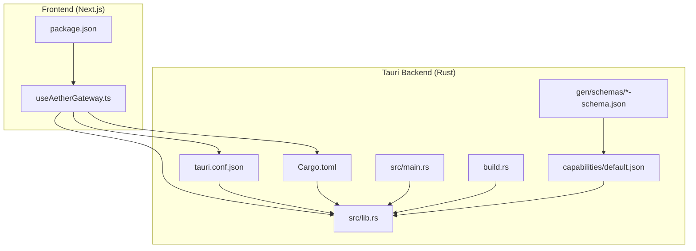
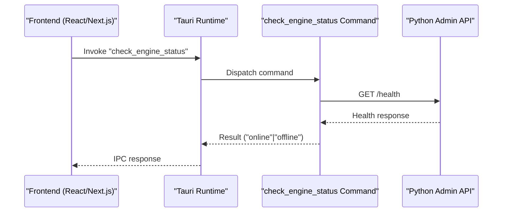
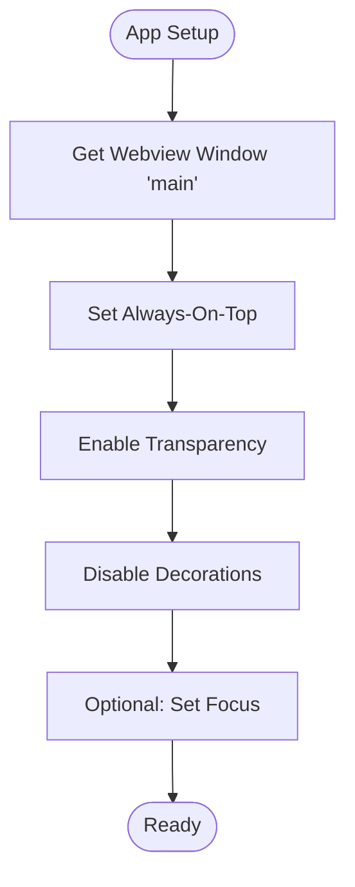
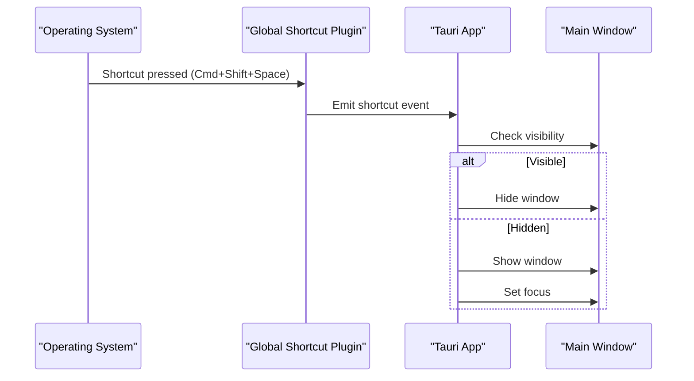
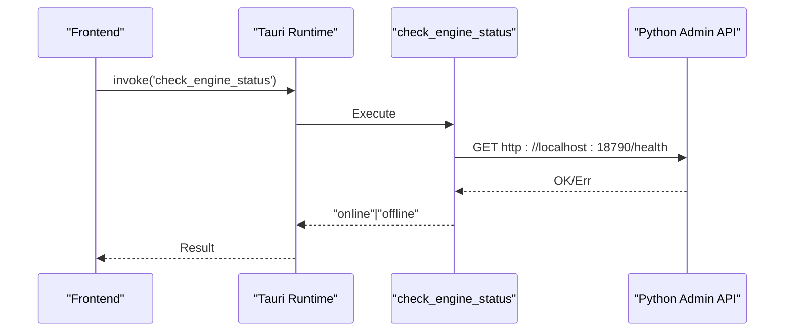
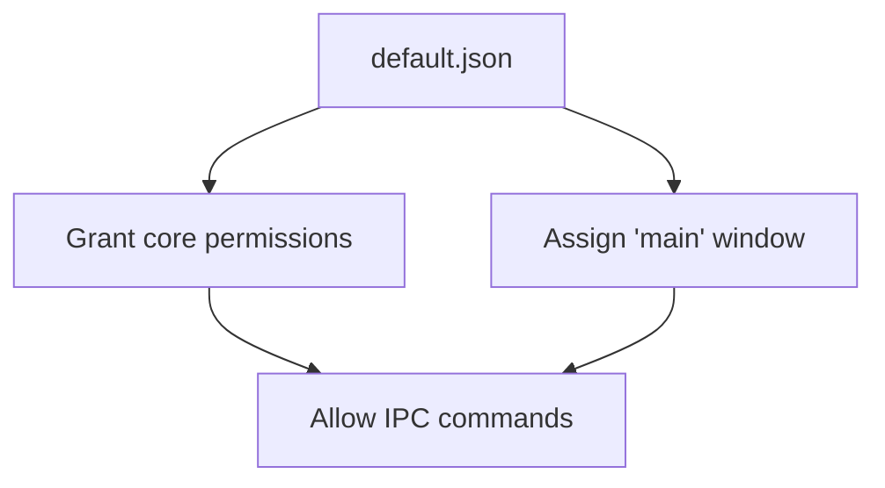
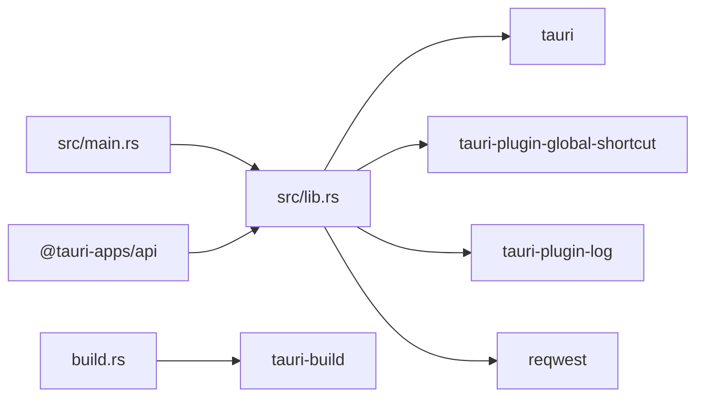

# Tauri Desktop API

<cite>
**Referenced Files in This Document**
- [tauri.conf.json](file://apps/portal/src-tauri/tauri.conf.json)
- [Cargo.toml](file://apps/portal/src-tauri/Cargo.toml)
- [lib.rs](file://apps/portal/src-tauri/src/lib.rs)
- [main.rs](file://apps/portal/src-tauri/src/main.rs)
- [default.json](file://apps/portal/src-tauri/capabilities/default.json)
- [capabilities.json](file://apps/portal/src-tauri/gen/schemas/capabilities.json)
- [desktop-schema.json](file://apps/portal/src-tauri/gen/schemas/desktop-schema.json)
- [macOS-schema.json](file://apps/portal/src-tauri/gen/schemas/macOS-schema.json)
- [build.rs](file://apps/portal/src-tauri/build.rs)
- [package.json](file://apps/portal/package.json)
- [useAetherGateway.ts](file://apps/portal/src/hooks/useAetherGateway.ts)
</cite>

## Table of Contents
1. [Introduction](#introduction)
2. [Project Structure](#project-structure)
3. [Core Components](#core-components)
4. [Architecture Overview](#architecture-overview)
5. [Detailed Component Analysis](#detailed-component-analysis)
6. [Dependency Analysis](#dependency-analysis)
7. [Performance Considerations](#performance-considerations)
8. [Troubleshooting Guide](#troubleshooting-guide)
9. [Conclusion](#conclusion)
10. [Appendices](#appendices)

## Introduction
This document provides comprehensive API documentation for the Tauri desktop integration within Aether Voice OS. It focuses on system-level operations exposed via Tauri plugins and commands, including window management, global shortcuts, and desktop shell integration. It also covers IPC communication patterns between the frontend and native components, capability configuration, security policies, and permission management. Cross-platform compatibility, native API bindings, and desktop-specific optimizations are addressed alongside Tauri configuration options, build processes, and deployment considerations.

## Project Structure
The Tauri desktop application resides under apps/portal/src-tauri and integrates with the Next.js frontend under apps/portal. The Tauri configuration defines window behavior, security policies, and bundling options. The Rust crate exposes Tauri commands and plugins, while the frontend uses @tauri-apps/api to communicate with the backend.

**Diagram sources**
- [tauri.conf.json](file://apps/portal/src-tauri/tauri.conf.json#L1-L41)
- [Cargo.toml](file://apps/portal/src-tauri/Cargo.toml#L1-L28)
- [lib.rs](file://apps/portal/src-tauri/src/lib.rs#L1-L69)
- [main.rs](file://apps/portal/src-tauri/src/main.rs#L1-L7)
- [build.rs](file://apps/portal/src-tauri/build.rs#L1-L4)
- [default.json](file://apps/portal/src-tauri/capabilities/default.json#L1-L12)
- [desktop-schema.json](file://apps/portal/src-tauri/gen/schemas/desktop-schema.json#L32-L47)

**Section sources**
- [tauri.conf.json](file://apps/portal/src-tauri/tauri.conf.json#L1-L41)
- [Cargo.toml](file://apps/portal/src-tauri/Cargo.toml#L1-L28)
- [lib.rs](file://apps/portal/src-tauri/src/lib.rs#L1-L69)
- [main.rs](file://apps/portal/src-tauri/src/main.rs#L1-L7)
- [build.rs](file://apps/portal/src-tauri/build.rs#L1-L4)
- [default.json](file://apps/portal/src-tauri/capabilities/default.json#L1-L12)
- [desktop-schema.json](file://apps/portal/src-tauri/gen/schemas/desktop-schema.json#L32-L47)

## Core Components
- Tauri Application Entry Point
  - The Rust binary initializes the Tauri runtime and registers plugins and commands.
  - The entry point is defined in main.rs and delegates to the library’s run function.
- Tauri Commands
  - Exposes a single command to check the local Python Admin API health.
- Plugins
  - Global Shortcut Plugin: Registers and handles global keyboard shortcuts.
  - Log Plugin: Optional logging during development.
- Window Management
  - Configures the main window to be always-on-top and transparent with decorations disabled.
- Capabilities and Permissions
  - Defines default capability enabling core permissions and associating the main window.

**Section sources**
- [lib.rs](file://apps/portal/src-tauri/src/lib.rs#L4-L12)
- [lib.rs](file://apps/portal/src-tauri/src/lib.rs#L15-L68)
- [tauri.conf.json](file://apps/portal/src-tauri/tauri.conf.json#L12-L29)
- [default.json](file://apps/portal/src-tauri/capabilities/default.json#L1-L12)

## Architecture Overview
The frontend communicates with the Tauri backend via IPC. The frontend uses @tauri-apps/api to invoke commands and receive responses. The backend exposes commands and plugins, manages the main window, and handles global shortcuts.

**Diagram sources**
- [lib.rs](file://apps/portal/src-tauri/src/lib.rs#L4-L12)
- [package.json](file://apps/portal/package.json#L37-L38)

## Detailed Component Analysis

### Window Management API
- Purpose: Control window behavior for an overlay HUD experience.
- Behavior:
  - Sets the main window to always-on-top.
  - Enables transparency and removes window decorations.
  - Optionally adjusts visibility and focus.
- Implementation Notes:
  - The main window is identified by the "main" label.
  - Platform-specific adjustments can be applied conditionally.

**Diagram sources**
- [lib.rs](file://apps/portal/src-tauri/src/lib.rs#L28-L40)
- [tauri.conf.json](file://apps/portal/src-tauri/tauri.conf.json#L14-L25)

**Section sources**
- [lib.rs](file://apps/portal/src-tauri/src/lib.rs#L28-L40)
- [tauri.conf.json](file://apps/portal/src-tauri/tauri.conf.json#L14-L25)

### Global Shortcuts API
- Purpose: Register and handle global keyboard shortcuts for toggling overlay visibility.
- Behavior:
  - Registers a shortcut (Cmd+Shift+Space on macOS).
  - Toggles visibility of the main window and sets focus when shown.
- Implementation Notes:
  - Uses the global shortcut plugin with a handler.
  - Shortcut registration and state detection are handled by the plugin.

**Diagram sources**
- [lib.rs](file://apps/portal/src-tauri/src/lib.rs#L42-L62)
- [Cargo.toml](file://apps/portal/src-tauri/Cargo.toml#L27-L27)

**Section sources**
- [lib.rs](file://apps/portal/src-tauri/src/lib.rs#L42-L62)
- [Cargo.toml](file://apps/portal/src-tauri/Cargo.toml#L27-L27)

### IPC Command: check_engine_status
- Command Name: check_engine_status
- Purpose: Probe the local Python Admin API health endpoint.
- Request/Response:
  - Request: No parameters.
  - Response: String indicating online/offline status.
- Security:
  - Access controlled by capability configuration.
- Frontend Integration:
  - Use @tauri-apps/api to invoke the command from React components.

**Diagram sources**
- [lib.rs](file://apps/portal/src-tauri/src/lib.rs#L4-L12)
- [package.json](file://apps/portal/package.json#L37-L38)

**Section sources**
- [lib.rs](file://apps/portal/src-tauri/src/lib.rs#L4-L12)
- [package.json](file://apps/portal/package.json#L37-L38)

### Capability Configuration and Permissions
- Default Capability:
  - Identifies the "main" window and grants core permissions.
- Schema Definitions:
  - Capability schema describes how windows and permissions are grouped and enforced.
  - Includes permission identifiers for global shortcuts and core commands.
- Frontend Access:
  - The frontend uses @tauri-apps/api to invoke commands; capability assignment determines whether IPC calls succeed.

**Diagram sources**
- [default.json](file://apps/portal/src-tauri/capabilities/default.json#L1-L12)
- [capabilities.json](file://apps/portal/src-tauri/gen/schemas/capabilities.json#L1-L1)
- [desktop-schema.json](file://apps/portal/src-tauri/gen/schemas/desktop-schema.json#L32-L47)

**Section sources**
- [default.json](file://apps/portal/src-tauri/capabilities/default.json#L1-L12)
- [capabilities.json](file://apps/portal/src-tauri/gen/schemas/capabilities.json#L1-L1)
- [desktop-schema.json](file://apps/portal/src-tauri/gen/schemas/desktop-schema.json#L32-L47)
- [macOS-schema.json](file://apps/portal/src-tauri/gen/schemas/macOS-schema.json#L2145-L2168)

### Frontend Integration Patterns
- Using @tauri-apps/api:
  - Import invoke from @tauri-apps/api to call backend commands.
  - Use command names registered in Rust (e.g., check_engine_status).
- Example Pattern:
  - Wrap command invocation in React hooks or component lifecycles.
  - Handle success and error responses appropriately.
- Related Frontend Hooks:
  - useAetherGateway demonstrates advanced IPC-like patterns (WebSocket) but is separate from Tauri IPC.

**Section sources**
- [package.json](file://apps/portal/package.json#L20-L38)
- [useAetherGateway.ts](file://apps/portal/src/hooks/useAetherGateway.ts#L1-L299)

## Dependency Analysis
- Internal Dependencies:
  - main.rs depends on lib.rs for application initialization.
  - lib.rs depends on tauri, tauri-plugin-global-shortcut, and tauri-plugin-log.
- External Dependencies:
  - reqwest for HTTP requests to the Python Admin API.
  - @tauri-apps/api and @tauri-apps/cli for frontend/backend integration.
- Build Dependencies:
  - tauri-build is invoked via build.rs.

**Diagram sources**
- [main.rs](file://apps/portal/src-tauri/src/main.rs#L4-L6)
- [lib.rs](file://apps/portal/src-tauri/src/lib.rs#L1-L2)
- [Cargo.toml](file://apps/portal/src-tauri/Cargo.toml#L20-L27)
- [build.rs](file://apps/portal/src-tauri/build.rs#L1-L3)
- [package.json](file://apps/portal/package.json#L37-L38)

**Section sources**
- [main.rs](file://apps/portal/src-tauri/src/main.rs#L4-L6)
- [lib.rs](file://apps/portal/src-tauri/src/lib.rs#L1-L2)
- [Cargo.toml](file://apps/portal/src-tauri/Cargo.toml#L20-L27)
- [build.rs](file://apps/portal/src-tauri/build.rs#L1-L3)
- [package.json](file://apps/portal/package.json#L37-L38)

## Performance Considerations
- Window Management:
  - Always-on-top and transparency can increase GPU usage; use judiciously for overlay HUDs.
- IPC Calls:
  - Keep command payloads minimal; batch updates where possible.
- Logging:
  - Enable logging only in development to avoid overhead in production.
- Network Requests:
  - The health check uses a lightweight HTTP GET; ensure the backend is reachable locally.

[No sources needed since this section provides general guidance]

## Troubleshooting Guide
- Command Not Found:
  - Ensure the command is registered in the invoke handler and the capability grants access.
- Global Shortcut Not Working:
  - Verify the shortcut registration and platform-specific modifier keys.
  - Confirm the handler logic for visibility toggle and focus.
- Window Not Staying On Top:
  - Check platform-specific window attributes and permissions.
- Health Check Fails:
  - Confirm the Python Admin API is running and listening on the expected port.
- CSP Configuration:
  - The configuration disables CSP; ensure this aligns with your security posture.

**Section sources**
- [lib.rs](file://apps/portal/src-tauri/src/lib.rs#L15-L68)
- [tauri.conf.json](file://apps/portal/src-tauri/tauri.conf.json#L26-L28)

## Conclusion
Aether Voice OS leverages Tauri to deliver a desktop overlay experience with global shortcuts, window management, and IPC-backed system checks. The configuration and capability model provide a clear boundary for permissions, while the frontend integrates seamlessly with @tauri-apps/api. By following the documented patterns and considering the cross-platform nuances, developers can extend and maintain the desktop integration effectively.

[No sources needed since this section summarizes without analyzing specific files]

## Appendices

### Tauri Configuration Options
- Product and Build:
  - productName, version, identifier, frontendDist, devUrl, beforeDevCommand, beforeBuildCommand.
- App Windows:
  - Title, size, resizable, fullscreen, transparent, decorations, alwaysOnTop.
- Security:
  - CSP policy configuration.
- Bundling:
  - Targets and icon resources.

**Section sources**
- [tauri.conf.json](file://apps/portal/src-tauri/tauri.conf.json#L1-L41)

### Cargo Dependencies
- Core:
  - tauri, serde, serde_json, log, reqwest.
- Plugins:
  - tauri-plugin-global-shortcut, tauri-plugin-log.
- Build:
  - tauri-build.

**Section sources**
- [Cargo.toml](file://apps/portal/src-tauri/Cargo.toml#L1-L28)

### Build and Run
- Build Script:
  - Invokes tauri_build::build during compilation.
- Frontend Scripts:
  - Dev, build, and start scripts for the Next.js app; tauri script for Tauri CLI.

**Section sources**
- [build.rs](file://apps/portal/src-tauri/build.rs#L1-L3)
- [package.json](file://apps/portal/package.json#L5-L14)