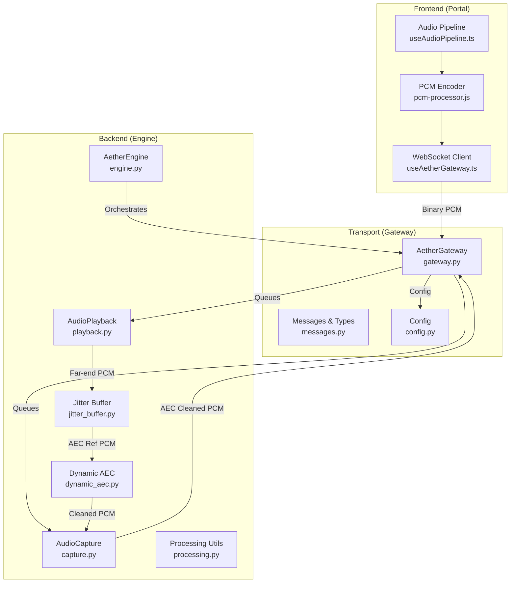
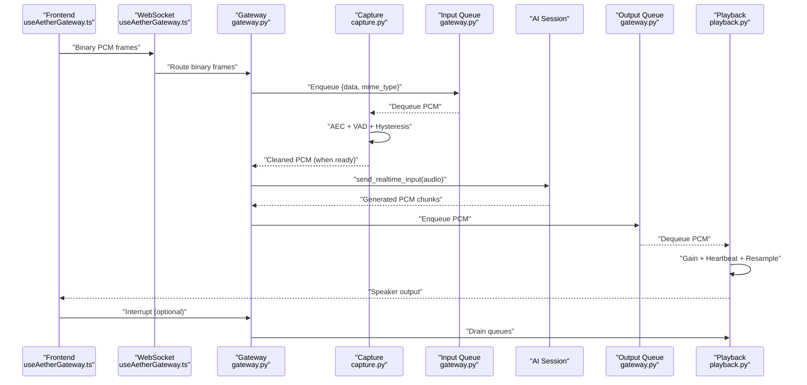
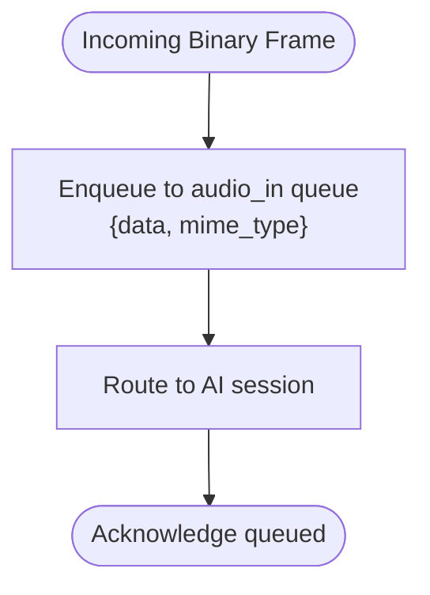
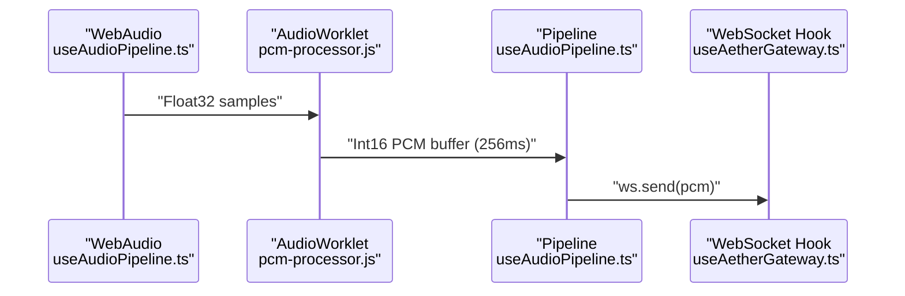
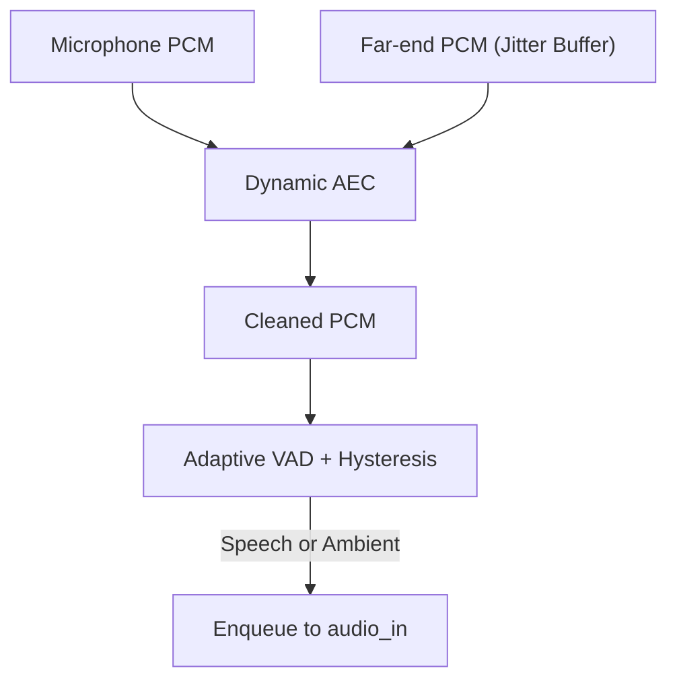
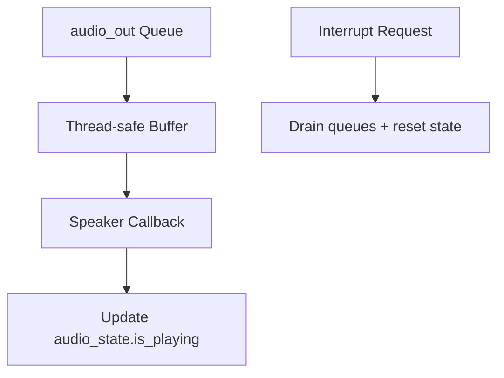
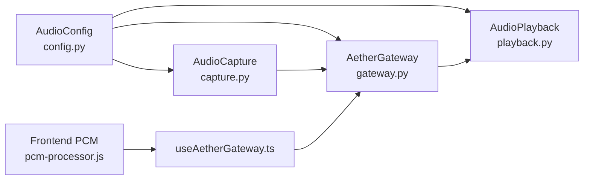

# Audio Streaming Protocol

<cite>
**Referenced Files in This Document**
- [gateway.py](file://core/infra/transport/gateway.py)
- [messages.py](file://core/infra/transport/messages.py)
- [config.py](file://core/infra/config.py)
- [engine.py](file://core/engine.py)
- [useAetherGateway.ts](file://apps/portal/src/hooks/useAetherGateway.ts)
- [useAudioPipeline.ts](file://apps/portal/src/hooks/useAudioPipeline.ts)
- [pcm-processor.js](file://apps/portal/public/pcm-processor.js)
- [capture.py](file://core/audio/capture.py)
- [playback.py](file://core/audio/playback.py)
- [processing.py](file://core/audio/processing.py)
- [jitter_buffer.py](file://core/audio/jitter_buffer.py)
- [dynamic_aec.py](file://core/audio/dynamic_aec.py)
- [geminiLive.integration.test.ts](file://apps/portal/src/__tests__/geminiLive.integration.test.ts)
- [benchmark_barge_in.py](file://tests/benchmark_barge_in.py)
</cite>

## Table of Contents
1. [Introduction](#introduction)
2. [Project Structure](#project-structure)
3. [Core Components](#core-components)
4. [Architecture Overview](#architecture-overview)
5. [Detailed Component Analysis](#detailed-component-analysis)
6. [Dependency Analysis](#dependency-analysis)
7. [Performance Considerations](#performance-considerations)
8. [Troubleshooting Guide](#troubleshooting-guide)
9. [Conclusion](#conclusion)

## Introduction
This document specifies the real-time audio streaming protocol used by the WebSocket gateway for PCM audio transmission. It covers the MIME type specification, binary message format, chunking strategy, timing metadata, audio queue management, buffering and jitter control, latency optimization, interruption handling for barge-in, synchronization and drift compensation, and error recovery mechanisms. The goal is to provide a complete, practical guide for implementing reliable, low-latency audio streaming between client applications and the Aether Voice OS backend.

## Project Structure
The audio streaming pipeline spans three layers:
- Frontend (Portal): WebRTC-like PCM capture and encoding, WebSocket transport, and UI integration.
- Transport (Gateway): WebSocket server, handshake, routing, and queue management.
- Backend (Engine): Audio capture, AEC, playback, and AI session orchestration.

**Diagram sources**
- [gateway.py](file://core/infra/transport/gateway.py#L69-L138)
- [messages.py](file://core/infra/transport/messages.py#L16-L36)
- [config.py](file://core/infra/config.py#L11-L44)
- [engine.py](file://core/engine.py#L26-L71)
- [capture.py](file://core/audio/capture.py#L193-L268)
- [playback.py](file://core/audio/playback.py#L27-L60)
- [jitter_buffer.py](file://core/audio/jitter_buffer.py#L13-L33)
- [processing.py](file://core/audio/processing.py#L107-L202)
- [pcm-processor.js](file://apps/portal/public/pcm-processor.js#L18-L51)
- [useAetherGateway.ts](file://apps/portal/src/hooks/useAetherGateway.ts#L268-L272)
- [useAudioPipeline.ts](file://apps/portal/src/hooks/useAudioPipeline.ts#L75-L101)

**Section sources**
- [gateway.py](file://core/infra/transport/gateway.py#L69-L138)
- [messages.py](file://core/infra/transport/messages.py#L16-L36)
- [config.py](file://core/infra/config.py#L11-L44)
- [engine.py](file://core/engine.py#L26-L71)

## Core Components
- WebSocket Gateway: Authenticates clients, routes binary PCM audio into the input queue, and broadcasts audio to clients. It also exposes audio queues for capture and playback.
- Audio Capture: Performs AEC using a jitter-buffered far-end reference, applies VAD and hysteresis gating, and enqueues PCM chunks for the AI session.
- Audio Playback: Drains PCM chunks from the output queue, mixes a heartbeat, and feeds the speaker via a callback. Supports instant interruption by draining queues.
- Frontend PCM Encoder: Converts Float32 Web Audio samples to Int16 PCM and posts ~256 ms chunks to the main thread for WebSocket transmission.
- Configuration: Defines sample rates, queue sizes, jitter buffer targets, and AEC/VAD parameters.

Key responsibilities:
- MIME type: audio/pcm;rate=16000 for both capture and gateway routing.
- Binary message format: Raw PCM bytes transported as binary frames.
- Timing metadata: MIME type embeds sample rate; timestamps are not included in the audio stream.
- Queue management: Separate input and output queues with bounded sizes to control latency.
- Interruption: Barge-in drains output queues and clears playback state.

**Section sources**
- [gateway.py](file://core/infra/transport/gateway.py#L179-L204)
- [gateway.py](file://core/infra/transport/gateway.py#L672-L685)
- [capture.py](file://core/audio/capture.py#L490-L498)
- [playback.py](file://core/audio/playback.py#L165-L192)
- [pcm-processor.js](file://apps/portal/public/pcm-processor.js#L18-L51)
- [config.py](file://core/infra/config.py#L11-L44)

## Architecture Overview
The audio streaming architecture ensures minimal latency and robust interruption handling:

**Diagram sources**
- [useAetherGateway.ts](file://apps/portal/src/hooks/useAetherGateway.ts#L268-L272)
- [gateway.py](file://core/infra/transport/gateway.py#L672-L685)
- [gateway.py](file://core/infra/transport/gateway.py#L179-L204)
- [capture.py](file://core/audio/capture.py#L490-L498)
- [playback.py](file://core/audio/playback.py#L165-L192)

## Detailed Component Analysis

### WebSocket Gateway and Message Routing
- Authentication: Challenge-response handshake supports Ed25519 signatures or JWT tokens. Clients must respond within the configured timeout.
- Message Types: The gateway defines standardized message types for lifecycle and data exchange.
- Binary Routing: Incoming binary frames are enqueued with a MIME type indicating PCM at the configured receive sample rate.
- Audio Queues: Separate input and output queues are exposed for capture and playback.

**Diagram sources**
- [gateway.py](file://core/infra/transport/gateway.py#L672-L685)
- [messages.py](file://core/infra/transport/messages.py#L16-L36)

**Section sources**
- [gateway.py](file://core/infra/transport/gateway.py#L559-L617)
- [gateway.py](file://core/infra/transport/gateway.py#L672-L685)
- [messages.py](file://core/infra/transport/messages.py#L16-L36)

### Frontend PCM Encoding and Transmission
- Encoder: The AudioWorklet converts Float32 samples to Int16 PCM and posts ~256 ms chunks (4096 samples at 16 kHz) to the main thread.
- Transport: The hook sends raw PCM bytes directly over the WebSocket when the connection is open.
- Example: Integration tests demonstrate sending a small PCM chunk with the correct MIME type.

**Diagram sources**
- [useAudioPipeline.ts](file://apps/portal/src/hooks/useAudioPipeline.ts#L75-L101)
- [pcm-processor.js](file://apps/portal/public/pcm-processor.js#L18-L51)
- [useAetherGateway.ts](file://apps/portal/src/hooks/useAetherGateway.ts#L268-L272)

**Section sources**
- [pcm-processor.js](file://apps/portal/public/pcm-processor.js#L18-L51)
- [useAudioPipeline.ts](file://apps/portal/src/hooks/useAudioPipeline.ts#L75-L101)
- [useAetherGateway.ts](file://apps/portal/src/hooks/useAetherGateway.ts#L268-L272)
- [geminiLive.integration.test.ts](file://apps/portal/src/__tests__/geminiLive.integration.test.ts#L135-L168)

### Audio Capture, AEC, and VAD
- AEC: Uses a jitter-buffered far-end reference to estimate and cancel echo, with dynamic parameters adjustable at runtime.
- Jitter Buffer: Circular buffer to smooth bursty arrivals and maintain a stable reference for AEC.
- VAD and Hysteresis: Dual-threshold detection with hysteresis to gate microphone input based on AI playback state and user speech likelihood.
- Queue Injection: Only hard-speech or ambient feed chunks are enqueued for the AI session.

**Diagram sources**
- [capture.py](file://core/audio/capture.py#L344-L498)
- [jitter_buffer.py](file://core/audio/jitter_buffer.py#L13-L33)
- [dynamic_aec.py](file://core/audio/dynamic_aec.py#L590-L668)

**Section sources**
- [capture.py](file://core/audio/capture.py#L193-L268)
- [capture.py](file://core/audio/capture.py#L344-L498)
- [jitter_buffer.py](file://core/audio/jitter_buffer.py#L13-L33)
- [dynamic_aec.py](file://core/audio/dynamic_aec.py#L590-L668)
- [processing.py](file://core/audio/processing.py#L256-L323)

### Audio Playback, Interruption, and Draining
- Playback: Consumes PCM from the output queue, applies gain and a subliminal heartbeat, resamples to 16 kHz, and writes to the speaker via a callback.
- Interruption: Instantly drains both the asyncio output queue and the thread-safe buffer to prevent zombie audio.
- Zero-Crossing Cut: Provides a clean cut point for barge-in to avoid audible clicks.

**Diagram sources**
- [playback.py](file://core/audio/playback.py#L165-L192)
- [playback.py](file://core/audio/playback.py#L61-L99)

**Section sources**
- [playback.py](file://core/audio/playback.py#L27-L60)
- [playback.py](file://core/audio/playback.py#L165-L192)
- [processing.py](file://core/audio/processing.py#L204-L244)

### Configuration and Quality Presets
- Sample Rates: Capture at 16 kHz; playback at 24 kHz; gateway routing uses the configured receive sample rate.
- Queue Sizes: Small input queue size to bound latency; output queue size tuned for barge-in responsiveness.
- Jitter Buffer: Target and maximum latency configurable; nominal depth controls buffering vs. smoothness.
- AEC/VAD Parameters: Tunable step size, filter length, convergence threshold, and VAD thresholds for robust operation across environments.

**Section sources**
- [config.py](file://core/infra/config.py#L11-L44)
- [capture.py](file://core/audio/capture.py#L273-L297)

## Dependency Analysis
The audio streaming protocol depends on consistent MIME type usage, queue sizes, and configuration parameters across components.

**Diagram sources**
- [config.py](file://core/infra/config.py#L11-L44)
- [capture.py](file://core/audio/capture.py#L202-L268)
- [playback.py](file://core/audio/playback.py#L35-L60)
- [gateway.py](file://core/infra/transport/gateway.py#L111-L116)
- [pcm-processor.js](file://apps/portal/public/pcm-processor.js#L18-L51)
- [useAetherGateway.ts](file://apps/portal/src/hooks/useAetherGateway.ts#L268-L272)

**Section sources**
- [config.py](file://core/infra/config.py#L11-L44)
- [gateway.py](file://core/infra/transport/gateway.py#L111-L116)

## Performance Considerations
- Chunk Size and Overhead: The encoder posts ~256 ms chunks to reduce WebSocket overhead. This balances CPU usage and latency.
- Queue Sizing: Input queue size limits bursty capture; output queue size affects barge-in responsiveness. Tune based on expected load.
- Jitter Buffer: Nominal depth determines when to stop buffering; capacity and packet size influence smoothness under variable network conditions.
- AEC Convergence: Filter length and step size impact convergence speed and stability; adjust for noisy environments.
- VAD Thresholds: Soft/hard thresholds adapt to ambient noise; tune for accurate barge-in detection without false triggers.
- Latency Budget: Target jitter buffer latency and AEC filter length should align with the overall sub-200 ms requirement.

[No sources needed since this section provides general guidance]

## Troubleshooting Guide
Common issues and remedies:
- Handshake Failures: Ensure the client responds to the challenge within the timeout and provides a valid signature or JWT.
- Audio Drops: Monitor capture queue drops and consider reducing input load or increasing queue size.
- Stuttering or Clicks: Verify that the playback buffer is adequately sized and that interrupts are executed promptly.
- Barge-in Latency: Use the provided benchmark to measure queue-drain latency and adjust queue sizes accordingly.
- Synchronization Drift: Confirm that the jitter buffer target matches the AEC reference path and that resampling is applied consistently.

**Section sources**
- [gateway.py](file://core/infra/transport/gateway.py#L559-L617)
- [benchmark_barge_in.py](file://tests/benchmark_barge_in.py#L13-L44)

## Conclusion
The audio streaming protocol leverages a robust, layered design: a high-performance frontend encoder, a resilient gateway with strict queueing and routing, and backend capture/playback with AEC and VAD. By adhering to the MIME type specification, managing queues and buffers carefully, and implementing precise interruption handling, the system achieves low-latency, high-quality real-time audio streaming suitable for conversational AI scenarios.