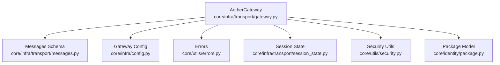
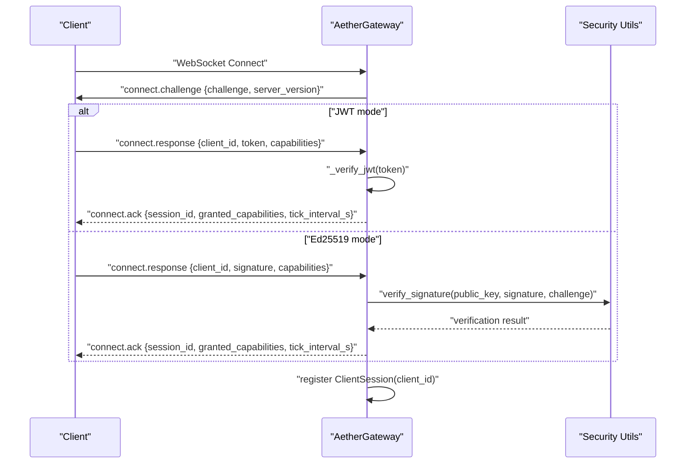
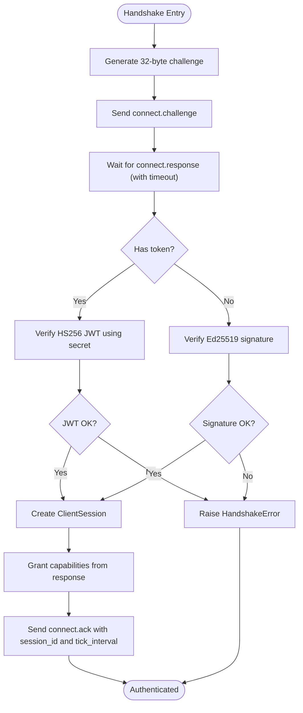
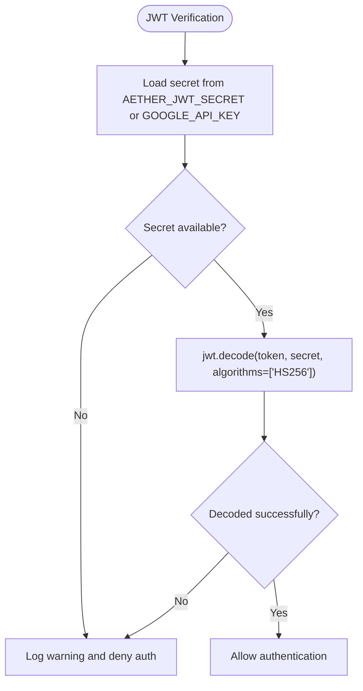
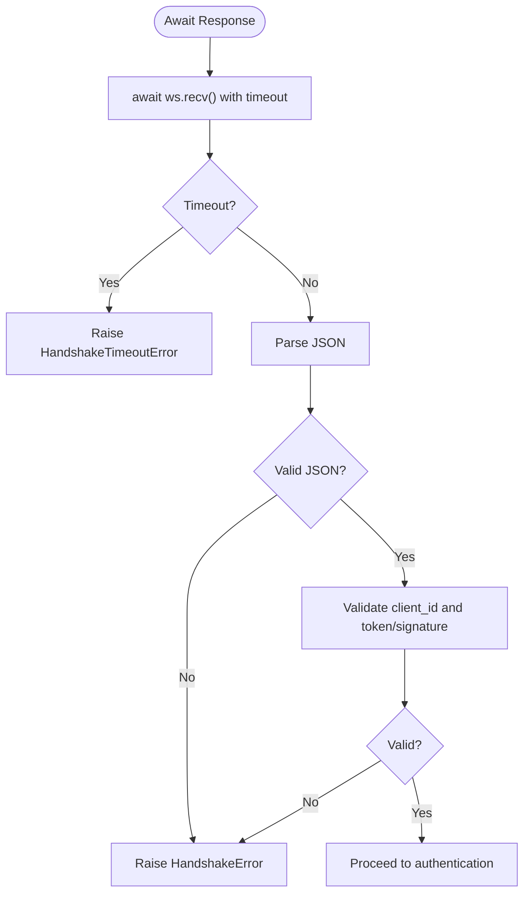
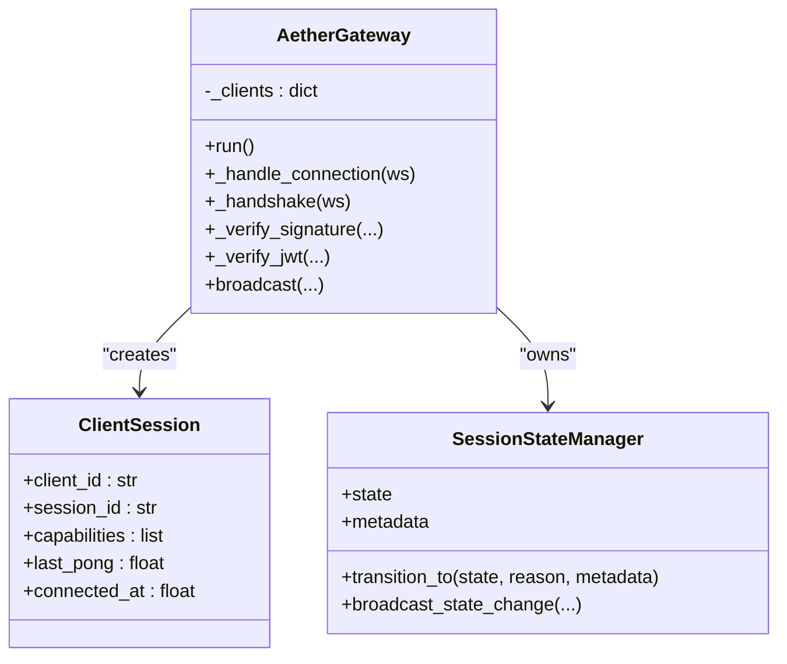
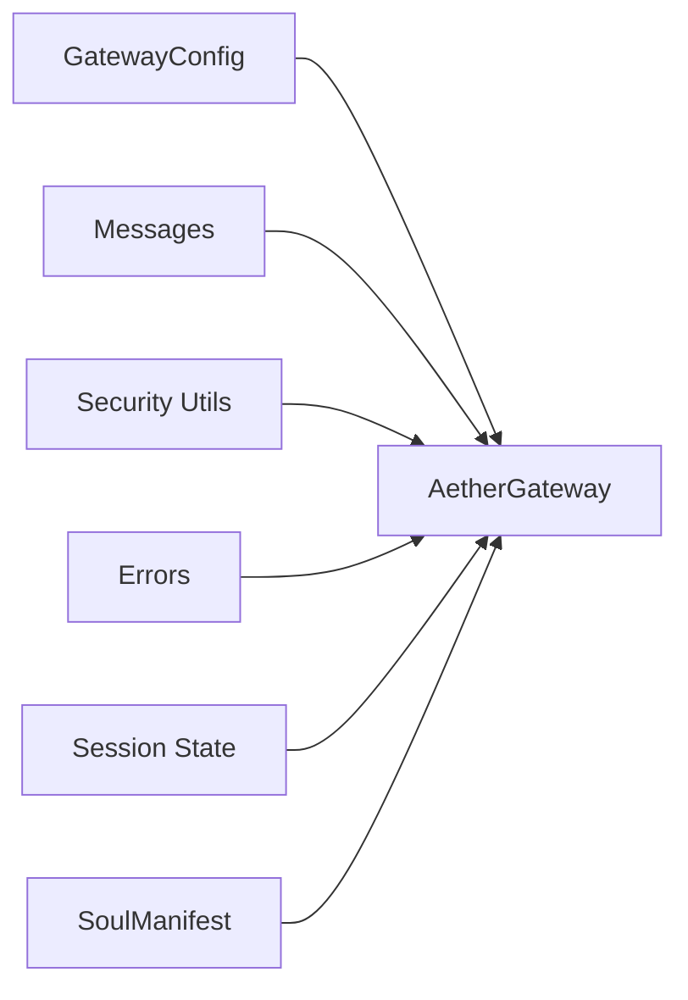

# Authentication & Handshake

<cite>
**Referenced Files in This Document**
- [gateway.py](file://core/infra/transport/gateway.py)
- [security.py](file://core/utils/security.py)
- [messages.py](file://core/infra/transport/messages.py)
- [session_state.py](file://core/infra/transport/session_state.py)
- [config.py](file://core/infra/config.py)
- [errors.py](file://core/utils/errors.py)
- [test_gateway.py](file://tests/unit/test_gateway.py)
- [test_gateway_e2e.py](file://tests/integration/test_gateway_e2e.py)
- [gateway_protocol.md](file://docs/gateway_protocol.md)
- [package.py](file://core/identity/package.py)
</cite>

## Table of Contents
1. [Introduction](#introduction)
2. [Project Structure](#project-structure)
3. [Core Components](#core-components)
4. [Architecture Overview](#architecture-overview)
5. [Detailed Component Analysis](#detailed-component-analysis)
6. [Dependency Analysis](#dependency-analysis)
7. [Performance Considerations](#performance-considerations)
8. [Troubleshooting Guide](#troubleshooting-guide)
9. [Conclusion](#conclusion)

## Introduction
This document explains the WebSocket gateway authentication and handshake protocol used by the Aether Voice OS. It covers:
- Ed25519 challenge-response authentication, including challenge generation, signature verification, and capability negotiation
- JWT token authentication as an alternative, including HS256 algorithm usage and secret key management
- Handshake timeout configuration, client session creation, and authentication failure handling
- Practical examples of authentication requests and responses, signature verification processes, and security considerations
- Client registration, capability validation, and session state management during authentication

## Project Structure
The authentication and handshake logic is implemented in the transport layer of the gateway, with supporting cryptography utilities, message schemas, configuration, and tests.

**Diagram sources**
- [gateway.py](file://core/infra/transport/gateway.py#L529-L670)
- [security.py](file://core/utils/security.py#L18-L56)
- [messages.py](file://core/infra/transport/messages.py#L16-L80)
- [config.py](file://core/infra/config.py#L88-L100)
- [errors.py](file://core/utils/errors.py#L65-L71)
- [session_state.py](file://core/infra/transport/session_state.py#L25-L42)
- [package.py](file://core/identity/package.py#L23-L50)

**Section sources**
- [gateway.py](file://core/infra/transport/gateway.py#L529-L670)
- [messages.py](file://core/infra/transport/messages.py#L16-L80)
- [config.py](file://core/infra/config.py#L88-L100)
- [errors.py](file://core/utils/errors.py#L65-L71)
- [session_state.py](file://core/infra/transport/session_state.py#L25-L42)
- [security.py](file://core/utils/security.py#L18-L56)
- [package.py](file://core/identity/package.py#L23-L50)

## Core Components
- AetherGateway: Orchestrates WebSocket connections, performs Ed25519 challenge-response or JWT authentication, creates client sessions, and manages heartbeat and session state.
- ClientSession: Tracks a connected and authenticated client’s identity, session ID, capabilities, and liveness.
- Message schemas: Define handshake messages (challenge, response, ack) and control-plane messages (tick, pong, disconnect).
- Security utilities: Provide Ed25519 signature verification and keypair generation.
- Configuration: Defines handshake timeout, heartbeat intervals, and network binding.
- Errors: Provides typed exceptions for handshake failures and timeouts.
- Session state: Manages session lifecycle and broadcasting to clients.

**Section sources**
- [gateway.py](file://core/infra/transport/gateway.py#L52-L124)
- [messages.py](file://core/infra/transport/messages.py#L47-L80)
- [security.py](file://core/utils/security.py#L18-L56)
- [config.py](file://core/infra/config.py#L88-L100)
- [errors.py](file://core/utils/errors.py#L65-L71)
- [session_state.py](file://core/infra/transport/session_state.py#L25-L42)

## Architecture Overview
The authentication and handshake flow is a non-interactive challenge-response using Ed25519. Optionally, clients may present a JWT (HS256) instead of a signature.

**Diagram sources**
- [gateway.py](file://core/infra/transport/gateway.py#L559-L617)
- [messages.py](file://core/infra/transport/messages.py#L47-L71)
- [security.py](file://core/utils/security.py#L18-L56)

## Detailed Component Analysis

### Ed25519 Challenge-Response Authentication
- Challenge generation: The server generates a 32-byte random challenge and sends it as a hex-encoded string in a connect.challenge message.
- Response handling: The client responds with connect.response containing client_id, signature, and optional capabilities. The server validates the signature against either:
  - A public key registered under the client_id
  - The client_id itself if it is a 64-character lowercase hex string (direct/public key mode)
  - A development fallback public key from environment
- Capability negotiation: The server grants capabilities included in the response and echoes them in connect.ack.
- Session creation: On successful authentication, the server creates a ClientSession and stores it keyed by client_id.

**Diagram sources**
- [gateway.py](file://core/infra/transport/gateway.py#L559-L617)
- [security.py](file://core/utils/security.py#L18-L56)
- [messages.py](file://core/infra/transport/messages.py#L47-L71)

**Section sources**
- [gateway.py](file://core/infra/transport/gateway.py#L559-L617)
- [security.py](file://core/utils/security.py#L18-L56)
- [messages.py](file://core/infra/transport/messages.py#L47-L71)

### JWT Token Authentication (Alternative)
- Token format: HS256 JWT.
- Secret sources: AETHER_JWT_SECRET or GOOGLE_API_KEY environment variable.
- Verification: The server decodes and verifies the token using the configured secret. On failure, authentication fails.

**Diagram sources**
- [gateway.py](file://core/infra/transport/gateway.py#L619-L635)

**Section sources**
- [gateway.py](file://core/infra/transport/gateway.py#L619-L635)

### Handshake Timeout Configuration and Failure Handling
- Timeout: The server waits for the client response up to handshake_timeout_s seconds.
- Timeout error: If exceeded, a HandshakeTimeoutError is raised and surfaced as a 401 error to the client.
- General handshake errors: Missing fields, invalid JSON, or invalid signature/token lead to HandshakeError and 401 error.

**Diagram sources**
- [gateway.py](file://core/infra/transport/gateway.py#L569-L584)
- [errors.py](file://core/utils/errors.py#L65-L71)

**Section sources**
- [gateway.py](file://core/infra/transport/gateway.py#L569-L584)
- [errors.py](file://core/utils/errors.py#L65-L71)

### Client Registration, Capability Validation, and Session State Management
- Client registration: On successful authentication, the server creates a ClientSession and stores it in a dictionary keyed by client_id.
- Capability validation: Capabilities are included in the response and echoed back in connect.ack; the server does not enforce capability presence beyond echoing them.
- Session state: The gateway maintains a SessionStateManager that tracks the overall engine state and broadcasts changes to clients. Authentication occurs outside the engine session lifecycle, but the gateway’s state manager governs steady-state operations.

**Diagram sources**
- [gateway.py](file://core/infra/transport/gateway.py#L52-L124)
- [session_state.py](file://core/infra/transport/session_state.py#L71-L101)

**Section sources**
- [gateway.py](file://core/infra/transport/gateway.py#L603-L617)
- [session_state.py](file://core/infra/transport/session_state.py#L197-L271)

### Practical Examples
- Ed25519 handshake end-to-end: The integration test demonstrates generating a signing key, signing the challenge, and verifying that the gateway accepts the handshake or returns an appropriate error.
- Unit tests: Demonstrate successful handshake, handshake timeout, heartbeat tick/pong behavior, and client pruning after missed ticks.

**Section sources**
- [test_gateway_e2e.py](file://tests/integration/test_gateway_e2e.py#L105-L157)
- [test_gateway.py](file://tests/unit/test_gateway.py#L84-L126)

## Dependency Analysis
- AetherGateway depends on:
  - Message schemas for handshake framing
  - Security utilities for Ed25519 verification
  - Configuration for timeouts and heartbeat intervals
  - Errors for typed handshake failures
  - Session state manager for steady-state operations
  - Package model for public key presence in manifests

**Diagram sources**
- [gateway.py](file://core/infra/transport/gateway.py#L78-L124)
- [messages.py](file://core/infra/transport/messages.py#L16-L80)
- [security.py](file://core/utils/security.py#L18-L56)
- [errors.py](file://core/utils/errors.py#L65-L71)
- [session_state.py](file://core/infra/transport/session_state.py#L71-L101)
- [package.py](file://core/identity/package.py#L23-L50)

**Section sources**
- [gateway.py](file://core/infra/transport/gateway.py#L78-L124)
- [messages.py](file://core/infra/transport/messages.py#L16-L80)
- [security.py](file://core/utils/security.py#L18-L56)
- [errors.py](file://core/utils/errors.py#L65-L71)
- [session_state.py](file://core/infra/transport/session_state.py#L71-L101)
- [package.py](file://core/identity/package.py#L23-L50)

## Performance Considerations
- Handshake timeout: Configure handshake_timeout_s to balance responsiveness and reliability. Shorter timeouts reduce hanging connections but risk rejecting legitimate clients under load.
- Heartbeat intervals: tick_interval_s controls steady-state heartbeat frequency; adjust to trade off liveness detection speed vs. bandwidth.
- Client pruning: max_missed_ticks multiplied by tick_interval_s determines the grace period before pruning idle clients.

**Section sources**
- [config.py](file://core/infra/config.py#L88-L100)
- [gateway.py](file://core/infra/transport/gateway.py#L704-L743)

## Troubleshooting Guide
Common issues and resolutions:
- Authentication failures
  - Invalid signature or missing signature: Ensure the client signs the challenge with the correct Ed25519 private key and includes a 64-character hex signature.
  - Missing client_id: Include a valid client_id in the response.
  - Unknown client_id: If using registry-based keys, ensure the client_id matches a registered soul with a public key.
- JWT verification failures
  - Missing secret: Set AETHER_JWT_SECRET or GOOGLE_API_KEY to a shared secret.
  - Wrong algorithm: Use HS256 as supported by the server.
- Timeouts
  - Handshake timeout: Increase handshake_timeout_s or improve client responsiveness.
  - Heartbeat timeout: Ensure the client sends PONG messages promptly to avoid pruning.

Operational checks:
- Confirm environment variables for secrets are set.
- Validate that the client’s public key is registered (if using registry mode).
- Review logs for warnings about signature verification or JWT decoding failures.

**Section sources**
- [gateway.py](file://core/infra/transport/gateway.py#L569-L617)
- [errors.py](file://core/utils/errors.py#L65-L71)
- [test_gateway.py](file://tests/unit/test_gateway.py#L110-L126)

## Conclusion
The Aether Voice OS WebSocket gateway implements a robust, zero-trust authentication protocol:
- Ed25519 challenge-response as the primary method, with flexible public key resolution modes
- JWT (HS256) as an alternative for service-to-service scenarios
- Configurable timeouts and heartbeat-driven liveness checks
- Clear error signaling and client session management

These mechanisms provide strong identity guarantees and operational resilience for the neural link between clients and the AI session.