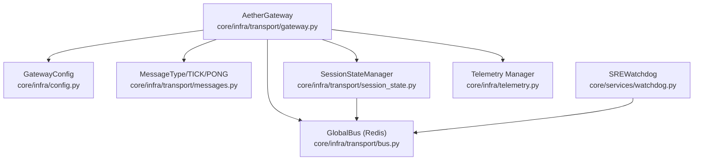
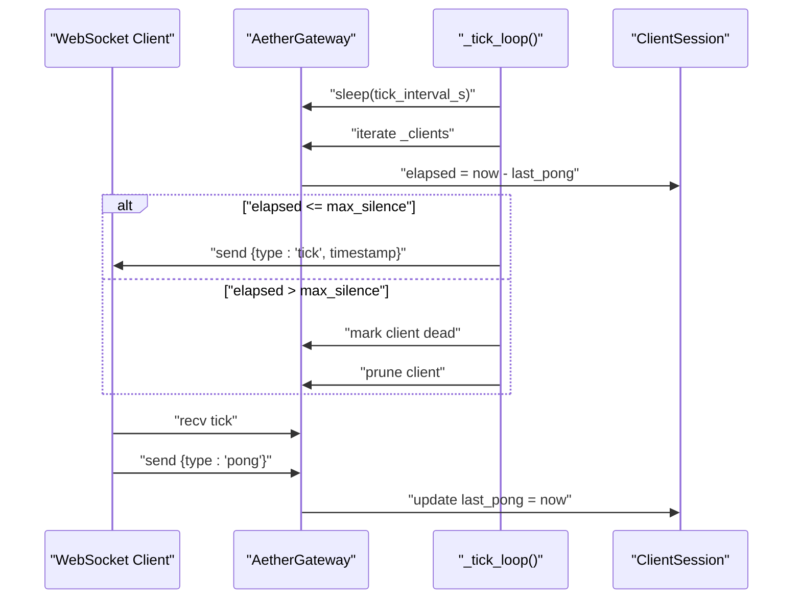
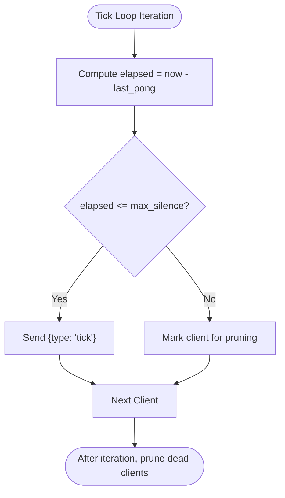
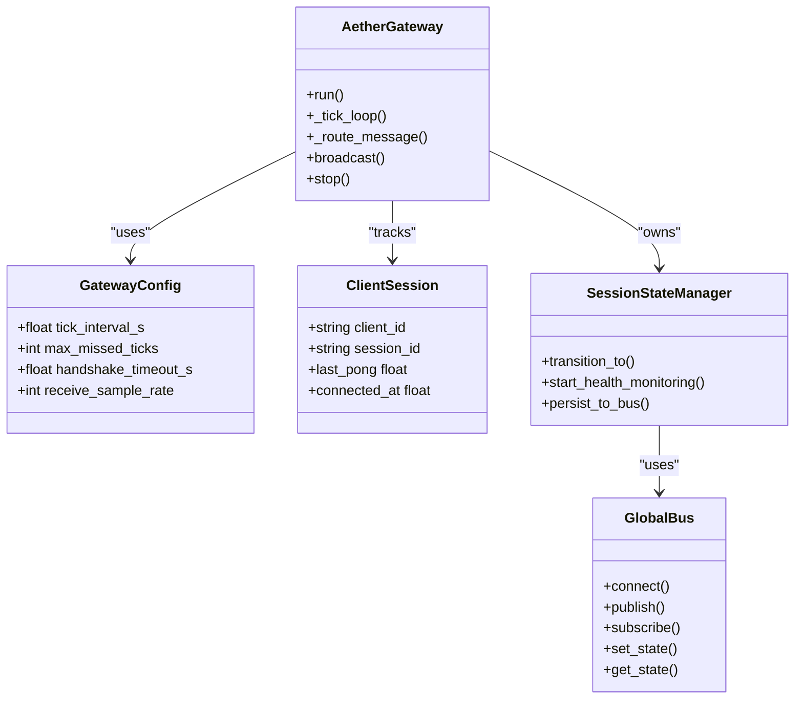

# Heartbeat & Connection Monitoring

<cite>
**Referenced Files in This Document**
- [gateway.py](file://core/infra/transport/gateway.py)
- [config.py](file://core/infra/config.py)
- [messages.py](file://core/infra/transport/messages.py)
- [session_state.py](file://core/infra/transport/session_state.py)
- [test_gateway.py](file://tests/unit/test_gateway.py)
- [test_gateway_e2e.py](file://tests/integration/test_gateway_e2e.py)
- [bus.py](file://core/infra/transport/bus.py)
- [watchdog.py](file://core/services/watchdog.py)
- [telemetry.py](file://core/infra/telemetry.py)
</cite>

## Table of Contents
1. [Introduction](#introduction)
2. [Project Structure](#project-structure)
3. [Core Components](#core-components)
4. [Architecture Overview](#architecture-overview)
5. [Detailed Component Analysis](#detailed-component-analysis)
6. [Dependency Analysis](#dependency-analysis)
7. [Performance Considerations](#performance-considerations)
8. [Troubleshooting Guide](#troubleshooting-guide)
9. [Conclusion](#conclusion)
10. [Appendices](#appendices)

## Introduction
This document explains the heartbeat and connection monitoring system in the WebSocket gateway. It covers heartbeat interval configuration, PONG response handling, connection health assessment, dead client detection algorithms, timeout thresholds, automatic pruning, the tick loop implementation, connection state tracking, and monitoring metrics collection. It also documents configuration parameters, monitoring best practices, alerting mechanisms, and troubleshooting steps for connection issues.

## Project Structure
The heartbeat and connection monitoring logic resides primarily in the gateway transport module, with supporting configuration, message types, session state management, and tests. The Global Bus and Watchdog services provide complementary monitoring and alerting capabilities.

**Diagram sources**
- [gateway.py](file://core/infra/transport/gateway.py#L69-L120)
- [config.py](file://core/infra/config.py#L88-L100)
- [messages.py](file://core/infra/transport/messages.py#L16-L36)
- [session_state.py](file://core/infra/transport/session_state.py#L71-L120)
- [bus.py](file://core/infra/transport/bus.py#L25-L52)
- [watchdog.py](file://core/services/watchdog.py#L39-L73)
- [telemetry.py](file://core/infra/telemetry.py#L14-L35)

**Section sources**
- [gateway.py](file://core/infra/transport/gateway.py#L69-L120)
- [config.py](file://core/infra/config.py#L88-L100)
- [messages.py](file://core/infra/transport/messages.py#L16-L36)
- [session_state.py](file://core/infra/transport/session_state.py#L71-L120)
- [bus.py](file://core/infra/transport/bus.py#L25-L52)
- [watchdog.py](file://core/services/watchdog.py#L39-L73)
- [telemetry.py](file://core/infra/telemetry.py#L14-L35)

## Core Components
- AetherGateway: Implements the WebSocket server, handshake, routing, heartbeat tick loop, and dead client pruning.
- ClientSession: Tracks per-client state including last PONG timestamp and connection time.
- GatewayConfig: Defines heartbeat interval, maximum missed ticks, handshake timeout, and receive sample rate.
- MessageType: Declares TICK and PONG message types used for heartbeat.
- SessionStateManager: Manages session lifecycle and includes health monitoring for the AI session.
- GlobalBus: Provides pub/sub and KV state storage used by the session state manager and watchdog.
- SREWatchdog: Monitors logs and publishes health alerts; can trigger autonomous healing.
- Telemetry Manager: Provides tracing and usage recording for observability.

**Section sources**
- [gateway.py](file://core/infra/transport/gateway.py#L52-L120)
- [config.py](file://core/infra/config.py#L88-L100)
- [messages.py](file://core/infra/transport/messages.py#L16-L36)
- [session_state.py](file://core/infra/transport/session_state.py#L71-L120)
- [bus.py](file://core/infra/transport/bus.py#L25-L52)
- [watchdog.py](file://core/services/watchdog.py#L39-L73)
- [telemetry.py](file://core/infra/telemetry.py#L14-L35)

## Architecture Overview
The gateway maintains a tick loop that periodically sends heartbeat ticks to connected clients and prunes those that fail to respond with PONG within configured thresholds. Clients must send PONG to refresh their last pong timestamp. The session state manager monitors the underlying AI session health independently, publishing state changes and persisting snapshots.

**Diagram sources**
- [gateway.py](file://core/infra/transport/gateway.py#L704-L742)
- [messages.py](file://core/infra/transport/messages.py#L16-L36)
- [gateway.py](file://core/infra/transport/gateway.py#L690-L694)

## Detailed Component Analysis

### Heartbeat Interval Configuration
- tick_interval_s: Controls the period between heartbeat ticks sent to clients.
- max_missed_ticks: Multiplier determining the maximum allowed silence before pruning.
- Effective timeout threshold = tick_interval_s × max_missed_ticks.

These parameters are defined in the GatewayConfig and used in the tick loop to compute max_silence and to send tick_interval_s in the ACK message.

**Section sources**
- [config.py](file://core/infra/config.py#L96-L98)
- [gateway.py](file://core/infra/transport/gateway.py#L718-L722)
- [gateway.py](file://core/infra/transport/gateway.py#L613-L615)

### PONG Response Handling
- On receiving PONG, the gateway updates the client’s last_pong timestamp.
- This resets the dead-client detection timer for that client.

**Section sources**
- [gateway.py](file://core/infra/transport/gateway.py#L686-L703)
- [gateway.py](file://core/infra/transport/gateway.py#L690-L694)

### Dead Client Detection and Automatic Pruning
- The tick loop iterates all sessions and computes elapsed time since last PONG.
- If elapsed exceeds max_silence, the client is marked for pruning.
- Pruning occurs outside the iteration to avoid modifying the collection during iteration.
- Connections that throw ConnectionClosed while sending ticks are also pruned.

**Diagram sources**
- [gateway.py](file://core/infra/transport/gateway.py#L704-L742)

**Section sources**
- [gateway.py](file://core/infra/transport/gateway.py#L704-L742)

### Tick Loop Implementation
- Runs continuously while the gateway is running.
- Sleeps for tick_interval_s between iterations.
- Sends ticks to all clients and prunes dead ones.
- Periodically cleans up completed/failed handovers.

**Section sources**
- [gateway.py](file://core/infra/transport/gateway.py#L704-L710)
- [gateway.py](file://core/infra/transport/gateway.py#L727-L738)

### Connection State Tracking
- ClientSession stores client_id, session_id, WS connection, capabilities, last_pong, and connected_at.
- The gateway maintains a dictionary keyed by client_id.

**Section sources**
- [gateway.py](file://core/infra/transport/gateway.py#L52-L67)
- [gateway.py](file://core/infra/transport/gateway.py#L117-L120)

### Monitoring Metrics Collection
- SessionStateManager tracks session state transitions, error counts, and persists snapshots to the Global Bus.
- Health monitoring task periodically checks session health and can trigger recovery or shutdown conditions.
- Telemetry Manager provides tracing and usage recording.

**Section sources**
- [session_state.py](file://core/infra/transport/session_state.py#L378-L427)
- [session_state.py](file://core/infra/transport/session_state.py#L273-L291)
- [telemetry.py](file://core/infra/telemetry.py#L14-L35)

### Message Types and Protocol
- MessageType defines TICK and PONG for heartbeat.
- The gateway sends ACK with tick_interval_s to inform clients of heartbeat cadence.

**Section sources**
- [messages.py](file://core/infra/transport/messages.py#L16-L36)
- [gateway.py](file://core/infra/transport/gateway.py#L613-L615)

### Tests Confirming Behavior
- Heartbeat tick and PONG keep client alive beyond one tick interval.
- Without PONG, client is pruned after max_missed_ticks × tick_interval_s.

**Section sources**
- [test_gateway.py](file://tests/unit/test_gateway.py#L129-L147)
- [test_gateway.py](file://tests/unit/test_gateway.py#L149-L167)

## Dependency Analysis

**Diagram sources**
- [config.py](file://core/infra/config.py#L88-L100)
- [gateway.py](file://core/infra/transport/gateway.py#L52-L120)
- [session_state.py](file://core/infra/transport/session_state.py#L71-L120)
- [bus.py](file://core/infra/transport/bus.py#L25-L52)

**Section sources**
- [config.py](file://core/infra/config.py#L88-L100)
- [gateway.py](file://core/infra/transport/gateway.py#L52-L120)
- [session_state.py](file://core/infra/transport/session_state.py#L71-L120)
- [bus.py](file://core/infra/transport/bus.py#L25-L52)

## Performance Considerations
- Keep tick_interval_s balanced: too small increases overhead; too large risks premature pruning under intermittent network delays.
- max_missed_ticks should account for bursty networks and client-side processing delays.
- Use broadcast with timeouts to avoid blocking the gateway on slow clients.
- Consider adjusting queue sizes and sample rates to reduce latency and improve responsiveness.

[No sources needed since this section provides general guidance]

## Troubleshooting Guide
- Symptoms: Clients repeatedly disconnected shortly after connecting.
  - Cause: max_missed_ticks too low or tick_interval_s too high.
  - Fix: Increase max_missed_ticks or reduce tick_interval_s.
- Symptoms: Clients not receiving ticks or PONG not recorded.
  - Cause: Client not sending PONG or network issues.
  - Fix: Ensure client responds with PONG; verify network connectivity.
- Symptoms: Frequent pruning of healthy clients.
  - Cause: High network latency or bursty traffic.
  - Fix: Increase max_missed_ticks; monitor network quality.
- Symptoms: Gateway appears idle despite active clients.
  - Cause: Broadcast or tick failures.
  - Fix: Inspect broadcast timeout handling and connectionClosed exceptions.
- Monitoring and Alerting:
  - Use SREWatchdog to publish health alerts and trigger autonomous healing on recurring patterns.
  - Use Telemetry Manager for tracing and usage metrics.
  - SessionStateManager persists session snapshots to GlobalBus for recovery and diagnostics.

**Section sources**
- [gateway.py](file://core/infra/transport/gateway.py#L744-L776)
- [watchdog.py](file://core/services/watchdog.py#L119-L168)
- [telemetry.py](file://core/infra/telemetry.py#L14-L35)
- [session_state.py](file://core/infra/transport/session_state.py#L273-L291)

## Conclusion
The gateway’s heartbeat and connection monitoring system combines periodic ticks, PONG-based liveness tracking, and automatic pruning to maintain a robust set of active connections. Configuration parameters allow tuning for reliability and responsiveness. Complementary session health monitoring, telemetry, and watchdog services provide comprehensive observability and autonomous recovery capabilities.

[No sources needed since this section summarizes without analyzing specific files]

## Appendices

### Configuration Parameters
- tick_interval_s: Heartbeat interval in seconds.
- max_missed_ticks: Maximum missed ticks before pruning.
- handshake_timeout_s: Handshake timeout in seconds.
- receive_sample_rate: Audio receive sample rate.

**Section sources**
- [config.py](file://core/infra/config.py#L96-L99)

### Message Types Used in Heartbeat
- TICK: Server-to-client heartbeat.
- PONG: Client-to-server acknowledgment.

**Section sources**
- [messages.py](file://core/infra/transport/messages.py#L16-L36)

### End-to-End Test References
- E2E handshake test verifies gateway behavior with real clients.

**Section sources**
- [test_gateway_e2e.py](file://tests/integration/test_gateway_e2e.py#L66-L168)