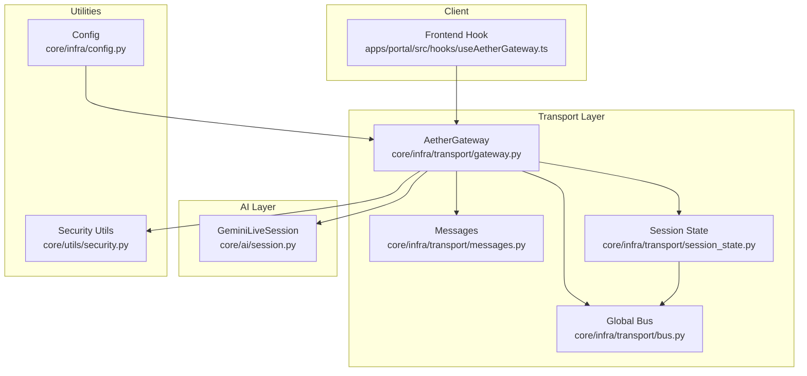
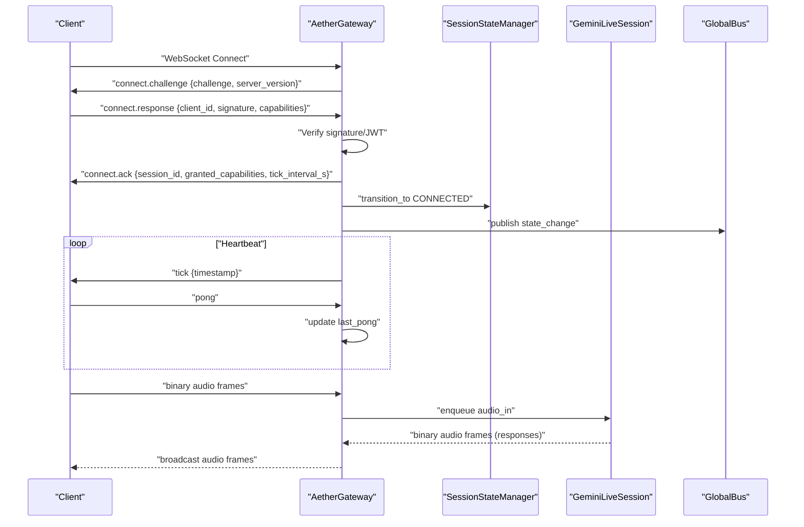
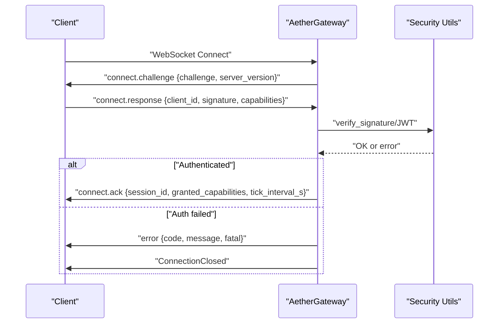
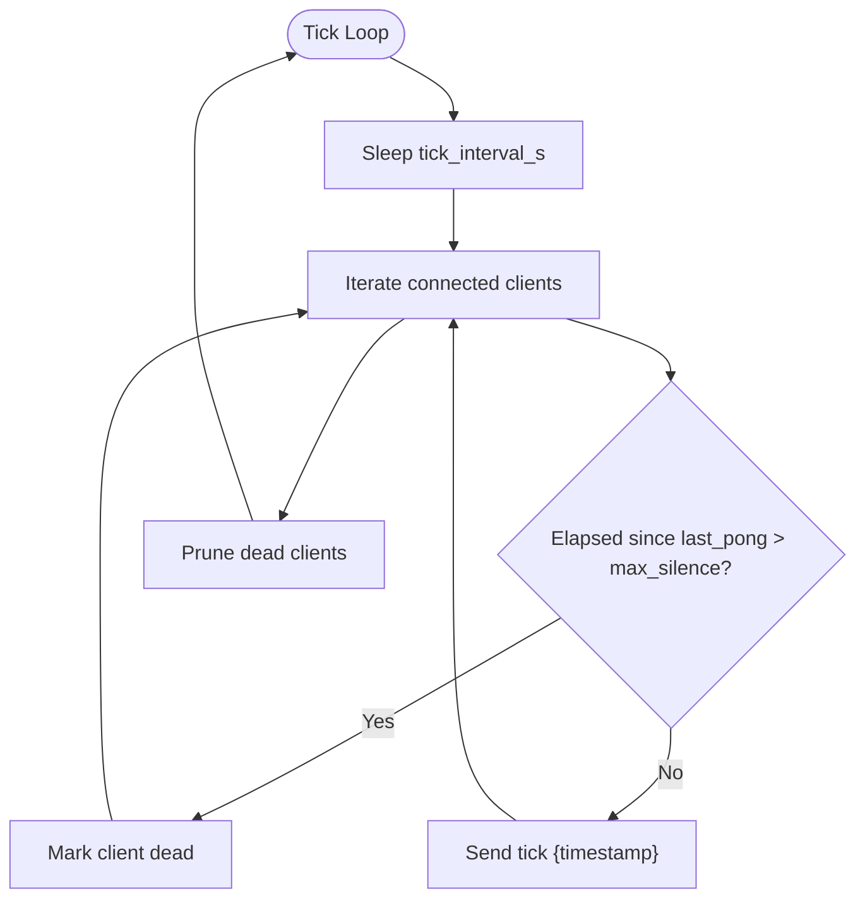
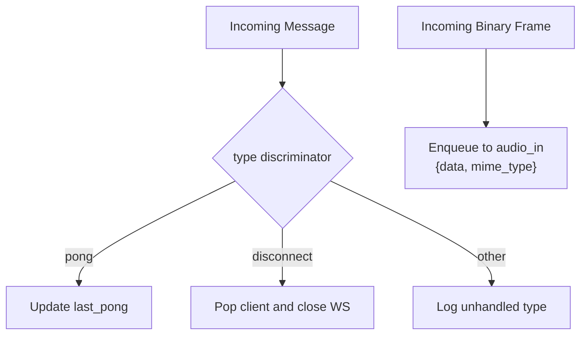
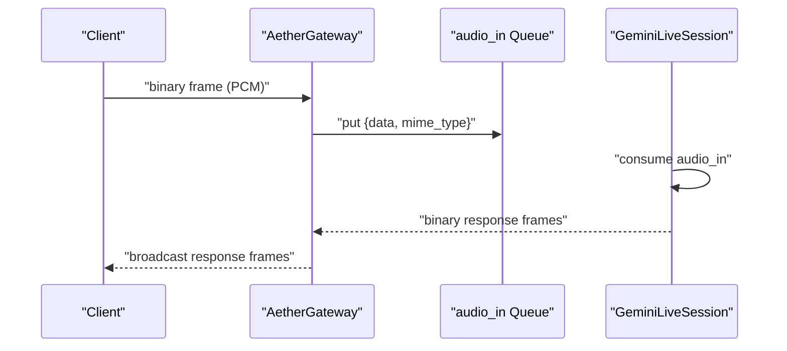
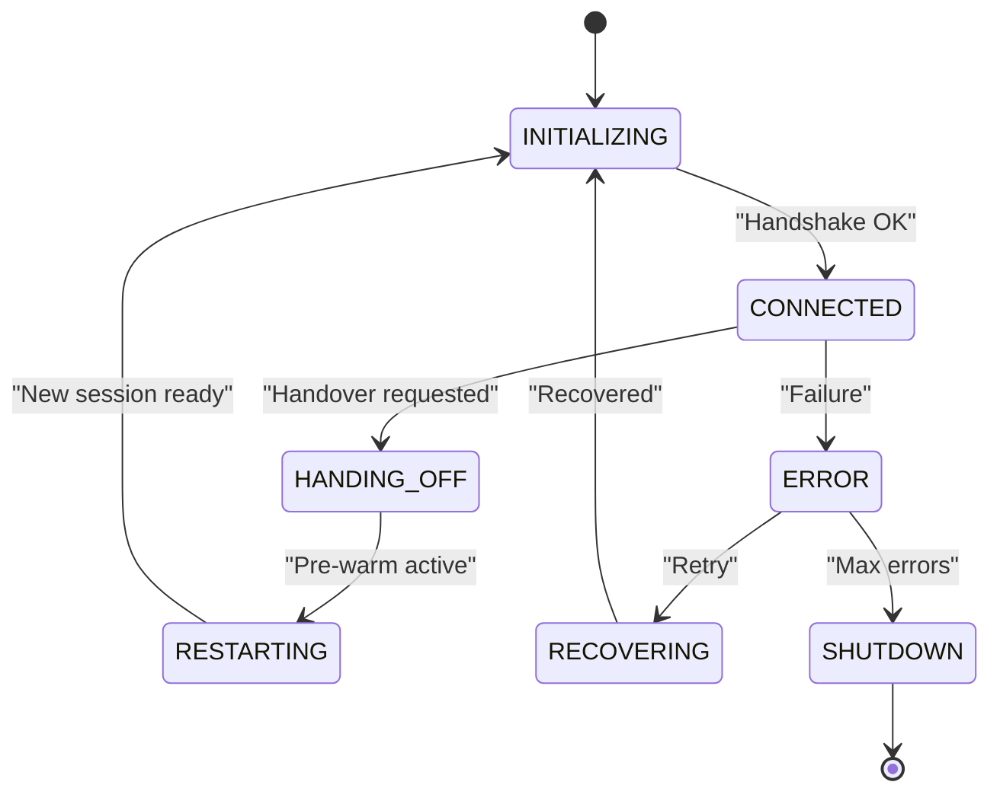
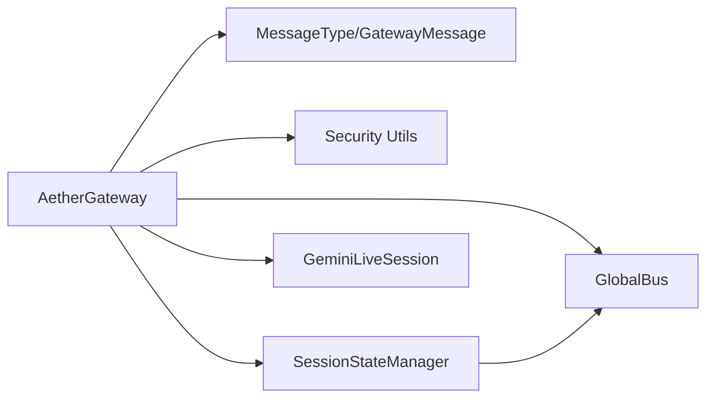

# Message Routing & Protocols

<cite>
**Referenced Files in This Document**
- [gateway.py](file://core/infra/transport/gateway.py)
- [messages.py](file://core/infra/transport/messages.py)
- [gateway_protocol.md](file://docs/gateway_protocol.md)
- [session_state.py](file://core/infra/transport/session_state.py)
- [security.py](file://core/utils/security.py)
- [config.py](file://core/infra/config.py)
- [useAetherGateway.ts](file://apps/portal/src/hooks/useAetherGateway.ts)
- [test_gateway.py](file://tests/unit/test_gateway.py)
- [test_gateway_e2e.py](file://tests/integration/test_gateway_e2e.py)
- [bus.py](file://core/infra/transport/bus.py)
- [session.py](file://core/ai/session.py)
</cite>

## Table of Contents
1. [Introduction](#introduction)
2. [Project Structure](#project-structure)
3. [Core Components](#core-components)
4. [Architecture Overview](#architecture-overview)
5. [Detailed Component Analysis](#detailed-component-analysis)
6. [Dependency Analysis](#dependency-analysis)
7. [Performance Considerations](#performance-considerations)
8. [Troubleshooting Guide](#troubleshooting-guide)
9. [Conclusion](#conclusion)

## Introduction
This document describes the WebSocket message routing and protocol handling in the Aether Voice OS gateway. It covers supported message types, handshake and authentication, heartbeat mechanism, JSON schema validation, binary audio streaming, type-based dispatching, error handling, and reliability mechanisms such as message queuing and flow control. The goal is to provide a comprehensive yet accessible guide for developers integrating with or extending the gateway.

## Project Structure
The gateway lives in the transport layer and coordinates authentication, session lifecycle, and message routing. Supporting modules include protocol definitions, security utilities, configuration, and state management.

**Diagram sources**
- [gateway.py](file://core/infra/transport/gateway.py#L69-L124)
- [messages.py](file://core/infra/transport/messages.py#L16-L80)
- [session_state.py](file://core/infra/transport/session_state.py#L71-L119)
- [bus.py](file://core/infra/transport/bus.py#L25-L95)
- [security.py](file://core/utils/security.py#L18-L55)
- [config.py](file://core/infra/config.py#L88-L100)
- [useAetherGateway.ts](file://apps/portal/src/hooks/useAetherGateway.ts#L113-L141)
- [session.py](file://core/ai/session.py#L43-L95)

**Section sources**
- [gateway.py](file://core/infra/transport/gateway.py#L69-L124)
- [messages.py](file://core/infra/transport/messages.py#L16-L80)
- [session_state.py](file://core/infra/transport/session_state.py#L71-L119)
- [bus.py](file://core/infra/transport/bus.py#L25-L95)
- [security.py](file://core/utils/security.py#L18-L55)
- [config.py](file://core/infra/config.py#L88-L100)
- [useAetherGateway.ts](file://apps/portal/src/hooks/useAetherGateway.ts#L113-L141)
- [session.py](file://core/ai/session.py#L43-L95)

## Core Components
- AetherGateway: WebSocket server, handshake, routing, heartbeat, broadcasting, and client lifecycle management.
- MessageType and GatewayMessage: Strongly typed message definitions and discriminator field for routing.
- SessionStateManager: Centralized session state machine with persistence and broadcast.
- Security utilities: Ed25519 signature verification for authentication.
- Config: Transport and audio parameters including heartbeat intervals and queue sizes.

Key responsibilities:
- Authentication: Challenge-response using Ed25519 or JWT.
- Heartbeat: Periodic TICK/PONG with pruning of dead clients.
- Routing: JSON control-plane and binary audio streaming.
- Reliability: Queues, backpressure, and graceful error handling.

**Section sources**
- [gateway.py](file://core/infra/transport/gateway.py#L69-L124)
- [messages.py](file://core/infra/transport/messages.py#L16-L80)
- [session_state.py](file://core/infra/transport/session_state.py#L25-L119)
- [security.py](file://core/utils/security.py#L18-L55)
- [config.py](file://core/infra/config.py#L88-L100)

## Architecture Overview
The gateway orchestrates a secure, low-latency connection between clients and the AI session. Clients authenticate, receive ACK with session parameters, then participate in a steady-state heartbeat loop. Binary audio frames are streamed to the session’s input queue; the session forwards audio to Gemini Live and streams responses back to clients.

**Diagram sources**
- [gateway.py](file://core/infra/transport/gateway.py#L529-L617)
- [messages.py](file://core/infra/transport/messages.py#L47-L80)
- [session_state.py](file://core/infra/transport/session_state.py#L197-L271)
- [bus.py](file://core/infra/transport/bus.py#L96-L128)
- [session.py](file://core/ai/session.py#L174-L200)

## Detailed Component Analysis

### Message Types and Protocol Definitions
Supported message types include handshake, lifecycle, data, UI, and error messages. Each message has a discriminator field enabling type-based dispatch.

- connect.challenge: Server challenges the client with random bytes.
- connect.response: Client responds with signature and capabilities.
- connect.ack: Server acknowledges and grants capabilities.
- tick: Server heartbeat with timestamp.
- pong: Client acknowledgment of heartbeat.
- disconnect: Client-initiated disconnect.
- audio.chunk: Binary audio frames (PCM).
- tool.call/tool.result: Tool invocation and results.
- ui.update/vad.event: UI updates and VAD events.
- error: Server-side error with code and fatal flag.

JSON schema validation is implicit through Pydantic models; the discriminator ensures correct routing.

**Section sources**
- [messages.py](file://core/infra/transport/messages.py#L16-L80)
- [gateway_protocol.md](file://docs/gateway_protocol.md#L41-L105)

### Handshake and Authentication
The gateway performs a non-interactive Ed25519 challenge-response. It supports JWT verification as an alternative. On success, the gateway sends an ACK with session metadata and heartbeat interval.

Validation rules:
- Challenge must be present and valid.
- Response must include client_id and either signature or token.
- Signature must verify against a known public key or fallback keys.
- JWT verification uses HS256 with configured secrets.

**Diagram sources**
- [gateway.py](file://core/infra/transport/gateway.py#L559-L617)
- [security.py](file://core/utils/security.py#L18-L55)
- [messages.py](file://core/infra/transport/messages.py#L47-L80)

**Section sources**
- [gateway.py](file://core/infra/transport/gateway.py#L559-L617)
- [security.py](file://core/utils/security.py#L18-L55)
- [messages.py](file://core/infra/transport/messages.py#L47-L80)
- [test_gateway_e2e.py](file://tests/integration/test_gateway_e2e.py#L101-L134)

### Heartbeat and Lifecycle Management
The gateway periodically sends heartbeat ticks and expects PONG acknowledgments. Dead clients are pruned after a threshold of missed ticks. The session state machine governs transitions and broadcasts state changes.

Heartbeat parameters:
- tick_interval_s controls frequency.
- max_missed_ticks determines pruning threshold.
- last_pong is updated on PONG.

**Diagram sources**
- [gateway.py](file://core/infra/transport/gateway.py#L704-L742)
- [config.py](file://core/infra/config.py#L88-L100)

**Section sources**
- [gateway.py](file://core/infra/transport/gateway.py#L704-L742)
- [config.py](file://core/infra/config.py#L88-L100)
- [test_gateway.py](file://tests/unit/test_gateway.py#L129-L166)

### Message Routing and Dispatch
Incoming messages are routed by type. The gateway supports:
- PONG: Updates last_pong to keepalive.
- DISCONNECT: Removes client and closes connection.
- Other types: Logged as unhandled.

Binary audio frames are enqueued into the audio input queue with MIME type metadata.

**Diagram sources**
- [gateway.py](file://core/infra/transport/gateway.py#L686-L702)
- [gateway.py](file://core/infra/transport/gateway.py#L672-L684)

**Section sources**
- [gateway.py](file://core/infra/transport/gateway.py#L686-L702)
- [gateway.py](file://core/infra/transport/gateway.py#L672-L684)

### JSON Schema Validation and Protocol Compliance
Protocol compliance is enforced by:
- MessageType discriminator ensuring correct routing.
- Pydantic models validating payload structure.
- Explicit checks for required fields (e.g., client_id, challenge, signature/token).
- Strict error responses with standardized codes.

Compliance examples:
- connect.challenge must include challenge and server_version.
- connect.response must include client_id, signature, and capabilities.
- connect.ack must include session_id, granted_capabilities, and tick_interval_s.
- error must include code, message, and optional fatal flag.

**Section sources**
- [messages.py](file://core/infra/transport/messages.py#L47-L80)
- [gateway_protocol.md](file://docs/gateway_protocol.md#L41-L105)
- [test_gateway.py](file://tests/unit/test_gateway.py#L92-L107)

### Binary Message Handling for Audio Streaming
Clients stream raw PCM audio frames. The gateway enqueues frames into the audio input queue with appropriate MIME type derived from configuration. Responses are broadcast as binary frames to all clients.

Queue sizing and rates:
- audio_in queue max size is configurable.
- receive_sample_rate drives MIME type and downstream processing.

**Diagram sources**
- [gateway.py](file://core/infra/transport/gateway.py#L672-L684)
- [session.py](file://core/ai/session.py#L174-L200)
- [config.py](file://core/infra/config.py#L11-L44)

**Section sources**
- [gateway.py](file://core/infra/transport/gateway.py#L672-L684)
- [config.py](file://core/infra/config.py#L11-L44)
- [session.py](file://core/ai/session.py#L174-L200)

### Broadcasting and Multi-Client Delivery
The gateway supports two broadcast modes:
- Text: JSON payloads broadcast to all clients.
- Binary: Raw bytes broadcast to all clients.

Broadcast includes robustness against connection closures and timeouts.

**Section sources**
- [gateway.py](file://core/infra/transport/gateway.py#L744-L799)
- [bus.py](file://core/infra/transport/bus.py#L96-L128)

### Session State and Reliability
SessionStateManager maintains atomic transitions, persists snapshots, and broadcasts state changes. It tracks metadata such as message counts, handoffs, and errors, and participates in global state synchronization via the Global Bus.

**Diagram sources**
- [session_state.py](file://core/infra/transport/session_state.py#L25-L101)
- [session_state.py](file://core/infra/transport/session_state.py#L197-L271)
- [bus.py](file://core/infra/transport/bus.py#L161-L200)

**Section sources**
- [session_state.py](file://core/infra/transport/session_state.py#L25-L101)
- [session_state.py](file://core/infra/transport/session_state.py#L197-L271)
- [bus.py](file://core/infra/transport/bus.py#L161-L200)

### Frontend Integration Notes
The frontend hook demonstrates receiving and acting on gateway messages, including handshake ACK, error handling, heartbeat tick for latency measurement, and audio response frames.

**Section sources**
- [useAetherGateway.ts](file://apps/portal/src/hooks/useAetherGateway.ts#L113-L141)
- [useAetherGateway.ts](file://apps/portal/src/hooks/useAetherGateway.ts#L243-L248)

## Dependency Analysis
The gateway depends on:
- Transport messages for type definitions and validation.
- Security utilities for Ed25519 verification.
- Session state manager for lifecycle and persistence.
- Global bus for distributed state and pub/sub.
- AI session for audio processing and tool execution.

**Diagram sources**
- [gateway.py](file://core/infra/transport/gateway.py#L34-L45)
- [messages.py](file://core/infra/transport/messages.py#L16-L80)
- [security.py](file://core/utils/security.py#L18-L55)
- [session_state.py](file://core/infra/transport/session_state.py#L71-L119)
- [bus.py](file://core/infra/transport/bus.py#L25-L95)
- [session.py](file://core/ai/session.py#L43-L95)

**Section sources**
- [gateway.py](file://core/infra/transport/gateway.py#L34-L45)
- [messages.py](file://core/infra/transport/messages.py#L16-L80)
- [security.py](file://core/utils/security.py#L18-L55)
- [session_state.py](file://core/infra/transport/session_state.py#L71-L119)
- [bus.py](file://core/infra/transport/bus.py#L25-L95)
- [session.py](file://core/ai/session.py#L43-L95)

## Performance Considerations
- Heartbeat tuning: Adjust tick_interval_s and max_missed_ticks to balance responsiveness and overhead.
- Queue sizing: audio_in and audio_out queue sizes bound latency and memory usage.
- Broadcast timeouts: Broadcast operations guard against slow clients.
- Pre-warming: Reduces handover latency by initializing the next session in advance.
- Priority handling: Audio frames are enqueued for processing; ensure downstream consumers keep pace to avoid drops.

[No sources needed since this section provides general guidance]

## Troubleshooting Guide
Common issues and resolutions:
- Authentication failures: Verify challenge-response correctness and public key availability. Check JWT secret configuration.
- Handshake timeouts: Increase handshake_timeout_s or ensure client responsiveness.
- Dead clients: Confirm PONG is sent; adjust max_missed_ticks and tick_interval_s.
- Broadcast failures: Investigate connection closures and timeouts; review client-side handling.
- Audio quality issues: Validate MIME type and sample rates; ensure queue sizes accommodate bursty traffic.

**Section sources**
- [gateway.py](file://core/infra/transport/gateway.py#L559-L617)
- [gateway.py](file://core/infra/transport/gateway.py#L704-L742)
- [gateway.py](file://core/infra/transport/gateway.py#L744-L799)
- [test_gateway.py](file://tests/unit/test_gateway.py#L111-L126)
- [test_gateway.py](file://tests/unit/test_gateway.py#L129-L166)

## Conclusion
The Aether Voice OS gateway provides a secure, low-latency transport layer with robust authentication, heartbeat-driven reliability, and efficient binary audio streaming. Its type-based routing, strict schema validation, and centralized session state management ensure predictable behavior and easy extensibility for multi-agent contexts and tool integrations.