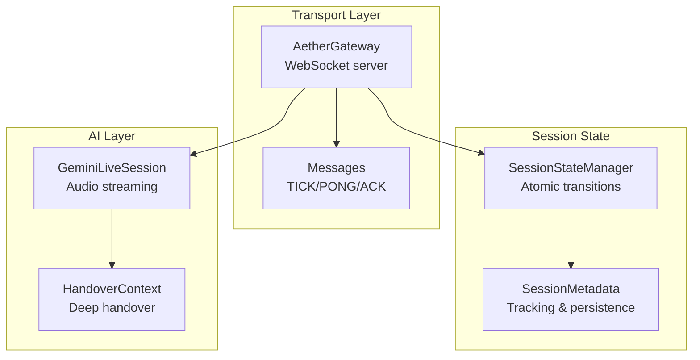
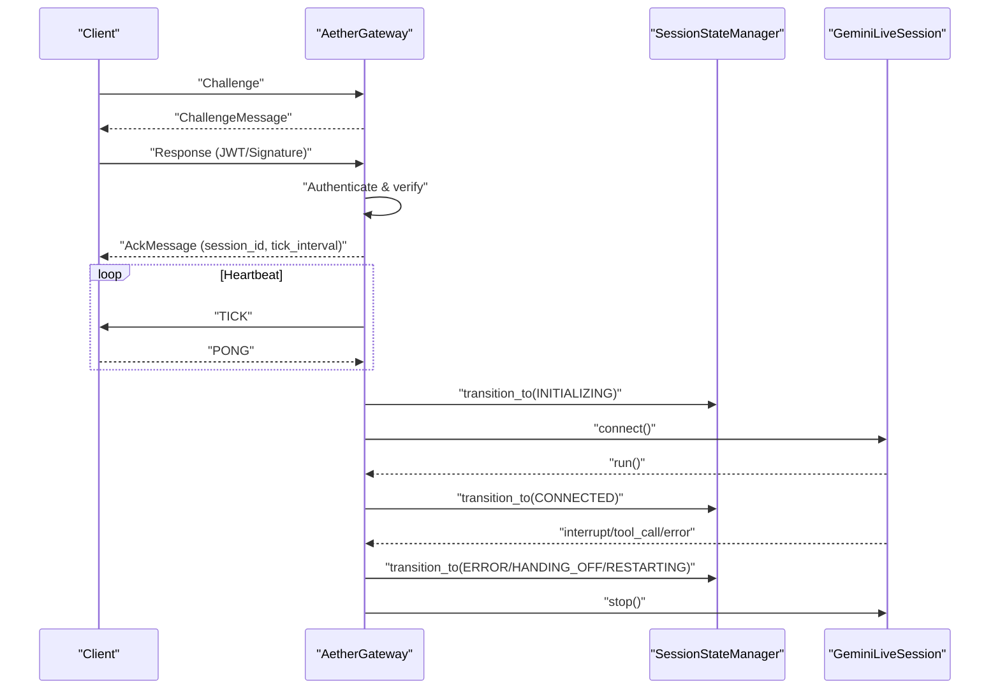
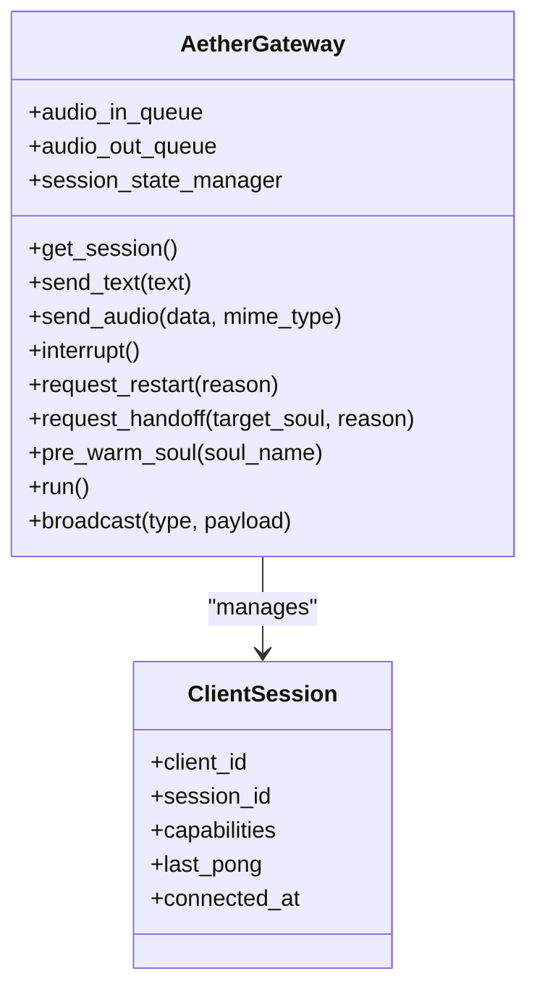
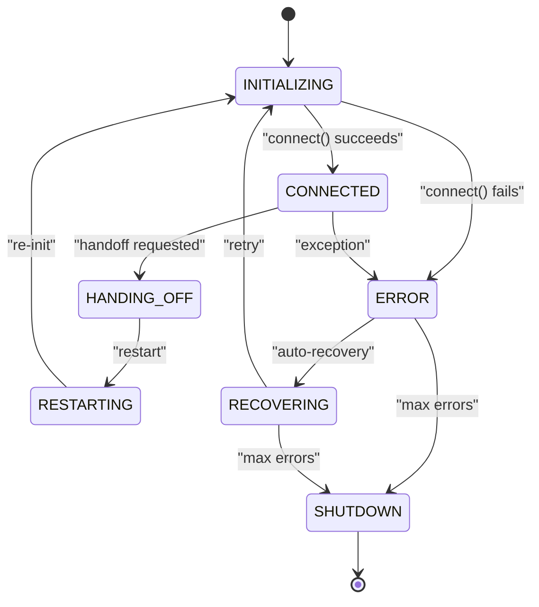
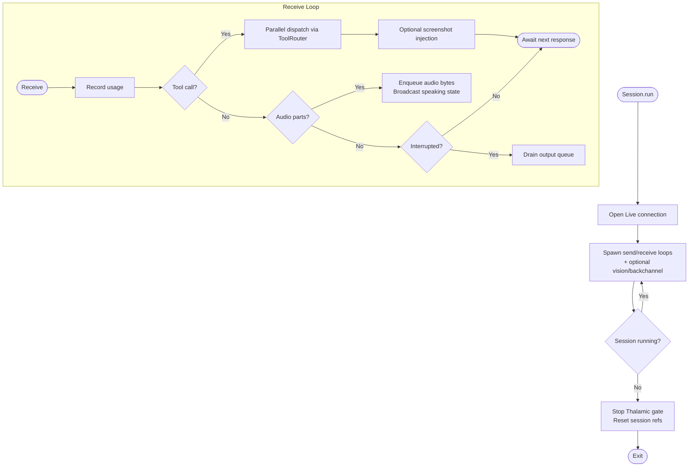
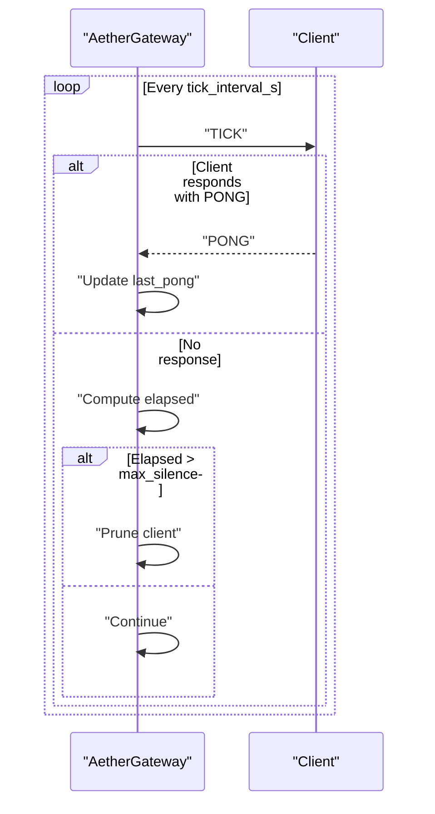
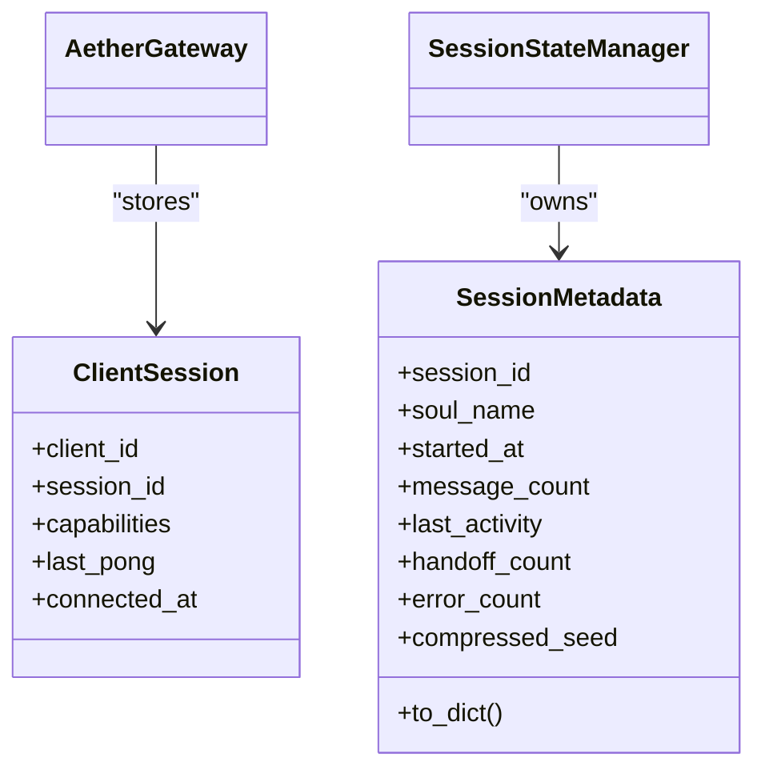
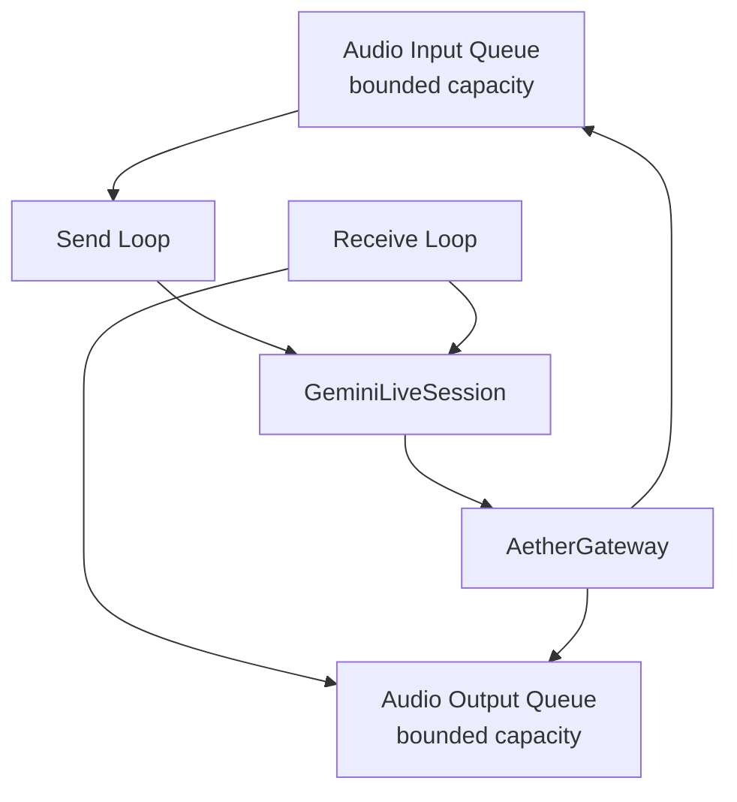
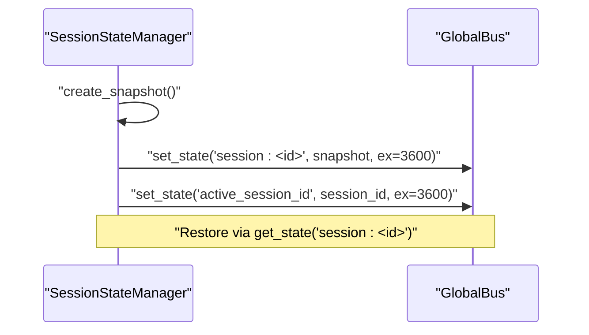
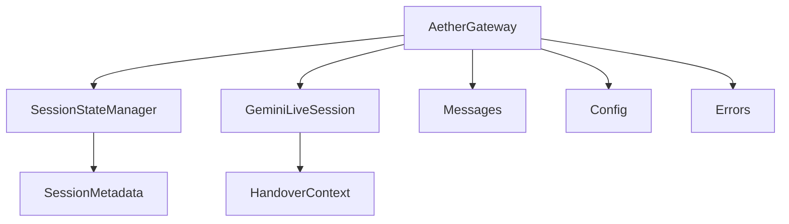

# Session Lifecycle Management

<cite>
**Referenced Files in This Document**
- [gateway.py](file://core/infra/transport/gateway.py)
- [session_state.py](file://core/infra/transport/session_state.py)
- [session.py](file://core/ai/session.py)
- [messages.py](file://core/infra/transport/messages.py)
- [handover_protocol.py](file://core/ai/handover_protocol.py)
- [config.py](file://core/infra/config.py)
- [errors.py](file://core/utils/errors.py)
- [lifecycle.py](file://core/infra/lifecycle.py)
- [test_session_state.py](file://tests/unit/test_session_state.py)
- [test_gemini_live_session.py](file://tests/unit/test_gemini_live_session.py)
- [test_gateway.py](file://tests/unit/test_gateway.py)
</cite>

## Table of Contents
1. [Introduction](#introduction)
2. [Project Structure](#project-structure)
3. [Core Components](#core-components)
4. [Architecture Overview](#architecture-overview)
5. [Detailed Component Analysis](#detailed-component-analysis)
6. [Dependency Analysis](#dependency-analysis)
7. [Performance Considerations](#performance-considerations)
8. [Troubleshooting Guide](#troubleshooting-guide)
9. [Conclusion](#conclusion)

## Introduction
This document describes the WebSocket session lifecycle management in the Aether Voice OS gateway. It covers how sessions are created, initialized, and terminated; how state transitions are enforced; how heartbeat monitoring and client pruning operate; how metadata and capabilities are tracked; and how resources are allocated and cleaned up. It also addresses concurrent session handling, isolation guarantees, persistence considerations, graceful shutdown procedures, and error recovery strategies.

## Project Structure
The session lifecycle spans three primary areas:
- Transport layer: WebSocket server, client handshake, capability negotiation, heartbeat, and client pruning
- Session state manager: Atomic state transitions, metadata tracking, persistence, and broadcasting
- AI session: Bidirectional audio streaming, tool calls, interruptions, and proactive features

**Diagram sources**
- [gateway.py](file://core/infra/transport/gateway.py#L69-L120)
- [session_state.py](file://core/infra/transport/session_state.py#L25-L120)
- [session.py](file://core/ai/session.py#L43-L120)
- [messages.py](file://core/infra/transport/messages.py#L16-L36)
- [handover_protocol.py](file://core/ai/handover_protocol.py#L107-L156)

**Section sources**
- [gateway.py](file://core/infra/transport/gateway.py#L69-L120)
- [session_state.py](file://core/infra/transport/session_state.py#L25-L120)
- [session.py](file://core/ai/session.py#L43-L120)
- [messages.py](file://core/infra/transport/messages.py#L16-L36)
- [handover_protocol.py](file://core/ai/handover_protocol.py#L107-L156)

## Core Components
- AetherGateway: Owns the WebSocket server, client sessions, audio queues, and orchestrates the session lifecycle. It performs authentication, capability negotiation, heartbeat ticks, and client pruning.
- SessionStateManager: Enforces valid state transitions, tracks metadata, persists snapshots, and broadcasts state changes.
- GeminiLiveSession: Manages the bidirectional audio stream to Gemini Live, tool call dispatch, interruptions, and proactive features like vision pulses and backchanneling.
- Messages: Defines gateway message types for handshake, lifecycle, data, UI, and error signaling.
- HandoverContext: Rich context model supporting deep handover protocols, validation checkpoints, and rollback.
- Config: Provides runtime configuration for audio, AI model selection, and gateway transport parameters.
- Errors: Unified exception hierarchy for transport, AI, audio, and identity domains.

**Section sources**
- [gateway.py](file://core/infra/transport/gateway.py#L69-L120)
- [session_state.py](file://core/infra/transport/session_state.py#L25-L120)
- [session.py](file://core/ai/session.py#L43-L120)
- [messages.py](file://core/infra/transport/messages.py#L16-L36)
- [handover_protocol.py](file://core/ai/handover_protocol.py#L107-L156)
- [config.py](file://core/infra/config.py#L88-L100)
- [errors.py](file://core/utils/errors.py#L13-L94)

## Architecture Overview
The gateway establishes a WebSocket connection per client, authenticates and negotiates capabilities, and maintains a heartbeat to detect dead clients. The session state manager ensures a single source of truth for session state and metadata. The AI session runs concurrently with structured task groups, streaming audio to/from Gemini Live and handling tool calls and interruptions.

**Diagram sources**
- [gateway.py](file://core/infra/transport/gateway.py#L529-L617)
- [session_state.py](file://core/infra/transport/session_state.py#L197-L271)
- [session.py](file://core/ai/session.py#L156-L235)

## Detailed Component Analysis

### AetherGateway: Session Creation, Initialization, and Termination
- Authentication and capability negotiation: The gateway generates a challenge, verifies JWT or Ed25519 signatures, and grants capabilities. It stores per-client session state and tracks last pong timestamps.
- Heartbeat and client pruning: The gateway periodically sends TICK messages and prunes clients exceeding max missed ticks.
- Session orchestration: The gateway initializes session metadata, creates or reuses a pre-warmed GeminiLiveSession, transitions state, and coordinates restarts or handoffs.
- Broadcast and routing: The gateway broadcasts state changes and UI updates, and routes binary audio chunks to the input queue.

**Diagram sources**
- [gateway.py](file://core/infra/transport/gateway.py#L52-L120)

**Section sources**
- [gateway.py](file://core/infra/transport/gateway.py#L529-L617)
- [gateway.py](file://core/infra/transport/gateway.py#L704-L743)
- [gateway.py](file://core/infra/transport/gateway.py#L353-L507)
- [messages.py](file://core/infra/transport/messages.py#L16-L36)

### SessionStateManager: State Transitions, Metadata, and Persistence
- State machine: Enforces valid transitions among INITIALIZING, CONNECTED, HANDING_OFF, RESTARTING, ERROR, RECOVERING, and SHUTDOWN.
- Metadata: Immutable tracking of session_id, soul_name, timestamps, counts, and optional compressed seed.
- Persistence: Snapshots are persisted to a global bus with TTL and marked as active sessions.
- Health monitoring: Tracks consecutive errors and triggers recovery or shutdown when thresholds are exceeded.

**Diagram sources**
- [session_state.py](file://core/infra/transport/session_state.py#L25-L101)

**Section sources**
- [session_state.py](file://core/infra/transport/session_state.py#L197-L271)
- [session_state.py](file://core/infra/transport/session_state.py#L273-L292)
- [session_state.py](file://core/infra/transport/session_state.py#L378-L427)
- [test_session_state.py](file://tests/unit/test_session_state.py#L6-L41)

### GeminiLiveSession: Audio Streaming, Tool Calls, and Interruptions
- Configuration: Builds LiveConnectConfig with tools, grounding, voice mapping, and advanced features.
- Lifecycle: Establishes a client, opens a Live connection, and runs send/receive loops concurrently under a TaskGroup.
- Send loop: Consumes audio input queue and sends PCM chunks to Gemini.
- Receive loop: Handles usage metadata, tool calls, transcripts, audio output, and interruptions.
- Tool calls: Dispatches in parallel via TaskGroup, with multimodal vision injection and analytics callbacks.
- Interruption: Drains output queue and triggers callbacks.
- Proactive features: Vision pulses and backchannel loops.

**Diagram sources**
- [session.py](file://core/ai/session.py#L174-L235)
- [session.py](file://core/ai/session.py#L237-L478)
- [session.py](file://core/ai/session.py#L493-L603)

**Section sources**
- [session.py](file://core/ai/session.py#L96-L154)
- [session.py](file://core/ai/session.py#L156-L235)
- [session.py](file://core/ai/session.py#L237-L478)
- [session.py](file://core/ai/session.py#L493-L603)
- [test_gemini_live_session.py](file://tests/unit/test_gemini_live_session.py#L96-L122)
- [test_gemini_live_session.py](file://tests/unit/test_gemini_live_session.py#L124-L139)

### Heartbeat Monitoring and Client Pruning
- Heartbeat: The gateway sends periodic TICK messages at tick_interval_s and expects PONG responses.
- Pruning: Clients exceeding max_missed_ticks × tick_interval_s without PONG are pruned.
- Route PONG: Updates last_pong timestamp per client.

**Diagram sources**
- [gateway.py](file://core/infra/transport/gateway.py#L704-L743)
- [messages.py](file://core/infra/transport/messages.py#L16-L36)

**Section sources**
- [gateway.py](file://core/infra/transport/gateway.py#L704-L743)
- [test_gateway.py](file://tests/unit/test_gateway.py#L149-L167)

### Session Metadata Management and Capability Tracking
- Metadata: SessionMetadata captures immutable fields like session_id, soul_name, timestamps, counters, and optional compressed_seed.
- Capability tracking: During handshake, the gateway records client capabilities and grants them in the ACK message.
- Broadcast: State changes and metadata are broadcast to clients.

**Diagram sources**
- [session_state.py](file://core/infra/transport/session_state.py#L44-L70)
- [gateway.py](file://core/infra/transport/gateway.py#L52-L67)

**Section sources**
- [session_state.py](file://core/infra/transport/session_state.py#L44-L70)
- [gateway.py](file://core/infra/transport/gateway.py#L529-L617)

### Resource Allocation and Concurrency
- Queues: Separate input and output audio queues with bounded capacity to control latency and backpressure.
- Structured concurrency: TaskGroup spawns send/receive loops and optional proactive loops; exceptions cancel all tasks.
- Locking: Client registry and broadcast operations use asyncio.Lock for thread-safety.
- Pre-warming: Background speculative initialization of sessions to reduce handoff latency.

**Diagram sources**
- [gateway.py](file://core/infra/transport/gateway.py#L111-L124)
- [session.py](file://core/ai/session.py#L207-L219)

**Section sources**
- [gateway.py](file://core/infra/transport/gateway.py#L111-L124)
- [session.py](file://core/ai/session.py#L207-L219)

### Session Persistence Considerations
- Snapshot creation: SessionStateManager can create snapshots containing state, metadata, and error counts.
- Persistence: Snapshots are stored in the global bus with TTL and an active session marker.
- Restoration: Metadata can be restored from a snapshot if needed.

**Diagram sources**
- [session_state.py](file://core/infra/transport/session_state.py#L435-L442)
- [session_state.py](file://core/infra/transport/session_state.py#L273-L292)
- [session_state.py](file://core/infra/transport/session_state.py#L293-L304)

**Section sources**
- [session_state.py](file://core/infra/transport/session_state.py#L273-L292)
- [session_state.py](file://core/infra/transport/session_state.py#L435-L442)
- [session_state.py](file://core/infra/transport/session_state.py#L444-L462)

### Graceful Shutdown Procedures and Error Recovery
- Graceful shutdown: LifecycleManager coordinates shutdown, notifies components, stops the event bus, cancels tasks, and sets a shutdown event.
- Error recovery: SessionStateManager transitions to RECOVERING on error and persists snapshots; after max consecutive errors, transitions to SHUTDOWN.
- Session termination: AetherGateway clears session references and stops health monitoring on exit.

**Section sources**
- [lifecycle.py](file://core/infra/lifecycle.py#L58-L85)
- [session_state.py](file://core/infra/transport/session_state.py#L416-L425)
- [gateway.py](file://core/infra/transport/gateway.py#L505-L506)

### Concurrent Session Handling and Isolation
- Per-client isolation: Each client gets a ClientSession with independent last_pong tracking and capability lists.
- Shared resources: Audio queues are shared across clients; output overflow is handled with queue drops and telemetry.
- Structured concurrency: GeminiLiveSession uses TaskGroup to coordinate loops; restarts are signaled via events.

**Section sources**
- [gateway.py](file://core/infra/transport/gateway.py#L52-L67)
- [gateway.py](file://core/infra/transport/gateway.py#L111-L124)
- [session.py](file://core/ai/session.py#L207-L219)

### Cleanup Procedures
- Client cleanup: Dead clients are pruned from the registry; broadcast failures remove dead sessions.
- Session cleanup: On restart or termination, SessionStateManager clears session references and health monitoring is stopped.

**Section sources**
- [gateway.py](file://core/infra/transport/gateway.py#L739-L742)
- [gateway.py](file://core/infra/transport/gateway.py#L764-L799)
- [gateway.py](file://core/infra/transport/gateway.py#L501-L506)

## Dependency Analysis

**Diagram sources**
- [gateway.py](file://core/infra/transport/gateway.py#L69-L120)
- [session_state.py](file://core/infra/transport/session_state.py#L25-L120)
- [session.py](file://core/ai/session.py#L43-L120)
- [messages.py](file://core/infra/transport/messages.py#L16-L36)
- [handover_protocol.py](file://core/ai/handover_protocol.py#L107-L156)
- [config.py](file://core/infra/config.py#L88-L100)
- [errors.py](file://core/utils/errors.py#L13-L94)

**Section sources**
- [gateway.py](file://core/infra/transport/gateway.py#L69-L120)
- [session_state.py](file://core/infra/transport/session_state.py#L25-L120)
- [session.py](file://core/ai/session.py#L43-L120)
- [messages.py](file://core/infra/transport/messages.py#L16-L36)
- [handover_protocol.py](file://core/ai/handover_protocol.py#L107-L156)
- [config.py](file://core/infra/config.py#L88-L100)
- [errors.py](file://core/utils/errors.py#L13-L94)

## Performance Considerations
- Queue sizing: Input and output queues are bounded to control latency and backpressure; overflow drops are tracked for telemetry.
- Proactive features: Vision pulses and backchannel loops run at controlled intervals to minimize overhead.
- Pre-warming: Background session initialization reduces handoff latency.
- Health monitoring: Periodic checks and error thresholds prevent prolonged stuck states.

[No sources needed since this section provides general guidance]

## Troubleshooting Guide
- Authentication failures: Verify JWT secret or Ed25519 signature against registry or global key.
- Handshake timeouts: Increase handshake timeout or investigate client responsiveness.
- Heartbeat timeouts and pruning: Ensure clients send PONG within max_missed_ticks × tick_interval_s.
- Session errors: Check error counts and transitions; snapshots can help diagnose issues.
- Tool call failures: Inspect parallel dispatch results and multimodal injection paths.

**Section sources**
- [gateway.py](file://core/infra/transport/gateway.py#L559-L617)
- [gateway.py](file://core/infra/transport/gateway.py#L704-L743)
- [session_state.py](file://core/infra/transport/session_state.py#L416-L425)
- [session.py](file://core/ai/session.py#L493-L603)

## Conclusion
The Aether Voice OS gateway implements a robust, observable, and resilient WebSocket session lifecycle. Through a centralized state manager, structured concurrency, heartbeat monitoring, and comprehensive metadata tracking, it ensures reliable audio streaming, safe handoffs, and clean shutdowns. Persistence and recovery mechanisms further strengthen operational reliability, while careful resource management and isolation preserve system stability under concurrent load.