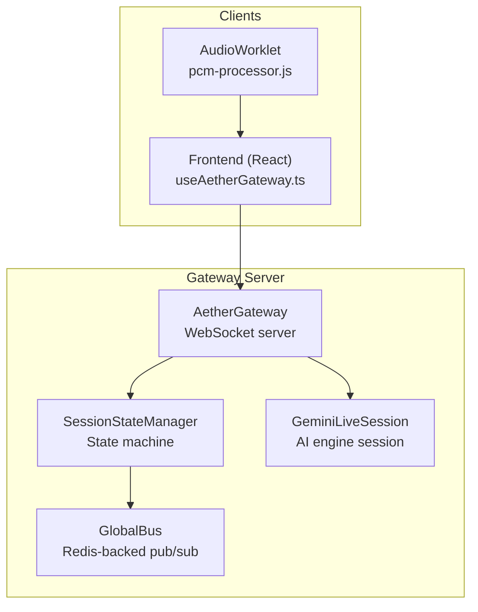
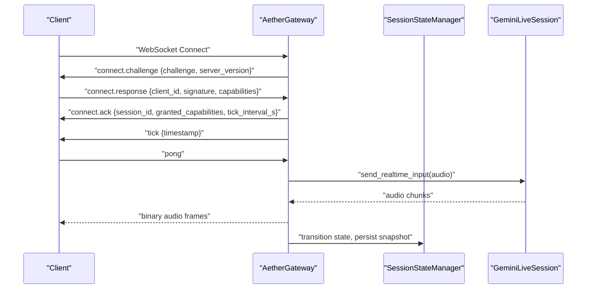
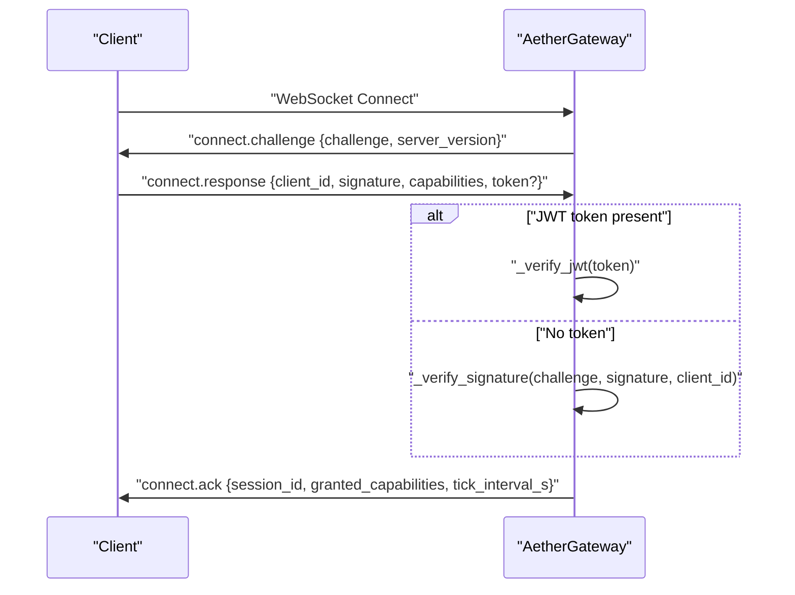
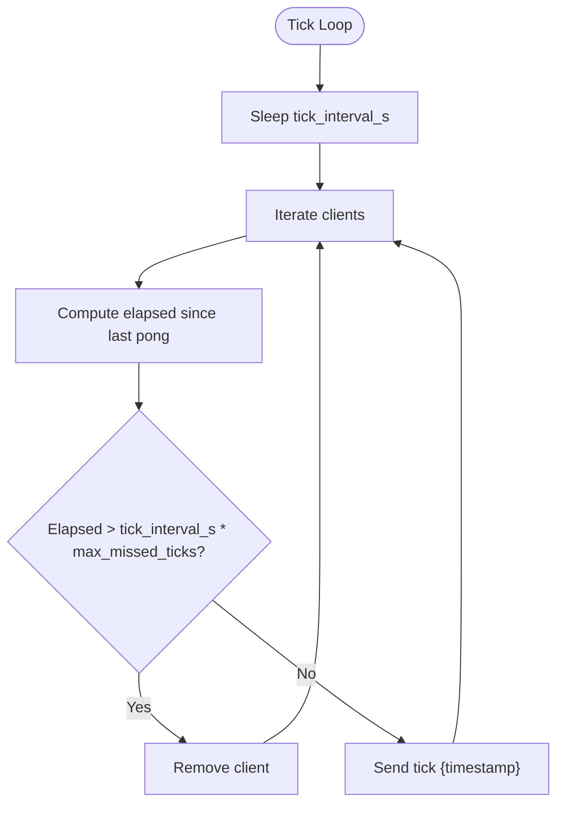
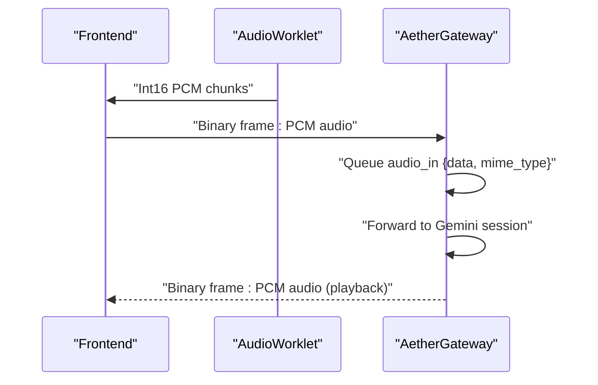
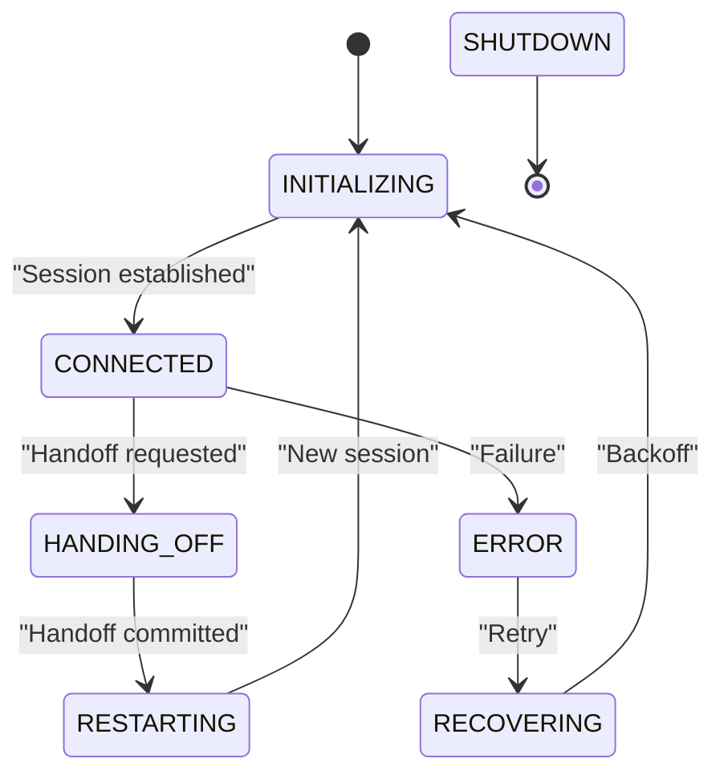
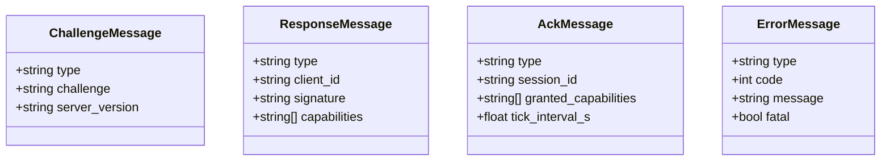
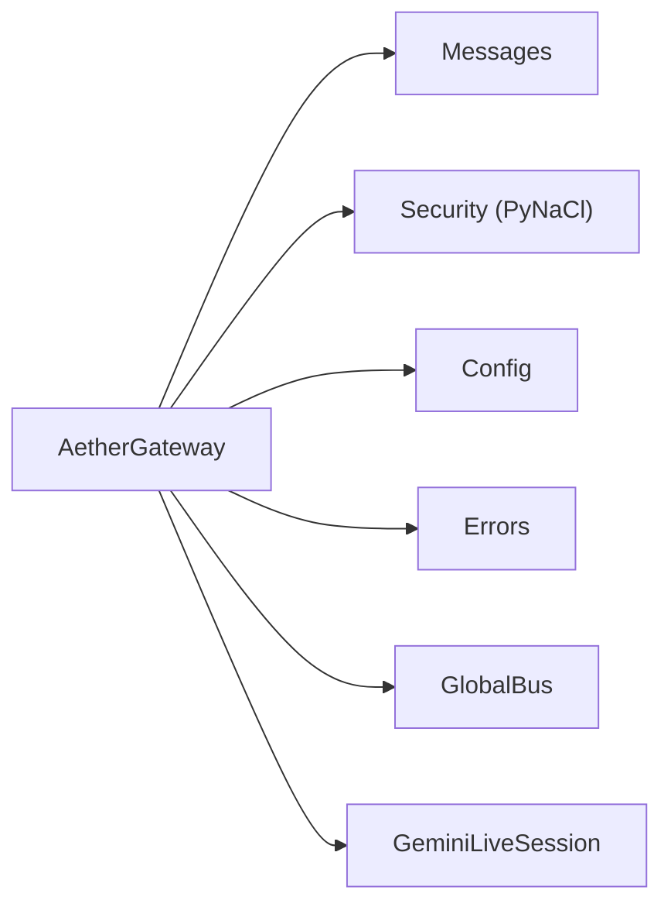

# WebSocket Gateway

<cite>
**Referenced Files in This Document**
- [gateway.py](file://core/infra/transport/gateway.py)
- [messages.py](file://core/infra/transport/messages.py)
- [session_state.py](file://core/infra/transport/session_state.py)
- [config.py](file://core/infra/config.py)
- [security.py](file://core/utils/security.py)
- [errors.py](file://core/utils/errors.py)
- [useAetherGateway.ts](file://apps/portal/src/hooks/useAetherGateway.ts)
- [pcm-processor.js](file://apps/portal/public/pcm-processor.js)
- [gateway_protocol.md](file://docs/gateway_protocol.md)
- [session.py](file://core/ai/session.py)
</cite>

## Table of Contents
1. [Introduction](#introduction)
2. [Project Structure](#project-structure)
3. [Core Components](#core-components)
4. [Architecture Overview](#architecture-overview)
5. [Detailed Component Analysis](#detailed-component-analysis)
6. [Dependency Analysis](#dependency-analysis)
7. [Performance Considerations](#performance-considerations)
8. [Troubleshooting Guide](#troubleshooting-guide)
9. [Conclusion](#conclusion)
10. [Appendices](#appendices)

## Introduction
This document specifies the WebSocket API for the Aether Voice OS gateway. It covers connection establishment, Ed25519 challenge-response authentication, optional JWT token verification, capability negotiation, heartbeat and tick mechanisms, and binary audio streaming. It also documents supported message types, audio chunk formats, interrupt handling for barge-in, session lifecycle management, timeouts, error codes, and security considerations.

## Project Structure
The gateway is implemented in Python using the websockets library and integrates with the AI session, tool router, and global bus for telemetry and state broadcasting. The client-side implementation is a React hook that connects to the gateway and handles audio streaming and events.

**Diagram sources**
- [gateway.py](file://core/infra/transport/gateway.py#L320-L352)
- [session_state.py](file://core/infra/transport/session_state.py#L71-L120)
- [useAetherGateway.ts](file://apps/portal/src/hooks/useAetherGateway.ts#L69-L120)
- [pcm-processor.js](file://apps/portal/public/pcm-processor.js#L18-L32)

**Section sources**
- [gateway.py](file://core/infra/transport/gateway.py#L320-L352)
- [session_state.py](file://core/infra/transport/session_state.py#L71-L120)
- [useAetherGateway.ts](file://apps/portal/src/hooks/useAetherGateway.ts#L69-L120)
- [pcm-processor.js](file://apps/portal/public/pcm-processor.js#L18-L32)

## Core Components
- AetherGateway: Accepts WebSocket connections, performs Ed25519 challenge-response authentication, negotiates capabilities, manages client sessions, routes binary audio, and sends periodic ticks. It also coordinates session lifecycle and broadcasts state changes.
- SessionStateManager: Centralized state machine for the Gemini Live session with atomic transitions, persistence, and health monitoring.
- Messages: Typed Pydantic models for gateway messages (connect.challenge, connect.response, connect.ack, tick, pong, audio.chunk, tool.call, ui.update, error).
- Config: Defines gateway timing parameters (heartbeat intervals, handshake timeout, receive sample rate), audio I/O settings, and AI model configuration.
- Security utilities: Ed25519 signature verification helpers.
- Client hook: React hook that establishes the WebSocket connection, signs the challenge, streams PCM audio, and handles events.

**Section sources**
- [gateway.py](file://core/infra/transport/gateway.py#L69-L153)
- [session_state.py](file://core/infra/transport/session_state.py#L25-L120)
- [messages.py](file://core/infra/transport/messages.py#L16-L80)
- [config.py](file://core/infra/config.py#L71-L83)
- [security.py](file://core/utils/security.py#L18-L56)
- [useAetherGateway.ts](file://apps/portal/src/hooks/useAetherGateway.ts#L69-L120)

## Architecture Overview
The gateway enforces a cryptographic handshake, grants capabilities, and maintains a heartbeat. Audio is streamed as binary PCM frames. The session state is centrally managed and broadcast to clients.

**Diagram sources**
- [gateway.py](file://core/infra/transport/gateway.py#L559-L617)
- [messages.py](file://core/infra/transport/messages.py#L47-L80)
- [session_state.py](file://core/infra/transport/session_state.py#L197-L271)
- [session.py](file://core/ai/session.py#L174-L200)

## Detailed Component Analysis

### Authentication and Capability Negotiation
- Challenge-response: The server sends a random 32-byte challenge encoded as hex. The client signs it with its Ed25519 private key and responds with client_id, signature, and requested capabilities.
- JWT fallback: If a token is present, the server verifies it using HS256 against a configured secret.
- Capability grant: The server acknowledges the connection with granted capabilities and tick interval.

**Diagram sources**
- [gateway.py](file://core/infra/transport/gateway.py#L559-L617)
- [messages.py](file://core/infra/transport/messages.py#L47-L80)
- [security.py](file://core/utils/security.py#L18-L56)

**Section sources**
- [gateway.py](file://core/infra/transport/gateway.py#L559-L617)
- [messages.py](file://core/infra/transport/messages.py#L47-L80)
- [security.py](file://core/utils/security.py#L18-L56)

### Heartbeat and Tick Mechanism
- The gateway periodically sends a tick message containing a timestamp. Clients must respond with pong to keep the connection alive.
- Dead client pruning: If a client fails to respond for a configured number of missed ticks, it is pruned.

**Diagram sources**
- [gateway.py](file://core/infra/transport/gateway.py#L704-L742)
- [config.py](file://core/infra/config.py#L71-L83)

**Section sources**
- [gateway.py](file://core/infra/transport/gateway.py#L704-L742)
- [config.py](file://core/infra/config.py#L71-L83)

### Binary Audio Streaming Protocol
- Format: Raw PCM audio as binary WebSocket frames.
- MIME type: audio/pcm;rate=<receive_sample_rate>.
- Chunking: Clients should send reasonably sized frames to balance overhead and latency. The gateway forwards audio to the AI session and broadcasts audio back to clients.
- Client-side encoder: An AudioWorklet encodes Float32 mono samples to Int16 PCM and emits chunks at ~256 ms intervals.

**Diagram sources**
- [gateway.py](file://core/infra/transport/gateway.py#L672-L685)
- [pcm-processor.js](file://apps/portal/public/pcm-processor.js#L18-L32)
- [config.py](file://core/infra/config.py#L11-L27)

**Section sources**
- [gateway.py](file://core/infra/transport/gateway.py#L672-L685)
- [pcm-processor.js](file://apps/portal/public/pcm-processor.js#L18-L32)
- [config.py](file://core/infra/config.py#L11-L27)

### Real-time Interaction Patterns
- Interrupt handling (barge-in): The gateway supports interrupting the current AI session, draining the output queue, and signaling the engine to drop subsequent audio.
- Session lifecycle: The gateway manages the Gemini Live session lifecycle, including initialization, connection, handoff, restart, and error recovery. State changes are broadcast to clients.

**Diagram sources**
- [session_state.py](file://core/infra/transport/session_state.py#L25-L42)
- [gateway.py](file://core/infra/transport/gateway.py#L353-L506)

**Section sources**
- [gateway.py](file://core/infra/transport/gateway.py#L206-L233)
- [session_state.py](file://core/infra/transport/session_state.py#L25-L42)

### Message Types and Formats
- connect.challenge: Challenge and server version.
- connect.response: client_id, signature, capabilities.
- connect.ack: session_id, granted_capabilities, tick_interval_s.
- tick: Periodic heartbeat with timestamp.
- pong: Client acknowledgment.
- audio.chunk: Binary PCM frames.
- tool.call: Tool invocation requests.
- ui.update: UI state updates.
- error: Error notifications with code and fatal flag.

**Diagram sources**
- [messages.py](file://core/infra/transport/messages.py#L47-L80)

**Section sources**
- [messages.py](file://core/infra/transport/messages.py#L16-L80)

### Connection Handling Procedures
- On connect: The gateway initiates the handshake and stores the client session. On successful authentication, it sends connect.ack and starts the tick loop.
- On message: JSON messages are routed by type; binary frames are queued as audio chunks.
- On disconnect: The gateway removes the client and closes the connection.

**Section sources**
- [gateway.py](file://core/infra/transport/gateway.py#L529-L558)
- [gateway.py](file://core/infra/transport/gateway.py#L686-L703)

### Error Handling and Timeouts
- Handshake timeout: If the client does not respond within the configured timeout, the connection is rejected.
- JWT verification: HS256 verification against a configured secret; failures lead to authentication errors.
- Signature verification: Supports registry-based public keys, ephemeral hex public keys, and a development fallback.
- Broadcast timeouts: Broadcasting to clients is guarded by a timeout to avoid blocking.

**Section sources**
- [gateway.py](file://core/infra/transport/gateway.py#L569-L580)
- [gateway.py](file://core/infra/transport/gateway.py#L619-L636)
- [errors.py](file://core/utils/errors.py#L65-L71)
- [gateway.py](file://core/infra/transport/gateway.py#L765-L775)

### Client Implementation Examples
- React hook: Establishes WS, signs challenge, streams PCM audio, and handles events. It measures latency using tick timestamps and updates UI telemetry.
- AudioWorklet: Encodes Float32 mono samples to Int16 PCM and emits ~256 ms chunks.

**Section sources**
- [useAetherGateway.ts](file://apps/portal/src/hooks/useAetherGateway.ts#L77-L120)
- [useAetherGateway.ts](file://apps/portal/src/hooks/useAetherGateway.ts#L268-L272)
- [pcm-processor.js](file://apps/portal/public/pcm-processor.js#L18-L32)

## Dependency Analysis
The gateway depends on:
- websockets for the WebSocket server and client handling.
- Pydantic for message schemas.
- PyNaCl for Ed25519 signature verification.
- Redis-backed GlobalBus for state persistence and event broadcasting.
- Gemini Live session for audio processing.

**Diagram sources**
- [gateway.py](file://core/infra/transport/gateway.py#L26-L46)
- [messages.py](file://core/infra/transport/messages.py#L13-L14)
- [security.py](file://core/utils/security.py#L10-L16)
- [config.py](file://core/infra/config.py#L7-L8)
- [errors.py](file://core/utils/errors.py#L10-L11)

**Section sources**
- [gateway.py](file://core/infra/transport/gateway.py#L26-L46)
- [messages.py](file://core/infra/transport/messages.py#L13-L14)
- [security.py](file://core/utils/security.py#L10-L16)
- [config.py](file://core/infra/config.py#L7-L8)
- [errors.py](file://core/utils/errors.py#L10-L11)

## Performance Considerations
- Heartbeat interval: Configure tick_interval_s to balance responsiveness and overhead.
- Queue sizing: Input and output audio queues are bounded to control latency and memory usage.
- Chunk size: Larger PCM chunks reduce framing overhead; the AudioWorklet emits ~256 ms chunks.
- Broadcast timeout: Broadcasting is guarded to prevent stalls.

**Section sources**
- [config.py](file://core/infra/config.py#L11-L27)
- [config.py](file://core/infra/config.py#L71-L83)
- [pcm-processor.js](file://apps/portal/public/pcm-processor.js#L21-L25)
- [gateway.py](file://core/infra/transport/gateway.py#L765-L775)

## Troubleshooting Guide
Common issues and resolutions:
- Authentication failures: Verify Ed25519 keypair generation and signature correctness. Ensure client_id matches the public key used for verification.
- JWT verification errors: Confirm AETHER_JWT_SECRET or GOOGLE_API_KEY is set and the token is signed with HS256.
- Handshake timeout: Increase handshake_timeout_s if clients are slow to respond; ensure network connectivity.
- Dead client pruning: Clients must send pong periodically; otherwise they will be removed after max_missed_ticks * tick_interval_s.
- Broadcast failures: Inspect broadcast timeout and connection closure exceptions.

**Section sources**
- [gateway.py](file://core/infra/transport/gateway.py#L569-L580)
- [gateway.py](file://core/infra/transport/gateway.py#L619-L636)
- [errors.py](file://core/utils/errors.py#L65-L71)
- [gateway.py](file://core/infra/transport/gateway.py#L718-L742)
- [gateway.py](file://core/infra/transport/gateway.py#L765-L775)

## Conclusion
The Aether Voice OS gateway provides a secure, low-latency WebSocket interface with cryptographic authentication, capability negotiation, heartbeat-driven connection management, and efficient binary audio streaming. Its centralized session state ensures robust lifecycle management and seamless handoffs between AI experts.

## Appendices

### Protocol Reference
- Host and port: See GatewayConfig.host and GatewayConfig.port.
- Handshake timeout: GatewayConfig.handshake_timeout_s.
- Tick interval: GatewayConfig.tick_interval_s.
- Max missed ticks: GatewayConfig.max_missed_ticks.
- Receive sample rate: GatewayConfig.receive_sample_rate.

**Section sources**
- [config.py](file://core/infra/config.py#L71-L83)

### Security Considerations
- Ed25519 signatures: Verified against registry-managed public keys, ephemeral hex keys, or a development fallback.
- JWT tokens: HS256 verification using configured secrets.
- Connection pruning: Dead clients are pruned to prevent resource exhaustion.

**Section sources**
- [gateway.py](file://core/infra/transport/gateway.py#L637-L670)
- [gateway.py](file://core/infra/transport/gateway.py#L718-L742)
- [security.py](file://core/utils/security.py#L18-L56)