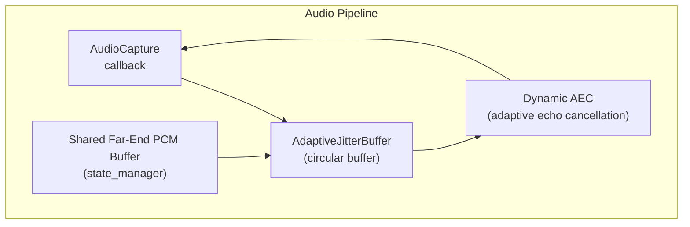
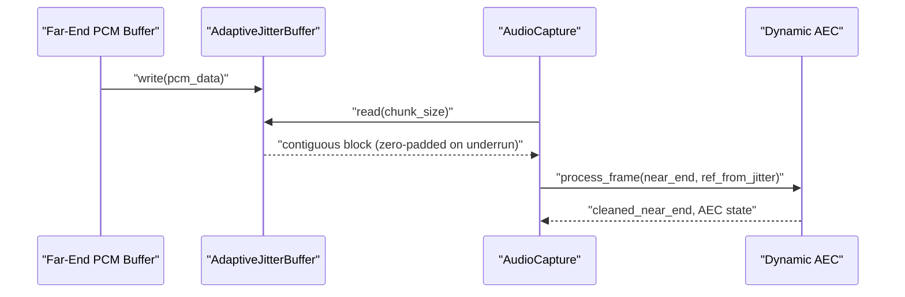
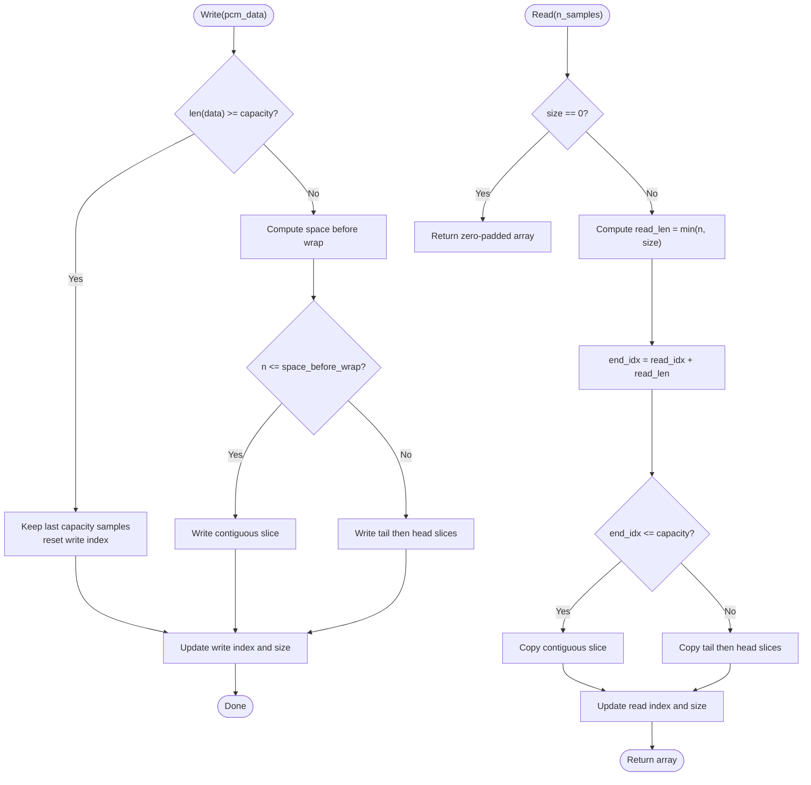
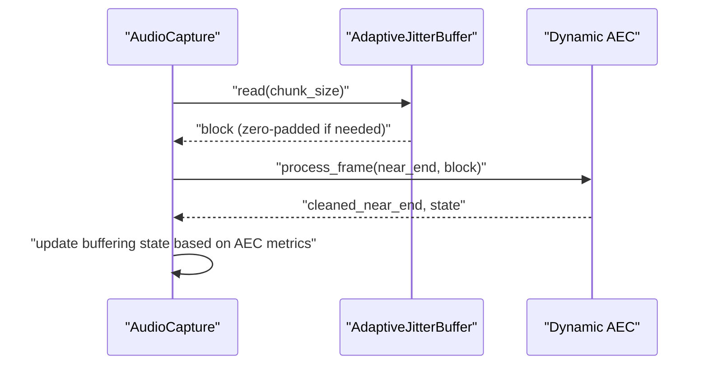

# Adaptive Jitter Buffer

<cite>
**Referenced Files in This Document**
- [jitter_buffer.py](file://core/audio/jitter_buffer.py)
- [capture.py](file://core/audio/capture.py)
- [dynamic_aec.py](file://core/audio/dynamic_aec.py)
- [processing.py](file://core/audio/processing.py)
- [cochlea.rs](file://cortex/src/cochlea.rs)
- [state_manager.py](file://core/audio/state_manager.py)
- [config.py](file://core/infra/config.py)
- [telemetry.py](file://core/audio/telemetry.py)
</cite>

## Table of Contents
1. [Introduction](#introduction)
2. [Project Structure](#project-structure)
3. [Core Components](#core-components)
4. [Architecture Overview](#architecture-overview)
5. [Detailed Component Analysis](#detailed-component-analysis)
6. [Dependency Analysis](#dependency-analysis)
7. [Performance Considerations](#performance-considerations)
8. [Troubleshooting Guide](#troubleshooting-guide)
9. [Conclusion](#conclusion)

## Introduction
This document explains the adaptive jitter buffer implementation used to stabilize far-end audio arrivals for Dynamic Acoustic Echo Cancellation (AEC). The jitter buffer smooths bursty network delivery and ensures a steady reference signal for AEC convergence. It features:
- A circular buffer with efficient write/read operations and wraparound handling
- Target and maximum latency configuration parameters balancing responsiveness and stability
- Zero-padding strategy for underrun conditions
- Contiguous block reading for deterministic AEC processing
- Integration with Dynamic AEC as the reference signal source
- Impact on echo cancellation convergence and latency metrics

## Project Structure
The adaptive jitter buffer lives in the audio capture pipeline and integrates with Dynamic AEC and shared far-end PCM buffers. The relevant modules are:
- AdaptiveJitterBuffer: circular buffer with contiguous block reads and underrun padding
- AudioCapture: orchestrates AEC processing and jitter buffer usage
- Dynamic AEC: consumes the jitter buffer’s reference signal for echo cancellation
- Shared PCM buffer: provides far-end PCM data for jitter buffer population
- Configuration: defines jitter buffer target and maximum latency defaults

**Diagram sources**
- [capture.py](file://core/audio/capture.py#L38-L104)
- [capture.py](file://core/audio/capture.py#L262-L267)
- [capture.py](file://core/audio/capture.py#L344-L351)
- [dynamic_aec.py](file://core/audio/dynamic_aec.py#L490-L779)
- [state_manager.py](file://core/audio/state_manager.py#L211-L240)

**Section sources**
- [capture.py](file://core/audio/capture.py#L38-L104)
- [capture.py](file://core/audio/capture.py#L262-L267)
- [capture.py](file://core/audio/capture.py#L344-L351)
- [dynamic_aec.py](file://core/audio/dynamic_aec.py#L490-L779)
- [state_manager.py](file://core/audio/state_manager.py#L211-L240)

## Core Components
- AdaptiveJitterBuffer
  - Maintains a circular buffer sized for maximum latency
  - Writes new far-end PCM data and reads contiguous blocks sized to the capture chunk
  - Zero-pads on underrun to avoid AEC instability
  - Tracks read/write indices and size for deterministic wraparound
- AudioCapture
  - Populates the jitter buffer from the shared far-end PCM buffer
  - Reads exactly one chunk size from the jitter buffer for AEC
  - Integrates Dynamic AEC and telemetry
- Dynamic AEC
  - Consumes the jitter buffer’s reference signal for echo cancellation
  - Computes ERLE and convergence metrics used by the jitter buffer’s buffering state
- Shared Far-End PCM Buffer
  - Provides continuous far-end PCM for jitter buffer population
- Configuration
  - Defines jitter buffer target and maximum latency defaults

**Section sources**
- [capture.py](file://core/audio/capture.py#L38-L104)
- [capture.py](file://core/audio/capture.py#L262-L267)
- [capture.py](file://core/audio/capture.py#L344-L351)
- [dynamic_aec.py](file://core/audio/dynamic_aec.py#L490-L779)
- [state_manager.py](file://core/audio/state_manager.py#L211-L240)
- [config.py](file://core/infra/config.py#L37-L39)

## Architecture Overview
The jitter buffer sits between the shared far-end PCM buffer and Dynamic AEC. It stabilizes the reference signal by:
- Smoothing bursty network arrivals
- Ensuring a constant chunk size for AEC processing
- Preventing underruns by zero-padding when insufficient data is available

**Diagram sources**
- [state_manager.py](file://core/audio/state_manager.py#L211-L240)
- [capture.py](file://core/audio/capture.py#L38-L104)
- [capture.py](file://core/audio/capture.py#L344-L351)
- [dynamic_aec.py](file://core/audio/dynamic_aec.py#L579-L668)

## Detailed Component Analysis

### AdaptiveJitterBuffer
- Purpose: Provide a stable, contiguous reference signal for AEC despite bursty far-end arrivals.
- Key behaviors:
  - Circular buffer with fixed maximum latency capacity
  - Write operation appends far-end PCM with wraparound
  - Read operation returns a contiguous block sized to the capture chunk, zero-padding when undersized
  - Underrun detection triggers buffering mode to rebuild depth before popping
- Data structures:
  - Single contiguous numpy array sized to maximum latency
  - Separate write and read indices with size tracking
- Complexity:
  - Write: O(n) for n samples written (amortized O(1) per sample due to contiguous memcpy)
  - Read: O(n) for n samples read (single contiguous memcpy plus optional zero-padding)
- Wraparound:
  - Both write and read support wraparound using modulo arithmetic
  - When size equals capacity, read index aligns with write index to maintain deterministic behavior

**Diagram sources**
- [capture.py](file://core/audio/capture.py#L58-L104)

**Section sources**
- [capture.py](file://core/audio/capture.py#L38-L104)

### Integration with Dynamic AEC
- AudioCapture reads exactly one chunk from the jitter buffer and passes it to Dynamic AEC alongside the near-end microphone signal.
- Dynamic AEC computes ERLE and convergence metrics; these inform the jitter buffer’s buffering state to avoid underruns during transient conditions.
- The jitter buffer’s zero-padding prevents AEC from receiving partial or malformed blocks, preserving convergence.

**Diagram sources**
- [capture.py](file://core/audio/capture.py#L344-L351)
- [dynamic_aec.py](file://core/audio/dynamic_aec.py#L579-L668)

**Section sources**
- [capture.py](file://core/audio/capture.py#L344-L351)
- [dynamic_aec.py](file://core/audio/dynamic_aec.py#L579-L668)

### Buffer Size Management and Index Tracking
- Capacity is configured via maximum latency in milliseconds; the buffer stores at most this many samples.
- Write index advances with wraparound; size tracks valid samples.
- When size reaches capacity, read index aligns with write index to maintain deterministic behavior and avoid undefined gaps.
- Read operations advance read index and reduce size accordingly.

**Section sources**
- [capture.py](file://core/audio/capture.py#L44-L82)

### Zero-Padding Strategy for Underrun Conditions
- When the jitter buffer does not contain sufficient samples, read returns a zero-padded block of the requested size.
- This prevents AEC from receiving partial data and maintains stable processing cadence.
- The buffering state transitions to “buffering” until nominal depth is restored.

**Section sources**
- [capture.py](file://core/audio/capture.py#L83-L104)

### Contiguous Block Reading Mechanism
- Read returns a contiguous numpy array sized to the capture chunk, ensuring AEC processing consistency.
- Internally, the buffer performs either a single contiguous copy or a split copy across the wrap boundary.

**Section sources**
- [capture.py](file://core/audio/capture.py#L83-L104)

### Target Latency and Maximum Latency Configuration
- Target latency determines the desired reference signal lag for AEC stability.
- Maximum latency bounds memory usage and prevents unbounded growth.
- Defaults are defined in configuration and applied during jitter buffer initialization.

**Section sources**
- [config.py](file://core/infra/config.py#L37-L39)
- [capture.py](file://core/audio/capture.py#L262-L267)

### Relationship to Other Circular Buffers
- The jitter buffer is conceptually similar to other circular buffers in the system:
  - RingBuffer (numpy-based) and CochlearBuffer (Rust-based) both provide O(1) writes and contiguous reads with wraparound.
  - These illustrate the design patterns used across the audio stack for low-latency, deterministic access.

**Section sources**
- [processing.py](file://core/audio/processing.py#L107-L202)
- [cochlea.rs](file://cortex/src/cochlea.rs#L17-L136)

## Dependency Analysis
- AdaptiveJitterBuffer depends on:
  - Shared far-end PCM buffer for input data
  - AudioCapture for chunk-aligned reads
  - Dynamic AEC for convergence feedback influencing buffering behavior
- Dynamic AEC depends on:
  - AdaptiveJitterBuffer for a stable reference signal
  - AudioCapture for integration into the callback pipeline

**Diagram sources**
- [state_manager.py](file://core/audio/state_manager.py#L211-L240)
- [capture.py](file://core/audio/capture.py#L38-L104)
- [capture.py](file://core/audio/capture.py#L344-L351)
- [dynamic_aec.py](file://core/audio/dynamic_aec.py#L579-L668)

**Section sources**
- [state_manager.py](file://core/audio/state_manager.py#L211-L240)
- [capture.py](file://core/audio/capture.py#L38-L104)
- [capture.py](file://core/audio/capture.py#L344-L351)
- [dynamic_aec.py](file://core/audio/dynamic_aec.py#L579-L668)

## Performance Considerations
- Memory usage
  - The buffer allocates a single contiguous numpy array sized to maximum latency in samples.
  - Memory scales linearly with maximum latency and sample rate.
- Throughput
  - Writes and reads are O(n) per chunk; for chunk-aligned operations, this is amortized O(1) per sample.
  - Zero-padding on underrun avoids costly re-sampling or interpolation.
- Stability vs. responsiveness
  - Lower target latency improves responsiveness but risks more frequent underruns.
  - Higher maximum latency increases resilience to bursty arrivals but adds perceived lag.
- AEC convergence
  - Stable reference signal from the jitter buffer improves ERLE and convergence speed.
  - Proper tuning reduces buffering churn and minimizes transient instability.

[No sources needed since this section provides general guidance]

## Troubleshooting Guide
- Symptoms: Choppy or distorted AEC output
  - Cause: Frequent underruns leading to heavy zero-padding
  - Action: Increase maximum latency or reduce network jitter
- Symptoms: Increased echo cancellation latency
  - Cause: Overly high target or maximum latency
  - Action: Reduce target latency to improve responsiveness
- Symptoms: AEC convergence stalls
  - Cause: Unstable reference signal due to excessive buffering
  - Action: Tune jitter buffer parameters and monitor ERLE metrics
- Monitoring
  - Use telemetry to track jitter and ERLE; adjust parameters based on observed trends

**Section sources**
- [telemetry.py](file://core/audio/telemetry.py#L147-L317)
- [telemetry.py](file://core/audio/telemetry.py#L314-L317)

## Conclusion
The adaptive jitter buffer provides a robust, deterministic reference signal for Dynamic AEC by smoothing bursty far-end arrivals and preventing underruns through zero-padding. Its circular buffer design, contiguous block reads, and configurable latency parameters enable stable echo cancellation while balancing responsiveness and memory usage. Proper tuning of target and maximum latency, combined with monitoring of AEC metrics, ensures reliable performance across varying network conditions.