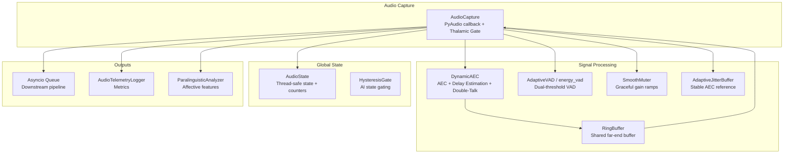
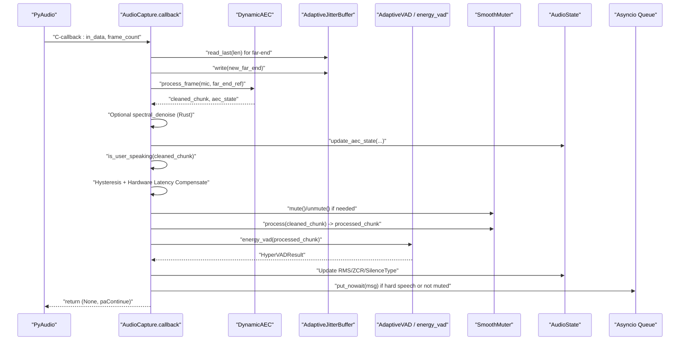
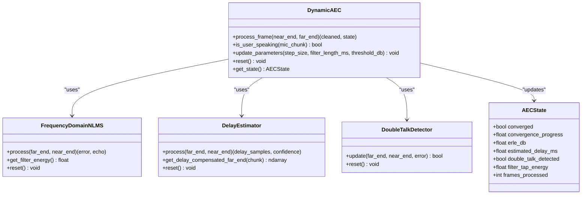
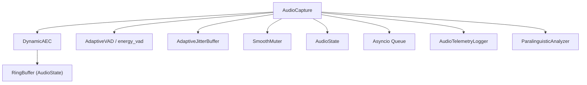

# Audio Capture Implementation

<cite>
**Referenced Files in This Document**
- [capture.py](file://core/audio/capture.py)
- [dynamic_aec.py](file://core/audio/dynamic_aec.py)
- [processing.py](file://core/audio/processing.py)
- [state.py](file://core/audio/state.py)
- [config.py](file://core/infra/config.py)
- [telemetry.py](file://core/audio/telemetry.py)
- [paralinguistics.py](file://core/audio/paralinguistics.py)
- [echo_guard.py](file://core/audio/echo_guard.py)
- [__init__.py](file://core/audio/cortex/__init__.py)
</cite>

## Table of Contents
1. [Introduction](#introduction)
2. [Project Structure](#project-structure)
3. [Core Components](#core-components)
4. [Architecture Overview](#architecture-overview)
5. [Detailed Component Analysis](#detailed-component-analysis)
6. [Dependency Analysis](#dependency-analysis)
7. [Performance Considerations](#performance-considerations)
8. [Troubleshooting Guide](#troubleshooting-guide)
9. [Conclusion](#conclusion)

## Introduction
This document explains the audio capture implementation centered on a PyAudio-based microphone capture system with high-performance C-callbacks and a direct asyncio queue injection architecture. It details the Thalamic Gate callback that analyzes energy and gates microphone input based on AI state and echo detection, the zero-latency direct injection pattern that bypasses intermediate queues, and the callback’s roles in AEC processing, VAD analysis, and audio state updates. It also covers hardware latency compensation, echo fade-out/grace period calculations, queue overflow handling with message dropping strategies, configuration options for sample rates, chunk sizes, and channel configurations, and troubleshooting guidance for callback-related issues, buffer underruns, and performance optimization.

## Project Structure
The audio capture system spans several modules:
- Capture: PyAudio callback, Thalamic Gate logic, queue injection, and state updates
- Dynamic AEC: Adaptive echo cancellation with delay estimation, NLMS filtering, and double-talk detection
- Processing: VAD engines, ring buffers, and utility functions
- State: Thread-safe global audio state and hysteresis gate
- Config: Audio configuration with tunable parameters
- Telemetry: Performance metrics collection and reporting
- Paralinguistics: Affective computing features extraction
- Cortex: Optional Rust acceleration for DSP primitives
- Echo Guard: Alternative acoustic identity-based echo gating

**Diagram sources**
- [capture.py](file://core/audio/capture.py#L193-L575)
- [dynamic_aec.py](file://core/audio/dynamic_aec.py#L490-L855)
- [processing.py](file://core/audio/processing.py#L107-L508)
- [state.py](file://core/audio/state.py#L36-L129)
- [telemetry.py](file://core/audio/telemetry.py#L151-L394)
- [paralinguistics.py](file://core/audio/paralinguistics.py#L31-L214)

**Section sources**
- [capture.py](file://core/audio/capture.py#L1-L575)
- [dynamic_aec.py](file://core/audio/dynamic_aec.py#L1-L855)
- [processing.py](file://core/audio/processing.py#L1-L508)
- [state.py](file://core/audio/state.py#L1-L129)
- [config.py](file://core/infra/config.py#L11-L44)
- [telemetry.py](file://core/audio/telemetry.py#L1-L441)
- [paralinguistics.py](file://core/audio/paralinguistics.py#L1-L214)
- [echo_guard.py](file://core/audio/echo_guard.py#L1-L98)
- [__init__.py](file://core/audio/cortex/__init__.py#L1-L133)

## Core Components
- AudioCapture: Manages PyAudio stream, runs the Thalamic Gate callback, performs AEC, VAD, and state updates, and injects PCM into an asyncio queue with bounded latency.
- DynamicAEC: Implements adaptive echo cancellation with GCC-PHAT delay estimation, frequency-domain NLMS filtering, double-talk detection, and ERLE computation.
- AdaptiveVAD and energy_vad: Dual-threshold voice activity detection with adaptive thresholds and multi-feature scoring.
- HysteresisGate: Prevents rapid toggling of the mute decision using hysteresis.
- SmoothMuter: Applies smooth gain ramps to avoid pops/clicks.
- AdaptiveJitterBuffer: Stabilizes far-end reference for AEC by smoothing bursty arrivals.
- AudioState: Thread-safe singleton for global audio state and counters.
- AudioTelemetryLogger: Captures per-frame latency, AEC performance, and VAD metrics.
- ParalinguisticAnalyzer: Extracts affective features for backchannel and engagement.
- Cortex acceleration: Optional Rust-backed primitives for VAD, zero-crossing, and spectral denoise.

**Section sources**
- [capture.py](file://core/audio/capture.py#L193-L575)
- [dynamic_aec.py](file://core/audio/dynamic_aec.py#L490-L855)
- [processing.py](file://core/audio/processing.py#L256-L508)
- [state.py](file://core/audio/state.py#L13-L129)
- [telemetry.py](file://core/audio/telemetry.py#L151-L394)
- [paralinguistics.py](file://core/audio/paralinguistics.py#L31-L214)
- [__init__.py](file://core/audio/cortex/__init__.py#L1-L133)

## Architecture Overview
The capture system operates in a zero-latency callback-driven pipeline:
- PyAudio invokes the callback with PCM chunks at a fixed sample rate and chunk size.
- Inside the callback, the system:
  - Reads the far-end (AI output) reference from a shared ring buffer and writes new far-end data into an adaptive jitter buffer.
  - Performs AEC on the microphone chunk using the aligned far-end reference.
  - Optionally applies Rust-accelerated spectral denoise.
  - Updates AEC state globally and records telemetry.
  - Determines user speech using DynamicAEC heuristics and VAD decisions.
  - Applies hysteresis and hardware latency compensation to decide muting.
  - Smoothly ramps gain and runs VAD again if needed.
  - Updates global audio state (RMS, ZCR, silence type).
  - Injects PCM into the asyncio queue only when hard speech is detected or when AI is silent (ambient feed).
  - Optionally emits affective features and periodic telemetry.

**Diagram sources**
- [capture.py](file://core/audio/capture.py#L329-L509)
- [dynamic_aec.py](file://core/audio/dynamic_aec.py#L579-L668)
- [processing.py](file://core/audio/processing.py#L389-L508)
- [state.py](file://core/audio/state.py#L76-L125)

**Section sources**
- [capture.py](file://core/audio/capture.py#L329-L509)
- [dynamic_aec.py](file://core/audio/dynamic_aec.py#L579-L668)
- [processing.py](file://core/audio/processing.py#L389-L508)
- [state.py](file://core/audio/state.py#L76-L125)

## Detailed Component Analysis

### AudioCapture: PyAudio Callback and Thalamic Gate
- Initializes PyAudio stream with configurable sample rate, channels, and chunk size.
- Implements a high-priority callback that:
  - Converts incoming bytes to int16 PCM.
  - Reads far-end reference from the shared ring buffer and writes new far-end into an adaptive jitter buffer.
  - Calls DynamicAEC to produce a cleaned chunk and updates global AEC state.
  - Optionally applies Rust-accelerated spectral denoise.
  - Uses DynamicAEC heuristics to determine if user is speaking.
  - Applies hysteresis on AI playback state and hardware latency compensation (mute/unmute grace).
  - Smoothly mutes/unmutes to avoid audio clicks.
  - Runs VAD and updates global state (RMS, ZCR, silence type).
  - Emits periodic telemetry and optionally affective features.
  - Injects PCM into the asyncio queue only when hard speech is detected or when not muted (ambient feed).
- Provides zero-latency injection by calling the event loop directly from the callback using thread-safe mechanisms.

Key behaviors:
- Hardware latency compensation: Maintains counters for mute/unmute delays derived from configured sample rate and approximate hardware latency.
- Queue overflow handling: On overflow, drops the oldest message to keep latency bounded, then retries insertion.

**Section sources**
- [capture.py](file://core/audio/capture.py#L193-L575)
- [state.py](file://core/audio/state.py#L36-L129)

### DynamicAEC: Adaptive Echo Cancellation
- Frequency-domain NLMS filter with overlap-save processing.
- GCC-PHAT delay estimation with smoothing and periodic updates.
- Double-talk detection via spectral coherence and energy ratios with hangover.
- ERLE computation and convergence tracking.
- Heuristic to distinguish user speech vs echo during warm-up using far-end/mic energy coherence.
- Parameter tuning at runtime (step size, filter length, convergence threshold).

**Diagram sources**
- [dynamic_aec.py](file://core/audio/dynamic_aec.py#L490-L855)

**Section sources**
- [dynamic_aec.py](file://core/audio/dynamic_aec.py#L490-L855)

### VAD Engines and Silence Classification
- AdaptiveVAD: Tracks mean and standard deviation of RMS energy over a window to compute soft/hard thresholds.
- energy_vad: Multi-feature VAD combining RMS, ZCR, and spectral centroid; dispatches to Rust-accelerated implementation when available.
- SilentAnalyzer: Classifies silence into void, breathing, or thinking based on RMS variance and ZCR.

**Section sources**
- [processing.py](file://core/audio/processing.py#L256-L508)
- [state.py](file://core/audio/state.py#L36-L129)

### Global Audio State and Hysteresis Gate
- AudioState: Thread-safe singleton storing playback state, transition flags, AEC metrics, and telemetry counters. Includes a shared far-end ring buffer for AEC reference.
- HysteresisGate: Prevents rapid toggling of mute decisions by maintaining confidence and applying thresholding.

**Section sources**
- [state.py](file://core/audio/state.py#L36-L129)

### Smooth Muter and Adaptive Jitter Buffer
- SmoothMuter: Applies graceful gain ramps to avoid pops/clicks with minimal allocations and deterministic ramp landing.
- AdaptiveJitterBuffer: Circular buffer that smooths bursty far-end arrivals to provide a stable AEC reference.

**Section sources**
- [capture.py](file://core/audio/capture.py#L38-L197)

### Telemetry and Affective Features
- AudioTelemetryLogger: Records per-frame latency, AEC performance, VAD outcomes, and publishes metrics to the event bus; supports session summaries and CSV logs.
- ParalinguisticAnalyzer: Extracts pitch, speech rate, RMS variance, spectral centroid, and engagement score; detects “Zen mode” typing cadence.

**Section sources**
- [telemetry.py](file://core/audio/telemetry.py#L151-L394)
- [paralinguistics.py](file://core/audio/paralinguistics.py#L31-L214)

### Cortex Acceleration
- Optional Rust-backed primitives for VAD, zero-crossing detection, and spectral denoise; falls back to NumPy when unavailable.

**Section sources**
- [__init__.py](file://core/audio/cortex/__init__.py#L1-L133)

### Echo Guard (Alternative Gate)
- EchoGuard: Spectral identity-based echo gating using cached MFCC-like fingerprints and cosine similarity to suppress echo during AI playback.

**Section sources**
- [echo_guard.py](file://core/audio/echo_guard.py#L14-L98)

## Dependency Analysis
The capture system exhibits tight coupling between the callback and processing modules, with loose coupling to external telemetry and affective analyzers. The design minimizes cross-thread contention by keeping heavy processing in the callback and injecting results via the event loop.

**Diagram sources**
- [capture.py](file://core/audio/capture.py#L193-L575)
- [dynamic_aec.py](file://core/audio/dynamic_aec.py#L490-L855)
- [processing.py](file://core/audio/processing.py#L256-L508)
- [state.py](file://core/audio/state.py#L36-L129)
- [telemetry.py](file://core/audio/telemetry.py#L151-L394)
- [paralinguistics.py](file://core/audio/paralinguistics.py#L31-L214)

**Section sources**
- [capture.py](file://core/audio/capture.py#L193-L575)
- [dynamic_aec.py](file://core/audio/dynamic_aec.py#L490-L855)
- [processing.py](file://core/audio/processing.py#L256-L508)
- [state.py](file://core/audio/state.py#L36-L129)
- [telemetry.py](file://core/audio/telemetry.py#L151-L394)
- [paralinguistics.py](file://core/audio/paralinguistics.py#L31-L214)

## Performance Considerations
- Zero-latency injection: Direct event-loop injection avoids thread-hopping latency by calling the loop from the callback thread.
- Bounded latency: Queue overflow handling drops the oldest message to maintain bounded latency.
- Efficient buffers: Preallocated ring buffers and jitter buffers eliminate per-frame allocations and reduce GC pressure.
- Rust acceleration: Optional DSP primitives provide significant speedups when available.
- Tunable parameters: Chunk size, sample rates, and AEC parameters can be tuned for latency and quality trade-offs.

[No sources needed since this section provides general guidance]

## Troubleshooting Guide
Common issues and remedies:
- Callback-related problems:
  - Verify PyAudio device availability and indices; ensure the default input device exists.
  - Confirm chunk size and sample rate match configuration.
  - Ensure the event loop remains alive and not closed when injecting into the queue.
- Buffer underruns:
  - Reduce chunk size or increase CPU priority to avoid callback starvation.
  - Monitor queue drops via telemetry counters and adjust upstream processing to reduce backlog.
- Performance bottlenecks:
  - Enable Rust acceleration if available.
  - Tune AEC parameters (step size, filter length) for convergence and stability.
  - Adjust jitter buffer target and max latency to stabilize AEC reference.
- Latency spikes:
  - Inspect telemetry logs for high AEC or VAD latencies.
  - Increase hardware latency compensation margins if echo fade-out appears too aggressive.
- Queue overflow:
  - Accept message drops as designed; monitor capture_queue_drops counter.
  - Reduce downstream processing load or increase queue capacity cautiously.

**Section sources**
- [capture.py](file://core/audio/capture.py#L511-L575)
- [telemetry.py](file://core/audio/telemetry.py#L151-L394)
- [state.py](file://core/audio/state.py#L59-L65)

## Conclusion
The audio capture implementation achieves sub-200ms latency through a tightly integrated PyAudio callback, Rust-accelerated DSP, and zero-latency asyncio injection. The Thalamic Gate callback performs AEC, VAD, and audio state updates in lockstep with hardware latency compensation and smooth gating to prevent echo leakage and barge-in. Robust telemetry and queue overflow handling ensure predictable performance under load, while configuration options allow tuning for diverse environments.