# Audio Capture and Playback Management

<cite>
**Referenced Files in This Document**
- [capture.py](file://core/audio/capture.py)
- [playback.py](file://core/audio/playback.py)
- [state.py](file://core/audio/state.py)
- [processing.py](file://core/audio/processing.py)
- [jitter_buffer.py](file://core/audio/jitter_buffer.py)
- [dynamic_aec.py](file://core/audio/dynamic_aec.py)
- [echo_guard.py](file://core/audio/echo_guard.py)
- [telemetry.py](file://core/audio/telemetry.py)
- [config.py](file://core/infra/config.py)
- [state_manager.py](file://core/audio/state_manager.py)
- [vad.py](file://core/audio/vad.py)
- [spectral.py](file://core/audio/spectral.py)
- [paralinguistics.py](file://core/audio/paralinguistics.py)
</cite>

## Table of Contents
1. [Introduction](#introduction)
2. [Project Structure](#project-structure)
3. [Core Components](#core-components)
4. [Architecture Overview](#architecture-overview)
5. [Detailed Component Analysis](#detailed-component-analysis)
6. [Dependency Analysis](#dependency-analysis)
7. [Performance Considerations](#performance-considerations)
8. [Troubleshooting Guide](#troubleshooting-guide)
9. [Conclusion](#conclusion)
10. [Appendices](#appendices)

## Introduction
This document explains the audio capture and playback management system built on PyAudio with high-performance C-callbacks and direct asyncio queue injection to minimize thread-hopping latency. It covers:
- Microphone capture with a “Thalamic Gate” AEC layer
- Smooth muting with graceful gain ramps to prevent audio pops/clicks
- Adaptive jitter buffer for handling bursty far-end arrivals
- Hardware latency compensation and echo fade-out calculations
- Device management with automatic detection and error recovery
- Audio state management with shared state variables, threading safety, and real-time telemetry
- Configuration options for devices, quality, and latency targets
- Troubleshooting for common audio device issues and performance optimization

## Project Structure
The audio subsystem is organized by responsibility:
- Capture and playback orchestration
- Signal processing utilities (VAD, ring buffers, spectral analysis)
- AEC and echo suppression
- Telemetry and diagnostics
- Configuration and state management

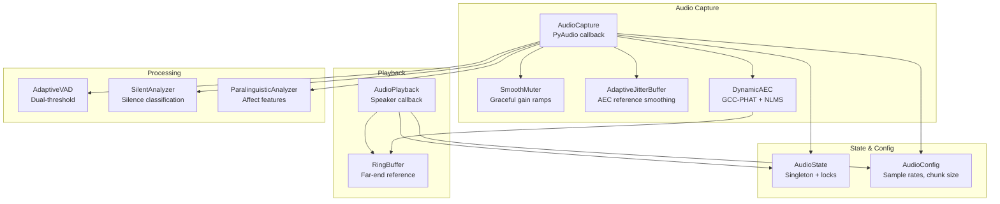

**Diagram sources**
- [capture.py](file://core/audio/capture.py#L193-L550)
- [playback.py](file://core/audio/playback.py#L27-L204)
- [state.py](file://core/audio/state.py#L36-L129)
- [processing.py](file://core/audio/processing.py#L256-L508)
- [dynamic_aec.py](file://core/audio/dynamic_aec.py#L448-L776)
- [jitter_buffer.py](file://core/audio/jitter_buffer.py#L13-L63)
- [config.py](file://core/infra/config.py#L11-L27)

**Section sources**
- [capture.py](file://core/audio/capture.py#L1-L550)
- [playback.py](file://core/audio/playback.py#L1-L204)
- [state.py](file://core/audio/state.py#L1-L129)
- [processing.py](file://core/audio/processing.py#L1-L508)
- [dynamic_aec.py](file://core/audio/dynamic_aec.py#L1-L776)
- [jitter_buffer.py](file://core/audio/jitter_buffer.py#L1-L63)
- [config.py](file://core/infra/config.py#L1-L158)

## Core Components
- AudioCapture: PyAudio microphone capture with C-callback, AEC, VAD, and direct asyncio injection
- AudioPlayback: Speaker output via callback, with gain ducking and heartbeat mixing
- DynamicAEC: Adaptive echo cancellation with GCC-PHAT delay estimation, NLMS filtering, double-talk detection, ERLE
- SmoothMuter: Graceful gain ramps to avoid pops/clicks
- AdaptiveJitterBuffer: Circular buffer to smooth bursty far-end arrivals for AEC
- AudioState: Thread-safe singleton for shared audio state and far-end PCM ring buffer
- Processing utilities: RingBuffer, AdaptiveVAD, SilentAnalyzer, paralinguistic analysis
- Telemetry: Frame-level metrics logger and periodic paralinguistic analysis
- Configuration: AudioConfig for sample rates, chunk size, and device indices

**Section sources**
- [capture.py](file://core/audio/capture.py#L193-L550)
- [playback.py](file://core/audio/playback.py#L27-L204)
- [dynamic_aec.py](file://core/audio/dynamic_aec.py#L448-L776)
- [processing.py](file://core/audio/processing.py#L107-L508)
- [state.py](file://core/audio/state.py#L36-L129)
- [telemetry.py](file://core/audio/telemetry.py#L151-L441)
- [config.py](file://core/infra/config.py#L11-L27)

## Architecture Overview
The system runs a PyAudio input stream in a C-callback that:
1. Reads far-end reference from a shared ring buffer
2. Applies AEC and optional Rust-accelerated spectral denoise
3. Computes VAD and silence classification
4. Applies smooth muting based on AI playback state and user speech detection
5. Injects processed PCM directly into an asyncio queue for downstream processing

On the playback side, a separate PyAudio output stream in a C-callback:
1. Pulls PCM from a bounded queue
2. Applies gain ducking and optional heartbeat mixing
3. Writes 16 kHz reference PCM into the shared ring buffer for AEC

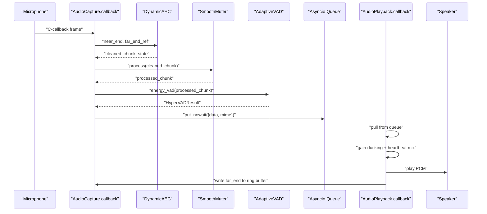

**Diagram sources**
- [capture.py](file://core/audio/capture.py#L304-L484)
- [playback.py](file://core/audio/playback.py#L61-L99)
- [dynamic_aec.py](file://core/audio/dynamic_aec.py#L537-L626)
- [processing.py](file://core/audio/processing.py#L389-L507)
- [state.py](file://core/audio/state.py#L76-L99)

## Detailed Component Analysis

### AudioCapture: PyAudio Microphone Capture with Thalamic Gate
- Initializes PyAudio, selects default input device, and opens a callback stream
- In the callback:
  - Reads far-end reference from shared ring buffer and writes new far-end to jitter buffer
  - Runs AEC and optional Rust-accelerated spectral denoise
  - Updates AEC state for monitoring
  - Determines user speech using AEC heuristics
  - Applies hardware latency compensation and echo fade-out grace period
  - Smoothly mutes/unmutes to avoid pops/clicks
  - Runs VAD and updates shared state (RMS, ZCR, silence type)
  - Emits telemetry and optionally paralinguistic features
  - Injects PCM into asyncio queue for downstream processing

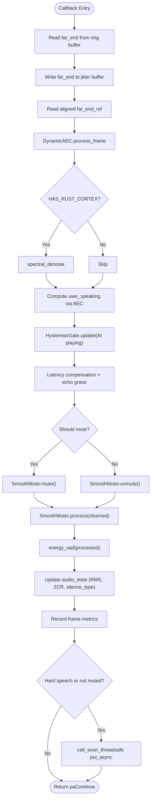

**Diagram sources**
- [capture.py](file://core/audio/capture.py#L304-L484)
- [dynamic_aec.py](file://core/audio/dynamic_aec.py#L537-L732)
- [processing.py](file://core/audio/processing.py#L389-L507)
- [state.py](file://core/audio/state.py#L76-L99)

**Section sources**
- [capture.py](file://core/audio/capture.py#L193-L550)

### AudioPlayback: Speaker Output with Callback and Gain Ducking
- Opens a PyAudio output stream in callback mode
- Feeds PCM from an asyncio queue into a bounded thread-safe queue
- In the callback:
  - Pulls PCM from the bounded queue, sets playback state
  - Applies linear gain ducking and optional heartbeat mixing
  - Writes 16 kHz reference PCM into the shared ring buffer for AEC
  - Returns silence when queue is empty
- Provides instant interruption by draining both queues

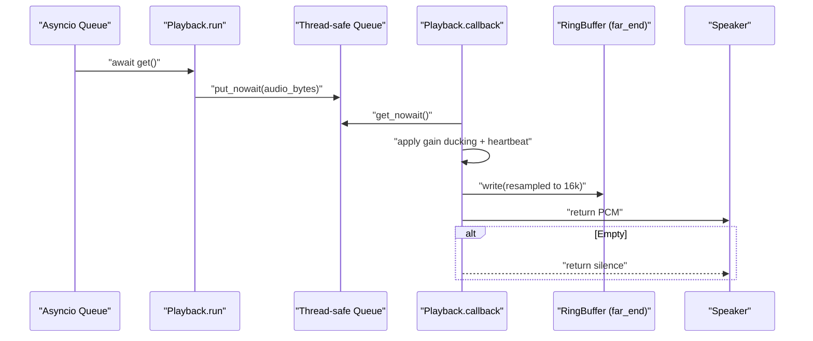

**Diagram sources**
- [playback.py](file://core/audio/playback.py#L101-L204)
- [state.py](file://core/audio/state.py#L72-L73)

**Section sources**
- [playback.py](file://core/audio/playback.py#L27-L204)

### DynamicAEC: Adaptive Echo Cancellation
- Frequency-domain NLMS filter with overlap-save
- GCC-PHAT delay estimation with smoothing
- Double-talk detection via spectral coherence and energy ratios
- ERLE computation and convergence tracking
- Warm-up heuristic to distinguish echo from user speech before convergence

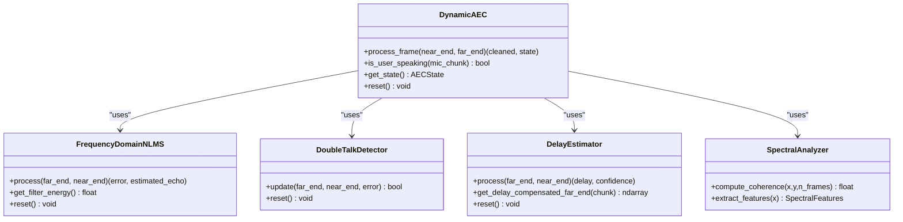

**Diagram sources**
- [dynamic_aec.py](file://core/audio/dynamic_aec.py#L448-L776)
- [spectral.py](file://core/audio/spectral.py#L250-L384)

**Section sources**
- [dynamic_aec.py](file://core/audio/dynamic_aec.py#L1-L776)
- [spectral.py](file://core/audio/spectral.py#L1-L501)

### SmoothMuter: Graceful Gain Ramps
- Maintains current and target gain
- Applies linear ramps over a fixed number of samples
- Ensures continuous amplitude at chunk boundaries to avoid pops/clicks
- Supports immediate mute/unmute transitions

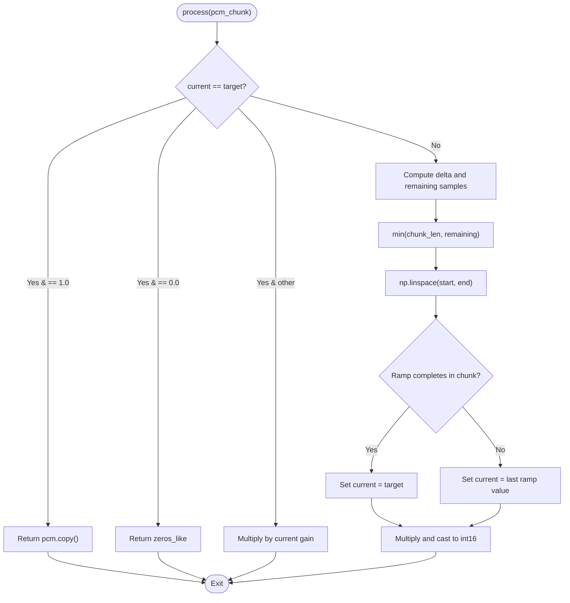

**Diagram sources**
- [capture.py](file://core/audio/capture.py#L106-L191)

**Section sources**
- [capture.py](file://core/audio/capture.py#L106-L191)

### AdaptiveJitterBuffer: Bursty Arrival Smoothing
- Circular buffer with write/read indices and size tracking
- Writes new far-end data, wraps around when needed
- Reads contiguous blocks with zero-padding on underrun
- Maintains target and max latency windows to stabilize AEC reference

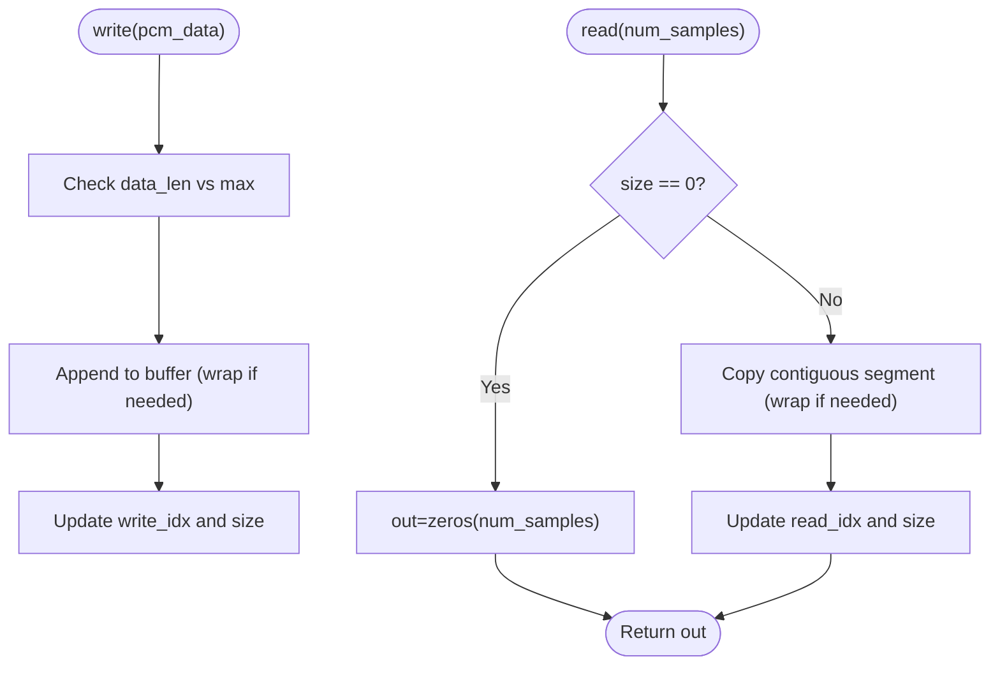

**Diagram sources**
- [capture.py](file://core/audio/capture.py#L38-L104)

**Section sources**
- [capture.py](file://core/audio/capture.py#L38-L104)

### AudioState: Thread-Safe Shared State
- Singleton with locks protecting AEC state and playback flags
- Atomic updates for AEC convergence, ERLE, delay, and double-talk
- Far-end PCM ring buffer for AEC reference
- Transition flags for playback start/stop

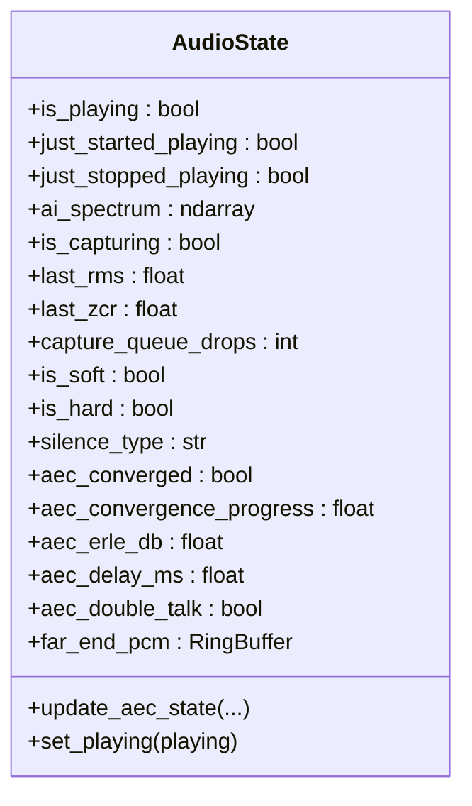

**Diagram sources**
- [state.py](file://core/audio/state.py#L36-L129)

**Section sources**
- [state.py](file://core/audio/state.py#L1-L129)

### Processing Utilities: VAD, RingBuffer, SilentAnalyzer
- RingBuffer: O(1) writes and O(n) reads via contiguous copies
- AdaptiveVAD: Tracks noise statistics and computes soft/hard thresholds
- SilentAnalyzer: Classifies silence types using RMS and ZCR
- Enhanced VAD combines RMS, ZCR, and spectral centroid

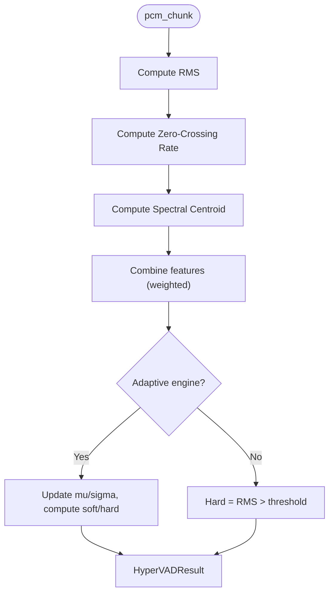

**Diagram sources**
- [processing.py](file://core/audio/processing.py#L437-L507)

**Section sources**
- [processing.py](file://core/audio/processing.py#L107-L508)

### Telemetry: Frame Metrics and Paralinguistics
- AudioTelemetryLogger: Records per-frame latency, AEC ERLE, convergence, VAD decisions, and publishes to event bus
- Periodic paralinguistic analysis (volume, pitch, spectral centroid) for HUD visualization

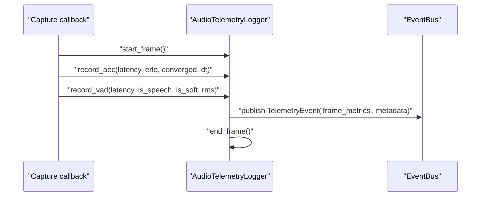

**Diagram sources**
- [telemetry.py](file://core/audio/telemetry.py#L151-L394)
- [capture.py](file://core/audio/capture.py#L350-L482)

**Section sources**
- [telemetry.py](file://core/audio/telemetry.py#L1-L441)

### Configuration Options
- AudioConfig controls sample rates, channels, chunk size, and device indices
- Playback uses 24 kHz output sample rate; capture uses 16 kHz input sample rate
- Chunk size balances latency and CPU usage

**Section sources**
- [config.py](file://core/infra/config.py#L11-L27)

## Dependency Analysis
Key dependencies and coupling:
- AudioCapture depends on DynamicAEC, SmoothMuter, AdaptiveVAD, SilentAnalyzer, and AudioState
- AudioPlayback depends on AudioState’s ring buffer and AudioConfig
- DynamicAEC depends on SpectralAnalyzer and GCC-PHAT for delay estimation
- Telemetry integrates with the event bus and captures metrics from capture/playback stages

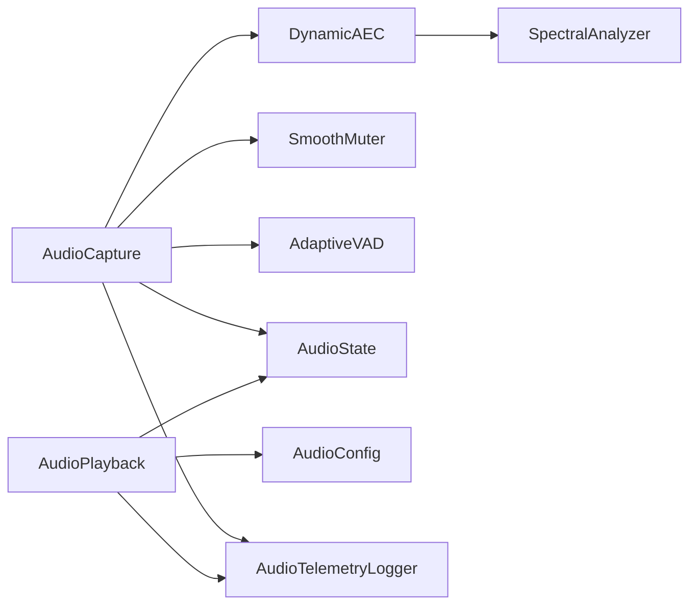

**Diagram sources**
- [capture.py](file://core/audio/capture.py#L193-L550)
- [playback.py](file://core/audio/playback.py#L27-L204)
- [dynamic_aec.py](file://core/audio/dynamic_aec.py#L448-L776)
- [spectral.py](file://core/audio/spectral.py#L250-L384)
- [telemetry.py](file://core/audio/telemetry.py#L151-L394)

**Section sources**
- [capture.py](file://core/audio/capture.py#L193-L550)
- [playback.py](file://core/audio/playback.py#L27-L204)
- [dynamic_aec.py](file://core/audio/dynamic_aec.py#L448-L776)
- [spectral.py](file://core/audio/spectral.py#L1-L501)
- [telemetry.py](file://core/audio/telemetry.py#L1-L441)

## Performance Considerations
- Zero-latency injection: Direct asyncio queue injection from the PyAudio callback avoids thread-hopping overhead
- Minimal allocations: SmoothMuter avoids aliasing by returning new arrays and uses linear ramps
- Efficient buffers: RingBuffer and BoundedBuffer avoid reallocations and reduce GC pressure
- Rust acceleration: Optional aether-cortex backend accelerates spectral denoise and VAD
- Adaptive jitter buffer: Stabilizes AEC reference to prevent convergence loss under bursty arrivals
- Concurrency: AudioState uses locks to protect shared state; playback uses a dedicated lock for transition flags

[No sources needed since this section provides general guidance]

## Troubleshooting Guide
Common issues and resolutions:
- No default input device found
  - Symptom: Initialization raises device not found error
  - Action: Verify microphone permissions and device availability; inspect available devices and select via configuration
  - Section sources
    - [capture.py](file://core/audio/capture.py#L486-L516)
    - [config.py](file://core/infra/config.py#L11-L27)

- No default output device found
  - Symptom: Playback initialization fails
  - Action: Check speaker permissions and device list; ensure a valid output device index is configured
  - Section sources
    - [playback.py](file://core/audio/playback.py#L101-L128)

- Audio queue drops
  - Symptom: Capture queue drops increment; upstream processing cannot keep up
  - Action: Reduce latency targets or increase queue sizes; investigate downstream bottlenecks
  - Section sources
    - [capture.py](file://core/audio/capture.py#L273-L303)
    - [state.py](file://core/audio/state.py#L59-L64)

- Poor AEC convergence or echo leakage
  - Symptom: Low ERLE, frequent double-talk, unstable convergence
  - Action: Adjust filter length, step size, or convergence thresholds; ensure stable far-end reference via jitter buffer
  - Section sources
    - [dynamic_aec.py](file://core/audio/dynamic_aec.py#L448-L776)
    - [capture.py](file://core/audio/capture.py#L262-L267)

- Clicks or pops during muting/unmuting
  - Symptom: Audible artifacts when transitioning mute state
  - Action: Ensure SmoothMuter is applied; verify ramp samples and that gain transitions occur across chunk boundaries
  - Section sources
    - [capture.py](file://core/audio/capture.py#L106-L191)

- Latency spikes or jitter
  - Symptom: Variable frame latency, stuttering playback
  - Action: Tune jitter buffer target/max latency; adjust chunk size; monitor telemetry for frame drops and convergence
  - Section sources
    - [telemetry.py](file://core/audio/telemetry.py#L151-L394)
    - [capture.py](file://core/audio/capture.py#L38-L104)

- Driver conflicts or device busy
  - Symptom: Cannot open device; IO errors
  - Action: Close other applications using audio; switch device indices; restart audio services
  - Section sources
    - [capture.py](file://core/audio/capture.py#L486-L516)
    - [playback.py](file://core/audio/playback.py#L101-L128)

## Conclusion
The audio capture and playback system achieves sub-200 ms latency through:
- PyAudio C-callbacks with direct asyncio injection
- Adaptive AEC with GCC-PHAT and NLMS
- Smooth muting to prevent audio artifacts
- Jitter buffer for stable AEC reference signals
- Robust device management and error recovery
- Comprehensive telemetry and state management

[No sources needed since this section summarizes without analyzing specific files]

## Appendices

### Configuration Options Summary
- AudioConfig fields:
  - mic_queue_max, send_sample_rate, receive_sample_rate, channels, chunk_size, format_width, vad_window_sec, input_device_index, output_device_index
- Typical values:
  - Send sample rate: 16 kHz
  - Receive sample rate: 24 kHz
  - Channels: 1 (mono)
  - Chunk size: 512 (adjustable)
- Section sources
  - [config.py](file://core/infra/config.py#L11-L27)

### Hardware Latency Compensation and Echo Fade-Out
- Hardware latency is approximated and converted to samples at send sample rate
- Mute delay compensates for hardware latency when AI starts playing
- Unmute grace period accounts for echo decay when AI stops playing
- Section sources
  - [capture.py](file://core/audio/capture.py#L254-L261)
  - [capture.py](file://core/audio/capture.py#L365-L384)

### Device Management and Automatic Detection
- Default input/output device info retrieval with fallback listing
- Error handling raises explicit device-not-found exceptions with available device names
- Section sources
  - [capture.py](file://core/audio/capture.py#L486-L516)
  - [playback.py](file://core/audio/playback.py#L101-L128)
  - [capture.py](file://core/audio/capture.py#L542-L550)

### Real-Time Telemetry Updates
- Frame-level metrics recorded and published to event bus
- Periodic paralinguistic features emitted for HUD visualization
- Section sources
  - [telemetry.py](file://core/audio/telemetry.py#L151-L394)