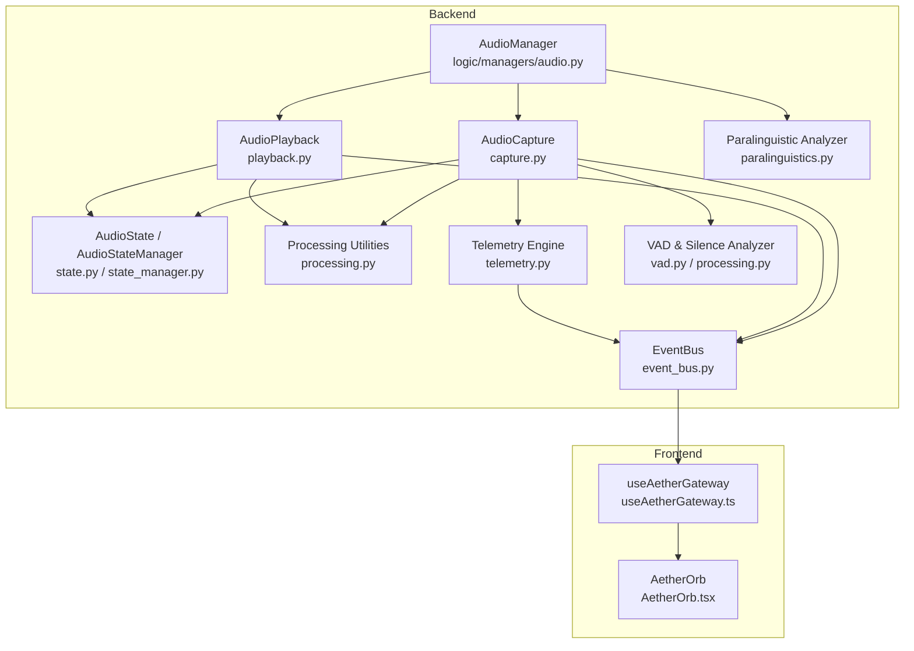
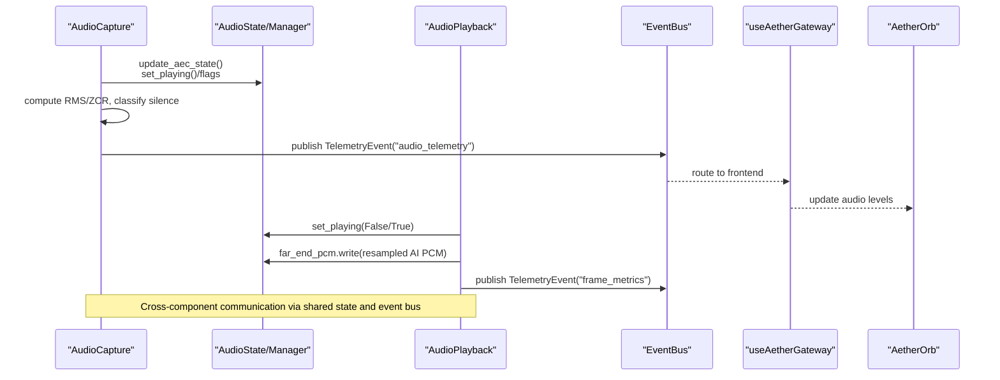
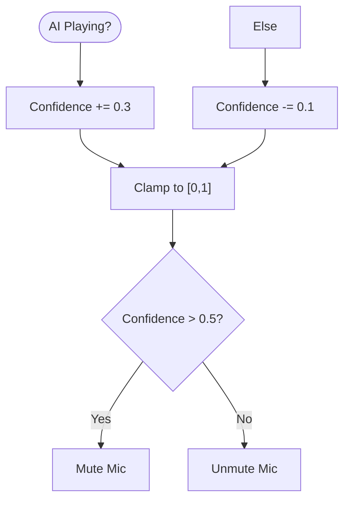
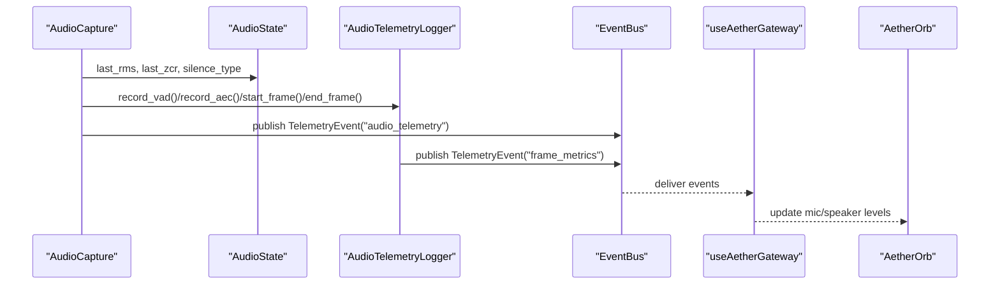
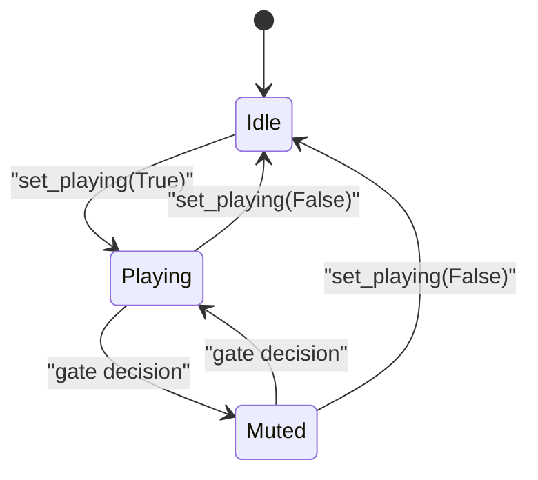
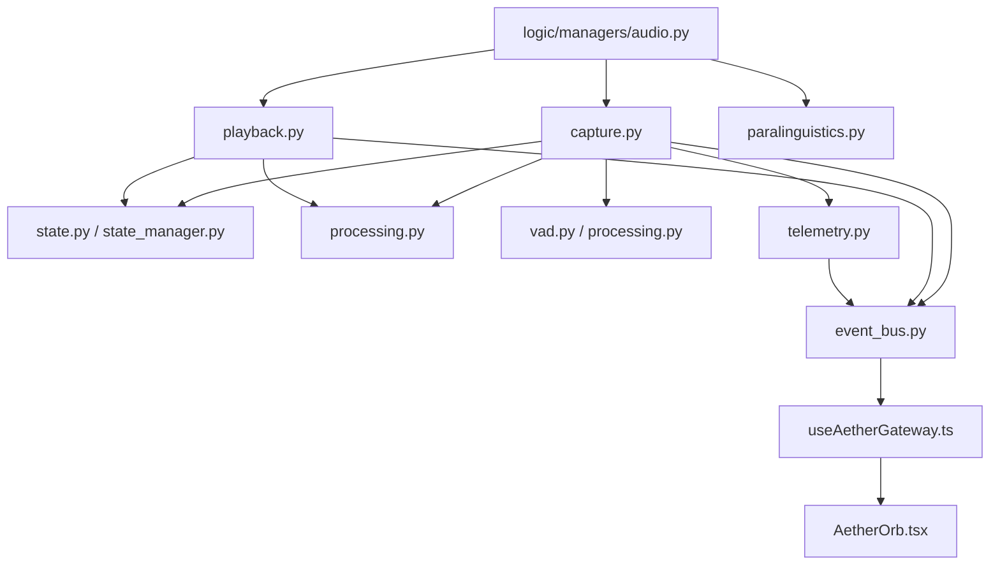
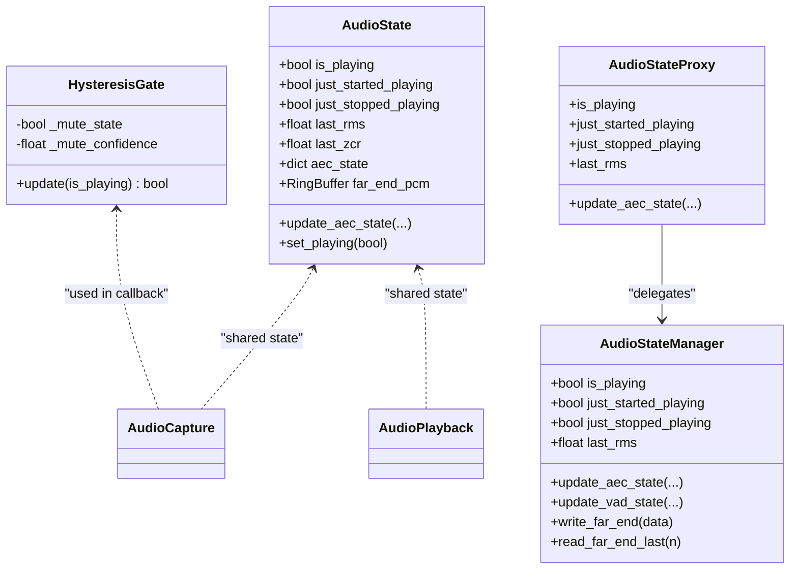

# Audio State Management

<cite>
**Referenced Files in This Document**
- [core/audio/state.py](file://core/audio/state.py)
- [core/audio/state_manager.py](file://core/audio/state_manager.py)
- [core/audio/capture.py](file://core/audio/capture.py)
- [core/audio/playback.py](file://core/audio/playback.py)
- [core/audio/processing.py](file://core/audio/processing.py)
- [core/audio/telemetry.py](file://core/audio/telemetry.py)
- [core/audio/vad.py](file://core/audio/vad.py)
- [core/audio/paralinguistics.py](file://core/audio/paralinguistics.py)
- [core/logic/managers/audio.py](file://core/logic/managers/audio.py)
- [core/infra/event_bus.py](file://core/infra/event_bus.py)
- [apps/portal/src/hooks/useAetherGateway.ts](file://apps/portal/src/hooks/useAetherGateway.ts)
- [apps/portal/src/components/AetherOrb.tsx](file://apps/portal/src/components/AetherOrb.tsx)
- [core/ai/thalamic.py](file://core/ai/thalamic.py)
- [core/infra/health_check.py](file://core/infra/health_check.py)
</cite>

## Table of Contents
1. [Introduction](#introduction)
2. [Project Structure](#project-structure)
3. [Core Components](#core-components)
4. [Architecture Overview](#architecture-overview)
5. [Detailed Component Analysis](#detailed-component-analysis)
6. [Dependency Analysis](#dependency-analysis)
7. [Performance Considerations](#performance-considerations)
8. [Troubleshooting Guide](#troubleshooting-guide)
9. [Conclusion](#conclusion)
10. [Appendices](#appendices)

## Introduction
This document explains the audio state management system powering real-time audio processing, gating, telemetry, and cross-component coordination. It covers:
- Shared state variables and threading safety mechanisms
- HysteresisGate for AI state tracking and gating decisions
- The audio_state global object and its evolution to a managed state manager
- Real-time telemetry updates (RMS energy, ZCR, silence classification)
- Threading locks and synchronization to prevent race conditions
- State transitions among playing, muted, and ambient modes
- Integration with external components via callbacks and event notifications
- Persistence considerations and reset mechanisms
- Debugging techniques and monitoring tools

## Project Structure
The audio state management spans Python backend modules and React frontend hooks, coordinated by a neural event bus.

**Diagram sources**
- [core/audio/capture.py](file://core/audio/capture.py#L329-L509)
- [core/audio/playback.py](file://core/audio/playback.py#L61-L99)
- [core/audio/state.py](file://core/audio/state.py#L36-L128)
- [core/audio/state_manager.py](file://core/audio/state_manager.py#L59-L320)
- [core/audio/processing.py](file://core/audio/processing.py#L107-L202)
- [core/audio/telemetry.py](file://core/audio/telemetry.py#L21-L93)
- [core/audio/vad.py](file://core/audio/vad.py#L14-L82)
- [core/audio/paralinguistics.py](file://core/audio/paralinguistics.py#L31-L214)
- [core/logic/managers/audio.py](file://core/logic/managers/audio.py#L18-L98)
- [core/infra/event_bus.py](file://core/infra/event_bus.py#L69-L152)
- [apps/portal/src/hooks/useAetherGateway.ts](file://apps/portal/src/hooks/useAetherGateway.ts#L163-L228)
- [apps/portal/src/components/AetherOrb.tsx](file://apps/portal/src/components/AetherOrb.tsx#L73-L151)

**Section sources**
- [core/audio/state.py](file://core/audio/state.py#L1-L129)
- [core/audio/state_manager.py](file://core/audio/state_manager.py#L1-L321)
- [core/audio/capture.py](file://core/audio/capture.py#L1-L575)
- [core/audio/playback.py](file://core/audio/playback.py#L1-L204)
- [core/audio/processing.py](file://core/audio/processing.py#L1-L508)
- [core/audio/telemetry.py](file://core/audio/telemetry.py#L1-L441)
- [core/audio/vad.py](file://core/audio/vad.py#L1-L82)
- [core/audio/paralinguistics.py](file://core/audio/paralinguistics.py#L1-L214)
- [core/logic/managers/audio.py](file://core/logic/managers/audio.py#L1-L98)
- [core/infra/event_bus.py](file://core/infra/event_bus.py#L1-L152)
- [apps/portal/src/hooks/useAetherGateway.ts](file://apps/portal/src/hooks/useAetherGateway.ts#L163-L228)
- [apps/portal/src/components/AetherOrb.tsx](file://apps/portal/src/components/AetherOrb.tsx#L73-L151)

## Core Components
- HysteresisGate: Prevents rapid toggling of the microphone gate by integrating AI playback state with a confidence accumulator and thresholding.
- AudioState (legacy singleton) and AudioStateManager (thread-safe class): Provide shared state for playback, AEC, VAD, and far-end PCM buffering; expose atomic update APIs and transition flags.
- AudioCapture: Runs in a PyAudio C-callback, applies AEC and gating, computes RMS and ZCR, classifies silence, and publishes telemetry.
- AudioPlayback: Drives speaker output, maintains far-end PCM buffer for AEC, and supports instant interruption.
- Processing utilities: RingBuffer, VAD engines, and silence classification.
- Telemetry: Periodic paralinguistic metrics and frame-level performance logging.
- AudioManager: Orchestrates capture/playback and bridges affective features to the event bus.
- EventBus: Tiered event routing for audio frames, control commands, and telemetry.

**Section sources**
- [core/audio/state.py](file://core/audio/state.py#L13-L34)
- [core/audio/state.py](file://core/audio/state.py#L36-L128)
- [core/audio/state_manager.py](file://core/audio/state_manager.py#L59-L320)
- [core/audio/capture.py](file://core/audio/capture.py#L329-L509)
- [core/audio/playback.py](file://core/audio/playback.py#L61-L99)
- [core/audio/processing.py](file://core/audio/processing.py#L107-L202)
- [core/audio/processing.py](file://core/audio/processing.py#L256-L387)
- [core/audio/telemetry.py](file://core/audio/telemetry.py#L21-L93)
- [core/logic/managers/audio.py](file://core/logic/managers/audio.py#L18-L98)
- [core/infra/event_bus.py](file://core/infra/event_bus.py#L69-L152)

## Architecture Overview
The system integrates real-time audio capture, AEC gating, VAD, and telemetry with a global state object and event bus. The capture callback updates shared state and emits telemetry; playback updates state and buffers far-end PCM for AEC; the event bus distributes telemetry and control events to the frontend.

**Diagram sources**
- [core/audio/capture.py](file://core/audio/capture.py#L367-L466)
- [core/audio/playback.py](file://core/audio/playback.py#L69-L92)
- [core/audio/state.py](file://core/audio/state.py#L76-L109)
- [core/audio/state_manager.py](file://core/audio/state_manager.py#L154-L173)
- [core/audio/telemetry.py](file://core/audio/telemetry.py#L343-L354)
- [apps/portal/src/hooks/useAetherGateway.ts](file://apps/portal/src/hooks/useAetherGateway.ts#L163-L228)
- [apps/portal/src/components/AetherOrb.tsx](file://apps/portal/src/components/AetherOrb.tsx#L73-L151)

## Detailed Component Analysis

### Shared State and Threading Safety
- Legacy AudioState singleton:
  - Protects AEC and state fields with a lock; isolates playback transition flags with a dedicated lock.
  - Exposes atomic update methods for AEC state and set_playing with transition flags.
- AudioStateManager (recommended replacement):
  - Uses an RLock for thread safety, atomic property setters, and a far-end PCM ring buffer proxy.
  - Provides update_aec_state and update_vad_state for composite updates.
- Backward compatibility:
  - AudioStateProxy forwards to AudioStateManager to maintain existing global usage.

Key shared variables:
- Playback: is_playing, just_started_playing, just_stopped_playing
- AEC: aec_converged, convergence_progress, erle_db, delay_ms, double_talk
- VAD/Silence: last_rms, is_soft, is_hard, silence_type
- Monitoring: last_zcr, capture_queue_drops, ai_spectrum
- Far-end PCM: RingBuffer or numpy-backed buffer for AEC reference

Threading locks and synchronization:
- AudioState: _lock for composite updates; _playing_lock for transition flags
- AudioStateManager: _lock (RLock) for atomicity; separate properties for flags
- Capture callback throttles telemetry to ~15Hz to avoid hot-path contention

**Section sources**
- [core/audio/state.py](file://core/audio/state.py#L36-L128)
- [core/audio/state_manager.py](file://core/audio/state_manager.py#L59-L320)

### HysteresisGate for AI State Tracking
HysteresisGate stabilizes gating decisions by:
- Maintaining a confidence accumulator that increases on AI playing and decreases otherwise
- Clamping confidence to [0.0, 1.0] and thresholding at 0.5 to decide mute state
- Providing a stable mute decision suitable for the capture callback

Integration:
- AudioCapture reads audio_state.is_playing and passes it to HysteresisGate.update
- The gate’s output gates microphone input to prevent clipping and echo feedback

**Diagram sources**
- [core/audio/state.py](file://core/audio/state.py#L13-L34)
- [core/audio/capture.py](file://core/audio/capture.py#L387-L419)

**Section sources**
- [core/audio/state.py](file://core/audio/state.py#L13-L34)
- [core/audio/capture.py](file://core/audio/capture.py#L387-L419)

### Real-time Telemetry Updates
- RMS energy and ZCR:
  - Capture computes RMS and ZCR per frame and updates audio_state.last_rms and last_zcr
  - Throttled telemetry broadcast (~15Hz) sends RMS and gain to the frontend
- Silence classification:
  - SilentAnalyzer classifies silence into void, breathing, thinking based on RMS variance and ZCR
  - AudioCapture sets audio_state.silence_type accordingly
- Paralinguistics telemetry:
  - AudioTelemetry computes volume, pitch (via ZCR), and spectral centroid periodically
  - AudioTelemetryLogger records frame-level metrics and publishes to EventBus
- Frontend consumption:
  - useAetherGateway listens for audio_telemetry and paralinguistics events and updates UI state
  - AetherOrb renders smoothed audio levels and visual effects

**Diagram sources**
- [core/audio/capture.py](file://core/audio/capture.py#L442-L466)
- [core/audio/telemetry.py](file://core/audio/telemetry.py#L53-L93)
- [core/audio/telemetry.py](file://core/audio/telemetry.py#L252-L277)
- [apps/portal/src/hooks/useAetherGateway.ts](file://apps/portal/src/hooks/useAetherGateway.ts#L163-L228)
- [apps/portal/src/components/AetherOrb.tsx](file://apps/portal/src/components/AetherOrb.tsx#L73-L151)

**Section sources**
- [core/audio/capture.py](file://core/audio/capture.py#L442-L466)
- [core/audio/processing.py](file://core/audio/processing.py#L331-L387)
- [core/audio/telemetry.py](file://core/audio/telemetry.py#L21-L93)
- [core/audio/telemetry.py](file://core/audio/telemetry.py#L151-L394)
- [apps/portal/src/hooks/useAetherGateway.ts](file://apps/portal/src/hooks/useAetherGateway.ts#L163-L228)
- [apps/portal/src/components/AetherOrb.tsx](file://apps/portal/src/components/AetherOrb.tsx#L73-L151)

### State Transitions: Playing, Muted, Ambient
- Playing ↔ Muted:
  - AudioPlayback sets playing state in its callback; AudioCapture reads audio_state.is_playing and applies gating
  - Transition flags (just_started_playing, just_stopped_playing) enable precise reactions
- Ambient mode:
  - When not playing and not muting, capture may forward ambient audio for continuous monitoring
- Interrupt and barge-in:
  - AudioManager.flash_interrupt and playback.interrupt drain queues and set playing=False to stop zombie audio

**Diagram sources**
- [core/audio/playback.py](file://core/audio/playback.py#L69-L99)
- [core/audio/playback.py](file://core/audio/playback.py#L165-L191)
- [core/audio/state.py](file://core/audio/state.py#L111-L124)
- [core/audio/capture.py](file://core/audio/capture.py#L387-L419)

**Section sources**
- [core/audio/playback.py](file://core/audio/playback.py#L61-L99)
- [core/audio/playback.py](file://core/audio/playback.py#L165-L191)
- [core/audio/state.py](file://core/audio/state.py#L111-L124)
- [core/audio/capture.py](file://core/audio/capture.py#L387-L419)

### Integration with External Components
- Callbacks and event notifications:
  - AudioManager bridges paralinguistic features to the event bus and legacy callbacks
  - EventBus routes TelemetryEvent and AcousticTraitEvent to subscribers
- Frontend integration:
  - useAetherGateway consumes audio_telemetry and paralinguistics metrics
  - AetherOrb renders audio levels and visual feedback

**Section sources**
- [core/logic/managers/audio.py](file://core/logic/managers/audio.py#L72-L98)
- [core/infra/event_bus.py](file://core/infra/event_bus.py#L69-L152)
- [apps/portal/src/hooks/useAetherGateway.ts](file://apps/portal/src/hooks/useAetherGateway.ts#L163-L228)
- [apps/portal/src/components/AetherOrb.tsx](file://apps/portal/src/components/AetherOrb.tsx#L73-L151)

### State Persistence and Reset Mechanisms
- Persistence considerations:
  - Shared state is process-local; no built-in persistence is present in the referenced modules
  - For recovery, reset mechanisms rely on clearing queues and resetting state flags
- Reset and recovery:
  - playback.interrupt drains queues and forces is_playing=False
  - Health checks monitor latency and AEC convergence; watchdog can heal system failures and notify frontend

**Section sources**
- [core/audio/playback.py](file://core/audio/playback.py#L165-L191)
- [core/infra/health_check.py](file://core/infra/health_check.py#L174-L199)

## Dependency Analysis
The capture and playback components depend on shared state and processing utilities; telemetry depends on EventBus; frontend consumes telemetry via gateway hooks.

**Diagram sources**
- [core/audio/capture.py](file://core/audio/capture.py#L1-L575)
- [core/audio/playback.py](file://core/audio/playback.py#L1-L204)
- [core/audio/state.py](file://core/audio/state.py#L1-L129)
- [core/audio/state_manager.py](file://core/audio/state_manager.py#L1-L321)
- [core/audio/processing.py](file://core/audio/processing.py#L1-L508)
- [core/audio/vad.py](file://core/audio/vad.py#L1-L82)
- [core/audio/telemetry.py](file://core/audio/telemetry.py#L1-L441)
- [core/audio/paralinguistics.py](file://core/audio/paralinguistics.py#L1-L214)
- [core/logic/managers/audio.py](file://core/logic/managers/audio.py#L1-L98)
- [core/infra/event_bus.py](file://core/infra/event_bus.py#L1-L152)
- [apps/portal/src/hooks/useAetherGateway.ts](file://apps/portal/src/hooks/useAetherGateway.ts#L163-L228)
- [apps/portal/src/components/AetherOrb.tsx](file://apps/portal/src/components/AetherOrb.tsx#L73-L151)

**Section sources**
- [core/audio/capture.py](file://core/audio/capture.py#L1-L575)
- [core/audio/playback.py](file://core/audio/playback.py#L1-L204)
- [core/audio/state.py](file://core/audio/state.py#L1-L129)
- [core/audio/state_manager.py](file://core/audio/state_manager.py#L1-L321)
- [core/audio/processing.py](file://core/audio/processing.py#L1-L508)
- [core/audio/telemetry.py](file://core/audio/telemetry.py#L1-L441)
- [core/audio/paralinguistics.py](file://core/audio/paralinguistics.py#L1-L214)
- [core/logic/managers/audio.py](file://core/logic/managers/audio.py#L1-L98)
- [core/infra/event_bus.py](file://core/infra/event_bus.py#L1-L152)
- [apps/portal/src/hooks/useAetherGateway.ts](file://apps/portal/src/hooks/useAetherGateway.ts#L163-L228)
- [apps/portal/src/components/AetherOrb.tsx](file://apps/portal/src/components/AetherOrb.tsx#L73-L151)

## Performance Considerations
- Hot-path telemetry throttling: Capture throttles audio_telemetry to ~15Hz to reduce contention
- Efficient buffers: RingBuffer and numpy-based far-end buffer minimize allocations and copies
- Rust acceleration: When available, aether_cortex accelerates VAD and zero-crossing detection
- Latency tracking: AudioTelemetryLogger measures per-frame latency and publishes metrics
- Queue backpressure: Playback feeder spins with small sleeps to avoid busy-waiting

[No sources needed since this section provides general guidance]

## Troubleshooting Guide
Common issues and diagnostics:
- High capture queue drops:
  - Monitor audio_state.capture_queue_drops and adjust queue sizes or drop policies
- AEC not converging:
  - Inspect audio_state.aec_converged and aec_erle_db; verify jitter buffer and hardware latency alignment
- Stuck in muted state:
  - Verify transition flags (just_started_playing, just_stopped_playing) and HysteresisGate confidence
- Frontend not updating:
  - Confirm EventBus delivery of audio_telemetry and paralinguistics events; verify useAetherGateway subscription
- Health checks:
  - Use health_check helpers to validate latency and AEC convergence

**Section sources**
- [core/audio/capture.py](file://core/audio/capture.py#L303-L328)
- [core/infra/health_check.py](file://core/infra/health_check.py#L174-L199)
- [apps/portal/src/hooks/useAetherGateway.ts](file://apps/portal/src/hooks/useAetherGateway.ts#L163-L228)

## Conclusion
The audio state management system combines a thread-safe shared state model, hysteresis-based gating, and robust telemetry to coordinate real-time audio capture, AEC, and playback. The EventBus enables decoupled integration with external components, while health checks and reset mechanisms support system recovery. Adopting AudioStateManager improves modularity and safety compared to the legacy singleton.

[No sources needed since this section summarizes without analyzing specific files]

## Appendices

### Class Relationships

**Diagram sources**
- [core/audio/state.py](file://core/audio/state.py#L13-L128)
- [core/audio/state_manager.py](file://core/audio/state_manager.py#L59-L320)
- [core/audio/capture.py](file://core/audio/capture.py#L329-L509)
- [core/audio/playback.py](file://core/audio/playback.py#L61-L99)