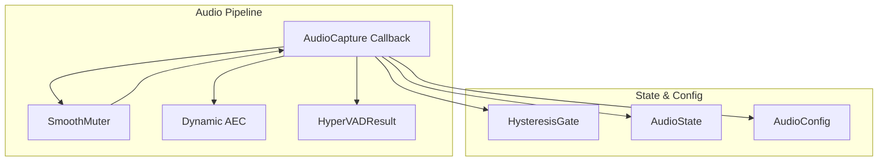
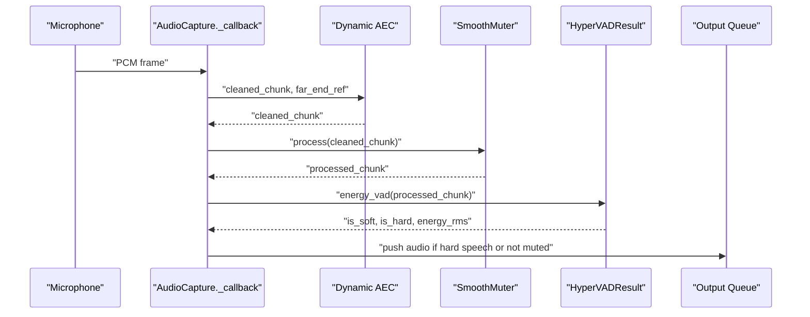
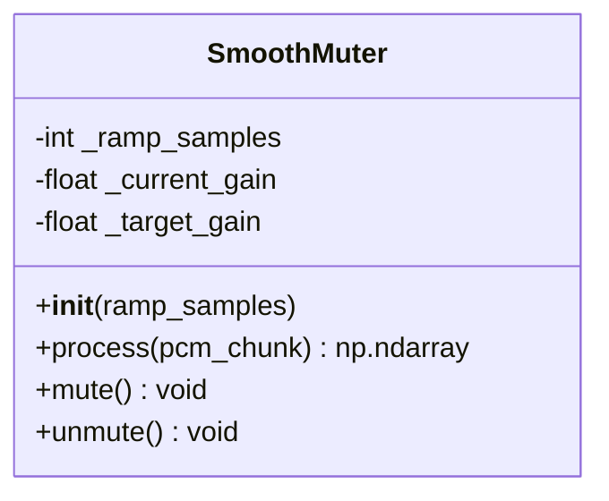
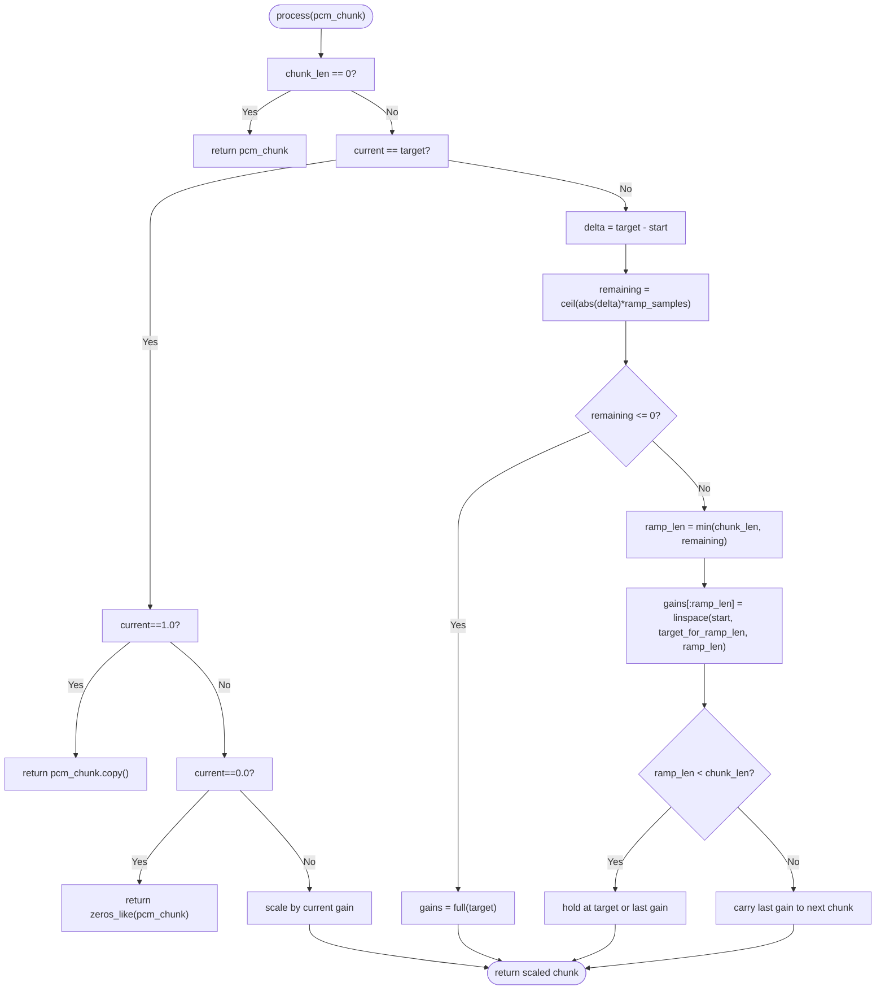
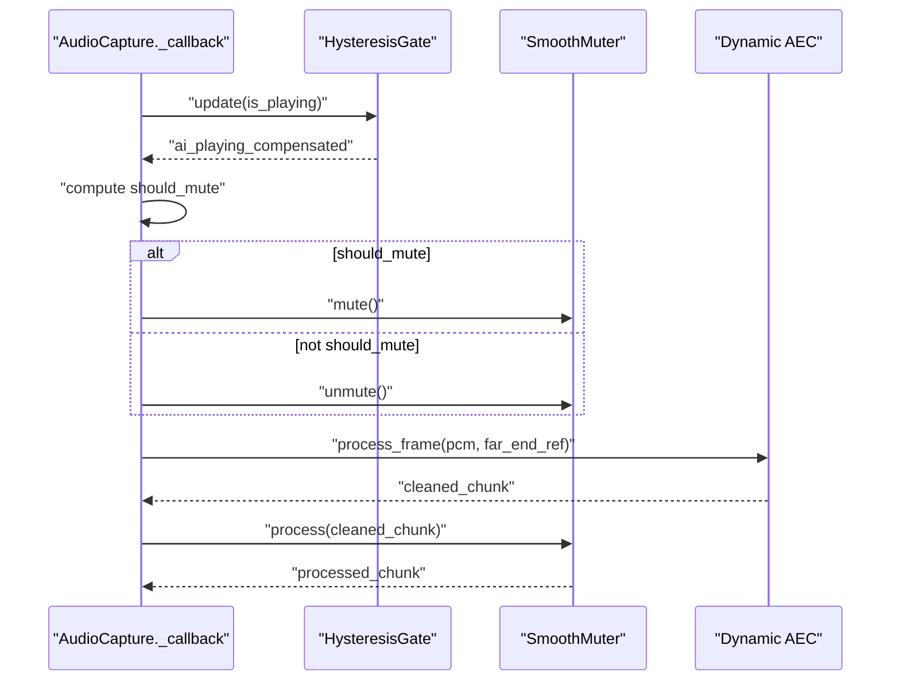
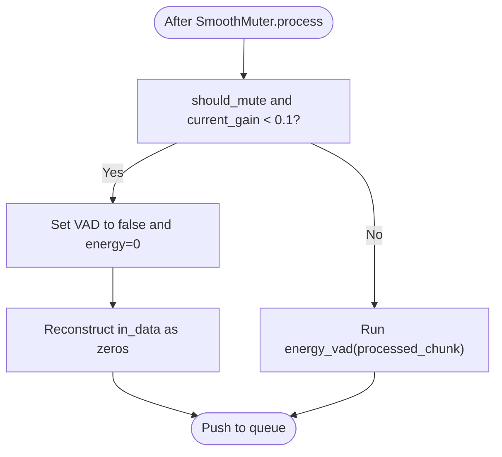
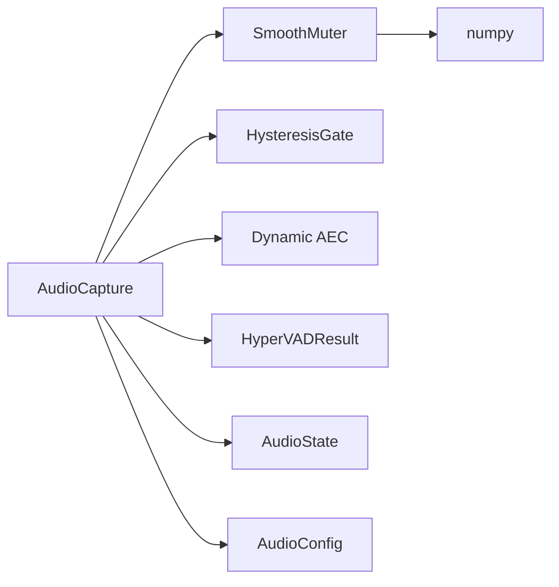

# Smooth Muting System

<cite>
**Referenced Files in This Document**
- [capture.py](file://core/audio/capture.py)
- [processing.py](file://core/audio/processing.py)
- [state.py](file://core/audio/state.py)
- [config.py](file://core/infra/config.py)
- [test_smooth_muter.py](file://tests/unit/test_smooth_muter.py)
- [test_capture_callback.py](file://tests/unit/test_capture_callback.py)
</cite>

## Table of Contents
1. [Introduction](#introduction)
2. [Project Structure](#project-structure)
3. [Core Components](#core-components)
4. [Architecture Overview](#architecture-overview)
5. [Detailed Component Analysis](#detailed-component-analysis)
6. [Dependency Analysis](#dependency-analysis)
7. [Performance Considerations](#performance-considerations)
8. [Troubleshooting Guide](#troubleshooting-guide)
9. [Conclusion](#conclusion)
10. [Appendices](#appendices)

## Introduction
This document explains the Smooth Muting System that gracefully transitions microphone audio between muted and unmuted states to prevent audio pops and clicks. The system centers on the SmoothMuter class, which applies deterministic, linear gain ramps over a configurable number of samples. It integrates tightly with the Thalamic Gate decision logic in the capture callback to suppress microphone input when the system is playing audio and the user is not speaking, while preventing VAD-triggered barge-ins during ramp transitions.

## Project Structure
The Smooth Muting System lives in the audio capture pipeline and interacts with VAD, hysteresis gating, and AEC. The relevant files are:
- SmoothMuter implementation and integration within the capture callback
- VAD result types and engines used downstream
- Global audio state and hysteresis gate
- Audio configuration parameters including ramp-related timing

**Diagram sources**
- [capture.py](file://core/audio/capture.py#L106-L191)
- [processing.py](file://core/audio/processing.py#L246-L434)
- [state.py](file://core/audio/state.py#L13-L34)
- [config.py](file://core/infra/config.py#L11-L44)

**Section sources**
- [capture.py](file://core/audio/capture.py#L106-L191)
- [processing.py](file://core/audio/processing.py#L246-L434)
- [state.py](file://core/audio/state.py#L13-L34)
- [config.py](file://core/infra/config.py#L11-L44)

## Core Components
- SmoothMuter: Applies smooth, deterministic gain ramps to avoid clicks; supports fast-path optimizations for no-op, full mute, and full unmute; generates linear ramps using numpy.linspace with endpoint=True to guarantee exact target values.
- AudioCapture callback: Integrates SmoothMuter with Thalamic Gate decisions, AEC, and VAD; enforces VAD-trigger prevention during near-zero gain periods.
- HysteresisGate: Prevents rapid toggling of mute decisions.
- AudioConfig: Provides ramp-related timing parameters and other audio settings.

**Section sources**
- [capture.py](file://core/audio/capture.py#L106-L191)
- [capture.py](file://core/audio/capture.py#L329-L509)
- [state.py](file://core/audio/state.py#L13-L34)
- [config.py](file://core/infra/config.py#L11-L44)

## Architecture Overview
The capture callback performs:
1. Reads far-end PCM reference from shared buffer and writes new far-end data to a jitter buffer.
2. Runs Dynamic AEC to clean the microphone PCM.
3. Applies SmoothMuter to the cleaned audio.
4. Updates VAD and prevents barge-in triggers when gain is low.
5. Pushes audio to the output queue based on VAD and gating decisions.

**Diagram sources**
- [capture.py](file://core/audio/capture.py#L329-L509)
- [processing.py](file://core/audio/processing.py#L407-L434)

## Detailed Component Analysis

### SmoothMuter Class
SmoothMuter ensures smooth transitions between 0.0 and 1.0 gains over a configurable number of samples. It maintains:
- Current gain
- Target gain
- Ramp duration in samples

Key behaviors:
- Deterministic linear ramps generated with numpy.linspace and endpoint=True to hit exact targets.
- Sample-by-sample gain application using vectorized multiplication for memory efficiency.
- Fast-path optimizations:
  - If current equals target and target is 1.0, return a copy of the input.
  - If current equals target and target is 0.0, return zeros.
  - If current equals target and target is neither 0 nor 1, scale by current gain.
- Handles ramp completion across chunk boundaries by carrying forward the last computed gain.

**Diagram sources**
- [capture.py](file://core/audio/capture.py#L106-L191)

**Section sources**
- [capture.py](file://core/audio/capture.py#L106-L191)
- [test_smooth_muter.py](file://tests/unit/test_smooth_muter.py#L1-L135)

### Deterministic Ramp Calculations
- Remaining samples to target are computed as ceil(abs(delta) * ramp_samples), where delta is target minus current gain.
- If remaining <= 0, the ramp completes in this chunk; gains are filled with the target.
- Otherwise, a ramp segment is generated up to the point where the ramp ends, then the remainder is held at the last computed gain.
- endpoint=True in linspace guarantees the ramp lands exactly on the intermediate or target value.

**Diagram sources**
- [capture.py](file://core/audio/capture.py#L125-L182)

**Section sources**
- [capture.py](file://core/audio/capture.py#L125-L182)

### Fast-Path Optimizations
- No-op case: current_gain == target_gain == 1.0 returns a copy of the input.
- Full mute: current_gain == target_gain == 0.0 returns zeros.
- Partial gain: current_gain == target_gain and neither 0 nor 1 scales the input by the constant gain.
- These paths minimize allocations and branching in steady-state conditions.

**Section sources**
- [capture.py](file://core/audio/capture.py#L135-L141)
- [test_smooth_muter.py](file://tests/unit/test_smooth_muter.py#L23-L31)

### Linear Ramp Generation and Endpoint Behavior
- Uses numpy.linspace with endpoint=True to ensure the ramp ends precisely at the desired intermediate or target value.
- This guarantees deterministic convergence and avoids residual gain at ramp completion.

**Section sources**
- [capture.py](file://core/audio/capture.py#L157-L164)

### Sample-by-Sample Gain Application and Memory Efficiency
- Vectorized multiplication of the entire chunk by a gains array avoids per-sample loops.
- The gains array is sized to the chunk length, minimizing temporary allocations.
- The method returns a new int16 array to avoid aliasing and preserve immutability of the caller’s buffer.

**Section sources**
- [capture.py](file://core/audio/capture.py#L166-L182)

### Integration with Thalamic Gate Decision Logic
- The capture callback computes should_mute using HysteresisGate and whether the user is speaking.
- When should_mute is true, SmoothMuter.mute() sets target gain to 0.0; otherwise, SmoothMuter.unmute() sets target gain to 1.0.
- The callback then applies SmoothMuter.process(cleaned_chunk) to the AEC-cleaned audio.

**Diagram sources**
- [capture.py](file://core/audio/capture.py#L387-L421)
- [state.py](file://core/audio/state.py#L13-L34)

**Section sources**
- [capture.py](file://core/audio/capture.py#L387-L421)
- [state.py](file://core/audio/state.py#L13-L34)

### VAD Triggering Prevention During Mute Transitions
- When should_mute is true and current gain falls below a small threshold, the callback forces VAD to false and energy to 0 to prevent barge-in triggers.
- It also reconstructs the output frame as all zeros to ensure no audio leaks to downstream systems.

**Diagram sources**
- [capture.py](file://core/audio/capture.py#L423-L438)

**Section sources**
- [capture.py](file://core/audio/capture.py#L423-L438)

### Configuration Parameters for Ramp Duration and Timing
- ramp_samples: Controls the number of samples over which a full 0→1 or 1→0 transition occurs.
- mute_delay_samples and unmute_delay_samples: Additional delays to account for hardware latency and echo decay.
- AudioConfig provides defaults and runtime-updatable parameters for AEC and jitter buffering.

**Section sources**
- [capture.py](file://core/audio/capture.py#L115-L123)
- [capture.py](file://core/audio/capture.py#L287-L296)
- [config.py](file://core/infra/config.py#L11-L44)

## Dependency Analysis
- SmoothMuter depends on numpy for linear ramp generation and vectorized operations.
- AudioCapture composes SmoothMuter, HysteresisGate, Dynamic AEC, and VAD engines.
- VAD result types are defined in processing.py and consumed by the capture callback.

**Diagram sources**
- [capture.py](file://core/audio/capture.py#L106-L191)
- [processing.py](file://core/audio/processing.py#L246-L434)
- [state.py](file://core/audio/state.py#L13-L34)
- [config.py](file://core/infra/config.py#L11-L44)

**Section sources**
- [capture.py](file://core/audio/capture.py#L106-L191)
- [processing.py](file://core/audio/processing.py#L246-L434)
- [state.py](file://core/audio/state.py#L13-L34)
- [config.py](file://core/infra/config.py#L11-L44)

## Performance Considerations
- Deterministic ramping minimizes transient energy spikes that could trigger VAD and cause barge-ins.
- Fast-path optimizations reduce CPU overhead when gain is unchanged.
- Vectorized operations and minimal allocations keep per-frame costs low.
- The system’s design ensures no discontinuities at chunk boundaries, preventing audible artifacts.

[No sources needed since this section provides general guidance]

## Troubleshooting Guide
Common issues and checks:
- Clicks or pops during transitions:
  - Verify ramp_samples is sufficiently large for the desired audio quality.
  - Ensure the ramp completes within the expected number of samples and endpoint=True is used.
- Excessive latency during mute/unmute:
  - Increase ramp_samples to smooth transitions at the cost of longer ramp duration.
  - Adjust mute_delay_samples and unmute_delay_samples to match hardware latency.
- VAD triggering during near-zero gain:
  - Confirm the callback forces VAD to false and energy to 0 when current_gain < 0.1 and should_mute is true.
- Unexpected silence or full volume:
  - Check that SmoothMuter.mute()/unmute() are called appropriately by the Thalamic Gate logic.
  - Validate that the fast-path logic returns copies or zeros as expected.

**Section sources**
- [test_smooth_muter.py](file://tests/unit/test_smooth_muter.py#L102-L134)
- [test_capture_callback.py](file://tests/unit/test_capture_callback.py#L103-L138)
- [capture.py](file://core/audio/capture.py#L423-L438)

## Conclusion
The Smooth Muting System provides a robust, deterministic mechanism to transition microphone audio between states without introducing audible artifacts. Its integration with the Thalamic Gate prevents unwanted barge-ins by suppressing VAD triggers during near-zero gain periods. With carefully tuned ramp_samples and timing parameters, the system balances latency and audio quality to meet diverse operational requirements.

[No sources needed since this section summarizes without analyzing specific files]

## Appendices

### Tuning Guidelines for Ramp Samples
- Lower ramp_samples: Faster transitions, lower latency, but riskier for audio quality.
- Higher ramp_samples: Smoother transitions, better audio quality, longer ramp duration.
- Practical starting points:
  - For low-latency scenarios: tune ramp_samples to complete within 1–2 frames at the configured chunk size.
  - For high-quality scenarios: increase ramp_samples to reduce residual gain and ensure endpoint convergence.

[No sources needed since this section provides general guidance]