# Audio Processing Pipeline Architecture

<cite>
**Referenced Files in This Document**
- [core/audio/capture.py](file://core/audio/capture.py)
- [core/audio/playback.py](file://core/audio/playback.py)
- [core/audio/dynamic_aec.py](file://core/audio/dynamic_aec.py)
- [core/audio/processing.py](file://core/audio/processing.py)
- [core/audio/state.py](file://core/audio/state.py)
- [core/audio/state_manager.py](file://core/audio/state_manager.py)
- [core/audio/telemetry.py](file://core/audio/telemetry.py)
- [core/audio/paralinguistics.py](file://core/audio/paralinguistics.py)
- [core/audio/spectral.py](file://core/audio/spectral.py)
- [core/audio/jitter_buffer.py](file://core/audio/jitter_buffer.py)
- [apps/portal/public/pcm-processor.js](file://apps/portal/public/pcm-processor.js)
- [apps/portal/src/hooks/useAudioPipeline.ts](file://apps/portal/src/hooks/useAudioPipeline.ts)
- [examples/capture_playback.py](file://examples/capture_playback.py)
- [docs/audio_architecture.md](file://docs/audio_architecture.md)
- [best_practices.md](file://best_practices.md)
</cite>

## Table of Contents
1. [Introduction](#introduction)
2. [Project Structure](#project-structure)
3. [Core Components](#core-components)
4. [Architecture Overview](#architecture-overview)
5. [Detailed Component Analysis](#detailed-component-analysis)
6. [Dependency Analysis](#dependency-analysis)
7. [Performance Considerations](#performance-considerations)
8. [Troubleshooting Guide](#troubleshooting-guide)
9. [Conclusion](#conclusion)

## Introduction
This document describes the Audio Processing Pipeline Architecture for the Aether Voice OS. It covers the end-to-end flow from microphone capture through real-time acoustic echo cancellation, voice activity detection, affective computing, and speaker playback. The pipeline emphasizes zero-latency handoffs, adaptive algorithms, and robust telemetry for continuous monitoring and optimization.

## Project Structure
The audio pipeline spans core Python modules for DSP and system integration, a browser-based audio hook for WebRTC capture and playback, and supporting utilities for telemetry and state management.

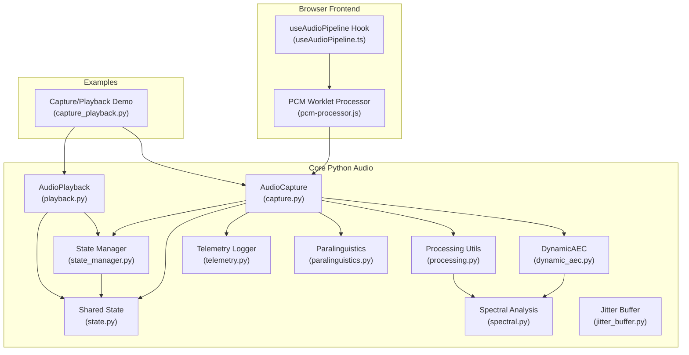

**Diagram sources**
- [core/audio/capture.py](file://core/audio/capture.py#L195-L584)
- [core/audio/dynamic_aec.py](file://core/audio/dynamic_aec.py#L499-L800)
- [core/audio/processing.py](file://core/audio/processing.py#L1-L537)
- [core/audio/state.py](file://core/audio/state.py#L36-L159)
- [core/audio/state_manager.py](file://core/audio/state_manager.py#L59-L325)
- [core/audio/telemetry.py](file://core/audio/telemetry.py#L193-L495)
- [core/audio/paralinguistics.py](file://core/audio/paralinguistics.py#L31-L214)
- [core/audio/spectral.py](file://core/audio/spectral.py#L250-L503)
- [core/audio/jitter_buffer.py](file://core/audio/jitter_buffer.py#L14-L67)
- [core/audio/playback.py](file://core/audio/playback.py#L30-L241)
- [apps/portal/src/hooks/useAudioPipeline.ts](file://apps/portal/src/hooks/useAudioPipeline.ts#L27-L248)
- [apps/portal/public/pcm-processor.js](file://apps/portal/public/pcm-processor.js#L31-L81)
- [examples/capture_playback.py](file://examples/capture_playback.py#L15-L61)

**Section sources**
- [docs/audio_architecture.md](file://docs/audio_architecture.md#L1-L45)
- [best_practices.md](file://best_practices.md#L50-L81)

## Core Components
- AudioCapture: Microphone capture with PyAudio C-callbacks, integrating Dynamic AEC, Smooth Muter, and VAD. It pushes PCM frames to an asyncio queue and maintains shared state for brain synchronization.
- DynamicAEC: Frequency-domain NLMS adaptive filter with GCC-PHAT delay estimation, double-talk detection, and ERLE computation.
- Processing Utilities: RingBuffer, energy-based VAD, zero-crossing detection, and Rust-first acceleration via aether-cortex.
- AudioPlayback: Speaker output via PyAudio callback, with gain ducking, heartbeat mixing, and AEC reference generation.
- Shared State: Thread-safe singleton for AEC metadata, playback flags, and far-end PCM buffer.
- Telemetry Logger: Frame-level metrics collection, latency tracking, and session reporting.
- Paralinguistics Analyzer: Pitch, speech rate, RMS variance, and engagement scoring for affective computing.
- Spectral Analysis: STFT, Bark-scale bands, coherence, and ERLE computation.
- Jitter Buffer: Adaptive buffering for bursty playback and AEC reference stability.
- Browser Pipeline Hook: WebRTC capture, AudioWorklet PCM encoding, gapless playback scheduling, and barge-in support.

**Section sources**
- [core/audio/capture.py](file://core/audio/capture.py#L195-L584)
- [core/audio/dynamic_aec.py](file://core/audio/dynamic_aec.py#L499-L800)
- [core/audio/processing.py](file://core/audio/processing.py#L108-L537)
- [core/audio/playback.py](file://core/audio/playback.py#L30-L241)
- [core/audio/state.py](file://core/audio/state.py#L36-L159)
- [core/audio/telemetry.py](file://core/audio/telemetry.py#L193-L495)
- [core/audio/paralinguistics.py](file://core/audio/paralinguistics.py#L31-L214)
- [core/audio/spectral.py](file://core/audio/spectral.py#L250-L503)
- [core/audio/jitter_buffer.py](file://core/audio/jitter_buffer.py#L14-L67)
- [apps/portal/src/hooks/useAudioPipeline.ts](file://apps/portal/src/hooks/useAudioPipeline.ts#L27-L248)
- [apps/portal/public/pcm-processor.js](file://apps/portal/public/pcm-processor.js#L31-L81)

## Architecture Overview
The pipeline follows a callback-driven capture path with software-defined AEC in the microphone thread to minimize latency. Downstream processing occurs in asyncio queues, enabling decoupled VAD, affective analytics, and telemetry. Playback runs in a dedicated PyAudio callback thread, feeding the speaker while generating the AEC reference signal.

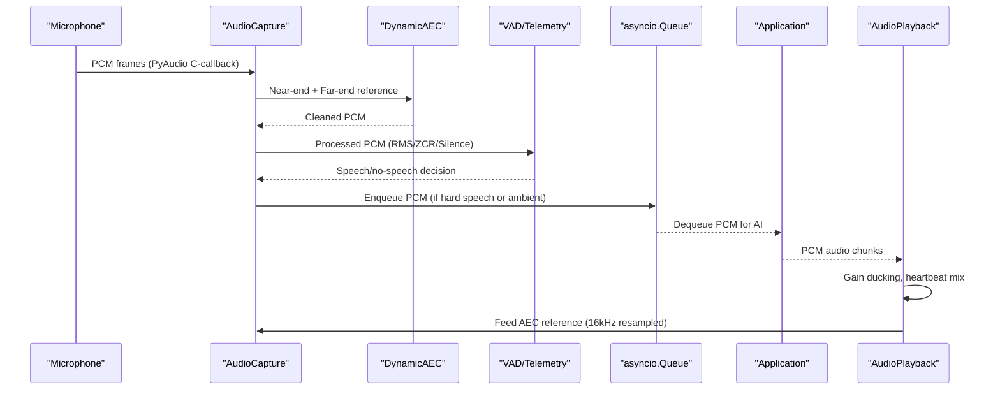

**Diagram sources**
- [core/audio/capture.py](file://core/audio/capture.py#L331-L518)
- [core/audio/dynamic_aec.py](file://core/audio/dynamic_aec.py#L610-L707)
- [core/audio/playback.py](file://core/audio/playback.py#L81-L129)
- [core/audio/processing.py](file://core/audio/processing.py#L390-L537)

## Detailed Component Analysis

### AudioCapture: Thalamic Gate and Real-Time AEC
- Responsibilities:
  - PyAudio C-callback capture at configured sample rate.
  - Dynamic AEC using frequency-domain NLMS with GCC-PHAT delay estimation.
  - SmoothMuter for graceful gain transitions to avoid clicks.
  - Adaptive VAD with hyper-thresholds and silence classification.
  - Jitter buffer for stable AEC reference signal.
  - Telemetry logging and shared state updates.
- Key behaviors:
  - Direct injection into asyncio queue avoids thread-hop latency.
  - On mute, forces VAD off and sends zeroed PCM to prevent barge-in triggers.
  - Updates global audio_state for monitoring and brain sync.

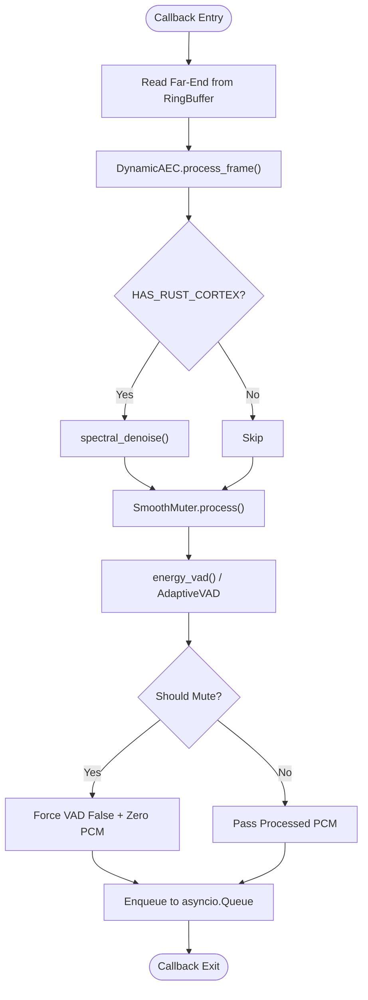

**Diagram sources**
- [core/audio/capture.py](file://core/audio/capture.py#L331-L518)
- [core/audio/dynamic_aec.py](file://core/audio/dynamic_aec.py#L610-L707)
- [core/audio/processing.py](file://core/audio/processing.py#L390-L436)

**Section sources**
- [core/audio/capture.py](file://core/audio/capture.py#L195-L584)
- [core/audio/dynamic_aec.py](file://core/audio/dynamic_aec.py#L499-L800)
- [core/audio/processing.py](file://core/audio/processing.py#L108-L171)

### DynamicAEC: Frequency-Domain NLMS with Double-Talk Detection
- Components:
  - FrequencyDomainNLMS: Overlap-save FFT processing, normalized LMS update, leakage, and pre-training.
  - DelayEstimator: GCC-PHAT with smoothing and confidence.
  - DoubleTalkDetector: Energy ratio, residual energy, and spectral coherence.
  - BoundedBuffer: Thread-safe ring buffer for far-end accumulation.
- Behavior:
  - Accumulates frames until block size, compensates for estimated delay, adapts filter, detects double-talk, computes ERLE, and returns cleaned audio.

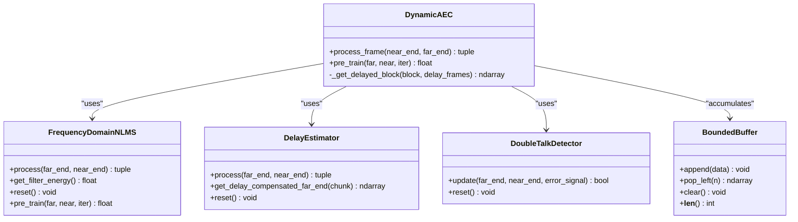

**Diagram sources**
- [core/audio/dynamic_aec.py](file://core/audio/dynamic_aec.py#L101-L260)
- [core/audio/dynamic_aec.py](file://core/audio/dynamic_aec.py#L383-L497)
- [core/audio/dynamic_aec.py](file://core/audio/dynamic_aec.py#L567-L598)

**Section sources**
- [core/audio/dynamic_aec.py](file://core/audio/dynamic_aec.py#L499-L800)
- [core/audio/spectral.py](file://core/audio/spectral.py#L388-L503)

### Processing Utilities: RingBuffer, VAD, and Cortex Acceleration
- RingBuffer: O(1) writes and windowed reads for efficient analysis.
- energy_vad: Dual-threshold adaptive VAD with multi-feature fusion.
- find_zero_crossing: Click-free cut points for barge-in.
- Rust-first acceleration: aether-cortex fallback strategy with dynamic resolution.

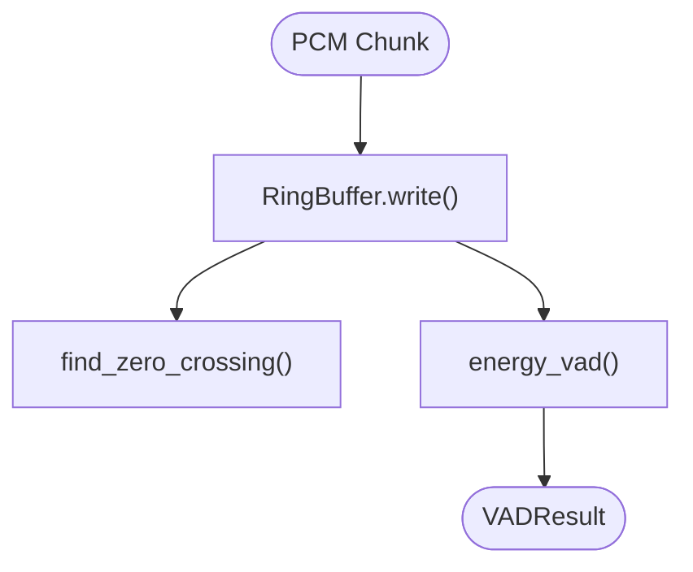

**Diagram sources**
- [core/audio/processing.py](file://core/audio/processing.py#L108-L245)
- [core/audio/processing.py](file://core/audio/processing.py#L390-L537)

**Section sources**
- [core/audio/processing.py](file://core/audio/processing.py#L1-L537)

### AudioPlayback: Speaker Output and AEC Reference Generation
- Responsibilities:
  - PyAudio callback thread for stable output.
  - Gain ducking and heartbeat mixing.
  - 24kHz → 16kHz resampling for AEC reference.
  - Queue-based backpressure to the AI session.
  - Instant barge-in via drain of both queues.
- Behavior:
  - Returns silence on underrun with warning.
  - Mirrors audio to UI via WebSocket callback.

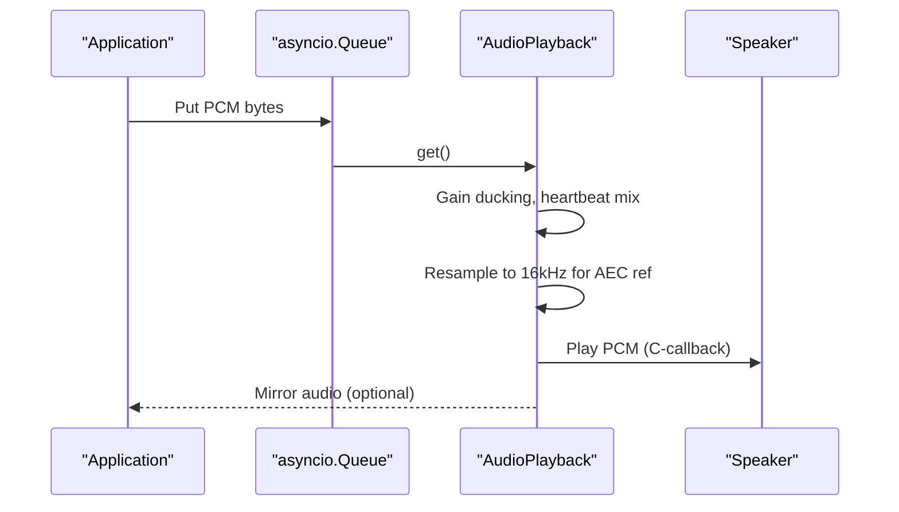

**Diagram sources**
- [core/audio/playback.py](file://core/audio/playback.py#L130-L241)

**Section sources**
- [core/audio/playback.py](file://core/audio/playback.py#L30-L241)

### Shared State and State Management
- AudioState: Thread-safe singleton with double-locking pattern for AEC metadata and playback transitions.
- AudioStateManager: Modern replacement with atomic updates, snapshots, and event emission.
- Far-end PCM ring buffer for AEC reference.

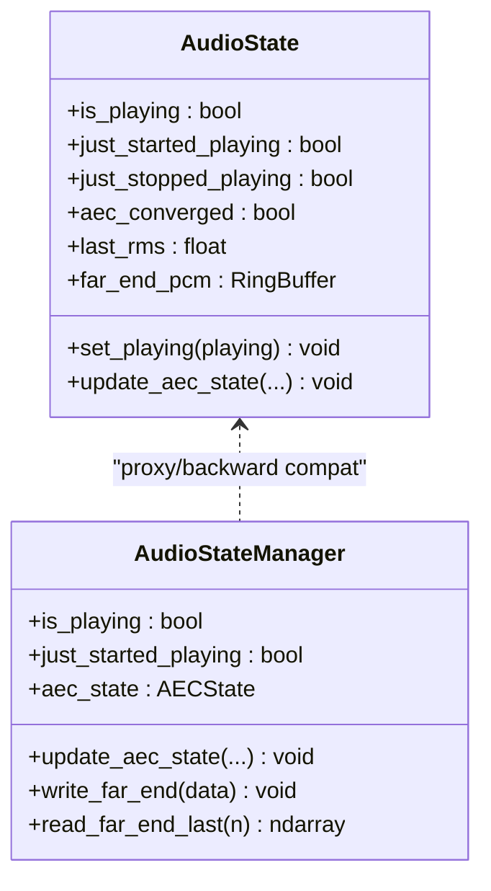

**Diagram sources**
- [core/audio/state.py](file://core/audio/state.py#L36-L159)
- [core/audio/state_manager.py](file://core/audio/state_manager.py#L59-L325)

**Section sources**
- [core/audio/state.py](file://core/audio/state.py#L36-L159)
- [core/audio/state_manager.py](file://core/audio/state_manager.py#L59-L325)

### Telemetry and Monitoring
- AudioTelemetryLogger: Frame metrics, latency tracking, ERLE, convergence, and session reporting.
- AudioTelemetry: Periodic paralinguistic features for HUD visualization.
- Best-effort counters and throttled telemetry broadcasts.

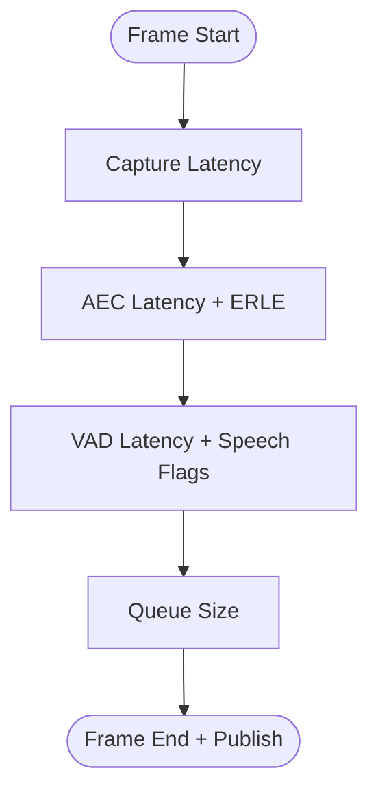

**Diagram sources**
- [core/audio/telemetry.py](file://core/audio/telemetry.py#L245-L321)
- [core/audio/telemetry.py](file://core/audio/telemetry.py#L394-L447)

**Section sources**
- [core/audio/telemetry.py](file://core/audio/telemetry.py#L193-L495)

### Paralinguistics and Spectral Analysis
- ParalinguisticAnalyzer: Pitch, speech rate, RMS variance, spectral centroid, engagement, and zen mode detection.
- SpectralAnalyzer: STFT, Bark bands, coherence, and ERLE helpers.

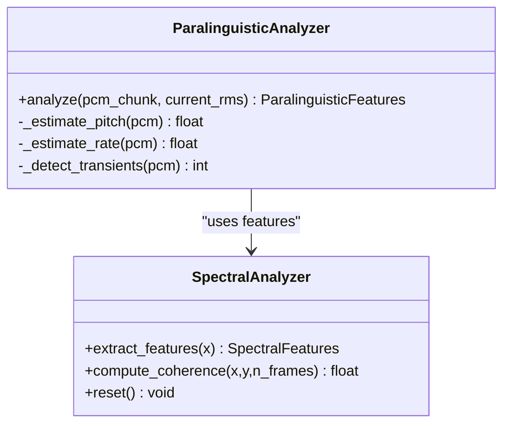

**Diagram sources**
- [core/audio/paralinguistics.py](file://core/audio/paralinguistics.py#L31-L214)
- [core/audio/spectral.py](file://core/audio/spectral.py#L250-L385)

**Section sources**
- [core/audio/paralinguistics.py](file://core/audio/paralinguistics.py#L1-L214)
- [core/audio/spectral.py](file://core/audio/spectral.py#L1-L503)

### Browser Audio Pipeline (Portal)
- useAudioPipeline: WebRTC capture at 16kHz, AudioWorklet PCM encoding, gapless playback scheduling, and barge-in.
- pcm-processor.js: Ring buffer, RMS energy, Int16 conversion, and zero-copy transfer to main thread.

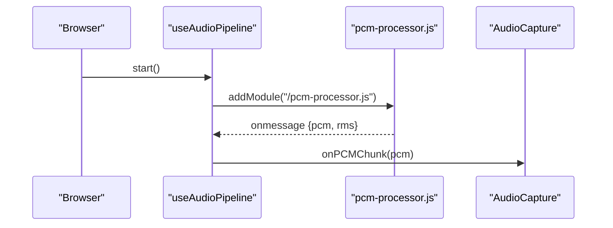

**Diagram sources**
- [apps/portal/src/hooks/useAudioPipeline.ts](file://apps/portal/src/hooks/useAudioPipeline.ts#L48-L134)
- [apps/portal/public/pcm-processor.js](file://apps/portal/public/pcm-processor.js#L31-L81)

**Section sources**
- [apps/portal/src/hooks/useAudioPipeline.ts](file://apps/portal/src/hooks/useAudioPipeline.ts#L27-L248)
- [apps/portal/public/pcm-processor.js](file://apps/portal/public/pcm-processor.js#L31-L81)

## Dependency Analysis
The core audio modules exhibit clear separation of concerns:
- capture.py depends on dynamic_aec.py, processing.py, state.py, and telemetry.py.
- dynamic_aec.py depends on spectral.py and uses BoundedBuffer for ring operations.
- processing.py optionally bridges to aether-cortex for acceleration.
- playback.py depends on state.py for playback flags and far-end PCM.
- state_manager.py provides a modern replacement for global state.
- paralinguistics.py leverages spectral features.
- The portal hook integrates with the backend via PCM chunks.

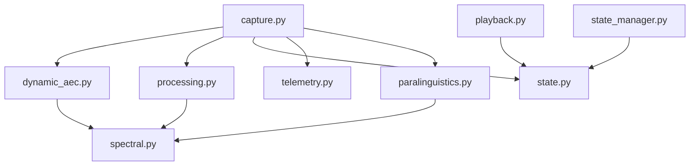

**Diagram sources**
- [core/audio/capture.py](file://core/audio/capture.py#L20-L32)
- [core/audio/dynamic_aec.py](file://core/audio/dynamic_aec.py#L21-L23)
- [core/audio/processing.py](file://core/audio/processing.py#L23-L36)
- [core/audio/playback.py](file://core/audio/playback.py#L24-L25)
- [core/audio/state_manager.py](file://core/audio/state_manager.py#L70-L96)

**Section sources**
- [core/audio/capture.py](file://core/audio/capture.py#L20-L32)
- [core/audio/dynamic_aec.py](file://core/audio/dynamic_aec.py#L21-L23)
- [core/audio/processing.py](file://core/audio/processing.py#L23-L36)
- [core/audio/playback.py](file://core/audio/playback.py#L24-L25)
- [core/audio/state_manager.py](file://core/audio/state_manager.py#L70-L96)

## Performance Considerations
- Hot-path separation: Keep DSP and gating inside callbacks minimal; push complex operations to asyncio side.
- Bounded queues and overflow policy: Drop oldest items to bound latency.
- Rust-first acceleration: aether-cortex provides significant speedup; fallback to NumPy is automatic.
- Best-effort telemetry: Use cheap counters and throttle broadcasts.
- Jitter buffer: Stabilizes AEC reference and reduces convergence loss.
- Gain scheduling: SmoothMuter avoids clicks and reduces artifacts.
- Latency budget: Frame metrics and telemetry enable continuous tuning.

[No sources needed since this section provides general guidance]

## Troubleshooting Guide
Common issues and diagnostics:
- AudioDeviceNotFoundError: Verify microphone and speaker availability; the capture/playback constructors raise explicit device errors.
- DeviceDisconnectedError: Speaker disconnection during playback; logs IO underflow warnings.
- BufferOverflowError: Playback buffer overflow; logs dropped chunks and continues.
- AECConvergenceError: Filter divergence or poor convergence; review ERLE trends and adjust parameters.
- Pipeline errors: Centralized AudioPipelineError for critical failures requiring restart.

Mitigations:
- Use interrupt() on playback to drain queues and prevent zombie audio.
- Monitor telemetry logs for latency spikes and queue drops.
- Adjust AEC parameters (step size, filter length) via update_config().
- Validate Rust backend presence; fallback to NumPy is automatic.

**Section sources**
- [core/audio/exceptions.py](file://core/audio/exceptions.py#L7-L52)
- [core/audio/playback.py](file://core/audio/playback.py#L202-L229)
- [core/audio/capture.py](file://core/audio/capture.py#L275-L301)
- [core/audio/telemetry.py](file://core/audio/telemetry.py#L324-L367)

## Conclusion
The Aether Voice OS audio pipeline combines real-time DSP with robust state management and telemetry. Its callback-first capture with Dynamic AEC, adaptive VAD, and browser-integrated PCM processing delivers low-latency, high-quality voice interaction suitable for live AI sessions. The modular design enables performance tuning, affective analytics, and continuous monitoring through comprehensive metrics and fallback strategies.