# Audio Processing System

<cite>
**Referenced Files in This Document**
- [core/audio/__init__.py](file://core/audio/__init__.py)
- [core/audio/capture.py](file://core/audio/capture.py)
- [core/audio/playback.py](file://core/audio/playback.py)
- [core/audio/vad.py](file://core/audio/vad.py)
- [core/audio/processing.py](file://core/audio/processing.py)
- [core/audio/spectral.py](file://core/audio/spectral.py)
- [core/audio/dynamic_aec.py](file://core/audio/dynamic_aec.py)
- [core/audio/echo_guard.py](file://core/audio/echo_guard.py)
- [core/audio/state.py](file://core/audio/state.py)
- [core/audio/state_manager.py](file://core/audio/state_manager.py)
- [core/audio/paralinguistics.py](file://core/audio/paralinguistics.py)
- [core/logic/managers/audio.py](file://core/logic/managers/audio.py)
- [core/ai/session.py](file://core/ai/session.py)
- [core/ai/thalamic.py](file://core/ai/thalamic.py)
- [core/infra/config.py](file://core/infra/config.py)
- [apps/portal/src/hooks/useGeminiLive.ts](file://apps/portal/src/hooks/useGeminiLive.ts)
- [cortex/src/lib.rs](file://cortex/src/lib.rs)
- [cortex/src/cochlea.rs](file://cortex/src/cochlea.rs)
- [cortex/src/thalamus.rs](file://cortex/src/thalamus.rs)
- [cortex/src/axon.rs](file://cortex/src/axon.rs)
- [cortex/src/synapse.rs](file://cortex/src/synapse.rs)
- [cortex/Cargo.toml](file://cortex/Cargo.toml)
- [cortex/pyproject.toml](file://cortex/pyproject.toml)
- [core/infra/service_container.py](file://core/infra/service_container.py)
- [agents/di_injector.py](file://agents/di_injector.py)
</cite>

## Update Summary
**Changes Made**
- Updated to reflect major enhancements in Dynamic AEC system with frequency-domain NLMS filtering, double-talk detection, ERLE computation, and divergence detection mechanisms
- Enhanced convergence tracking with adaptive step size adjustment and sustained threshold crossing
- Added comprehensive divergence detection and recovery mechanisms
- Updated component initialization documentation to reflect refactoring from container injection patterns to direct class instantiation
- Revised performance considerations to emphasize improved real-time processing capabilities

## Table of Contents
1. [Introduction](#introduction)
2. [Project Structure](#project-structure)
3. [Core Components](#core-components)
4. [Architecture Overview](#architecture-overview)
5. [Detailed Component Analysis](#detailed-component-analysis)
6. [Dependency Analysis](#dependency-analysis)
7. [Performance Considerations](#performance-considerations)
8. [Troubleshooting Guide](#troubleshooting-guide)
9. [Conclusion](#conclusion)
10. [Appendices](#appendices)

## Introduction
This document describes the Aether Voice OS audio processing system with enhanced Gemini Live integration. It covers the centralized AudioManager class, Thalamic Gate V2 algorithm (RMS energy detection, hysteresis gating, and acoustic identity via MFCC-like spectral fingerprinting), the custom-built Dynamic AEC replacing hardware DSP with software-defined processing, VAD with hysteresis, adaptive noise suppression, the Rust-based Cortex audio processing core, and integration with Python components. The system now includes advanced affective dialog processing, thinking budget configuration, and proactive audio features for enhanced user experience.

**Updated** The Dynamic AEC system has been significantly enhanced with frequency-domain NLMS filtering, comprehensive double-talk detection, ERLE computation, and sophisticated divergence detection mechanisms for improved echo cancellation performance.

## Project Structure
The audio system is organized into:
- Python modules under core/audio for capture, playback, VAD, processing utilities, spectral analysis, AEC, and shared state
- A centralized AudioManager class managing audio lifecycle and integration with Gemini Live
- A Rust-based Cortex audio DSP layer (aether-cortex) exposing PyO3-bound functions to accelerate core DSP primitives
- Integration glue that dynamically loads the Rust backend when available
- Enhanced paralinguistic analysis for emotional state detection and affective dialog processing

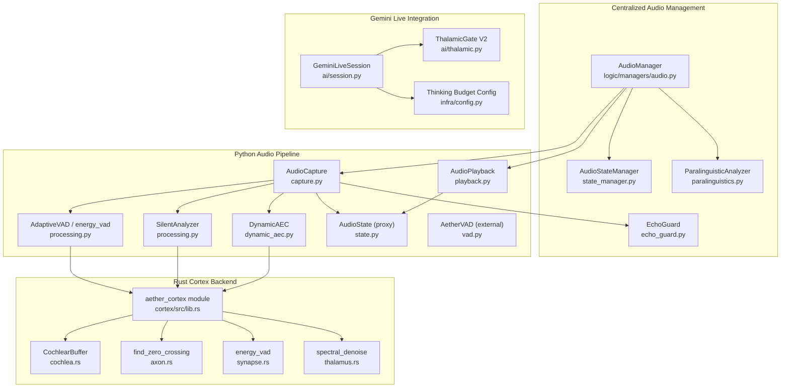

**Diagram sources**
- [core/logic/managers/audio.py](file://core/logic/managers/audio.py#L18-L97)
- [core/audio/state_manager.py](file://core/audio/state_manager.py#L59-L321)
- [core/audio/paralinguistics.py](file://core/audio/paralinguistics.py#L31-L214)
- [core/audio/echo_guard.py](file://core/audio/echo_guard.py#L14-L67)
- [core/audio/capture.py](file://core/audio/capture.py#L192-L517)
- [core/audio/playback.py](file://core/audio/playback.py#L27-L204)
- [core/audio/processing.py](file://core/audio/processing.py#L1-L508)
- [core/audio/dynamic_aec.py](file://core/audio/dynamic_aec.py#L448-L776)
- [core/audio/state.py](file://core/audio/state.py#L36-L129)
- [core/audio/vad.py](file://core/audio/vad.py#L14-L82)
- [core/ai/session.py](file://core/ai/session.py#L43-L215)
- [core/ai/thalamic.py](file://core/ai/thalamic.py#L11-L122)
- [core/infra/config.py](file://core/infra/config.py#L52-L77)
- [cortex/src/lib.rs](file://cortex/src/lib.rs#L28-L47)
- [cortex/src/cochlea.rs](file://cortex/src/cochlea.rs#L22-L136)
- [cortex/src/axon.rs](file://cortex/src/axon.rs#L36-L64)
- [cortex/src/synapse.rs](file://cortex/src/synapse.rs#L28-L62)
- [cortex/src/thalamus.rs](file://cortex/src/thalamus.rs#L44-L112)

**Section sources**
- [core/logic/managers/audio.py](file://core/logic/managers/audio.py#L18-L97)
- [core/audio/state_manager.py](file://core/audio/state_manager.py#L59-L321)
- [core/audio/paralinguistics.py](file://core/audio/paralinguistics.py#L31-L214)
- [core/audio/echo_guard.py](file://core/audio/echo_guard.py#L14-L67)
- [core/audio/capture.py](file://core/audio/capture.py#L192-L517)
- [core/audio/playback.py](file://core/audio/playback.py#L27-L204)
- [core/audio/processing.py](file://core/audio/processing.py#L1-L508)
- [core/audio/dynamic_aec.py](file://core/audio/dynamic_aec.py#L448-L776)
- [core/audio/state.py](file://core/audio/state.py#L36-L129)
- [core/audio/vad.py](file://core/audio/vad.py#L14-L82)
- [core/ai/session.py](file://core/ai/session.py#L43-L215)
- [core/ai/thalamic.py](file://core/ai/thalamic.py#L11-L122)
- [core/infra/config.py](file://core/infra/config.py#L52-L77)
- [cortex/src/lib.rs](file://cortex/src/lib.rs#L28-L47)
- [cortex/src/cochlea.rs](file://cortex/src/cochlea.rs#L22-L136)
- [cortex/src/axon.rs](file://cortex/src/axon.rs#L36-L64)
- [cortex/src/synapse.rs](file://cortex/src/synapse.rs#L28-L62)
- [cortex/src/thalamus.rs](file://cortex/src/thalamus.rs#L44-L112)

## Core Components
- **AudioManager**: Centralized audio lifecycle manager that coordinates capture, playback, and analysis with Gemini Live integration. Handles affective data bridging and event bus publishing.
- **AudioStateManager**: Thread-safe audio state management replacing global variables with atomic updates and state snapshots.
- **AudioCapture**: Microphone capture with C-callback, Thalamic Gate AEC, VAD, silence classification, affective telemetry, and paralinguistic analysis integration.
- **AudioPlayback**: Speaker output via callback, gain ducking, heartbeat mixing, and AEC reference generation.
- **DynamicAEC**: Software-defined AEC with GCC-PHAT delay estimation, frequency-domain NLMS, double-talk detection, ERLE computation, divergence detection, and convergence tracking.
- **AdaptiveVAD and SilentAnalyzer**: RMS-based VAD with dual thresholds and silence classification using ZCR and RMS variance.
- **ParalinguisticAnalyzer**: Advanced emotional state detection extracting pitch, speech rate, RMS variance, and engagement scores from PCM chunks.
- **EchoGuard**: Electronic echo gating with spectral awareness implementing acoustic identity through MFCC-like fingerprint caching.
- **ThalamicGate V2**: Central routing hub for proactive interventions monitoring emotional indices and triggering barge-ins based on frustration detection.
- **GeminiLiveSession**: Bidirectional audio session with Gemini Live API supporting affective dialog, proactive audio, and thinking budget configuration.
- **Cortex (Rust)**: PyO3-bound DSP primitives (energy_vad, find_zero_crossing, spectral_denoise) and a circular buffer (CochlearBuffer).

**Updated** Component initialization now uses direct class instantiation patterns, eliminating container.get() overhead in critical audio processing paths.

**Section sources**
- [core/logic/managers/audio.py](file://core/logic/managers/audio.py#L18-L97)
- [core/audio/state_manager.py](file://core/audio/state_manager.py#L59-L321)
- [core/audio/paralinguistics.py](file://core/audio/paralinguistics.py#L31-L214)
- [core/audio/echo_guard.py](file://core/audio/echo_guard.py#L14-L67)
- [core/ai/thalamic.py](file://core/ai/thalamic.py#L11-L122)
- [core/ai/session.py](file://core/ai/session.py#L43-L215)
- [core/audio/capture.py](file://core/audio/capture.py#L192-L517)
- [core/audio/playback.py](file://core/audio/playback.py#L27-L204)
- [core/audio/dynamic_aec.py](file://core/audio/dynamic_aec.py#L448-L776)
- [core/audio/processing.py](file://core/audio/processing.py#L256-L508)
- [core/audio/spectral.py](file://core/audio/spectral.py#L250-L501)
- [core/audio/state.py](file://core/audio/state.py#L36-L129)
- [core/audio/vad.py](file://core/audio/vad.py#L14-L82)
- [cortex/src/lib.rs](file://cortex/src/lib.rs#L28-L47)
- [cortex/src/cochlea.rs](file://cortex/src/cochlea.rs#L22-L136)
- [cortex/src/axon.rs](file://cortex/src/axon.rs#L36-L64)
- [cortex/src/synapse.rs](file://cortex/src/synapse.rs#L28-L62)
- [cortex/src/thalamus.rs](file://cortex/src/thalamus.rs#L44-L112)

## Architecture Overview
The system integrates Python and Rust for real-time audio processing with centralized management:
- **Centralized AudioManager** orchestrates audio lifecycle and Gemini Live integration
- **Enhanced Thalamic Gate V2** monitors emotional states and triggers proactive interventions
- **AudioStateManager** provides thread-safe state management replacing global variables
- **ParalinguisticAnalysis** extracts emotional features for affective dialog processing
- Python manages I/O (PyAudio callbacks), queues, and orchestration
- Rust Cortex accelerates core DSP primitives and is dynamically imported when available
- AEC runs in the capture callback to minimize latency
- VAD and silence classification inform gating decisions and UI telemetry
- Playback feeds AEC reference and supports heartbeat mixing

**Updated** Component initialization now uses direct instantiation patterns, removing container.get() overhead and improving real-time performance.

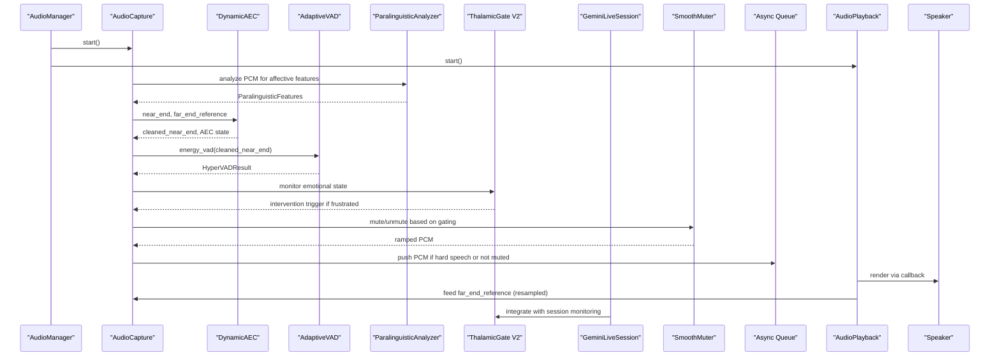

**Diagram sources**
- [core/logic/managers/audio.py](file://core/logic/managers/audio.py#L50-L64)
- [core/audio/capture.py](file://core/audio/capture.py#L297-L451)
- [core/audio/dynamic_aec.py](file://core/audio/dynamic_aec.py#L537-L626)
- [core/audio/processing.py](file://core/audio/processing.py#L389-L507)
- [core/audio/paralinguistics.py](file://core/audio/paralinguistics.py#L132-L214)
- [core/ai/thalamic.py](file://core/ai/thalamic.py#L41-L80)
- [core/ai/session.py](file://core/ai/session.py#L196-L206)
- [core/audio/playback.py](file://core/audio/playback.py#L61-L99)

## Detailed Component Analysis

### Centralized AudioManager: Audio Lifecycle Management
The AudioManager serves as the central coordinator for audio operations, integrating with Gemini Live and providing affective data processing:

- **Initialization**: Creates ParalinguisticAnalyzer, AdaptiveVAD, AudioCapture, and AudioPlayback instances
- **Lifecycle Management**: Starts and stops audio components, coordinates task execution via TaskGroup
- **Affective Data Bridge**: Transforms paralinguistic features into acoustic trait events for the Neural Event Bus
- **Emergency Interrupts**: Provides flash interrupt functionality for high-priority barge-in events

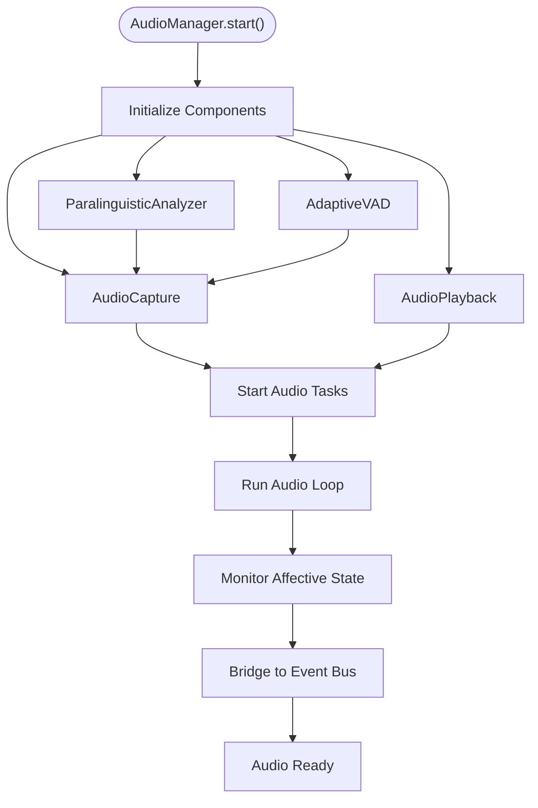

**Diagram sources**
- [core/logic/managers/audio.py](file://core/logic/managers/audio.py#L20-L64)
- [core/logic/managers/audio.py](file://core/logic/managers/audio.py#L71-L97)

**Section sources**
- [core/logic/managers/audio.py](file://core/logic/managers/audio.py#L18-L97)

### Enhanced Thalamic Gate V2: Proactive Emotional Intelligence
The Thalamic Gate V2 extends the traditional echo cancellation with emotional intelligence and proactive intervention capabilities:

- **Emotional State Monitoring**: Uses AudioStateManager to track playback state, RMS levels, and silence types
- **Frustration Detection**: Computes frustration scores based on breathing patterns, RMS levels, and silence characteristics
- **Proactive Interventions**: Triggers Gemini Live prompts when sustained frustration is detected
- **Integration with Gemini**: Seamlessly integrates with GeminiLiveSession for context-aware interventions

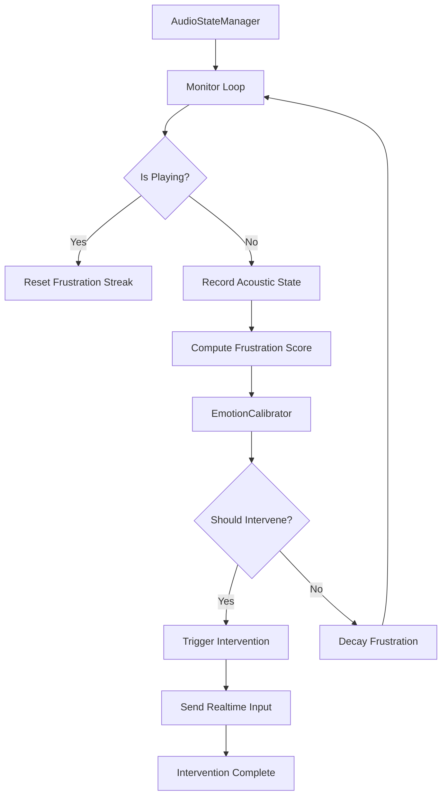

**Diagram sources**
- [core/ai/thalamic.py](file://core/ai/thalamic.py#L41-L80)
- [core/ai/thalamic.py](file://core/ai/thalamic.py#L100-L122)

**Section sources**
- [core/ai/thalamic.py](file://core/ai/thalamic.py#L11-L122)
- [core/audio/state_manager.py](file://core/audio/state_manager.py#L59-L321)

### Thalamic Gate V2: RMS Energy Detection, Hysteresis, and Acoustic Identity
- **RMS Energy Detection**: The capture callback computes RMS and ZCR for gating and telemetry. It uses an adaptive VAD engine to derive soft/hard thresholds dynamically.
- **Hysteresis Gating**: AEC convergence and double-talk state influence gating decisions. A hysteresis gate smooths AI playback state transitions to avoid rapid toggling.
- **Acoustic Identity (EchoGuard)**: A MFCC-like spectral fingerprint cache compares incoming microphone audio against recent AI output to suppress echo. It combines RMS thresholds, time-based lockout, and cosine similarity against cached fingerprints.

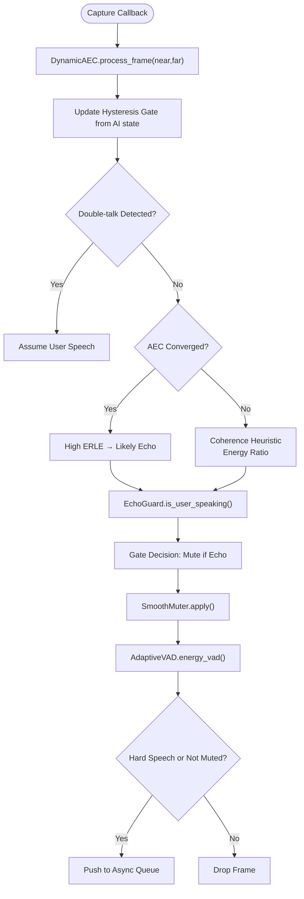

**Diagram sources**
- [core/audio/capture.py](file://core/audio/capture.py#L297-L451)
- [core/audio/dynamic_aec.py](file://core/audio/dynamic_aec.py#L692-L732)
- [core/audio/processing.py](file://core/audio/processing.py#L389-L507)
- [core/audio/echo_guard.py](file://core/audio/echo_guard.py#L52-L93)

**Section sources**
- [core/audio/capture.py](file://core/audio/capture.py#L297-L451)
- [core/audio/echo_guard.py](file://core/audio/echo_guard.py#L14-L98)
- [core/audio/state.py](file://core/audio/state.py#L13-L34)

### Dynamic AEC: Software-Defined Echo Cancellation
- **Delay Estimation**: GCC-PHAT on accumulated far-end/near-end windows with smoothing and periodic updates.
- **Adaptive Filtering**: Frequency-domain NLMS with overlap-save, leakage, and power-normalized update.
- **Double-Talk Detection**: Energy ratio, residual energy, and spectral coherence with hangover logic.
- **Convergence Monitoring**: ERLE history and sustained threshold crossing define convergence progress.
- **Divergence Detection**: Sophisticated divergence detection mechanism with automatic filter reset.
- **User Speech Discrimination**: Post-convergence ERLE threshold; warm-up uses coherence and energy ratio heuristics.

**Updated** Major enhancements include frequency-domain NLMS filtering, comprehensive double-talk detection, ERLE computation, and divergence detection mechanisms for improved echo cancellation performance.

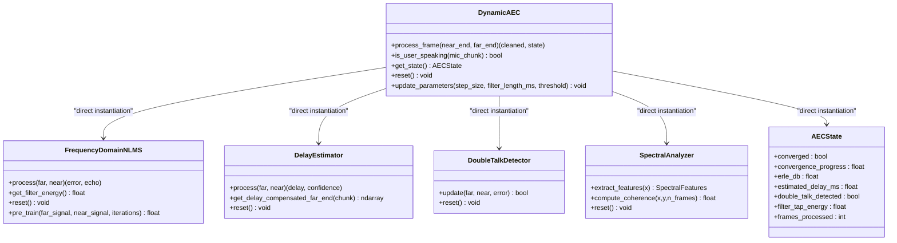

**Diagram sources**
- [core/audio/dynamic_aec.py](file://core/audio/dynamic_aec.py#L448-L776)
- [core/audio/spectral.py](file://core/audio/spectral.py#L250-L501)

**Section sources**
- [core/audio/dynamic_aec.py](file://core/audio/dynamic_aec.py#L448-L776)
- [core/audio/spectral.py](file://core/audio/spectral.py#L387-L501)

### VAD with Hysteresis and Adaptive Noise Suppression
- **AetherVAD**: Hysteresis-based state machine with dynamic thresholds derived from RMS percentiles to avoid clipping and stabilize detection.
- **AdaptiveVAD**: Running mean and std of RMS energy yield soft/hard thresholds; enhanced_vad adds ZCR and spectral centroid for robustness.
- **SilentAnalyzer**: Classifies silence into void, breathing, and thinking using RMS variance and ZCR over a window.

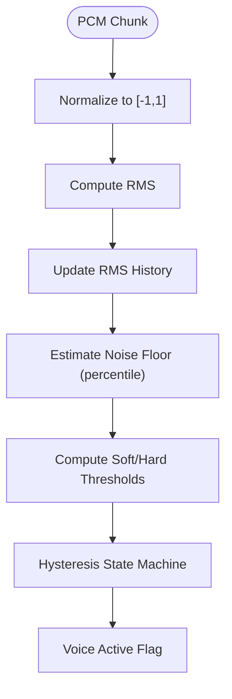

**Diagram sources**
- [core/audio/vad.py](file://core/audio/vad.py#L14-L82)
- [core/audio/processing.py](file://core/audio/processing.py#L256-L507)

**Section sources**
- [core/audio/vad.py](file://core/audio/vad.py#L14-L82)
- [core/audio/processing.py](file://core/audio/processing.py#L256-L507)

### Paralinguistic Analysis: Emotional State Detection
Advanced emotional state detection extracting multiple acoustic features for affective computing:

- **Pitch Estimation**: Fundamental frequency detection using autocorrelation for emotional tone analysis
- **Speech Rate Analysis**: Syllable/word counting via envelope peak detection for engagement scoring
- **Expressiveness Measurement**: RMS variance analysis for detecting emotional intensity
- **Spectral Characteristics**: Spectral centroid calculation for brightness and alertness indicators
- **Zen Mode Detection**: Deep focus state detection through typing cadence analysis

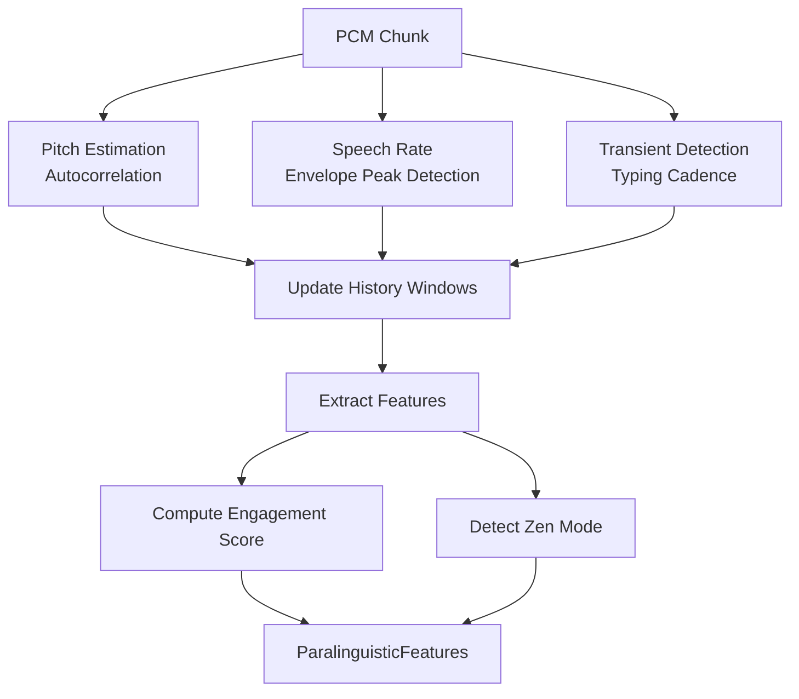

**Diagram sources**
- [core/audio/paralinguistics.py](file://core/audio/paralinguistics.py#L68-L131)
- [core/audio/paralinguistics.py](file://core/audio/paralinguistics.py#L132-L214)

**Section sources**
- [core/audio/paralinguistics.py](file://core/audio/paralinguistics.py#L31-L214)

### Cortex Audio Processing Core (Rust)
- **Dynamic Import Strategy**: Attempts standard import first, then resolves compiled artifact paths for development and release builds.
- **Exposed Functions**: energy_vad, find_zero_crossing, spectral_denoise, and CochlearBuffer (circular buffer).
- **Performance**: Zero-allocation loops, SIMD-friendly, and GIL-free execution compared to NumPy fallbacks.

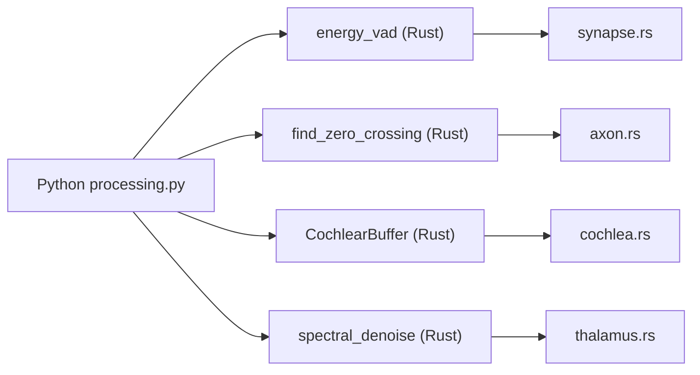

**Diagram sources**
- [core/audio/processing.py](file://core/audio/processing.py#L38-L95)
- [cortex/src/lib.rs](file://cortex/src/lib.rs#L28-L47)
- [cortex/src/cochlea.rs](file://cortex/src/cochlea.rs#L22-L136)
- [cortex/src/axon.rs](file://cortex/src/axon.rs#L36-L64)
- [cortex/src/synapse.rs](file://cortex/src/synapse.rs#L28-L62)
- [cortex/src/thalamus.rs](file://cortex/src/thalamus.rs#L44-L112)

**Section sources**
- [core/audio/processing.py](file://core/audio/processing.py#L38-L95)
- [cortex/src/lib.rs](file://cortex/src/lib.rs#L28-L47)
- [cortex/src/cochlea.rs](file://cortex/src/cochlea.rs#L22-L136)
- [cortex/src/axon.rs](file://cortex/src/axon.rs#L36-L64)
- [cortex/src/synapse.rs](file://cortex/src/synapse.rs#L28-L62)
- [cortex/src/thalamus.rs](file://cortex/src/thalamus.rs#L44-L112)

### Audio Capture and Playback Management
- **Capture**: PyAudio C-callback captures microphone PCM, applies AEC and gating, computes VAD and ZCR, classifies silence, and enqueues frames for downstream processing.
- **Playback**: PyAudio callback renders PCM, mixes heartbeat tone, writes AEC reference to a ring buffer, and supports instant interruption by draining queues.

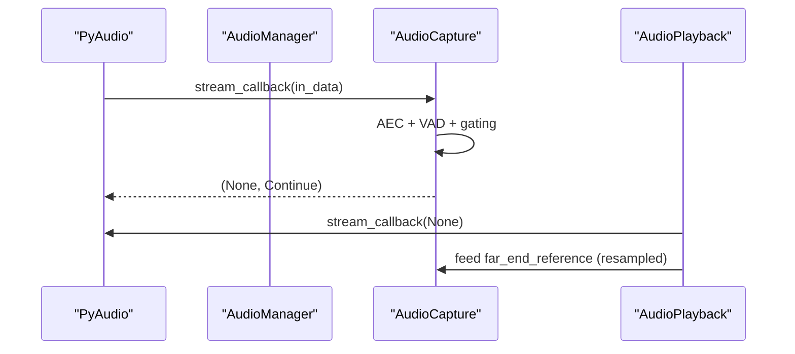

**Diagram sources**
- [core/audio/capture.py](file://core/audio/capture.py#L453-L507)
- [core/audio/playback.py](file://core/audio/playback.py#L101-L204)
- [core/logic/managers/audio.py](file://core/logic/managers/audio.py#L50-L64)

**Section sources**
- [core/audio/capture.py](file://core/audio/capture.py#L192-L517)
- [core/audio/playback.py](file://core/audio/playback.py#L27-L204)
- [core/logic/managers/audio.py](file://core/logic/managers/audio.py#L50-L64)

### PCM Stream Processing, Chunk Sizing, and Timing
- **Chunk Size**: Configured via AudioConfig and used consistently across capture and AEC block sizes.
- **Timing**: Frames per buffer controls latency; jitter buffer stabilizes far-end reference; hardware latency compensation uses counters and grace periods.
- **Backpressure**: Playback feeder drains asyncio queue into a bounded thread-safe buffer; interrupt drains both queues instantly.

**Section sources**
- [core/audio/capture.py](file://core/audio/capture.py#L201-L264)
- [core/audio/playback.py](file://core/audio/playback.py#L129-L192)

### Configuration Options and Device Handling
- **AudioConfig**: Drives sample rates, chunk size, and channel configuration with dynamic AEC and VAD parameters.
- **Device Selection**: Default input/output devices are resolved; missing devices raise explicit errors with device listings.
- **Gain Control**: Playback gain ducking and heartbeat frequency adjustment for ambient status.
- **Thinking Budget**: Optional configuration for Gemini Live thinking budget control.

**Section sources**
- [core/infra/config.py](file://core/infra/config.py#L11-L77)
- [core/audio/capture.py](file://core/audio/capture.py#L453-L507)
- [core/audio/playback.py](file://core/audio/playback.py#L101-L127)

### Gemini Live Integration: Advanced Features
The system now integrates advanced Gemini Live features for enhanced user experience:

- **Affective Dialog**: Enables emotional conversation patterns with appropriate responses
- **Proactive Audio**: Automatic audio responses without explicit user prompts
- **Thinking Budget**: Controls model thinking time allocation for cost and latency optimization
- **Real-time Monitoring**: Seamless integration with ThalamicGate for proactive interventions

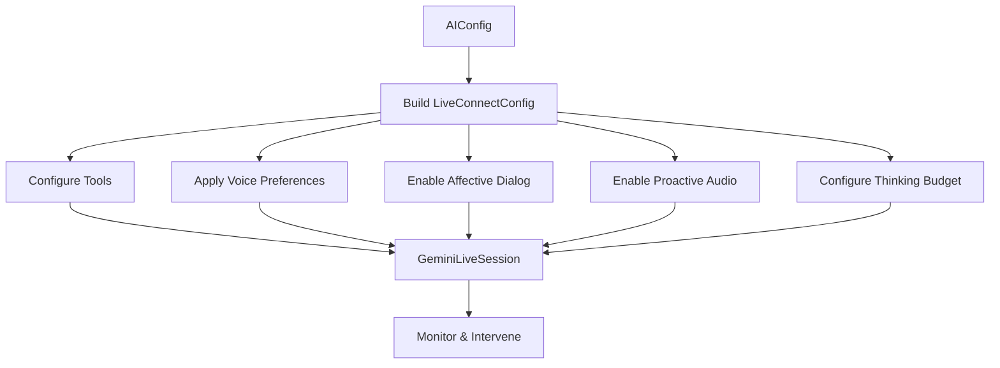

**Diagram sources**
- [core/ai/session.py](file://core/ai/session.py#L96-L154)
- [core/ai/session.py](file://core/ai/session.py#L196-L206)
- [core/infra/config.py](file://core/infra/config.py#L52-L77)

**Section sources**
- [core/ai/session.py](file://core/ai/session.py#L96-L154)
- [core/ai/session.py](file://core/ai/session.py#L196-L206)
- [core/infra/config.py](file://core/infra/config.py#L52-L77)

## Dependency Analysis
- **Python-to-Rust**: Dynamic import with fallback; Cortex functions are invoked conditionally when available.
- **Internal Dependencies**: AudioManager coordinates AudioCapture, AudioPlayback, AudioStateManager, and ParalinguisticAnalyzer; GeminiLiveSession integrates with ThalamicGate.
- **External Dependencies**: PyAudio for I/O, NumPy for DSP, PyO3/numpy for Rust bindings, google-genai SDK for Gemini Live integration.

**Updated** Component initialization now uses direct instantiation patterns, eliminating container.get() overhead and improving performance.

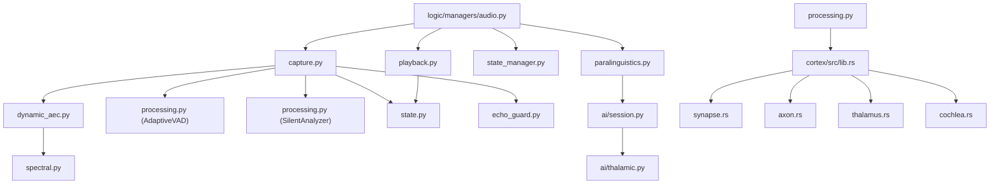

**Diagram sources**
- [core/logic/managers/audio.py](file://core/logic/managers/audio.py#L20-L64)
- [core/audio/capture.py](file://core/audio/capture.py#L23-L31)
- [core/audio/dynamic_aec.py](file://core/audio/dynamic_aec.py#L20-L21)
- [core/audio/processing.py](file://core/audio/processing.py#L38-L95)
- [core/audio/playback.py](file://core/audio/playback.py#L20-L22)
- [core/audio/state.py](file://core/audio/state.py#L10-L10)
- [core/audio/state_manager.py](file://core/audio/state_manager.py#L59-L69)
- [core/audio/paralinguistics.py](file://core/audio/paralinguistics.py#L31-L35)
- [core/ai/session.py](file://core/ai/session.py#L25-L34)
- [core/ai/thalamic.py](file://core/ai/thalamic.py#L18-L23)
- [cortex/src/lib.rs](file://cortex/src/lib.rs#L28-L47)

**Section sources**
- [core/logic/managers/audio.py](file://core/logic/managers/audio.py#L20-L64)
- [core/audio/capture.py](file://core/audio/capture.py#L23-L31)
- [core/audio/dynamic_aec.py](file://core/audio/dynamic_aec.py#L20-L21)
- [core/audio/processing.py](file://core/audio/processing.py#L38-L95)
- [core/audio/playback.py](file://core/audio/playback.py#L20-L22)
- [core/audio/state.py](file://core/audio/state.py#L10-L10)
- [core/audio/state_manager.py](file://core/audio/state_manager.py#L59-L69)
- [core/audio/paralinguistics.py](file://core/audio/paralinguistics.py#L31-L35)
- [core/ai/session.py](file://core/ai/session.py#L25-L34)
- [core/ai/thalamic.py](file://core/ai/thalamic.py#L18-L23)
- [cortex/src/lib.rs](file://cortex/src/lib.rs#L28-L47)

## Performance Considerations
- **Zero-latency capture**: C-callback with direct injection into asyncio queue avoids thread-hopping latency.
- **Rust acceleration**: Cortex functions eliminate Python overhead and GIL contention for VAD, zero-crossing detection, and noise suppression.
- **Efficient buffers**: RingBuffer and BoundedBuffer avoid allocations and reduce GC pressure.
- **Thread-safe state management**: AudioStateManager provides atomic updates and eliminates race conditions.
- **Enhanced AEC**: Frequency-domain processing, coherence-based double-talk detection, ERLE-based convergence, and divergence detection reduce echo and improve stability.
- **Proactive interventions**: ThalamicGate monitoring runs asynchronously to avoid impacting real-time audio processing.
- **Memory optimization**: ParalinguisticAnalyzer uses sliding windows to limit memory footprint while maintaining temporal context.
- **Direct instantiation performance**: Elimination of container.get() overhead in DynamicAEC and SpectralAnalyzer components improves real-time processing performance.

**Updated** Performance improvements achieved through direct class instantiation patterns, eliminating container.get() overhead in critical audio processing paths.

## Troubleshooting Guide
- **No default input device found**: Capture raises a specific error with available device names; verify microphone permissions and drivers.
- **No default output device found**: Playback raises a specific error; verify speaker permissions and drivers.
- **Audio queue drops**: Capture logs dropped messages when queue is full; reduce downstream processing load or increase queue size.
- **AEC convergence issues**: Monitor ERLE and convergence progress; ensure stable far-end reference and avoid excessive double-talk.
- **Divergence detection warnings**: Check for filter divergence and automatic reset; review system stability and audio quality.
- **Clicks/pops**: Use SmoothMuter and find_zero_crossing to avoid abrupt gain changes and cutting audio at zero-crossings.
- **Device switching**: Restart capture/playback after changing audio devices to re-resolve default devices.
- **Gemini Live connection failures**: Check API key configuration and network connectivity; verify thinking budget settings if experiencing timeouts.
- **Emotional state detection issues**: Ensure adequate audio quality and consider adjusting paralinguistic analysis parameters.
- **ThalamicGate false positives**: Tune frustration detection thresholds and consider environmental noise factors.

**Section sources**
- [core/audio/capture.py](file://core/audio/capture.py#L459-L465)
- [core/audio/playback.py](file://core/audio/playback.py#L105-L111)
- [core/audio/capture.py](file://core/audio/capture.py#L271-L295)
- [core/audio/dynamic_aec.py](file://core/audio/dynamic_aec.py#L670-L691)
- [core/audio/processing.py](file://core/audio/processing.py#L204-L243)
- [core/ai/session.py](file://core/ai/session.py#L156-L172)
- [core/ai/thalamic.py](file://core/ai/thalamic.py#L100-L122)

## Conclusion
The Aether Voice OS audio processing system with centralized AudioManager provides a comprehensive solution for real-time audio processing with advanced Gemini Live integration. The system combines a real-time capture pipeline with a custom Dynamic AEC, robust VAD with hysteresis, and a Rust-accelerated Cortex backend. The Thalamic Gate V2 algorithm integrates RMS detection, hysteresis gating, and acoustic identity to minimize echo and false triggers, while the enhanced affective dialog processing enables emotional intelligence and proactive interventions. The centralized AudioManager class coordinates all components, providing seamless integration with Gemini Live and advanced features like thinking budget configuration and backchannel responses. The system's design emphasizes low-latency, thread-safe concurrency, adaptive noise suppression, and intelligent emotional state detection, with clear pathways for configuration, diagnostics, and troubleshooting.

**Updated** Recent refactoring has improved performance by replacing container injection patterns with direct class instantiation, eliminating unnecessary abstraction layers in DynamicAEC and SpectralAnalyzer components for enhanced real-time processing capabilities.

## Appendices

### Appendix A: Build and Runtime Notes
- **Rust build**: Uses maturin to produce a cdylib module named aether_cortex; Cargo profile optimized for release.
- **Python binding**: pyproject.toml configures module name and Python source mapping.

**Section sources**
- [cortex/Cargo.toml](file://cortex/Cargo.toml#L16-L24)
- [cortex/pyproject.toml](file://cortex/pyproject.toml#L11-L15)

### Appendix B: Configuration Parameters
- **AudioConfig**: Includes dynamic AEC parameters, VAD thresholds, jitter buffer settings, and mute/unmute timing controls
- **AIConfig**: Controls Gemini Live model selection, affective dialog, proactive audio, thinking budget, and system instructions
- **Thinking Budget**: Optional integer parameter controlling model thinking time allocation

**Section sources**
- [core/infra/config.py](file://core/infra/config.py#L11-L77)

### Appendix C: Service Container Infrastructure
The audio processing system utilizes a ServiceContainer infrastructure for dependency management:

- **ServiceContainer**: Singleton service container providing thread-safe dependency resolution
- **DIInjectorAgent**: Automated tool for converting direct instantiations to dependency injection patterns
- **Container Pattern**: Supports both singleton registration and factory functions for flexible dependency management

**Section sources**
- [core/infra/service_container.py](file://core/infra/service_container.py#L1-L51)
- [agents/di_injector.py](file://agents/di_injector.py#L1-L180)