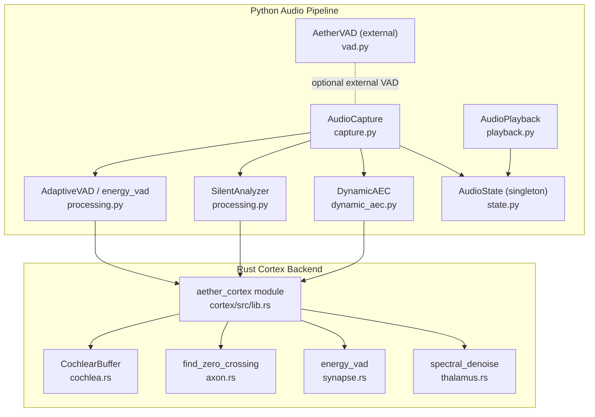
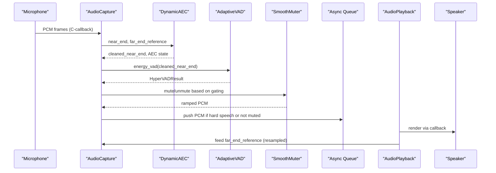
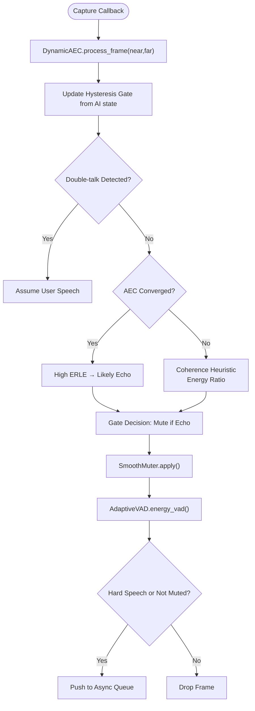
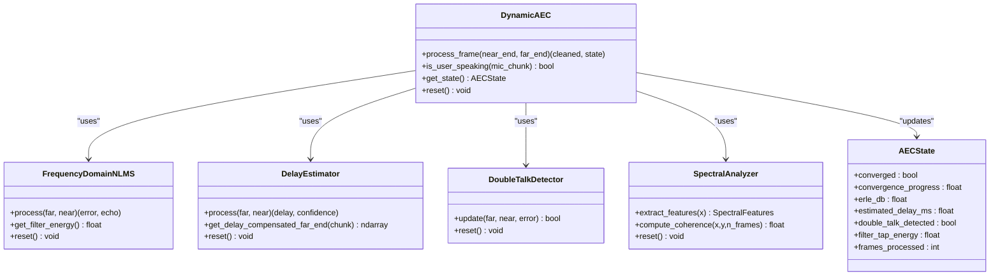
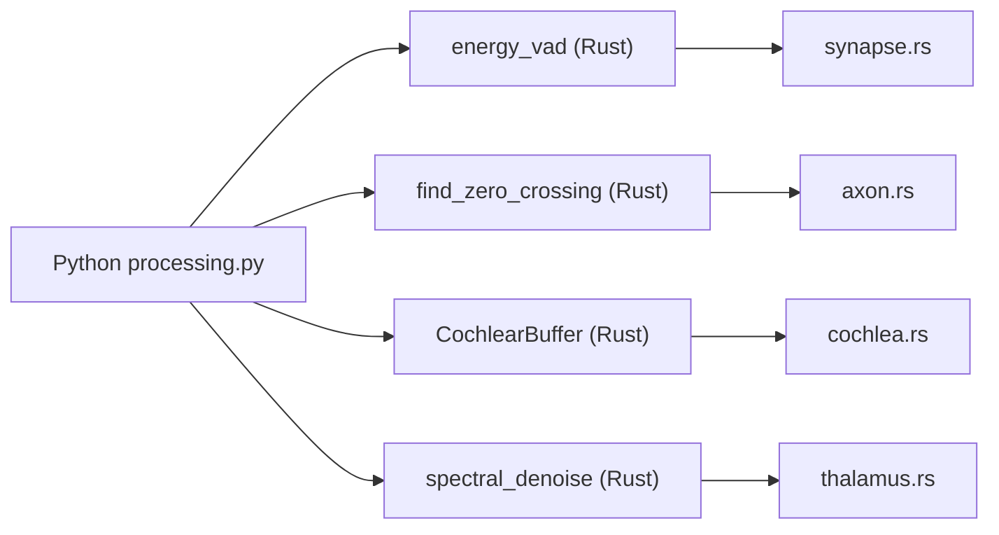
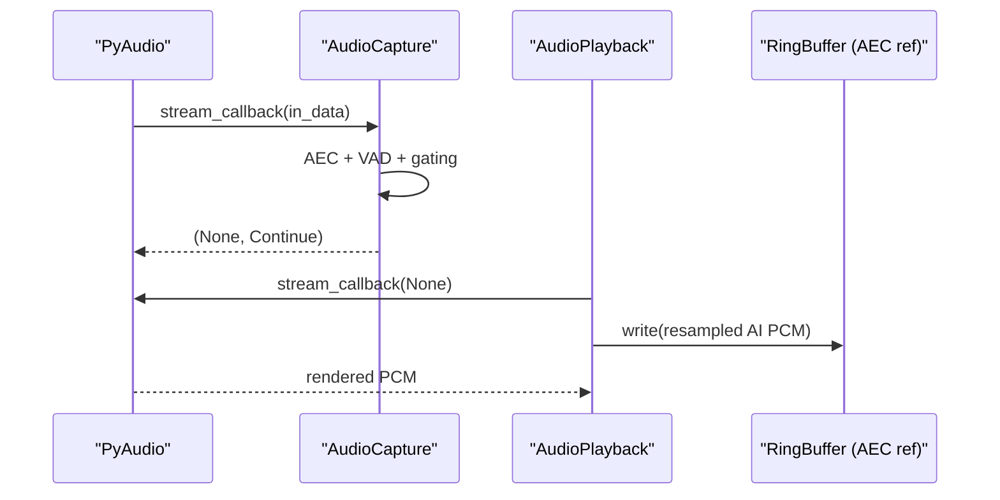
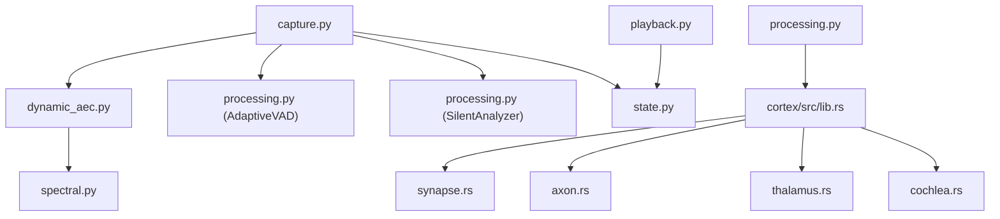

# Audio Processing System

<cite>
**Referenced Files in This Document**
- [core/audio/__init__.py](file://core/audio/__init__.py)
- [core/audio/capture.py](file://core/audio/capture.py)
- [core/audio/playback.py](file://core/audio/playback.py)
- [core/audio/vad.py](file://core/audio/vad.py)
- [core/audio/processing.py](file://core/audio/processing.py)
- [core/audio/spectral.py](file://core/audio/spectral.py)
- [core/audio/dynamic_aec.py](file://core/audio/dynamic_aec.py)
- [core/audio/echo_guard.py](file://core/audio/echo_guard.py)
- [core/audio/state.py](file://core/audio/state.py)
- [cortex/src/lib.rs](file://cortex/src/lib.rs)
- [cortex/src/cochlea.rs](file://cortex/src/cochlea.rs)
- [cortex/src/thalamus.rs](file://cortex/src/thalamus.rs)
- [cortex/src/axon.rs](file://cortex/src/axon.rs)
- [cortex/src/synapse.rs](file://cortex/src/synapse.rs)
- [cortex/Cargo.toml](file://cortex/Cargo.toml)
- [cortex/pyproject.toml](file://cortex/pyproject.toml)
</cite>

## Table of Contents
1. [Introduction](#introduction)
2. [Project Structure](#project-structure)
3. [Core Components](#core-components)
4. [Architecture Overview](#architecture-overview)
5. [Detailed Component Analysis](#detailed-component-analysis)
6. [Dependency Analysis](#dependency-analysis)
7. [Performance Considerations](#performance-considerations)
8. [Troubleshooting Guide](#troubleshooting-guide)
9. [Conclusion](#conclusion)
10. [Appendices](#appendices)

## Introduction
This document describes the Aether Voice OS audio processing system. It covers the Thalamic Gate V2 algorithm (RMS energy detection, hysteresis gating, and acoustic identity via MFCC-like spectral fingerprinting), the custom-built Dynamic AEC replacing hardware DSP with software-defined processing, VAD with hysteresis, adaptive noise suppression, the Rust-based Cortex audio processing core, and integration with Python components. It also documents audio capture and playback management, device handling, latency compensation, PCM stream processing, chunk sizing, timing considerations, real-time performance optimization, configuration options, and troubleshooting.

## Project Structure
The audio system is organized into:
- Python modules under core/audio for capture, playback, VAD, processing utilities, spectral analysis, AEC, and shared state
- A Rust-based Cortex audio DSP layer (aether-cortex) exposing PyO3-bound functions to accelerate core DSP primitives
- Integration glue that dynamically loads the Rust backend when available

**Diagram sources**
- [core/audio/capture.py](file://core/audio/capture.py#L192-L517)
- [core/audio/playback.py](file://core/audio/playback.py#L27-L204)
- [core/audio/processing.py](file://core/audio/processing.py#L1-L508)
- [core/audio/dynamic_aec.py](file://core/audio/dynamic_aec.py#L448-L776)
- [core/audio/state.py](file://core/audio/state.py#L36-L129)
- [core/audio/vad.py](file://core/audio/vad.py#L14-L82)
- [cortex/src/lib.rs](file://cortex/src/lib.rs#L28-L47)
- [cortex/src/cochlea.rs](file://cortex/src/cochlea.rs#L22-L136)
- [cortex/src/axon.rs](file://cortex/src/axon.rs#L36-L64)
- [cortex/src/synapse.rs](file://cortex/src/synapse.rs#L28-L62)
- [cortex/src/thalamus.rs](file://cortex/src/thalamus.rs#L44-L112)

**Section sources**
- [core/audio/__init__.py](file://core/audio/__init__.py#L1-L2)
- [core/audio/capture.py](file://core/audio/capture.py#L1-L517)
- [core/audio/playback.py](file://core/audio/playback.py#L1-L204)
- [core/audio/processing.py](file://core/audio/processing.py#L1-L508)
- [core/audio/dynamic_aec.py](file://core/audio/dynamic_aec.py#L1-L776)
- [core/audio/state.py](file://core/audio/state.py#L1-L129)
- [core/audio/vad.py](file://core/audio/vad.py#L1-L82)
- [cortex/src/lib.rs](file://cortex/src/lib.rs#L1-L48)
- [cortex/src/cochlea.rs](file://cortex/src/cochlea.rs#L1-L213)
- [cortex/src/axon.rs](file://cortex/src/axon.rs#L1-L121)
- [cortex/src/synapse.rs](file://cortex/src/synapse.rs#L1-L117)
- [cortex/src/thalamus.rs](file://cortex/src/thalamus.rs#L1-L154)
- [cortex/Cargo.toml](file://cortex/Cargo.toml#L1-L24)
- [cortex/pyproject.toml](file://cortex/pyproject.toml#L1-L15)

## Core Components
- AudioCapture: Microphone capture with C-callback, Thalamic Gate AEC, VAD, silence classification, and affective telemetry. Implements a smooth muter, jitter buffer, and hysteresis gating.
- AudioPlayback: Speaker output via callback, gain ducking, heartbeat mixing, and AEC reference generation.
- DynamicAEC: Software-defined AEC with GCC-PHAT delay estimation, frequency-domain NLMS, double-talk detection, ERLE computation, and convergence tracking.
- AdaptiveVAD and SilentAnalyzer: RMS-based VAD with dual thresholds and silence classification using ZCR and RMS variance.
- Spectral: STFT, Bark-scale analysis, coherence, and ERLE utilities for AEC and diagnostics.
- AudioState: Thread-safe singleton for shared audio state and telemetry counters.
- Cortex (Rust): PyO3-bound DSP primitives (energy_vad, find_zero_crossing, spectral_denoise) and a circular buffer (CochlearBuffer).

**Section sources**
- [core/audio/capture.py](file://core/audio/capture.py#L192-L517)
- [core/audio/playback.py](file://core/audio/playback.py#L27-L204)
- [core/audio/dynamic_aec.py](file://core/audio/dynamic_aec.py#L448-L776)
- [core/audio/processing.py](file://core/audio/processing.py#L256-L508)
- [core/audio/spectral.py](file://core/audio/spectral.py#L250-L501)
- [core/audio/state.py](file://core/audio/state.py#L36-L129)
- [cortex/src/lib.rs](file://cortex/src/lib.rs#L28-L47)
- [cortex/src/cochlea.rs](file://cortex/src/cochlea.rs#L22-L136)
- [cortex/src/axon.rs](file://cortex/src/axon.rs#L36-L64)
- [cortex/src/synapse.rs](file://cortex/src/synapse.rs#L28-L62)
- [cortex/src/thalamus.rs](file://cortex/src/thalamus.rs#L44-L112)

## Architecture Overview
The system integrates Python and Rust for real-time audio processing:
- Python manages I/O (PyAudio callbacks), queues, and orchestration
- Rust Cortex accelerates core DSP primitives and is dynamically imported when available
- AEC runs in the capture callback to minimize latency
- VAD and silence classification inform gating decisions and UI telemetry
- Playback feeds AEC reference and supports heartbeat mixing

**Diagram sources**
- [core/audio/capture.py](file://core/audio/capture.py#L297-L451)
- [core/audio/dynamic_aec.py](file://core/audio/dynamic_aec.py#L537-L626)
- [core/audio/processing.py](file://core/audio/processing.py#L389-L507)
- [core/audio/playback.py](file://core/audio/playback.py#L61-L99)

## Detailed Component Analysis

### Thalamic Gate V2: RMS Energy Detection, Hysteresis, and Acoustic Identity
- RMS Energy Detection: The capture callback computes RMS and ZCR for gating and telemetry. It uses an adaptive VAD engine to derive soft/hard thresholds dynamically.
- Hysteresis Gating: AEC convergence and double-talk state influence gating decisions. A hysteresis gate smooths AI playback state transitions to avoid rapid toggling.
- Acoustic Identity (EchoGuard): A MFCC-like spectral fingerprint cache compares incoming microphone audio against recent AI output to suppress echo. It combines RMS thresholds, time-based lockout, and cosine similarity against cached fingerprints.

**Diagram sources**
- [core/audio/capture.py](file://core/audio/capture.py#L297-L451)
- [core/audio/dynamic_aec.py](file://core/audio/dynamic_aec.py#L692-L732)
- [core/audio/processing.py](file://core/audio/processing.py#L389-L507)
- [core/audio/echo_guard.py](file://core/audio/echo_guard.py#L52-L93)

**Section sources**
- [core/audio/capture.py](file://core/audio/capture.py#L297-L451)
- [core/audio/echo_guard.py](file://core/audio/echo_guard.py#L14-L98)
- [core/audio/state.py](file://core/audio/state.py#L13-L34)

### Dynamic AEC: Software-Defined Echo Cancellation
- Delay Estimation: GCC-PHAT on accumulated far-end/near-end windows with smoothing and periodic updates.
- Adaptive Filtering: Frequency-domain NLMS with overlap-save, leakage, and power-normalized update.
- Double-Talk Detection: Energy ratio, residual energy, and spectral coherence with hangover logic.
- Convergence Monitoring: ERLE history and sustained threshold crossing define convergence progress.
- User Speech Discrimination: Post-convergence ERLE threshold; warm-up uses coherence and energy ratio heuristics.

**Diagram sources**
- [core/audio/dynamic_aec.py](file://core/audio/dynamic_aec.py#L448-L776)
- [core/audio/spectral.py](file://core/audio/spectral.py#L250-L501)

**Section sources**
- [core/audio/dynamic_aec.py](file://core/audio/dynamic_aec.py#L448-L776)
- [core/audio/spectral.py](file://core/audio/spectral.py#L387-L501)

### VAD with Hysteresis and Adaptive Noise Suppression
- AetherVAD: Hysteresis-based state machine with dynamic thresholds derived from RMS percentiles to avoid clipping and stabilize detection.
- AdaptiveVAD: Running mean and std of RMS energy yield soft/hard thresholds; enhanced_vad adds ZCR and spectral centroid for robustness.
- SilentAnalyzer: Classifies silence into void, breathing, and thinking using RMS variance and ZCR over a window.

**Diagram sources**
- [core/audio/vad.py](file://core/audio/vad.py#L14-L82)
- [core/audio/processing.py](file://core/audio/processing.py#L256-L507)

**Section sources**
- [core/audio/vad.py](file://core/audio/vad.py#L14-L82)
- [core/audio/processing.py](file://core/audio/processing.py#L256-L507)

### Cortex Audio Processing Core (Rust)
- Dynamic Import Strategy: Attempts standard import first, then resolves compiled artifact paths for development and release builds.
- Exposed Functions: energy_vad, find_zero_crossing, spectral_denoise, and CochlearBuffer (circular buffer).
- Performance: Zero-allocation loops, SIMD-friendly, and GIL-free execution compared to NumPy fallbacks.

**Diagram sources**
- [core/audio/processing.py](file://core/audio/processing.py#L38-L95)
- [cortex/src/lib.rs](file://cortex/src/lib.rs#L28-L47)
- [cortex/src/cochlea.rs](file://cortex/src/cochlea.rs#L22-L136)
- [cortex/src/axon.rs](file://cortex/src/axon.rs#L36-L64)
- [cortex/src/synapse.rs](file://cortex/src/synapse.rs#L28-L62)
- [cortex/src/thalamus.rs](file://cortex/src/thalamus.rs#L44-L112)

**Section sources**
- [core/audio/processing.py](file://core/audio/processing.py#L38-L95)
- [cortex/src/lib.rs](file://cortex/src/lib.rs#L28-L47)
- [cortex/src/cochlea.rs](file://cortex/src/cochlea.rs#L22-L136)
- [cortex/src/axon.rs](file://cortex/src/axon.rs#L36-L64)
- [cortex/src/synapse.rs](file://cortex/src/synapse.rs#L28-L62)
- [cortex/src/thalamus.rs](file://cortex/src/thalamus.rs#L44-L112)

### Audio Capture and Playback Management
- Capture: PyAudio C-callback captures microphone PCM, applies AEC and gating, computes VAD and ZCR, classifies silence, and enqueues frames for downstream processing.
- Playback: PyAudio callback renders PCM, mixes heartbeat tone, writes AEC reference to a ring buffer, and supports instant interruption by draining queues.

**Diagram sources**
- [core/audio/capture.py](file://core/audio/capture.py#L453-L507)
- [core/audio/playback.py](file://core/audio/playback.py#L101-L204)
- [core/audio/state.py](file://core/audio/state.py#L72-L73)

**Section sources**
- [core/audio/capture.py](file://core/audio/capture.py#L192-L517)
- [core/audio/playback.py](file://core/audio/playback.py#L27-L204)
- [core/audio/state.py](file://core/audio/state.py#L36-L129)

### PCM Stream Processing, Chunk Sizing, and Timing
- Chunk Size: Configured via AudioConfig and used consistently across capture and AEC block sizes.
- Timing: Frames per buffer controls latency; jitter buffer stabilizes far-end reference; hardware latency compensation uses counters and grace periods.
- Backpressure: Playback feeder drains asyncio queue into a bounded thread-safe buffer; interrupt drains both queues instantly.

**Section sources**
- [core/audio/capture.py](file://core/audio/capture.py#L201-L264)
- [core/audio/playback.py](file://core/audio/playback.py#L129-L192)

### Configuration Options and Device Handling
- AudioConfig drives sample rates, chunk size, and channel configuration.
- Device Selection: Default input/output devices are resolved; missing devices raise explicit errors with device listings.
- Gain Control: Playback gain ducking and heartbeat frequency adjustment for ambient status.

**Section sources**
- [core/audio/capture.py](file://core/audio/capture.py#L453-L507)
- [core/audio/playback.py](file://core/audio/playback.py#L101-L127)

### Emotional State Analysis Integration
- Paralinguistic Features: During non-trigger moments, the capture callback can invoke a paralinguistic analyzer to extract affective features and emit them to the UI loop.
- Classification: SilentAnalyzer distinguishes breathing/thinking from speech to inform UI and reduce false triggers.

**Section sources**
- [core/audio/capture.py](file://core/audio/capture.py#L434-L441)
- [core/audio/processing.py](file://core/audio/processing.py#L331-L386)

## Dependency Analysis
- Python-to-Rust: Dynamic import with fallback; Cortex functions are invoked conditionally when available.
- Internal Dependencies: AudioCapture depends on DynamicAEC, AdaptiveVAD, SilentAnalyzer, and AudioState; Playback depends on AudioState and writes AEC reference.
- External Dependencies: PyAudio for I/O, NumPy for DSP, and PyO3/numpy for Rust bindings.

**Diagram sources**
- [core/audio/capture.py](file://core/audio/capture.py#L23-L31)
- [core/audio/dynamic_aec.py](file://core/audio/dynamic_aec.py#L20-L21)
- [core/audio/processing.py](file://core/audio/processing.py#L38-L95)
- [core/audio/playback.py](file://core/audio/playback.py#L20-L22)
- [core/audio/state.py](file://core/audio/state.py#L10-L10)
- [cortex/src/lib.rs](file://cortex/src/lib.rs#L28-L47)

**Section sources**
- [core/audio/capture.py](file://core/audio/capture.py#L23-L31)
- [core/audio/dynamic_aec.py](file://core/audio/dynamic_aec.py#L20-L21)
- [core/audio/processing.py](file://core/audio/processing.py#L38-L95)
- [core/audio/playback.py](file://core/audio/playback.py#L20-L22)
- [core/audio/state.py](file://core/audio/state.py#L10-L10)
- [cortex/src/lib.rs](file://cortex/src/lib.rs#L28-L47)

## Performance Considerations
- Zero-latency capture: C-callback with direct injection into asyncio queue avoids thread-hopping latency.
- Rust acceleration: Cortex functions eliminate Python overhead and GIL contention for VAD, zero-crossing detection, and noise suppression.
- Efficient buffers: RingBuffer and BoundedBuffer avoid allocations and reduce GC pressure.
- Concurrency: Thread-safe singleton for audio state and separate locks for playback transitions.
- Adaptive AEC: Frequency-domain processing, coherence-based double-talk detection, and ERLE-based convergence reduce echo and improve stability.

[No sources needed since this section provides general guidance]

## Troubleshooting Guide
- No default input device found: Capture raises a specific error with available device names; verify microphone permissions and drivers.
- No default output device found: Playback raises a specific error; verify speaker permissions and drivers.
- Audio queue drops: Capture logs dropped messages when queue is full; reduce downstream processing load or increase queue size.
- AEC convergence issues: Monitor ERLE and convergence progress; ensure stable far-end reference and avoid excessive double-talk.
- Clicks/pops: Use SmoothMuter and find_zero_crossing to avoid abrupt gain changes and cutting audio at zero-crossings.
- Device switching: Restart capture/playback after changing audio devices to re-resolve default devices.

**Section sources**
- [core/audio/capture.py](file://core/audio/capture.py#L459-L465)
- [core/audio/playback.py](file://core/audio/playback.py#L105-L111)
- [core/audio/capture.py](file://core/audio/capture.py#L271-L295)
- [core/audio/dynamic_aec.py](file://core/audio/dynamic_aec.py#L670-L691)
- [core/audio/processing.py](file://core/audio/processing.py#L204-L243)

## Conclusion
The Aether Voice OS audio processing system combines a real-time capture pipeline with a custom Dynamic AEC, robust VAD with hysteresis, and a Rust-accelerated Cortex backend. The Thalamic Gate V2 algorithm integrates RMS detection, hysteresis gating, and acoustic identity to minimize echo and false triggers. The system’s design emphasizes low-latency, thread-safe concurrency, and adaptive noise suppression, with clear pathways for configuration, diagnostics, and troubleshooting.

[No sources needed since this section summarizes without analyzing specific files]

## Appendices

### Appendix A: Build and Runtime Notes
- Rust build: Uses maturin to produce a cdylib module named aether_cortex; Cargo profile optimized for release.
- Python binding: pyproject.toml configures module name and Python source mapping.

**Section sources**
- [cortex/Cargo.toml](file://cortex/Cargo.toml#L16-L24)
- [cortex/pyproject.toml](file://cortex/pyproject.toml#L11-L15)