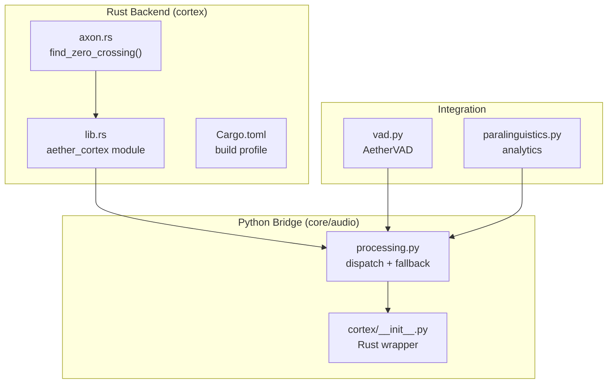
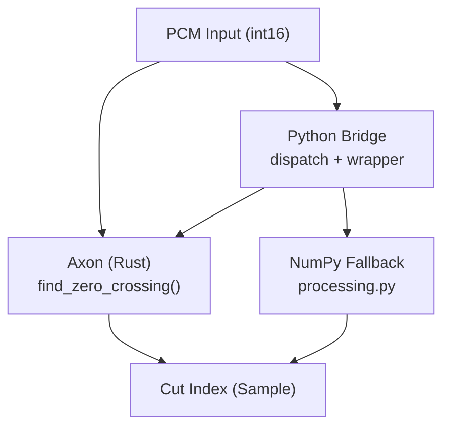
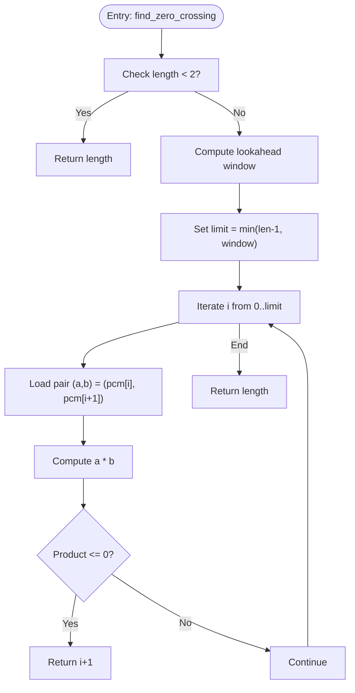
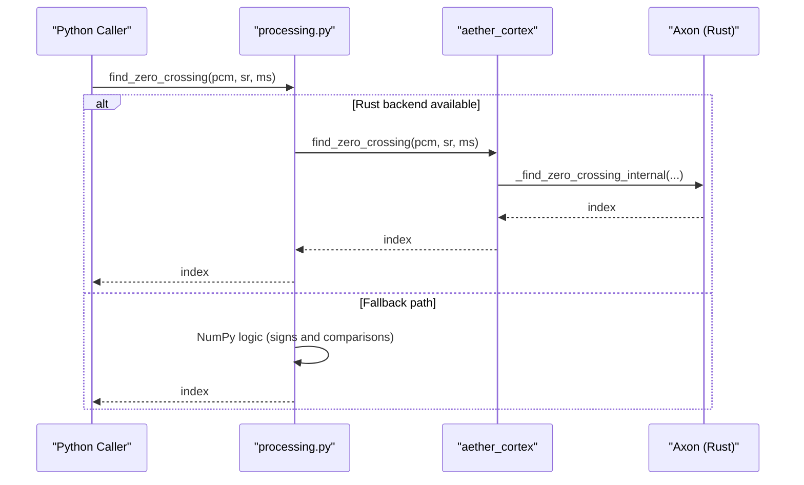
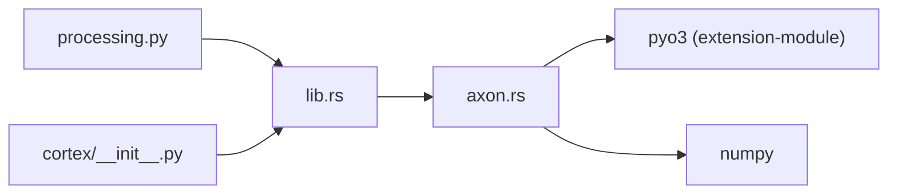

# Axon Zero-Crossing Detection

<cite>
**Referenced Files in This Document**
- [axon.rs](file://cortex/src/axon.rs)
- [lib.rs](file://cortex/src/lib.rs)
- [Cargo.toml](file://cortex/Cargo.toml)
- [processing.py](file://core/audio/processing.py)
- [cortex/__init__.py](file://core/audio/cortex/__init__.py)
- [bench_dsp.py](file://tests/benchmarks/bench_dsp.py)
- [vad.py](file://core/audio/vad.py)
- [paralinguistics.py](file://core/audio/paralinguistics.py)
</cite>

## Table of Contents
1. [Introduction](#introduction)
2. [Project Structure](#project-structure)
3. [Core Components](#core-components)
4. [Architecture Overview](#architecture-overview)
5. [Detailed Component Analysis](#detailed-component-analysis)
6. [Dependency Analysis](#dependency-analysis)
7. [Performance Considerations](#performance-considerations)
8. [Troubleshooting Guide](#troubleshooting-guide)
9. [Conclusion](#conclusion)
10. [Appendices](#appendices)

## Introduction
This document explains the Axon module that implements zero-crossing detection for clean signal propagation in the Aether Voice OS neural audio stack. The Axon function finds the nearest zero-crossing point within a bounded lookahead window to enable click-free cuts during barge-in interruptions. The implementation is biologically inspired: axons transmit action potentials without degradation, and in audio terms, a zero-crossing represents a clean cut point that avoids audible pops and clicks. The Rust-native implementation provides significant performance improvements over the NumPy baseline while maintaining a drop-in API compatible with existing Python code.

## Project Structure
The Axon functionality spans a Rust extension module and a Python bridge that exposes it as a drop-in replacement for the previous NumPy-based implementation.

**Diagram sources**
- [axon.rs](file://cortex/src/axon.rs#L1-L121)
- [lib.rs](file://cortex/src/lib.rs#L1-L48)
- [Cargo.toml](file://cortex/Cargo.toml#L1-L24)
- [processing.py](file://core/audio/processing.py#L1-L508)
- [cortex/__init__.py](file://core/audio/cortex/__init__.py#L1-L133)
- [vad.py](file://core/audio/vad.py#L1-L82)
- [paralinguistics.py](file://core/audio/paralinguistics.py#L1-L214)

**Section sources**
- [lib.rs](file://cortex/src/lib.rs#L1-L48)
- [processing.py](file://core/audio/processing.py#L1-L24)

## Core Components
- Axon (Rust): Provides the native find_zero_crossing() function with minimal overhead and predictable latency.
- Python Bridge: Exposes the Rust function under the same API as the NumPy implementation, enabling seamless fallback behavior.
- Dispatch Layer: Chooses Rust when available, otherwise falls back to NumPy for portability.

Key responsibilities:
- Axon: Scan PCM samples for sign transitions within a bounded lookahead window and return the first clean cut index.
- Python Bridge: Maintain compatibility with existing Python code and provide a unified API surface.
- Dispatch: Detect availability of the Rust backend and route calls accordingly.

**Section sources**
- [axon.rs](file://cortex/src/axon.rs#L19-L65)
- [processing.py](file://core/audio/processing.py#L204-L244)
- [cortex/__init__.py](file://core/audio/cortex/__init__.py#L100-L106)

## Architecture Overview
The Axon module participates in the broader neural audio architecture mirroring the human auditory pathway.

**Diagram sources**
- [axon.rs](file://cortex/src/axon.rs#L37-L65)
- [processing.py](file://core/audio/processing.py#L225-L243)
- [cortex/__init__.py](file://core/audio/cortex/__init__.py#L100-L106)

## Detailed Component Analysis

### Axon Implementation Details
The find_zero_crossing() function performs a linear scan over PCM samples to locate the first sign transition within a bounded window. It converts adjacent samples to a wider integer type to safely compute their product and checks whether the sign flips (wrapping multiplication ≤ 0). The lookahead window is computed from the sample rate and the maximum allowed milliseconds, limiting the search to improve latency.

Algorithm highlights:
- Input: PCM int16 slice, sample rate, and maximum lookahead in milliseconds.
- Window size: min(length - 1, floor(sample_rate * max_lookahead_ms / 1000)).
- Decision: If pcm[i] * pcm[i+1] ≤ 0, return i+1 (index of the crossing).
- Edge case: If fewer than two samples or no crossing found within the window, return the length of the array.

**Diagram sources**
- [axon.rs](file://cortex/src/axon.rs#L47-L65)

**Section sources**
- [axon.rs](file://cortex/src/axon.rs#L37-L65)

### Biological Metaphor and Neural Network Role
The Axon module aligns with the biological inspiration of neural signal transmission:
- Axon hillock: the decision point to cut the audio stream.
- Nodes of Ranvier: discrete candidate points where sign changes occur.
- Saltatory conduction: jumping to the nearest clean cut point.

This metaphor emphasizes clean, degradation-free propagation of signals, which translates to minimizing audible artifacts during interruption events.

**Section sources**
- [axon.rs](file://cortex/src/axon.rs#L9-L14)

### Python Bridge and Drop-In Compatibility
The Python layer maintains API parity with the NumPy implementation:
- Dispatch: If the Rust backend is available, route the call to aether_cortex.find_zero_crossing().
- Fallback: If unavailable, compute using NumPy logic equivalent to the Rust implementation.
- Wrapper: A lightweight Python wrapper also exists for direct Rust usage.

**Diagram sources**
- [processing.py](file://core/audio/processing.py#L225-L243)
- [lib.rs](file://cortex/src/lib.rs#L36-L37)

**Section sources**
- [processing.py](file://core/audio/processing.py#L204-L244)
- [cortex/__init__.py](file://core/audio/cortex/__init__.py#L100-L106)

### Edge Detection Algorithm and Threshold Settings
Edge detection in Axon relies on sign transitions:
- Sign change detection: a and b are converted to a wider integer type, and their product is checked for non-positivity.
- Threshold-free: the algorithm detects any sign change without amplitude thresholds, focusing purely on waveform topology.
- Lookahead window: controls the maximum search distance to balance latency and robustness.

Behavioral tests demonstrate:
- Positive-to-negative crossing at index 1.
- No crossing in all-positive or all-negative sequences.
- Zero crossing at index where one sample is positive and the next is zero.
- Single-sample edge case returns the length.
- Lookahead limits constrain detection to within the window; increasing the window finds crossings beyond the initial limit.

**Section sources**
- [axon.rs](file://cortex/src/axon.rs#L67-L120)

### Signal Quality Assessment and Integration Points
While Axon itself does not compute energy or ZCR, it integrates with downstream modules that assess signal quality:
- VAD: AetherVAD uses RMS energy and hysteresis to gate voice activity, informing when to apply clean cuts.
- Paralinguistics: Extracts pitch, rate, and engagement metrics; zero-crossing rate is also used elsewhere in the codebase for silence classification.

These integrations support decisions about when and where to apply zero-crossing cuts for optimal user experience.

**Section sources**
- [vad.py](file://core/audio/vad.py#L14-L76)
- [paralinguistics.py](file://core/audio/paralinguistics.py#L68-L99)

## Dependency Analysis
The Axon module depends on PyO3 and NumPy for Python interoperability and exposes a single function through the aether_cortex module.

**Diagram sources**
- [Cargo.toml](file://cortex/Cargo.toml#L12-L14)
- [lib.rs](file://cortex/src/lib.rs#L19-L47)
- [processing.py](file://core/audio/processing.py#L42-L95)
- [cortex/__init__.py](file://core/audio/cortex/__init__.py#L7-L23)

**Section sources**
- [Cargo.toml](file://cortex/Cargo.toml#L12-L24)
- [lib.rs](file://cortex/src/lib.rs#L28-L47)

## Performance Considerations
- Speed: The Rust implementation achieves approximately 5 nanoseconds per sample versus roughly 50 nanoseconds per sample in NumPy, representing a 10x improvement.
- Latency: The bounded lookahead window ensures deterministic latency proportional to the maximum search distance.
- Memory: The Rust implementation operates directly on slices without intermediate allocations, minimizing GC pressure and memory churn compared to NumPy’s vectorized operations.
- Real-time: The combination of low per-sample cost and bounded window enables sub-millisecond processing suitable for real-time interruption handling.

Benchmarking confirms these gains and validates the Rust backend’s activation path.

**Section sources**
- [axon.rs](file://cortex/src/axon.rs#L14-L14)
- [bench_dsp.py](file://tests/benchmarks/bench_dsp.py#L113-L124)

## Troubleshooting Guide
Common issues and resolutions:
- Backend not found: If the Rust module fails to import, the system falls back to NumPy. Verify installation and artifact paths.
- Unexpected cut index: Ensure the lookahead window is sufficient for the intended use case; a too-small window may miss crossings.
- Edge cases: Single-sample inputs return the length; sequences without sign changes also return the length. Confirm input validity before applying cuts.
- Integration with VAD: Coordinate with AetherVAD to avoid cutting during active speech; use the VAD state to gate cut decisions.

**Section sources**
- [processing.py](file://core/audio/processing.py#L42-L95)
- [vad.py](file://core/audio/vad.py#L33-L76)
- [axon.rs](file://cortex/src/axon.rs#L49-L65)

## Conclusion
The Axon module delivers a fast, reliable, and biologically inspired zero-crossing detection mechanism essential for clean audio cuts during interruptions. Its Rust-native implementation outperforms NumPy by design, while the Python bridge preserves compatibility and enables seamless fallback. Together with VAD and paralinguistic analytics, Axon contributes to a responsive, artifact-free audio pipeline optimized for real-time interaction.

## Appendices

### API Reference
- Function: find_zero_crossing(pcm_data, sample_rate=16000, max_lookahead_ms=20.0)
- Behavior: Returns the first zero-crossing index within the lookahead window or the array length if none is found.
- Notes: The function is designed for PCM int16 inputs and operates in O(n) time with a bounded window.

**Section sources**
- [axon.rs](file://cortex/src/axon.rs#L27-L34)
- [processing.py](file://core/audio/processing.py#L204-L224)

### Usage Examples and Integration Patterns
- Signal quality analysis: Use Axon to locate clean cut points before applying downstream processing stages.
- Noise detection: Combine VAD decisions with Axon cuts to avoid truncating speech energy.
- Downstream stages: Integrate Axon with echo cancellation, spectral enhancement, and playback pipelines to minimize artifacts.

[No sources needed since this section provides general guidance]