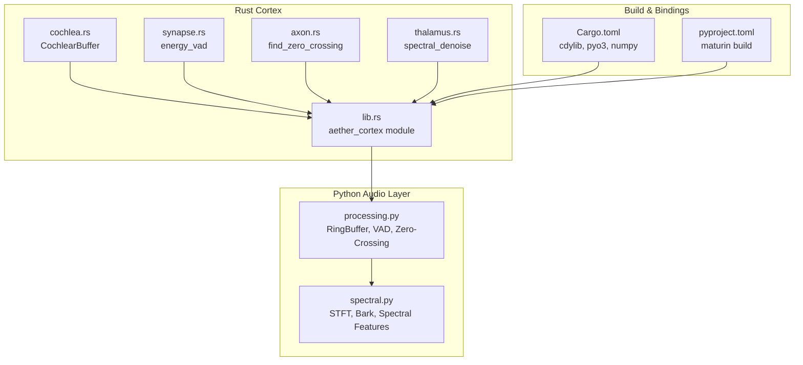
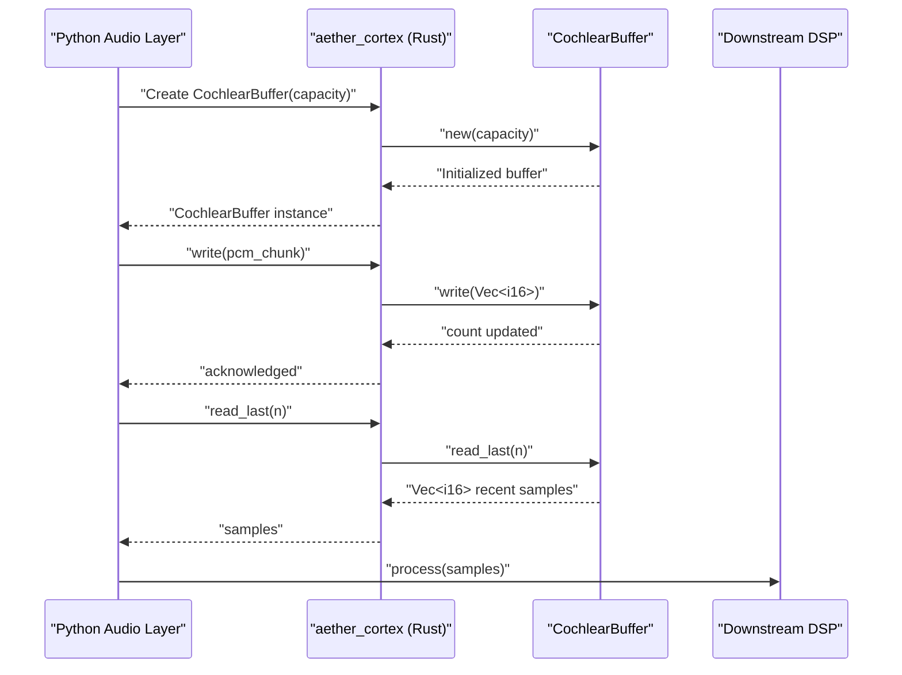
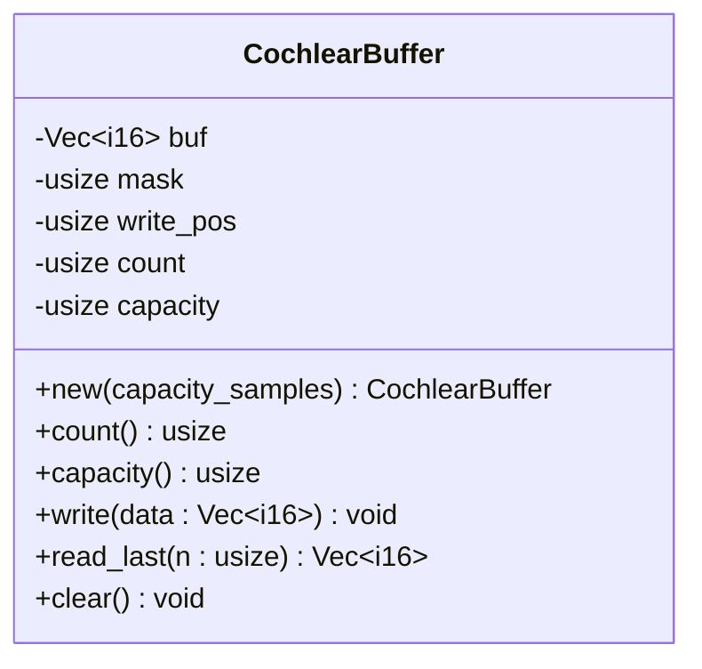
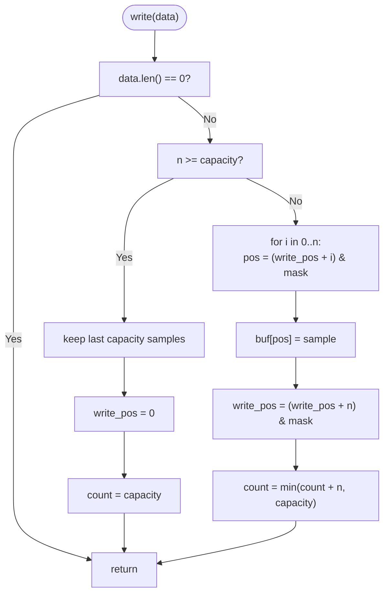
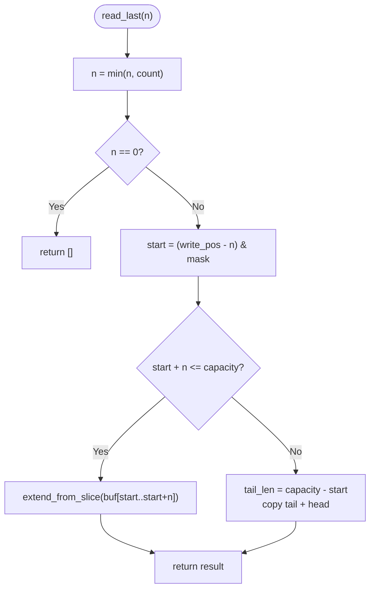
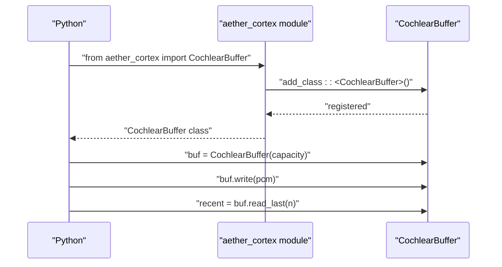
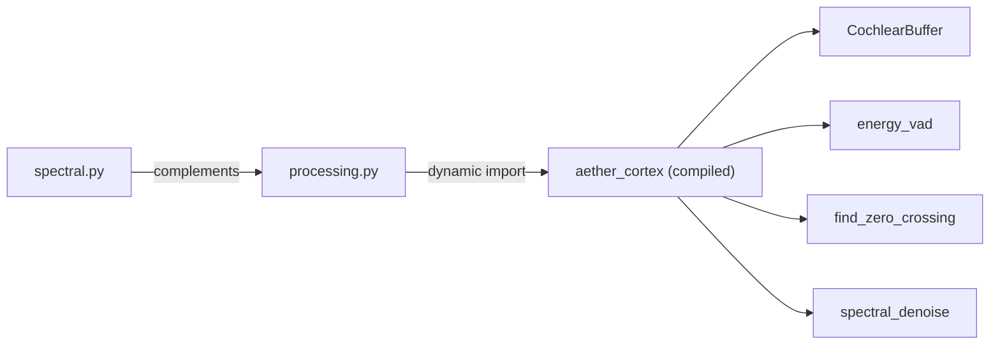

# Cochlea Simulation Module

<cite>
**Referenced Files in This Document**
- [cochlea.rs](file://cortex/src/cochlea.rs)
- [lib.rs](file://cortex/src/lib.rs)
- [Cargo.toml](file://cortex/Cargo.toml)
- [pyproject.toml](file://cortex/pyproject.toml)
- [processing.py](file://core/audio/processing.py)
- [spectral.py](file://core/audio/spectral.py)
- [test_cochlea.py](file://tests/unit/test_cochlea.py)
- [test_spectral.py](file://tests/unit/test_spectral.py)
</cite>

## Table of Contents
1. [Introduction](#introduction)
2. [Project Structure](#project-structure)
3. [Core Components](#core-components)
4. [Architecture Overview](#architecture-overview)
5. [Detailed Component Analysis](#detailed-component-analysis)
6. [Dependency Analysis](#dependency-analysis)
7. [Performance Considerations](#performance-considerations)
8. [Troubleshooting Guide](#troubleshooting-guide)
9. [Conclusion](#conclusion)
10. [Appendices](#appendices)

## Introduction
This document describes the Cochlea simulation module that implements a biologically-inspired circular buffer for audio signal processing. The module provides a high-performance ring buffer (CochlearBuffer) designed to mirror the human cochlea's function: continuously receiving audio input and providing windowed access to recent audio history for downstream processing such as voice activity detection and zero-crossing analysis. The implementation is written in Rust, exposes Python bindings via PyO3, and serves as a drop-in replacement for the NumPy-based RingBuffer in the audio processing pipeline.

## Project Structure
The Cochlea module is part of the Aether Cortex Rust library, which also includes related DSP primitives (Synapse for VAD, Axon for zero-crossing detection, and Thalamus for noise reduction). The Python audio processing layer provides a fallback to NumPy implementations and an automatic bridge to the Rust backend when available.

**Diagram sources**
- [cochlea.rs](file://cortex/src/cochlea.rs#L1-L213)
- [lib.rs](file://cortex/src/lib.rs#L1-L48)
- [processing.py](file://core/audio/processing.py#L1-L508)
- [spectral.py](file://core/audio/spectral.py#L1-L501)
- [Cargo.toml](file://cortex/Cargo.toml#L1-L24)
- [pyproject.toml](file://cortex/pyproject.toml#L1-L15)

**Section sources**
- [lib.rs](file://cortex/src/lib.rs#L1-L48)
- [Cargo.toml](file://cortex/Cargo.toml#L1-L24)
- [pyproject.toml](file://cortex/pyproject.toml#L1-L15)

## Core Components
- CochlearBuffer: A lock-free, power-of-2 capacity circular buffer for int16 PCM audio. It supports O(1) writes and contiguous or split reads for recent history.
- Python bridge: The aether_cortex module exposes CochlearBuffer and other DSP functions to Python via PyO3.
- Fallback layer: The Python audio processing module provides RingBuffer and VAD/zero-crossing functions with automatic Rust backend selection.

Key properties:
- Power-of-2 capacity with bitwise masking for branchless modulo
- Single or split memcpy reads for contiguity
- Fixed memory footprint with no garbage collection overhead
- Drop-in replacement for core.audio.processing.RingBuffer

**Section sources**
- [cochlea.rs](file://cortex/src/cochlea.rs#L17-L136)
- [lib.rs](file://cortex/src/lib.rs#L28-L47)
- [processing.py](file://core/audio/processing.py#L107-L202)

## Architecture Overview
The Cochlea module sits between the Python audio processing layer and downstream DSP primitives. It provides the foundational buffering mechanism that enables efficient windowed access to recent audio samples.

**Diagram sources**
- [lib.rs](file://cortex/src/lib.rs#L28-L47)
- [cochlea.rs](file://cortex/src/cochlea.rs#L36-L136)
- [processing.py](file://core/audio/processing.py#L85-L95)

## Detailed Component Analysis

### CochlearBuffer Implementation
CochlearBuffer is a PyO3-bound struct that encapsulates:
- Pre-allocated Vec<i16> storage
- Capacity bitmask for power-of-2 indexing
- Monotonically increasing write position with masking
- Count of valid samples
- Methods for write, read_last, and clear

**Diagram sources**
- [cochlea.rs](file://cortex/src/cochlea.rs#L22-L136)

#### Write Operation Flow

**Diagram sources**
- [cochlea.rs](file://cortex/src/cochlea.rs#L72-L96)

#### Read Last Operation Flow

**Diagram sources**
- [cochlea.rs](file://cortex/src/cochlea.rs#L103-L126)

#### Memory Management and Indexing
- Capacity is rounded up to the next power of 2 for branchless masking
- Bitmask equals capacity - 1; modulo is replaced by bitwise AND
- Writes and reads use wrapping arithmetic with the mask to avoid branches
- Fixed-size pre-allocation avoids runtime allocations in the hot path

**Section sources**
- [cochlea.rs](file://cortex/src/cochlea.rs#L17-L136)

### Python Binding Interface
The aether_cortex Python module exposes:
- CochlearBuffer class bound via #[pyclass]
- Functions for energy_vad, find_zero_crossing, and spectral_denoise
- Module metadata (__version__, __backend__)

**Diagram sources**
- [lib.rs](file://cortex/src/lib.rs#L28-L47)
- [cochlea.rs](file://cortex/src/cochlea.rs#L22-L136)

**Section sources**
- [lib.rs](file://cortex/src/lib.rs#L28-L47)
- [Cargo.toml](file://cortex/Cargo.toml#L12-L14)
- [pyproject.toml](file://cortex/pyproject.toml#L11-L15)

### Spectral Analysis Capabilities
While the Cochlea module focuses on buffering, the broader audio stack includes spectral analysis:
- STFT: Short-time Fourier Transform with configurable windowing and hop length
- Bark-scale: Psychoacoustic frequency band mapping
- Spectral features: Centroid, flatness, rolloff, flux, and Bark band energies
- Coherence estimation and ERLE computation

These components complement the Cochlea buffer by enabling frequency-domain processing on buffered windows.

**Section sources**
- [spectral.py](file://core/audio/spectral.py#L31-L334)

## Dependency Analysis
The Rust Cortex library depends on PyO3 for Python bindings and NumPy for array interoperability. The Python audio processing layer dynamically resolves the compiled Rust module and falls back to NumPy implementations when unavailable.

**Diagram sources**
- [processing.py](file://core/audio/processing.py#L42-L95)
- [lib.rs](file://cortex/src/lib.rs#L28-L47)

**Section sources**
- [Cargo.toml](file://cortex/Cargo.toml#L12-L14)
- [processing.py](file://core/audio/processing.py#L42-L95)

## Performance Considerations
- Time complexity:
  - Write: O(n) for n samples (single loop with masked assignment)
  - Read last: O(n) worst-case, often single memcpy with split read
- Memory:
  - Fixed allocation equal to capacity (power-of-2)
  - No Python object overhead per sample
- Comparison with Python NumPy:
  - The Rust implementation is designed to be 10–50x faster than NumPy for the equivalent operations
  - Achieved via: no GIL, no Python object overhead, branchless masking, and contiguous memory access
- Build profile:
  - Release optimized with LTO and stripped symbols for minimal overhead

**Section sources**
- [cochlea.rs](file://cortex/src/cochlea.rs#L9-L13)
- [Cargo.toml](file://cortex/Cargo.toml#L16-L21)
- [synapse.rs](file://cortex/src/synapse.rs#L14-L16)

## Troubleshooting Guide
Common issues and resolutions:
- Buffer overflow behavior:
  - When writing more than capacity, only the most recent capacity samples are retained
  - Verify expected behavior using tests that check wrap-around and large writes
- Empty operations:
  - Writing empty arrays or reading with n=0 returns immediately
  - Ensure upstream code handles these edge cases
- Clear semantics:
  - clear resets write position and count without reallocating
  - Use to reset state between sessions or after long gaps
- Python import resolution:
  - If the Rust backend is not found, the Python layer falls back to NumPy implementations
  - Confirm the compiled module exists and is importable

**Section sources**
- [cochlea.rs](file://cortex/src/cochlea.rs#L72-L136)
- [processing.py](file://core/audio/processing.py#L42-L95)
- [test_cochlea.py](file://tests/unit/test_cochlea.py#L1-L200)

## Conclusion
The Cochlea simulation module provides a high-performance, biologically-inspired circular buffer that enables efficient audio buffering and windowed access for downstream DSP. Its Rust implementation offers significant performance advantages over Python NumPy equivalents, while the Python bridge ensures seamless integration into the existing audio processing pipeline. Together with spectral analysis and other DSP primitives, it forms a complete, native-speed audio processing backbone for Aether Voice OS.

## Appendices

### Usage Examples
Below are example scenarios demonstrating buffer initialization, audio chunk insertion, and reading recent samples. Replace the code snippets with your actual PCM data and desired capacities.

- Initialize a buffer with a given capacity:
  - See [CochlearBuffer::new](file://cortex/src/cochlea.rs#L42-L53)
- Insert an audio chunk:
  - See [CochlearBuffer::write](file://cortex/src/cochlea.rs#L72-L96)
- Extract the most recent samples:
  - See [CochlearBuffer::read_last](file://cortex/src/cochlea.rs#L103-L126)
- Reset the buffer:
  - See [CochlearBuffer::clear](file://cortex/src/cochlea.rs#L132-L135)

For Python integration:
- Import and instantiate the buffer:
  - See [aether_cortex module registration](file://cortex/src/lib.rs#L28-L47)
- Fallback behavior and backend selection:
  - See [dynamic import logic](file://core/audio/processing.py#L42-L95)

### Data Serialization Between Rust and Python
- PyO3 bindings:
  - The module uses PyO3 to expose Rust structs and functions to Python
  - See [Cargo.toml pyo3 dependency](file://cortex/Cargo.toml#L13-L14)
- Array interop:
  - NumPy arrays are passed via PyReadonlyArray1 for zero-copy access
  - See [synapse.rs function signature](file://cortex/src/synapse.rs#L28-L43)
- Build configuration:
  - Maturin build backend produces a cdylib extension module
  - See [pyproject.toml tool.maturin](file://cortex/pyproject.toml#L11-L15)

**Section sources**
- [lib.rs](file://cortex/src/lib.rs#L28-L47)
- [Cargo.toml](file://cortex/Cargo.toml#L12-L14)
- [pyproject.toml](file://cortex/pyproject.toml#L11-L15)
- [synapse.rs](file://cortex/src/synapse.rs#L28-L43)