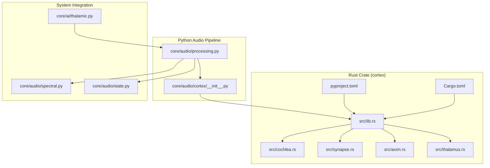
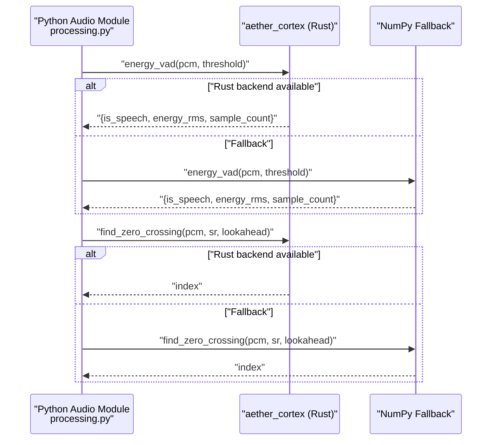
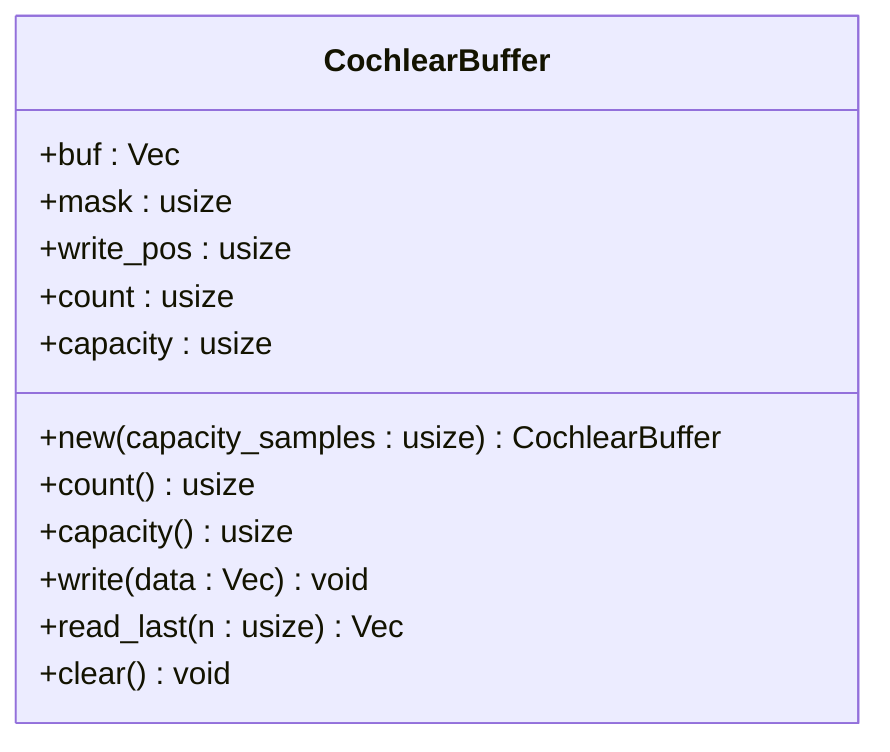
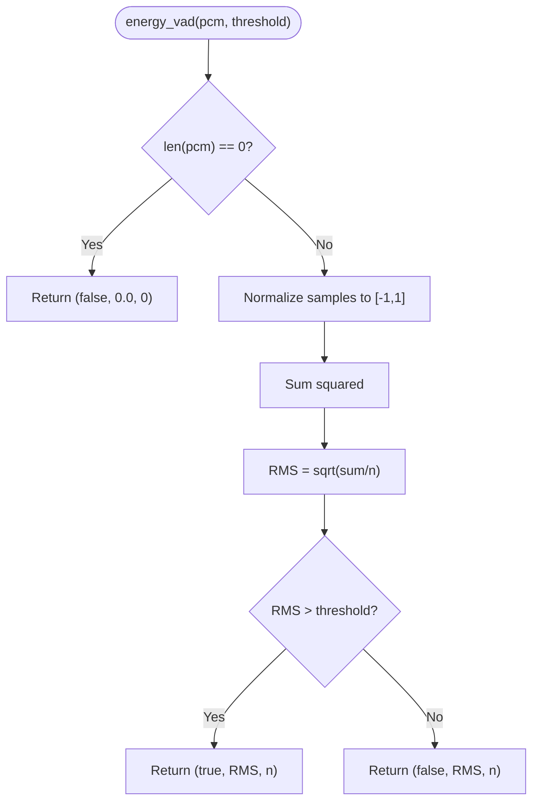
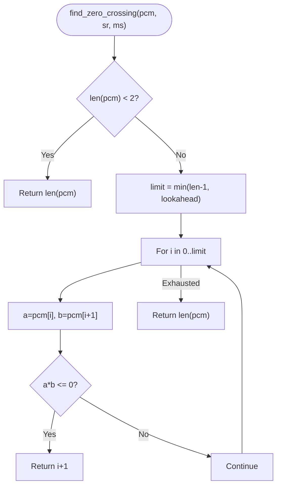
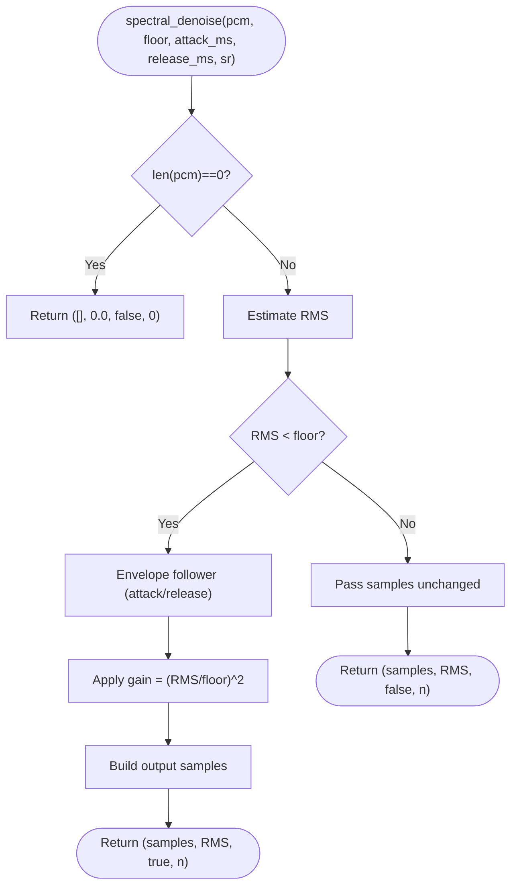
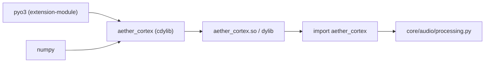
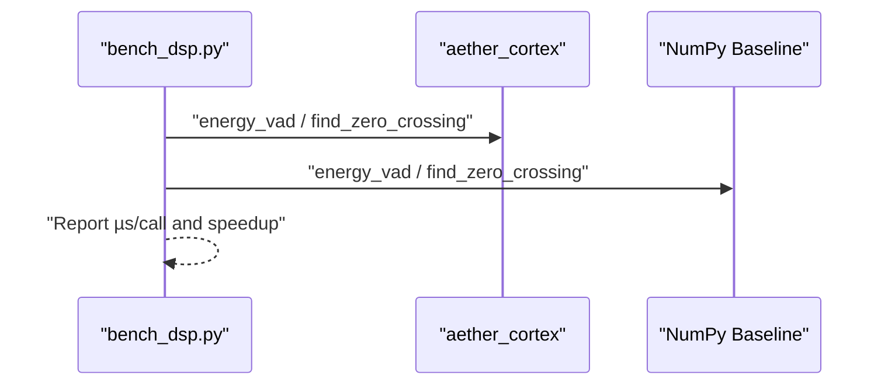
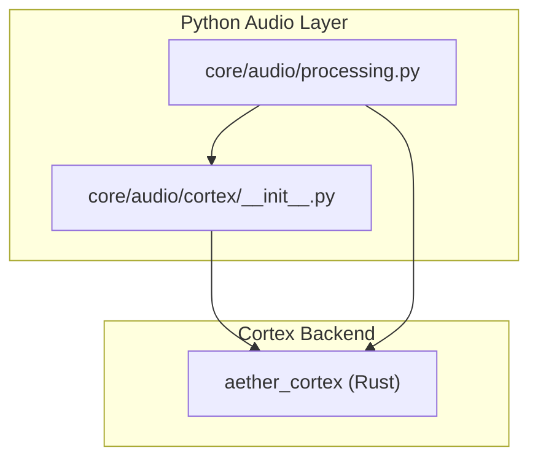

# Cortex Rust Audio Processing Core

<cite>
**Referenced Files in This Document**
- [Cargo.toml](file://cortex/Cargo.toml)
- [lib.rs](file://cortex/src/lib.rs)
- [cochlea.rs](file://cortex/src/cochlea.rs)
- [synapse.rs](file://cortex/src/synapse.rs)
- [axon.rs](file://cortex/src/axon.rs)
- [thalamus.rs](file://cortex/src/thalamus.rs)
- [pyproject.toml](file://cortex/pyproject.toml)
- [README.md](file://cortex/README.md)
- [processing.py](file://core/audio/processing.py)
- [__init__.py](file://core/audio/cortex/__init__.py)
- [bench_dsp.py](file://tests/benchmarks/bench_dsp.py)
- [cortex_report.json](file://tests/reports/cortex_report.json)
- [benchmark.py](file://infra/scripts/benchmark.py)
- [spectral.py](file://core/audio/spectral.py)
- [state.py](file://core/audio/state.py)
- [thalamic.py](file://core/ai/thalamic.py)
</cite>

## Table of Contents
1. [Introduction](#introduction)
2. [Project Structure](#project-structure)
3. [Core Components](#core-components)
4. [Architecture Overview](#architecture-overview)
5. [Detailed Component Analysis](#detailed-component-analysis)
6. [Dependency Analysis](#dependency-analysis)
7. [Performance Considerations](#performance-considerations)
8. [Troubleshooting Guide](#troubleshooting-guide)
9. [Compilation and Cross-Platform Compatibility](#compilation-and-cross-platform-compatibility)
10. [Integration Examples](#integration-examples)
11. [Conclusion](#conclusion)

## Introduction
This document describes the Cortex Rust audio processing core that powers Aether Voice OS. Cortex provides biologically inspired digital signal processing (DSP) primitives implemented in Rust and exposed to Python via a PyO3-based extension module. It accelerates audio processing beyond Python’s NumPy implementations, focusing on:
- Cochlea: a high-throughput circular buffer for PCM audio
- Synapse: energy-based voice activity detection (VAD)
- Axon: zero-crossing detection for clean audio cuts
- Thalamus: spectral noise reduction (placeholder for future FFT-based enhancement)

The Python audio pipeline transparently switches to the Rust backend when available, falling back to NumPy implementations otherwise. Benchmarks quantify the performance gains, and this document explains how to compile, integrate, and optimize Cortex for production use.

## Project Structure
Cortex is organized as a Rust library crate that builds into a Python extension module. The Python audio subsystem dynamically discovers and imports the compiled module, delegating DSP operations to Rust for speed.

**Diagram sources**
- [Cargo.toml](file://cortex/Cargo.toml#L1-L24)
- [lib.rs](file://cortex/src/lib.rs#L1-L48)
- [cochlea.rs](file://cortex/src/cochlea.rs#L1-L213)
- [synapse.rs](file://cortex/src/synapse.rs#L1-L117)
- [axon.rs](file://cortex/src/axon.rs#L1-L121)
- [thalamus.rs](file://cortex/src/thalamus.rs#L1-L154)
- [processing.py](file://core/audio/processing.py#L1-L508)
- [__init__.py](file://core/audio/cortex/__init__.py#L1-L133)
- [spectral.py](file://core/audio/spectral.py#L1-L501)
- [state.py](file://core/audio/state.py#L1-L129)
- [thalamic.py](file://core/ai/thalamic.py#L1-L122)

**Section sources**
- [Cargo.toml](file://cortex/Cargo.toml#L1-L24)
- [lib.rs](file://cortex/src/lib.rs#L1-L48)
- [processing.py](file://core/audio/processing.py#L1-L508)
- [__init__.py](file://core/audio/cortex/__init__.py#L1-L133)

## Core Components
Cortex exposes four DSP primitives through a single Python module. Each primitive is designed for zero-latency operation and minimal Python overhead.

- Cochlea: a circular buffer for PCM int16 audio with O(1) writes and safe windowed reads
- Synapse: RMS-based VAD returning speech decision, energy, and sample count
- Axon: zero-crossing detection for clean audio cuts within a lookahead window
- Thalamus: spectral noise reduction (placeholder; current implementation is a time-domain gate)

Each function is bound to Python using PyO3 and NumPy array interoperability, enabling seamless integration with the existing Python audio pipeline.

**Section sources**
- [lib.rs](file://cortex/src/lib.rs#L21-L47)
- [cochlea.rs](file://cortex/src/cochlea.rs#L17-L136)
- [synapse.rs](file://cortex/src/synapse.rs#L21-L62)
- [axon.rs](file://cortex/src/axon.rs#L19-L65)
- [thalamus.rs](file://cortex/src/thalamus.rs#L25-L112)

## Architecture Overview
Cortex sits between the Python audio pipeline and the rest of the system. The Python audio module attempts to import the compiled Rust extension; if successful, it delegates DSP operations to the Rust backend. Otherwise, it falls back to NumPy implementations.

**Diagram sources**
- [processing.py](file://core/audio/processing.py#L85-L95)
- [processing.py](file://core/audio/processing.py#L410-L434)
- [processing.py](file://core/audio/processing.py#L225-L243)
- [synapse.rs](file://cortex/src/synapse.rs#L29-L42)
- [axon.rs](file://cortex/src/axon.rs#L36-L44)

**Section sources**
- [processing.py](file://core/audio/processing.py#L38-L95)
- [processing.py](file://core/audio/processing.py#L225-L243)
- [processing.py](file://core/audio/processing.py#L410-L434)

## Detailed Component Analysis

### Cochlea: Circular Buffer for PCM Audio
Cochlea implements a lock-free, power-of-two–aligned circular buffer optimized for audio streaming. It supports:
- O(1) writes via bitwise masking
- Contiguous or split reads for windowed access
- Fixed memory footprint with no Python object overhead

**Diagram sources**
- [cochlea.rs](file://cortex/src/cochlea.rs#L17-L136)

**Section sources**
- [cochlea.rs](file://cortex/src/cochlea.rs#L17-L136)

### Synapse: Energy-Based VAD
Synapse performs RMS energy-based voice activity detection. It returns a speech decision, RMS energy, and sample count, enabling responsive UI feedback and aiding higher-level decisions.

**Diagram sources**
- [synapse.rs](file://cortex/src/synapse.rs#L46-L62)

**Section sources**
- [synapse.rs](file://cortex/src/synapse.rs#L21-L62)

### Axon: Zero-Crossing Detection
Axon finds the first clean cut point for audio barge-in scenarios. It scans forward within a bounded lookahead window and returns the index of the first zero-crossing.

**Diagram sources**
- [axon.rs](file://cortex/src/axon.rs#L47-L65)

**Section sources**
- [axon.rs](file://cortex/src/axon.rs#L19-L65)

### Thalamus: Spectral Denoiser (Placeholder)
Thalamus implements a time-domain noise gate with exponential smoothing. It estimates RMS energy, applies an envelope follower, and attenuates samples below a noise floor. A future iteration will add FFT-based spectral subtraction.

**Diagram sources**
- [thalamus.rs](file://cortex/src/thalamus.rs#L66-L112)

**Section sources**
- [thalamus.rs](file://cortex/src/thalamus.rs#L25-L112)

## Dependency Analysis
Cortex depends on PyO3 and numpy for Python interoperability. The Rust crate compiles to a cdylib shared library suitable as a Python extension module. The Python audio module dynamically resolves the compiled module from standard locations or build artifacts.

**Diagram sources**
- [Cargo.toml](file://cortex/Cargo.toml#L12-L14)
- [lib.rs](file://cortex/src/lib.rs#L29-L46)
- [processing.py](file://core/audio/processing.py#L42-L95)

**Section sources**
- [Cargo.toml](file://cortex/Cargo.toml#L12-L14)
- [lib.rs](file://cortex/src/lib.rs#L29-L46)
- [processing.py](file://core/audio/processing.py#L42-L95)

## Performance Considerations
- Backend selection: The Python audio module attempts to import the compiled Rust module and logs whether the neural DSP backend is active. When unavailable, it falls back to NumPy.
- Benchmarking: A dedicated benchmark compares Rust and NumPy implementations for VAD and zero-crossing detection on typical 30 ms frames. Results show significant speedup with the Rust backend.
- Memory and CPU: Benchmarks and end-to-end audits measure latency percentiles and memory allocation to ensure zero-allocation hot paths and minimal GC impact.

**Diagram sources**
- [bench_dsp.py](file://tests/benchmarks/bench_dsp.py#L76-L134)

**Section sources**
- [processing.py](file://core/audio/processing.py#L85-L95)
- [bench_dsp.py](file://tests/benchmarks/bench_dsp.py#L76-L134)
- [cortex_report.json](file://tests/reports/cortex_report.json#L1-L7)
- [benchmark.py](file://infra/scripts/benchmark.py#L156-L196)

## Troubleshooting Guide
Common issues and resolutions:
- Rust module not found: The Python audio module attempts multiple import strategies, including dynamic resolution from build artifacts. If both fail, it logs a warning and falls back to NumPy.
- Performance degraded: Verify that the compiled module is discoverable and that the Rust backend is selected. Confirm the presence of the compiled artifact and correct module name.
- Integration problems: Ensure the Python audio wrapper imports the Rust module and that the module name matches the build configuration.

**Section sources**
- [processing.py](file://core/audio/processing.py#L42-L95)
- [__init__.py](file://core/audio/cortex/__init__.py#L7-L23)

## Compilation and Cross-Platform Compatibility
Cortex builds as a Python extension module using Maturin. The build system targets Python 3.10+ and exposes a module named “aether_cortex”.

Build steps:
- Development: Install in editable mode or use Maturin develop.
- Release: Build a wheel for distribution.

Cross-platform notes:
- The crate compiles to a cdylib shared library suitable for macOS and Linux. Windows support requires appropriate toolchains and linking.
- The Python audio wrapper includes dynamic resolution logic to locate the compiled artifact from standard locations or build outputs.

**Section sources**
- [README.md](file://cortex/README.md#L1-L45)
- [pyproject.toml](file://cortex/pyproject.toml#L1-L15)
- [Cargo.toml](file://cortex/Cargo.toml#L1-L24)
- [processing.py](file://core/audio/processing.py#L42-L95)

## Integration Examples
Cortex integrates seamlessly with the Python audio pipeline:
- The Python audio module attempts to import the compiled Rust module and delegates DSP functions when available.
- The Python wrapper provides a thin shim around the Rust module, converting lists to/from NumPy arrays and mirroring API shapes.
- The broader audio system (state, spectral analysis, and AI routing) remains agnostic of the backend choice.

**Diagram sources**
- [__init__.py](file://core/audio/cortex/__init__.py#L1-L133)
- [processing.py](file://core/audio/processing.py#L1-L508)

**Section sources**
- [__init__.py](file://core/audio/cortex/__init__.py#L1-L133)
- [processing.py](file://core/audio/processing.py#L1-L508)

## Conclusion
Cortex delivers a high-performance, biologically inspired audio DSP layer implemented in Rust and exposed to Python. Its primitives—Cochlea, Synapse, Axon, and Thalamus—accelerate critical audio processing tasks, reduce latency, and minimize Python overhead. The Python audio pipeline automatically selects the Rust backend when available, with robust fallbacks. Benchmarks demonstrate substantial speedups, and the system includes comprehensive diagnostics and reporting for latency and memory usage. With straightforward build and integration steps, Cortex enables Aether Voice OS to achieve sub-millisecond audio processing latencies essential for real-time responsiveness.